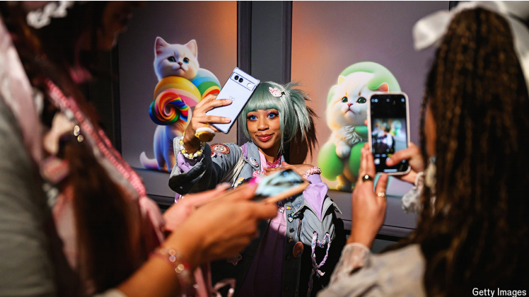
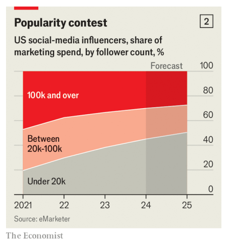

# Too many people want to be social-media influencers

That is good for companies but bad for “creators”

influencers：网红

请注意下文中有些地方被翻译成有影响力的人，懒得改正了，大家知道是网红的意思就行。

原文：

**A**SK A YOUNG person what they would like to do with their life

and increasingly often the answer will be to find fame and fortune

online. Fully 57% of Gen Zs in America would like to be a social

media influencer, according to Morning Consult, a pollster; 53%

describe it as a “reputable career choice”. Those dreams may be

understandable: examples abound of social-media superstars, from

fashionistas and comedians to gamers, making tens of thousands of

dollars for a post promoting the wares of some brand. As

consumers spend more of their lives on social media, the amount of

money companies are paying influencers is rocketing.

问一个年轻人他们想做什么，越来越多的答案是在网上寻找名利。根据民意调查机构Morning Consult的调查，美国足足有57%的Zs一代希望成为社交媒体的网红；53%的人将其描述为“声誉良好的职业选择”。这些梦想可能是可以理解的:从时尚人士、喜剧演员到游戏玩家，社交媒体超级明星的例子比比皆是，他们通过发布某个品牌商品的广告赚取数万美元。随着消费者在社交媒体上花费越来越多的时间，公司支付给网红的金额也在飙升。

学习：

young person：年轻人；青年；少年；青少年

fame and fortune：名利

fashionistas：美 [ˌfæʃnˈiːstəz] 时尚达人；超级时尚迷；高级女装设计师；（fashionista的复数）

wares：货物；商品；制品；（ware的复数）

原文：

Yet as the industry has grown, it has also changed. Spoiled for

choice, companies have shifted their attention towards influencers

creating content for narrower audiences, such as fashion tips for the

over 60s or gardening advice for inner-city dwellers, to better target

those consumers. Cultivating a small fan base in a niche area may

earn hobbyists some extra cash, but it will rarely be enough for

them to quit their day job. Those who fantasise about making a

living as a social-media star may thus be heading for

disappointment.

然而，随着该行业的发展，它也发生了变化。由于选择过多，公司已经将注意力转移到为较窄的受众创建内容的有影响力的人身上，例如为60岁以上的人提供时尚建议或为市中心居民提供园艺建议，以更好地瞄准这些消费者。在一个小众领域培养一个小的粉丝群可能会为业余爱好者赚取一些额外的现金，但这很少足以让他们放弃他们的日常工作。因此，那些幻想以社交媒体明星为生的人可能会失望。

学习：

fan base：粉丝群体

fantasise：幻想

>这里的 **"spoiled for choice"** 意思是**“选择过多”**或**“可选项非常丰富”**，通常带有**享有多种选择**的意思。在这句话中，意思是随着行业的发展，市场上的选择越来越多，公司因此将注意力转向了内容更有针对性的网红，以满足特定的观众群体需求。
>
>类似的用法示例如下：
>
>- **"With so many restaurants in the city, food lovers are spoiled for choice."**
>  - **城里有这么多餐厅，吃货们简直挑花了眼。**
>- **"Nowadays, consumers are spoiled for choice when it comes to buying electronic gadgets."**
>  - **如今，在选购电子产品时，消费者有非常多的选择。**
>
>在这个上下文中，这种选择丰富带来了一种竞争环境，公司选择关注细分市场的影响者，以更好地触达目标消费者。

原文：

Companies have been increasing the share of their marketing

budgets they hand over to influencers. Over the past five years,

American firms have roughly tripled their spending on influencer

marketing, to $7bn, according to eMarketer, a research firm. In a

survey by the Influencer Marketing Hub, another research group,

86% of brands globally said they plan to spend on influencer

marketing this year, up from 37% in 2017, when the survey was

first conducted. Nearly a quarter intend to spend over 40% of their

marketing budget on influencer campaigns.

公司一直在增加交给有影响力的人的营销预算份额。根据研究公司eMarketer的数据，在过去五年中，美国公司在影响者营销上的支出大约增加了两倍，达到70亿美元。在另一家研究机构Influencer Marketing Hub的一项调查中，全球86%的品牌表示，他们计划今年在Influencer Marketing上投资，高于2017年首次进行调查时的37%。近四分之一的人打算将超过40%的营销预算用于影响者活动。

原文：

Companies realise that influencers—or “creators”, as many prefer

to be called—have become integral to how consumers shop.

According to research by Northwestern University and LTK, a 

platform that connects influencers with brands, nearly three

quarters of Gen Zs in America have relied on influencers to help

them choose products to buy. More surprisingly, so have a third of

consumers who are boomers or older (see chart 1).

企业意识到，有影响力的人——或者许多人喜欢被称为“创造者”——已经成为消费者购物方式中不可或缺的一部分。根据西北大学和LTK(一个连接影响者和品牌的平台)的研究，美国近四分之三的z世代依赖影响者来帮助他们选择要购买的产品。更令人惊讶的是，三分之一的婴儿潮一代或更老的消费者也是如此(见图表1)。

原文：

Influencers are part of every big campaign nowadays, says Mark

Read, the boss of WPP, which owns advertising agencies such as

Ogilvy and Mindshare. Walmart, a giant American retailer, has

worked with TikTok stars Charli and Dixie D’Amelio. BOSS, a

fancy clothing brand, has collaborated with Khaby Lame, a

comedian with more followers than anyone else on TikTok. Louis

Vuitton, a luxury stalwart, has run campaigns with Emma

Chamberlain, a YouTuber. For the past few years influencers have

even starred in Super Bowl ads alongside Hollywood royalty and

chart-topping pop stars. The biggest influencers now hire legions of

staff to help them create eye-catching posts, while agencies and

other middlemen help them land and manage brand deals.

拥有奥美和Mindshare等广告公司的WPP公司老板Mark Read说，影响者是当今每一场大型活动的一部分。美国零售巨头沃尔玛已经与抖音明星查理和迪克西·达梅里奥合作。高档服装品牌BOSS与喜剧演员Khaby Lame合作，后者在抖音拥有比任何人都多的追随者。奢侈品牌路易威登与YouTuber上的艾玛·张伯伦(Emma Chamberlain)合作过广告。在过去的几年里，有影响力的人甚至与好莱坞皇室成员和排行榜首位的流行歌星一起出演超级碗的广告。最红的人现在雇佣大量员工来帮助他们创造引人注目的帖子，而代理机构和其他中间商则帮助他们获得和管理品牌交易。

学习：

advertising agencies ：广告公司

stalwart：坚定的支持者；忠实支持者；坚定分子

chart-topping：排行榜冠军的；登顶榜单的；名列前茅的；热门的          

原文：

Such stories have lured a growing number of people to try their

hand at being an influencer. Goldman Sachs, a bank, estimates that

as of last year there were more than 50m influencers globally, and

reckons their ranks are swelling by between 10% and 20%

annually.

这样的故事吸引了越来越多的人尝试成为网红。高盛银行估计，截至去年，全球有超过5000万名网红，并认为他们的人数正以每年10%到20%的速度增长。

学习：

lure：吸引

swell：扩大，增多

ranks：队伍；等级；（rank的复数）

原文：

The surging supply of influencers has been a boon for companies

that use them to sell their products. Celebrity influencers may be

helpful for building awareness of a brand or altering how it is

perceived by shoppers, but when it comes to persuading people to

buy something, marketers look to the long tail of creators with

small but engaged groups of followers.

网红的激增对利用他们销售产品的公司来说是一个福音。有名的网红可能有助于建立品牌意识或改变购物者对品牌的看法，但在说服人们购买某样东西时，营销人员会关注创造者的长尾理论，即拥有小规模但积极参与的追随者群体。

学习：

boon：福音

marketer：美 ['mɑkɪtə(r)]  市场营销人员

原文：

Since 2021 the share of spending on influencer marketing in

America taken by creators with more than 1m followers has fallen

from 15% to 8%; the share taken by those with fewer than 20,000

followers has surged from 20% to 45% (see chart 2). Marketing

agencies help companies manage contracts with many such

influencers, sometimes using artificial intelligence (AI) to scout out

those whose audiences best match their needs.

自2021年以来，拥有超过100万粉丝的创作者在美国网红营销上的支出份额从15%下降到8%；粉丝少于20，000的人所占的份额从20%飙升至45%(见图表2)。营销机构帮助公司管理与许多此类网红的合同，有时使用人工智能(AI)来搜寻那些受众最符合他们需求的人。

学习：

scout out：寻找，物色

>这里的 **"scout out"** 意思是**“寻找”**或**“物色”**，通常指仔细搜寻或识别出符合特定需求的人或事物。在这里，**"scout out"** 表示营销公司利用人工智能来**找出与公司目标受众最匹配的网红**，以便更精准地进行营销推广。
>
>类似的用法示例如下：
>
>- **"The company uses social media to scout out talented young designers."**
>  - **公司利用社交媒体寻找有才华的年轻设计师。**
>- **"We need to scout out a location for the new store that attracts the right customer base."**
>  - **我们需要为新店找一个能吸引目标客户的合适地点。**
>
>在此上下文中，**scout out** 反映了公司通过数据和技术手段，从众多小型网红中寻找符合品牌需求的合适人选。

原文：

For those hoping to make a career out of their social-media

presence, however, the proliferation of social-media influencers

should be a cause for concern. Only 4% of creators earn $100,000 a

year or more from the work, according to Goldman Sachs. AI could

worsen the situation, as “virtual influencers” begin to crowd social

media feeds: Aitana López, a gamer and fitness guru with pink hair

and a face so symmetrical it could only have been generated by a

computer, has 330,000 followers on Instagram.

然而，对于那些希望通过社交媒体成就事业的人来说，社交媒体网红的激增应该引起关注。据高盛(Goldman Sachs)称，只有4%的创作者每年从作品中获得10万美元或以上的收入。人工智能可能会恶化这种情况，因为“虚拟网红”开始挤满社交媒体反馈:游戏玩家和健身大师艾塔娜·洛佩兹(Aitana López)有着粉红色的头发和一张只有电脑才能生成的对称脸，在Instagram上有33万名粉丝。

学习：

proliferation：美 [prəˌlɪfəˈreɪʃn] 迅速增长；扩散；

cause for concern：引起关切；造成担忧；担忧的理由          

guru：专家；权威；导师；大师；

fitness guru：健身大师

crowd social-media feeds：虚拟网红开始占据用户的社交媒体页面

>这里的 **"crowd social-media feeds"** 指的是**“挤满社交媒体动态”**，即大量**虚拟网红开始占据用户的社交媒体页面**。在这种情况下，虚拟网红不断出现在动态中，给观众带来了更大的信息量，也使得内容竞争更加激烈。这种现象可能会让那些依靠社交媒体谋生的真实网红面临更大的压力，因为虚拟网红可以低成本、大规模地产生内容。
>
>类似的用法示例如下：
>
>- **"Advertisements crowd my social media feeds, making it hard to see posts from friends."**
>  - **广告占满了我的社交媒体动态，让我很难看到朋友的帖子。**
>
>在这个背景下，**crowd feeds** 描述了虚拟网红的大量涌现如何影响用户的观看体验，同时也增加了真实网红的竞争难度。

原文：

The glut of influencers is also making online fame yet more fickle.

Even if a post goes viral, that doesn’t mean an influencer’s career is

set, says Joe Gagliese, co-founder of Viral Nation, a marketing

agency. “If they’re not careful to make the most of that, there is

another creator right behind them,” he says. “This industry is

extremely volatile,” points out Vanessa Chen, a fashion influencer

better known by her Instagram name Vivacious Honey. To diversify

her income, she recently launched her own clothing line. Many

others have done something similar.

过多的网红也让网络名声变得更加易变。营销机构Viral Nation的联合创始人乔·加格利斯(Joe Gagliese)表示，即使一个帖子像病毒一样传播开来，也并不意味着一个网红的职业生涯已经定型。“如果他们不小心充分利用这一点，他们背后就有另一个创造者，”他说。“这个行业非常不稳定，”时尚网红Vanessa Chen指出，她在Instagram上的名字Vivacious Honey更为人所知。为了增加收入，她最近推出了自己的服装系列。许多其他人也做了类似的事情。

学习：

glut：过剩；充斥；供应过量

fickle：易变的；反复无常的；变幻无常的；不稳定的；

vivacious：美 [vəˈveɪʃəs] 活泼的；快活的；有生气的

clothing line：服装系列

>这里的 **“clothing line”** 是指 **时尚网红 Vanessa Chen（Vivacious Honey）** 推出的 **服装品牌或系列**。在这个例子中，她通过创办自己的服装品牌来多元化收入来源。这对于许多网红来说是常见的选择，因为服装品牌可以帮助他们利用自己的粉丝群体，增加收入来源，尤其是在网红行业高度竞争和不稳定的情况下。

原文：

There is another problem with the flood of influencers online:

consumers are growing weary of all those ads dressed up as

entertainment. In a survey last year McKinsey, a consultancy, found

that 68% of fashion consumers globally were unhappy with the

amount of sponsored content on social media.

网红的泛滥还有另一个问题:消费者越来越厌倦所有这些装扮成娱乐的广告。咨询公司麦肯锡在去年的一项调查中发现，全球68%的时尚消费者对社交媒体上的赞助内容不满意。

学习：

weary of：厌烦；疲倦；对…失去兴趣          

原文：

Influencers first took off because consumers thought of them as

“people they could trust”, says Anita Balchandani of McKinsey. To

remain influential they need to strike a balance between getting

paid and convincing followers they are still “authentic”, one of the

industry’s favourite buzzwords. Being popular, it seems, is harder

than ever. ■

麦肯锡的Anita Balchandani说，网红首先事业有起色是因为消费者认为他们是“可以信任的人”。为了保持影响力，他们需要在获得报酬和让追随者相信他们仍然是“真实的”之间取得平衡，这是该行业最受欢迎的流行语之一。受欢迎似乎比以往任何时候都难。■

学习：

buzzword：流行词汇；时髦术语；热门词语；潮流词

## 后记

2024年11月7日19点05分于上海。

