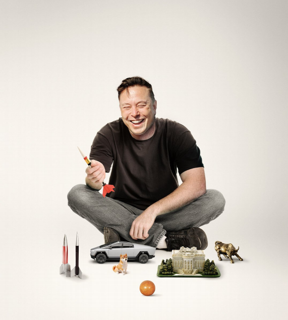

# The opportunities—and dangers—for Trump’s disrupter-in-chief

Elon Musk is given the ultimate target: America’s government

**“特朗普的‘首席颠覆者’所面临的机遇与危险”**

**“埃隆·马斯克被赋予了最终的目标：改造美国政府。”**

disrupter-in-chief:

>
>
>**意思是：** **“首席颠覆者”** 或 **“主要破局者”**，是一个比喻的说法，用来描述在特定领域中以颠覆现状、引发变革为主要特点的人。在这里，Elon Musk 被形容为在特朗普政府中担任主要“颠覆者”的角色，可能是因为他打破常规的做事风格和巨大的影响力。
>
>**例句：**
>
>- "She’s the disrupter-in-chief of the tech industry, always challenging the norms."
>  她是科技行业的首席颠覆者，总是在挑战常规。

is given:

>
>
>**意思是：** **“被赋予”** 或 **“被交付”**，表示某人被授予某种任务、责任或目标。在这里，Elon Musk 被赋予了一个最终目标——改造美国政府。
>
>**例句：**
>
>- "He was given the responsibility to lead the team through the crisis."
>  他被赋予了带领团队度过危机的责任。

原文：

**I**N 2017 ELON MUSK branded Donald Trump a “con man” and

“one of the world’s best bullshitters”. Now he is known at Mar-a

Lago as Uncle Elon and is in the president-elect’s inner circle. This

week they watched a rocket launch together. The alliance of the

world’s leading politician and its richest man creates a

concentration of power both want to use to explosive effect: to

slash bureaucracy, detonate liberal orthodoxies and deregulate in

the name of growth.

2017年，埃隆·马斯克将唐纳德·特朗普称为“骗子”和“世界上最好的骗子之一”。现在他在Mar-a-Lago被称为Elon叔叔，是当选总统的核心成员。本周，他们一起观看了火箭发射。世界领先的政治家和世界首富的联盟创造了一种权力集中，两人都想利用这种权力产生爆炸性的效果:以增长的名义，削减官僚机构，颠覆自由主义正统观念，放松管制。

学习：

