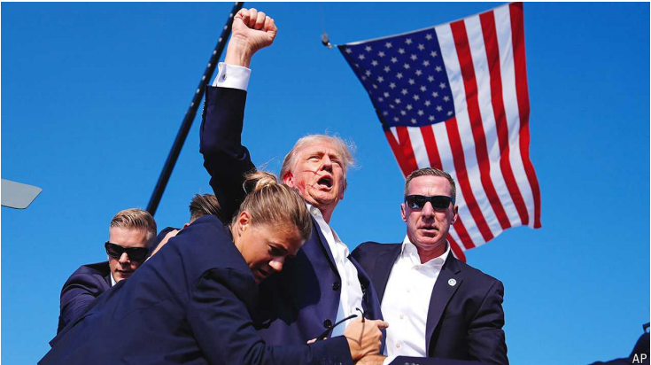

# The world this year 2024

原文：

In a remarkable comeback **Donald Trump** was elected as America’s

president for a second time. Six months before the vote Mr Trump was

found guilty of falsifying business records in a hush-money case, the first

criminal conviction handed to anyone who has sat in the Oval Office. In July

a gunman tried to assassinate the Republican at a campaign event, slightly

wounding him; Mr Trump’s rallying cry of “Fight, fight, fight!” energised

his base. Kamala Harris’s “brat summer” turned out to be a damp squib for

the Democrats, who also lost control of the Senate at the election. Ms Harris

became the Democratic candidate when Joe Biden pulled out of the race

after a disastrous debate for him.

唐纳德·特朗普(Donald Trump)出人意料地再次当选美国总统。在投票前6个月，	特朗普被判在一桩封口费案件中伪造商业记录，这是入主椭圆形办公室的人首次被判有罪。7月，一名持枪者试图在一次竞选活动中刺杀这位共和党人，使他受了轻伤；特朗普的战斗口号“战斗，战斗，战斗！”激发了他的选民团体。卡玛拉·哈里斯的“brat summer”对民主党来说是一记哑炮，他们也在选举中失去了对参议院的控制。乔·拜登在一场灾难性的辩论后退出竞选，哈里斯女士成为民主党候选人

学习：

falsify：伪造

falsifying business records 

hush-money：封口费

Oval Office： 美 [ˈoʊvl]

rallying cry：战斗口号；团结口号；集会口号          

squib： 美 [skwɪb] 短评；短新闻；讽刺短文；小爆竹；小鞭炮

a damp squib：哑炮；令人失望的事；令人扫兴的事          

## **I could never be president**

原文：

**Elon Musk** aligned himself with Mr Trump and spent $277m backing the

Republicans. His wealth has risen by $170bn since the election, thanks

mostly to the increase in the value of his Tesla stock

埃隆·马斯克(Elon Musk)与特朗普结盟，并斥资2.77亿美元支持共和党。自大选以来，他的财富增加了1700亿美元，这主要归功于他所持特斯拉股票的增值

学习：

align：使结盟

原文：

**Israel** invaded **Lebanon**, after Hizbullah intensified its rocket attacks. In

preparation for its offensive Israel injured or killed thousands of Hizbullah

operatives by tapping and exploding their pagers and Israeli forces went

about eliminating the Iranian-backed militia’s leadership, including Hassan

Nasrallah, its long-serving head. The leadership of **Hamas** was also all but

wiped out. Yahya Sinwar, the mastermind of the terror attacks on October

7th 2023, was killed sitting in a chair. In April Iran launched its first direct

missile attack on Israel. America, Britain, France, Jordan and other Arab

states contributed to Israel’s defence.

在真主党加强火箭袭击后，以色列入侵了黎巴嫩。为了准备进攻，以色列通过窃听和引爆他们的传呼机伤害或杀死了数千名真主党特工，以色列军队着手清除伊朗支持的民兵组织的领导层，包括其长期任职的领导人哈桑·纳斯鲁拉。哈马斯的领导层也几乎被消灭。2023年10月7日恐怖袭击的主谋叶海亚·辛瓦尔坐在椅子上被杀。4月，伊朗对以色列发动了首次直接导弹袭击。美国、英国、法国、约旦和其他阿拉伯国家为以色列的防务做出了贡献。

学习：

Hizbullah：真主党；希兹布拉；

intensified：变强；加强；加剧；（intensify的过去式和过去分词）

offensive：攻势；进攻；攻击；

operatives： 美 [ˈɑpərətɪvz] 技工；侦探；工作人员；（尤指政府的）特工人员；（operative的复数）

tap：（在电话上）安装窃听器

pager： 美 [ˈpeɪdʒər]   寻呼机；传呼机；呼叫器

militia：美 [məˈlɪʃə] 民兵组织；国民卫队；非正规军队

all but：几乎；差不多

mastermind：策划者；主谋；策略家；创意者；幕后操纵者

原文：

The war in **Gaza** ground on, even though Hamas found itself increasingly

isolated and boxed in. There was no let-up in the misery for ordinary Gazans

caught up in the fighting, and aid agencies warned of possible famine. In

December Israel and Hamas seemed to be moving closer to a ceasefire.

加沙的战争仍在继续，尽管哈马斯发现自己越来越孤立无援。陷入战争的普通加沙人的痛苦丝毫没有减轻，援助机构警告说可能会发生饥荒。12月，以色列和哈马斯似乎更接近停火。

学习：

ground on：持续，延续

>**"Ground on"** 是一个短语，意味着**持续或延续**，通常指某事持续进行，虽然可能变得乏力或进展缓慢。在这里，"the war in Gaza ground on" 表示战争**持续进行**，即便进展缓慢且形势严峻。
>
>- 例句：
>  - **English**: "The negotiations ground on for weeks without any clear resolution."
>    **中文**: “谈判持续了几周，始终没有明确的解决方案。”
>  - **English**: "The debate ground on despite the mounting frustration of the participants."
>    **中文**: “辩论持续进行，尽管参与者的沮丧情绪不断增加。”

boxed in：被困住

>**"Boxed in"** 表示**被困住或限制行动空间**，通常指一个人或团体被困在某个地方，或者由于某种原因无法自由行动或逃脱。在这个上下文中，"Hamas found itself increasingly isolated and boxed in" 说明哈马斯逐渐变得**孤立且受限**，无法自由行动或逃脱困境。
>
>- 例句：
>  - **English**: "The army found themselves boxed in by enemy forces and unable to advance."
>    **中文**: “军队发现自己被敌军包围，无法前进。”
>  - **English**: "The team was boxed in by their opponents’ strong defense, unable to score any points."
>    **中文**: “球队被对手的强大防守压制，无法得分。”

let-up：减弱；缓和；停止；

caught up：卷入；缠住；被动地参与进去          

famine： 美 [ˈfæmɪn] 饥荒；

原文：

**Iran’s** president, Ebrahim Raisi, was killed in a helicopter crash. The new

president, Masoud Pezeshkian, brought a change of tone to the government,

suggesting he would like to restart negotiations with the West. At the start of

the year Islamic State bombed an event commemorating an Iranian general

assassinated by America in 2020, killing 95 people.

伊朗总统易卜拉欣·赖西在一次直升机坠毁事故中丧生。新总统Masoud Pezeshkian改变了政府的语气，暗示他希望重启与西方的谈判。今年年初，伊斯兰国轰炸了一场纪念2020年被美国暗杀的伊朗将军的活动，造成95人死亡。

学习：

 Islamic State：伊斯兰国

commemorating：美 [kəˈmeməreitɪŋ] 纪念；成为…的纪念；庆祝；（commemorate的现在分词）

原文：

**Syrian** rebels rolled into Damascus, bringing an end to the 53-year rule of

the Assad regime. The speed of the advance took everyone by surprise, not

least Bashar al-Assad, who fled to Moscow. The rebels are led by an Islamist

group, which has appointed an interim prime minister until March 2025.

叙利亚叛军涌入大马士革，结束了阿萨德政权53年的统治。推进的速度出乎所有人的意料，尤其是逃到莫斯科的巴沙尔·阿萨德。叛军由一个伊斯兰组织领导，该组织任命了一名临时总理，任期至2025年3月。

学习：

rebels：反叛者；造反者；叛逆者；反政府的人；反对派；（rebel的复数）

Damascus： 大马士革

interim：美 [ˈɪntərɪm] 暂时的；临时的；过渡期的；

## **Election day**

2024年12月30日23点18分开始学习

原文：

Labour won **Britain’s** election with a stonking majority, ending 14

years of Conservative rule. But things quickly turned sour for Sir

Keir Starmer’s new government. Anti-migrant riots soon broke out

and a decision to end winter-fuel aid for pensioners was widely

criticised. Businesses took fright at a tax-raising budget. The Tories

chose Kemi Badenoch as their new leader, the first black person to

head one of Britain’s big parties. In February Michelle O’Neill

became the first Irish-nationalist to lead Northern Ireland’s

executive

工党以压倒性的多数赢得了英国大选，结束了长达14年的保守党统治。但基尔·斯塔默爵士的新政府很快就陷入困境。反移民骚乱随之爆发，终止老年人冬季燃料补贴的决定遭到广泛批评。企业对增税预算感到恐慌。保守党选择凯米·巴德诺赫为新任党魁，她是首位领导英国主要政党的黑人。2月，米歇尔·奥尼尔成为首位领导北爱尔兰行政部门的爱尔兰民族主义者。

学习：

stonking：美 [ˈstɑŋkɪŋ] 极大的

stonking majority：压倒性优势

take fright at：对...感到害怕      

>这里的 **"executive"** 指的是**行政机关或政府行政部门**，尤其是指一个地区或国家的最高执行管理机构。在这段话中，它特指**北爱尔兰的行政机构**，即北爱尔兰政府的领导层。
>
>在北爱尔兰，**行政部门**由一位**首席部长 (First Minister)** 和一位**副首席部长 (Deputy First Minister)** 共同领导。这种安排源自《贝尔法斯特协议》(Good Friday Agreement)，旨在确保权力共享。
>
>------
>
>**例句：**
>
>- **English**: "The executive passed a new law to regulate housing prices."
>  **中文**: “行政部门通过了一项新法律来规范房价。”
>- **English**: "The local executive is responsible for implementing policies approved by the legislature."
>  **中文**: “地方行政部门负责执行立法机关批准的政策。”

原文：

**Ukraine** lost ground in its fight against Russia. In a bold move,

Ukrainian troops took the fight across the border into Russia’s

Kursk province. But Russia turned to North Korea for soldiers to

replenish its forces, the first time in a century it has invited a

foreign force into the country. **NATO** allies sent F-16 fighter jets to

Ukraine for the first time and America allowed it to use long-range

ATACMS missiles. Meanwhile, Sweden at last joined NATO. Mark

Rutte became the military alliance’s new secretary-general.

乌克兰在与俄罗斯的战斗中节节败退。在一次大胆的行动中，乌克兰军队越过边境进入了俄罗斯的库尔斯克省。但俄罗斯向朝鲜寻求士兵以补充其军队，这是一个世纪以来俄罗斯首次邀请外国军队进入该国。北约盟国首次向乌克兰派出F-16战斗机，美国允许其使用远程反坦克导弹。与此同时，瑞典终于加入了北约。马克·吕特成为军事联盟的新秘书长。

学习：
replenish：美 [rɪˈplenɪʃ] 补充；再装满；重新填充

## **My vote don’t count**

2024年12月30日23点25分学不动了。