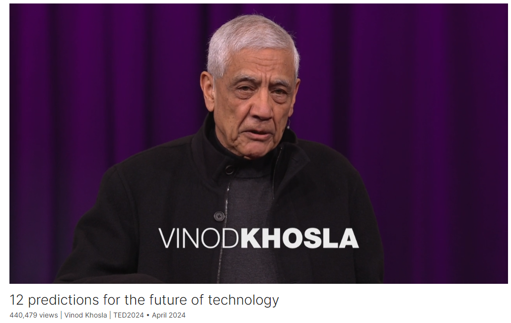

# 12 predictions for the future of technology

Link: [https://www.ted.com/talks/vinod_khosla_12_predictions_for_the_future_of_technology?vwo=featured](https://www.ted.com/talks/vinod_khosla_12_predictions_for_the_future_of_technology?vwo=featured)

Speaker:  Vinod Khosla

>**Vinod Khosla** (born 28 January 1955) is an Indian-American billionaire businessman and [venture capitalist](https://en.wikipedia.org/wiki/Venture_capitalist). He is a co-founder of [Sun Microsystems](https://en.wikipedia.org/wiki/Sun_Microsystems) and the founder of [Khosla Ventures](https://en.wikipedia.org/wiki/Khosla_Ventures).[[1\]](https://en.wikipedia.org/wiki/Vinod_Khosla#cite_note-1) Khosla made his wealth from early venture capital investments in areas such as networking, software, and alternative energy technologies.[[2\]](https://en.wikipedia.org/wiki/Vinod_Khosla#cite_note-2) He is considered one of the most successful and influential venture capitalists.[[3\]](https://en.wikipedia.org/wiki/Vinod_Khosla#cite_note-3)
>
>In 2014, *[Forbes](https://en.wikipedia.org/wiki/Forbes)* counted him among the 400 richest people in the United States.[[4\]](https://en.wikipedia.org/wiki/Vinod_Khosla#cite_note-4) In 2021, he was ranked 92nd on the *Forbes* 400 list.[[5\]](https://en.wikipedia.org/wiki/Vinod_Khosla#cite_note-forbes400-5) As of March 2024, *Forbes* estimated his net worth at US$6.8 billion.[[6\]](https://en.wikipedia.org/wiki/Vinod_Khosla#cite_note-Forbes_profile-6)

Date: April 2024

@[toc]

## Introduction

Techno-optimist Vinod Khosla believes in the world-changing power of "foolish ideas." He offers 12 bold predictions for the future of technology — from preventative medicine to car-free cities to planes that get us from New York to London in 90 minutes — and shows why a world of abundance awaits.

技术乐观主义者维诺德-科斯拉相信 "愚蠢的想法 "具有改变世界的力量。他对未来科技做出了 12 项大胆预测--从预防医学到无车城市，再到 90 分钟内从纽约飞到伦敦的飞机--并说明了为什么一个富足的世界正在等待着我们。

## Vocabulary

a world of abundance：富足的世界

techno-optimist: 技术乐观主义者

extrapolate：把…的应用范围扩大；推断；推知

radical: 根本的；意义深远的；彻底的；过激的；

radical progress：巨大的进步，激进的进步

think nonlinearly: 非线性思考

improbable: 美 [ɪmˈprɑbəb(ə)l] 不大可能发生的；出乎意料的

Experts extrapolate the past. They prevent radical progress because they don't think nonlinearly. They don't think of the improbable. 专家推断过去。他们阻止激进的进步，因为他们不会非线性地思考。他们不考虑不可能的事。

Entrepreneur: 美 [ˌɑːntrəprəˈnɜːr] 企业家；（尤指涉及财务风险的）创业者；**注意发音**

entrepreneurship：美 [ˌɑːntrəprəˈnɜːrʃɪp] 企业家精神；企业家能力；

we need more foolishness, to try and make those implausible dreams come true.我们需要更多的愚蠢，去尝试让那些不切实际的梦想成真。

a large non-founder-led company. 一家非创始人领导的大型公司。

most experts will pooh-pooh

pooh-pooh："Pooh-pooh" 在这里的意思是嘲笑、不屑一顾或贬低。句子的意思是大多数专家会对这些想法不屑一顾。

go through a dozen scenarios：提到一些场景

expertise：美 [ˌekspɜːrˈtiːz] 专业技能；专业知识；专门知识；专长；**注意发音**

Most expertise enabled by AI will be free. 人工智能支持的大多数专业知识将是免费的。

primary care：初级医疗服务

that every human being on the planet can have, 24/7, a free doctor,primary care in a very expansive way. 这个星球上的每一个人都可以享受全天候的免费医生和非常广泛的初级医疗服务。

structural engineers：结构工程师

oncologist：美 [ɒŋ'kɒlədʒɪst]  肿瘤学家

whether you're looking at structural engineers or oncologists, most expertise will be near free. 无论你看的是结构工程师还是肿瘤学家，大多数专业知识都将近乎免费。

bipedal：美 [ˌbaɪˈpidl] 双足的

servitude：美 [ˈsɜːrvɪtuːd] 奴役状态；屈从地位；

I can imagine a billion bipedal robots doing more work than all of human labor does today, freeing humans from the servitude of some of the jobs. 我可以想象十亿个双足机器人所做的工作比今天所有的人类劳动力所做的工作都多，将人类从某些工作的奴役中解放出来。

a utility: 一种工具

much more pervasive and expansive. In fact, I think we will think of computers almost like a utility. 更加普遍和广泛。事实上，我认为我们会认为计算机几乎是一种工具。

chlorophyll: 美 [ˈklɔːrəfɪl] 叶绿素；**注意发音**

RuBisCO is the most prevalent protein on the planet. Every place you see green, there is RuBisCO behind that chlorophyll RuBisCO是地球上最普遍的蛋白质。每个你看到绿色的地方，叶绿素后面都有RuBisCO

chauffeur：美 [ʃoʊˈfɜːr] 司机 **注意发音**

By making transit faster than a chauffeured car, cheaper than a public transit system 通过使交通比有司机的汽车更快，比公共交通系统更便宜

fret：使苦恼；使忧伤

And we fret a lot about power, and we think solar and wind are the solution. 我们非常担心能源问题，我们认为太阳能和风能是解决方案。

boiler：锅炉；热水器；

turbine：美 [ˈtɜrbaɪnz] 汽轮机；涡轮机；（turbine的复数）

the boilers and their turbines. 锅炉和它们的涡轮机。

lithium：美 [ˈlɪθiəm] 锂；

copper：铜

Doomers say we don't have enough resources like lithium and copper. 末日论者说我们没有足够的锂和铜等资源。

instigator：美 ['instəgeitə]  煽动者

inaugurated：美 [iˈnɔ:ɡjureitid] 开创；举行就职典礼；开始；（inaugurate的过去分词）

limestone：美 [ˈlaɪmstoʊn] 石灰岩

we inaugurated last week the first cement plant in California which from the same amount of limestone produces twice the amount of cement by capturing the carbon dioxide and putting it into product. 上周，我们举行了加州第一家水泥厂的落成典礼，该厂通过捕获二氧化碳并将其转化为产品，用同样多的石灰石生产了两倍的水泥。

I do think a really abundant world is possible. 我确实认为一个真正富足的世界是可能的。

inhibit：美 [ɪnˈhɪbɪt]  抑制；阻止

catalyst：美 [ˈkætəlɪst] 催化剂；触媒剂；促进因素；

## Summary

In his TED talk "12 Predictions for the Future of Technology," the speaker emphasizes the transformative potential of technology driven by entrepreneurs rather than experts. He argues that experts, who often extrapolate from the past, inhibit radical progress by failing to think nonlinearly or consider improbable scenarios. In contrast, entrepreneurs, fueled by vision and a willingness to pursue seemingly impossible ideas, are the true catalysts for groundbreaking innovations.

The speaker outlines several futuristic scenarios, including the near-free availability of expertise enabled by AI, with every person having access to a free doctor and tutor. He envisions a future where computing and labor are ubiquitous and affordable, revolutionizing industries and freeing humans from monotonous jobs. Additionally, he predicts major advancements in medicine, with a shift from reactive sick care to proactive health care, and the development of environmentally friendly proteins and fertilizers.

Further, he foresees significant changes in transportation, energy, and resource management. He predicts the replacement of most urban cars with faster and cheaper public transit systems, the advent of fusion power to replace coal and natural gas plants, and innovative solutions to resource shortages. By harnessing the creativity and determination of entrepreneurs, the speaker believes a more abundant and sustainable world is achievable.

在题为“对未来科技的12个预测”的TED演讲中，演讲者强调了由企业家而非专家推动的科技变革潜力。他认为专家往往根据过去进行推测，抑制了根本性的进步，因为他们不具备非线性思维，无法考虑不可能的情况。相反，企业家怀揣愿景，勇于追求看似不可能的想法，是真正推动突破性创新的催化剂。

演讲者列出了几个未来场景，包括由人工智能提供的几乎免费的专业知识，每个人都能免费获得医生和导师的服务。他设想了一个计算和劳动力普及且负担得起的未来，彻底改变各个行业，并解放人类从事单调工作的束缚。此外，他预测医学将有重大进展，从反应性治疗转向预防性健康护理，以及开发环保蛋白质和肥料。

进一步，他预见了交通、能源和资源管理方面的重大变化。他预测大多数城市汽车将被更快、更便宜的公共交通系统取代，核能将取代煤炭和天然气电厂，并会有创新的资源短缺解决方案。通过利用企业家的创造力和决心，演讲者相信一个更富足和可持续的世界是可以实现的。

## Transcript

I'm a techno-optimist,

but techno-optimism should be practiced
with both empathy and care.

And I’m a believer in what is possible
if you do it that way.

First, I'm going to give you
a word of warning.

Experts extrapolate the past.

They prevent radical progress
because they don't think nonlinearly.

They don't think of the improbable.

I personally believe
only the improbables are important.

We just don't know
which improbable is important.

Entrepreneurs, on the other hand,
with a passion for a vision,

they dream the dreams,
and then are foolish enough,

and we need more foolishness,

to try and make those
implausible dreams come true.

That's what entrepreneurship is about,
something I've loved my whole life.

In the 40 years, I’ve been doing
innovation and innovation only.

This may surprise people.

I can't think of a single
large social impact change

that was driven by an expert in the field,

possibly with the exception
of biotechnology,

that's driven by an expert,
by a large institution,

a large non-founder-led company.

Think about it.
In 40 years, not one example.

Whether you look at SpaceX,
or electric cars or Uber,

not one example.

The earliest one I could think of
was credit cards in the early 70s,

when Bank of America
put credit on plastic.

So what is this plausible world?

I'll go through a dozen scenarios

that I believe
most experts will pooh-pooh.

Most expertise enabled by AI will be free.

I'm most excited

that every human being on the planet

can have, 24/7, a free doctor,

primary care in a very expansive way.

That every child can have a free tutor

in a very available, accessible way,

and these will be near free.

It doesn't matter, other expertise

whether you're looking
at structural engineers or oncologists,

most expertise will be near free.

The cost of computing.

Most labor will also be free.

I can imagine a billion bipedal robots

doing more work than
all of human labor does today,

freeing humans from the servitude
of some of the jobs.

Working at General Motors
on an assembly line for eight hours a day,

doing the same thing for 30 years.

That's not a job. That's almost slavery.

I do believe we will have enough abundance

to take care of everybody
who is displaced.

And that's where the empathy part
of techno-optimism comes in.

We will have enough
for redistribution to happen.

Programming will be near free also.

And though we think of computers
as pervasive today,

I think they'll be much more prevalent,

much more pervasive and expansive.

In fact, I think we will think
of computers almost like a utility.

How many of you think about electricity?

That's how it will be
in the background, not in our face.

And like this little Rabbit device
I have in my hand, we'll just talk to it.

It'll understand human instruction.

Computers will adapt to humans.

We won't have to have
humans learn computer.

Five years ago, when I first spoke
at a conference in Toronto

on the role AI will play
in music generation,

I was met with skepticism.

In fact, derision.

Whether it's AI alone or AI plus humans,

the level of creativity in entertainment
and design will dramatically go up.

The level of diversity of these things
will go up dramatically.

I'm excited about that.

Surprisingly, internet access
will mostly be by agents.

Billions of agents running around
doing things for us humans.

Medicine is my other favorite.

We have pretty good medicine today,

but we have the practice of medicine,

and it will change
to the science of medicine.

It will change from what is
mostly sick care today,

we apply medicine when people are sick,

to health care to prevent sickness.

It's a shame that in this day and age,

most people who get a heart attack
discover they have cardiac disease

by having a heart attack,

not 20 years earlier
when that disease started.

That won't happen.

Food.

We will have new types
of proteins, which we need,

and new kinds of fertilizer
essential to agriculture.

RuBisCO is the most prevalent
protein on the planet.

Every place you see green,
there is RuBisCO behind that chlorophyll,

or almost everywhere.

There's a few exceptions.

And we will have much more
environmentally better proteins

than either plant proteins,

and possibly better than corn and soy.

So I'm excited about that,
and greener fertilizer.

Oh, my favorite.

Experts completely disagree
with me when I say this.

We can, in the next 25 years,

replace most cars in most cities.

Why? By making transit faster
than a chauffeured car,

cheaper than a public transit system

and pervasive, any time on demand.

And yes, we can do it.

In fact, we are building the first one
of these public transit systems

in San Jose today.

Another one of these,
flying at almost 4000 mph.

We will be able to fly
from New York to London for lunch.

It will make the world
a much closer place.

And we fret a lot about power,

and we think solar and wind
are the solution.

They're great solutions

I've been advocating
for the last 20 years.

But fusion power will replace most coal
and natural gas power plants today.

Again, people say
we can't build that many.

We can if we are smart,
if we just replace their boilers,

or maybe the boilers and their turbines.

In fact, all those plants
will probably be retrofitted with fusion,

possibly with superhot geothermal,

not the kind of geothermal
you've heard about,

even heard about at TED.

But much hotter, better,
more efficient geothermal.

Doomers say we don't have
enough resources like lithium and copper.

In fact, I say we haven't started to look.

In fact, we haven't started
to develop the technologies

that will let us look
a kilometer below the surface.

We are well on our way, though.

There will be carbon solutions
for everything.

Entrepreneurs are working on this.

There's only a dozen
major emitter categories,

and I wrote a blog on it
about two years ago.

And it only takes one entrepreneur
to tackle each of these categories,

so a dozen instigators
can change the world of climate.

In fact, we inaugurated last week

the first cement plant in California

which from the same amount of limestone
produces twice the amount of cement

by capturing the carbon dioxide
and putting it into product.

You repurpose existing plants,

upgrade them like you would
coal plants and natural gas plants,

and you increase the level of product

while decreasing the cost per ton.

That's what makes these things scalable.

All we need is a few entrepreneurs

who will imagine the impossible,
dream the dreams,

and then be foolish enough
to make them come true.

There's lots of reasons this won't happen,
but I won't delve into them.

But I do think a really abundant
world is possible.

It only takes a few motivated,

impassioned entrepreneurs
to make it happen.

Thank you.

(Applause)

## Afterword

2024年6月14日13点57分于上海。