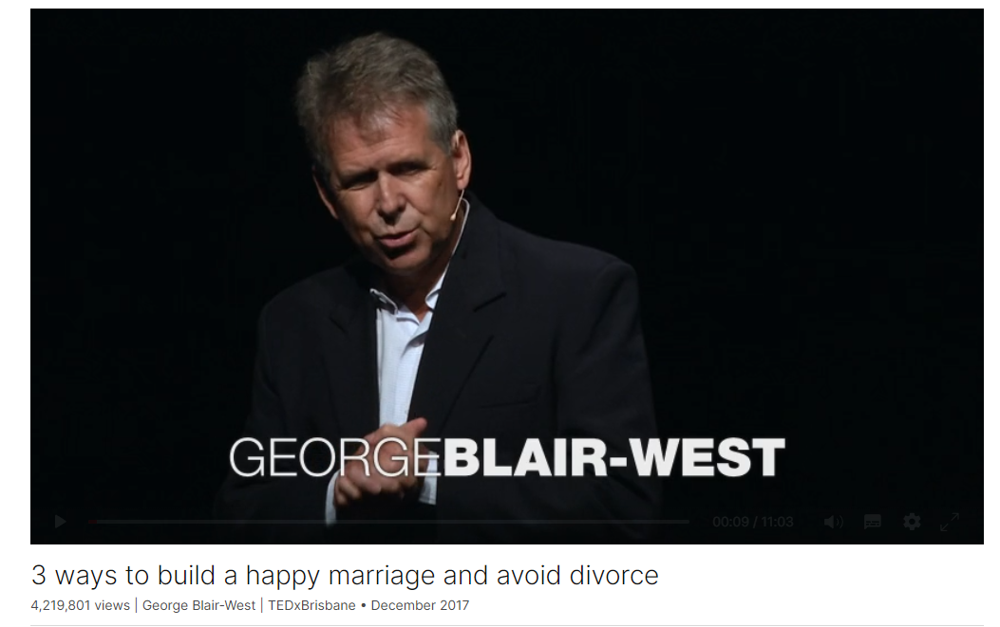

# 3 ways to build a happy marriage and avoid divorce

Link: [https://www.ted.com/talks/george_blair_west_3_ways_to_build_a_happy_marriage_and_avoid_divorce](https://www.ted.com/talks/george_blair_west_3_ways_to_build_a_happy_marriage_and_avoid_divorce)

Speaker: George Blair-West

Date: December 2017

@[toc]

## Introduction

Choosing to marry and share your life with someone is one of the most important decisions you can make in life. But with divorce rates approaching fifty percent in some parts of the world, it's clear we could use some help picking a partner. In an actionable, eye-opening talk, psychiatrist George Blair-West shares three keys to preventing divorce -- and spotting potential problems while you're still dating.

## Vocabulary

psychiatrist: 美 [saɪˈkaɪətrɪst]  精神科医生；精神病专家

inventory: 存货目录，清单

Psychiatrists Richard Rahe and Thomas Holmes developed an inventory of the most distressing human experiences that we could have. 精神病学家理查德·雷和托马斯·霍姆斯列出了我们可能经历过的最痛苦的人类经历。

marital: 美 [ˈmærɪtl]  婚姻的，夫妻之间的

marital separation：婚姻分居

imprisonment：美 [ɪmˈprɪznmənt] 关押，监禁

equate：美 [iˈkweɪt]  等同

de facto：事实上，实际上

So in a modern society, we know that prevention is better than cure. 我们知道预防胜于治疗。

vaccinate：美 [ˈvæksɪneɪt] 给xx接种疫苗；vaccinate against xxx 接种xxxx的疫苗

polio：美 [ˈpoʊlioʊ]  小儿麻痹症

diphtheria：美 [dɪfˈθɪriə] 白喉

tetanus：美 [ˈtɛtnəs]  破伤风

whooping cough：美 [ˈhuːpɪŋkɔːf]  百日咳

measles：美 [ˈmiːzlz]  麻疹

melanoma：美 [ˌmɛləˈnoʊmə] 黑色素瘤

stroke：美 [stroʊk] 中风

diabetes：美 [ˌdaɪəˈbiːtiːz] 糖尿病

We vaccinate against polio, diphtheria, tetanus, whooping cough, measles. We have awareness campaigns for melanoma, stroke, diabetes -- all important campaigns. 我们接种小儿麻痹症、白喉、破伤风、百日咳和麻疹疫苗。我们有针对黑色素瘤、中风、糖尿病的宣传活动——都是重要的活动。

educable：美 [ɛdʒʊkəbl]  可教育的

Well, I think it's because our policymakers don't believe that things like attraction and the way relationships are built is changeable or educable. 嗯，我认为这是因为我们的政策制定者不相信吸引力和建立关系的方式是可变的或可教育的。

glaze over: 目光呆滞

I see their eyes glaze over,and I can see them thinking

millennials：美 [mɪleniəlz] 注意发音，千禧一代

life hacks：人生秘诀

let me talk about my three life hacks for preventing divorce.让我谈谈我防止离婚的三条人生秘诀。

hookup culture:勾搭文化

>**Hookup culture** is one that accepts and encourages [casual sex](https://en.wikipedia.org/wiki/Casual_sex) encounters, including [one-night stands](https://en.wikipedia.org/wiki/One-night_stand) and other related activity, without necessarily including [emotional intimacy](https://en.wikipedia.org/wiki/Emotional_intimacy), [bonding](https://en.wikipedia.org/wiki/Human_bonding) or a [committed relationship](https://en.wikipedia.org/wiki/Committed_relationship).[[1\]](https://en.wikipedia.org/wiki/Hookup_culture#cite_note-FOOTNOTEFreitas2013-1) It is generally associated with [Western](https://en.wikipedia.org/wiki/Western_culture) late [adolescent sexuality](https://en.wikipedia.org/wiki/Adolescent_sexuality) and, in particular, United States college culture.[[2\]](https://en.wikipedia.org/wiki/Hookup_culture#cite_note-TIMIvyLegHook-2)[[3\]](https://en.wikipedia.org/wiki/Hookup_culture#cite_note-FOOTNOTEBogle2007-3)[[4\]](https://en.wikipedia.org/wiki/Hookup_culture#cite_note-paul2006-4) The term **hookup** has an ambiguous definition because it can indicate [kissing](https://en.wikipedia.org/wiki/Kissing) or any form of physical [sexual activity](https://en.wikipedia.org/wiki/Human_sexual_activity) between [sexual partners](https://en.wikipedia.org/wiki/Sexual_partner).[[5\]](https://en.wikipedia.org/wiki/Hookup_culture#cite_note-ABCHookup-5)[[6\]](https://en.wikipedia.org/wiki/Hookup_culture#cite_note-WolfHookingUp-6) The term has been widely used in the U.S. since at least 2000.[[6\]](https://en.wikipedia.org/wiki/Hookup_culture#cite_note-WolfHookingUp-6) It has also been called **nonrelationship sex**,[[7\]](https://en.wikipedia.org/wiki/Hookup_culture#cite_note-7) or **sex without dating**.

tertiary：美 [ˈtɜːrʃieri] 高等教育的，大学教育的 **注意发音**

 tertiary education：高等教育

But the one that I want to talk about is a big one: 81 percent of marriages implode, self-destruct, if this problem is present. 但我想谈论的是一个大问题:如果这个问题存在，81%的婚姻会内爆、自毁。

drill down onxxx：深入研究xxx

But when Gottman drilled down on this data, what he found was that women were generally pretty influenceable. 但是当戈特曼深入研究这些数据时，他发现女性通常很有影响力。

Guess where the problem lay? 猜猜问题出在哪里？

infirmity：体弱

I'm often intrigued by why couples come in to see me after they've been married for 30 or 40 years. This is a time when they're approaching the infirmities and illness of old age. 我经常好奇为什么结婚30年或40年的夫妇会来找我（看医生）。这是他们接近年老体弱多病的时候。

infidelity：美 [ˌɪnfəˈdɛlədi]  不忠

They'll forgive all betrayals, even infidelities, because they're focused on caring for each other.

Does your partner have your back?你的搭档支持你吗？

you're suffering from a really disabling illness 你患了一种非常严重的疾病

quirky：美 [ˈkwɜːrki] 离奇的，古怪的

Romance is a grand and beautiful and quirky thing. 浪漫是一种宏伟、美丽而古怪的东西。

## Summary

The speaker discusses the importance of preventing divorce and highlights three key life hacks for maintaining successful relationships. He emphasizes the need for policymakers to recognize that relationship dynamics are changeable and educable, especially in the context of modern society. The first life hack involves understanding the impact of technology and hookup culture on relationships, suggesting that delaying marriage can lead to more stable unions. The second hack focuses on sharing power in relationships, particularly highlighting the importance of men being influenceable and respectful towards their partners. The third hack addresses the concept of reliability, emphasizing the importance of partners being there for each other, especially during times of need. Overall, the speaker advocates for a thoughtful and informed approach to choosing a life partner, combining romanticism with practicality.

演讲者探讨了预防离婚的重要性，并强调了维持成功关系的三个关键生活技巧。他强调了决策者需要认识到在现代社会中，关系动态是可变的和可教育的。第一个生活技巧涉及了解科技和约会文化对关系的影响，暗示推迟结婚可能会导致更稳定的婚姻。第二个技巧着重于在关系中分享权力，特别强调了男性在决策中的可影响性和对伴侣的尊重的重要性。第三个技巧涉及到可靠性的概念，强调了伴侣在彼此需要时的支持，尤其是在需要时。总的来说，演讲者主张在选择生活伴侣时要有思想和理性的态度，将浪漫与实际结合起来。

romanticism： 美 [roʊˈmæntɪsɪzəm] 浪漫主义

practicality：美 [ˌpræktɪˈkæləti] 实际性，实用性

## Transcript

Almost 50 years ago,

psychiatrists Richard Rahe
and Thomas Holmes developed an inventory

of the most distressing
human experiences that we could have.

Number one on the list? Death of a spouse.

Number two, divorce.
Three, marital separation.

Now, generally, but not always,

for those three to occur, we need
what comes in number seven on the list,

which is marriage.

(Laughter)

Fourth on the list is imprisonment
in an institution.

Now, some say number seven
has been counted twice.

(Laughter)

I don't believe that.

When the life stress inventory was built,

back then, a long-term relationship
pretty much equated to a marriage.

Not so now.

So for the purposes of this talk,
I'm going to be including

de facto relationships,
common-law marriages

and same-sex marriages,

or same-sex relationships
soon hopefully to become marriages.

And I can say from my work
with same-sex couples,

the principles I'm about
to talk about are no different.

They're the same across all relationships.

So in a modern society,

we know that prevention
is better than cure.

We vaccinate against polio, diphtheria,
tetanus, whooping cough, measles.

We have awareness campaigns
for melanoma, stroke, diabetes --

all important campaigns.

But none of those conditions come close

to affecting 45 percent of us.

Forty-five percent: that's
our current divorce rate.

Why no prevention campaign for divorce?

Well, I think it's because
our policymakers don't believe

that things like attraction
and the way relationships are built

is changeable or educable.

Why?

Well, our policymakers currently
are Generation X.

They're in their 30s to 50s.

And when I'm talking to these guys
about these issues,

I see their eyes glaze over,

and I can see them thinking,

"Doesn't this crazy psychiatrist get it?

You can't control the way in which
people attract other people

and build relationships."

Not so, our dear millennials.

This is the most information-connected,
analytical and skeptical generation,

making the most informed decisions
of any generation before them.

And when I talk to millennials,
I get a very different reaction.

They actually want to hear about this.

They want to know about how do we
have relationships that last?

So for those of you who want to embrace
the post- "romantic destiny" era with me,

let me talk about my three life hacks
for preventing divorce.

Now, we can intervene
to prevent divorce at two points:

later, once the cracks begin to appear
in an established relationship;

or earlier, before we commit,
before we have children.

And that's where I'm going to take us now.

So my first life hack:

millennials spend seven-plus hours
on their devices a day.

That's American data.

And some say, probably not unreasonably,

this has probably affected
their face-to-face relationships.

Indeed, and add to that
the hookup culture,

ergo apps like Tinder,

and it's no great surprise that
the 20-somethings that I work with

will often talk to me about
how it is often easier for them

to have sex with somebody that they've met

than have a meaningful conversation.

Now, some say this is a bad thing.

I say this is a really good thing.

It's a particularly good thing

to be having sex outside
of the institution of marriage.

Now, before you go out
and get all moral on me,

remember that Generation X,
in the American Public Report,

they found that 91 percent of women

had had premarital sex by the age of 30.

Ninety-one percent.

It's a particularly good thing that
these relationships are happening later.

See, boomers in the '60s --

they were getting married
at an average age for women of 20

and 23 for men.

2015 in Australia?

That is now 30 for women and 32 for men.

That's a good thing, because
the older you are when you get married,

the lower your divorce rate.

Why?

Why is it helpful to get married later?

Three reasons.

Firstly, getting married later allows
the other two preventers of divorce

to come into play.

They are tertiary education

and a higher income, which tends
to go with tertiary education.

So these three factors all
kind of get mixed up together.

Number two,

neuroplasticity research tell us

that the human brain is still growing
until at least the age of 25.

So that means how you're thinking
and what you're thinking

is still changing up until 25.

And thirdly, and most importantly
to my mind, is personality.

Your personality at the age of 20

does not correlate with
your personality at the age of 50.

But your personality at the age of 30

does correlate with
your personality at the age of 50.

So when I ask somebody
who got married young why they broke up,

and they say, "We grew apart,"

they're being surprisingly accurate,

because the 20s is a decade
of rapid change and maturation.

So the first thing you want to get
before you get married is older.

(Laughter)

Number two,

John Gottman, psychologist
and relationship researcher,

can tell us many factors that correlate
with a happy, successful marriage.

But the one that I want to talk about

is a big one:

81 percent of marriages implode,
self-destruct, if this problem is present.

And the second reason why I want
to talk about it here

is because it's something
you can evaluate while you're dating.

Gottman found that the relationships
that were the most stable and happy

over the longer term

were relationships in which
the couple shared power.

They were influenceable:

big decisions, like buying a house,
overseas trips, buying a car,

having children.

But when Gottman
drilled down on this data,

what he found was that women
were generally pretty influenceable.

Guess where the problem lay?

(Laughter)

Yeah, there's only
two options here, isn't there?

Yeah, we men were to blame.

The other thing that Gottman found

is that men who are influenceable

also tended to be "outstanding fathers."

So women: How influenceable is your man?

Men:

you're with her because you respect her.

Make sure that respect plays out
in the decision-making process.

Number three.

I'm often intrigued by
why couples come in to see me

after they've been married
for 30 or 40 years.

This is a time when they're approaching
the infirmities and illness of old age.

It's a time when they're particularly
focused on caring for each other.

They'll forgive things
that have bugged them for years.

They'll forgive all betrayals,
even infidelities,

because they're focused
on caring for each other.

So what pulls them apart?

The best word I have
for this is reliability,

or the lack thereof.

Does your partner have your back?

It takes two forms.

Firstly, can you rely on your partner
to do what they say they're going to do?

Do they follow through?

Secondly,

if, for example,

you're out and you're being
verbally attacked by somebody,

or you're suffering from
a really disabling illness,

does your partner step up
and do what needs to be done

to leave you feeling
cared for and protected?

And here's the rub:

if you're facing old age,

and your partner
isn't doing that for you --

in fact, you're having
to do that for them --

then in an already-fragile relationship,

it can look a bit like you might
be better off out of it rather than in it.

So is your partner there for you
when it really matters?

Not all the time, 80 percent of the time,

but particularly if it's important to you.

On your side, think carefully before you
commit to do something for your partner.

It is much better to commit to
as much as you can follow through

than to commit to more
sound-good-in-the-moment

and then let them down.

And if it's really important
to your partner, and you commit to it,

make sure you move hell
and high water to follow through.

Now, these are things
that I'm saying you can look for.

Don't worry, these are also
things that can be built

in existing relationships.

I believe that the most important decision

that you can make

is who you choose as a life partner,

who you choose as
the other parent of your children.

And of course, romance has to be there.

Romance is a grand and beautiful
and quirky thing.

But we need to add
to a romantic, loving heart

an informed, thoughtful mind,

as we make the most important
decision of our life.

Thank you.

(Applause)

## Afterword

2024年4月10日20点43分于上海。