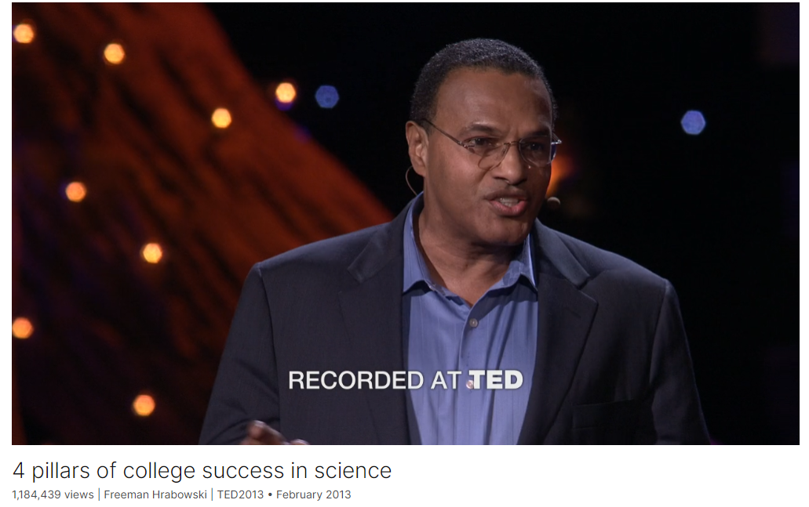

# 4 pillars of college success in science

Link: [https://www.ted.com/talks/freeman_hrabowski_4_pillars_of_college_success_in_science](https://www.ted.com/talks/freeman_hrabowski_4_pillars_of_college_success_in_science)

Speaker:  Freeman Hrabowski 

Date: February 2013

@[toc]

## Introduction

At age 12, Freeman Hrabowski marched with Martin Luther King. Now he's president of the University of Maryland, Baltimore County (UMBC), where he works to create an environment that helps under-represented students -- specifically African-American, Latino and low-income learners -- get degrees in math and science. He shares the four pillars of UMBC's approach.

## Vocabulary

at the top of the academic ladder: 在学术阶梯的顶端

Latino: 美 [ˌlæˈtinoʊ]  拉美裔美国居民的

hypocrite:美 [ˈhɪpəkrɪt] 伪君子；伪善者；虚伪的人  **注意发音**

you guys are hypocrites你们都是伪君子

elated：美 [iˈleɪtɪd] 兴高采烈的；得意洋洋的

I was at first elated.我起初很高兴。

hand-me-down：别人用过的旧东西；别人穿过的旧衣服

I did not want to have to have hand-me-down books. 我不想拥有旧书。

crusade：美 [kruːˈseɪd] 十字军， 改革运动

Children's Crusade 儿童十字军

empower：授权

That children can be empowered to take ownership of their education. 孩子们可以被赋予掌控自己教育的权利。

hispanic：美 [hɪˈspænɪk] 讲西班牙语的美国居民

Hispanic students 西班牙裔学生

philanthropist：美 [fɪˈlænθrəpɪst] 慈善家，**注意发音**

change one's major: 转专业，换专业

they end up changing their majors 他们最终改变了专业

rigor：美 [rɪɡər] 严密；精确，严谨性

the rigor of the course work 课程工作的严谨性

strong foundation：很硬的基础，坚实的基础

We need to have you retake the course, because you need a strong foundation if you're going to move to the next level. 我们需要你重修这门课程，因为如果你想更上一层楼，你需要一个坚实的基础。

goosebumps：鸡皮疙瘩

## Summary

Freeman Hrabowski's speech centers on the success of the University of Maryland, Baltimore County (UMBC) in educating students from diverse backgrounds, particularly African-American, Latino, and low-income students, in science and engineering. He begins by sharing his personal story of growing up in Birmingham, Alabama, and his involvement in the civil rights movement, emphasizing the importance of empowering children to take ownership of their education. Hrabowski highlights UMBC's founding principles of diversity and inclusivity, established in 1963, and its commitment to providing a supportive environment where students of all races can excel academically.

Hrabowski then outlines the four key factors that have contributed to UMBC's success in producing minority students who excel in science and engineering. Firstly, he emphasizes the importance of setting high expectations for students, encouraging curiosity, and promoting a passion for learning. Secondly, he underscores the significance of building a sense of community among students, fostering collaboration, trust, and support. Thirdly, he discusses the role of researchers in mentoring and guiding students, providing hands-on research experiences to inspire their academic pursuits. Lastly, he emphasizes the crucial involvement of faculty in engaging with students both inside and outside the classroom, creating opportunities for personalized support and guidance.

In conclusion, Hrabowski highlights UMBC's innovative approach to academic innovation, including the redesign of courses in various disciplines to enhance student engagement and learning outcomes. He stresses the importance of empowering students to pursue their dreams and values, emphasizing that excellence is the result of intentional effort and intelligent execution. Hrabowski's speech underscores the transformative impact of education in shaping individuals' destinies and emphasizes the importance of choice in determining one's path to success.

## Transcript

So I'll be talking about the success of my campus,

the University of Maryland, Baltimore County, UMBC,

in educating students of all types,

across the arts and humanities and the science and engineering areas.

What makes our story especially important

is that we have learned so much from a group of students

who are typically not at the top of the academic ladder --

students of color, students underrepresented in selected areas.

And what makes the story especially unique

is that we have learned how to help African-American students, Latino students,

students from low-income backgrounds,

to become some of the best in the world in science and engineering.

And so I begin with a story about my childhood.

We all are products of our childhood experiences.

It's hard for me to believe that it's been 50 years

since I had the experience of being a ninth grade kid in Birmingham, Alabama,

a kid who loved getting A's,

a kid who loved math, who loved to read,

a kid who would say to the teacher --

when the teacher said, "Here are 10 problems," to the class,

this little fat kid would say, "Give us 10 more."

And the whole class would say, "Shut up, Freeman."

And there was a designated kicker every day.

And so I was always asking this question:

"Well how could we get more kids to really love to learn?"

And amazingly, one week in church,

when I really didn't want to be there

and I was in the back of the room being placated by doing math problems,

I heard this man say this:

"If we can get the children

to participate in this peaceful demonstration here in Birmingham,

we can show America that even children know the difference between right and wrong

and that children really do want to get the best possible education."

And I looked up and said, "Who is that man?"

And they said his name was Dr. Martin Luther King.

And I said to my parents, "I've got to go.

I want to go. I want to be a part of this."

And they said, "Absolutely not."

(Laughter)

And we had a rough go of it.

And at that time, quite frankly, you really did not talk back to your parents.

And somehow I said, "You know, you guys are hypocrites.

You make me go to this. You make me listen.

The man wants me to go, and now you say no."

And they thought about it all night.

And they came into my room the next morning.

They had not slept.

They had been literally crying and praying and thinking,

"Will we let our 12-year-old

participate in this march and probably have to go to jail?"

And they decided to do it.

And when they came in to tell me,

I was at first elated.

And then all of a sudden I began thinking about the dogs and the fire hoses,

and I got really scared, I really did.

And one of the points I make to people all the time

is that sometimes when people do things that are courageous,

it doesn't really mean that they're that courageous.

It simply means that they believe it's important to do it.

I wanted a better education.

I did not want to have to have hand-me-down books.

I wanted to know that the school I attended

not only had good teachers, but the resources we needed.

And as a result of that experience,

in the middle of the week, while I was there in jail,

Dr. King came and said with our parents,

"What you children do this day

will have an impact on children who have not been born."

I recently realized that two-thirds of Americans today

had not been born at the time of 1963.

And so for them, when they hear about the Children's Crusade in Birmingham,

in many ways, if they see it on TV,

it's like our looking at the 1863 "Lincoln" movie:

It's history.

And the real question is, what lessons did we learn?

Well amazingly, the most important for me was this:

That children can be empowered to take ownership of their education.

They can be taught to be passionate

about wanting to learn and to love the idea of asking questions.

And so it is especially significant

that the university I now lead,

the University of Maryland, Baltimore County, UMBC,

was founded the very year I went to jail with Dr. King, in 1963.

And what made that institutional founding especially important

is that Maryland is the South, as you know,

and, quite frankly, it was the first university in our state

founded at a time when students of all races could go there.

And so we had black and white students and others who began to attend.

And it has been for 50 years an experiment.

The experiment is this:

Is it possible to have institutions in our country, universities,

where people from all backgrounds can come and learn

and learn to work together and learn to become leaders

and to support each other in that experience?

Now what is especially important about that experience for me is this:

We found that we could do a lot in the arts and humanities and social sciences.

And so we began to work on that, for years in the '60s.

And we produced a number of people in law, all the way to the humanities.

We produced great artists. Beckett is our muse.

A lot of our students get into theater.

It's great work.

The problem that we faced was the same problem America continues to face --

that students in the sciences and engineering,

black students were not succeeding.

But when I looked at the data,

what I found was that, quite frankly, students in general,

large numbers were not making it.

And as a result of that,

we decided to do something that would help, first of all,

the group at the bottom, African-American students, and then Hispanic students.

And Robert and Jane Meyerhoff, philanthropists, said, "We'd like to help."

Robert Meyerhoff said, "Why is it that everything I see on TV about black boys,

if it's not about basketball, is not positive?

I'd like to make a difference, to do something that's positive."

We married those ideas, and we created this Meyerhoff Scholars program.

And what is significant about the program

is that we learned a number of things.

And the question is this:

How is it that now we lead the country in producing African-Americans

who go on to complete Ph.D.'s in science and engineering and M.D./Ph.D.'s?

That's a big deal. Give me a hand for that. That's a big deal.

That's a big deal. It really is.

(Applause)

You see, most people don't realize

that it's not just minorities who don't do well in science and engineering.

Quite frankly, you're talking about Americans.

If you don't know it, while 20 percent of blacks and Hispanics

who begin with a major in science and engineering

will actually graduate in science and engineering,

only 32 percent of whites who begin with majors in those areas

actually succeed and graduate in those areas,

and only 42 percent of Asian-Americans.

And so, the real question is, what is the challenge?

Well a part of it, of course, is K-12.

We need to strengthen K-12.

But the other part has to do with the culture

of science and engineering on our campuses.

Whether you know it or not, large numbers of students with high SAT's

and large numbers of A.P. credits

who go to the most prestigious universities in our country

begin in pre-med or pre-engineering and engineering, and they end up changing their majors.

And the number one reason, we find, quite frankly,

is they did not do well in first year science courses.

In fact, we call first year science and engineering, typically around America,

weed-out courses or barrier courses.

How many of you in this audience know somebody

who started off in pre-med or engineering

and changed their major within a year or two?

It's an American challenge. Half of you in the room.

I know. I know. I know.

And what is interesting about that

is that so many students are smart and can do it.

We need to find ways of making it happen.

So what are the four things we did to help minority students

that now are helping students in general?

Number one: high expectations.

It takes an understanding of the academic preparation of students --

their grades, the rigor of the course work,

their test-taking skills, their attitude,

the fire in their belly, the passion for the work, to make it.

And so doing things to help students prepare to be in that position, very important.

But equally important, it takes an understanding that it's hard work that makes the difference.

I don't care how smart you are or how smart you think you are.

Smart simply means you're ready to learn.

You're excited about learning and you want to ask good questions.

I. I. Rabi, a Nobel laureate, said that when he was growing up in New York,

all of his friends' parents would ask them

"What did you learn in school?" at the end of a day.

And he said, in contrast, his Jewish mother would say,

"Izzy, did you ask a good question today?"

And so high expectations have to do with curiosity

and encouraging young people to be curious.

And as a result of those high expectations,

we began to find students we wanted to work with

to see what could we do to help them,

not simply to survive in science and engineering,

but to become the very best, to excel.

Interestingly enough, an example:

One young man who earned a C in the first course and wanted to go on to med school,

we said, "We need to have you retake the course,

because you need a strong foundation if you're going to move to the next level."

Every foundation makes the difference in the next level.

He retook the course.

That young man went on to graduate from UMBC,

to become the first black to get the M.D./Ph.D. from the University of Pennsylvania.

He now works at Harvard.

Nice story. Give him a hand for that too.

(Applause)

Secondly, it's not about test scores only.

Test scores are important, but they're not the most important thing.

One young woman had great grades, but test scores were not as high.

But she had a factor that was very important.

She never missed a day of school, K-12.

There was fire in that belly.

That young woman went on, and she is today with an M.D./Ph.D. from Hopkins.

She's on the faculty, tenure track in psychiatry, Ph.D. in neuroscience.

She and her adviser have a patent on a second use of Viagra for diabetes patients.

Big hand for her. Big hand for her.

(Applause)

And so high expectations, very important.

Secondly, the idea of building community among the students.

You all know that so often in science and engineering

we tend to think cutthroat.

Students are not taught to work in groups.

And that's what we work to do with that group

to get them to understand each other,

to build trust among them, to support each other,

to learn how to ask good questions,

but also to learn how to explain concepts with clarity.

As you know, it's one thing to earn an A yourself,

it's another thing to help someone else do well.

And so to feel that sense of responsibility makes all the difference in the world.

So building community among those students, very important.

Third, the idea of, it takes researchers to produce researchers.

Whether you're talking about artists producing artists

or you're talking about people getting into the social sciences,

whatever the discipline -- and especially in science and engineering, as in art, for example --

you need scientists to pull the students into the work.

And so our students are working in labs regularly.

And one great example that you'll appreciate:

During a snowstorm in Baltimore several years ago,

the guy on our campus with this Howard Hughes Medical Institute grant

literally came back to work in his lab after several days,

and all these students had refused to leave the lab.

They had food they had packed out.

They were in the lab working,

and they saw the work, not as schoolwork, but as their lives.

They knew they were working on AIDS research.

They were looking at this amazing protein design.

And what was interesting was each one of them focused on that work.

And he said, "It doesn't get any better than that."

And then finally, if you've got the community

and you've got the high expectations and you've got researchers producing researchers,

you have to have people who are willing as faculty

to get involved with those students, even in the classroom.

I'll never forget a faculty member calling the staff and saying,

"I've got this young man in class, a young black guy,

and he seems like he's just not excited about the work.

He's not taking notes. We need to talk to him."

What was significant was that the faculty member was observing every student

to understand who was really involved and who was not

and was saying, "Let me see how I can work with them.

Let me get the staff to help me out."

It was that connecting.

That young man today is actually a faculty member M.D./Ph.D. in neuroengineering at Duke.

Give him a big hand for that.

(Applause)

And so the significance is that we have now developed this model

that is helping us, not only finally with evaluation, assessing what works.

And what we learned was that we needed to think about redesigning courses.

And so we redesigned chemistry, we redesigned physics.

But now we are looking at redesigning the humanities and social sciences.

Because so many students are bored in class.

Do you know that?

Many students, K-12 and in universities,

don't want to just sit there and listen to somebody talk.

They need to be engaged.

And so we have done -- if you look at our website at the Chemistry Discovery Center,

you'll see people coming from all over the country

to look at how we are redesigning courses,

having an emphasis on collaboration, use of technology,

using problems out of our biotech companies on our campus,

and not giving students the theories,

but having them struggle with those theories.

And it's working so well that throughout our university system in Maryland,

more and more courses are being redesigned.

It's called academic innovation.

And what does all of that mean?

It means that now, not just in science and engineering,

we now have programs in the arts, in the humanities, in the social sciences,

in teacher education, even particularly for women in I.T.

If you don't know it, there's been a 79-percent decline

in the number of women majoring in computer science just since 2000.

And what I'm saying is that what will make the difference

will be building community among students,

telling young women, young minority students and students in general,

you can do this work.

And most important, giving them a chance to build that community

with faculty pulling them into the work

and our assessing what works and what does not work.

Most important, if a student has a sense of self,

it is amazing how the dreams and the values

can make all the difference in the world.

When I was a 12-year-old child in the jail in Birmingham,

I kept thinking, "I wonder what my future could be."

I had no idea that it was possible for this little black boy in Birmingham

to one day be president of a university that has students from 150 countries,

where students are not there just to survive,

where they love learning, where they enjoy being the best,

where they will one day change the world.

Aristotle said, "Excellence is never an accident.

It is the result of high intention, sincere effort and intelligent execution.

It represents the wisest option among many alternatives."

And then he said something that gives me goosebumps.

He said, "Choice, not chance, determines your destiny."

Choice, not chance, determines your destiny, dreams and values.

Thank you all very much.

(Applause)

## Afterword

2024年5月7日21点36分于上海。