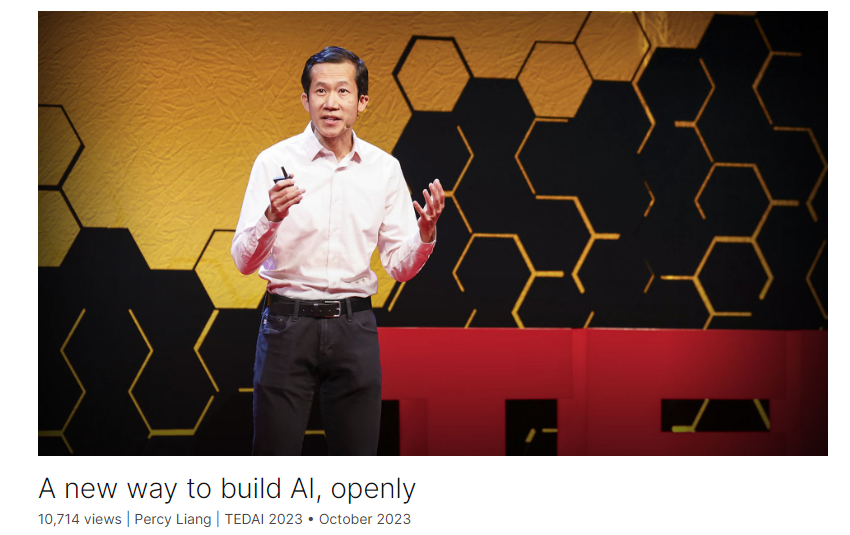

# A new way to build AI, openly

Link: [https://www.ted.com/talks/percy_liang_a_new_way_to_build_ai_openly?](https://www.ted.com/talks/percy_liang_a_new_way_to_build_ai_openly?)

Speaker: Percy Liang

Date: October 2023

## Introduction

Today's AI is trained on the work of artists and writers without attribution, its core values decided by a privileged few. What if the future of AI was more open and democratic? Researcher Percy Liang offers a vision of a transparent, participatory future for emerging technology, one that credits contributors and gives everyone a voice.

今天的人工智能是在没有归属的艺术家和作家的作品上接受训练的，其核心价值由少数特权阶层决定。如果人工智能的未来更加开放和民主会怎样？研究员Percy Liang为新兴技术提供了一个透明、参与性的未来愿景，一个表彰贡献者并给予每个人发言权的愿景。

## Vocabulary

participatory: 美 [pɑːrˈtɪsəpətɔːri]  参与性的

core value：核心价值

intrigue：美 [ɪnˈtriːɡ] 引起xxx的好奇心；耍阴谋

I was intrigued, I wanted to understand it, I wanted to see how far we could go with this.我很感兴趣，我想了解它，我想看看我们能走多远。

enter the mainstream：跻身主流，成为主流

Language models and more generally, foundation models, have taken off and entered the mainstream. 语言模型和更一般的基础模型已经起飞并进入主流。

ensemble：美 [ɑːnˈsɑːmbl] 乐团，剧团： jazz ensemble 爵士乐合奏团， **注意发音**

It was like a jazz ensemble where everyone was riffing off of each other, developing the technology that we have today. 这就像一个爵士乐合奏团，每个人都在即兴表演，发展我们今天拥有的技术。

not released openly: 没有开源

recipe：**注意发音** 美 [ˈresəpi] 烹饪法；食谱

And then today, the most advanced foundation models in the world are not released openly. They are instead guarded closely behind black box APIs with little to no information about how they're built. So it's like we have these castles which house the world's most advanced AIs and the secret recipes for creating them. 然后今天，世界上最先进的基础模型没有公开发布。相反，它们被严密保护在黑盒API之后，几乎没有关于它们是如何构建的信息。这就像我们有这些城堡，里面有世界上最先进的人工智能和创造它们的秘方。

asymmetry: 不对称

stark: 明显的

but the resource and information asymmetry is stark. 但是资源和信息的不对称是明显的。

opacity：美 [oʊˈpæsədi]  不透明，晦涩，难懂

This opacity and centralization of power is concerning. 这种不透明和权力集中令人担忧。

tenet：美 [ˈtenɪt]  原则，信条

The most basic tenet of machine learning is that the training data and the test data have to be independent for evaluation to be meaningful. So if we don't know what's in the training data, then that 95 percent number is meaningless. 机器学习的最基本原则是训练数据和测试数据必须独立，评估才有意义。因此，如果我们不知道训练数据中有什么，那么95%的数字就没有意义。

we are flying blind.

accountability: 有责任，责任制

And with all the enthusiasm to deploying these models in the real world without meaningful evaluation, we are flying blind. And transparency isn't just about the training data or evaluation. It's also about environmental impact, labor practices, release processes, risk mitigation strategies. Without transparency, we lose accountability. 尽管我们满怀热情地在现实世界中部署这些模型，但却没有进行有意义的评估，这无疑是盲目的。透明度不仅仅是关于训练数据或评估。它还涉及环境影响、劳工实践、发布流程、风险缓解策略。没有透明度，我们就失去了问责制。

affirmative action

>**Affirmative action** (also sometimes called **reservations**, **alternative access**, **positive discrimination** or **positive action** in various countries' laws and policies)[[1\]](https://en.wikipedia.org/wiki/Affirmative_action#cite_note-1)[[2\]](https://en.wikipedia.org/wiki/Affirmative_action#cite_note-:4-2)[[3\]](https://en.wikipedia.org/wiki/Affirmative_action#cite_note-:5-3)[[4\]](https://en.wikipedia.org/wiki/Affirmative_action#cite_note-4)[[5\]](https://en.wikipedia.org/wiki/Affirmative_action#cite_note-5)[[6\]](https://en.wikipedia.org/wiki/Affirmative_action#cite_note-6)[[7\]](https://en.wikipedia.org/wiki/Affirmative_action#cite_note-7) refers to a set of policies and practices within a government or organization seeking to benefit marginalized groups. Historically and internationally, support for affirmative action has been justified by the idea that it may help with bridging inequalities in employment and pay, increasing access to education, and promoting [diversity](https://en.wikipedia.org/wiki/Diversity_(politics)), [social equity](https://en.wikipedia.org/wiki/Social_equity) and redressing alleged wrongs, harms, or hindrances, also called [substantive equality](https://en.wikipedia.org/wiki/Substantive_equality).[[8\]](https://en.wikipedia.org/wiki/Affirmative_action#cite_note-twsL13-8)

subjective，controversial，contested questions

These are highly subjective, controversial, contested questions, and any decision on how to answer them is necessarily value-laden.这些都是高度主观的、有争议的、有争议的问题，任何关于如何回答这些问题的决定都必然是基于价值（观）的。

without attribution or consent：没有归属或者未经同意

The data here is a result of human labor, and currently this data is being scraped, often without attribution or consent. 这里的数据是人类劳动的结果，目前这些数据正在被爬取，通常没有归属或同意。

status quo：现状，美 [ˌsteɪtəs ˈkwoʊ]

So how can we change the status quo? 我们如何才能改变现状？

bleak：美 [bliːk] 凄凉的，暗淡的

situation seems pretty bleak：情况看起来相当惨淡。

With these castles,the situation might seem pretty bleak. But let me try to give you some hope.

encyclopedia：美 [ɪnˌsaɪkləˈpiːdiə]  百科全书， **注意发音**

against all odds：尽管很困难，排除万难

But against all odds, Wikipedia prevailed. 但尽管困难重重，维基百科还是流行开来。

hobbyist：美 [ˈhɑbiɪst]  业余爱好者

peer production：对等生产

>Peer production (also known as mass collaboration) is **a way of producing goods and services that relies on self-organizing communities of individuals**. In such communities, the labor of many people is coordinated towards a shared outcome.

embark on：开始从事，着手

I feel the same excitement about this vision as I did 19 years ago as that master's student, embarking on his first NLP research project. 我对这个愿景感到兴奋，就像我19年前作为那个硕士生开始他的第一个NLP研究项目时一样。

## Summary

The speaker's manuscript outlines his journey from a young master's student working on his first NLP research project in 2004 to becoming an AI researcher. He highlights the significant advancements made by the research community over the last 19 years, particularly in language and foundation models. However, he expresses concerns about the recent trend towards less open innovation, with advanced models now hidden behind closed APIs. This shift raises issues of transparency, values, and attribution in AI development.

The speaker emphasizes the importance of transparency in evaluating and auditing models, as well as the need to consider whose values are embedded in these models. He also discusses the lack of attribution and consent in the data used to train these models, calling attention to the broken incentive system in AI development.

To address these challenges, the speaker advocates for a more open and participatory approach to AI development, citing the success of projects like Wikipedia and Linux. He believes that by embracing open source and peer production principles, the AI community can create a more transparent and inclusive future for AI development.

演讲者的手稿概述了他从2004年作为年轻的硕士生开始进行他的第一个自然语言处理研究项目，到成为人工智能研究员的旅程。他强调了过去19年来研究界取得的重大进展，特别是在语言和基础模型方面。然而，他对最近向较少开放创新的趋势表示担忧，因为现在先进的模型都隐藏在封闭的API背后。这种转变引发了AI开发中透明度、价值观和归因的问题。

演讲者强调了在评估和审计模型时透明度的重要性，以及需要考虑到这些模型中嵌入的价值观。他还讨论了在训练这些模型所使用的数据中缺乏归因和同意，引起了人工智能开发中破碎的激励机制的关注。

为了解决这些挑战，演讲者主张采取更开放和参与式的人工智能开发方式，引用了维基百科和Linux等项目的成功。他认为，通过 embracing开源和peer production原则，AI社区可以为AI开发创造一个更透明和包容的未来。

## Transcript

2004.

I was a young masters student

about to start my first
NLP research project,

and my task was to train a language model.

Now that language model was a little bit
smaller than the ones we have today.

It was trained on millions
rather than trillions of words.

I used a hidden Markov model
as opposed to a transformer,

but that little language model I trained

did something I thought was amazing.

It took all this raw text

and somehow it organized it into concepts.

A concept for months,

male first names,

words related to the law,

countries and continents and so on.

But no one taught
these concepts to this model.

It discovered them all by itself,
just by analyzing the raw text.

But how?

I was intrigued,
I wanted to understand it,

I wanted to see how far
we could go with this.

So I became an AI researcher.

In the last 19 years,

we have come a long way
as a research community.

Language models and more generally,
foundation models, have taken off

and entered the mainstream.

But, it is important to realize
that all of these achievements

are based on decades of research.

Research on model architectures,

research on optimization algorithms,
training objectives, data sets.

For a while,

we had an incredible free culture,

a culture of open innovation,

a culture where researchers published,

researchers released data sets, code,

so that others can go further.

It was like a jazz ensemble where everyone
was riffing off of each other,

developing the technology
that we have today.

But then in 2020,

things started changing.

Innovation became less open.

And then today, the most advanced
foundation models in the world

are not released openly.

They are instead guarded closely
behind black box APIs

with little to no information
about how they're built.

So it's like we have these castles

which house the world's most advanced AIs

and the secret recipes for creating them.

Meanwhile, the open community
still continues to innovate,

but the resource and information
asymmetry is stark.

This opacity and centralization
of power is concerning.

Let me give you three reasons why.

First, transparency.

With closed foundation models,
we lose the ability to see,

to evaluate, to audit these models

which are going to impact
billions of people.

Say we evaluate a model through an API
on medical question answering

and it gets 95 percent accuracy.

What does that 95 percent mean?

The most basic tenet of machine learning

is that the training data
and the test data

have to be independent
for evaluation to be meaningful.

So if we don't know
what's in the training data,

then that 95 percent
number is meaningless.

And with all the enthusiasm
to deploying these models

in the real world
without meaningful evaluation,

we are flying blind.

And transparency isn't just
about the training data or evaluation.

It's also about environmental impact,

labor practices, release processes,

risk mitigation strategies.

Without transparency,
we lose accountability.

It's like not having nutrition labels
on the food you eat,

or not having safety ratings
on the cars you drive.

Fortunately, the food and auto industries
have matured over time,

but AI still has a long way to go.

Second, values.

So model developers like to talk
about aligning foundation models

to human values,
which sounds wonderful.

But whose values
are we talking about here?

If we were just building a model
to answer math questions,

maybe we wouldn't care,

because as long as the model
produces the right answer,

we would be happy,
just as we're happy with calculators.

But these models are not calculators.

These models will attempt to answer
any question you throw it.

Who is the best basketball
player of all time?

Should we build nuclear reactors?

What do you think of affirmative action?

These are highly subjective,
controversial, contested question,

and any decision on how to answer them
is necessarily value laden.

And currently, these values
are unilaterally decided

by the rulers of the castles.

So can we imagine
a more democratic process

for determining these values
based on the input from everybody?

So foundation models will be the primary
way that we interact with information.

And so determining these values
and how we set them

will have a sweeping impact

on how we see the world and how we think.

Third, attribution.

So why are these foundation
models so powerful?

It's because they're trained
on massive amounts of data.

See what machine-learning
researchers call data

is what artists call art

or writers call books

or programers call software.

The data here is a result of human labor,

and currently this data is being scraped,

often without attribution or consent.

So understandably, some people are upset,

filing lawsuits, going on strike.

But this is just an indication
that the incentive system is broken.

And in order to fix it,
we need to center the creators.

We need to figure out
how to compensate them

for the value of the content
they produced,

and how to incentivize them
to continue innovating.

Figuring this out
will be critical to sustaining

the long term development of AI.

So here we are.

We don't have transparency
about how the models are being built.

We have to live with a fixed values
set by the rulers of the castles,

and we have no means of attributing

the creators who make
foundation models possible.

So how can we change the status quo?

With these castles,

the situation might seem pretty bleak.

But let me try to give you some hope.

In 2001,

Encyclopedia Britannica was a castle.

Wikipedia was an open experiment.

It was a website
where anyone could edit it,

and all the resulting knowledge
would be made freely available

to everyone on the planet.

It was a radical idea.

In fact, it was a ridiculous idea.

But against all odds, Wikipedia prevailed.

In the '90s, Microsoft
Windows was a castle.

Linux was an open experiment.

Anyone could read its source code,
anyone could contribute.

And over the last two decades,

Linux went from being a hobbyist toy

to the dominant operating system
on mobile and in the data center.

So let us not underestimate
the power of open source

and peer production.

These examples show us a different way
that the world could work.

A world in which everyone can participate

and development is transparent.

So how can we do the same for AI?

Let me end with a picture.

The world is filled
with incredible people:

artists, musicians, writers, scientists.

Each person has unique skills,
knowledge and values.

Collectively, this defines
the culture of our civilization.

And the purpose of AI, as I see it,

should be to organize
and augment this culture.

So we need to enable people to create,
to invent, to discover.

And we want everyone to have a voice.

The research community has focused
so much on the technical progress

that is necessary to build these models,

because for so long,
that was the bottleneck.

But now we need to consider
the social context

in which these models are built.

Instead of castles,

let us imagine a more transparent
and participatory process for building AI.

I feel the same excitement
about this vision

as I did 19 years ago
as that masters student,

embarking on his first
NLP research project.

But realizing this vision will be hard.

It will require innovation.

It will require participation
of researchers, companies, policymakers,

and all of you

to not accept the status quo as inevitable

and demand a more participatory
and transparent future for AI.

Thank you.

(Applause)

## Afterword

2024年4月10日19点17分写于上海市。
