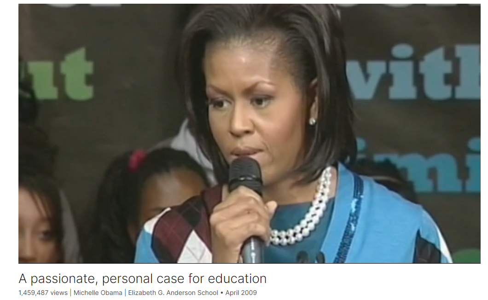

# A passionate, personal case for education

Link: [https://www.ted.com/talks/michelle_obama_a_passionate_personal_case_for_education](https://www.ted.com/talks/michelle_obama_a_passionate_personal_case_for_education)

Speaker:  Michelle Obama

Date: April 2009

@[toc]

## Introduction

Speaking to an audience of students, US First Lady Michelle Obama reminds each one to take their education seriously -- and never take it for granted. This new, brilliant generation, she tells us, is the one that could close the gap between the world as it is and the world as it should be.

## Vocabulary

official visit: 正式访问；官方访问

social standing: 社会地位

I wasn't raised with wealth or resources or any social standing to speak of. 我不是在财富或资源或任何社会地位下长大的。

working-class: 工人阶级的，劳动阶级的

stay-at-home mom: 全职妈妈，家庭主妇          

And I was the product of a working-class community. My father was a city worker all of his life, and my mother was a stay-at-home mom. 我是工人阶级社区的产物。我父亲一生都是城市工人，我母亲是全职妈妈。

attend university：上大学

Neither of them attended university. 他们俩都没上过大学。

sclerosis：美 [skləˈroʊsəs] 硬化；硬化症；多发性硬化；僵化

in the prime of one's life: 在壮年时期

My dad was diagnosed with multiple sclerosis in the prime of his life. 我父亲在壮年时被诊断出患有多发性硬化症。

instill： 逐渐灌输；徐徐滴入

perseverance：美 [ˌpɜːrsəˈvɪrəns] 毅力；不屈不挠的精神；韧性 **注意发音**

compassion, and integrity, and confidence, and perseverance 同情、正直、自信和毅力

in an unconditional love: 无条件的爱

She's an active presence in their lives, as well as mine, and is instilling in them the same values that she taught me and my brother: things like compassion, and integrity, and confidence, and perseverance -- all of that wrapped up in an unconditional love 她活跃在他们的生活中，也活跃在我的生活中，并向他们灌输她教给我和我哥哥的价值观:同情、正直、自信和毅力——所有这些都包含在无条件的爱中

admiration: 美 [ˌædməˈreɪʃn] 欣赏；倾慕；赞美对象

They taught me about what a strong marriage feels like: that it's built on faith and commitment and an admiration for each other's unique gifts. 他们教会了我什么是牢固的婚姻:它建立在信念和承诺以及对彼此独特天赋的钦佩之上。

raise a family: 养家糊口

He worked, helping people to find jobs and to try to bring resources into struggling neighborhoods. 他工作，帮助人们寻找工作，并试图将资源带入困境中的社区。

all too aften : 太经常，时常

settle for：勉强接受；满足于；将就     

aspiration：美 [ˌæspəˈreɪʃn] 抱负；愿望；志向；  

And sometimes we settle for the world as it is, even when it doesn't reflect our values and aspirations. 有时我们满足于世界的现状，即使它没有反映我们的价值观和愿望。

languishing：美 ['læŋgwɪʃɪŋ] 失去活力；变得衰弱；

The difference between a languishing nation and one that will flourish is the recognition that we need equal access to education for both boys and girls. 一个衰落的国家和一个繁荣的国家之间的区别在于我们是否认识到男孩和女孩都需要平等的受教育机会。

cut class：逃课

I never cut class 我从不逃课

fortitude：美 [ˈfɔːrtɪtuːd] 坚韧，刚毅

Your success will be determined by your own fortitude, your own confidence, your own individual hard work. 你的成功将取决于你自己的坚毅、你自己的信心和你个人的努力。

Because we are counting on you. 因为我们指望你了。

reins：美 [renz] 缰绳

to stand up and take the reins. 站起来控制局面。

## Summary

In her speech, Michelle Obama reflects on her journey as the First Lady of the United States during her first foreign trip. She emphasizes the importance of the special relationship between the U.S. and the U.K., highlighting shared values and the role of women in shaping the future. Michelle Obama recounts her humble beginnings on the South Side of Chicago and the influence of strong female and male role models in her life. She underscores the significance of education in empowering women and encourages the students to pursue their dreams and become leaders in their communities and beyond.

Next, Michelle Obama addresses the students directly, sharing personal anecdotes and emphasizing the value of education in shaping one's destiny. She encourages the students to embrace their intelligence, diligence, and resilience, regardless of their backgrounds. Michelle Obama highlights the achievements of women who defied societal barriers and paved the way for future generations. She urges the students to remain resolute in pursuing their dreams and using their talents to create positive change in the world.

In closing, Michelle Obama reaffirms her belief in the students' potential to overcome challenges and make a difference in the world. She expresses confidence in their abilities and encourages them to seize opportunities and fulfill their aspirations. Michelle Obama emphasizes the importance of strong, confident young women in addressing global challenges and concludes by expressing love and gratitude to the students for their dedication and potential.

## Transcript

This is my first trip,

my first foreign trip as a first lady.

Can you believe that?

(Applause)

And while this is not my first visit to the U.K.,

I have to say that I am glad that this is my first official visit.

The special relationship between the United States and the U.K.

is based not only on the relationship between governments,

but the common language and the values that we share,

and I'm reminded of that by watching you all today.

During my visit I've been especially honored

to meet some of Britain's most extraordinary women --

women who are paving the way for all of you.

And I'm honored to meet you,

the future leaders of Great Britain and this world.

And although the circumstances of our lives may seem very distant,

with me standing here as the First Lady of the United States of America,

and you, just getting through school,

I want you to know that we have very much in common.

For nothing in my life's path

would have predicted that I'd be standing here

as the first African-American First Lady

of the United States of America.

There is nothing in my story that would land me here.

I wasn't raised with wealth or resources

or any social standing to speak of.

I was raised on the South Side of Chicago.

That's the real part of Chicago.

And I was the product of a working-class community.

My father was a city worker all of his life,

and my mother was a stay-at-home mom.

And she stayed at home to take care of me and my older brother.

Neither of them attended university.

My dad was diagnosed with multiple sclerosis

in the prime of his life.

But even as it got harder for him to walk

and get dressed in the morning --

I saw him struggle more and more --

my father never complained about his struggle.

He was grateful for what he had.

He just woke up a little earlier and worked a little harder.

And my brother and I were raised with all that you really need:

love, strong values

and a belief that with a good education

and a whole lot of hard work,

that there was nothing that we could not do.

I am an example of what's possible

when girls from the very beginning of their lives

are loved and nurtured by the people around them.

I was surrounded by extraordinary women in my life:

grandmothers, teachers, aunts, cousins, neighbors,

who taught me about quiet strength and dignity.

And my mother, the most important role model in my life,

who lives with us at the White House

and helps to care for our two little daughters,

Malia and Sasha.

She's an active presence in their lives, as well as mine,

and is instilling in them

the same values that she taught me and my brother:

things like compassion, and integrity,

and confidence, and perseverance --

all of that wrapped up in an unconditional love

that only a grandmother can give.

I was also fortunate enough to be cherished and encouraged

by some strong male role models as well,

including my father, my brother, uncles and grandfathers.

The men in my life taught me some important things, as well.

They taught me about what a respectful relationship

should look like between men and women.

They taught me about what a strong marriage feels like:

that it's built on faith and commitment

and an admiration for each other's unique gifts.

They taught me about what it means

to be a father

and to raise a family.

And not only to invest in your own home

but to reach out and help raise kids

in the broader community.

And these were the same qualities

that I looked for in my own husband,

Barack Obama.

And when we first met,

one of the things that I remember is that he took me out on a date.

And his date was to go with him to a community meeting.

(Laughter)

I know, how romantic.

(Laughter)

But when we met, Barack was a community organizer.

He worked, helping people to find jobs

and to try to bring resources into struggling neighborhoods.

As he talked to the residents in that community center,

he talked about two concepts.

He talked about "the world as it is" and "the world as it should be."

And I talked about this throughout the entire campaign.

What he said, that all too often,

is that we accept the distance between those two ideas.

And sometimes we settle for the world as it is,

even when it doesn't reflect our values and aspirations.

But Barack reminded us on that day,

all of us in that room, that we all know

what our world should look like.

We know what fairness and justice and opportunity look like.

We all know.

And he urged the people in that meeting,

in that community,

to devote themselves to closing the gap

between those two ideas,

to work together to try to make the world as it is

and the world as it should be, one and the same.

And I think about that today because I am

reminded and convinced that all of you in this school

are very important parts of closing that gap.

You are the women who will build the world as it should be.

You're going to write the next chapter in history.

Not just for yourselves, but for your generation

and generations to come.

And that's why getting a good education

is so important.

That's why all of this that you're going through --

the ups and the downs, the teachers that you love and the teachers that you don't --

why it's so important.

Because communities and countries and ultimately the world

are only as strong as the health of their women.

And that's important to keep in mind.

Part of that health includes an outstanding education.

The difference between a struggling family and a healthy one

is often the presence of an empowered woman

or women at the center of that family.

The difference between a broken community and a thriving one

is often the healthy respect between men and women

who appreciate the contributions each other makes to society.

The difference between a languishing nation

and one that will flourish

is the recognition that we need equal access to education

for both boys and girls.

And this school, named after the U.K.'s first female doctor,

and the surrounding buildings named for Mexican artist Frida Kahlo,

Mary Seacole,

the Jamaican nurse known as the "black Florence Nightingale,"

and the English author, Emily Bronte,

honor women who fought sexism, racism and ignorance,

to pursue their passions to feed their own souls.

They allowed for no obstacles.

As the sign said back there, "without limitations."

They knew no other way to live

than to follow their dreams.

And having done so, these women

moved many obstacles.

And they opened many new doors

for millions of female doctors and nurses

and artists and authors,

all of whom have followed them.

And by getting a good education,

you too can control your own destiny.

Please remember that.

If you want to know the reason why I'm standing here,

it's because of education.

I never cut class. Sorry, I don't know if anybody is cutting class.

I never did it.

I loved getting As.

I liked being smart.

I liked being on time. I liked getting my work done.

I thought being smart was cooler than anything in the world.

And you too, with these same values,

can control your own destiny.

You too can pave the way.

You too can realize your dreams,

and then your job is to reach back

and to help someone just like you do the same thing.

History proves that it doesn't matter

whether you come from a council estate

or a country estate.

Your success will be determined

by your own fortitude,

your own confidence, your own individual hard work.

That is true. That is the reality of the world that we live in.

You now have control over your own destiny.

And it won't be easy -- that's for sure.

But you have everything you need.

Everything you need to succeed,

you already have, right here.

My husband works in this big office.

They call it the Oval Office.

In the White House, there's the desk that he sits at --

it's called the Resolute desk.

It was built by the timber of Her Majesty's Ship Resolute

and given by Queen Victoria.

It's an enduring symbol of the friendship between our two nations.

And its name, Resolute,

is a reminder of the strength of character that's required

not only to lead a country,

but to live a life of purpose, as well.

And I hope in pursuing your dreams, you all remain resolute,

that you go forward without limits,

and that you use your talents -- because there are many; we've seen them;

it's there --

that you use them to create the world as it should be.

Because we are counting on you.

We are counting on every single one of you

to be the very best that you can be.

Because the world is big.

And it's full of challenges.

And we need strong, smart, confident young women

to stand up and take the reins.

We know you can do it. We love you. Thank you so much.

(Applause)

## Afterword

2024年5月5日15点51分于上海。