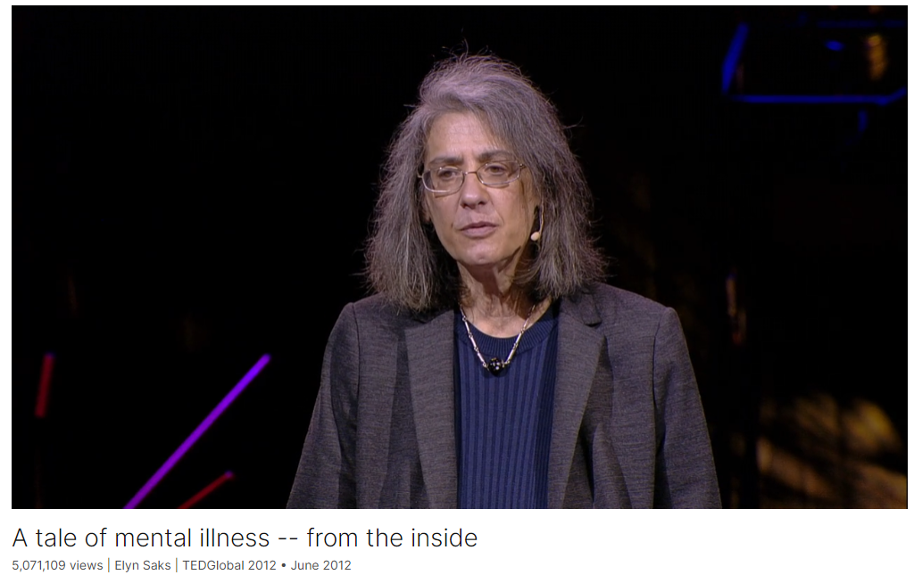

# A tale of mental illness -- from the inside

Link: [https://www.ted.com/talks/elyn_saks_a_tale_of_mental_illness_from_the_inside](https://www.ted.com/talks/elyn_saks_a_tale_of_mental_illness_from_the_inside)

Speaker:  Elyn Saks

Date: June 2012

@[toc]

## Introduction

"Is it okay if I totally trash your office?" It's a question Elyn Saks once asked her doctor, and it wasn't a joke. A legal scholar, in 2007 Saks came forward with her own story of schizophrenia, controlled by drugs and therapy but ever-present. In this powerful talk, she asks us to see people with mental illness clearly, honestly and compassionately.

## Vocabulary

## Summary

## Transcript

## Afterword

