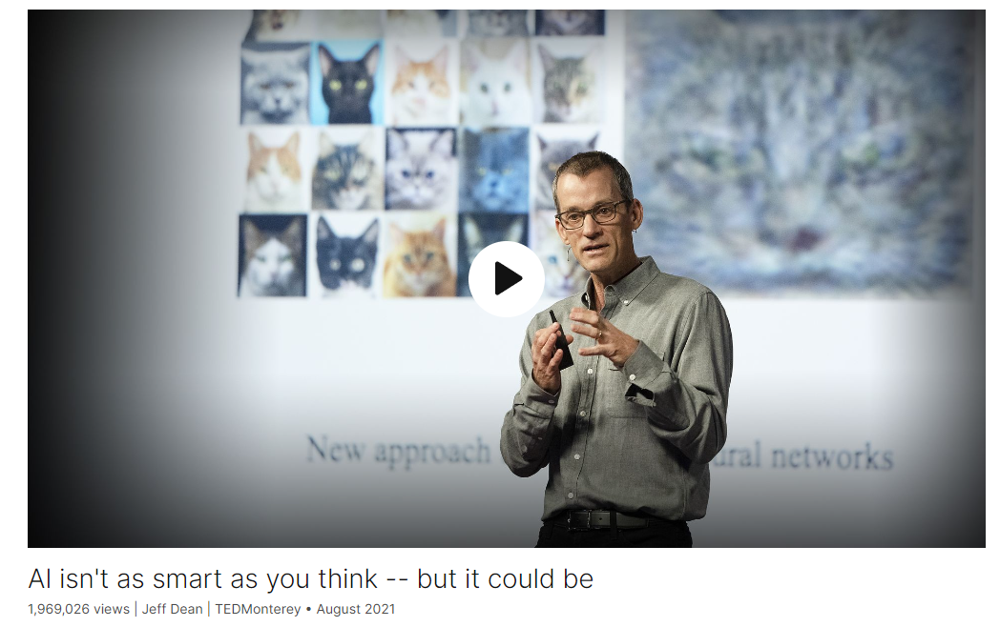

# AI isn't as smart as you think -- but it could be

Link: [https://www.ted.com/talks/jeff_dean_ai_isn_t_as_smart_as_you_think_but_it_could_be](https://www.ted.com/talks/jeff_dean_ai_isn_t_as_smart_as_you_think_but_it_could_be)

Speaker:  Jeff Dean

>**Jeffrey Adgate "Jeff" Dean** (born July 23, 1968) is an American [computer scientist](https://en.wikipedia.org/wiki/Computer_scientist) and [software engineer](https://en.wikipedia.org/wiki/Software_engineer). Since 2018, he has been the lead of [Google AI](https://en.wikipedia.org/wiki/Google_AI).[[1\]](https://en.wikipedia.org/wiki/Jeff_Dean#cite_note-1) He was appointed [Alphabet's](https://en.wikipedia.org/wiki/Alphabet_Inc.) chief scientist in 2023 after a reorganization of Alphabet's AI focused groups.[[2\]](https://en.wikipedia.org/wiki/Jeff_Dean#cite_note-2)

Date: August 2021

@[toc]

## Introduction

What is AI, really? Jeff Dean, the head of Google's AI efforts, explains the underlying technology that enables artificial intelligence to do all sorts of things, from understanding language to diagnosing disease -- and presents a roadmap for building better, more responsible systems that have a deeper understanding of the world. (Followed by a Q&A with head of TED Chris Anderson)

## Vocabulary

wedge into：挤进

when we were all wedged into a tiny office space 当我们都挤在一个狭小的办公室里

emulate：美 [ˈemjuleɪt] 模仿，仿效

a series of interconnected artificial neurons that loosely emulate the properties of your real neurons. 一系列相互连接的人造神经元，松散地模拟了真实神经元的特性。

tailored to：合身的，适合的，裁剪的

we also got excited about how we could build hardware that was better tailored to the kinds of computations neural networks wanted to do. 我们还对如何构建更适合神经网络想要进行的计算类型的硬件感到兴奋。

hone：磨砺，磨练

hydroponic：美 [ˌhaɪdrə'pɒnɪk] 水耕法的， 水栽法的

I've been honing my gardening skills, experimenting with vertical hydroponic gardening. 我一直在磨练我的园艺技能，尝试垂直水培园艺。

## Summary

Jeff Dean's speech focuses on the transformative potential of AI, highlighting the significant progress made in the last decade. He discusses the capabilities of AI in various domains, such as computer vision, language understanding, and medical diagnosis. Dean attributes this progress to advancements in neural networks and computational power. However, he acknowledges several shortcomings in current AI systems, including their single-task nature, limited modalities, and dense architecture.

Dean proposes solutions to address these shortcomings, advocating for the development of multitask models capable of handling diverse tasks and modalities. He emphasizes the importance of sparse, high-capacity models that can efficiently activate relevant components for specific tasks. Dean introduces the concept of "Pathways," a system designed to enable these approaches, which he believes will represent a significant step forward in AI research and development.

In addition to discussing technical advancements, Dean emphasizes the importance of responsible AI, highlighting the need for fairness, interpretability, privacy, and security in AI systems. He outlines Google's AI principles as a guiding framework for responsible AI development and acknowledges the ongoing research and challenges in this area. Dean concludes his speech by expressing optimism about the potential of AI to address complex societal challenges and the importance of multidisciplinary collaboration in realizing this potential.

## Transcript

Hi, I'm Jeff.

I lead AI Research and Health at Google.

I joined Google more than 20 years ago,

when we were all wedged
into a tiny office space,

above what's now a T-Mobile store
in downtown Palo Alto.

I've seen a lot of computing
transformations in that time,

and in the last decade, we've seen AI
be able to do tremendous things.

But we're still doing it
all wrong in many ways.

That's what I want
to talk to you about today.

But first, let's talk
about what AI can do.

So in the last decade,
we've seen tremendous progress

in how AI can help computers see,
understand language,

understand speech better than ever before.

Things that we couldn't do
before, now we can do.

If you think about computer vision alone,

just in the last 10 years,

computers have effectively
developed the ability to see;

10 years ago, they couldn't see,
now they can see.

You can imagine this has had
a transformative effect

on what we can do with computers.

So let's look at a couple
of the great applications

enabled by these capabilities.

We can better predict flooding,
keep everyone safe,

using machine learning.

We can translate over 100 languages
so we all can communicate better,

and better predict and diagnose disease,

where everyone gets
the treatment that they need.

So let's look at two key components

that underlie the progress
in AI systems today.

The first is neural networks,

a breakthrough approach to solving
some of these difficult problems

that has really shone
in the last 15 years.

But they're not a new idea.

And the second is computational power.

It actually takes a lot
of computational power

to make neural networks
able to really sing,

and in the last 15 years,
we’ve been able to have that,

and that's partly what's enabled
all this progress.

But at the same time,
I think we're doing several things wrong,

and that's what I want
to talk to you about

at the end of the talk.

First, a bit of a history lesson.

So for decades,

almost since the very
beginning of computing,

people have wanted
to be able to build computers

that could see, understand language,
understand speech.

The earliest approaches
to this, generally,

people were trying to hand-code
all the algorithms

that you need to accomplish
those difficult tasks,

and it just turned out
to not work very well.

But in the last 15 years,
a single approach

unexpectedly advanced all these different
problem spaces all at once:

neural networks.

So neural networks are not a new idea.

They're kind of loosely based

on some of the properties
that are in real neural systems.

And many of the ideas
behind neural networks

have been around since the 1960s and 70s.

A neural network is what it sounds like,

a series of interconnected
artificial neurons

that loosely emulate the properties
of your real neurons.

An individual neuron
in one of these systems

has a set of inputs,

each with an associated weight,

and the output of a neuron

is a function of those inputs
multiplied by those weights.

So pretty simple,

and lots and lots of these work together
to learn complicated things.

So how do we actually learn
in a neural network?

It turns out the learning process

consists of repeatedly making
tiny little adjustments

to the weight values,

strengthening the influence
of some things,

weakening the influence of others.

By driving the overall system
towards desired behaviors,

these systems can be trained
to do really complicated things,

like translate
from one language to another,

detect what kind
of objects are in a photo,

all kinds of complicated things.

I first got interested in neural networks

when I took a class on them
as an undergraduate in 1990.

At that time,

neural networks showed
impressive results on tiny problems,

but they really couldn't scale to do
real-world important tasks.

But I was super excited.

(Laughter)

I felt maybe we just needed
more compute power.

And the University of Minnesota
had a 32-processor machine.

I thought, "With more compute power,

boy, we could really make
neural networks really sing."

So I decided to do a senior thesis
on parallel training of neural networks,

the idea of using processors in a computer
or in a computer system

to all work toward the same task,

that of training neural networks.

32 processors, wow,

we’ve got to be able
to do great things with this.

But I was wrong.

Turns out we needed about a million times
as much computational power

as we had in 1990

before we could actually get
neural networks to do impressive things.

But starting around 2005,

thanks to the computing progress
of Moore's law,

we actually started to have
that much computing power,

and researchers in a few universities
around the world started to see success

in using neural networks for a wide
variety of different kinds of tasks.

I and a few others at Google
heard about some of these successes,

and we decided to start a project
to train very large neural networks.

One system that we trained,

we trained with 10 million
randomly selected frames

from YouTube videos.

The system developed the capability

to recognize all kinds
of different objects.

And it being YouTube, of course,

it developed the ability
to recognize cats.

YouTube is full of cats.

(Laughter)

But what made that so remarkable

is that the system was never told
what a cat was.

So using just patterns in data,

the system honed in on the concept
of a cat all on its own.

All of this occurred at the beginning
of a decade-long string of successes,

of using neural networks
for a huge variety of tasks,

at Google and elsewhere.

Many of the things you use every day,

things like better speech
recognition for your phone,

improved understanding
of queries and documents

for better search quality,

better understanding of geographic
information to improve maps,

and so on.

Around that time,

we also got excited about how we could
build hardware that was better tailored

to the kinds of computations
neural networks wanted to do.

Neural network computations
have two special properties.

The first is they're very tolerant
of reduced precision.

Couple of significant digits,
you don't need six or seven.

And the second is that all the
algorithms are generally composed

of different sequences
of matrix and vector operations.

So if you can build a computer

that is really good at low-precision
matrix and vector operations

but can't do much else,

that's going to be great
for neural-network computation,

even though you can't use it
for a lot of other things.

And if you build such things,
people will find amazing uses for them.

This is the first one we built, TPU v1.

"TPU" stands for Tensor Processing Unit.

These have been used for many years
behind every Google search,

for translation,

in the DeepMind AlphaGo matches,

so Lee Sedol and Ke Jie
maybe didn't realize,

but they were competing
against racks of TPU cards.

And we've built a bunch
of subsequent versions of TPUs

that are even better and more exciting.

But despite all these successes,

I think we're still doing
many things wrong,

and I'll tell you about three
key things we're doing wrong,

and how we'll fix them.

The first is that most
neural networks today

are trained to do one thing,
and one thing only.

You train it for a particular task
that you might care deeply about,

but it's a pretty heavyweight activity.

You need to curate a data set,

you need to decide
what network architecture you'll use

for this problem,

you need to initialize the weights
with random values,

apply lots of computation
to make adjustments to the weights.

And at the end, if you’re lucky,
you end up with a model

that is really good
at that task you care about.

But if you do this over and over,

you end up with thousands
of separate models,

each perhaps very capable,

but separate for all the different
tasks you care about.

But think about how people learn.

In the last year, many of us
have picked up a bunch of new skills.

I've been honing my gardening skills,

experimenting with vertical
hydroponic gardening.

To do that, I didn't need to relearn
everything I already knew about plants.

I was able to know
how to put a plant in a hole,

how to pour water, that plants need sun,

and leverage that
in learning this new skill.

Computers can work
the same way, but they don’t today.

If you train a neural
network from scratch,

it's effectively like forgetting
your entire education

every time you try to do something new.

That’s crazy, right?

So instead, I think we can
and should be training

multitask models that can do
thousands or millions of different tasks.

Each part of that model would specialize
in different kinds of things.

And then, if we have a model
that can do a thousand things,

and the thousand and first
thing comes along,

we can leverage
the expertise we already have

in the related kinds of things

so that we can more quickly be able
to do this new task,

just like you, if you're confronted
with some new problem,

you quickly identify
the 17 things you already know

that are going to be helpful
in solving that problem.

Second problem is that most
of our models today

deal with only a single
modality of data --

with images, or text or speech,

but not all of these all at once.

But think about how you
go about the world.

You're continuously using all your senses

to learn from, react to,

figure out what actions
you want to take in the world.

Makes a lot more sense to do that,

and we can build models in the same way.

We can build models that take in
these different modalities of input data,

text, images, speech,

but then fuse them together,

so that regardless of whether the model
sees the word "leopard,"

sees a video of a leopard
or hears someone say the word "leopard,"

the same response
is triggered inside the model:

the concept of a leopard

can deal with different
kinds of input data,

even nonhuman inputs,
like genetic sequences,

3D clouds of points,
as well as images, text and video.

The third problem
is that today's models are dense.

There's a single model,

the model is fully activated
for every task,

for every example
that we want to accomplish,

whether that's a really simple
or a really complicated thing.

This, too, is unlike
how our own brains work.

Different parts of our brains
are good at different things,

and we're continuously calling
upon the pieces of them

that are relevant for the task at hand.

For example, nervously watching
a garbage truck

back up towards your car,

the part of your brain that thinks
about Shakespearean sonnets

is probably inactive.

(Laughter)

AI models can work the same way.

Instead of a dense model,

we can have one
that is sparsely activated.

So for particular different tasks,
we call upon different parts of the model.

During training, the model can also learn
which parts are good at which things,

to continuously identify what parts
it wants to call upon

in order to accomplish a new task.

The advantage of this is we can have
a very high-capacity model,

but it's very efficient,

because we're only calling
upon the parts that we need

for any given task.

So fixing these three things, I think,

will lead to a more powerful AI system:

instead of thousands of separate models,

train a handful of general-purpose models

that can do thousands
or millions of things.

Instead of dealing with single modalities,

deal with all modalities,

and be able to fuse them together.

And instead of dense models,
use sparse, high-capacity models,

where we call upon the relevant
bits as we need them.

We've been building a system
that enables these kinds of approaches,

and we’ve been calling
the system “Pathways.”

So the idea is this model
will be able to do

thousands or millions of different tasks,

and then, we can incrementally
add new tasks,

and it can deal
with all modalities at once,

and then incrementally learn
new tasks as needed

and call upon the relevant
bits of the model

for different examples or tasks.

And we're pretty excited about this,

we think this is going
to be a step forward

in how we build AI systems.

But I also wanted
to touch on responsible AI.

We clearly need to make sure
that this vision of powerful AI systems

benefits everyone.

These kinds of models raise
important new questions

about how do we build them with fairness,

interpretability, privacy and security,

for all users in mind.

For example, if we're going
to train these models

on thousands or millions of tasks,

we'll need to be able to train them
on large amounts of data.

And we need to make sure that data
is thoughtfully collected

and is representative of different
communities and situations

all around the world.

And data concerns are only
one aspect of responsible AI.

We have a lot of work to do here.

So in 2018, Google published
this set of AI principles

by which we think about developing
these kinds of technology.

And these have helped guide us
in how we do research in this space,

how we use AI in our products.

And I think it's a really helpful
and important framing

for how to think about these deep
and complex questions

about how we should
be using AI in society.

We continue to update these
as we learn more.

Many of these kinds of principles
are active areas of research --

super important area.

Moving from single-purpose systems
that kind of recognize patterns in data

to these kinds of general-purpose
intelligent systems

that have a deeper
understanding of the world

will really enable us to tackle

some of the greatest problems
humanity faces.

For example,

we’ll be able to diagnose more disease;

we'll be able to engineer better medicines

by infusing these models
with knowledge of chemistry and physics;

we'll be able to advance
educational systems

by providing more individualized tutoring

to help people learn
in new and better ways;

we’ll be able to tackle
really complicated issues,

like climate change,

and perhaps engineering
of clean energy solutions.

So really, all of these kinds of systems

are going to be requiring
the multidisciplinary expertise

of people all over the world.

So connecting AI
with whatever field you are in,

in order to make progress.

So I've seen a lot
of advances in computing,

and how computing, over the past decades,

has really helped millions of people
better understand the world around them.

And AI today has the potential
to help billions of people.

We truly live in exciting times.

Thank you.

(Applause)

## Q&A with Chris Anderson

Chris Anderson: Thank you so much.

I want to follow up on a couple things.

This is what I heard.

Most people's traditional picture of AI

is that computers recognize
a pattern of information,

and with a bit of machine learning,

they can get really good at that,
better than humans.

What you're saying is those patterns

are no longer the atoms
that AI is working with,

that it's much richer-layered concepts

that can include all manners
of types of things

that go to make up a leopard, for example.

So what could that lead to?

Give me an example
of when that AI is working,

what do you picture happening in the world

in the next five or 10 years
that excites you?

Jeff Dean: I think
the grand challenge in AI

is how do you generalize
from a set of tasks

you already know how to do

to new tasks,

as easily and effortlessly as possible.

And the current approach of training
separate models for everything

means you need lots of data
about that particular problem,

because you're effectively trying
to learn everything

about the world
and that problem, from nothing.

But if you can build these systems

that already are infused with how to do
thousands and millions of tasks,

then you can effectively
teach them to do a new thing

with relatively few examples.

So I think that's the real hope,

that you could then have a system
where you just give it five examples

of something you care about,

and it learns to do that new task.

CA: You can do a form
of self-supervised learning

that is based on remarkably
little seeding.

JD: Yeah, as opposed to needing
10,000 or 100,000 examples

to figure everything in the world out.

CA: Aren't there kind of terrifying
unintended consequences

possible, from that?

JD: I think it depends
on how you apply these systems.

It's very clear that AI
can be a powerful system for good,

or if you apply it in ways
that are not so great,

it can be a negative consequence.

So I think that's why it's important
to have a set of principles

by which you look at potential uses of AI

and really are careful and thoughtful
about how you consider applications.

CA: One of the things
people worry most about

is that, if AI is so good at learning
from the world as it is,

it's going to carry forward
into the future

aspects of the world as it is
that actually aren't right, right now.

And there's obviously been
a huge controversy about that

recently at Google.

Some of those principles
of AI development,

you've been challenged that you're not
actually holding to them.

Not really interested to hear
about comments on a specific case,

but ... are you really committed?

How do we know that you are
committed to these principles?

Is that just PR, or is that real,
at the heart of your day-to-day?

JD: No, that is absolutely real.

Like, we have literally hundreds of people

working on many of these
related research issues,

because many of those
things are research topics

in their own right.

How do you take data from the real world,

that is the world as it is,
not as we would like it to be,

and how do you then use that
to train a machine-learning model

and adapt the data bit of the scene

or augment the data with additional data

so that it can better reflect
the values we want the system to have,

not the values that it sees in the world?

CA: But you work for Google,

Google is funding the research.

How do we know that the main values
that this AI will build

are for the world,

and not, for example, to maximize
the profitability of an ad model?

When you know everything
there is to know about human attention,

you're going to know so much

about the little wriggly,
weird, dark parts of us.

In your group, are there rules
about how you hold off,

church-state wall
between a sort of commercial push,

"You must do it for this purpose,"

so that you can inspire
your engineers and so forth,

to do this for the world, for all of us.

JD: Yeah, our research group
does collaborate

with a number of groups across Google,

including the Ads group,
the Search group, the Maps group,

so we do have some collaboration,
but also a lot of basic research

that we publish openly.

We've published more
than 1,000 papers last year

in different topics,
including the ones you discussed,

about fairness, interpretability
of the machine-learning models,

things that are super important,

and we need to advance
the state of the art in this

in order to continue to make progress

to make sure these models
are developed safely and responsibly.

CA: It feels like we're at a time
when people are concerned

about the power of the big tech companies,

and it's almost, if there was ever
a moment to really show the world

that this is being done
to make a better future,

that is actually key to Google's future,

as well as all of ours.

JD: Indeed.

CA: It's very good to hear you
come and say that, Jeff.

Thank you so much for coming here to TED.

JD: Thank you.

(Applause)

## Afterword

2024年4月29日18点23分完成这篇演讲的学习。