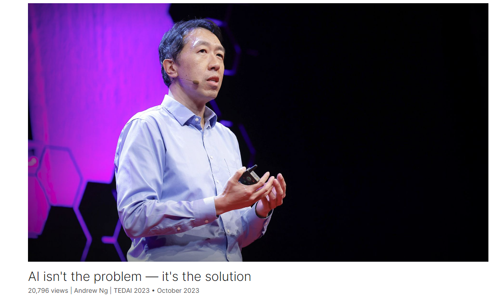

# TED英文文稿

@[toc]

2024年4月6日学习吴恩达的这篇演讲

# AI isn't the problem — it's the solution

Link: [AI isn't the problem — it's the solution](https://www.ted.com/talks/andrew_ng_ai_isn_t_the_problem_it_s_the_solution)

Speaker: Andrew Ng 

Date: October 2023

## Introduction

People are growing anxious about AI, believing it's going to amplify our worst impulses, take our jobs or even wipe out humanity. But the doomsayers have it wrong, says AI visionary Andrew Ng. He debunks each concern, suggesting we need more AI, not less, if we're to solve the world's most pressing problems.

人们对人工智能越来越焦虑，认为它会放大我们最糟糕的冲动，夺走我们的工作，甚至毁灭人类。但AI先驱吴恩达说，那些预言世界末日的人错了。他驳斥了每一个担忧，暗示如果我们要解决世界上最紧迫的问题，我们需要更多的人工智能，而不是更少。

## Vocabulary

doomsayer: 美 [ˈdumˌseɪər] 灾难预言者

debunk: 美 [ˌdiːˈbʌŋk] 拆穿；揭穿;驳斥

anxiety over xxx: 对于xxx的焦虑，用over

conpetence: 美 [ˈkɑːmpɪtəns] 能力，胜任

legitimacy：美 [ləˈdʒɪtəməsi] 合法性

treat xxx fairly: 公平对待xxx

Along with: 伴随着，example：**Along with** these amazing capabilities **have come** many worries.

The part of the sentence "Along with these amazing capabilities have come many worries" **is grammatically correct** and **can be used in written English**.It can be used when discussing the positive and negative effects or consequences of something, or when discussing a situation where there are both good and bad aspects. Example: Along with the technological advancements in the medical field, such as robotic surgery and artificial intelligence, have come many worries about the potential loss of jobs for human healthcare workers.随着医疗领域的技术进步，如机器人手术和人工智能，人们对人类医护人员可能失去工作感到担忧。

I like to be a cheerleader for AI, not a critic. I think that, like electricity, AI will advance nearly every human endeavor. 我喜欢成为人工智能的支持者，而不是批评家。我认为，像电力一样，人工智能将推动几乎所有人类努力。

sympathetic to somebody: 同情某人 美 [ˌsɪmpəˈθetɪk]

unsettling：令人不安的

But I'm sympathetic to the people that find this technology unsettling. Humor me for a minute. I'd like to step into the shoes of the critics, because I think they make some thoughtful points, and I want everyone to understand these points. 但我同情那些觉得这项技术令人不安的人。迁就我一会儿。我想站在批评家的立场上，因为我认为他们提出了一些深思熟虑的观点，我希望每个人都能理解这些观点。

Humor me for a minute 迁就我一会儿。

>*Humor me* is a phrase that is used when someone wants someone else to do something, even though they may not want to do it or may not think it is necessary.
>
>It is often used as a way of asking for a favor or a small indulgence, and it implies that the person asking is not taking the request too seriously and is just trying to be playful or lighthearted.
>
>For example, you might say:
>
>- "**Humor me and try this dish, I think you'll really like it**," if you are trying to persuade a friend to try something new.
>
>- "**Humor me and let me show you this trick, it's really cool**," if you want to demonstrate something to someone.
>
>When using the phrase, you can simply say it to the person you are addressing, followed by a request or suggestion. It is often used in a friendly or playful tone, to convey that you are not making a serious or demanding request.
>
>Source： https://en.amazingtalker.com/questions/1307

step into the shoes of xxx: 站在xxx的立场上

mimic: 模仿

Today's largest AI models have learned to mimic human capabilities by analyzing huge amounts of text and images on the internet. But the internet reflects not just humanity's best qualities, but also some of its worst, including our prejudices, our hatreds, our misconceptions. AI learns to mimic these negative qualities, too.

prejudice: 美 [ˈpredʒudɪs]  偏见

hatred：美 [ˈheɪtrɪd] 仇恨，恶意

misconception：美 [ˌmɪskənˈsepʃn] 误解

put xxx out of work： 让xxx失业 Will AI put many people out of work?

altogether：彻底地，完全地

prominent: 著名的，卓越的

To some people, these are reasons enough to pause or even stop developments in AI altogether. Earlier this year, about 34,000 people, including some prominent scientists, signed a declaration calling for a pause in advanced AI research. 对一些人来说，这些理由足以暂停甚至完全停止人工智能的发展。今年早些时候，包括一些著名科学家在内的约3.4万人签署了一份宣言，呼吁暂停高级人工智能研究。

mitigate these problems：缓解这些问题

tackle problems of all kinds：解决各种问题

I'd like to show you how we can continue to develop AI in ways that mitigate these problems. And while today's solutions aren't likely to be permanent, these developments will lead to new ones that will then carry us past current limitations. Better yet, this will lead us all to a brighter future in which all of us have far greater capabilities to tackle problems of all kinds.我想向大家展示我们如何以缓解这些问题的方式继续开发人工智能。虽然今天的解决方案不太可能是永久的，但这些发展将带来新的解决方案，使我们超越当前的限制。更好的是，这将引导我们所有人走向一个更光明的未来，在这个未来中，我们所有人都有更大的能力来解决各种问题。

xxx be prone to xxx：美 [proʊn tu]  倾向于

social bias：社会偏见

distort the reality that xxx：扭曲了xxx的现实

An AI model, after its initial training, if asked to fill in the blank in "The 'blank' was a CEO," is prone to choose the word "man." Of course, many CEOs are men, but this is a social bias, and the idea that CEOs should be men distorts the reality that people of all genders can successfully lead companies.一个人工智能模型在经过初步训练后，如果被要求填写“这个‘空白’是一位首席执行官”中的空白，则倾向于选择“人”这个词。当然，许多首席执行官是男性，但这是一种社会偏见，首席执行官应该是男性的想法扭曲了所有性别的人都可以成功领导公司的现实。

nonsensical：美 [nɑnˈsensɪkl] 无意义的

slur：美 [slɜːr] 诽谤， a gender or racial slur

Then the next step is to ask humans to score these answers, giving a high score to the highly desirable answers like men or women, and a low score to undesirable answers such as airplane, which is nonsensical, or anything that contains a gender or racial slur.然后下一步是让人们给这些答案打分，给非常想要的答案打高分，比如男性或女性，给不喜欢的答案打低分，比如飞机，这是无意义的，或者任何包含性别或种族诽谤的答案。

reduce bias based on gender, race or religion,减少xxx的偏见

With this technique, we can teach an AI that people of all genders can be CEOs. And this also significantly reduces bias based on gender, race, or religion, makes AI much less prone to handling harmful information, and makes it much more likely to be respectful and helpful to people.通过这种技术，我们可以教会人工智能，所有性别的人都可以成为首席执行官。这也大大减少了基于性别、种族或宗教的偏见，使人工智能更不容易产生有害信息，并使其更有可能尊重和帮助人们。

radiology：美 [ˌreɪdiˈɑlədʒi]  放射学

radiologist：美 [ˌreɪdiˈɑlədʒɪst]  放射科医师

But with every major wave of technology innovation, from the steam engine to electricity to the computer, the technology has created far more jobs than it has destroyed.但是随着每一次重大的技术创新浪潮，从蒸汽机到电力再到计算机，技术创造的就业机会远远多于它摧毁的就业机会。

upside：美 [ˈʌpsaɪd] 积极的一面

amok：美 [əˈmək] 失去理智地，胡作非为地

tragic：美 [ˈtrædʒɪk] 悲惨的，悲痛的；tragic loss：悲惨的损失，巨大的损失

We know that AI can run amok. Self-driving cars have crashed, leading to the tragic loss of life. In 2010, an automated trading algorithm crashed the stock market, and in the criminal justice system, AI has led to unfair sentencing decisions. So we know that poorly designed software can have a dramatic impact.我们知道人工智能可以横行无忌。自动驾驶汽车已经坠毁，导致悲惨的生命损失。2010年，一种自动交易算法使股票市场崩溃，在刑事司法系统中，人工智能导致了不公平的量刑决定。所以我们知道设计不良的软件会产生巨大的影响。

inadvertently：美 [ˌɪnədˈvɜːrtəntli]  不是故意地，疏忽地

Others were worried about AI driving humanity to extinction inadvertently, similar to how humans have driven many other species to extinction through a simple lack of awareness that our actions could lead to that outcome. 其他人则担心人工智能会在不经意间将人类推向灭绝，就像人类仅仅因为没有意识到我们的行为可能导致这一结果而将许多其他物种推向灭绝一样。

ample：丰富的

Humanity has ample experience controlling things far more powerful than any one of us, such as corporations and nation-states.

buffet：美 [bəˈfeɪ , ˈbʌfɪt] 连续猛击；反复敲打

devise：美 [dɪˈvaɪz]  设计，发明

No one can fully control an airplane today. It's buffeted around by winds and turbulence, and the pilot may make a mistake. In the early days of aviation, airplanes killed a lot of people. But we learned from those experiences and built safer aircraft and devised better rules by which to operate them, so that today most of us can step into an airplane without fearing for our lives. 今天没有人能完全控制飞机。它受到风和湍流的冲击，飞行员可能会犯错误。在航空发展的早期，飞机夺去了很多人的生命。但是我们从这些经验中吸取了教训，建造了更安全的飞机，并设计了更好的操作规则，因此今天我们大多数人都可以步入飞机而不必担心我们的生命。

medical condition：医疗状况，身体条件

fall sick：生病，患病

huge bill：巨额账单

see a doctor for falling sick: 生病去看医生

So AI opens up the potential for every individual to hire intelligence inexpensively, so that you no longer have to worry about that huge bill from going to see a doctor for falling sick, or for getting an education. And you be able to hire an army of smart, well-intentioned, well-informed staff to help you think things through. 因此，人工智能开启了每个人廉价雇佣智能的潜力，这样你就不必再担心生病去看医生或接受教育的巨额账单。你还可以雇佣一群聪明、善良、消息灵通的AI员工来帮你思考问题。

revolutionize: 美 [ˌrevəˈluːʃənaɪz] 彻底改变

be poised to：正准备，将

AI is the new electricity. And it is poised to revolutionize every industry and every corner of human life. 人工智能是新的电力。它将彻底改变每个行业和人类生活的每个角落。

electrocution:美 [ɪˌlektrə'kjuʃn] 电死，触电死亡

Many of the fears about AI today are similar to the fears about electricity when that was new. People were terrified about electrocution or about electricity sparking devastating fires. Today, electricity still has its dangers, but I think few of us would give up light, heat, and refrigeration for fear of electrocution.今天对人工智能的许多担忧类似于当时对电力的担忧。人们害怕触电或电引发毁灭性的火灾。今天，电仍然有其危险，但我认为我们中很少有人会因为害怕触电而放弃电灯、制热和制冷。

recede：美 [rɪˈsiːd]，后退，逐渐减少  the problems will recede

And as the technology improves, the problems of AI that alarm us so much today will recede.

muster: 美 [ˈmʌstər] 召集，集合，聚集

And I think for all of us to address and solve these global problems, we will need all the intelligence -- including all the artificial intelligence -- we can muster. 我认为对于我们所有人来说，要处理和解决这些全球性问题，我们需要所有的智慧，包括所有的人工智能。

## Summary

In this speech, the speaker discusses the prevailing anxiety surrounding artificial intelligence (AI) and addresses various concerns related to its development and impact on society. The speaker acknowledges the significant advancements in AI, from recognizing images to generating creative content, and the accompanying worries about its potential negative consequences.

The speaker emphasizes the need to view AI as a tool for progress rather than a threat, likening it to electricity, which revolutionized human endeavor. They acknowledge the valid concerns raised by critics but argue that these are engineering problems that can be solved rather than insurmountable obstacles.

Furthermore, the speaker highlights the importance of addressing biases in AI and suggests techniques like reinforcement learning from human feedback to mitigate these issues. They also discuss the impact of AI on employment, explaining that while it will change the nature of work, it will also create new opportunities.

Overall, the speaker advocates for embracing AI as a solution to many of humanity's challenges, stressing the need for continued development and responsible use to ensure a brighter future for all. 总的来说，演讲者倡导将人工智能作为解决人类许多挑战的解决方案，强调需要持续发展和负责任的使用，以确保所有人都有一个更光明的未来。

insurmountable：美 [ˌɪnsərˈmaʊntəbl] 不能克服的；难以逾越的

## Transcript

We're living in a time of great anxiety.

Anxiety over the environment,

over the competence
and legitimacy of authority,

of whether society
can treat people fairly

and of what sort of future awaits us all.

AI has inherited a large share
of this anxiety.

In a short time,

AI has gone from recognizing
photos of cats

to generating high-quality essays

and paintings and music.

Along with these amazing capabilities
have come many worries.

I like to be a cheerleader
for AI, not a critic.

I think that, like electricity, AI will
advance nearly every human endeavor.

But I'm sympathetic to the people
that find this technology unsettling.

Humor me for a minute.

I'd like to step
into the shoes of the critics,

because I think they make
some thoughtful points,

and I want everyone
to understand these points.

Today's largest AI models have learned
to mimic human capabilities

by analyzing huge amounts of text
and images on the internet.

But the internet reflects not just
humanity's best qualities,

but also some of its worst,

including our prejudices, our hatreds,

our misconceptions.

AI learns to mimic
these negative qualities, too.

So will AI amplify
humanity's worst impulses?

But the anxiety doesn't end there.

Who will be able to make a living
when AI can do our jobs faster

and cheaper than any of us?

Will AI put many people out of work?

But maybe it gets even worse.

What if AI takes over
and kills off humanity?

I mean, this is terrible.

To some people, these are
reasons enough to pause

or even stop developments
in AI altogether.

Earlier this year,

about 34,000 people,
including some prominent scientists,

signed a declaration calling
for a pause in advanced AI research.

But I'm here to tell you
that this anxiety is misplaced.

I don't think we need less AI.

We need much more.

The flaws of AI today, I think,

are engineering problems to be solved,

rather than a fundamental evil force
that must be stopped.

In other words,

I say to the critics
that want to slow down AI,

you've got it wrong.

AI is not the problem, it's the solution.

I'd like to show you how
we can continue to develop AI

in ways that mitigate these problems.

And while today's solutions
aren't likely to be permanent,

these developments will lead to new ones

that will then carry us
past current limitations.

Better yet, this will lead us all
to a brighter future

in which all of us
have far greater capabilities

to tackle problems of all kinds.

As I mentioned,

AI can amplify or echo some
of humanity's worst impulses,

including our prejudices.

An AI model, after its initial training,

if asked to fill in the blank
in "The 'blank' was a CEO,"

is prone to choose the word "man."

Of course, many CEOs are men,
but this is a social bias,

and the idea that CEOs should be men
distorts the reality

that people of all genders
can successfully lead companies.

There are many ways to mitigate this.

A popular technique is called
reinforcement learning

from human feedback, or RLHF,

which trains AI to generate outputs
better aligned with human preferences.

I'm going to get a little technical here,

because I want everyone to understand
exactly how this works,

because I think with that understanding
AI can seem less scary.

So we start with a language model
that's been trained to generate text

or generate answers.

The first step of RLHF is to ask this
to answer lots of questions

like, fill in the blank --

"The 'blank' was a CEO" --
and to collect different answers.

Then the next step is to ask humans
to score these answers,

giving a high score to the highly
desirable answers like men or women,

and a low score to undesirable answers
such as airplane, which is nonsensical,

or anything that contains
a gender or racial slur.

The next step is slightly more complex
because human intelligence,

human ratings are expensive to get,

but machine intelligence
can be made inexpensive.

The next step is to use the answers
and the human scores as data

to train a second AI model,

called the reward model,

whose job is to mimic
how humans score the answers.

Finally, armed with a reward model,

the first model, the language model
can now score as many answers as it wants

and thus it can use it
to score lots of answers

and train itself to generate more answers

that deserve high scores

and that therefore are considered
more desirable by humans.

With this technique, we can teach an AI
that people of all genders can be CEOs.

And this also significantly reduces
bias based on gender,

race or religion,

makes AI much less prone
to handle harmful information

and makes it much more likely
to be respectful and helpful to people.

Will AI take people's jobs?

To answer that, let's look to radiology.

In 2016, Geoffrey Hinton,

who is a pioneer in deep learning
and a friend of mine,

said to a conference
of machine-learning engineers

that AI is becoming so good
at analyzing X-rays,

that within five years,
they could take radiologists' jobs.

Now, seven years later,

AI is still far
from replacing radiologists.

Why is that?

Well, two reasons.

First, it turns out
that interpreting X-rays is harder

than it had looked back then,
though, we are making progress.

And second, radiologists actually do
much more than interpret X-ray images.

They also do tasks
like gather patient's history

or develop a treatment plan.

And AI is still far from being able
to automate all of these tasks

that a radiologist does.

Because many jobs
comprise lots of different tasks,

and AI automates tasks rather than jobs,

we're still very far from AI being able
to fully automate many jobs.

But AI does automate tasks,
and so the nature of work will change.

That's why, as my friend Curt Langlotz,

who is a professor
of radiology at Stanford,

says, "AI won't replace radiologists,

but radiologists that use AI

will replace radiologists that don't."

And we'll see this to hold true
in many other professions as well.

Now, I don't mean to minimize

the challenge of helping
many people adopt AI,

or the suffering of the much
smaller number of people

whose jobs will disappear,

or our responsibility to make sure
they have a safety net

and that they have an opportunity
to gain new skills.

But with every major wave
of technology innovation,

from the steam engine
to electricity to the computer,

the technology has created far more jobs
than it has destroyed.

It turns out also,
with most waves of technology,

businesses would choose
to focus on economic growth

because the additional
revenue growth is unlimited.

There's no limit to the upside

as opposed to cost cutting
and cost savings,

because you can save some money,

but you can only save so much money.

So AI will bring us tremendous growth
and will create many, many,

many new jobs in the process.

This brings us to the third
and maybe the biggest anxiety.

Will AI kill us all?

We know that AI can run amok.

Self-driving cars have crashed,
leading to the tragic loss of life.

In 2010, an automated trading algorithm
crashed the stock market

and in the criminal justice system,

AI has led to unfair sentencing decisions.

So we know that poorly designed software
can have a dramatic impact.

But can AI wipe out humanity?

I don't see how.

Recently, I sought out people
that were concerned by this question,

and I spoke with some of the smartest
people in AI that I know.

Some were worried about AI being used
by a bad actor to destroy humanity,

say, by creating a bioweapon.

Others were worried about AI

driving humanity
to extinction inadvertently,

similar to how humans have driven
many other species to extinction

through a simple lack of awareness

that our actions could lead
to that outcome.

I tried to evaluate
how realistic are these arguments,

but I found them
to be vague and nonspecific.

They mostly boil down to,
"It could happen."

And try to prove that AI can't

is akin to proving a negative,

and I can't prove that superintelligent
AI won't be dangerous,

but it seems that no one really knows
precisely how it could be.

But I do know this.

Humanity has ample experience
controlling things

far more powerful than any one of us,

such as corporations and nation states.

And there are also many things
that no one can fully control

that we nonetheless consider
very valuable and safe.

For example, take airplanes.

No one can fully control
an airplane today.

It's buffeted around
by winds and turbulence,

and the pilot may make a mistake.

In the early days of aviation,

airplanes killed a lot of people.

But we learned from those experiences
and built safer aircraft

and devised better rules
by which to operate them,

so that today most of us
can step into an airplane

without fearing for our lives.

Similarly, with AI, we are learning
to better control it

and are making it safer every day.

Intelligence is the power to apply skills
and knowledge to make good decisions.

We invest years of our lives
and trillions of dollars on education,

all to develop our ability
to make better decisions.

Human intelligence is very expensive.

This is why only the wealthiest among us

can afford to hire huge
amounts of intelligence,

like that specialist doctor,

to carefully examine, think about,

and advise you on a medical condition

or a tutor that can truly take the time
to understand your child

and gently coach them
where they need help.

But unlike human intelligence,

artificial intelligence can be made cheap.

So AI opens up the potential

for every individual to hire
intelligence inexpensively,

so that you no longer have to worry
about that huge bill

from going to see a doctor
for falling sick,

or for getting an education.

And you be able to hire an army
of smart, well-intentioned,

well-informed staff to help you
think things through.

And for society, too,

AI will be able to give us better,

more intelligent guidance on how
to approach our biggest challenges

like climate change and pandemics.

AI is the new electricity.

And it is poised to revolutionize every
industry and every corner of human life.

Many of the fears about AI today

are similar to the fears about electricity

when that was new.

People were terrified about electrocution

or about electricity
sparking devastating fires.

Today, electricity still has its dangers,

but I think few of us would give up light,

heat and refrigeration
for fear of electrocution.

Yes, AI today has flaws.

And yes, in some cases AI will cause harm.

But we're improving the technology rapidly

and as we do,

it will contribute to healthier, longer

and more fulfilling lives worldwide.

And as the technology improves,

the problems of AI that alarm us
so much today will recede.

But do we look beyond AI
to the broader world,

the world has many problems,

many problems and challenges

that deserve urgent solutions.

And I think for all of us to address
and solve these global problems,

we will need all the intelligence --

including all the artificial
intelligence -- we can muster.

Thank you very much.

(Applause)

