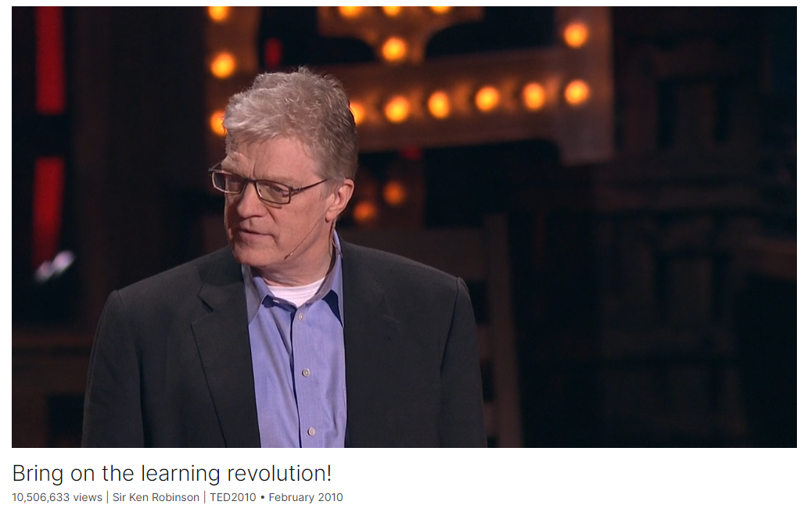

# Bring on the learning revolution!

Link: [https://www.ted.com/talks/sir_ken_robinson_bring_on_the_learning_revolution](https://www.ted.com/talks/sir_ken_robinson_bring_on_the_learning_revolution)

Speaker:  Sir Ken Robinson

Date: February 2010

@[toc]

## Introduction

In this poignant, funny follow-up to his fabled 2006 talk, Sir Ken Robinson makes the case for a radical shift from standardized schools to personalized learning -- creating conditions where kids' natural talents can flourish.

肯-罗宾逊爵士（Sir Ken Robinson）继2006年的著名演讲之后，在这个生动有趣的续篇中，他提出了从标准化学校向个性化学习彻底转变的理由--创造条件，让孩子们的天赋得以充分发挥。

## Vocabulary

poignant:  [ˈpɔɪnjənt]  深刻的；辛辣的

radical：根本的；彻底的；激进的

radical shift：彻底的转变

elaborate：详尽的；精心设计的；

this whole event has been an elaborate build-up to me doing another one for you, so here it is “整个活动就是为了让我再为你们做一个演讲而精心安排的，所以，这就是它。”

build-up：这里的"build-up"指的是为某个事件或活动进行的逐步铺垫和准备。Sir Ken Robinson在这句话中幽默地说，整个活动都是为他再做一次演讲而精心安排的，他现在就要开始他的演讲了。

that we make very poor use of our talents. 我们没有充分利用自己的天赋。

They get no great pleasure from what they do. They endure it rather than enjoy it, and wait for the weekend. 他们从他们所做的事情中没有得到很大的乐趣。他们忍受它而不是享受它，并等待周末。

authentic：美 [ɔːˈθentɪk] 真正的；真实的

because it speaks to my most authentic self. 因为它表达了我最真实的自我。

dislocate：使改变位置；使…脱位；打乱；

education, in a way, dislocates very many people from their natural talents. 在某种程度上，教育使许多人脱离了他们的天赋。

 human resources are like natural resources; they're often buried deep. You have to go looking for them, they're not just lying around on the surface. 人力资源就像自然资源；它们通常被深埋。你必须去寻找他们，他们不只是躺在表面上。

tyranny：美 [ˈtɪrəni] 暴政；苛政；专制

The great problem for reform or transformation is the tyranny of common sense. 改革或转型的最大问题是常识的专制。

dogma：美 [ˈdɔːɡmə] 教义；信条

inadequate：美 [ɪnˈædɪkwət] 不足的；不充足的；不适合的；

pile：堆积；积累

The dogmas of the quiet past are inadequate to the stormy present. The occasion is piled high with difficulty, and we must rise with the occasion. 平静的过去的教条不适用于动荡的现在。困难重重，我们必须随机应变。

anew：美 [əˈnuː]adv. 重新；再次；

disenthrall：美 [ˌdɪsen'θrɔːl] 解放；使不受束缚

As our case is new, so we must think anew and act anew. We must disenthrall ourselves, and then we shall save our country 由于我们的情况是新的，所以我们必须重新思考和行动。我们必须解放自己，然后我们将拯救我们的国家

hypnotize：美 [ˈhɪpnəˌtaɪz] 使进入催眠状态；

But our minds are still hypnotized by them, and we have to disenthrall ourselves of some of them. 但是我们的思想仍然被它们催眠着，我们必须从它们中解放出来。

wrstwatch：美 [ˈrɪstˌwɑtʃ]  手表

wear a wristwatch： 戴手表

enthrall：美 [ɛnˈθrɔl] 迷住；吸引住

there are things we're enthralled to in education. 教育中有些事情让我们着迷。

symbiotic：美 [ˌsɪmbaɪ'ɒtɪk]  共栖的；共生的

We create our lives symbiotically 我们共生地创造我们的生活

pinnacle：美 [ˈpɪnəkl]  顶峰；巅峰；顶点

probably the pinnacle for education is getting you to college. 也许教育的顶峰是让你上大学。

humiliating：美 [hjuːˈmɪlieɪtɪŋ]  丢脸的；羞辱性的

dreadful：美 [ˈdredfl] 令人痛苦的；极其糟糕的；极其严重的

It was humiliating. It was in front of the whole class and I felt dreadful. 太丢脸了。那是在全班面前，我感觉很糟糕。

reconstitute：美 [riˈkɑnstəˌt(j)ut] 重组；重建

At the heart of the challenge is to reconstitute our sense of ability and of intelligence. 挑战的核心是重建我们的能力和智慧。

outrageous：美 [aʊtˈreɪdʒəs] 难以容忍的；大胆的；不寻常的；

See, it's outrageous as a conception. 作为一个概念它是令人愤慨的。

impoverish：美 [ɪmˈpɑːvərɪʃ]  使…贫穷；使（力量、活力或肥力）枯竭

we have sold ourselves into a fast-food model of education, and it's impoverishing our spirit and our energies as much as fast food is depleting our physical bodies. 我们把自己卖给了快餐式教育模式，它耗尽了我们的精神和精力，就像快餐耗尽了我们的身体一样。

aptitude：美 [ˈæptɪtuːd] 天资；才能；习性

One is that human talent is tremendously diverse. People have very different aptitudes. 一是人类的天赋非常多样化。人们有非常不同的天资。

resonate：美 [ˈrezəneɪt]引起；得到共鸣；回响；回荡

resonate with  one's spirit: 和精神共鸣

You know this, if you're doing something you love, an hour feels like five minutes. If you're doing something that doesn't resonate with your spirit, five minutes feels like an hour. 你知道，如果你在做你喜欢的事情，一个小时就像五分钟。如果你正在做的事情与你的精神没有共鸣，五分钟感觉就像一个小时。

are opting out of education：选择不接受教育

the reason so many people are opting out of education is because it doesn't feed their spirit, it doesn't feed their energy or their passion. 如此多的人选择不接受教育的原因是因为它不能滋养他们的精神，不能滋养他们的能量和激情。

bewail：美 [bəˈweɪl] 对…表示遗憾；抱怨;哀伤

he was bewailing the fact that he couldn't really give her what he thought she wanted from him. 他哀叹自己不能真正给她他认为她想要的东西。

embroider:美 [ɪmˈbrɔɪdər]:在…上刺绣；

tread: 美 [tred] 走；行走；踏平

>"Had I the heavens' embroidered cloths,
>
>Enwrought with gold and silver light,
>
>The blue and the dim and the dark cloths
>
>Of night and light and the half-light,
>
>I would spread the cloths under your feet:
>
>But I, being poor, have only my dreams;
>
>I have spread my dreams under your feet;
>
>Tread softly
>
>because you tread on my dreams."

这段诗歌出自威廉·巴特勒·叶芝（W. B. Yeats）的《希望与恐惧》。诗歌表达了诗人对他所爱的女人（Maud Gonne）的深情和谦卑，以及他对梦想和现实的感悟。以下是这段诗歌的意思：

“如果我拥有天国的刺绣布匹，
用金银光芒织成，
蓝色、昏暗和黑暗的布匹，
在夜晚、光明和半光中，
我会把这些布匹铺在你的脚下：
但我，贫穷如我，只有我的梦想；
我把我的梦想铺在你的脚下；
轻轻地走，
因为你踩在我的梦想上。”

简要解释：

- 诗人幻想如果他有天国般华丽的布匹，他会毫不犹豫地将它们奉献给他所爱的人，把这些象征美好与光辉的布匹铺在她的脚下。
- 然而，现实中他没有这些珍贵的布匹，只有他内心的梦想。
- 他将这些梦想比作珍贵的布匹，谨慎地铺在她的脚下，祈求她轻轻地走，因为这些梦想对他来说是非常珍贵和脆弱的。

通过这段诗，叶芝表达了他对梦想的珍视和对所爱之人的敬畏，暗示了梦想和情感的脆弱性。

## Summary

In Sir Ken Robinson's engaging and humorous TED Talk, he begins by reflecting on his previous talk, which gained immense popularity online. He humorously notes the demand for his videos and transitions into discussing the importance of rethinking the current education system. Robinson argues that the traditional model of education stifles creativity by prioritizing linear progression and conformity over individual talents and passions. He emphasizes the need for a revolution in education, moving away from a one-size-fits-all approach to a more personalized, organic model that nurtures the unique abilities of each student.

Robinson illustrates his points with anecdotes, such as the story of a firefighter who pursued his passion despite discouragement from teachers, highlighting how societal expectations often undervalue diverse talents. He critiques the obsession with academic achievement and college as the ultimate goals, noting that this linear approach does not align with the organic nature of human development. Instead, he advocates for an educational system that recognizes and cultivates individual strengths and passions, similar to how farmers create conditions for plants to flourish.

In conclusion, Robinson calls for a transformation from an industrial to an agricultural model of education, where personalized learning environments support the diverse needs of students. He emphasizes the importance of creativity, passion, and the human spirit in education, urging educators and policymakers to rethink and reshape the system to better prepare future generations. Robinson closes with a poignant reminder that educators tread on the dreams of children daily, and thus should approach their role with care and respect.

**肯·罗宾逊爵士在TED演讲的总结**

在肯·罗宾逊爵士风趣幽默的TED演讲中，他首先回顾了自己之前的演讲，该演讲在网上获得了极大的关注。他幽默地提到人们对他视频的需求，随即过渡到讨论重新思考当前教育系统的重要性。罗宾逊认为，传统的教育模式通过优先考虑线性进展和一致性，压制了创造力，忽视了个人的天赋和激情。他强调需要对教育进行革命性变革，从一刀切的方法转变为更加个性化、有机的模式，以培养每个学生的独特能力。

罗宾逊通过故事来说明他的观点，例如一个消防员追求自己热爱的职业，尽管受到了老师的打击，这个故事突显了社会期望常常低估了多样化的才能。他批评了对学术成就和上大学的痴迷，指出这种线性的方法与人类发展的有机性质不符。他主张建立一个识别和培养个人优势和激情的教育系统，就像农民为植物创造茁壮成长的条件一样。

最后，罗宾逊呼吁将教育从工业模式转变为农业模式，在个性化的学习环境中支持学生的多样化需求。他强调创造力、激情和人类精神在教育中的重要性，敦促教育工作者和政策制定者重新思考和重塑系统，以更好地为未来一代做好准备。罗宾逊以一个感人的提醒结束：教育者每天都在踏着孩子们的梦想前行，因此应以关怀和尊重的态度对待他们的角色。

## Transcript

I was here four years ago,

and I remember, at the time,

that the talks weren't put online.

I think they were given
to TEDsters in a box,

a box set of DVDs,

which they put on their shelves,
where they are now.

(Laughter)

And actually, Chris called me
a week after I'd given my talk, and said,

"We're going to start putting them online.
Can we put yours online?"

And I said, "Sure."

And four years later,

it's been downloaded four million times.

So I suppose you could multiply that
by 20 or something

to get the number
of people who've seen it.

And, as Chris says, there is
a hunger for videos of me.

(Laughter)

(Applause)

Don't you feel?

(Laughter)

So, this whole event
has been an elaborate build-up

to me doing another one
for you, so here it is.

(Laughter)

Al Gore spoke at the TED conference
I spoke at four years ago

and talked about the climate crisis.

And I referenced that
at the end of my last talk.

So I want to pick up from there

because I only had 18 minutes, frankly.

(Laughter)

So, as I was saying --

(Laughter)

You see, he's right.

I mean, there is a major
climate crisis, obviously,

and I think if people don't believe it,
they should get out more.

(Laughter)

But I believe there is
a second climate crisis,

which is as severe,

which has the same origins,

and that we have to deal with
with the same urgency.

And you may say, by the way,

"Look, I'm good.

I have one climate crisis,
I don't really need the second one."

(Laughter)

But this is a crisis of,
not natural resources --

though I believe that's true --

but a crisis of human resources.

I believe fundamentally,

as many speakers have said
during the past few days,

that we make very poor use of our talents.

Very many people go
through their whole lives

having no real sense
of what their talents may be,

or if they have any to speak of.

I meet all kinds of people

who don't think
they're really good at anything.

Actually, I kind of divide the world
into two groups now.

Jeremy Bentham, the great
utilitarian philosopher,

once spiked this argument.

He said, "There are two types
of people in this world:

those who divide the world into two types

and those who do not."

(Laughter)

Well, I do.

(Laughter)

I meet all kinds of people
who don't enjoy what they do.

They simply go through their lives
getting on with it.

They get no great pleasure
from what they do.

They endure it rather than enjoy it,

and wait for the weekend.

But I also meet people

who love what they do
and couldn't imagine doing anything else.

If you said, "Don't do this anymore,"

they'd wonder what you're talking about.

It isn't what they do, it's who they are.

They say, "But this is me, you know.

It would be foolish to abandon this,

because it speaks
to my most authentic self."

And it's not true of enough people.

In fact, on the contrary, I think
it's still true of a minority of people.

And I think there are many
possible explanations for it.

And high among them is education,

because education, in a way,

dislocates very many people
from their natural talents.

And human resources
are like natural resources;

they're often buried deep.

You have to go looking for them,

they're not just lying around
on the surface.

You have to create the circumstances
where they show themselves.

And you might imagine
education would be the way that happens,

but too often, it's not.

Every education system in the world
is being reformed at the moment

and it's not enough.

Reform is no use anymore,

because that's simply improving
a broken model.

What we need --

and the word's been used
many times in the past few days --

is not evolution,

but a revolution in education.

This has to be transformed
into something else.

(Applause)

One of the real challenges
is to innovate fundamentally in education.

Innovation is hard,

because it means doing something
that people don't find very easy,

for the most part.

It means challenging
what we take for granted,

things that we think are obvious.

The great problem for reform
or transformation

is the tyranny of common sense.

Things that people think,

"It can't be done differently,
that's how it's done."

I came across a great quote recently
from Abraham Lincoln,

who I thought you'd be pleased
to have quoted at this point.

(Laughter)

He said this in December 1862
to the second annual meeting of Congress.

I ought to explain that I have no idea
what was happening at the time.

We don't teach
American history in Britain.

(Laughter)

We suppress it.
You know, this is our policy.

(Laughter)

No doubt, something fascinating
was happening then,

which the Americans among us
will be aware of.

But he said this:

"The dogmas of the quiet past
are inadequate to the stormy present.

The occasion
is piled high with difficulty,

and we must rise with the occasion."

I love that.

Not rise to it, rise with it.

"As our case is new,

so we must think anew and act anew.

We must disenthrall ourselves,

and then we shall save our country."

I love that word, "disenthrall."

You know what it means?

That there are ideas
that all of us are enthralled to,

which we simply take for granted
as the natural order of things,

the way things are.

And many of our ideas have been formed,

not to meet the circumstances
of this century,

but to cope with the circumstances
of previous centuries.

But our minds
are still hypnotized by them,

and we have to disenthrall ourselves
of some of them.

Now, doing this is easier said than done.

It's very hard to know, by the way,
what it is you take for granted.

And the reason
is that you take it for granted.

(Laughter)

Let me ask you something
you may take for granted.

How many of you here
are over the age of 25?

That's not what you take for granted,
I'm sure you're familiar with that.

Are there any people here
under the age of 25?

Great. Now, those over 25,

could you put your hands up
if you're wearing your wristwatch?

Now that's a great deal of us, isn't it?

Ask a room full of teenagers
the same thing.

Teenagers do not wear wristwatches.

I don't mean they can't,

they just often choose not to.

And the reason is we were brought up
in a pre-digital culture,

those of us over 25.

And so for us,
if you want to know the time,

you have to wear something to tell it.

Kids now live in a world
which is digitized,

and the time, for them, is everywhere.

They see no reason to do this.

And by the way, you don't need either;

it's just that you've always done it
and you carry on doing it.

My daughter never wears a watch,
my daughter Kate, who's 20.

She doesn't see the point.

As she says,

"It's a single-function device."

(Laughter)

"Like, how lame is that?"

And I say, "No, no,
it tells the date as well."

(Laughter)

"It has multiple functions."

(Laughter)

But, you see, there are things
we're enthralled to in education.

A couple of examples.

One of them is the idea of linearity:

that it starts here
and you go through a track

and if you do everything right,

you will end up set
for the rest of your life.

Everybody who's spoken at TED
has told us implicitly,

or sometimes explicitly,
a different story:

that life is not linear; it's organic.

We create our lives symbiotically

as we explore our talents

in relation to the circumstances
they help to create for us.

But, you know, we have become obsessed
with this linear narrative.

And probably the pinnacle for education
is getting you to college.

I think we are obsessed
with getting people to college.

Certain sorts of college.

I don't mean you shouldn't go,
but not everybody needs to go,

or go now.

Maybe they go later, not right away.

And I was up in San Francisco
a while ago doing a book signing.

There was this guy buying a book,
he was in his 30s.

I said, "What do you do?"

And he said, "I'm a fireman."

I asked, "How long
have you been a fireman?"

"Always. I've always been a fireman."

"Well, when did you decide?"
He said, "As a kid.

Actually, it was
a problem for me at school,

because at school,
everybody wanted to be a fireman."

(Laughter)

He said, "But I wanted to be a fireman."

And he said, "When I got
to the senior year of school,

my teachers didn't take it seriously.

This one teacher didn't take it seriously.

He said I was throwing my life away

if that's all I chose to do with it;

that I should go to college, I should
become a professional person,

that I had great potential

and I was wasting my talent to do that."

He said, "It was humiliating.

It was in front of the whole class
and I felt dreadful.

But it's what I wanted,
and as soon as I left school,

I applied to the fire service
and I was accepted.

You know, I was thinking
about that guy recently,

just a few minutes ago when you
were speaking, about this teacher,

because six months ago, I saved his life."

(Laughter)

He said, "He was in a car wreck,
and I pulled him out, gave him CPR,

and I saved his wife's life as well."

He said, "I think he thinks
better of me now."

(Laughter)

(Applause)

You know, to me,

human communities depend
upon a diversity of talent,

not a singular conception of ability.

And at the heart of our challenges --

(Applause)

At the heart of the challenge

is to reconstitute our sense of ability
and of intelligence.

This linearity thing is a problem.

When I arrived in L.A.
about nine years ago,

I came across a policy statement --

very well-intentioned --

which said, "College
begins in kindergarten."

No, it doesn't.

(Laughter)

It doesn't.

If we had time,
I could go into this, but we don't.

(Laughter)

Kindergarten begins in kindergarten.

(Laughter)

A friend of mine once said,

"A three year-old
is not half a six year-old."

(Laughter)

(Applause)

They're three.

But as we just heard in this last session,

there's such competition now
to get into kindergarten --

to get to the right kindergarten --

that people are being interviewed
for it at three.

Kids sitting in front
of unimpressed panels,

you know, with their resumes --

(Laughter)

Flicking through and saying,
"What, this is it?"

(Laughter)

(Applause)

"You've been around
for 36 months, and this is it?"

(Laughter)

"You've achieved nothing -- commit.

(Laughter)

Spent the first six months
breastfeeding, I can see."

(Laughter)

See, it's outrageous as a conception.

The other big issue is conformity.

We have built our education systems
on the model of fast food.

This is something Jamie Oliver
talked about the other day.

There are two models
of quality assurance in catering.

One is fast food,
where everything is standardized.

The other is like Zagat
and Michelin restaurants,

where everything is not standardized,

they're customized to local circumstances.

And we have sold ourselves
into a fast-food model of education,

and it's impoverishing
our spirit and our energies

as much as fast food is depleting
our physical bodies.

(Applause)

We have to recognize
a couple of things here.

One is that human talent
is tremendously diverse.

People have very different aptitudes.

I worked out recently
that I was given a guitar as a kid

at about the same time
that Eric Clapton got his first guitar.

(Laughter)

It worked out for Eric,
that's all I'm saying.

(Laughter)

In a way --

it did not for me.

I could not get this thing to work

no matter how often
or how hard I blew into it.

It just wouldn't work.

(Laughter)

But it's not only about that.

It's about passion.

Often, people are good at things
they don't really care for.

It's about passion,

and what excites
our spirit and our energy.

And if you're doing the thing
that you love to do, that you're good at,

time takes a different course entirely.

My wife's just finished writing a novel,

and I think it's a great book,

but she disappears for hours on end.

You know this, if you're doing
something you love,

an hour feels like five minutes.

If you're doing something
that doesn't resonate with your spirit,

five minutes feels like an hour.

And the reason so many people
are opting out of education

is because it doesn't feed their spirit,

it doesn't feed their energy
or their passion.

So I think we have to change metaphors.

We have to go from what is essentially
an industrial model of education,

a manufacturing model,

which is based on linearity
and conformity and batching people.

We have to move to a model

that is based more
on principles of agriculture.

We have to recognize

that human flourishing
is not a mechanical process;

it's an organic process.

And you cannot predict
the outcome of human development.

All you can do, like a farmer,
is create the conditions

under which they will begin to flourish.

So when we look at reforming
education and transforming it,

it isn't like cloning a system.

There are great ones,
like KIPP's; it's a great system.

There are many great models.

It's about customizing
to your circumstances

and personalizing education
to the people you're actually teaching.

And doing that, I think,
is the answer to the future

because it's not
about scaling a new solution;

it's about creating
a movement in education

in which people develop
their own solutions,

but with external support
based on a personalized curriculum.

Now in this room,

there are people who represent
extraordinary resources in business,

in multimedia, in the Internet.

These technologies,

combined with the extraordinary
talents of teachers,

provide an opportunity
to revolutionize education.

And I urge you to get involved in it

because it's vital, not just to ourselves,
but to the future of our children.

But we have to change
from the industrial model

to an agricultural model,

where each school can be
flourishing tomorrow.

That's where children experience life.

Or at home, if that's what they choose,

to be educated
with their families or friends.

There's been a lot of talk about dreams
over the course of these few days.

And I wanted to just very quickly --

I was very struck
by Natalie Merchant's songs last night,

recovering old poems.

I wanted to read you
a quick, very short poem

from W. B. Yeats,
who some of you may know.

He wrote this to his love, Maud Gonne,

and he was bewailing the fact

that he couldn't really give her
what he thought she wanted from him.

And he says, "I've got something else,
but it may not be for you."

He says this:

"Had I the heavens' embroidered cloths,

Enwrought with gold and silver light,

The blue and the dim and the dark cloths

Of night and light and the half-light,

I would spread the cloths under your feet:

But I, being poor, have only my dreams;

I have spread my dreams under your feet;

Tread softly

because you tread on my dreams."

And every day, everywhere,

our children spread
their dreams beneath our feet.

And we should tread softly.

Thank you.

(Applause)

Thank you very much.

(Applause)

Thank you.

(Applause)

## Afterword

2024年5月25日周六于上海。

