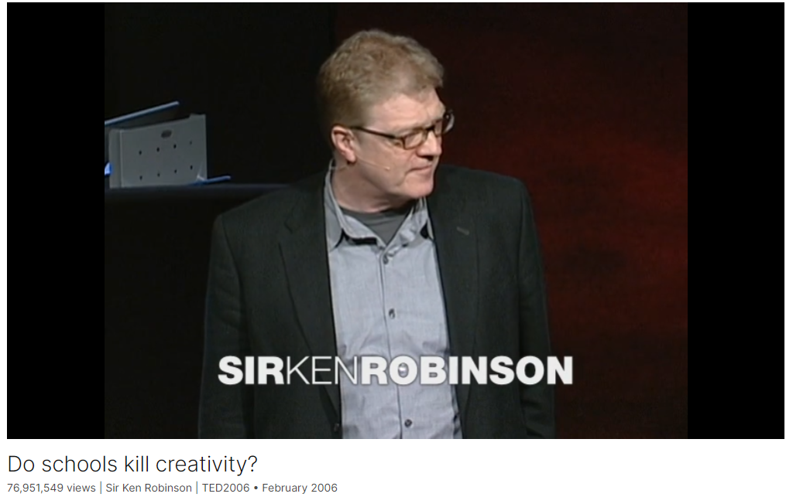

# Do schools kill creativity?

Link: [https://www.ted.com/talks/sir_ken_robinson_do_schools_kill_creativity](https://www.ted.com/talks/sir_ken_robinson_do_schools_kill_creativity)

Speaker:  Sir Ken Robinson

Date: February 2006

@[toc]

## Introduction

Sir Ken Robinson makes an entertaining and profoundly moving case for creating an education system that nurtures (rather than undermines) creativity.

## Vocabulary

The phrase "you can see **the blood run from their face**" is an idiomatic expression that means someone s**uddenly looks very shocked, frightened, or anxious**. It's a vivid way of describing a physical reaction to surprise or distress, where the person turns pale as if the blood has drained from their face. In Sir Ken Robinson's speech, he uses this phrase humorously to describe people's reactions when they find out he works in education, highlighting how the topic often makes people uncomfortable or uninterested.

vested：既定的

vested interest: 既得利益

We have a huge vested interest in it: 我们在其中有巨大的既得利益

What you have there is a person of extraordinary dedication who found a talent. 现在的教育提倡的是，一个有奉献精神的老师能发现一个天才学生。

contention：论点，争论

squander：美 [ˈskwɑːndər] 浪费；挥霍；失去

And my contention is, all kids have tremendous talents, and we squander them, pretty ruthlessly. 我的观点是，所有的孩子都有巨大的天赋，而我们却无情地浪费了它们。

sequel：美 [ˈsiːkwəl] 续集；续篇

Mel Gibson did the sequel：梅尔·吉布森拍了续集

crammed：美 [kræmd] 塞满的；挤满的

We had the place crammed full of agents in T-shirts：我们这里挤满了穿着t恤的特工

bear：带着， bearing gifts，带着礼物

frankincense：美 [ˈfræŋkənˌsɛns] 乳香

myrrh：美 [mər] 没药；没药树胶

They come in bearing gifts, gold, frankincense and myrrh. 他们带着礼物、黄金、乳香和没药进来。

stigmatize：美 [ˈstɪɡməˌtaɪz] 指责；把…污蔑为

We stigmatize mistakes. 我们谴责错误。

And the result is that we are educating people out of their creative capacities. 结果是我们正在教育人们放弃他们的创造能力。这里的out of是放弃，扼杀的意思

we shouldn't hold them up as the high-water mark of all human achievement. 我们不应该把它们作为所有人类成就的高潮标志。

discotheque: 美 [ˈdɪskəˌtɛk] 迪斯科舞厅；迪斯科舞会

pop into the discotheque on the final night. 最后一天晚上去迪斯科舞厅。

writhe: 美 [raɪð] 扭动

Grown men and women writhing uncontrollably, off the beat. 成年男女不受控制地扭动身体。

steer away from：引导离开xxx

So you were probably steered benignly away from things at school，things you liked, on the grounds you would never get a job doing that. 因此，你可能会被善意地引导着远离学校里的事情和你喜欢的事情，理由是你永远也找不到这样的工作。

engulf：美 [ɪnˈɡʌlf]  吞没；吞噬；淹没

The whole world is engulfed in a revolution 整个世界都卷入了一场革命

protracted：美 [prəˈtræktəd] 延长的，拖延的

the whole system of public education around the world is a protracted process of university entrance. 全世界的整个公共教育体系都是一个漫长的大学入学过程。

kinesthetic：美 [ˌkɪnəˈsθetɪk] 肌肉运动知觉的

We think visually, we think in sound, we think kinesthetically. 我们用视觉思考，用声音思考，用动觉思考。

shaft：美 [ʃæft] 柄；把手；柱

corpus callosum：胼胝体

there's a shaft of nerves that joins the two halves of the brain, called the corpus callosum. 有一个连接大脑两半的神经轴，称为胼胝体。

Epiphany：美 [ɪˈpɪfəni] 顿悟的时刻；大开眼界的时刻

choreographer：美 [ˌkɒrɪ'ɒɡrəfə(r)] 编舞; 编舞者; 舞蹈指导

fidget：美 [ˈfɪdʒɪt]坐立不安；

She couldn't concentrate; she was fidgeting. 她无法集中注意力；她坐立不安。

paneled：美 ['pænld] （用镶板等）镶嵌

this oak-paneled room, and she was there with her mother, 这间橡木板的房间，她和她妈妈在那里

audition： 美 [ɔːˈdɪʃn] 面试；试演；试唱

She was eventually auditioned for the Royal Ballet School. 她最终被皇家芭蕾舞学校录取了。

avert：转移，避免

and that we avert some of the scenarios that we've talked about. 我们可以避免一些我们已经讨论过的情况。

stifle：美 [ˈstaɪfl] 扼杀

stifle creativity：扼杀创造力

## Summary

In his speech, Sir Ken Robinson passionately argues that the current education system stifles creativity. He emphasizes the importance of creativity, stating that it should be treated with the same importance as literacy. Robinson illustrates his point with anecdotes about children’s natural creativity and fearlessness, contrasting it with how traditional education systems prioritize academic ability and stigmatize mistakes, thereby suppressing original thinking and innovation.

Robinson also highlights the predictability of education systems worldwide, noting that they universally prioritize mathematics and languages over the arts. He criticizes this hierarchy, arguing that it is rooted in the needs of industrialism and fails to recognize diverse intelligences and talents. Robinson shares stories of individuals like Gillian Lynne, who flourished when her unique abilities were recognized and nurtured, to underline the need for an education system that values and fosters diverse forms of intelligence and creativity.

In conclusion, Robinson calls for a radical rethinking of our education systems to embrace a new conception of human ecology. He stresses that the future demands a holistic approach to education that nurtures the full range of human capacities. By doing so, we can empower the next generation to creatively address and navigate the unpredictable challenges ahead, ensuring that their potential is fully realized.

在他的演讲中，Sir Ken Robinson热情洋溢地指出，当前的教育系统扼杀了创造力。他强调创造力的重要性，认为它应该与识字同等重要。Robinson通过讲述孩子们天生的创造力和无所畏惧的例子，展示了传统教育系统如何优先考虑学术能力并污名化错误，从而抑制了原创思维和创新能力。

Robinson还指出全球教育系统的普遍性，提到它们普遍优先考虑数学和语言，而不是艺术。他批评这种层级制度，认为它根植于工业化的需求，未能认识到多样的智慧和天赋。Robinson分享了像Gillian Lynne这样的个人故事，她在其独特能力得到认可和培养后蓬勃发展，以此来强调需要一个重视并培养多样化智慧和创造力的教育系统。

最后，Robinson呼吁对我们的教育系统进行彻底的重新思考，倡导一种新的“人类生态”概念。他强调，未来需要一种培养全面人类能力的整体教育方法。通过这样做，我们可以赋予下一代创造性地应对和驾驭未来不可预测挑战的能力，确保他们的潜力得到充分发挥。

## Transcript

Good morning. How are you?

(Audience) Good.

It's been great, hasn't it?

I've been blown away by the whole thing.

In fact, I'm leaving.

(Laughter)

There have been three themes
running through the conference,

which are relevant
to what I want to talk about.

One is the extraordinary
evidence of human creativity

in all of the presentations that we've had

and in all of the people here;

just the variety of it
and the range of it.

The second is that it's put us in a place

where we have no idea
what's going to happen

in terms of the future.

No idea how this may play out.

I have an interest in education.

Actually, what I find is,
everybody has an interest in education.

Don't you?

I find this very interesting.

If you're at a dinner party,
and you say you work in education --

actually, you're not often
at dinner parties, frankly.

(Laughter)

If you work in education,
you're not asked.

(Laughter)

And you're never asked back, curiously.
That's strange to me.

But if you are, and you say to somebody,

you know, they say, "What do you do?"

and you say you work in education,

you can see the blood run from their face.

They're like, "Oh my God. Why me?"

(Laughter)

"My one night out all week."

(Laughter)

But if you ask about their education,
they pin you to the wall,

because it's one of those things
that goes deep with people, am I right?

Like religion and money and other things.

So I have a big interest in education,
and I think we all do.

We have a huge vested interest in it,

partly because it's education
that's meant to take us into this future

that we can't grasp.

If you think of it,

children starting school this year
will be retiring in 2065.

Nobody has a clue,

despite all the expertise that's been
on parade for the past four days,

what the world will look like
in five years' time.

And yet, we're meant
to be educating them for it.

So the unpredictability,
I think, is extraordinary.

And the third part of this
is that we've all agreed, nonetheless,

on the really extraordinary
capacities that children have --

their capacities for innovation.

I mean, Sirena last night
was a marvel, wasn't she?

Just seeing what she could do.

And she's exceptional, but I think
she's not, so to speak,

exceptional in the whole of childhood.

What you have there is a person
of extraordinary dedication

who found a talent.

And my contention is,
all kids have tremendous talents,

and we squander them, pretty ruthlessly.

So I want to talk about education,

and I want to talk about creativity.

My contention is that creativity now
is as important in education as literacy,

and we should treat it
with the same status.

(Applause)

Thank you.

(Applause)

That was it, by the way.
Thank you very much.

(Laughter)

So, 15 minutes left.

(Laughter)

"Well, I was born ... "

(Laughter)

I heard a great story recently --
I love telling it --

of a little girl
who was in a drawing lesson.

She was six, and she was
at the back, drawing,

and the teacher said this girl
hardly ever paid attention,

and in this drawing lesson, she did.

The teacher was fascinated.

She went over to her,
and she said, "What are you drawing?"

And the girl said,
"I'm drawing a picture of God."

And the teacher said, "But nobody
knows what God looks like."

And the girl said,
"They will in a minute."

(Laughter)

When my son was four in England --

actually, he was four
everywhere, to be honest.

(Laughter)

If we're being strict about it,
wherever he went, he was four that year.

He was in the Nativity play.
Do you remember the story?

(Laughter)

No, it was big, it was a big story.

Mel Gibson did the sequel,
you may have seen it.

(Laughter)

"Nativity II."

But James got the part of Joseph,
which we were thrilled about.

We considered this to be
one of the lead parts.

We had the place crammed
full of agents in T-shirts:

"James Robinson IS Joseph!"

(Laughter)

He didn't have to speak, but you know
the bit where the three kings come in?

They come in bearing gifts,
gold, frankincense and myrrh.

This really happened.

We were sitting there, and I think
they just went out of sequence,

because we talked to the little boy
afterward and said,

"You OK with that?" They said,
"Yeah, why? Was that wrong?"

They just switched.

The three boys came in, four-year-olds
with tea towels on their heads.

They put these boxes down, and the first
boy said, "I bring you gold."

And the second boy said,
"I bring you myrrh."

And the third boy said, "Frank sent this."

(Laughter)

What these things have in common
is that kids will take a chance.

If they don't know, they'll have a go.

Am I right? They're not
frightened of being wrong.

I don't mean to say that being wrong
is the same thing as being creative.

What we do know is,
if you're not prepared to be wrong,

you'll never come up
with anything original --

if you're not prepared to be wrong.

And by the time they get to be adults,
most kids have lost that capacity.

They have become
frightened of being wrong.

And we run our companies like this.

We stigmatize mistakes.

And we're now running
national education systems

where mistakes are the worst
thing you can make.

And the result is that
we are educating people

out of their creative capacities.

Picasso once said this, he said
that all children are born artists.

The problem is to remain
an artist as we grow up.

I believe this passionately,
that we don't grow into creativity,

we grow out of it.

Or rather, we get educated out of it.

So why is this?

I lived in Stratford-on-Avon
until about five years ago.

In fact, we moved from Stratford
to Los Angeles.

So you can imagine
what a seamless transition this was.

(Laughter)

Actually, we lived in a place
called Snitterfield,

just outside Stratford,

which is where
Shakespeare's father was born.

Are you struck by a new thought? I was.

You don't think of Shakespeare
having a father, do you?

Do you?

Because you don't think
of Shakespeare being a child, do you?

Shakespeare being seven?

I never thought of it.

I mean, he was seven at some point.

He was in somebody's
English class, wasn't he?

(Laughter)

How annoying would that be?

(Laughter)

"Must try harder."

(Laughter)

Being sent to bed by his dad,
to Shakespeare, "Go to bed, now!"

To William Shakespeare.

"And put the pencil down!"

(Laughter)

"And stop speaking like that."

(Laughter)

"It's confusing everybody."

(Laughter)

Anyway, we moved
from Stratford to Los Angeles,

and I just want to say a word
about the transition.

Actually, my son didn't want to come.

I've got two kids;
he's 21 now, my daughter's 16.

He didn't want to come to Los Angeles.

He loved it, but he had
a girlfriend in England.

This was the love of his life, Sarah.

He'd known her for a month.

(Laughter)

Mind you, they'd had
their fourth anniversary,

because it's a long time when you're 16.

He was really upset on the plane.

He said, "I'll never find
another girl like Sarah."

And we were rather pleased
about that, frankly --

(Laughter)

because she was the main reason
we were leaving the country.

(Laughter)

But something strikes you
when you move to America

and travel around the world:

every education system on earth
has the same hierarchy of subjects.

Every one. Doesn't matter where you go.

You'd think it would be
otherwise, but it isn't.

At the top are mathematics and languages,
then the humanities.

At the bottom are the arts.
Everywhere on earth.

And in pretty much every system, too,
there's a hierarchy within the arts.

Art and music are normally given
a higher status in schools

than drama and dance.

There isn't an education
system on the planet

that teaches dance every day to children

the way we teach them mathematics.

Why?

Why not?

I think this is rather important.

I think math is very important,
but so is dance.

Children dance all the time
if they're allowed to, we all do.

We all have bodies, don't we?
Did I miss a meeting?

(Laughter)

Truthfully, what happens is,
as children grow up,

we start to educate them progressively
from the waist up.

And then we focus on their heads.

And slightly to one side.

If you were to visit education as an alien

and say "What's it for, public education?"

I think you'd have to conclude,
if you look at the output,

who really succeeds by this,

who does everything they should,

who gets all the brownie points,
who are the winners --

I think you'd have to conclude
the whole purpose of public education

throughout the world

is to produce university professors.

Isn't it?

They're the people who come out the top.

And I used to be one, so there.

(Laughter)

And I like university professors,

but, you know, we shouldn't hold them up

as the high-water mark
of all human achievement.

They're just a form of life.

Another form of life.

But they're rather curious.

And I say this out of affection for them:

there's something curious
about professors.

In my experience -- not all of them,
but typically -- they live in their heads.

They live up there
and slightly to one side.

They're disembodied, you know,
in a kind of literal way.

They look upon their body as a form
of transport for their heads.

(Laughter)

Don't they?

It's a way of getting
their head to meetings.

(Laughter)

If you want real evidence
of out-of-body experiences, by the way,

get yourself along to a residential
conference of senior academics

and pop into the discotheque
on the final night.

(Laughter)

And there, you will see it.

Grown men and women
writhing uncontrollably, off the beat.

(Laughter)

Waiting until it ends, so they can
go home and write a paper about it.

(Laughter)

Our education system is predicated
on the idea of academic ability.

And there's a reason.

Around the world, there were
no public systems of education,

really, before the 19th century.

They all came into being
to meet the needs of industrialism.

So the hierarchy is rooted on two ideas.

Number one, that the most useful
subjects for work are at the top.

So you were probably steered benignly away
from things at school

when you were a kid,

things you liked,

on the grounds you would never
get a job doing that.

Is that right?

"Don't do music, you're not
going to be a musician;

don't do art, you won't be an artist."

Benign advice -- now, profoundly mistaken.

The whole world
is engulfed in a revolution.

And the second is academic ability,

which has really come to dominate
our view of intelligence,

because the universities design
the system in their image.

If you think of it,

the whole system of public education
around the world is a protracted process

of university entrance.

And the consequence is
that many highly talented,

brilliant, creative people
think they're not,

because the thing
they were good at at school

wasn't valued,
or was actually stigmatized.

And I think we can't afford
to go on that way.

In the next 30 years, according to UNESCO,

more people worldwide will be
graduating through education

than since the beginning of history.

More people.

And it's the combination
of all the things we've talked about:

technology and its
transformational effect on work,

and demography and the huge
explosion in population.

Suddenly, degrees aren't worth anything.

Isn't that true?

When I was a student,
if you had a degree, you had a job.

If you didn't have a job,
it's because you didn't want one.

And I didn't want one, frankly.

(Laughter)

But now kids with degrees
are often heading home

to carry on playing video games,

because you need an MA
where the previous job required a BA,

and now you need a PhD for the other.

It's a process of academic inflation.

And it indicates the whole structure
of education is shifting beneath our feet.

We need to radically rethink
our view of intelligence.

We know three things about intelligence.

One, it's diverse.

We think about the world in all the ways
that we experience it.

We think visually, we think in sound,
we think kinesthetically.

We think in abstract terms,
we think in movement.

Secondly, intelligence is dynamic.

If you look at the interactions
of a human brain,

as we heard yesterday
from a number of presentations,

intelligence is wonderfully interactive.

The brain isn't divided into compartments.

In fact, creativity --

which I define as the process of having
original ideas that have value --

more often than not comes about

through the interaction of different
disciplinary ways of seeing things.

By the way, there's a shaft of nerves
that joins the two halves of the brain,

called the corpus callosum.

It's thicker in women.

Following off from Helen yesterday,

this is probably why women
are better at multitasking.

Because you are, aren't you?

There's a raft of research,
but I know it from my personal life.

If my wife is cooking a meal
at home, which is not often ...

thankfully.

(Laughter)

No, she's good at some things.

But if she's cooking,
she's dealing with people on the phone,

she's talking to the kids,
she's painting the ceiling --

(Laughter)

she's doing open-heart surgery over here.

If I'm cooking, the door
is shut, the kids are out,

the phone's on the hook,

if she comes in, I get annoyed.

I say, "Terry, please,
I'm trying to fry an egg in here."

(Laughter)

"Give me a break."

(Laughter)

Actually, do you know
that old philosophical thing,

"If a tree falls in a forest,
and nobody hears it, did it happen?"

Remember that old chestnut?

I saw a great T-shirt
recently, which said,

"If a man speaks his mind in a forest,
and no woman hears him,

is he still wrong?"

(Laughter)

And the third thing about intelligence is,

it's distinct.

I'm doing a new book at the moment
called "Epiphany,"

which is based on a series
of interviews with people

about how they discovered their talent.

I'm fascinated by
how people got to be there.

It's really prompted by a conversation
I had with a wonderful woman

who maybe most people
have never heard of, Gillian Lynne.

Have you heard of her? Some have.

She's a choreographer,
and everybody knows her work.

She did "Cats" and "Phantom of the Opera."

She's wonderful.

I used to be on the board
of The Royal Ballet, as you can see.

(Laughter)

Gillian and I had lunch one day.
I said, "How did you get to be a dancer?"

It was interesting.

When she was at school,
she was really hopeless.

And the school, in the '30s,
wrote to her parents and said,

"We think Gillian
has a learning disorder."

She couldn't concentrate;
she was fidgeting.

I think now they'd say she had ADHD.

Wouldn't you?

But this was the 1930s, and ADHD
hadn't been invented at this point.

It wasn't an available condition.

(Laughter)

People weren't aware they could have that.

(Laughter)

Anyway, she went to see this specialist.

So, this oak-paneled room,
and she was there with her mother,

and she was led and sat
on this chair at the end,

and she sat on her hands for 20 minutes,

while this man talked to her mother

about all the problems
Gillian was having at school,

because she was disturbing people,
her homework was always late, and so on.

Little kid of eight.

In the end, the doctor went
and sat next to Gillian and said,

"I've listened to all these
things your mother's told me.

I need to speak to her privately.

Wait here. We'll be back.
We won't be very long,"

and they went and left her.

But as they went out of the room,

he turned on the radio
that was sitting on his desk.

And when they got out of the room,

he said to her mother,
"Just stand and watch her."

And the minute they left the room,

she was on her feet, moving to the music.

And they watched for a few minutes,
and he turned to her mother and said,

"Mrs. Lynne, Gillian isn't sick.

She's a dancer.

Take her to a dance school."

I said, "What happened?"

She said, "She did. I can't tell you
how wonderful it was.

We walked in this room,
and it was full of people like me --

people who couldn't sit still,

people who had to move to think."

Who had to move to think.

They did ballet, they did tap, jazz;
they did modern; they did contemporary.

She was eventually auditioned
for the Royal Ballet School.

She became a soloist; she had
a wonderful career at the Royal Ballet.

She eventually graduated
from the Royal Ballet School,

founded the Gillian Lynne Dance Company,

met Andrew Lloyd Webber.

She's been responsible for

some of the most successful
musical theater productions in history,

she's given pleasure to millions,

and she's a multimillionaire.

Somebody else might have put her
on medication and told her to calm down.

(Applause)

What I think it comes to is this:

Al Gore spoke the other night

about ecology and the revolution
that was triggered by Rachel Carson.

I believe our only hope for the future

is to adopt a new conception
of human ecology,

one in which we start
to reconstitute our conception

of the richness of human capacity.

Our education system has mined our minds

in the way that we strip-mine the earth
for a particular commodity.

And for the future, it won't serve us.

We have to rethink
the fundamental principles

on which we're educating our children.

There was a wonderful quote
by Jonas Salk, who said,

"If all the insects
were to disappear from the Earth,

within 50 years,
all life on Earth would end.

If all human beings
disappeared from the Earth,

within 50 years,
all forms of life would flourish."

And he's right.

What TED celebrates is the gift
of the human imagination.

We have to be careful now
that we use this gift wisely,

and that we avert some of the scenarios
that we've talked about.

And the only way we'll do it
is by seeing our creative capacities

for the richness they are

and seeing our children
for the hope that they are.

And our task is to educate
their whole being,

so they can face this future.

By the way -- we may not see this future,

but they will.

And our job is to help them
make something of it.

Thank you very much.

(Applause)

## Afterword

2024年5月24日于上海。

