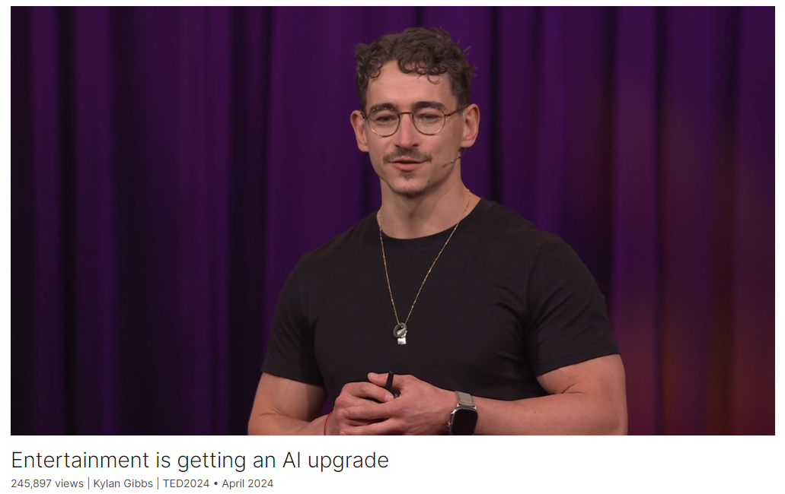

# Entertainment is getting an AI upgrade

Link: [https://www.ted.com/talks/kylan_gibbs_entertainment_is_getting_an_ai_upgrade](https://www.ted.com/talks/kylan_gibbs_entertainment_is_getting_an_ai_upgrade)

Speaker:  Kylan Gibbs

Date: April 2024

@[toc]

## Introduction

AI has the power to bring your favorite fictional characters to life, says technologist Kylan Gibbs. Introducing Caleb, an "AI agent" with personality and internal reasoning, he demonstrates how AI-powered characters can interact with people in novel ways, generate unique video game outcomes and augment our ability to tell stories, opening up new worlds of possibility.

## Vocabulary

 fictional characters: 虚构的角色

augment ability：增强能力

sketches：美 [ˈsketʃɪz] 素描；草图；速写；梗概；（sketch的复数）

scripted narratives：脚本叙事

Stories are changing, moving from static sketches and scripted narratives to living worlds and characters. 故事正在发生变化，从静态的草图和脚本叙事转向活生生的世界和人物。

Vancouver：美 [vænˈkuːvər] 温哥华；**注意发音**

attic：美 [ˈætɪk] 顶楼；阁楼；雅典的；雅典语的；

hideout：藏身地；躲藏处

Welcome to my secret attic hideout. 欢迎来到我的秘密阁楼藏身处。

squirrel：美 [ˈskwɜːrəl]  松鼠

A squirrel with super powers. 一只拥有超能力的松鼠。

improvise：美 [ˈɪmprəvaɪz]  即兴创作（音乐、台词、演讲词等）；即席表演；

The characters can also come together with one another and take ideas from the audience and improvise new content on the fly. 角色们也可以彼此聚在一起，从观众那里获得灵感，即兴创作新的内容。

"On the fly" 是一个习语，意思是快速且随意地进行某事，没有事先准备。在这个TED演讲的上下文中，它表示这些角色可以从观众那里获取想法，并即时动态地创造新的内容，而不需要任何预先的计划或脚本。

>"On the fly" is an idiom that means doing something quickly and spontaneously, without preparation. In the context of the TED talk, it means that the characters can take ideas from the audience and create new content immediately and dynamically, without needing any pre-planning or scripting.

alligator: 美 [ˈælɪɡeɪtər]  短吻鳄，鳄鱼

He fell in some water full of alligators. 他掉进了满是鳄鱼的水里。

villains：美 [ˈvilənz] 恶棍；反派角色；（villain的复数）

hilarious：美 [hɪˈleriəs] 极有趣的；引人发笑的；欢闹的

 add hilarious commentary 添加爆笑评论

immersion：美 [ɪˈmɜːrʒn] 沉浸

permutation：美 [ˌpərmjʊˈteɪʃ(ə)n]组合，排列

However, until now, it's been extremely difficult to pre-script every combination of consequences to every permutation of player behaviors. 然而，到目前为止，预先编写玩家行为的每一种组合的后果是极其困难的。

gerbil：美 [ˈdʒərbəl]  沙鼠，沙漠鼠

lore：美 [lɔr] 知识，学说

grounded in a shared lore and experience 基于共同的知识和经历

craft：精心制作，精心设计

dialogue style：对话风格

We actually craft his dialogue style and voice, the way he verbally expresses himself. We build a unique emotional profile, the way he feels, his social tendencies and relationship habits, and then we preload a bunch of knowledge and memories that give him that robust backstory. 我们实际上精心设计了他的对话风格和声音，他口头表达自己的方式。我们建立一个独特的情感档案，他的感觉方式，他的社会倾向和关系习惯，然后我们预装一堆知识和记忆，给他强大的背景故事。

overarching：美 [ˌoʊvərˈɑːrtʃɪŋ] 在…上方成拱形的；包罗万象的；全面的；综合的

There's kind of an overarching narrative agent 有一种包罗万象的的叙事智能体

gestures：美 [ˈdʒestʃərz] 手势；姿势；动作；（gesture的复数）

what facial and body gestures to use,使用什么面部和身体姿势

it seems like there’s a pretty solid chance my Spider-Man action figures could come to life after all. 看起来我的蜘蛛侠角色很有可能会活过来。

reminisce：美 [ˌremɪˈnɪs] 回忆；追忆

fantasies：美 [ˈfæntəsiz] 幻想；幻想作品；（fantasy的复数）

making such fantasies a reality让这样的幻想成为现实

## Summary

In this TED talk, the speaker, Kylan Gibbs, discusses the evolving nature of storytelling with the advent of AI agents. He reminisces about his childhood dream of bringing his Spider-Man action figures to life and expresses how AI is making such fantasies a reality. AI agents, which include autonomous systems like ChatGPT, Waymo, and warehouse robots, are now revolutionizing storytelling by creating interactive, living worlds and characters that can engage in real-time, unscripted interactions with audiences, as demonstrated through an example of a virtual character named Caleb.

Gibbs highlights how these AI agents are enhancing user experiences by blending the interactive nature of video games with more natural social interactions. By incorporating AI, characters can have their own personalities, motivations, and emotional profiles, allowing them to respond dynamically to audience input and generate unique content on the fly. This creates a sense of real-time responsiveness and consequence, which traditional scripted narratives often lack. The talk showcases how these interactions can extend to educational and entertainment applications, such as AI tutors and commentators, providing a more immersive and personalized experience.

Finally, Gibbs explains the technical process behind creating such AI-driven characters. This involves designing a character's brain using machine learning models to understand the context, lore, and appropriate responses, and then fine-tuning their personalities, dialogue styles, and emotional profiles. These characters can then be integrated into virtual worlds or game engines, where they interact with users in a coherent and engaging manner. The speaker concludes by expressing excitement about the potential of AI to enhance human creativity and storytelling, enabling audiences to co-create experiences that stem from their own imaginations.

在这次TED演讲中，演讲者凯兰·吉布斯（Kylan Gibbs）讨论了随着智能体的出现，讲故事的方式如何不断演变。他回忆起自己童年时希望让蜘蛛侠玩偶活过来的梦想，并表达了AI如何使这些幻想成为现实。包括ChatGPT、Waymo和仓库机器人在内的智能体，正在通过创建互动的、充满生命的世界和角色来革命性地改变讲故事的方式，这些角色可以与观众进行实时的、即兴的互动，正如一个名为Caleb的虚拟角色所展示的那样。

吉布斯强调，这些智能体通过将视频游戏的互动性质与更自然的社交互动相结合，增强了用户体验。通过引入AI，角色可以拥有自己的个性、动机和情感特征，使他们能够动态地响应观众的输入，并即时生成独特的内容。这创造了一种实时响应和结果感，这是传统剧本叙事通常缺乏的。演讲展示了这些互动如何扩展到教育和娱乐应用，例如AI导师和评论员，提供更沉浸式和个性化的体验。

最后，吉布斯解释了创建这些AI驱动角色的技术过程。这涉及使用机器学习模型设计角色的大脑，以理解上下文、传说和适当的响应，然后微调他们的个性、对话风格和情感特征。这些角色随后可以集成到虚拟世界或游戏引擎中，在其中与用户进行连贯且引人入胜的互动。演讲者总结道，他对AI在增强人类创造力和讲故事方面的潜力感到兴奋，使观众能够共同创造源于自己想象的体验。

## Transcript

When I was ten,

I spent a lot of time playing
with my Spider-Man action figures.

I would have done anything
for them to come to life.

I honestly would take Gandalf
over any therapist,

but it's been pretty hard
to connect with the guy

since I long ago finished
all of Tolkien's works and movies.

Why is it that we have to say
goodbye on the final page?

We may not need to.

Stories are changing,

moving from static sketches
and scripted narratives

to living worlds and characters.

AI agents are changing
the way we can tell stories.

These agents aren't just chat bots,

they're any autonomous system
that can take a directive or task

and accomplish it
without human intervention.

Virtual assistants like a ChatGPT,

autonomous vehicles like a Waymo or Tesla,

robots moving boxes
in an Amazon warehouse.

These are all agents,

but now they're changing storytelling too.

We can bring together the active
participation of video games

with a much more natural
social form of interaction,

enabled by AI agents.

I want to show you a hint of what I mean.

Characters that come to life
with their own personality,

styles, voices and expression,

while still being able
to interact with one another,

the audience and the environment.

These interactions that you're going
to see are not scripted,

many of them filmed over the last few days

here at TED and in Vancouver.

Anyways, meet Caleb.

(Video) Caleb: Oh, hey, Grandma.

Welcome to my secret attic hideout.

Grandma: What's Mr. Moose doing there?

Caleb: That's actually
Brother Moose, not Mr. Moose.

He's like, the wise old moose
who gives me advice and stuff.

Oh, by the way, thanks for showing me
your old superhero action figure, Grandma.

It's, like, totally awesome.

What's its name?

Grandma: Mighty Squirrel.

Caleb: Really?

Grandma: Yes.

Caleb: Wow, that's so awesome.

A squirrel with super powers.

That's nuts.

Get it?

Nuts?

Like what squirrels eat.

I bet Mighty Squirrel had some epic
battles with evil acorns.

Kylan Gibbs: By having that 
real-time responsiveness,

Caleb makes the audience
feel seen and heard,

as if they're all inhabiting
the shared space.

And it isn't just any audience,
that's actually my amazing grandma.

The characters can also
come together with one another

and take ideas from the audience
and improvise new content on the fly.

(Toy robot beeping)

(Video) Robot: Ready for action!

Caleb: Whoa!

Robot: Oof! That didn't go well.

My arm is acting up.

Villains, beware!

Oops.

Caleb: Grandma, can we fix
the Mighty Squirrel's arm?

Grandma: Sure.

Pick it up and put it back on his arm.

Caleb: Yeah.

I'll fix you up, Mighty Squirrel.

Your arm is broken.

Grandma: He got it caught
in a washing machine.

Caleb: Ha, ha! You fought
against the evil washing machine,

Magic flower.

How did the action figure break its arm?

Grandma: He fell in some
water full of alligators.

Robot: Oh, you know,
just your average superhero stuff.

I was on a mission to save a city
from a giant alligator,

and I fell into the water.

But don't worry, I still saved the day.

KG: Each of these characters has their own
internal reasoning and motivations,

but they actually take those
ideas from my grandma

and then create new content in real time.

They can even allow the audience
to shape the overall story arc

and conclusion of the experience.

(Video) Robot: Prepare yourselves

for the Mighty Squirrel
is about to take flight.

Caleb: Haha.

Robot: Grandma, do you have anything
to help me take flight again?

Grandma: There is an eagle
outside on a tree.

Robot: An eagle, you say?

Perfect.

Time to spread my wings
and soar through the skies.

Caleb: Whoa, Mighty Squirrel,

you're going to be
the coolest flying superhero ever.

And we'll have epic battles
with the evil villains.

KG: OK, so I’m mainly just jealous

that Caleb is getting 
to have the experience

I always wanted as a child.

But I also love seeing
how he takes the story,

puts it in the audience’s hands

and turns it into a canvas
for their imagination.

This is, of course, a tiny
slice of what's possible,

with there already being other AI-enabled
games and experiences that exist today.

Most exciting for me is a brand new
genre we're seeing emerge

that takes social interaction
and conversation

and puts it as the core
mechanic of the experience.

So let's say instead of jump and shoot,

you actually have to use
your social skills

to navigate complex social scenarios

and mediate conflicts.

That's how you win the game.

I would definitely have benefited more
from that type of game

than the ones I was playing
when I was a teenager.

And it's not just pure games per se.

Imagine I had an AI tutor who texted me
to remind me of a session

and then jumped with me
into a virtual world,

walking through the emperor’s
chambers in ancient China,

casually switching between
English and Chinese

as we reviewed last week's history lesson.

Or, as my family and I sat down
to watch our favorite reality TV show

or sports game,

the agent could actually see

the ongoing performance
in real-time using vision

and add hilarious commentary
in the background.

Games, though, are unique because they
already take us from passive observer

and turn us into an active participant.

When I get really deep into a game,

especially an immersive role-playing
games like a Final Fantasy VII,

Baldur's Gate 3 or Elden Ring --

yes, I'm a massive
role-playing game geek --

At some point it feels
like I'm in the story,

but there's still something missing.

The core mechanics of these experiences --

jump and shoot, hack and slash,
point and click,

feel so distant from the natural ways

that I interact with people
and things in my own life.

And so as immersed as I get
in these experiences,

it kind of feels like I'm stuck
on these rails set up by the developer

and nudged along from scripted
point to scripted point

based on the buttons that I press.

And immersion requires a sense
of real-time responsiveness,

a sense that there's a consequence
that is immediate and lasting

and unique to the choices
and actions that I take.

However, until now, it's been
extremely difficult to pre-script

every combination of consequences

to every permutation of player behaviors.

Agents overcome this though.

Just check out how Caleb handles
some unexpected scenarios here at TED.

(Video) Robot: Villains, beware!

Caleb: Grandma, do you remember
how his arm got broken?

Person 1: He got in a fight with a gerbil.

Caleb: That's like,
the tiniest animal ever.

Person 1: Let's just say
the gerbil won the fight.

Caleb: I bet the gerbil had some secret
karate moves or something.

Do you remember how his arm got broken?

Person 2: I do, he was
at this conference one day,

and he did the ocean plunge
and a shark came and ate it.

Robot: Superheroes are always attracting
the attention of sharks.

But don't worry, I gave that shark
a run for its money.

Caleb: Uncle, do you remember
how his arm got broken?

Person 3: He was doing gardening.

Robot: Defending gardens
from evil produce is my specialty.

Person 3: That's cool.

Caleb: That's not as cool
as battling mechanical minions.

Person 3: True.

(Laughter)

KG: So it’s not just these stand-alone
characters we want to bring to life,

but fully agentic, interconnected worlds

where a choice at one point

might have dramatic consequences
somewhere down the line,

and the unique content
produced for each user

is still grounded in a shared
lore and experience

so that we have that shared social context

that we all need from media.

My company Inworld helps
entertainment houses and game studios

to build these agents
for the next generation of media.

And when we begin to build a character
like Caleb, we start with the brain,

which is crafted in a similar way

to instructing an extremely
capable improv actor.

We start by training custom
machine-learning models

that give him a lay of the land,
understanding the lore, vocabulary

and grammar appropriate
for the experience.

And then we actually go in
and we tweak his persona,

his unique personality,
motivations, his flaws and biases.

We actually craft his dialogue
style and voice,

the way he verbally expresses himself.

We build a unique emotional profile,

the way he feels, his social tendencies
and relationship habits,

and then we preload a bunch
of knowledge and memories

that give him that robust backstory.

Then we actually craft his
internal reasoning and mental state,

kind of the conditions
under which he feels certain things

or takes certain behaviors.

We then decide how he actually gestures
and animates those behaviors,

and then that completes the brain,
which we actually take

and we attach to an avatar
within a virtual world or game engine,

effectively bringing it to life.

And then we're ready to play
and we're playing the experience.

There's kind of an overarching
narrative agent

that acts like an AI director,

managing or even generating
the storyline in real time

and ensuring that all
the characters and entities

cohere to their proper places
within the story and context.

For specific character like Caleb,

when he's interacting
with the world and characters,

he does so in a similar way
to how we as humans do

with perception, cognition and behavior.

Perception is the multimodal
sensory input flowing in,

the understanding of the world and context
and people and objects within it.

And then with cognition,
he processes that input,

kind of like the internal
processing of our minds.

He filters out irrelevant information
to make sure everything is safe

and narrative aligned.

He extracts out important signals
like sentiment, intent, emotional cues.

He retrieves relevant
memories from his past

and even generates new ones on the fly.

Finally reasoning over what to do
both verbally and non-verbally.

And finally with behavior,
he actually generates his responses.

He decides what to say and how to say it,

what facial and body gestures to use,

what actions to take,

and people and objects to interact with.

And that's what brings
the character to life.

And so, as amazed as I am by all
these task-focused applications of AI

that are coming out,

the more I work
with studios and creatives,

the more excited I am for the potential

for these agents to extend
human creative potential,

and for them to allow audiences
to step beyond the script.

For them to give audiences agency

and allow them to co-create experiences
that stem from their own imagination.

To finish it off, here's a few
funny takes from here at TED,

starting with Polly, whose son
is actually named Caleb.

(Video) Person 4: Are you ready 
to play [unclear] Caleb?

Caleb: Absolutely, grandma.

Let's dive into some epic
superhero adventures together.

Person 4: Let's do it.

Person 5: Can you hear me?

Caleb: Of course I can hear you, silly.

I love playing basketball.

Person 3: Oh, wow. And which
is your favorite basketball player?

Caleb: Definitely LeBron James.

Person 3: Sure.

Caleb: Thanks for showing me
your old superhero action figure.

Person 1: You mean
the man in his underwear?

Caleb: Haha, yeah.

He's like a tough guy in his undies
ready to save the world.

What's its name?

Person 6: Johnny May Rotten Bad.

Caleb: Uncle, you're so silly.

(Laughter)

Does he have, like,
a guitar for a weapon?

Person 6: He sure does.

Caleb: No way.

Person 6: Way.

Caleb: No way.

Person 6: Way.

Caleb: Does he zap bad guys
with his electric powers?

Person 7: No, no, no, no, no.

He zaps people and gives them love.

He’s a nice superhero.

Caleb: Wow, that's different.

He uses love to fight the bad guys.

Person 7: Yeah, and guess what?

Caleb: That's so cool.

Person 7: He always wins.

(Applause)

KG: So it seems like
there’s a pretty solid chance

my Spider-Man action figures
could come to life after all.

Thank you.

(Applause)

## Afterword

2024年6月17日18点33分于上海。