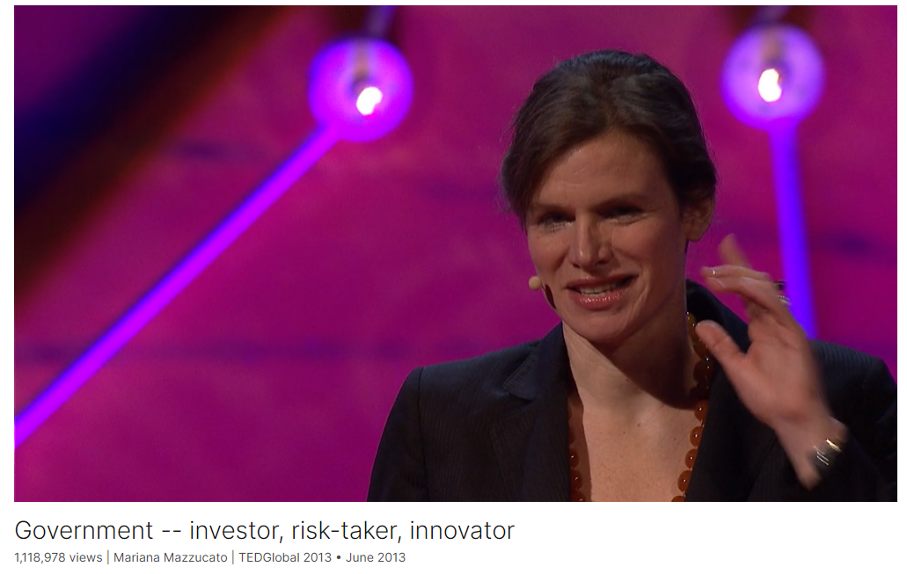

# Government -- investor, risk-taker, innovator

Link: [https://www.ted.com/talks/mariana_mazzucato_government_investor_risk_taker_innovator](https://www.ted.com/talks/mariana_mazzucato_government_investor_risk_taker_innovator)

Speaker:  Mariana Mazzucato

>[Mariana Mazzucato](https://marianamazzucato.com/) is Professor in the Economics of Innovation and Public Value at University College London, where she is Founding Director of the UCL [Institute for Innovation & Public Purpose](https://www.ucl.ac.uk/bartlett/public-purpose/) (IIPP). Her previous posts include the RM Phillips Professorial Chair at the Science Policy Research Unit at Sussex University.
>
>She is winner of international prizes including the [Grande Ufficiale Ordine al Merito della Repubblica Italiana](https://www.ucl.ac.uk/bartlett/public-purpose/news/2021/sep/professor-mariana-mazzucato-receives-prestigious-award-italian-president) in 2021, Italy’s highest civilian honour, the [2020 John von Neumann Award](http://rajk.eu/neumann-award/), the 2019 [All European Academies Madame de Staël Prize for Cultural Values](https://allea.org/mariana-mazzucato-2019/).Most recently, Pope Francis appointed her to the Pontifical Academy for Life for bringing ‘more humanity’ to the world.

Date: June 2013

@[toc]

## Introduction

Why doesn't the government just get out of the way and let the private sector -- the "real revolutionaries" -- innovate? It's rhetoric you hear everywhere, and Mariana Mazzucato wants to dispel it. In an energetic talk, she shows how the state -- which many see as a slow, hunkering behemoth -- is really one of our most exciting risk-takers and market-shapers.

为什么政府不放手让私营部门--"真正的革命者"--去创新？这是你随处可以听到的言论，而玛丽安娜-马祖卡托（Mariana Mazzucato）希望消除这些言论。在一场充满活力的演讲中，她向我们展示了在许多人眼中行动迟缓、畏首畏尾的庞然大物--国家，其实是我们最令人兴奋的风险承担者和市场塑造者之一。

## Vocabulary

dispel：美 [dɪˈspel] 排解；遣散；消除

behemoth：美 [bəˈhiməθ] 巨兽；庞大的怪物；庞然大物

hunkering：美 ['hʌŋkərɪŋ] 盘坐；蹲下；

slow, hunkering behemoth 缓慢而庞大的庞然大物

that question is on the tip of all of their tongues：这句话意思是“这个问题几乎是所有他们（指政策制定者）嘴边的话题”，表达了这个问题引起了政策制定者的高度关注和兴趣。

gazelle：美 [ɡəˈzel] 瞪羚；羚羊 **注意发音**

private sector：私营企业, (国家经济的)私营部分

equitable：美 [ˈekwɪtəbl] 公平的；公正的；

it might be more equitable这可能更公平

venture capital：风险资本；创业资本；风险投资；

Leviathan：美 [ləˈvaɪəθən] 利维坦；水中巨兽；巨大而强有力的东西；独裁君主；

tentacle：美 [ˈtentəkl] 触角；触手；触须

editorial：美 [ˌedɪˈtɔːriəl] 社论

the state as this Leviathan. Right? This monster with big tentacles. They're very explicit in these editorials. 政府就像这个庞然大物。对吗？这个长着大触角的怪物。他们在这些社论中非常明确。

negative externality：负外部性

> "negative externalities" 是指负外部性，是指某些经济活动所产生的负面影响，这些影响并不反映在市场价格中，而是由其他人或社会承担。举例来说，工厂的污染可能导致周围居民的健康问题，但这些健康问题的成本通常不会由工厂承担，而是由受影响的人或社会其他成员承担。

nanotech: 纳米技术

juxtaposition: 美 [ˌdʒʌkstəpəˈzɪʃən]  并列；毗邻；并排

grant: 拨款，补助金

public grants：公共拨款

The touchscreen display was funded by two public grants by the CIA and the NSF:触摸屏显示器由中央情报局和国家科学基金会的两项公共拨款资助

an awful lot：很多

They spend an awful lot on buying back their stock：他们在回购股票上花费了巨额资金

stunt：美 [stʌnt] 妨碍；阻止

I think we've actually really stunted the possibility to build these public-private partnerships in a really dynamic way. 我认为我们实际上已经阻碍了以一种真正动态的方式建立这些公私合作关系的可能性。

Kafka-ian bureaucrat: 卡夫卡式的官僚

>"that Kafka-ian bureaucrat" 指的是卡夫卡式的官僚。这个短语来源于奥地利作家弗朗茨·卡夫卡的作品，他以描述官僚主义和权力机构中的不可理喻和令人沮丧的特征而闻名。在演讲中，作者使用这个短语来暗示政府官员或官僚体系中的复杂性、迂回和难以理解的性质。

nationalistic：英 [ˌnæʃnəˈlɪstɪk] 民族主义的；

Globalization, and that's fine. We shouldn't be nationalistic

## Transcript

Have you ever asked yourselves why it is that

companies, the really cool companies,

the innovative ones, the creative,

new economy-type companies --

Apple, Google, Facebook --

are coming out of one particular country,

the United States of America?

Usually when I say this, someone says, "Spotify!

That's Europe." But, yeah.

It has not had the impact that these other companies have had.

Now what I do is I'm an economist,

and I actually study the relationship

between innovation and economic growth

at the level of the company, the industry and the nation,

and I work with policymakers worldwide,

especially in the European Commission,

but recently also in interesting places like China,

and I can tell you that that question

is on the tip of all of their tongues:

Where are the European Googles?

What is the secret behind the Silicon Valley growth model,

which they understand is different

from this old economy growth model?

And what is interesting is that often,

even if we're in the 21st century,

we kind of come down in the end to these ideas

of market versus state.

It's talked about in these modern ways,

but the idea is that somehow, behind places like Silicon Valley,

the secret have been different types of market-making mechanisms,

the private initiative, whether this be about

a dynamic venture capital sector

that's actually able to provide that high-risk finance

to these innovative companies,

the gazelles as we often call them,

which traditional banks are scared of,

or different types of really successful

commercialization policies which actually allow these companies

to bring these great inventions, their products,

to the market and actually get over this

really scary Death Valley period

in which many companies instead fail.

But what really interests me, especially nowadays

and because of what's happening politically around the world,

is the language that's used, the narrative,

the discourse, the images, the actual words.

So we often are presented

with the kind of words like that the private sector

is also much more innovative because it's able to

think out of the box.

They are more dynamic.

Think of Steve Jobs' really inspirational speech

to the 2005 graduating class at Stanford,

where he said to be innovative,

you've got to stay hungry, stay foolish.

Right? So these guys are kind of the hungry

and foolish and colorful guys, right?

And in places like Europe,

it might be more equitable,

we might even be a bit better dressed

and eat better than the U.S.,

but the problem is this damn public sector.

It's a bit too big, and it hasn't actually allowed

these things like dynamic venture capital

and commercialization to actually be able to really

be as fruitful as it could.

And even really respectable newspapers,

some that I'm actually subscribed to,

the words they use are, you know,

the state as this Leviathan. Right?

This monster with big tentacles.

They're very explicit in these editorials.

They say, "You know, the state, it's necessary

to fix these little market failures

when you have public goods

or different types of negative externalities like pollution,

but you know what, what is the next big revolution

going to be after the Internet?

We all hope it might be something green,

or all of this nanotech stuff, and in order for that stuff to happen," they say --

this was a special issue on the next industrial revolution --

they say, "the state, just stick to the basics, right?

Fund the infrastructure. Fund the schools.

Even fund the basic research, because this is

popularly recognized, in fact, as a big public good

which private companies don't want to invest in,

do that, but you know what?

Leave the rest to the revolutionaries."

Those colorful, out-of-the-box kind of thinkers.

They're often called garage tinkerers,

because some of them actually did some things in garages,

even though that's partly a myth.

And so what I want to do with you in, oh God,

only 10 minutes,

is to really think again this juxtaposition,

because it actually has massive, massive implications

beyond innovation policy,

which just happens to be the area

that I often talk with with policymakers.

It has huge implications, even with this whole notion

that we have on where, when and why

we should actually be cutting back on public spending

and different types of public services which,

of course, as we know, are increasingly being

outsourced because of this juxtaposition.

Right? I mean, the reason that we need to maybe have free schools or charter schools

is in order to make them more innovative without being emburdened

by this heavy hand of the state curriculum, or something.

So these kind of words are constantly,

these juxtapositions come up everywhere,

not just with innovation policy.

And so to think again,

there's no reason that you should believe me,

so just think of some of the smartest

revolutionary things that you have in your pockets

and do not turn it on, but you might want to take it out, your iPhone.

Ask who actually funded the really cool,

revolutionary thinking-out-of-the-box

things in the iPhone.

What actually makes your phone

a smartphone, basically, instead of a stupid phone?

So the Internet, which you can surf the web

anywhere you are in the world;

GPS, where you can actually know where you are

anywhere in the world;

the touchscreen display, which makes it also

a really easy-to-use phone for anybody.

These are the very smart, revolutionary bits about the iPhone,

and they're all government-funded.

And the point is that the Internet

was funded by DARPA, U.S. Department of Defense.

GPS was funded by the military's Navstar program.

Even Siri was actually funded by DARPA.

The touchscreen display was funded

by two public grants by the CIA and the NSF

to two public university researchers at the University of Delaware.

Now, you might be thinking, "Well, she's just said

the word 'defense' and 'military' an awful lot,"

but what's really interesting is that this is actually true

in sector after sector and department after department.

So the pharmaceutical industry, which I am personally

very interested in because I've actually had the fortune

to study it in quite some depth,

is wonderful to be asking this question

about the revolutionary versus non-revolutionary bits,

because each and every medicine can actually be

divided up on whether it really is revolutionary or incremental.

So the new molecular entities with priority rating

are the revolutionary new drugs,

whereas the slight variations of existing drugs --

Viagra, different color, different dosage --

are the less revolutionary ones.

And it turns out that a full 75 percent

of the new molecular entities with priority rating

are actually funded in boring, Kafka-ian public sector labs.

This doesn't mean that Big Pharma is not spending on innovation.

They do. They spend on the marketing part.

They spend on the D part of R&D.

They spend an awful lot on buying back their stock,

which is quite problematic.

In fact, companies like Pfizer and Amgen recently

have spent more money in buying back their shares

to boost their stock price than on R&D,

but that's a whole different TED Talk which one day

I'd be fascinated to tell you about.

Now, what's interesting in all of this

is the state, in all these examples,

was doing so much more than just fixing market failures.

It was actually shaping and creating markets.

It was funding not only the basic research,

which again is a typical public good,

but even the applied research.

It was even, God forbid, being a venture capitalist.

So these SBIR and SDTR programs,

which give small companies early-stage finance

have not only been extremely important

compared to private venture capital,

but also have become increasingly important.

Why? Because, as many of us know,

V.C. is actually quite short-term.

They want their returns in three to five years.

Innovation takes a much longer time than that,

15 to 20 years.

And so this whole notion -- I mean, this is the point, right?

Who's actually funding the hard stuff?

Of course, it's not just the state.

The private sector does a lot.

But the narrative that we've always been told

is the state is important for the basics,

but not really providing that sort of high-risk,

revolutionary thinking out of the box.

In all these sectors, from funding the Internet

to doing the spending, but also the envisioning,

the strategic vision, for these investments,

it was actually coming within the state.

The nanotechnology sector is actually fascinating

to study this, because the word itself, nanotechnology,

came from within government.

And so there's huge implications of this.

First of all, of course I'm not someone,

this old-fashioned person, market versus state.

What we all know in dynamic capitalism

is that what we actually need are public-private partnerships.

But the point is, by constantly depicting

the state part as necessary

but actually -- pffff -- a bit boring

and often a bit dangerous kind of Leviathan,

I think we've actually really stunted the possibility

to build these public-private partnerships

in a really dynamic way.

Even the words that we often use to justify the "P" part,

the public part -- well, they're both P's --

with public-private partnerships

is in terms of de-risking.

What the public sector did in all these examples

I just gave you, and there's many more,

which myself and other colleagues have been looking at,

is doing much more than de-risking.

It's kind of been taking on that risk. Bring it on.

It's actually been the one thinking out of the box.

But also, I'm sure you all have had experience

with local, regional, national governments,

and you're kind of like, "You know what, that Kafka-ian bureaucrat, I've met him."

That whole juxtaposition thing, it's kind of there.

Well, there's a self-fulfilling prophecy.

By talking about the state as kind of irrelevant,

boring, it's sometimes

that we actually create those organizations in that way.

So what we have to actually do is build

these entrepreneurial state organizations.

DARPA, that funded the Internet and Siri,

actually thought really hard about this,

how to welcome failure, because you will fail.

You will fail when you innovative.

One out of 10 experiments has any success.

And the V.C. guys know this,

and they're able to actually fund the other losses

from that one success.

And this brings me, actually, probably,

to the biggest implication,

and this has huge implications beyond innovation.

If the state is more than just a market fixer,

if it actually is a market shaper,

and in doing that has had to take on this massive risk,

what happened to the reward?

We all know, if you've ever taken a finance course,

the first thing you're taught is sort of the risk-reward relationship,

and so some people are foolish enough

or probably smart enough if they have time to wait,

to actually invest in stocks, because they're higher risk

which over time will make a greater reward than bonds,

that whole risk-reward thing.

Well, where's the reward for the state

of having taken on these massive risks

and actually been foolish enough to have done the Internet?

The Internet was crazy.

It really was. I mean, the probability of failure was massive.

You had to be completely nuts to do it,

and luckily, they were.

Now, we don't even get to this question about rewards

unless you actually depict the state as this risk-taker.

And the problem is that economists often think,

well, there is a reward back to the state. It's tax.

You know, the companies will pay tax,

the jobs they create will create growth

so people who get those jobs and their incomes rise

will come back to the state through the tax mechanism.

Well, unfortunately, that's not true.

Okay, it's not true because many of the jobs that are created go abroad.

Globalization, and that's fine. We shouldn't be nationalistic.

Let the jobs go where they have to go, perhaps.

I mean, one can take a position on that.

But also these companies

that have actually had this massive benefit from the state --

Apple's a great example.

They even got the first -- well, not the first,

but 500,000 dollars actually went to Apple, the company,

through this SBIC program,

which predated the SBIR program,

as well as, as I said before, all the technologies behind the iPhone.

And yet we know they legally,

as many other companies, pay very little tax back.

So what we really need to actually rethink

is should there perhaps be a return-generating mechanism

that's much more direct than tax. Why not?

It could happen perhaps through equity.

This, by the way, in the countries

that are actually thinking about this strategically,

countries like Finland in Scandinavia,

but also in China and Brazil,

they're retaining equity in these investments.

Sitra funded Nokia, kept equity, made a lot of money,

it's a public funding agency in Finland,

which then funded the next round of Nokias.

The Brazilian Development Bank,

which is providing huge amounts of funds today

to clean technology, they just announced

a $56 billion program for the future on this,

is retaining equity in these investments.

So to put it provocatively,

had the U.S. government thought about this,

and maybe just brought back

just something called an innovation fund,

you can bet that, you know, if even just .05 percent

of the profits from what the Internet produced

had come back to that innovation fund,

there would be so much more money

to spend today on green technology.

Instead, many of the state budgets

which in theory are trying to do that

are being constrained.

But perhaps even more important,

we heard before about the one percent,

the 99 percent.

If the state is thought about in this more strategic way,

as one of the lead players in the value creation mechanism,

because that's what we're talking about, right?

Who are the different players in creating value

in the economy, and is the state's role,

has it been sort of dismissed as being a backseat player?

If we can actually have a broader theory

of value creation and allow us to actually admit

what the state has been doing and reap something back,

it might just be that in the next round,

and I hope that we all hope that the next big revolution

will in fact be green,

that that period of growth

will not only be smart, innovation-led,

not only green, but also more inclusive,

so that the public schools in places like Silicon Valley

can actually also benefit from that growth,

because they have not.

Thank you.

(Applause)

## Summary

Mariana Mazzucato, an economist, explores the dynamics behind innovation and economic growth, focusing on why innovative companies like Apple, Google, and Facebook predominantly emerge from the United States. She emphasizes the curiosity among policymakers worldwide about the absence of similar groundbreaking companies in Europe. Mazzucato challenges the conventional narrative that attributes innovative success solely to the private sector, highlighting the significant role played by the state in shaping markets, funding research, and taking on high-risk ventures.

Mazzucato critically examines the dichotomy between the private sector's perceived dynamism and the state's perceived bureaucratic constraints. She argues that while the private sector is often credited with out-of-the-box thinking and risk-taking, the state has historically been instrumental in funding groundbreaking innovations. Using examples like the Internet, GPS, and touchscreen display, she demonstrates how government funding and strategic vision have been crucial in driving technological advancements and shaping entire industries.

In conclusion, Mazzucato advocates for a reevaluation of the state's role in innovation and value creation, challenging the notion that its contributions should be limited to fixing market failures. She suggests that by acknowledging the state's role as a market shaper and risk-taker, policymakers can develop more effective public-private partnerships and mechanisms for capturing returns on public investments. Ultimately, she envisions a future where innovation-led growth is not only smart and green but also more inclusive, benefiting public services and communities as a whole.

## 后记

2024年5月10日18点55分于上海。

