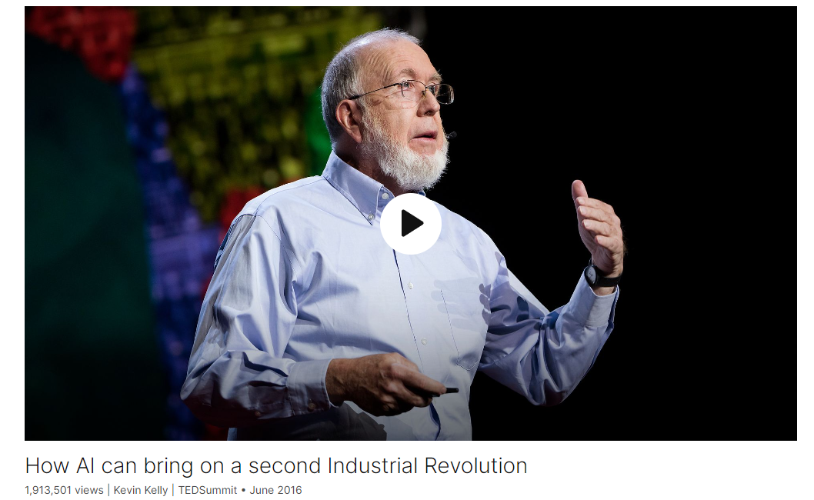

# How AI can bring on a second Industrial Revolution

Link: [https://www.ted.com/talks/kevin_kelly_how_ai_can_bring_on_a_second_industrial_revolution](https://www.ted.com/talks/kevin_kelly_how_ai_can_bring_on_a_second_industrial_revolution)

Speaker:   Kevin Kelly 

Date: June 2016

@[toc]

## Introduction

## Vocabulary

leaning = tendency：趋势

But there's actually a large aspect of technology that's much more predictable, and that's because technological systems of all sorts have leanings, they have urgencies, they have tendencies. 但实际上技术的很大一部分是更可预测的，这是因为各种技术系统都有倾向，它们有紧迫性，它们有趋势。

make reoccurring patterns：一遍又一遍地发生

A recurring pattern refers to **a consistent and repeated occurrence or trend that can be observed over time**.

And those tendencies are derived from the very nature of the physics, chemistry of wires and switches and electrons, and they will make reoccurring patterns again and again. 这些趋势来源于电线、开关和电子的物理、化学性质，它们会一次又一次地重复出现。

bake in：

>a. (Computers) to incorporate (a feature) as part of a system or piece of software or hardware while it is still in development: *The location-tracking service is baked in the new app. Security features come baked into the operating system.*
>b. To include as an inseparable or permanent part: *Baked into the price of the product is the cost of advertising.*
>
>a.(计算机）在系统或软件或硬件的开发过程中，将（某项功能）作为系统或软件或硬件的一部分：定位跟踪服务已植入新的应用程序。安全功能已植入操作系统。
>b.作为不可分割或永久的一部分：产品价格中包含了广告费用。

And so these baked-in tendencies and urgencies in technological systems give us a sense of where things are going at the large form. 因此，技术系统中这些固有的趋势和紧迫性给了我们一种大尺度上事物走向的感觉。

"baked-in" 是一个形容词短语，意思是“固有的”或“内在的”。在这个上下文中，它指的是技术系统中固有的、内在的趋势和紧迫性。

most influential developments, trends, directions and drives in our society. 最有影响力的发展、趋势、方向和动力

So we have many ongoing tendencies right now, and I think one of the chief among them is this tendency to make things smarter and smarter. I call it cognifying -- cognification -- also known as artificial intelligence, or AI. And I think that's going to be one of the most influential developments and trends and directions and drives in our society in the next 20 years. 因此，我们现在有许多正在发展的趋势，我认为其中最主要的趋势之一就是让事物变得越来越聪明。我称之为认知-认知-也称为人工智能，或人工智能。我认为这将是未来20年我们社会中最有影响力的发展、趋势、方向和动力之一。

paralawyer: 助理律师

artificial smartness = artificial intelligence

because it's only by embracing it that we actually can steer it. We can actually steer the specifics by embracing the larger trend. 因为只有拥抱它，我们才能真正驾驭它。我们实际上可以通过拥抱更大的趋势来控制细节。

chimpanzee：美 [ˌtʃɪmpænˈziː] 黑猩猩

a symphony of different notes：有不同音符的交响乐

It's much more like a symphony of different notes, and each of these notes is played on a different instrument of cognition. There are many types of intelligences in our own minds. We have deductive reasoning, we have emotional intelligence, we have spatial intelligence; we have maybe 100 different types that are all grouped together, and they vary in different strengths with different people. 它更像是一部不同音符的交响乐，每一个音符都在不同的认知乐器上演奏。在我们自己的头脑中有许多种智能。我们有演绎推理，我们有情商，我们有空间智能；我们大概有100种不同类型的智能聚集在一起，它们因人而异。

stove：美 [stoʊv] 炉子，火炉；left the stove on：开着炉子

advertise：为…做广告；广告招聘；宣传；

And we actually might even come to advertise these as "consciousness-free." 事实上，我们甚至可能会宣传这些是“无意识的”

churn out： 大量炮制；粗制滥造；

farmstead：美 [ˈfɑrmˌstɛd]  农庄，农场及其建筑物

So everything that we had electrified, we're now going to cognify：所以我们电气化的所有东西，我们现在都要去人工智能化。

medical diagnostician：美 [ˌdaɪəgnɑs'tɪʃən]  诊断医生

## Transcript

I'm going to talk a little bit
about where technology's going.

And often technology comes to us,

we're surprised by what it brings.

But there's actually
a large aspect of technology

that's much more predictable,

and that's because technological systems
of all sorts have leanings,

they have urgencies,

they have tendencies.

And those tendencies are derived
from the very nature of the physics,

chemistry of wires
and switches and electrons,

and they will make reoccurring
patterns again and again.

And so those patterns produce
these tendencies, these leanings.

You can almost think of it
as sort of like gravity.

Imagine raindrops falling into a valley.

The actual path of a raindrop
as it goes down the valley

is unpredictable.

We cannot see where it's going,

but the general direction
is very inevitable:

it's downward.

And so these baked-in
tendencies and urgencies

in technological systems

give us a sense of where things
are going at the large form.

So in a large sense,

I would say that telephones
were inevitable,

but the iPhone was not.

The Internet was inevitable,

but Twitter was not.

So we have many ongoing
tendencies right now,

and I think one of the chief among them

is this tendency to make things
smarter and smarter.

I call it cognifying -- cognification --

also known as artificial
intelligence, or AI.

And I think that's going to be one
of the most influential developments

and trends and directions and drives
in our society in the next 20 years.

So, of course, it's already here.

We already have AI,

and often it works in the background,

in the back offices of hospitals,

where it's used to diagnose X-rays
better than a human doctor.

It's in legal offices,

where it's used to go
through legal evidence

better than a human paralawyer.

It's used to fly the plane
that you came here with.

Human pilots only flew it
seven to eight minutes,

the rest of the time the AI was driving.

And of course, in Netflix and Amazon,

it's in the background,
making those recommendations.

That's what we have today.

And we have an example, of course,
in a more front-facing aspect of it,

with the win of the AlphaGo, who beat
the world's greatest Go champion.

But it's more than that.

If you play a video game,
you're playing against an AI.

But recently, Google taught their AI

to actually learn how to play video games.

Again, teaching video games
was already done,

but learning how to play
a video game is another step.

That's artificial smartness.

What we're doing is taking
this artificial smartness

and we're making it smarter and smarter.

There are three aspects
to this general trend

that I think are underappreciated;

I think we would understand
AI a lot better

if we understood these three things.

I think these things also would
help us embrace AI,

because it's only by embracing it
that we actually can steer it.

We can actually steer the specifics
by embracing the larger trend.

So let me talk about
those three different aspects.

The first one is: our own intelligence
has a very poor understanding

of what intelligence is.

We tend to think of intelligence
as a single dimension,

that it's kind of like a note
that gets louder and louder.

It starts like with IQ measurement.

It starts with maybe a simple
low IQ in a rat or mouse,

and maybe there's more in a chimpanzee,

and then maybe there's more
in a stupid person,

and then maybe an average
person like myself,

and then maybe a genius.

And this single IQ intelligence
is getting greater and greater.

That's completely wrong.

That's not what intelligence is --
not what human intelligence is, anyway.

It's much more like a symphony
of different notes,

and each of these notes is played
on a different instrument of cognition.

There are many types
of intelligences in our own minds.

We have deductive reasoning,

we have emotional intelligence,

we have spatial intelligence;

we have maybe 100 different types
that are all grouped together,

and they vary in different strengths
with different people.

And of course, if we go to animals,
they also have another basket --

another symphony of different
kinds of intelligences,

and sometimes those same instruments
are the same that we have.

They can think in the same way,
but they may have a different arrangement,

and maybe they're higher
in some cases than humans,

like long-term memory in a squirrel
is actually phenomenal,

so it can remember
where it buried its nuts.

But in other cases they may be lower.

When we go to make machines,

we're going to engineer
them in the same way,

where we'll make some of those types
of smartness much greater than ours,

and many of them won't be
anywhere near ours,

because they're not needed.

So we're going to take these things,

these artificial clusters,

and we'll be adding more varieties
of artificial cognition to our AIs.

We're going to make them
very, very specific.

So your calculator is smarter
than you are in arithmetic already;

your GPS is smarter
than you are in spatial navigation;

Google, Bing, are smarter
than you are in long-term memory.

And we're going to take, again,
these kinds of different types of thinking

and we'll put them into, like, a car.

The reason why we want to put them
in a car so the car drives,

is because it's not driving like a human.

It's not thinking like us.

That's the whole feature of it.

It's not being distracted,

it's not worrying about whether
it left the stove on,

or whether it should have
majored in finance.

It's just driving.

(Laughter)

Just driving, OK?

And we actually might even
come to advertise these

as "consciousness-free."

They're without consciousness,

they're not concerned about those things,

they're not distracted.

So in general, what we're trying to do

is make as many different
types of thinking as we can.

We're going to populate the space

of all the different possible types,
or species, of thinking.

And there actually may be some problems

that are so difficult
in business and science

that our own type of human thinking
may not be able to solve them alone.

We may need a two-step program,

which is to invent new kinds of thinking

that we can work alongside of to solve
these really large problems,

say, like dark energy or quantum gravity.

What we're doing
is making alien intelligences.

You might even think of this
as, sort of, artificial aliens

in some senses.

And they're going to help
us think different,

because thinking different
is the engine of creation

and wealth and new economy.

The second aspect of this
is that we are going to use AI

to basically make a second
Industrial Revolution.

The first Industrial Revolution
was based on the fact

that we invented something
I would call artificial power.

Previous to that,

during the Agricultural Revolution,

everything that was made
had to be made with human muscle

or animal power.

That was the only way
to get anything done.

The great innovation during
the Industrial Revolution was,

we harnessed steam power, fossil fuels,

to make this artificial power
that we could use

to do anything we wanted to do.

So today when you drive down the highway,

you are, with a flick of the switch,
commanding 250 horses --

250 horsepower --

which we can use to build skyscrapers,
to build cities, to build roads,

to make factories that would churn out
lines of chairs or refrigerators

way beyond our own power.

And that artificial power can also
be distributed on wires on a grid

to every home, factory, farmstead,

and anybody could buy
that artificial power,

just by plugging something in.

So this was a source
of innovation as well,

because a farmer could take
a manual hand pump,

and they could add this artificial
power, this electricity,

and he'd have an electric pump.

And you multiply that by thousands
or tens of thousands of times,

and that formula was what brought us
the Industrial Revolution.

All the things that we see,
all this progress that we now enjoy,

has come from the fact
that we've done that.

We're going to do
the same thing now with AI.

We're going to distribute that on a grid,

and now you can take that electric pump.

You can add some artificial intelligence,

and now you have a smart pump.

And that, multiplied by a million times,

is going to be this second
Industrial Revolution.

So now the car is going down the highway,

it's 250 horsepower,
but in addition, it's 250 minds.

That's the auto-driven car.

It's like a new commodity;

it's a new utility.

The AI is going to flow
across the grid -- the cloud --

in the same way electricity did.

So everything that we had electrified,

we're now going to cognify.

And I would suggest, then,

that the formula
for the next 10,000 start-ups

is very, very simple,

which is to take x and add AI.

That is the formula,
that's what we're going to be doing.

And that is the way
in which we're going to make

this second Industrial Revolution.

And by the way -- right now, this minute,

you can log on to Google

and you can purchase
AI for six cents, 100 hits.

That's available right now.

So the third aspect of this

is that when we take this AI
and embody it,

we get robots.

And robots are going to be bots,

they're going to be doing many
of the tasks that we have already done.

A job is just a bunch of tasks,

so they're going to redefine our jobs

because they're going to do
some of those tasks.

But they're also going to create
whole new categories,

a whole new slew of tasks

that we didn't know
we wanted to do before.

They're going to actually
engender new kinds of jobs,

new kinds of tasks that we want done,

just as automation made up
a whole bunch of new things

that we didn't know we needed before,

and now we can't live without them.

So they're going to produce
even more jobs than they take away,

but it's important that a lot of the tasks
that we're going to give them

are tasks that can be defined
in terms of efficiency or productivity.

If you can specify a task,

either manual or conceptual,

that can be specified in terms
of efficiency or productivity,

that goes to the bots.

Productivity is for robots.

What we're really good at
is basically wasting time.

(Laughter)

We're really good at things
that are inefficient.

Science is inherently inefficient.

It runs on that fact that you have
one failure after another.

It runs on the fact that you make tests
and experiments that don't work,

otherwise you're not learning.

It runs on the fact

that there is not
a lot of efficiency in it.

Innovation by definition is inefficient,

because you make prototypes,

because you try stuff that fails,
that doesn't work.

Exploration is inherently inefficiency.

Art is not efficient.

Human relationships are not efficient.

These are all the kinds of things
we're going to gravitate to,

because they're not efficient.

Efficiency is for robots.

We're also going to learn
that we're going to work with these AIs

because they think differently than us.

When Deep Blue beat
the world's best chess champion,

people thought it was the end of chess.

But actually, it turns out that today,
the best chess champion in the world

is not an AI.

And it's not a human.

It's the team of a human and an AI.

The best medical diagnostician
is not a doctor, it's not an AI,

it's the team.

We're going to be working with these AIs,

and I think you'll be paid in the future

by how well you work with these bots.

So that's the third thing,
is that they're different,

they're utility

and they are going to be something
we work with rather than against.

We're working with these
rather than against them.

So, the future:

Where does that take us?

I think that 25 years from now,
they'll look back

and look at our understanding
of AI and say,

"You didn't have AI. In fact,
you didn't even have the Internet yet,

compared to what we're going
to have 25 years from now."

There are no AI experts right now.

There's a lot of money going to it,

there are billions of dollars
being spent on it;

it's a huge business,

but there are no experts, compared
to what we'll know 20 years from now.

So we are just at the beginning
of the beginning,

we're in the first hour of all this.

We're in the first hour of the Internet.

We're in the first hour of what's coming.

The most popular AI product
in 20 years from now,

that everybody uses,

has not been invented yet.

That means that you're not late.

Thank you.

(Laughter)

(Applause)

## Summary

Kevin Kelly's talk focused on the predictable nature of technological progress, driven by the inherent tendencies in technological systems. He likened these tendencies to gravity, guiding technological advancements along recurring patterns. Kelly emphasized the increasing intelligence of technology, known as "cognification" or artificial intelligence (AI), as a significant trend shaping society. He highlighted AI's current applications in various fields and its potential to become smarter through learning.

Furthermore, Kelly discussed the multidimensional nature of intelligence, stating that human intelligence consists of various types of intelligences, which will also be reflected in AI. He envisioned a future where AI is integrated into everyday tasks, leading to a new Industrial Revolution. This integration will redefine jobs, creating new roles and tasks for humans to work alongside AI.

In conclusion, Kelly emphasized the importance of embracing AI and working alongside it, as it will fundamentally change how we work and live. He suggested that we are only at the beginning of understanding AI, and the most popular AI products of the future have yet to be invented.

凯文·凯利介绍的被低估的三个趋势是：

1. **智能多元化**：人类的智能并非单一维度的，而是像交响乐般由不同音符组成，每个音符在认知的不同仪器上演奏。我们的思维中有许多种智能，如演绎推理、情感智能、空间智能等，它们可能有100种不同类型，这些类型在不同人群中的强度也不同。
2. **AI驱动的第二次工业革命**：与第一次工业革命类似，AI将成为人类的人工动力，通过将AI分布在网格上，将人工智能添加到各种设备中，使其变得智能化。这将带来新的创新和就业机会，类似于电气化带来的影响。
3. **与AI合作**：未来人们将与AI合作，因为AI的思维方式与我们不同。最好的国际象棋冠军不是AI，也不是人类，而是人类和AI的团队。我们将与这些AI合作，未来的报酬将取决于与这些机器人合作的程度。

Kevin Kelly introduced three underestimated trends:

1. **Diversification of Intelligence**: Human intelligence is not a single-dimensional thing, but rather like a symphony of different notes, each played on a different instrument of cognition. There are many types of intelligences in our own minds. We have deductive reasoning, emotional intelligence, spatial intelligence; we have maybe 100 different types that are all grouped together, and they vary in different strengths with different people.

2. **AI-Driven Second Industrial Revolution**: Similar to the first Industrial Revolution, AI will become humankind's artificial power, by distributing AI on a grid and adding AI to various devices, making them intelligent. This will bring new innovations and job opportunities, similar to the impact of electrification.

3. **Collaborating with AI**: In the future, people will collaborate with AI because their way of thinking is different. The best chess champion is not AI or a human, but a team of a human and an AI. We will work with these AIs, and future compensation will depend on how well we work with these robots.

## 后记

2024年4月16日21点10分完成这篇演讲的学习与记录。
