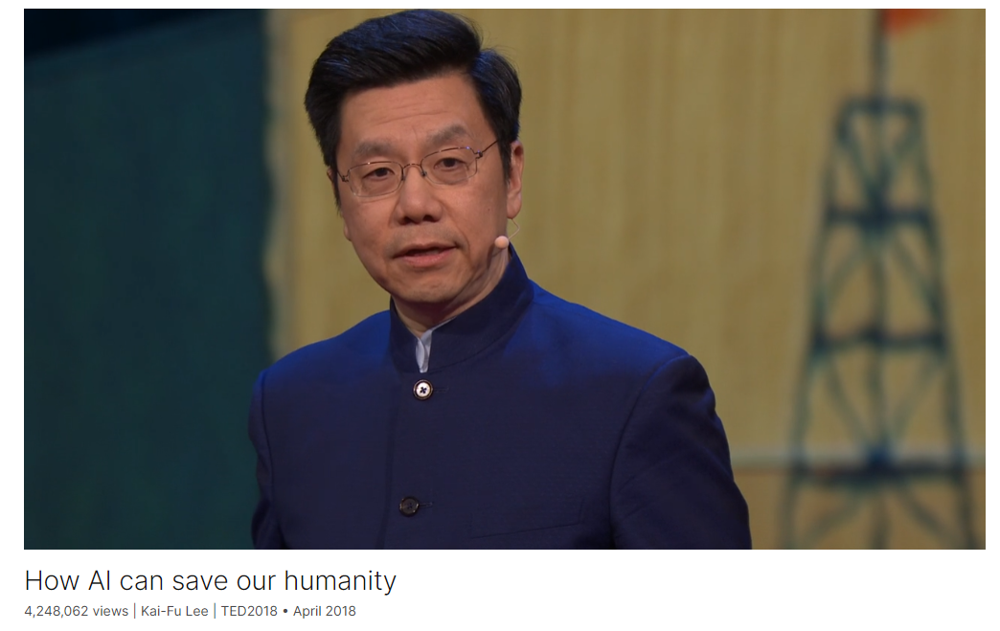

# How AI can save our humanity

Link: [https://www.ted.com/talks/kai_fu_lee_how_ai_can_save_our_humanity](https://www.ted.com/talks/kai_fu_lee_how_ai_can_save_our_humanity)

Speaker:   Kai-Fu Lee

Date: April 2018

@[toc]

## Introduction

AI is massively transforming our world, but there's one thing it cannot do: love. In a visionary talk, computer scientist Kai-Fu Lee details how the US and China are driving a deep learning revolution -- and shares a blueprint for how humans can thrive in the age of AI by harnessing compassion and creativity. "AI is serendipity," Lee says. "It is here to liberate us from routine jobs, and it is here to remind us what it is that makes us human."

人工智能正在大规模改变我们的世界，但有一件事它做不到：爱。在一场富有远见的演讲中，计算机科学家李开复详细介绍了美国和中国如何推动深度学习革命，并分享了人类如何通过利用同情心和创造力在人工智能时代茁壮成长的蓝图。"人工智能是一种偶然性，"李开复说。"它是来把我们从日常工作中解放出来的，它是来提醒我们是什么让我们成为人类的。"

## Vocabulary

confession: 美 [kənˈfeʃn] 坦白，认罪，认错

So let me first make a confession about my errors in my values. 所以首先让我坦白我在价值观上的错误。

take precedence over: 优先于

 I am so sorry for letting my work ethic take precedence over love for my family. 我很抱歉让我的职业道德凌驾于对家庭的爱之上。

oxymoron：美 [ˌɑːksɪˈmɔːrɑːn] 

>矛盾修饰法 oxymoron，一种把互相矛盾或不调和的词合在一起的修辞手法，如在震耳欲聋的沉默 和 悲伤的乐观 （ A rhetorical  figure in which incongruous or contradictory terms are combined, as in a deafening silence and a mournful optimist. ）
>
>https://baike.sogou.com/v305219.htm?ch=sogou.fanyi

>An **oxymoron** (plurals: **oxymorons** and **oxymora**) is a [figure of speech](https://en.wikipedia.org/wiki/Figure_of_speech) that [juxtaposes](https://en.wikipedia.org/wiki/Juxtaposition) concepts with opposite meanings within a word or in a phrase that is a [self-contradiction](https://en.wikipedia.org/wiki/Self-contradiction_(disambiguation)). As a [rhetorical device](https://en.wikipedia.org/wiki/Rhetorical_device), an oxymoron illustrates a point to communicate and reveal a [paradox](https://en.wikipedia.org/wiki/Paradox).[[1\]](https://en.wikipedia.org/wiki/Oxymoron#cite_note-1)[[2\]](https://en.wikipedia.org/wiki/Oxymoron#cite_note-2) A general meaning of "contradiction in terms" is recorded by the 1902 edition of the *Oxford English Dictionary.[[3\]](https://en.wikipedia.org/wiki/Oxymoron#cite_note-3)*
>
>https://en.wikipedia.org/wiki/Oxymoron

delivery room:  产房

labor：分娩

My wife, Shen-Ling, lay in the hospital bed going through a very difficult 12-hour labor.

fiercely competitive environment：异常激烈的环境

gladiatorial：美 [ˌɡlædɪr'tɔrɪrl]  "Gladiatorial"的中文意思是“角斗的”或“搏斗的”，通常用来形容激烈的竞争或对抗。

In Silicon Valley, entrepreneurs compete in a very gentlemanly fashion, sort of like in old wars in which each side took turns to fire at each other.  But in the Chinese environment, it's truly a gladiatorial fight to the death. 在硅谷，企业家以一种非常绅士的方式竞争，有点像过去的战争，双方轮流向对方开火。但在中国的环境中，这是一场真正的殊死角斗。

hone：美 [hoʊn] 磨砺

impregnable: 美 [ɪmˈprɛɡnəb(ə)l] 坚不可摧的，不可战胜的

and they learn to hone their business models until they're impregnable. 他们学会磨练自己的商业模式，直到坚不可摧。

lymphoma：美 [lɪmˈfoʊmə] 淋巴瘤

And that obsession that I had with work ended abruptly a few years ago when I was diagnose with fourth stage lymphoma. 几年前，当我被诊断出患有第四期淋巴瘤时，我对工作痴迷突然停止了。

dementia：美 [dɪˈmenʃə] 痴呆

My mother had dementia and no longer recognized me 我母亲患了痴呆症，已经认不出我了

chemotherapy：美 [ˌkiːmoʊˈθerəpi]  化学疗法，化疗

in remission：病情缓解

"Serendipity"的中文意思是“意外发现”或“意外收获”，指的是无意间发现或获得的令人愉快的事情。

## Transcript

I'm going to talk about
how AI and mankind can coexist,

but first, we have to rethink
about our human values.

So let me first make a confession
about my errors in my values.

It was 11 o'clock, December 16, 1991.

I was about to become a father
for the first time.

My wife, Shen-Ling,
lay in the hospital bed

going through a very difficult
12-hour labor.

I sat by her bedside

but looked anxiously at my watch,

and I knew something that she didn't.

I knew that if in one hour,

our child didn't come,

I was going to leave her there

and go back to work

and make a presentation about AI

to my boss, Apple's CEO.

Fortunately, my daughter
was born at 11:30 --

(Laughter)

(Applause)

sparing me from doing the unthinkable,

and to this day, I am so sorry

for letting my work ethic
take precedence over love for my family.

(Applause)

My AI talk, however, went off brilliantly.

(Laughter)

Apple loved my work
and decided to announce it

at TED1992,

26 years ago on this very stage.

I thought I had made one of the biggest,
most important discoveries in AI,

and so did the "Wall Street Journal"
on the following day.

But as far as discoveries went,

it turned out,

I didn't discover India, or America.

Perhaps I discovered
a little island off of Portugal.

But the AI era of discovery continued,

and more scientists
poured their souls into it.

About 10 years ago, the grand AI discovery

was made by three
North American scientists,

and it's known as deep learning.

Deep learning is a technology
that can take a huge amount of data

within one single domain

and learn to predict or decide
at superhuman accuracy.

For example, if we show
the deep learning network

a massive number of food photos,

it can recognize food

such as hot dog or no hot dog.

(Applause)

Or if we show it many pictures
and videos and sensor data

from driving on the highway,

it can actually drive a car
as well as a human being

on the highway.

And what if we showed
this deep learning network

all the speeches made by President Trump?

Then this artificially
intelligent President Trump,

actually the network --

(Laughter)

can --

(Applause)

You like double oxymorons, huh?

(Laughter)

(Applause)

So this network, if given the request
to make a speech about AI,

he, or it, might say --

(Recording) Donald Trump:
It's a great thing

to build a better world
with artificial intelligence.

Kai-Fu Lee: And maybe in another language?

DT: (Speaking Chinese)

(Laughter)

KFL: You didn't know
he knew Chinese, did you?

So deep learning has become the core
in the era of AI discovery,

and that's led by the US.

But we're now in the era
of implementation,

where what really matters is execution,
product quality, speed and data.

And that's where China comes in.

Chinese entrepreneurs,

who I fund as a venture capitalist,

are incredible workers,

amazing work ethic.

My example in the delivery room is nothing
compared to how hard people work in China.

As an example, one startup
tried to claim work-life balance:

"Come work for us because we are 996."

And what does that mean?

It means the work hours
of 9am to 9pm, six days a week.

That's contrasted
with other startups that do 997.

And the Chinese product quality
has consistently gone up

in the past decade,

and that's because of
a fiercely competitive environment.

In Silicon Valley, entrepreneurs
compete in a very gentlemanly fashion,

sort of like in old wars
in which each side took turns

to fire at each other.

(Laughter)

But in the Chinese environment,

it's truly a gladiatorial
fight to the death.

In such a brutal environment,
entrepreneurs learn to grow very rapidly,

they learn to make their products
better at lightning speed,

and they learn
to hone their business models

until they're impregnable.

As a result, great Chinese products
like WeChat and Weibo

are arguably better

than the equivalent American products
from Facebook and Twitter.

And the Chinese market
embraces this change

and accelerated change
and paradigm shifts.

As an example, if any of you go to China,

you will see it's almost cashless
and credit card-less,

because that thing that we all
talk about, mobile payment,

has become the reality in China.

In the last year,

18.8 trillion US dollars
were transacted on mobile internet,

and that's because
of very robust technologies

built behind it.

It's even bigger than the China GDP.

And this technology, you can say,
how can it be bigger than the GDP?

Because it includes all transactions:

wholesale, channels,
retail, online, offline,

going into a shopping mall
or going into a farmers market like this.

The technology is used
by 700 million people

to pay each other, not just merchants,

so it's peer to peer,

and it's almost transaction-fee-free.

And it's instantaneous,

and it's used everywhere.

And finally, the China market is enormous.

This market is large,

which helps give entrepreneurs
more users, more revenue,

more investment, but most importantly,

it gives the entrepreneurs a chance
to collect a huge amount of data

which becomes rocket fuel
for the AI engine.

So as a result, the Chinese AI companies

have leaped ahead

so that today, the most valuable companies

in computer vision, speech recognition,

speech synthesis,
machine translation and drones

are all Chinese companies.

So with the US leading
the era of discovery

and China leading
the era of implementation,

we are now in an amazing age

where the dual engine
of the two superpowers

are working together

to drive the fastest
revolution in technology

that we have ever seen as humans.

And this will bring tremendous wealth,

unprecedented wealth:

16 trillion dollars, according to PwC,

in terms of added GDP
to the worldwide GDP by 2030.

It will also bring immense challenges

in terms of potential job replacements.

Whereas in the Industrial Age

it created more jobs

because craftsman jobs were being
decomposed into jobs in the assembly line,

so more jobs were created.

But AI completely replaces
the individual jobs

in the assembly line with robots.

And it's not just in factories,

but truckers, drivers

and even jobs like telesales,
customer service

and hematologists as well as radiologists

over the next 15 years

are going to be gradually replaced

by artificial intelligence.

And only the creative jobs --

(Laughter)

I have to make myself safe, right?

Really, the creative jobs
are the ones that are protected,

because AI can optimize but not create.

But what's more serious
than the loss of jobs

is the loss of meaning,

because the work ethic
in the Industrial Age

has brainwashed us into thinking
that work is the reason we exist,

that work defined
the meaning of our lives.

And I was a prime and willing victim
to that type of workaholic thinking.

I worked incredibly hard.

That's why I almost left
my wife in the delivery room,

that's why I worked 996
alongside my entrepreneurs.

And that obsession that I had with work

ended abruptly a few years ago

when I was diagnosed
with fourth stage lymphoma.

The PET scan here shows
over 20 malignant tumors

jumping out like fireballs,

melting away my ambition.

But more importantly,

it helped me reexamine my life.

Knowing that I may only have
a few months to live

caused me to see how foolish it was

for me to base my entire self-worth

on how hard I worked
and the accomplishments from hard work.

My priorities were
completely out of order.

I neglected my family.

My father had passed away,

and I never had a chance
to tell him I loved him.

My mother had dementia
and no longer recognized me,

and my children had grown up.

During my chemotherapy,

I read a book by Bronnie Ware

who talked about dying wishes and regrets
of the people in the deathbed.

She found that facing death,

nobody regretted that they didn't
work hard enough in this life.

They only regretted that they didn't
spend enough time with their loved ones

and that they didn't spread their love.

So I am fortunately today in remission.

(Applause)

So I can be back at TED again

to share with you
that I have changed my ways.

I now only work 965 --

occasionally 996, but usually 965.

I moved closer to my mother,

my wife usually travels with me,

and when my kids have vacation,
if they don't come home, I go to them.

So it's a new form of life

that helped me recognize

how important it is that love is for me,

and facing death
helped me change my life,

but it also helped me see a new way

of how AI should impact mankind

and work and coexist with mankind,

that really, AI is taking away
a lot of routine jobs,

but routine jobs are not what we're about.

Why we exist is love.

When we hold our newborn baby,

love at first sight,

or when we help someone in need,

humans are uniquely able
to give and receive love,

and that's what differentiates us from AI.

Despite what science fiction may portray,

I can responsibly tell you
that AI has no love.

When AlphaGo defeated
the world champion Ke Jie,

while Ke Jie was crying
and loving the game of go,

AlphaGo felt no happiness from winning

and certainly no desire
to hug a loved one.

So how do we differentiate ourselves

as humans in the age of AI?

We talked about the axis of creativity,

and certainly that is one possibility,

and now we introduce a new axis

that we can call compassion,
love, or empathy.

Those are things that AI cannot do.

So as AI takes away the routine jobs,

I like to think we can, we should
and we must create jobs of compassion.

You might ask how many of those there are,

but I would ask you:

Do you not think that we are going
to need a lot of social workers

to help us make this transition?

Do you not think we need
a lot of compassionate caregivers

to give more medical care to more people?

Do you not think we're going to need
10 times more teachers

to help our children find their way

to survive and thrive
in this brave new world?

And with all the newfound wealth,

should we not also make
labors of love into careers

and let elderly accompaniment

or homeschooling become careers also?

(Applause)

This graph is surely not perfect,

but it points at four ways
that we can work with AI.

AI will come and take away
the routine jobs

and in due time, we will be thankful.

AI will become great tools
for the creatives

so that scientists, artists,
musicians and writers

can be even more creative.

AI will work with humans
as analytical tools

that humans can wrap their warmth around

for the high-compassion jobs.

And we can always differentiate ourselves

with the uniquely capable jobs

that are both compassionate and creative,

using and leveraging
our irreplaceable brains and hearts.

So there you have it:

a blueprint of coexistence
for humans and AI.

AI is serendipity.

It is here to liberate us
from routine jobs,

and it is here to remind us
what it is that makes us human.

So let us choose to embrace AI
and to love one another.

Thank you.

(Applause)

## Summary

The speaker discusses the coexistence of AI and mankind, emphasizing the need to rethink human values. He shares a personal story about prioritizing work over family, highlighting the importance of love and relationships. He then discusses the evolution of AI, particularly the impact of deep learning, and the differences in AI development between the US and China.

He explains that while the US leads in AI discovery, China excels in implementation, driven by a competitive environment. Chinese products like WeChat and Weibo are considered superior to their American counterparts. The Chinese market's size and rapid technological advancements, like mobile payments, contribute to this success.

The speaker reflects on his battle with cancer, which led him to reassess his priorities and recognize the importance of love over work. He proposes that as AI takes over routine jobs, humans should focus on jobs of compassion, such as social work and caregiving. He believes that AI's role is to liberate humans from mundane tasks and remind us of what makes us human: compassion and creativity.

演讲者探讨了人工智能（AI）与人类的共存，并强调了重新思考人类价值观的必要性。他分享了一个关于将工作置于家庭之上的个人故事，强调了爱和人际关系的重要性。然后，他讨论了AI的发展，特别是深度学习的影响，以及美国和中国在AI发展中的差异。

他解释说，虽然美国在AI发现方面领先，但中国在实施方面表现出色，这得益于竞争激烈的环境。中国的产品，如微信和微博，被认为优于美国的同类产品。中国市场的规模和快速的技术进步，如移动支付，促进了这一成功。

演讲者反思了自己与癌症的斗争，这使他重新评估了自己的优先事项，并意识到爱胜过工作的重要性。他提出，随着AI接管例行工作，人类应该专注于具有同情心的工作，如社会工作和护理工作。他认为，AI的作用是解放人类脱离单调任务，并提醒我们人类的本质：同情心和创造力。

## 后记

2024年4月19日18点24分完成这篇演讲的学习。

