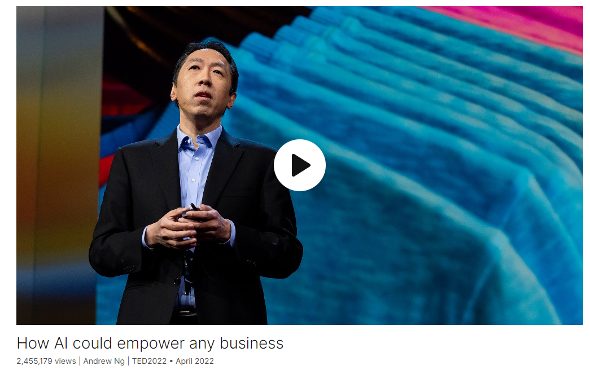

# How AI could empower any business

Link: [https://www.ted.com/talks/andrew_ng_how_ai_could_empower_any_business](https://www.ted.com/talks/andrew_ng_how_ai_could_empower_any_business)

Speaker:  Andrew Ng

Date: April 2022

@[toc]

## Introduction

## Vocabulary

## Transcript

When I think about the rise of AI,

I'm reminded by the rise of literacy.

A few hundred years ago,

many people in society thought

that maybe not everyone needed
to be able to read and write.

Back then, many people were
tending fields or herding sheep,

so maybe there was less need
for written communication.

And all that was needed

was for the high priests
and priestesses and monks

to be able to read the Holy Book,

and the rest of us could just go
to the temple or church

or the holy building

and sit and listen to the high priest
and priestesses read to us.

Fortunately, it was since figured out
that we can build a much richer society

if lots of people can read and write.

Today, AI is in the hands
of the high priests and priestesses.

These are the highly skilled AI engineers,

many of whom work
in the big tech companies.

And most people have access
only to the AI that they build for them.

I think that we can build
a much richer society

if we can enable everyone
to help to write the future.

But why is AI largely concentrated
in the big tech companies?

Because many of these AI projects
have been expensive to build.

They may require dozens
of highly skilled engineers,

and they may cost millions
or tens of millions of dollars

to build an AI system.

And the large tech companies,

particularly the ones
with hundreds of millions

or even billions of users,

have been better than anyone else
at making these investments pay off

because, for them,
a one-size-fits-all AI system,

such as one that improves web search

or that recommends better products
for online shopping,

can be applied to [these] very
large numbers of users

to generate a massive amount of revenue.

But this recipe for AI does not work

once you go outside the tech
and internet sectors to other places

where, for the most part,

there are hardly any projects
that apply to 100 million people

or that generate comparable economics.

Let me illustrate an example.

Many weekends, I drive a few minutes
from my house to a local pizza store

to buy a slice of Hawaiian pizza

from the gentleman
that owns this pizza store.

And his pizza is great,

but he always has a lot
of cold pizzas sitting around,

and every weekend some different flavor
of pizza is out of stock.

But when I watch him operate his store,

I get excited,

because by selling pizza,

he is generating data.

And this is data
that he can take advantage of

if he had access to AI.

AI systems are good at spotting patterns
when given access to the right data,

and perhaps an AI system could spot
if Mediterranean pizzas sell really well

on a Friday night,

maybe it could suggest to him
to make more of it on a Friday afternoon.

Now you might say to me,
"Hey, Andrew, this is a small pizza store.

What's the big deal?"

And I say, to the gentleman
that owns this pizza store,

something that could help him
improve his revenues

by a few thousand dollars a year,
that will be a huge deal to him.

I know that there is a lot of hype about
AI's need for massive data sets,

and having more data does help.

But contrary to the hype,

AI can often work just fine

even on modest amounts of data,

such as the data generated
by a single pizza store.

So the real problem is not

that there isn’t enough data
from the pizza store.

The real problem is
that the small pizza store

could never serve enough customers

to justify the cost of hiring an AI team.

I know that in the United States

there are about half a million
independent restaurants.

And collectively, these restaurants
do serve tens of millions of customers.

But every restaurant is different
with a different menu,

different customers,
different ways of recording sales

that no one-size-fits-all AI
would work for all of them.

What would it be like
if we could enable small businesses

and especially local businesses to use AI?

Let's take a look
at what it might look like

at a company that makes
and sells T-shirts.

I would love if an accountant working
for the T-shirt company

can use AI for demand forecasting.

Say, figure out what funny memes
to prints on T-shirts

that would drive sales,

by looking at what's trending
on social media.

Or for product placement,

why can’t a front-of-store manager
take pictures of what the store looks like

and show it to an AI

and have an AI recommend
where to place products to improve sales?

Supply chain.

Can an AI recommend to a buyer
whether or not they should pay 20 dollars

per yard for a piece of fabric now,

or if they should keep looking

because they might be able to find
it cheaper elsewhere?

Or quality control.

A quality inspector
should be able to use AI

to automatically scan pictures
of the fabric they use to make T-shirts

to check if there are any tears
or discolorations in the cloth.

Today, large tech companies routinely
use AI to solve problems like these

and to great effect.

But a typical T-shirt company
or a typical auto mechanic

or retailer or school or local farm

will be using AI for exactly zero
of these applications today.

Every T-shirt maker is sufficiently
different from every other T-shirt maker

that there is no one-size-fits-all AI
that will work for all of them.

And in fact, once you go outside
the internet and tech sectors

in other industries, even large companies

such as the pharmaceutical companies,

the car makers, the hospitals,

also struggle with this.

This is the long-tail problem of AI.

If you were to take all current
and potential AI projects

and sort them in decreasing
order of value and plot them,

you get a graph that looks like this.

Maybe the single most valuable AI system

is something that decides what ads
to show people on the internet.

Maybe the second most valuable
is a web search engine,

maybe the third most valuable is an online
shopping product recommendation system.

But when you go
to the right of this curve,

you then get projects
like T-shirt product placement

or T-shirt demand forecasting
or pizzeria demand forecasting.

And each of these is a unique project
that needs to be custom-built.

Even T-shirt demand forecasting,

if it depends on trending memes
on social media,

is a very different project
than pizzeria demand forecasting,

if that depends
on the pizzeria sales data.

So today there are millions of projects

sitting on the tail of this distribution
that no one is working on,

but whose aggregate value is massive.

So how can we enable
small businesses and individuals

to build AI systems that matter to them?

For most of the last few decades,

if you wanted to build an AI system,
this is what you have to do.

You have to write pages
and pages of code.

And while I would love
for everyone to learn to code,

and in fact, online education
and also offline education

are helping more people
than ever learn to code,

unfortunately, not everyone
has the time to do this.

But there is an emerging new way

to build AI systems
that will let more people participate.

Just as pen and paper,

which are a vastly superior technology
to stone tablet and chisel,

were instrumental to widespread literacy,

there are emerging new
AI development platforms

that shift the focus from asking you
to write lots of code

to asking you to focus on providing data.

And this turns out to be much easier
for a lot of people to do.

Today, there are multiple companies
working on platforms like these.

Let me illustrate a few of the concepts
using one that my team has been building.

Take the example of an inspector

wanting AI to help
detect defects in fabric.

An inspector can take
pictures of the fabric

and upload it to a platform like this,

and they can go in to show the AI
what tears in the fabric look like

by drawing rectangles.

And they can also go in to show the AI

what discoloration
on the fabric looks like

by drawing rectangles.

So these pictures,

together with the green
and pink rectangles

that the inspector's drawn,

are data created by the inspector

to explain to AI how to find
tears and discoloration.

After the AI examines this data,

we may find that it has seen
enough pictures of tears,

but not yet enough pictures
of discolorations.

This is akin to if a junior inspector
had learned to reliably spot tears,

but still needs to further hone
their judgment about discolorations.

So the inspector can go back
and take more pictures of discolorations

to show to the AI,

to help it deepen this understanding.

By adjusting the data you give to the AI,

you can help the AI get smarter.

So an inspector using
an accessible platform like this

can, in a few hours to a few days,

and with purchasing
a suitable camera set up,

be able to build a custom AI system
to detect defects,

tears and discolorations in all the fabric

being used to make T-shirts
throughout the factory.

And once again, you may say,

"Hey, Andrew, this is one factory.

Why is this a big deal?"

And I say to you,

this is a big deal to that inspector
whose life this makes easier

and equally, this type of technology
can empower a baker to use AI

to check for the quality
of the cakes they're making,

or an organic farmer to check
the quality of the vegetables,

or a furniture maker to check
the quality of the wood they're using.

Platforms like these will probably
still need a few more years

before they're easy enough to use
for every pizzeria owner.

But many of these platforms
are coming along,

and some of them
are getting to be quite useful

to someone that is tech savvy today,

with just a bit of training.

But what this means is that,

rather than relying
on the high priests and priestesses

to write AI systems for everyone else,

we can start to empower every accountant,

every store manager,

every buyer and every quality inspector
to build their own AI systems.

I hope that the pizzeria owner

and many other small
business owners like him

will also take advantage
of this technology

because AI is creating tremendous wealth

and will continue to create
tremendous wealth.

And it's only by
democratizing access to AI

that we can ensure that this wealth
is spread far and wide across society.

Hundreds of years ago.

I think hardly anyone
understood the impact

that widespread literacy will have.

Today, I think hardly anyone understands

the impact that democratizing
access to AI will have.

Building AI systems has been
out of reach for most people,

but that does not have to be the case.

In the coming era for AI,

we’ll empower everyone to build
AI systems for themselves,

and I think that will be
incredibly exciting future.

Thank you very much.

(Applause)

## Summary

The speaker begins by highlighting the current concentration of AI expertise in large tech companies, likening them to the "high priests and priestesses" of literacy in the past. He points out that while these companies have been successful in applying AI to projects with massive data sets, such as web search engines or online shopping recommendations, the same approach does not work for smaller businesses or industries outside of tech.

He introduces the concept of the "long-tail problem of AI," explaining that there are millions of potential AI projects that could benefit smaller businesses but are not being pursued because they are unique and require custom-built solutions. The speaker argues that enabling small businesses and individuals to use AI could unlock significant value, citing examples like demand forecasting for a local pizza store or product placement optimization for a T-shirt company.

To address this issue, the speaker proposes the use of emerging AI development platforms that focus on data rather than code. He explains how these platforms allow individuals, such as a quality inspector at a T-shirt company, to easily train AI systems to perform specific tasks, such as detecting defects in fabric. By democratizing access to AI in this way, the speaker believes that more people will be able to benefit from its capabilities, leading to a more equitable distribution of wealth and a more exciting future for AI development.

演讲者首先强调了当前人工智能专业知识在大型科技公司的集中，将它们比作过去文字普及的“高级祭司和女祭司”。他指出，虽然这些公司在将人工智能应用于拥有海量数据集的项目方面取得了成功，比如网络搜索引擎或在线购物推荐，但同样的方法并不适用于规模较小的企业或科技领域以外的行业。

他介绍了“人工智能的长尾问题”，解释说有数百万潜在的人工智能项目可以使规模较小的企业受益，但由于它们是独特的，需要定制的解决方案，因此并未被实施。演讲者认为，让小型企业和个人使用人工智能可以释放出巨大的价值，举例说明了像对本地披萨店的需求预测或对 T 恤公司产品摆放优化等情况。

为了解决这个问题，演讲者提出了使用新兴人工智能开发平台的概念，这些平台侧重于数据而不是代码。他解释了这些平台如何让个人，比如 T 恤公司的质检员，轻松地训练人工智能系统来执行特定任务，比如检测织物缺陷。通过以这种方式使人工智能的使用方式民主化，演讲者相信更多人将能够从其能力中受益，从而实现财富的更公平分配，并为人工智能开发带来更令人兴奋的未来。

## 后记