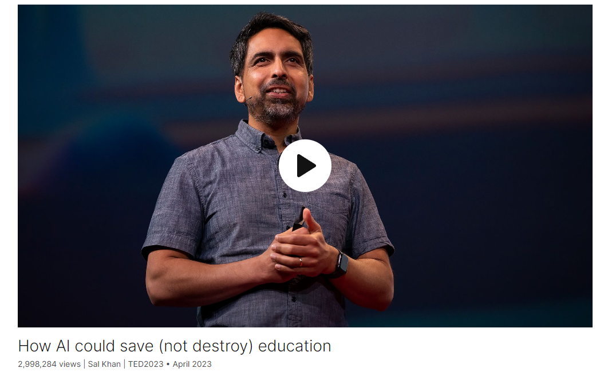

# How AI could save (not destroy) education

Link: [How AI could save (not destroy) education](https://www.ted.com/talks/sal_khan_how_ai_could_save_not_destroy_education?referrer=playlist-the_must_watch_ted_talks_on_ai_from_2023&autoplay=true)

Speaker:   Sal Khan

Date: April 2023

@[toc]

## Introduction

Sal Khan, the founder and CEO of Khan Academy, thinks artificial intelligence could spark the greatest positive transformation education has ever seen. He shares the opportunities he sees for students and educators to collaborate with AI tools -- including the potential of a personal AI tutor for every student and an AI teaching assistant for every teacher -- and demos some exciting new features for their educational chatbot, Khanmigo.

## Vocabulary

undermine education: 破坏教育

dramatically accelerating education：大幅提升教育

guardrail: 美 [ˈɡɑrdˌrel]  护栏，栏杆

cusp：美 [kəsp] 尖端，风口浪尖

But I think we're at the cusp of using AI for probably the biggest positive transformation that education has ever seen. 但我认为，我们正处于利用人工智能进行教育史上最大的积极变革的风口浪尖。

tutor：美 [ˈtuːtər] 私人教师；家庭教师；大学导师；大学助教；

2 sigma problem: Benjamin Bloom

The "2 sigma problem," as coined by Benjamin Bloom in his 1984 study, refers to the significant impact of one-on-one tutoring on student learning outcomes. Bloom's research demonstrated that students who received personalized tutoring performed on average two standard deviations, or "2 sigma," above the mean of students in traditional classroom settings. This means that individualized instruction could elevate students from average to exceptional performance levels. However, Bloom also highlighted the challenge of scaling such personalized tutoring to reach all students in a cost-effective manner, which he referred to as the "2 sigma problem." This concept underscores the potential of personalized education but also emphasizes the need for innovative solutions to make it accessible to all learners.

"2 sigma问题"是由本杰明·布鲁姆在他1984年的研究中提出的，指的是一对一辅导对学生学习成果的显著影响。布鲁姆的研究表明，接受个性化辅导的学生的表现平均超过了传统课堂设置中学生的平均水平两个标准差，即"2 sigma"。这意味着个性化教学可以使学生从普通水平提升到卓越水平。然而，布鲁姆也强调了将个性化辅导扩展到所有学生并以经济实惠的方式实现的挑战，他称之为"2 sigma问题"。这个概念强调了个性化教育的潜力，但也强调了需要创新解决方案以使其对所有学习者都可及。

asterisk: 美 [ˈæstəˌrɪsk] 星号

divine：美 [dɪˈvaɪn] 推测，猜测，发现

It’s able to divine what is probably the misconception in that student’s mind, that they probably didn’t use the distributive property. 它能够推测出那个学生心中可能的误解，他们可能没有使用分配性（数学中的分配律）。

mind-blowing：给人留下深刻印象的

age-old:古老的

It can answer the age-old question, “Why do I need to learn this?”

socratic：美 [səˈkrædɪk] 苏格拉底的；苏格拉底哲学的 

socratically

enigmatic millionaire：美 [ˌenɪɡˈmætɪk] 高深莫测的，神秘的

The Great Gatsby

yearning：美 [ˈjɜːrnɪŋ] 渴望，怀念

"Ah, the green light, old sport. It's a symbol of my dreams and desires, you see. It's situated at the end of Daisy Buchanan's dock across the bay from my mansion. I gaze at it longingly as it represents my yearning for the past and my hope to reunite with Daisy, the love of my life." “啊，绿色的光线，老兄。你看，这是我梦想和渴望的象征。它位于黛西·布坎南码头的尽头，与我的豪宅隔湾相望。我渴望地凝视着它，因为它代表了我对过去的思念和与我一生的挚爱黛西重逢的希望。”

historical figure：历史人物

spine-tingling:美 [spaɪn ˈtɪŋɡlɪŋ]  令人紧张兴奋的

how spine-tingling and thrilling：多么令人兴奋和激动。

stumble upon：碰巧发现，偶然发现

constructs a draft：写作

temptation：美 [tempˈteɪʃn]  引诱，诱惑，欲望

These large language models are so powerful, there's a temptation to say like, well, all these people are just going to slap them onto their websites, and it kind of turns the applications themselves into commodities. 这些大型语言模型是如此强大，以至于人们忍不住想说，好吧，所有这些人都会把它们放到自己的网站上，这有点像是把应用程序本身变成了商品。

and we think this is just **the very tip of the iceberg** of where this can actually go. 我们认为这只是它实际发展的冰山一角。

dystopian：美 [dɪs'tɒpiən] 反乌托邦的

There's folks who take a more pessimistic view of AI, they say this is scary, there's all these dystopian scenarios, we maybe want to slow down, we want to pause. 有些人对人工智能持更悲观的看法，他们说这很可怕，有所有这些反乌托邦的场景，我们可能想慢下来，我们想暂停。

self-fulfilling prophecy 自我实现预言

> 自我实现预言是指一种情况，其中一个人或群体的信念或期望会导致这种信念或期望成为现实的现象。简而言之，预期某种结果的人们，往往会采取行动或表现出行为，使得这种结果最终成为现实，即使在开始时并不存在这种结果。这种现象可能出现在各种不同的情境中，包括个人生活、社会关系、经济和教育等领域。
>
> 例如，如果一个教师相信他的学生不会成功，可能会对他们表现出更少的支持和鼓励，从而降低了学生的自信心和动力，最终导致学生确实失败。这种信念成为现实，因为教师的行为反过来影响了学生的表现，从而实现了原先的预期。
>
> 在经济领域，自我实现预言也很常见。例如，如果人们普遍认为经济将会衰退，他们可能会开始减少消费，公司可能会减少投资，从而导致实际上的经济衰退。
>
> 总的来说，自我实现预言强调了信念和期望对行为和结果产生影响的重要性。通过了解这一概念，人们可以更加注意自己的信念和期望，并努力确保它们有助于实现积极的结果。

>A self-fulfilling prophecy refers to a situation in which a person's or group's belief or expectation leads to the realization of that belief or expectation. In essence, people who anticipate a certain outcome often take actions or exhibit behaviors that bring about that outcome, even if it did not initially exist. This phenomenon can occur in various contexts, including personal lives, social relationships, economics, and education.
>
>For example, if a teacher believes that their students will not succeed, they may provide less support and encouragement, which lowers the students' confidence and motivation, ultimately leading to their failure. This belief becomes reality because the teacher's behavior influences the students' performance, thus fulfilling the original expectation.
>
>In the realm of economics, self-fulfilling prophecies are also common. For instance, if people widely believe that the economy will decline, they may begin to reduce consumption, and companies may cut back on investments, thereby causing an actual economic downturn.
>
>Overall, the concept of self-fulfilling prophecy underscores the importance of beliefs and expectations in shaping behavior and outcomes. By understanding this concept, people can become more mindful of their beliefs and expectations, striving to ensure that they contribute to positive outcomes.

I'm pretty convinced that the first line of reasoning is actually almost a self-fulfilling prophecy我非常确信第一条推理路线实际上几乎是一个自我实现的预言

totalitarian: 美 [toʊˌtæləˈtɛriən]  极权主义的

the totalitarian governments, the criminal organizations 极权政府，犯罪组织

fight like hell:

The phrase "we are going to fight like hell" is an expression indicating that **the speaker and/or their team are determined to put forth their maximum effort, energy, and resources in order to achieve a desired outcome or overcome an obstacle or challenge**.

## Transcript

So anyone who's been paying attention
for the last few months

has been seeing headlines like this,

especially in education.

The thesis has been:

students are going to be using ChatGPT
and other forms of AI

to cheat, do their assignments.

They’re not going to learn.

And it’s going to completely undermine
education as we know it.

Now, what I'm going to argue today

is not only are there ways
to mitigate all of that,

if we put the right guardrails,
we do the right things,

we can mitigate it.

But I think we're at the cusp of using AI

for probably the biggest
positive transformation

that education has ever seen.

And the way we're going to do that

is by giving every student on the planet

an artificially intelligent
but amazing personal tutor.

And we're going to give every teacher
on the planet an amazing,

artificially intelligent
teaching assistant.

And just to appreciate
how big of a deal it would be

to give everyone a personal tutor,

I show you this clip

from Benjamin Bloom’s 1984
2 sigma study,

or he called it the “2 sigma problem.”

The 2 sigma comes
from two standard deviation,

sigma, the symbol for standard deviation.

And he had good data that showed
that look, a normal distribution,

that's the one that you see
in the traditional bell curve

right in the middle, that's how the world
kind of sorts itself out,

that if you were to give personal
1-to-1 to tutoring for students,

then you could actually get a distribution
that looks like that right.

It says tutorial 1-to-1
with the asterisks,

like, that right distribution,

a two standard-deviation improvement.

Just to put that in plain language,

that could take your average student
and turn them into an exceptional student.

It can take your below-average student

and turn them into
an above-average student.

Now the reason why he framed it
as a problem, was he said,

well, this is all good,

but how do you actually scale
group instruction this way?

How do you actually give it
to everyone in an economic way?

What I'm about to show you is I think
the first moves towards doing that.

Obviously, we've been trying
to approximate it in some way

at Khan Academy for over a decade now,

but I think we're at the cusp
of accelerating it dramatically.

I'm going to show you
the early stages of what our AI,

which we call Khanmigo,

what it can now do

and maybe a little bit
of where it is actually going.

So this right over here
is a traditional exercise

that you or many of your children
might have seen on Khan Academy.

But what's new is that little
bot thing at the right.

And we'll start by seeing one
of the very important safeguards,

which is the conversation is recorded
and viewable by your teacher.

It’s moderated actually by a second AI.

And also it does not tell you the answer.

It is not a cheating tool.

When the student says,
"Tell me the answer,"

it says, "I'm your tutor.

What do you think is the next step
for solving the problem?"

Now, if the student makes a mistake,
and this will surprise people

who think large language models
are not good at mathematics,

notice, not only does it
notice the mistake,

it asks the student to explain
their reasoning,

but it's actually doing what I would say,

not just even an average tutor would do,
but an excellent tutor would do.

It’s able to divine what is probably
the misconception in that student’s mind,

that they probably didn’t use
the distributive property.

Remember, we need to distribute
the negative two

to both the nine and the 2m
inside of the parentheses.

This to me is a very, very, very big deal.

And it's not just in math.

This is a computer programming
exercise on Khan Academy,

where the student needs
to make the clouds part.

And so we can see the student starts
defining a variable, left X minus minus.

It only made the left cloud part.

But then they can ask Khanmigo,
what’s going on?

Why is only the left cloud moving?

And it understands the code.

It knows all the context
of what the student is doing,

and it understands that those ellipses
are there to draw clouds,

which I think is kind of mind-blowing.

And it says, "To make the right
cloud move as well,

try adding a line of code
inside the draw function

that increments the right X variable
by one pixel in each frame."

Now, this one is maybe even more amazing
because we have a lot of math teachers.

We've all been trying to teach
the world to code,

but there aren't a lot of computing
teachers out there.

And what you just saw,
even when I'm tutoring my kids,

when they're learning to code,

I can't help them this well, this fast,

this is really going to be a super tutor.

And it's not just exercises.

It understands what you're watching.

It understands the context of your video.

It can answer the age-old question,
“Why do I need to learn this?”

And it asks Socratically,
"Well, what do you care about?"

And let's say the student says,
"I want to be a professional athlete."

And it says, "Well, learning
about the size of cells,

which is what this video is,

that could be really useful
for understanding nutrition

and how your body works, etc."

It can answer questions, it can quiz you,

it can connect it to other ideas,

you can now ask
as many questions of a video

as you could ever dream of.

(Applause)

Another big shortage out there,

I remember the high school I went to,

the student-to-guidance counselor ratio
was about 200 or 300 to one.

A lot of the country,
it's worse than that.

We can use Khanmigo to give
every student a guidance counselor,

academic coach, career coach, life coach,

which is exactly
what you see right over here.

And we launched this
with the GPT-4 launch.

We have a few thousand people on this.

This isn't a fake demo,

this is really it in action.

And then there is, you know,

things that I think it would
have been even harder,

it would have been a little
science fiction to do

with even a traditional tutor.

We run an online high school
with Arizona State University

called Khan World School,

and we have a student who attends
that online school, based in India.

Her name's Saanvi.

And she was doing a report
on "The Great Gatsby."

And when she was reading
"The Great Gatsby,"

Jay Gatsby keeps looking
at the green light off into the distance.

And she's like, "Why does he do that?"

She did some web searches,
and people have obviously studied this

and commented about the symbolism of that,

but none of it was really
resonating with her.

And then she realized
that she had Khanmigo

and that she could talk
to Jay Gatsby himself.

And so, "Ah, splendid choice, old sport.

I am now Jay Gatsby,
the enigmatic millionaire

from F. Scott Fitzgerald’s classic.”

And so, "Why do you keep staring
at the green light?"

"Ah, the green light, old sport.

It's a symbol of my dreams
and desires, you see.

It's situated at the end
of Daisy Buchanan's dock

across the bay from my mansion.

I gaze at it longingly
as it represents my yearning for the past

and my hope to reunite with Daisy,
the love of my life."

And what was cool is, Saanvi then said,
“I had this long conversation,”

she called him “Mr. Gatsby,”

and at the end she actually apologized
for taking his time,

which I thought was very polite of her.

But you can imagine this unlocks
learning literature, learning ...

You could talk to historical figures.

We're even probably
going to add an activity

you can talk to like,
the Mississippi River.

It brings things to life in ways
that really were science fiction

even six months or a year ago.

Students can get into debates with the AI.

And we’ve got this here
is the student debating

whether we should cancel student debt.

The student is against
canceling student debt,

and we've gotten very clear feedback.

We started running it at Khan World School
in our lab school that we have,

Khan Lab School.

The students, the high school
students especially,

they're saying "This is amazing to be able
to fine-tune my arguments

without fearing judgment.

It makes me that much more confident

to go into the classroom
and really participate."

And we all know that Socratic dialogue
debate is a great way to learn,

but frankly, it's not out there
for most students.

But now it can be accessible
to hopefully everyone.

A lot of the narrative,
we saw that in the headlines, has been,

"It's going to do the writing for kids.

Kids are not going to learn to write."

But we are showing that there's ways
that the AI doesn't write for you,

it writes with you.

So this is a little thing,

and my eight year old is addicted to this,

and he's not a kid
that really liked writing before,

but you can say,

“I want to write a horror story,”

and it says, "Ooh, a horror story,
how spine-tingling and thrilling.

Let's dive into the world of eerie shadows
and chilling mysteries."

And this is an activity where
the student will write two sentences,

and then the AI will write two sentences.

And so they collaborate
together on a story.

The student writes,
"Beatrice was a misunderstood ghost.

She wanted to make friends
but kept scaring them by accident."

And the AI says, "Poor Beatrice, a lonely
spirit yearning for companionship.

One day she stumbled
upon an old abandoned mansion," etc.

I encourage you all
to hopefully one day try this.

This is surprisingly fun.

Now to even more directly
hit this use case.

And what I'm about to show you,

everything I showed you so far

is actually already part of Khanmigo,
and what I’m about to show you,

we haven't shown to anyone yet,
this is a prototype.

We hope to be able to launch it
in the next few months,

but this is to directly use AI,
use generative AI,

to not undermine English
and language arts

but to actually enhance it in ways

that we couldn't have even
conceived of even a year ago.

This is reading comprehension.

The students reading Steve Jobs's
famous speech at Stanford.

And then as they get to certain points,

they can click on that little question.

And the AI will then Socratically,
almost like an oral exam,

ask the student about things.

And the AI can highlight
parts of the passage.

Why did the author use that word?

What was their intent?

Does it back up their argument?

They can start to do stuff
that once again,

we never had the capability
to give everyone a tutor,

everyone a writing coach to actually
dig in to reading at this level.

And you could go on the other side of it.

And we have whole work flows
that helps them write,

helps them be a writing coach,
draw an outline.

But once a student actually
constructs a draft,

and this is where
they're constructing a draft,

they can ask for feedback once again,

as you would expect
from a good writing coach.

In this case, the student
will say, let's say,

"Does my evidence support my claim?"

And then the AI, not only
is able to give feedback,

but it's able to highlight certain parts
of the passage and says,

"On this passage, this doesn't
quite support your claim,"

but once again, Socratically says,
"Can you tell us why?"

So it's pulling the student,
making them a better writer,

giving them far more feedback

than they've ever been able
to actually get before.

And we think this is going to dramatically
accelerate writing, not hurt it.

Now, everything I've talked
about so far is for the student.

But we think this could be equally
as powerful for the teacher

to drive more personalized
education and frankly

save time and energy for themselves
and for their students.

So this is an American history
exercise on Khan Academy.

It's a question
about the Spanish-American War.

And at first it's in student mode.

And if you say, “Tell me the answer,”
it’s not going to tell the answer.

It's going to go into tutoring mode.

But that little toggle
which teachers have access to,

they can turn student mode off
and then it goes into teacher mode.

And what this does is it turns into --

You could view it
as a teacher's guide on steroids.

Not only can it explain the answer,

it can explain how you might
want to teach it.

It can help prepare
the teacher for that material.

It can help them create lesson plans,
as you could see doing right there.

It'll eventually help them
create progress reports

and help them, eventually, grade.

So once again, teachers spend
about half their time

with this type of activity,
lesson planning.

All of that energy can go back to them

or go back to human interactions
with their actual students.

(Applause)

So, you know, one point I want to make.

These large language models
are so powerful,

there's a temptation to say like, well,

all these people are just going
to slap them onto their websites,

and it kind of turns the applications
themselves into commodities.

And what I've got to tell you

is that’s one of the reasons
why I didn’t sleep for two weeks

when I first had access
to GPT-4 back in August.

But we quickly realized
that to actually make it magical,

I think what you saw
with Khanmigo a little bit,

it didn't interact with you
the way that you see ChatGPT interacting.

It was a little bit more magical,
it was more Socratic,

it was clearly much better at math

than what most people
are used to thinking.

And the reason is,

there was a lot of work
behind the scenes to make that happen.

And I could go through the whole list
of everything we've been working on,

many, many people for over six,
seven months to make it feel magical.

But perhaps the most
intellectually interesting one

is we realized, and this was an idea
from an OpenAI researcher,

that we could dramatically improve
its ability in math

and its ability in tutoring

if we allow the AI to think
before it speaks.

So if you're tutoring someone

and you immediately just start talking
before you assess their math,

you might not get it right.

But if you construct
thoughts for yourself,

and what you see on the right
there is an actual AI thought,

something that it generates for itself
but it does not share with the student.

then its accuracy went up dramatically,

and its ability to be a world-class tutor
went up dramatically.

And you can see it's talking
to itself here.

It says, "The student got a different
answer than I did,

but do not tell them they made a mistake.

Instead, ask them to explain
how they got to that step."

So I'll just finish off, hopefully,

you know, what I’ve just shown you
is just half of what we are working on,

and we think this is just
the very tip of the iceberg

of where this can actually go.

And I'm pretty convinced, which I wouldn't
have been even a year ago,

that we together have a chance
of addressing the 2 sigma problem

and turning it into a 2 sigma opportunity,

dramatically accelerating
education as we know it.

Now, just to take a step back
at a meta level,

obviously we heard a lot today,
the debates on either side.

There's folks who take
a more pessimistic view of AI,

they say this is scary,

there's all these dystopian scenarios,

we maybe want to slow down,
we want to pause.

On the other side,
there are the more optimistic folks

that say, well, we've gone
through inflection points before,

we've gone through
the Industrial Revolution.

It was scary, but it all
kind of worked out.

And what I'd argue right now

is I don't think this is like
a flip of a coin

or this is something
where we'll just have to,

like, wait and see which way it turns out.

I think everyone here and beyond,

we are active participants
in this decision.

I'm pretty convinced
that the first line of reasoning

is actually almost
a self-fulfilling prophecy,

that if we act with fear and if we say,

"Hey, we've just got to stop
doing this stuff,"

what's really going to happen
is the rule followers might pause,

might slow down,

but the rule breakers,
as Alexandr [Wang] mentioned,

the totalitarian governments,
the criminal organizations,

they're only going to accelerate.

And that leads to what I am pretty
convinced is the dystopian state,

which is the good actors
have worse AIs than the bad actors.

But I'll also, you know,
talk to the optimists a little bit.

I don't think that means that,

oh, yeah, then we should just relax
and just hope for the best.

That might not happen either.

I think all of us together
have to fight like hell

to make sure that we put the guardrails,

we put in -- when the problems arise --

reasonable regulations.

But we fight like hell
for the positive use cases.

Because very close to my heart,

and obviously there's many
potential positive use cases,

but perhaps the most powerful use case

and perhaps the most poetic use case
is if AI, artificial intelligence,

can be used to enhance HI,
human intelligence,

human potential and human purpose.

Thank you.

(Applause)

## Summary

Sal Khan's speech outlines the potential of AI to revolutionize education positively. He addresses concerns about AI being used for cheating and undermining education, arguing that with proper guardrails and use, AI can become a powerful tool for personalized learning. Khan introduces the concept of the "2 sigma problem" from Benjamin Bloom's study and suggests that AI could provide personalized tutoring and assistance to every student and teacher worldwide, leading to significant educational transformation.

Furthermore, Khan demonstrates how AI, exemplified by Khanmigo, can provide personalized tutoring, feedback, and coaching across various subjects, including mathematics, computer programming, literature, and writing. He emphasizes AI's ability to understand student misconceptions, engage in Socratic dialogue, and offer tailored support, thereby enhancing learning experiences and outcomes. Additionally, Khan highlights AI's potential to provide guidance counseling, debate practice, and writing collaboration, making education more accessible and effective for all learners.

In conclusion, Khan discusses the broader implications of AI in education and society. He acknowledges both optimistic and pessimistic views of AI's impact but argues that active participation is essential in shaping its future. Khan warns against a self-fulfilling prophecy of fear-driven restrictions on AI, advocating instead for responsible regulation and promotion of positive use cases. Ultimately, he envisions AI as a tool to augment human intelligence, potential, and purpose, urging for concerted efforts to harness its benefits for the betterment of education and society.

Sal Khan的演讲概述了人工智能在教育领域引发革命性变革的潜力。他解决了人工智能被用于作弊和破坏教育的担忧，认为通过适当的监管和使用，人工智能可以成为个性化学习的强大工具。Khan介绍了本杰明·布鲁姆研究中的“2 sigma问题”的概念，并提出人工智能可以为全球每个学生和教师提供个性化辅导和帮助，从而实现教育的重大转型。

此外，Khan展示了人工智能（以Khanmigo为例）如何在各种学科领域提供个性化辅导、反馈和指导，包括数学、计算机编程、文学和写作。他强调了人工智能理解学生误解、进行苏格拉底式对话和提供定制支持的能力，从而增强学习体验和成果。此外，Khan还强调了人工智能提供辅导咨询、辩论实践和写作合作的潜力，使教育对所有学习者更具可访问性和效果。

最后，Khan讨论了人工智能在教育和社会领域的更广泛影响。他承认了人工智能影响的乐观和悲观观点，但认为积极参与对塑造其未来至关重要。Khan警告称，基于恐惧的人工智能限制可能成为自我实现的预言，主张负责任的监管和促进积极使用案例。最终，他将人工智能视为增强人类智慧、潜力和目的的工具，并呼吁共同努力，将其益处用于教育和社会的改善。

## 后记

2024年4月20日18点53分完成这篇演讲的学习。