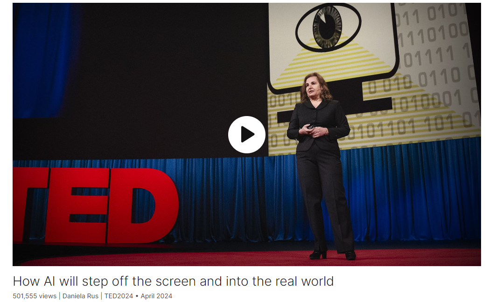

# How AI will step off the screen and into the real world

Link: [https://www.ted.com/talks/daniela_rus_how_ai_will_step_off_the_screen_and_into_the_real_world](https://www.ted.com/talks/daniela_rus_how_ai_will_step_off_the_screen_and_into_the_real_world)

Speaker:  Daniela Rus 

>**Daniela L. Rus** is a roboticist and computer scientist, Director of the [MIT Computer Science and Artificial Intelligence Laboratory (CSAIL)](https://en.wikipedia.org/wiki/MIT_Computer_Science_and_Artificial_Intelligence_Laboratory_(CSAIL)), and the Andrew and Erna Viterbi Professor in the Department of Electrical Engineering and Computer Science (EECS) at the [Massachusetts Institute of Technology](https://en.wikipedia.org/wiki/Massachusetts_Institute_of_Technology). She is the author of the books *Computing the Future* and *The Heart and the Chip*.
>
>Source: https://en.wikipedia.org/wiki/Daniela_L._Rus

Daniela 发音：美 [dænˈjelə] 

Date: April 2024

@[toc]

## Introduction

The convergence of AI and robotics will unlock a wonderful new world of possibilities in everyday life, says robotics and AI pioneer Daniela Rus. Diving into the way machines think, she reveals how "liquid networks" — a revolutionary class of AI that mimics the neural processes of simple organisms — could help intelligent machines process information more efficiently and give rise to "physical intelligence" that will enable AI to operate beyond digital confines and engage dynamically in the real world.

## Vocabulary

pulled an all-nighter：熬夜通宵；开夜车

We pulled an all-nighter writing the software

synapse：美 [ˈsɪnˌæps] 突触

artificial synapse：人工突触

cuddly：美 [ˈkʌdli]  令人想搂抱的；逗人怜爱的

cuddly robotic bunny 可爱的机器人兔子

bespoke：美 [bəˈspoʊk] 定做的

bespoke machines

## Summary

Summary:

In her speech, the female scientist highlights the transformative potential of physical intelligence, which combines AI with robotics to enable machines to interact with the physical world. She begins by recounting an anecdote from her student days, where a failed attempt to program a robot to cut a cake taught her about the challenges of bridging the gap between the digital and physical realms. She emphasizes the need for AI to move beyond traditional 2D interactions and enter the vibrant 3D world, which her lab is actively working on.

Next, she introduces the concept of liquid networks, a new approach to AI inspired by the simple neural structure of C. elegans. Liquid networks allow for more compact and explainable AI solutions compared to traditional methods, enabling machines to adapt and learn continuously even after training. By using differential equations to model neural computation, these networks offer promising results in tasks such as self-driving cars, where traditional AI solutions fall short.

Finally, the scientist discusses the practical applications of physical intelligence, such as text-to-robot and image-to-robot transformations. These advancements allow for faster prototyping and testing of new products, leading to a more rapid innovation cycle. She also introduces the idea of human-to-robot learning, where robots can be trained to perform tasks by observing humans. By combining these approaches, physical intelligence offers unprecedented opportunities for benefitting humanity and the planet, while also highlighting the importance of responsible development and stewardship of this technology.

## Transcript

When I was a student studying robotics,

a group of us decided to make a present
for our professor's birthday.

We wanted to program our robot
to cut a slice of cake for him.

We pulled an all-nighter
writing the software,

and the next day, disaster.

We programmed this robot to cut
a soft, round sponge cake,

but we didn't coordinate well.

And instead, we received a square
hard ice cream cake.

The robot flailed wildly
and nearly destroyed the cake.

(Laughter)

Our professor was delighted, anyway.

He calmly pushed the stop button

and declared the erratic
behavior of the robot

a control singularity.

A robotics technical term.

I was disappointed, but I learned
a very important lesson.

The physical world,

with its physics laws and imprecisions,

is a far more demanding space
than the digital world.

Today, I lead MIT's
Computer Science and AI lab,

the largest research unit at MIT.

This is our buildingm where I work
with brilliant and brave researchers

to invent the future of computing
and intelligent machines.

Today in computing,

artificial intelligence and robotics
are largely separate fields.

AI has amazed you with its
decision-making and learning,

but it remains confined inside computers.

Robots have a physical presence
and can execute pre-programmed tasks,

but they're not intelligent.

Well, this separation
is starting to change.

AI is about to break free from the 2D
computer screen interactions

and enter a vibrant, physical 3D world.

In my lab, we're fusing
the digital intelligence of AI

with the mechanical prowess of robots.

Moving AI from the digital world
into the physical world

is making machines intelligent

and leading to the next
great breakthrough,

what I call physical intelligence.

Physical intelligence is when AI's
power to understand text,

images and other online information

is used to make
real-world machines smarter.

This means AI can help pre-programmed
robots do their tasks better

by using knowledge from data.

With physical intelligence,

AI doesn't just reside in our computers,

but walks, rolls, flies

and interacts with us in surprising ways.

Imagine being surrounded by helpful
robots at the supermarket.

The one on the left
can help you carry a heavy box.

To make it happen,
we need to do a few things.

We need to rethink how machines think.

We need to reorganize how
they are designed and how they learn.

So for physical intelligence,

AI has to run on computers
that fit on the body of the robot.

For example, our soft robot fish.

Today's AI uses server farms
that do not fit.

Today's AI also makes mistakes.

This AI system on a robot car
does not detect pedestrians.

For physical intelligence,

we need small brains
that do not make mistakes.

We're tackling these challenges
using inspiration

from a worm called C. elegans

In sharp contrast to the billions
of neurons in the human brain,

C. elegans has a happy life
on only 302 neurons,

and biologists understand the math
of what each of these neurons do.

So here's the idea.

Can we build AI using inspiration
from the math of these neurons?

We have developed, together
with my collaborators and students,

a new approach to AI
we call “liquid networks.”

And liquid networks results
in much more compact

and explainable solutions
than today's traditional AI solutions.

Let me show you.

This is our self-driving car.

It's trained using
a traditional AI solution,

the kind you find in many
applications today.

This is the dashboard of the car.

In the lower right corner,
you'll see the map.

In the upper left corner,
the camera input stream.

And the big box in the middle
with the blinking lights

is the decision-making engine.

It consists of tens of thousands
of artificial neurons,

and it decides how the car should steer.

It is impossible to correlate
the activity of these neurons

with the behavior of the car.

Moreover, if you look
at the lower left side,

you see where in the image
this decision-making engine looks

to tell the car what to do.

And you see how noisy it is.

And this car drives by looking
at the bushes and the trees

on the side of the road.

That's not how we drive.

People look at the road.

Now contrast this with our
liquid network solution,

which consists of only 19 neurons
rather than tens of thousands.

And look at its attention map.

It's so clean and focused
on the road horizon

and the side of the road.

Because these models are so much smaller,

we actually understand
how they make decisions.

So how did we get this performance?

Well, in a traditional AI system,

the computational neuron
is the artificial neuron,

and the artificial neuron is essentially
an on/off computational unit.

It takes in some numbers, adds them up,

applies some basic math

and passes along the result.

And this is complex

because it happens across
thousands of computational units.

In liquid networks,

we have fewer neurons,

but each one does more complex math.

Here's what happens
inside our liquid neuron.

We use differential equations
to model the neural computation

and the artificial synapse.

And these differential equations

are what biologists have mapped
for the neural structure of the worms.

We also wire the neurons differently
to increase the information flow.

Well, these changes yield
phenomenal results.

Traditional AI systems
are frozen after training.

That means they cannot continue to improve

when we deploy them
in a physical world in the wild.

We just wait for the next release.

Because of what's happening
inside the liquid neuron,

liquid networks continue
to adapt after training

based on the inputs that they see.

Let me show you.

We trained traditional AI
and liquid networks

using summertime videos like these ones,

and the task was to find
things in the woods.

All the models learned
how to do the task in the summer.

Then we tried to use the models
on drones in the fall.

The traditional AI solution gets
confused by the background.

Look at the attention map,
cannot do the task.

Liquid networks do not get confused
by the background

and very successfully execute the task.

So this is it.

This is the step forward:

AI that adapts after training.

Liquid networks are important

because they give us a new way
of getting machines to think

that is rooted into physics models,

a new technology for AI.

We can run them
on smartphones, on robots,

on enterprise computers,

and even on new types of machines

that we can now begin
to imagine and design.

The second aspect
of physical intelligence.

So by now you've probably generated images
using text-to-image systems.

We can also do text-to-robot,

but not using today's AI solutions
because they work on statistics

and do not understand physics.

In my lab,

we developed an approach
that guides the design process

by checking and simulating
the physical constraints for the machine.

We start with a language prompt,

"Make me a robot that can walk forward,"

and our system generates the designs
including shape, materials, actuators,

sensors, the program to control it

and the fabrication files to make it.

And then the designs
get refined in simulation

until they meet the specifications.

So in a few hours we can go from idea

to controllable physical machine.

We can also do image-to-robot.

This photo can be transformed
into a cuddly robotic bunny.

To do so, our algorithm computes
a 3D representation of the photo

that gets sliced and folded, printed.

Then we fold the printed layers,
we string some motors and sensors.

We write some code, and we get
the bunny you see in this video.

We can use this approach
to make anything almost,

from an image, from a photo.

So the ability to transform
text into images

and to transform images
into robots is important,

because we are drastically
reducing the amount of time

and the resources needed to prototype
and test new products,

and this is allowing for a much
faster innovation cycle.

And now we are ready
to even make the leap

to get these machines to learn.

The third aspect of physical intelligence.

These machines can learn
from humans how to do tasks.

You can think of it as human-to-robot.

In my lab, we created
a kitchen environment

where we instrument people with sensors,

and we collect a lot of data
about how people do kitchen tasks.

We need physical data

because videos do not capture
the dynamics of the task.

So we collect muscle, pose,
even gaze information

about how people do tasks.

And then we train AI using this data

to teach robots how to do the same tasks.

And the end result is machines
that move with grace and agility,

as well as adapt and learn.

Physical intelligence.

We can use this approach to teach robots

how to do a wide range of tasks:

food preparation, cleaning
and so much more.

The ability to turn images and text
into functional machines,

coupled with using liquid networks

to create powerful brains
for these machines

that can learn from humans,
is incredibly exciting.

Because this means we can make
almost anything we imagine.

Today's AI has a ceiling.

It requires server farms.

It's not sustainable.

It makes inexplicable mistakes.

Let's not settle for the current offering.

When AI moves into the physical world,

the opportunities for benefits
and for breakthroughs is extraordinary.

You can get personal assistants
that optimize your routines

and anticipate your needs,

bespoke machines that help you at work

and robots that delight you
in your spare time.

The promise of physical intelligence
is to transcend our human limitations

with capabilities that extend our reach,

amplify our strengths

and refine our precision

and grant us ways
to interact with the world

we've only dreamed of.

We are the only species
so advanced, so aware,

so capable of building
these extraordinary tools.

Yet, developing physical intelligence

is teaching us that we have
so much more to learn

about technology and about ourselves.

We need human guiding hands over AI
sooner rather than later.

After all, we remain
responsible for this planet

and everything living on it.

I remain convinced that we have the power

to use physical intelligence to ensure
a better future for humanity

and for the planet.

And I'd like to invite you
to help us in this quest.

Some of you will help develop
physical intelligence.

Some of you will use it.

And some of you will invent the future.

Thank you.

(Applause)

## Afterword

2024年4月27日19点45分于上海。