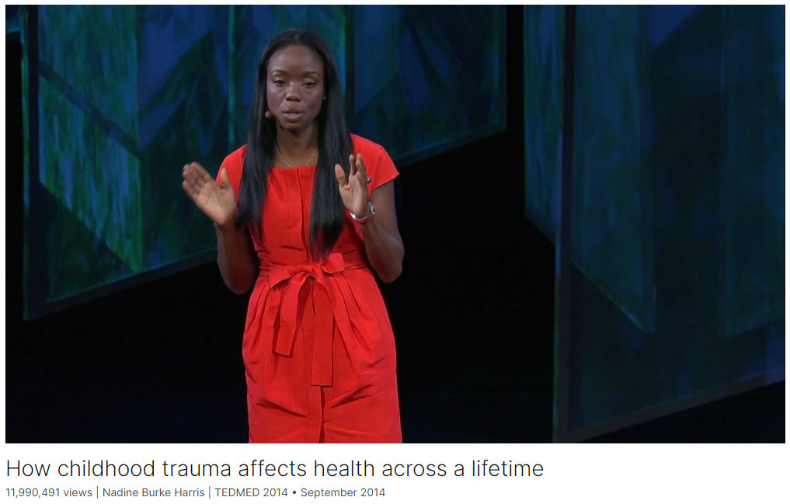

# How childhood trauma affects health across a lifetime

Link: [https://www.ted.com/talks/nadine_burke_harris_how_childhood_trauma_affects_health_across_a_lifetime?vwo=featured](https://www.ted.com/talks/nadine_burke_harris_how_childhood_trauma_affects_health_across_a_lifetime?vwo=featured)

Speaker: Nadine Burke Harris   

Date: September 2014

@[toc]

## Introduction

Childhood trauma isn’t something you just get over as you grow up. Pediatrician Nadine Burke Harris explains that the repeated stress of abuse, neglect and parents struggling with mental health or substance abuse issues has real, tangible effects on the development of the brain. This unfolds across a lifetime, to the point where those who’ve experienced high levels of trauma are at triple the risk for heart disease and lung cancer. An impassioned plea for pediatric medicine to confront the prevention and treatment of trauma, head-on.

童年创伤并不是长大后就能克服的。儿科医生纳丁-伯克-哈里斯（Nadine Burke Harris）解释说，反复遭受虐待、忽视以及父母与精神健康或药物滥用问题作斗争所带来的压力，会对大脑的发育产生真正、切实的影响。这种影响会贯穿人的一生，经历过严重创伤的人患心脏病和肺癌的风险是常人的三倍。热烈呼吁儿科医学界正视创伤的预防和治疗。

## Vocabulary

trauma: 美 [ˈtraʊmə] 痛苦；创伤；损伤

Pediatrician:美 [ˌpiːdiəˈtrɪʃn] 儿科医师

pediatirc：美 [ˌpiːdiˈætrɪk] 小儿科的

substance abuse: 药物滥用

impassioned：美 [ɪmˈpæʃnd] 充满热情的；满怀感情的；热烈的；激动的

impassioned plea：热切恳求；强烈恳求；强烈请求          

confront：面临，直面

prevention and treatment: 防治；预防与治疗；预防以及治疗          

head-on:正面的；迎面的；迎头相撞的；

hormonal: 美 [hɔːrˈmoʊnl]  激素的

In high doses, it affects brain development, the immune system, hormonal systems, and even the way our DNA is read and transcribed. 在高剂量下，它会影响大脑发育、免疫系统、激素系统，甚至我们的DNA被读取和转录的方式。

screen: 筛查

And yet, doctors today are not trained in routine screening or treatment. 然而，今天的医生没有接受过常规筛查或治疗的培训。

 severe or pervasive：严重或者普遍的

physiology：美 [ˌfɪziˈɑːlədʒi] 生理学；生理功能；生物机能；

residency：美 [ˈrezɪdənsi] 居住权；定居；住宅；住院医师实习期；

When I finished my residency,当我结束实习

opened a clinic：开了一家诊所

underserved：美 [ʌndə'sɜvd] 服务不周到的；服务水平低下的

one of the poorest, most underserved neighborhoods in San Francisco. 旧金山最贫穷、服务最差的社区之一。

shingle：美 [ˈʃɪŋɡəl]  小招牌

hung a shingle: 挂了一个招牌

so we hung a shingle, and we were able to provide top-quality care regardless of ability to pay. 所以我们挂了一个招牌，不管支付能力如何，我们都能够提供高质量的医疗服务。

immunization：美 [ˌɪmjunəˈzeɪʃn] 免疫

asthma：美 [ˈæzmə] 哮喘症；气喘 **注意发音**

We targeted the typical health disparities: access to care, immunization rates, asthma hospitalization rates, and we hit all of our numbers. 我们瞄准了典型的健康不平等:获得护理，免疫接种率，哮喘住院率，我们达到了所有的数字。

diarrhea：美 [ˌdaɪəˈriə] 腹泻；拉肚子；急性肠胃炎 **注意发音**

 98 of them develop diarrhea：其中98人出现腹泻

I began reading everything that I could get my hands on about how exposure to adversity affects the developing brains and bodies of children. 我开始阅读我能找到的所有关于逆境如何影响儿童大脑和身体发育的资料。

>在这句话中，"exposure" 指的是接触或暴露。在上下文中，"exposure to adversity" 意味着孩子们经历或接触到逆境（例如虐待、忽视或家庭问题）对他们的大脑和身体发育产生的影响。因此，"exposure" 在这里表示孩子们经历逆境的情况。

adversity: 美 [ədˈvɜːrsəti] 困难；不幸

incarceration:美 [ɪnˌkɑsə'reɪʃn] 监禁；下狱；禁闭

domestic violence: 家庭暴力

obstructive：美 [əbˈstrəktɪv] 梗阻的；阻塞的

pulmonary：美 [ˈpʌlməneri] 肺部的；肺相关的

chronic：慢性的，长期的

their relative risk of chronic obstructive pulmonary disease was two and a half times：他们患慢性阻塞性肺病的相对风险是正常人的两倍半

hepatitis：美 [ˌhepəˈtaɪtɪs] 肝炎

ischemic：美 [ɪs'kimɪk] 缺血性的；

ischemic heart disease：缺血性心脏病

have a rough childhood：有一个艰难的童年

nucleus accumbens：伏核；伏神经核；阿肯伯氏核

implicated：美 ['ɪmplɪkeɪtɪd] 有牵连的；

It affects areas like the nucleus accumbens, the pleasure and reward center of the brain that is implicated in substance dependence. It inhibits the prefrontal cortex, which is necessary for impulse control and executive function, a critical area for learning.

它影响伏隔核等区域，伏隔核是大脑中与物质依赖有关的快乐和奖励中心。它抑制了前额叶皮层，这是冲动控制和执行功能所必需的，是学习的关键区域。

amygdala：美 [ˌæmɪgˈdɑːlə] 杏仁核

hypothalamic：美 [haɪpoʊθə'læmɪk] 下丘脑的

hypothalamus ：下丘脑

pituitary：美 [pəˈt(j)uəˌtɛri]  垂体

adrenal：美 [əˈdrinl] 肾上腺 adrenal gland 肾上腺

adrenaline:美 [əˈdrenəlɪn] 肾上腺素

cortisol：英 [ˈkɔːtɪsɒl]  皮质醇

hormones：英 [ˈhɔːməʊnz] 荷尔蒙；荷尔蒙制剂；性激素；激素；（hormone的复数）

hypothalamic–pituitary–adrenal axis 下丘脑-垂体-肾上腺轴

stress response：应激反应；应力反应；压力反应；

fight or flight：战斗或逃跑

pupils：美 [ˈpjupəlz] 瞳孔；学生；小学生；（pupil的复数）

dilate：美 [daɪˈleɪt] 膨胀；扩大；

airways：呼吸道

The reason for this has to do with the hypothalamic–pituitary–adrenal axis, the brain's and body's stress response system that governs our fight-or-flight response. How does it work? Well, imagine you're walking in the forest and you see a bear. Immediately, your hypothalamus sends a signal to your pituitary, which sends a signal to your adrenal gland that says, "Release stress hormones! Adrenaline! Cortisol!" And so your heart starts to pound, Your pupils dilate, your airways open up, and you are ready to either fight that bear or run from the bear. And that is wonderful if you're in a forest and there's a bear.

其原因与下丘脑-垂体-肾上腺轴有关，这是大脑和身体的压力反应系统，控制着我们的战斗或逃跑反应。它是如何工作的？想象一下，你在森林里行走，看到一只熊。立刻，你的下丘脑向你的脑垂体发出信号，脑垂体向你的肾上腺发出信号说:“释放压力荷尔蒙！肾上腺素！皮质醇！”因此，你的心脏开始跳动，你的瞳孔扩大，你的呼吸道打开，你准备好要么与熊搏斗，要么逃离熊。如果你在森林里，有一只熊，那就太棒了。

take her own life：结束自己的生命

holistic：美 [hoʊˈlɪstɪk] 整体的；全面的；全局的；

holistic interventions整体干预

toxic stress：有毒的压力

electrical outlet:通电的插座

tailor：定做

asthmatics：美 [æs'mætɪks] 气喘患者；（asthmatic的复数）

diabetics：美 [ˌdaɪəˈbetɪks] 糖尿病患者；（diabetic的复数）

But we also educate parents about the impacts of ACEs and toxic stress the same way you would for covering electrical outlets, or lead poisoning, and we tailor the care of our asthmatics and our diabetics in a way that recognizes that they may need more aggressive treatment, given the changes to their hormonal and immune systems.

我们也教育父母ACEs和毒性压力的影响，就像你对电源插座或铅中毒的影响一样，我们为哮喘和糖尿病患者量身定制护理，认识到他们可能需要更积极的治疗，因为他们的激素和免疫系统发生了变化。

>在这句话中，"electrical outlet" 指的是电插座。上下文中提到的 "covering electrical outlets" 是一种比喻，用来说明他们如何教育父母关于逆境儿童经历（Adverse Childhood Experiences, ACEs）和有毒压力（toxic stress）的影响，就像教育父母如何遮盖电插座以防止孩子触电，或者预防铅中毒一样。也就是说，他们向父母传授如何保护孩子免受这些危害的方法。

scope and scale: 范围和规模

The scope and scale of the problem seems so large that it feels overwhelming to think about how we might approach it. 这个问题的范围和规模如此之大，以至于我们不得不考虑如何解决它。

Caucasian：美 [kɔˈkeɪʒən] 高加索人；白种人；有欧洲血统的人 = white people

## Summary

#### The Impact of Childhood Trauma
The speaker begins by highlighting the findings of a study by the CDC and Kaiser Permanente, which discovered that childhood trauma significantly increases the risk of many leading causes of death in the United States. This trauma can affect brain development, the immune system, hormonal systems, and even DNA transcription. Despite the severe consequences, routine screening and treatment for childhood trauma are not commonly practiced in medicine. The speaker explains that this trauma includes severe threats such as abuse, neglect, and growing up with a mentally ill or substance-dependent parent. These adverse childhood experiences (ACEs) are incredibly common and have a dose-response relationship with negative health outcomes, including higher risks of chronic diseases, mental health issues, and even reduced life expectancy.

#### Clinical Practice and Public Health Response
Drawing from personal experience, the speaker discusses how working in an underserved neighborhood in San Francisco led to the realization that many children diagnosed with ADHD were actually suffering from the effects of severe trauma. This revelation prompted a shift in the speaker’s clinical practice and led to the creation of the Center for Youth Wellness, which focuses on preventing, screening, and treating the impacts of ACEs and toxic stress. The speaker emphasizes the importance of understanding the biological mechanisms of how adversity affects health, which should drive doctors to use this knowledge for prevention and treatment. However, the speaker notes that despite the compelling evidence, there has been a lack of widespread adoption of routine screening and multidisciplinary treatment for ACEs.

#### Call to Action and Hope for the Future
The speaker concludes by stressing that adverse childhood experiences are a major public health crisis that requires a robust response. Drawing parallels to successful public health campaigns against tobacco, lead poisoning, and HIV/AIDS, the speaker argues that addressing ACEs with similar determination and commitment can yield significant improvements. The speaker calls for courage and collective action to recognize and address the widespread impact of childhood trauma, emphasizing that it is a treatable and beatable issue. The talk ends with a hopeful message that with the right approach, future generations will see significantly reduced health consequences from childhood adversity.

### TED演讲总结

#### 童年创伤的影响

演讲者首先强调了CDC和凯撒永久机构的一项研究发现，该研究发现童年创伤显著增加了许多美国主要死因的风险。这种创伤会影响大脑发育、免疫系统、荷尔蒙系统，甚至DNA的转录。尽管后果严重，但医学界通常不进行常规筛查和治疗。演讲者解释，这些创伤包括虐待、忽视以及与有精神疾病或药物依赖的父母一起成长等严重威胁。这些不良童年经历（ACEs）非常普遍，并且与负面健康结果呈剂量反应关系，包括更高的慢性病风险、精神健康问题，甚至寿命缩短。

#### 临床实践和公共卫生响应

通过个人经验，演讲者讨论了在旧金山一个贫困社区工作时，发现许多被诊断为多动症（ADHD）的儿童实际上是遭受了严重创伤的影响。这一发现促使演讲者改变了自己的临床实践，并创立了青少年健康中心，专注于预防、筛查和治疗ACEs和有毒压力。演讲者强调了理解逆境如何影响健康的生物机制的重要性，这应该驱使医生利用这些知识进行预防和治疗。然而，演讲者指出，尽管有令人信服的证据，但在常规筛查和多学科治疗ACEs方面还没有广泛采用。

#### 行动呼吁与未来的希望
演讲者最后强调，不良童年经历是一个重大公共卫生危机，需要强有力的回应。通过与成功的公共卫生运动（如烟草、铅中毒和艾滋病）进行比较，演讲者认为，以类似的决心和承诺来应对ACEs可以带来显著改善。演讲者呼吁大家勇敢面对并解决童年创伤的广泛影响，强调这是可以治疗和战胜的问题。演讲结束时传达了一个希望的信息：如果采取正确的方法，未来几代人将看到童年逆境对健康的负面影响显著减少。

## Transcript

In the mid-'90s,

the CDC and Kaiser Permanente

discovered an exposure
that dramatically increased the risk

for seven out of 10 of the leading
causes of death in the United States.

In high doses, it affects
brain development,

the immune system, hormonal systems,

and even the way our DNA
is read and transcribed.

Folks who are exposed in very high doses

have triple the lifetime risk
of heart disease and lung cancer

and a 20-year difference
in life expectancy.

And yet, doctors today are not trained
in routine screening or treatment.

Now, the exposure I'm talking about is
not a pesticide or a packaging chemical.

It's childhood trauma.

Okay. What kind of trauma
am I talking about here?

I'm not talking about failing a test
or losing a basketball game.

I am talking about threats
that are so severe or pervasive

that they literally get under our skin
and change our physiology:

things like abuse or neglect,

or growing up with a parent 
who struggles with mental illness

or substance dependence.

Now, for a long time,

I viewed these things in the way 
I was trained to view them,

either as a social problem --
refer to social services --

or as a mental health problem --
refer to mental health services.

And then something happened
to make me rethink my entire approach.

When I finished my residency,

I wanted to go someplace
where I felt really needed,

someplace where I could make a difference.

So I came to work for
California Pacific Medical Center,

one of the best private hospitals
in Northern California,

and together, we opened a clinic
in Bayview-Hunters Point,

one of the poorest, most underserved
neighborhoods in San Francisco.

Now, prior to that point,

there had been only
one pediatrician in all of Bayview

to serve more than 10,000 children,

so we hung a shingle, and we were able
to provide top-quality care

regardless of ability to pay.

It was so cool. We targeted
the typical health disparities:

access to care, immunization rates,
asthma hospitalization rates,

and we hit all of our numbers.

We felt very proud of ourselves.

But then I started noticing
a disturbing trend.

A lot of kids were being
referred to me for ADHD,

or Attention Deficit
Hyperactivity Disorder,

but when I actually did
a thorough history and physical,

what I found was that
for most of my patients,

I couldn't make a diagnosis of ADHD.

Most of the kids I was seeing
had experienced such severe trauma

that it felt like something else
was going on.

Somehow I was missing something important.

Now, before I did my residency,
I did a master's degree in public health,

and one of the things that they teach you
in public health school

is that if you're a doctor

and you see 100 kids
that all drink from the same well,

and 98 of them develop diarrhea,

you can go ahead
and write that prescription

for dose after dose
after dose of antibiotics,

or you can walk over and say,
"What the hell is in this well?"

So I began reading everything that
I could get my hands on

about how exposure to adversity

affects the developing brains
and bodies of children.

And then one day,
my colleague walked into my office,

and he said, "Dr. Burke,
have you seen this?"

In his hand was a copy
of a research study

called the Adverse Childhood
Experiences Study.

That day changed my clinical practice
and ultimately my career.

The Adverse Childhood Experiences Study

is something that everybody
needs to know about.

It was done by Dr. Vince Felitti at Kaiser
and Dr. Bob Anda at the CDC,

and together, they asked 17,500 adults
about their history of exposure

to what they called "adverse 
childhood experiences," or ACEs.

Those include physical, emotional,
or sexual abuse;

physical or emotional neglect;

parental mental illness,
substance dependence, incarceration;

parental separation or divorce;

or domestic violence.

For every yes, you would get
a point on your ACE score.

And then what they did

was they correlated these ACE scores
against health outcomes.

What they found was striking.

Two things:

Number one, ACEs are incredibly common.

Sixty-seven percent of the population
had at least one ACE,

and 12.6 percent, one in eight,
had four or more ACEs.

The second thing that they found

was that there was
a dose-response relationship

between ACEs and health outcomes:

the higher your ACE score,
the worse your health outcomes.

For a person with an ACE score
of four or more,

their relative risk of chronic
obstructive pulmonary disease

was two and a half times that
of someone with an ACE score of zero.

For hepatitis, it was also
two and a half times.

For depression, it was
four and a half times.

For suicidality, it was 12 times.

A person with an ACE score
of seven or more

had triple the lifetime risk
of lung cancer

and three and a half times the risk
of ischemic heart disease,

the number one killer
in the United States of America.

Well, of course this makes sense.

Some people looked at this data
and they said, "Come on.

You have a rough childhood,
you're more likely to drink and smoke

and do all these things
that are going to ruin your health.

This isn't science.
This is just bad behavior."

It turns out this is exactly
where the science comes in.

We now understand
better than we ever have before

how exposure to early adversity

affects the developing brains
and bodies of children.

It affects areas like
the nucleus accumbens,

the pleasure and reward
center of the brain

that is implicated
in substance dependence.

It inhibits the prefrontal cortex,

which is necessary for impulse control
and executive function,

a critical area for learning.

And on MRI scans,

we see measurable differences
in the amygdala,

the brain's fear response center.

So there are real neurologic reasons

why folks exposed
to high doses of adversity

are more likely to engage
in high-risk behavior,

and that's important to know.

But it turns out that even if you don't
engage in any high-risk behavior,

you're still more likely
to develop heart disease or cancer.

The reason for this has to do with
the hypothalamic–pituitary–adrenal axis,

the brain's and body's
stress response system

that governs our fight-or-flight response.

How does it work?

Well, imagine you're walking
in the forest and you see a bear.

Immediately, your hypothalamus
sends a signal to your pituitary,

which sends a signal 
to your adrenal gland that says,

"Release stress hormones!
Adrenaline! Cortisol!"

And so your heart starts to pound,

Your pupils dilate, your airways open up,

and you are ready to either
fight that bear or run from the bear.

And that is wonderful

if you're in a forest
and there's a bear.

(Laughter)

But the problem is what happens
when the bear comes home every night,

and this system is activated
over and over and over again,

and it goes from being
adaptive, or life-saving,

to maladaptive, or health-damaging.

Children are especially sensitive
to this repeated stress activation,

because their brains and bodies
are just developing.

High doses of adversity not only affect
brain structure and function,

they affect the developing immune system,

developing hormonal systems,

and even the way our DNA
is read and transcribed.

So for me, this information
threw my old training out the window,

because when we understand
the mechanism of a disease,

when we know not only
which pathways are disrupted, but how,

then as doctors, it is our job
to use this science

for prevention and treatment.

That's what we do.

So in San Francisco, we created
the Center for Youth Wellness

to prevent, screen and heal the impacts
of ACEs and toxic stress.

We started simply with routine screening
of every one of our kids

at their regular physical,

because I know that if my patient 
has an ACE score of 4,

she's two and a half times as likely
to develop hepatitis or COPD,

she's four and half times as likely
to become depressed,

and she's 12 times as likely
to attempt to take her own life

as my patient with zero ACEs.

I know that when she's in my exam room.

For our patients who do screen positive,

we have a multidisciplinary treatment team
that works to reduce the dose of adversity

and treat symptoms using best practices,
including home visits, care coordination,

mental health care, nutrition,

holistic interventions, and yes,
medication when necessary.

But we also educate parents
about the impacts of ACEs and toxic stress

the same way you would for covering
electrical outlets, or lead poisoning,

and we tailor the care
of our asthmatics and our diabetics

in a way that recognizes that they may
need more aggressive treatment,

given the changes to their hormonal
and immune systems.

So the other thing that happens
when you understand this science

is that you want to shout it
from the rooftops,

because this isn't just an issue
for kids in Bayview.

I figured the minute
that everybody else heard about this,

it would be routine screening,
multi-disciplinary treatment teams,

and it would be a race to the most
effective clinical treatment protocols.

Yeah. That did not happen.

And that was a huge learning for me.

What I had thought of as simply
best clinical practice

I now understand to be a movement.

In the words of Dr. Robert Block,

the former President
of the American Academy of Pediatrics,

"Adverse childhood experiences

are the single greatest
unaddressed public health threat

facing our nation today."

And for a lot of people,
that's a terrifying prospect.

The scope and scale of the problem
seems so large that it feels overwhelming

to think about how we might approach it.

But for me, that's actually
where the hopes lies,

because when we have the right framework,

when we recognize this to be
a public health crisis,

then we can begin to use the right 
tool kit to come up with solutions.

From tobacco to lead poisoning 
to HIV/AIDS,

the United States actually has
quite a strong track record

with addressing public health problems,

but replicating those successes
with ACEs and toxic stress

is going to take determination
and commitment,

and when I look at what
our nation's response has been so far,

I wonder,

why haven't we taken this more seriously?

You know, at first I thought
that we marginalized the issue

because it doesn't apply to us.

That's an issue for those kids
in those neighborhoods.

Which is weird, because the data
doesn't bear that out.

The original ACEs study
was done in a population

that was 70 percent Caucasian,

70 percent college-educated.

But then, the more I talked to folks,

I'm beginning to think that maybe
I had it completely backwards.

If I were to ask
how many people in this room

grew up with a family member
who suffered from mental illness,

I bet a few hands would go up.

And then if I were to ask how many folks
had a parent who maybe drank too much,

or who really believed that
if you spare the rod, you spoil the child,

I bet a few more hands would go up.

Even in this room, this is an issue
that touches many of us,

and I am beginning to believe
that we marginalize the issue

because it does apply to us.

Maybe it's easier to see
in other zip codes

because we don't want to look at it.

We'd rather be sick.

Fortunately, scientific advances
and, frankly, economic realities

make that option less viable every day.

The science is clear:

Early adversity dramatically affects
health across a lifetime.

Today, we are beginning to understand
how to interrupt the progression

from early adversity
to disease and early death,

and 30 years from now,

the child who has a high ACE score

and whose behavioral symptoms
go unrecognized,

whose asthma management
is not connected,

and who goes on to develop
high blood pressure

and early heart disease or cancer

will be just as anomalous
as a six-month mortality from HIV/AIDS.

People will look at that situation
and say, "What the heck happened there?"

This is treatable.

This is beatable.

The single most important thing
that we need today

is the courage to look
this problem in the face

and say, this is real
and this is all of us.

I believe that we are the movement.

Thank you.

(Applause)

## Afterword

2024年6月20日18点45分于上海。

