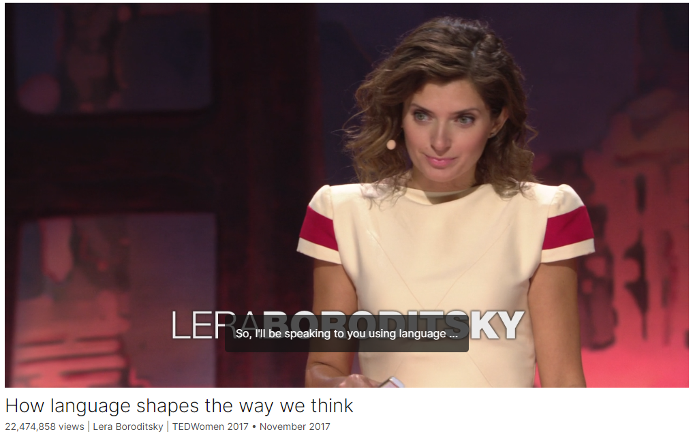

# How language shapes the way we think

Link:  [https://www.ted.com/talks/lera_boroditsky_how_language_shapes_the_way_we_think?](https://www.ted.com/talks/lera_boroditsky_how_language_shapes_the_way_we_think?)

Speaker:  Lera Boroditsky 

Date: November 2017

@[toc]

## Introduction

There are about 7,000 languages spoken around the world -- and they all have different sounds, vocabularies and structures. But do they shape the way we think? Cognitive scientist Lera Boroditsky shares examples of language -- from an Aboriginal community in Australia that uses cardinal directions instead of left and right to the multiple words for blue in Russian -- that suggest the answer is a resounding yes. "The beauty of linguistic diversity is that it reveals to us just how ingenious and how flexible the human mind is," Boroditsky says. "Human minds have invented not one cognitive universe, but 7,000."

世界上大约有7000种语言，它们都有不同的发音、词汇和结构。但是它们塑造了我们的思维方式吗？认知科学家蕾拉·博罗迪特斯基分享了一些语言的例子——从澳大利亚的一个土著社区使用基本方向而不是左和右，到俄语中表示蓝色的多个单词——这些例子表明答案是响亮的“是”。“语言多样性的美妙之处在于，它向我们揭示了人类思维是多么的巧妙和灵活，”Boroditsky说。"人类大脑已经发明了不止一个认知宇宙，而是7000个."

## Vocabulary

aboriginal: 美 [ˌæbəˈrɪdʒənl]  土著的；本土的；原住民的；原始的；澳大利亚土著的；澳大利亚原住民的

aboriginal community: 原住民社区

cardinal：美 [ˈkɑːrdɪnl]  首要的；关键的；基本的

resounding：美 [rəˈzaʊndɪŋ] 响亮的；嘹亮的；回响的；显著的；令人瞩目的；

ingenious：美 [ɪnˈdʒiːniəs] 巧妙的；精巧的；心灵手巧的；

hisses: 嘶嘶声；嘘声；（hiss的复数）；发嘶嘶声；（hiss的第三人称单数）          

puffs: 一阵；（puff的复数）；吹嘘；（puff的第三人称单数）  

eardrums: 英 ['ɪədrʌmz] 鼓膜；中耳；（eardrum的复数）        

I'm making tones and hisses and puffs, and those are creating air vibrations in the air. Those air vibrations are traveling to you, they're hitting your eardrums, and then your brain takes those vibrations from your eardrums and transforms them into thoughts.  我发出音调、嘶嘶声和吹气声，这些在空气中产生空气振动。那些空气振动正在向你传播，它们撞击着你的耳膜，然后你的大脑从耳膜接收这些振动，并把它们转化成思想。

jellyfish: 美 [ˈdʒelifɪʃ] 水母；海蜇；软弱的人；懦夫；

waltz: 美 [wɔːls]  跳华尔兹舞；带领某人跳华尔兹舞；轻快地走动；自信地行进

Imagine a jellyfish waltzing in a library while thinking about quantum mechanics.想象一只水母在图书馆里跳华尔兹，同时思考量子力学。

Holy Roman：神圣罗马帝国

Charlemagne, Holy Roman emperor 神圣罗马帝国皇帝查理曼大帝

weight in：过磅；称体重；参加辩论、比赛等发表意见          

weigh in on this question：对这个问题发表意见

Kuuk Thaayorre：库克·萨伊奥里（澳大利亚少数民族）

beaks：美 [bi:ks] 鸟喙；（beak的复数）

scales：美 [skeɪlz] 鳞屑；鳞片

we don't have magnets in our beaks or in our scales 我们的喙和鳞片里没有磁铁

discriminate these colors：区分这些颜色

masculine：美 [ˈmæskjəlɪn] 具有男子气质的；阳性的；男性的；

feminine：美 [ˈfemənɪn] 女子气的；娇美的；娇柔的；阴性的；妇女的；

lunatic ：美 [ˈluːnətɪk] 疯子；疯癫者；精神错乱者；疯狂的；不理智的；精神错乱的；

## Summary

**Introduction and Overview:** The speaker begins by explaining the magical ability of humans to communicate complex thoughts through language. This allows us to transmit ideas across space and time, enabling shared understanding and knowledge. The talk then delves into the fascinating diversity of languages around the world, emphasizing the structural differences and how they potentially shape our thinking.

**Examples and Research Findings:** The speaker provides various examples to illustrate how language influences thought. Among them, the Kuuk Thaayorre people's use of cardinal directions for spatial orientation, the impact of language on time perception, the absence of exact number words in some languages affecting numerical cognition, and how different languages categorize colors. Additionally, grammatical gender in languages influences perception, and the way languages describe events can shape memory and reasoning about those events.

**Implications and Conclusion:** The speaker highlights the profound effects of linguistic diversity on cognitive processes, from basic perception to complex reasoning. This diversity showcases the flexibility and ingenuity of the human mind. However, the loss of linguistic diversity is a significant concern, as it limits our understanding of the human mind. The speaker concludes by urging listeners to reflect on how their own language shapes their thinking and to consider the potential for thinking differently.

**介绍与概述：** 演讲者首先解释了人类通过语言传达复杂思想的神奇能力。这种能力让我们可以跨越空间和时间传递思想，实现共享理解和知识。演讲随后探讨了世界上语言的多样性，强调了结构差异及其可能如何影响我们的思维。

**例子与研究发现：** 演讲者提供了各种例子来说明语言如何影响思维。其中包括Kuuk Thaayorre人使用方位词进行空间定位、语言对时间感知的影响、有些语言缺乏精确数字词汇如何影响数字认知，以及不同语言对颜色的分类。此外，语言中的语法性别影响认知，不同语言描述事件的方式会影响记忆和对事件的推理。

**影响与结论：** 演讲者强调了语言多样性对认知过程的深远影响，从基本的感知到复杂的推理。这种多样性展示了人类思维的灵活性和创造力。然而，语言多样性的消失是一个重大问题，因为它限制了我们对人类思维的理解。演讲者最后敦促听众反思自己的语言如何影响自己的思维，并考虑不同的思维方式的可能性。

## Transcript

**Part 1: Introduction to Language**

So, I'll be speaking to you using language ... because I can. This is one these magical abilities that we humans have. We can transmit really complicated thoughts to one another. So what I'm doing right now is, I'm making sounds with my mouth as I'm exhaling. I'm making tones and hisses and puffs, and those are creating air vibrations in the air. Those air vibrations are traveling to you, they're hitting your eardrums, and then your brain takes those vibrations from your eardrums and transforms them into thoughts. I hope. (Laughter) I hope that's happening.

**Part 2: The Power of Language**

So because of this ability, we humans are able to transmit our ideas across vast reaches of space and time. We're able to transmit knowledge across minds. I can put a bizarre new idea in your mind right now. I could say, "Imagine a jellyfish waltzing in a library while thinking about quantum mechanics." (Laughter) Now, if everything has gone relatively well in your life so far, you probably haven't had that thought before. (Laughter) But now I've just made you think it, through language.

**Part 3: Language Diversity and Structure**

Now of course, there isn't just one language in the world, there are about 7,000 languages spoken around the world. And all the languages differ from one another in all kinds of ways. Some languages have different sounds, they have different vocabularies, and they also have different structures -- very importantly, different structures. That begs the question: Does the language we speak shape the way we think? Now, this is an ancient question. People have been speculating about this question forever. Charlemagne, Holy Roman emperor, said, "To have a second language is to have a second soul" -- strong statement that language crafts reality. But on the other hand, Shakespeare has Juliet say, "What's in a name? A rose by any other name would smell as sweet." Well, that suggests that maybe language doesn't craft reality. These arguments have gone back and forth for thousands of years. But until recently, there hasn't been any data to help us decide either way.

**Part 4: Scientific Research on Language and Thought**

Recently, in my lab and other labs around the world, we've started doing research, and now we have actual scientific data to weigh in on this question. So let me tell you about some of my favorite examples.

**Part 5: The Kuuk Thaayorre People and Spatial Orientation**

I'll start with an example from an Aboriginal community in Australia that I had the chance to work with. These are the Kuuk Thaayorre people. They live in Pormpuraaw at the very west edge of Cape York. What's cool about Kuuk Thaayorre is, in Kuuk Thaayorre, they don't use words like "left" and "right," and instead, everything is in cardinal directions: north, south, east and west. And when I say everything, I really mean everything. You would say something like, "Oh, there's an ant on your southwest leg." Or, "Move your cup to the north-northeast a little bit." In fact, the way that you say "hello" in Kuuk Thaayorre is you say, "Which way are you going?" And the answer should be, "North-northeast in the far distance. How about you?" So imagine as you're walking around your day, every person you greet, you have to report your heading direction. (Laughter) But that would actually get you oriented pretty fast, right? Because you literally couldn't get past "hello," if you didn't know which way you were going. In fact, people who speak languages like this stay oriented really well. They stay oriented better than we used to think humans could. We used to think that humans were worse than other creatures because of some biological excuse: "Oh, we don't have magnets in our beaks or in our scales." No; if your language and your culture trains you to do it, actually, you can do it. There are humans around the world who stay oriented really well. And just to get us in agreement about how different this is from the way we do it, I want you all to close your eyes for a second and point southeast. (Laughter) Keep your eyes closed. Point. OK, so you can open your eyes. I see you guys pointing there, there, there, there, there ... I don't know which way it is myself -- (Laughter) You have not been a lot of help. (Laughter) So let's just say the accuracy in this room was not very high. This is a big difference in cognitive ability across languages, right? Where one group -- very distinguished group like you guys -- doesn't know which way is which, but in another group, I could ask a five-year-old and they would know. (Laughter)

**Part 6: Differences in Temporal Orientation**

There are also really big differences in how people think about time. So here I have pictures of my grandfather at different ages. And if I ask an English speaker to organize time, they might lay it out this way, from left to right. This has to do with writing direction. If you were a speaker of Hebrew or Arabic, you might do it going in the opposite direction, from right to left. But how would the Kuuk Thaayorre, this Aboriginal group I just told you about, do it? They don't use words like "left" and "right." Let me give you hint. When we sat people facing south, they organized time from left to right. When we sat them facing north, they organized time from right to left. When we sat them facing east, time came towards the body. What's the pattern? East to west, right? So for them, time doesn't actually get locked on the body at all, it gets locked on the landscape. So for me, if I'm facing this way, then time goes this way, and if I'm facing this way, then time goes this way. I'm facing this way, time goes this way -- very egocentric of me to have the direction of time chase me around every time I turn my body. For the Kuuk Thaayorre, time is locked on the landscape. It's a dramatically different way of thinking about time.

**Part 7: Numerical Cognition and Language**

Here's another really smart human trick. Suppose I ask you how many penguins are there. Well, I bet I know how you'd solve that problem if you solved it. You went, "One, two, three, four, five, six, seven, eight." You counted them. You named each one with a number, and the last number you said was the number of penguins. This is a little trick that you're taught to use as kids. You learn the number list and you learn how to apply it. A little linguistic trick. Well, some languages don't do this, because some languages don't have exact number words. They're languages that don't have a word like "seven" or a word like "eight." In fact, people who speak these languages don't count, and they have trouble keeping track of exact quantities. So, for example, if I ask you to match this number of penguins to the same number of ducks, you would be able to do that by counting. But folks who don't have that linguistic trick can't do that.

**Part 8: Color Perception and Language**

Languages also differ in how they divide up the color spectrum -- the visual world. Some languages have lots of words for colors, some have only a couple words, "light" and "dark." And languages differ in where they put boundaries between colors. So, for example, in English, there's a word for blue that covers all of the colors that you can see on the screen, but in Russian, there isn't a single word. Instead, Russian speakers have to differentiate between light blue, "goluboy," and dark blue, "siniy." So Russians have this lifetime of experience of, in language, distinguishing these two colors. When we test people's ability to perceptually discriminate these colors, what we find is that Russian speakers are faster across this linguistic boundary. They're faster to be able to tell the difference between a light and dark blue. And when you look at people's brains as they're looking at colors -- say you have colors shifting slowly from light to dark blue -- the brains of people who use different words for light and dark blue will give a surprised reaction as the colors shift from light to dark, as if, "Ooh, something has categorically changed," whereas the brains of English speakers, for example, that don't make this categorical distinction, don't give that surprise, because nothing is categorically changing.

**Part 9: Grammatical Gender and Thought**

Languages have all kinds of structural quirks. This is one of my favorites. Lots of languages have grammatical gender; every noun gets assigned a gender, often masculine or feminine. And these genders differ across languages. So, for example, the sun is feminine in German but masculine in Spanish, and the moon, the reverse. Could this actually have any consequence for how people think? Do German speakers think of the sun as somehow more female-like, and the moon somehow more male-like? Actually, it turns out that's the case. So if you ask German and Spanish speakers to, say, describe a bridge, like the one here -- "bridge" happens to be grammatically feminine in German, grammatically masculine in Spanish -- German speakers are more likely to say bridges are "beautiful," "elegant" and stereotypically feminine words. Whereas Spanish speakers will be more likely to say they're "strong" or "long," these masculine words. (Laughter)

**Part 10: Describing Events and Memory**

Languages also differ in how they describe events, right? You take an event like this, an accident.

 In English, it's fine to say, "He broke the vase." In a language like Spanish, you might be more likely to say, "The vase broke," or, "The vase broke itself." If it's an accident, you wouldn't say that someone did it. In English, quite weirdly, we can even say things like, "I broke my arm." Now, in lots of languages, you couldn't use that construction unless you are a lunatic and you went out looking to break your arm -- (Laughter) and you succeeded. If it was an accident, you would use a different construction. Now, this has consequences. So, people who speak different languages will pay attention to different things, depending on what their language usually requires them to do. So we show the same accident to English speakers and Spanish speakers, English speakers will remember who did it, because English requires you to say, "He did it; he broke the vase." Whereas Spanish speakers might be less likely to remember who did it if it's an accident, but they're more likely to remember that it was an accident. They're more likely to remember the intention. So, two people watch the same event, witness the same crime, but end up remembering different things about that event. This has implications, of course, for eyewitness testimony. It also has implications for blame and punishment. So if you take English speakers and I just show you someone breaking a vase, and I say, "He broke the vase," as opposed to "The vase broke," even though you can witness it yourself, you can watch the video, you can watch the crime against the vase, you will punish someone more, you will blame someone more if I just said, "He broke it," as opposed to, "It broke." The language guides our reasoning about events.

**Part 11: Conclusion and Final Thoughts**

Now, I've given you a few examples of how language can profoundly shape the way we think, and it does so in a variety of ways. So language can have big effects, like we saw with space and time, where people can lay out space and time in completely different coordinate frames from each other. Language can also have really deep effects -- that's what we saw with the case of number. Having count words in your language, having number words, opens up the whole world of mathematics. Of course, if you don't count, you can't do algebra, you can't do any of the things that would be required to build a room like this or make this broadcast, right? This little trick of number words gives you a stepping stone into a whole cognitive realm. Language can also have really early effects, what we saw in the case of color. These are really simple, basic, perceptual decisions. We make thousands of them all the time, and yet, language is getting in there and fussing even with these tiny little perceptual decisions that we make. Language can have really broad effects. So the case of grammatical gender may be a little silly, but at the same time, grammatical gender applies to all nouns. That means language can shape how you're thinking about anything that can be named by a noun. That's a lot of stuff. And finally, I gave you an example of how language can shape things that have personal weight to us -- ideas like blame and punishment or eyewitness memory. These are important things in our daily lives. Now, the beauty of linguistic diversity is that it reveals to us just how ingenious and how flexible the human mind is. Human minds have invented not one cognitive universe, but 7,000 -- there are 7,000 languages spoken around the world. And we can create many more -- languages, of course, are living things, things that we can hone and change to suit our needs. The tragic thing is that we're losing so much of this linguistic diversity all the time. We're losing about one language a week, and by some estimates, half of the world's languages will be gone in the next hundred years. And the even worse news is that right now, almost everything we know about the human mind and human brain is based on studies of usually American English-speaking undergraduates at universities. That excludes almost all humans. Right? So what we know about the human mind is actually incredibly narrow and biased, and our science has to do better. I want to leave you with this final thought. I've told you about how speakers of different languages think differently, but of course, that's not about how people elsewhere think. It's about how you think. It's how the language that you speak shapes the way that you think. And that gives you the opportunity to ask, "Why do I think the way that I do?" "How could I think differently?" And also, "What thoughts do I wish to create?" Thank you very much. (Applause)

## Afterword

2024年6月22日18点36分于上海。

