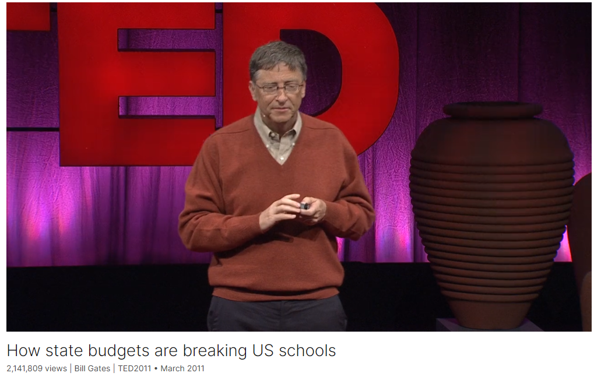

# How state budgets are breaking US schools

Link: [https://www.ted.com/talks/bill_gates_how_state_budgets_are_breaking_us_schools](https://www.ted.com/talks/bill_gates_how_state_budgets_are_breaking_us_schools)

Speaker:   Bill Gates

Date: March 2011

@[toc]

## Introduction

America's school systems are funded by the 50 states. In this fiery talk, Bill Gates says that state budgets are riddled with accounting tricks that disguise the true cost of health care and pensions and weighted with worsening deficits -- with the financing of education at the losing end.

美国的学校系统由 50 个州提供资金。比尔-盖茨在这次火热的演讲中说，各州的预算充斥着掩盖医疗保健和养老金真实成本的会计伎俩，赤字不断恶化，而教育经费则处于亏损状态。

## Vocabulary

riddle with：充满；全是

gimmick:美 [ˈɡɪmɪk] 花招；手法；噱头

pension: 美 [ˈpenʃn] 养老金

pension costs 养老金成本

perpetuate：美 [pərˈpetʃueɪt] 保持；使永存；

It perpetuates deficit spending. 它延续了赤字支出。

shortfall：缺少，赤字

liability：负债，**债务**；责任

growing healthcare costs and pension liabilities 不断增长的医疗成本和养老金负债

blatant：美 [ˈbleɪtnt] 公然的；明目张胆的

This is so blatant, so extreme. 这是如此明目张胆，如此极端。

generosity：美 [ˌdʒenəˈrɑːsəti] 慷慨；大方；

the looming challenges：迫在眉睫的挑战

## Summary

In his speech, Bill Gates brings attention to the importance of state budgets, despite the topic often being perceived as boring. He emphasizes the significant impact state budgets have on education funding, which is crucial for the future success of children. Gates highlights the concerning state of many state budgets, revealing a large deficit and problematic financial practices that obscure the true financial challenges facing states. He stresses the need for increased scrutiny and understanding of state budgets to address long-term liabilities and ensure adequate funding for education.

Gates delves into the complexities of state budgets, pointing out the discrepancy between spending and revenue, which has led to substantial deficits. He uses California as an example to illustrate how budgetary tricks and unsustainable practices have contributed to financial crises. He emphasizes the systemic nature of the problem, affecting not only California but also numerous other states across the country. Gates highlights the looming challenges posed by growing healthcare costs and pension liabilities, which threaten to undermine education spending and investment in the future generation.

In conclusion, Gates calls for greater transparency, accountability, and informed decision-making regarding state budgets. He stresses the need for better tools, such as improved accounting methods and accessible information, to enable citizens and policymakers to understand and address the financial challenges effectively. Gates emphasizes that investing in education is essential for the nation's prosperity and urges collective action to ensure adequate funding for education and address the pressing issues facing state budgets.

## Transcript

Well, this is about state budgets.

This is probably the most boring topic

of the whole morning.

But I want to tell you, I think it's an important topic

that we need to care about.

State budgets

are big, big money --

I'll show you the numbers --

and they get very little scrutiny.

The understanding is very low.

Many of the people involved

have special interests or short-term interests

that get them not thinking

about what the implications of the trends are.

And these budgets

are the key for our future;

they're the key for our kids.

Most education funding --

whether it's K through 12,

or the great universities or community colleges --

most of the money for those things

is coming out of these state budgets.

But we have a problem.

Here's the overall picture.

U.S. economy is big --

14.7 trillion.

Now out of that pie,

the government spends 36 percent.

So this is combining the federal level,

which is the largest,

the state level and the local level.

And it's really in this combined way

that you get an overall sense of what's going on,

because there's a lot of complex things

like Medicaid and research money

that flow across those boundaries.

But we're spending 36 percent.

Well what are we taking in?

Simple business question.

Answer is 26 percent.

Now this leaves 10 percent deficit,

sort of a mind-blowing number.

And some of that, in fact, is due to the fact

that we've had an economic recession.

Receipts go down,

some spending programs go up,

but most of it is not because of that.

Most of it is because of ways

that the liabilities are building up

and the trends,

and that creates a huge challenge.

In fact, this is the forecast picture.

There are various things in here:

I could say we might raise more revenue,

or medical innovation will make the spending even higher.

It is an increasingly difficult picture,

even assuming the economy does quite well --

probably better than it will do.

This is what you see

at this overall level.

Now how did we get here?

How could you have a problem like this?

After all, at least on paper,

there's this notion that these state budgets are balanced.

Only one state says

they don't have to balance the budget.

But what this means actually

is that there's a pretense.

There's no real, true balancing going on,

and in a sense, the games they play to hide that

actually obscure the topic so much

that people don't see things

that are actually pretty straight-forward challenges.

When Jerry Brown was elected,

this was the challenge that was put to him.

That is, through various gimmicks and things,

a so-called balanced budget

had led him to have 25 billion missing

out of the 76 billion in proposed spending.

Now he's put together some thoughts:

About half of that he'll cut,

another half,

perhaps in a very complex set of steps,

taxes will be approved.

But even so,

as you go out into those future years,

various pension costs, health costs go up enough,

and the revenue does not go up enough.

So you get a big squeeze.

What were those things that allowed us to hide this?

Well, some really nice little tricks.

And these were somewhat noticed.

The paper said, "It's not really balanced.

It's got holes.

It perpetuates deficit spending.

It's riddled with gimmicks."

And really when you get down to it,

the guys at Enron never would have done this.

This is so blatant,

so extreme.

Is anyone paying attention

to some of the things these guys do?

They borrow money.

They're not supposed to, but they figure out a way.

They make you pay more in withholding

just to help their cash flow out.

They sell off the assets.

They defer the payments.

They sell off the revenues from tobacco.

And California's not unique.

In fact, there's about five states that are worse

and only really four states

that don't face this big challenge.

So it's systemic across the entire country.

It really comes from the fact

that certain long-term obligations --

health care, where innovation makes it more expensive,

early retirement and pension, where the age structure gets worse for you,

and just generosity --

that these mis-accounting things

allow to develop over time,

that you've got a problem.

This is the retiree health care benefits.

Three million set aside, 62 billion dollar liability --

much worse than the car companies.

And everybody looked at that

and knew that that was headed toward a huge problem.

The forecast for the medical piece alone

is to go from 26 percent of the budget

to 42 percent.

Well what's going to give?

Well in order to accommodate that,

you would have to cut education spending in half.

It really is this young versus the old

to some degree.

If you don't change that revenue picture,

if you don't solve what you're doing in health care,

you're going to be deinvesting in the young.

The great University of California university system,

the great things that have gone on,

won't happen.

So far it's meant layoffs,

increased class sizes.

Within the education community there's this discussion of,

"Should it just be the young teachers who get laid off,

or the less good teachers who get laid off?"

And there's a discussion: if you're going to increase class sizes,

where do you do that? How much effect does that have?

And unfortunately, as you get into that, people get confused and think,

well maybe you think that's okay.

In fact, no, education spending should not be cut.

There's ways, if it's temporary,

to minimize the impact,

but it's a problem.

It's also really a problem for where we need to go.

Technology has a role to play.

Well we need money to experiment with that,

to get those tools in there.

There's the idea of paying teachers for effectiveness,

measuring them, giving them feedback,

taking videos in the classroom.

That's something I think is very, very important.

Well you have to allocate dollars

for that system

and for that incentive pay.

In a situation where you have growth,

you put the new money into this.

Or even if you're flat, you might shift money into it.

But with the type of cuts we're talking about,

it will be far, far harder

to get these incentives for excellence,

or to move over

to use technology in the new way.

So what's going on?

Where's the brain trust

that's in error here?

Well there really is no brain trust.

(Laughter)

It's sort of the voters. It's sort of us showing up.

Just look at this spending.

California will spend over 100 billion,

Microsoft, 38,

Google, about 19.

The amount of IQ in good numeric analysis,

both inside Google and Microsoft

and outside, with analysts and people of various opinions --

should they have spent on that?

No, they wasted their money on this. What about this thing? --

it really is quite phenomenal.

Everybody has an opinion.

There's great feedback.

And the numbers are used to make decisions.

If you go over the education spending and the health care spending --

particularly these long-term trends --

you don't have that type of involvement

on a number that's more important

in terms of equity, in terms of learning.

So what do we need to do?

We need better tools.

We can get some things out on the Internet.

I'm going to use my website

to put up some things that will give the basic picture.

We need lots more.

There's a few good books,

one about school spending and where the money comes from --

how that's changed over time, and the challenge.

We need better accounting.

We need to take the fact

that the current employees, the future liabilities they create,

that should come out of the current budget.

We need to understand why they've done the pension accounting

the way they have.

It should be more like private accounting.

It's the gold standard.

And finally, we need to really reward politicians.

Whenever they say there's these long-term problems,

we can't say, "Oh, you're the messenger with bad news?

We just shot you."

In fact, there are some like these:

Erskine Bowles, Alan Simpson and others,

who have gone through and given proposals

for this overall federal health-spending state-level problem.

But in fact, their work was sort of pushed off.

In fact, the week afterwards,

some tax cuts were done

that made the situation even worse

than their assumptions.

So we need these pieces.

Now I think this is a solvable problem.

It's a great country with lots of people.

But we have to draw those people in,

because this is about education.

And just look at what happened with the tuitions

with the University of California

and project that out for another three, four, five years --

it's unaffordable.

And that's the kind of thing --

the investment in the young --

that makes us great, allows us to contribute.

It allows us to do the art,

the biotechnology, the software

and all those magic things.

And so the bottom line is

we need to care about state budgets

because they're critical for our kids and our future.

Thank you.

(Applause)

## Afterword

2024年5月9日17点54分于上海。

