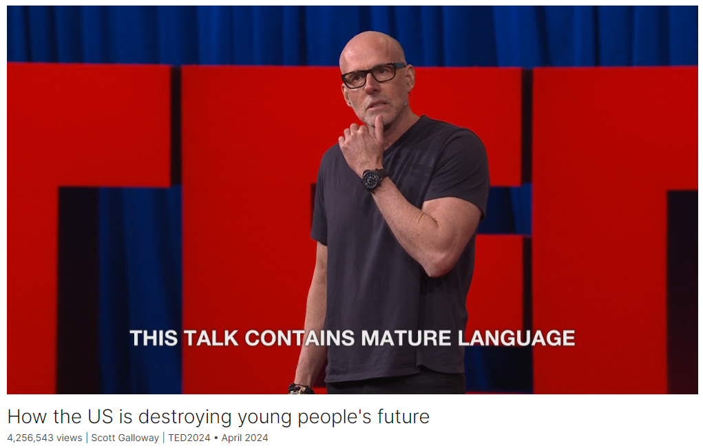

# How the US is destroying young people's future

Link: [https://www.ted.com/talks/scott_galloway_how_the_us_is_destroying_young_people_s_future?](https://www.ted.com/talks/scott_galloway_how_the_us_is_destroying_young_people_s_future?)

Speaker:  Scott Galloway

Date: April 2024

@[toc]

## Introduction

In a scorching talk, marketing professor and podcaster Scott Galloway dissects the data showing that, by many measures, young people in the US are worse off financially than ever before. He unpacks the root causes and effects of this "great intergenerational theft," asking why we let it continue and showing how we could make it end. (Note: This talk contains mature language.)

## Vocabulary

scorching：美 [ˈskɔːrtʃɪŋ]  炎热的；尖刻的；严厉的

scorching  talk

>"Scorching talk" 指的是一场非常激烈、激动人心或具有强烈观点和言辞的演讲。通常用来描述演讲者用强烈的语言和情绪来表达他们的想法，可能会引起听众的强烈共鸣或争议。在这种演讲中，演讲者可能会使用大量的情感和口头表达来强调他们的立场和论点。

dissect:美 [dɪˈsekt] 剖析；仔细分析

unpack：打开取出东西；解释；分析；

He unpacks the root causes: 他分析了问题的根本原因

telenovela: 美 [ˌtɛlənoʊˈvɛlə]  电视连续剧

unbridled：美 [ˌənˈbraɪdld] 不受约束的；不受控制的

unbridled passion: 肆无忌惮的激情

the cost of buying a home, the cost of pursuing education, continues to skyrocket. 购房成本、接受教育的成本继续飙升。

This is a breakdown in the fundamental agreement we have with any society, and it creates rage and shame. 这是我们与任何社会的基本协议的崩溃，它造成了愤怒和耻辱。

incendiary：美 [ɪnˈsɛndiˌɛri] 放火的；纵火的；煽动性的；

This creates an incendiary.  这就产生了一种煽动性

righteous：美 [ˈraɪtʃəs] 正直的；公正的；

opportunistic：美 [ˌɑpərt(j)uˈnɪstɪk] 机会主义的

warranted：美 ['wɒrəntɪd] 有正当理由的；需要的；得到授权的；经批准的

pissed off：生气，发飙

spoil：赃物；

because generally speaking, young people have a warranted envy, they're pissed off and they're angry that they don't enjoy the same spoils and prosperity that were provided to our generation. 因为一般来说，年轻人有理由嫉妒，他们感到愤怒，因为他们没有享受到我们这一代人享受到的同样的战利品和繁荣。

it'd be at about 23 bucks a share. 每股大约23美元。

incumbents：美 [ɪn'kʌmbənts] 现任者；在职者

new entrant：美 [ˈɛntrənt] 新来的人

the incumbents that own assets have weaponized government to make it very difficult for new entrants to ever get their own assets, thereby elevating their own net worth. 拥有资产的在位者已经将政府武器化，使新进入者很难获得自己的资产，从而提高了自己的净资产。

by virtue of 由于；因为；

by virtue of her being in this audience：由于她在这里听会

admission rate：录取率

When I applied to UCLA, the admissions rate was 76 percent. 当我申请加州大学洛杉矶分校时，录取率是76%。

compensation：美 [ˌkɑːmpenˈseɪʃn] 补偿，薪酬

How can I increase my compensation while reducing my accountability? 我如何在减少我的责任的同时增加我的薪酬？

endowment:美 [ɪnˈdaʊmənt] 捐赠；资助；捐款；

expand enrollment: 扩大录取

They've increased their endowment in the last 40 years and have decided to expand their enrollment, their freshman class, by four percent. 在过去的40年里，他们增加了捐赠基金，并决定将他们的新生班级扩大4%。

hedge fund：对冲基金

They're a hedge fund offering classes. 他们是一家提供课程的对冲基金。

freakishly：非常或异常地

our job in higher ed isn't to identify a top one percent of people who are freakishly remarkable or have rich parents 我们在高等教育领域的工作不是找出前百分之一的人，他们异常杰出或者有着富有的父母

cohort: 美 [ˈkoʊhɔːrt] 一群；一批；从统计角度看属某种同一情况的一批人

garner：美 [ˈɡɑːrnər] 收集；积累

garner wealth: 积累财富

While the cohorts, corporations and the ultra-wealthy continue to garner more and more of our wealth, 当同龄人、公司和超级富豪继续积累越来越多的财富时

tax credit: 税收抵免；(尤指政府向有子女或低收入者提供的）补助金

strip: 除去；取走;夺去；剥夺

It would cost 11 billion dollars to expand the child tax credit. But that gets stripped out of the infrastructure bill. 扩大儿童税收抵免将花费110亿美元。但这一点被从基础设施法案中剔除了。

under the auspices of: 在…的帮助（或支持、保护）下

The great intergenerational theft took place under the auspices of a virus. 这场重大的代际盗窃是在一种病毒的支持下发生的。

churn: 美 [tʃɜːrn] 用搅乳器搅拌；翻腾；鼓励频繁（投资）周转额

disruption: 美 [dɪsˈrʌpʃn] 分裂，瓦解

recalibrate： 重新校准

And by the way, you need churn, you need disruption because it seeds and recalibrates advantage and wealth from the incumbents to the entrants. 顺便说一句，你需要流失，你需要颠覆，因为它播种并重新调整了优势和财富从现有者到新进入者的过程。

So we pumped the economy 所以我们刺激经济

bail out：“救助”或“拯救”

Because in 2008 we bailed out the banks, but we didn't bail out the economy. 因为2008年我们救助了银行，但我们没有救助经济。

baby boomer：婴儿潮一代（指1946年至1964年间出生的人）；婴儿潮时期出生的人

culinary： 美 [ˈkʌlɪneri] 烹饪的；烹调的

culinary academy：烹饪学院

When you bail out the baby boomer owner of a restaurant, all you're doing is robbing opportunity from the 26-year-old graduate of a culinary academy that wants her shot.  当你救助婴儿潮时期出生的餐馆老板时，你所做的只是从一个26岁的烹饪学院毕业生那里抢走了机会，她想要一展身手。

institutions：机构；体系；制度

Paleolithic：美 [ˌpeɪliəˈlɪθɪk] 旧石器时代的；旧石器时代

Let's take advantage of the flaws in our species with medieval institutions, Paleolithic instincts and godlike technology. 让我们利用我们这个物种的缺陷，利用中世纪的制度、旧石器时代的本能和上帝般的技术。

implant：植入

jack into：进入或连接

It's as if we let an adversary implant a neural jack into our youth to raise a generation of civic, military and business leaders that hate America. 这就好像我们让一个对手在我们的青年中植入一个神经插孔，以培养一代憎恨美国的公民、军事和商业领袖。

per-capita：人均

This is per-capita spending on child care in the United States relative to other nations. 这是美国相对于其他国家在儿童保育上的人均支出。

beneficiary ：美 [ˌbenɪˈfɪʃieri] 受益人；受惠者  **注意发音**

posit：假设，假定

augur：美 [ˈɔɡər]  预示，预兆，预见

veracity：美 [vəˈræsədi] 真实，准确

I present to you, I posit, I augur the question that I hope has more veracity than it did 17 minutes and 24 seconds ago. 我想，我现在向你提出的问题比17分24秒前更有真实性。

socioeconomic： 社会经济学的

demographic：美 [ˌdeməˈɡræfɪk] 人口结构的；人口统计数据

disenchantment：清醒；醒悟

poignant：美 [ˈpɔɪnjənt] 深刻的；辛辣的  **注意发音**

poignant question：尖锐的问题

## Summary

Scott Galloway's speech delves into the socioeconomic challenges faced by younger generations, highlighting a significant wealth and opportunity gap between older and younger demographics. He starts by illustrating the decline in prosperity for younger individuals compared to their parents' generation, pointing out rising costs of education and housing relative to income. Galloway argues that this disparity leads to feelings of rage and disenchantment among younger people, fueling societal unrest. He criticizes the deliberate suppression of minimum wage and the housing market by older generations, exacerbating the wealth gap.

In the second part of his speech, Galloway discusses the inflated costs of higher education, attributing it to an artificial scarcity strategy employed by universities. He emphasizes the need for reform in higher education to make it more accessible and affordable. Galloway proposes measures to incentivize public institutions to reduce tuition and increase enrollment, aiming to double freshman seats and halve the cost within a decade. He also calls for a progressive tax structure and other policy changes to address the wealth transfer from young to old.

The final segment of Galloway's speech addresses various societal issues affecting young people, including mental health, addiction, and declining birth rates. He criticizes the impact of social media, big tech, and economic policies on the well-being of younger generations. Galloway advocates for policy reforms, such as universal pre-K, income-based affirmative action, and national service, to address these challenges. He concludes with a poignant question: Do we truly love our children? imploring the audience to consider the well-being of future generations and take action to create a more equitable society.

## Transcript

My name is Scott Galloway,

I teach at NYU,
and I appreciate your time.

I have 44 slides and 720 seconds.

Let's light this candle.

(Laughter)

OK so for those of you who don't know me,

I'm actually a global television store.

True story.

I've had four TV series
in the last three years.

Two of them have been canceled
before they were launched,

and two were canceled within six weeks.

Let's recap.

(Video) If we want to juice this thing,

if we want to put a cattle prod
up the ass of the economy.

Bloomberg.

The most trusted name in financial news.

Not for long.

Andrew Yang: I'm going to do
whatever I can for this country of ours.

Scott Galloway: Jesus, come on, dude,
you’re 0 for two.

(Video ends)

SG: Face for podcasting.

So first insight of the day.

I'd like to be the first person
to welcome you to the last TED.

(Laughter)

OK.

By the way, it's clear --
what's it called?

What are we here for?

“The Brave and the Brilliant?”

It's clear that Chris is a frustrated
soap opera producer.

(Laughter)

Essentially what we have here
is a telenovela

where, after a night of unbridled passion

between Bill Gates and Malcolm Gladwell,

they give birth to their
bastard love child,

Simon Sinek.

(Laughter)

OK, I start us with a question.

Do we love our children?

Sounds like an illegitimate
question, right?

Well, I'm going to try
and convince you otherwise.

Essentially, as we go down generations,

we're seeing that for the last
two generations,

people are making less money
on an inflation-adjusted basis.

In addition, the cost of buying a home,

the cost of pursuing education,
continues to skyrocket.

So the purchasing power, the prosperity,
is inversely correlated to age.

Simply put, as we get younger,

we're taking away opportunity
and prosperity from our youngest.

The social contract
that is now no longer in place

and for the first time
in the US's history,

a 30-year-old is no longer doing as well
as his or her parents were at 30.

This is a breakdown in the fundamental
agreement we have with any society,

and it creates rage and shame.

(Applause)

As a result, people over the age of 55
feel pretty good about America,

but less than one in five people
under the age of 34

feel very good about America.

This creates an incendiary.

Righteous movements,

cuts to our society end up becoming
opportunistic infections

because generally speaking,
young people have a warranted envy,

they're pissed off and they're angry

that they don't enjoy
the same spoils and prosperity

that were provided to our generation.

A decent proxy for how much we value
youth labor is minimum wage,

and we've kept it purposely pretty low.

If it had just kept pace
with productivity,

it'd be at about 23 bucks a share.

But we've decided
to purposely keep it low.

Out of reach.

Median home price has skyrocketed
relative to median household income.

As a result, pre-pandemic, the average
mortgage payment was 1,100 dollars,

it's now 2,300 dollars

because of an acceleration
in interest rates

and the fact that the average home
has gone from 290,000 to 420.

By the way, the most expensive
homes in the world,

based on this metric,
are number three, Vancouver.

Why?

Because 60 percent of the cost
of building a home goes to permits.

Because guess what, the incumbents
that own assets have weaponized government

to make it very difficult for new entrants
to ever get their own assets,

thereby elevating their own net worth.

This is the transfer I'm going
to be speaking about.

(Applause)

This has resulted in an enormous
transfer of wealth,

where people over the age of 70

used to control 19 percent
of household income,

versus people under the age
of 40, used to control 12.

Their wealth has been cut in half.

This isn't by accident, it's purposeful.

This is me at UCLA in 1987.

I know your first thought is
I haven't changed a bit.

(Laughter)

This is also Mia Silverio,

who is the analyst
who put together these slides.

By the way, Mia is 26.

I did the math, just by virtue
of her being in this audience,

it brings the average age
of the entire conference down 11 days.

(Laughter)

When I applied to UCLA,
the admissions rate was 76 percent.

Today, it's nine percent.

I received a 2.23 GPA from UCLA.

I learned nothing but how to make
bongs out of household items

and every line from "Planet of the Apes."

And the greatest public school
in the world, Berkeley,

decided to let me in with a 2.27 GPA.

And that's what higher ed is about.

Higher ed is about taking
unremarkable kids

and giving them a shot
at being remarkable.

(Applause)

And every year it's gotten more expensive.

Higher ed and homes and the ability --

not only is higher ed
incredibly expensive,

it's not accessible.

Because me and my colleagues
are drunk on luxury,

and I'll come back to that.

We've embraced the ultimate strategy.

Me and my colleagues in higher ed
wake up every morning

and ask ourselves the same question
when we look in the mirror.

How can I increase my compensation
while reducing my accountability?

(Laugter)

And we have found the ultimate strategy.

It's called an LVMH strategy,

where we artificially constrain supply
to create aspiration and scarcity

such that we can raise tuition
faster than inflation.

And old people and wealthy people
have done the same thing with housing.

All of a sudden, once you own a home,

you become very concerned with traffic,

and you make sure that there's no
new housing permits.

And here is a memo
to my colleagues in higher ed:

we’re public servants,
not fucking Chanel bags.

(Applause)

Harvard is the best example of this.

They've increased their endowment
in the last 40 years

and have decided
to expand their enrollment,

their freshman class, by four percent.

Any university that doesn't grow
their freshman class

faster than population

that has over a billion dollars
in endowment

should lose their tax-free status

because they're no longer
in higher education.

They're a hedge fund offering classes.

(Cheers and applause)

My first recommendation:

Biden should take some of that 750 billion

earmarked to bail out the one third
of people that got to go to college

on the backs of the two thirds that didn't

and give a billion dollars to our 500
greatest public institutions,

size-adjusted, in exchange
for three things.

One, they use technology and scale
to reduce tuition by two percent a year,

expand enrollments by six percent a year

and increase the number
of vocational certifications

and nontraditional four-year
degrees by 20 percent.

Where does that get us?

In just ten years,

in just ten years, that doubles
the freshman seats

and cuts the cost in half.

This isn't radical.

This is called college
in the '80s and '90s.

Another transfer of wealth.

Look at what's happened to wages.

Oh, they've gone up?

Not as much as corporate profits.

There's a healthy tension
between capital and labor.

But for the last 40 years, capital
has been kicking the shit out of labor.

Well, you think, what about wages, right?

They've gone up.

Well if you compare them
to the S and P, they barely register.

It's been an amazing time to own assets.

But your attempt to get
the certification or the income

such that you can acquire assets
has gotten harder and harder.

In my class of 300 kids, it's never
been easier to be a billionaire,

it's never been harder
to be a millionaire.

By the way, our job in higher ed

isn't to identify a top one
percent of people

who are freakishly remarkable
or have rich parents

and turn them into a super
class of billionaires.

It's to give the bottom 90
a chance to be in the top ten.

(Applause)

You know who doesn't need me
or higher education?

The top 10 percent.

The whole point of higher ed is to give
the unremarkables, i.e. yours truly,

who was raised by a single
immigrant mother,

a shot of being remarkable.

The transfer has been purposeful.

While the cohorts, corporations
and the ultra-wealthy

continue to garner more
and more of our wealth,

we have decided,
"I know, if they win the gold,

let’s give them the silver and the bronze,
and let’s lower their taxes.”

This transfer is purposeful.

It’s not by accident, and it works.

Senior poverty is way down,
and we should celebrate that.

Meanwhile, child poverty
is flat to up.

The third rail.

I'm going to talk about Social Security.

It would cost 11 billion dollars
to expand the child tax credit.

But that gets stripped out
of the infrastructure bill.

But the additional 135 billion dollars
a year to Social Security,

that flies right through Congress.

And every year we transfer
1.4 trillion dollars

from a cohort that is
increasingly doing less well

to the cohort that is
the wealthiest cohort

in the history of this planet.

I'm not against Social Security,
but the criteria should be if you need it,

not whether you have a catheter.

80 percent of you,

80 percent of you
have absolutely no reason

to ever take Social Security.

It is bankrupting our nation.

And we have fallen under this mythology

that somehow it's this
great social program.

No it's not.

It's the great transfer of wealth
from young to old.

(Applause)

How is this happening?

Because our representatives
are in fact, representative.

Old people vote.

Washington has become a cross

between the "Land of the Dead"
and "The Golden Girls."

(Laughter)

Quite frankly, this is fucking ridiculous.

And if I sound ageist --

(Applause)

If I sound ageist, I am.

And you know who else is ageist?

Biology.

(Laughter)

When Speaker Pelosi had her first child,

get this, two thirds of households
didn't have color televisions,

and Castro had just declared martial law.

But she's supposed to understand

the challenges of a 17-year-old girl
who’s 5′ 9", 95 pounds,

getting tips on dieting and extreme
dieting from Facebook?

She's supposed to understand
the challenges

that a 27-year-old single mother faces?

By the way, young and dreamy.

(Laughter)

Young and dreamy.

(Applause)

The great intergenerational theft
took place under the auspices of a virus.

I know, let's use the greatest
health crisis in a century

to really speed-ball the transfer.

This is the Nasdaq from 2008 to 2012.

We let the markets crash.

And by the way, you need churn,

you need disruption because it seeds
and recalibrates advantage and wealth

from the incumbents to the entrants.

It's a natural part of the cycle.

But wait, lately, no,

a million people dying would be bad.

But what would be tragic
is if we let the Nasdaq go down

and guys like me lost wealth.

So we pumped the economy,

which again, increased
the massive transfer of wealth.

The best two years of my life?

Covid -- more time with my kids,
more time with Netflix,

and the value of my stocks
absolutely exploded.

And who has to pay for my prosperity?

Not me.

Future generations who will have to deal
with an unprecedented level of debt.

Why am I here, and why do I
get the prosperity I enjoy?

Because in 2008 we bailed out the banks,

but we didn't bail out the economy.

We let the markets fall.

So as I was coming into my prime
income-earning years,

I got to buy, no joke,
these stocks at these prices.

This is where those stocks are now.

Where does a young person find disruption?

When you bail out the baby boomer
owner of a restaurant,

all you're doing is robbing opportunity
from the 26-year-old graduate

of a culinary academy that wants her shot.

We need disruption.

(Laughter)

I just like this slide.

It has no context or relevance.

(Laughter and cheers)

We're economically attacking the young,

but I know, let's attack their emotional
and mental well-being.

Let's take advantage
of the flaws in our species

with medieval institutions,
Paleolithic instincts

and godlike technology.

I'm just going to say,

I think Mark Zuckerberg has done more
damage to the young people in our nation

while making more money
than any person in history.

(Applause)

Oh, but wait, it could be worse.

It's as if we let an adversary implant
a neural jack into our youth

to raise a generation of civic, military

and business leaders that hate America.

How can we be this stupid?

(Laughter)

This all adds up to a bunch of graphs
all headed up into the right.

And what are they?

What's the first one?

Oh, that's self-harm rates,
which have exploded,

especially among girls since my colleague
Jonathan Haidt pointed out,

it's really, really gone crazy
since social went on mobile.

What's the next one?

Teens with depression.

The next one, men and women
not having sex.

Biggest fear of my parents was that I was
going to get in too much trouble.

My biggest fear, honestly,

is that my kids aren't going
to get into enough trouble.

My advice to every young person
watching this program

is go out, drink more
and make a series of bad decisions

that might pay off.

(Laughter and applause)

Next graph, cumulative gun deaths.

You're more likely to be shot
in the United States

if you're a toddler
or an infant than a cop.

Next graph, obesity, way up.

By the way, the industrial food complex
wants to addict you to shitty, fatty foods

so they can hand you over
to the industrial diabetes complex.

We should not romanticize obesity.

You're not finding your fucking truth.

You're finding diabetes.

(Laughter and applause)

Overdose deaths, way up.

Deaths of despair.

When I was in high school,
it was drunk driving,

now it's kids killing themselves.

Young people don't want
to have kids anymore.

Two-thirds of people
aged 30 to 34, able-bodied,

used to decide to have at least one child.

It's been cut in half.

It's now less than a third, 27 percent.

As a result, people over the age of 60
in the US, pretty happy.

People under the age of 30, not so much.

Some of the lowest in the free world.

What can we do?

Nothing wrong with America that can't
be fixed with what's right with it.

We got the hard stuff figured out.

There are programs to address
all of these issues,

they cost a lot of money,
that's the hard part.

And we have figured this out.

In just five minutes
post an earnings call,

we can add a quarter
of a trillion dollars to the economy.

We've got the hard part
figured out, the resources.

We have the money,
but we decide not to do it.

This is per-capita spending
on child care in the United States

relative to other nations.

This is housing permits.

Things are doable.

We increase minimum wage
at 25 bucks an hour,

it goes into the economy.

The wonderful things about low-
and middle-income households

is they spend all their money.

We have to have or restore
or a progressive tax structure

with alternative minimum tax
on corporations and wealthy individuals.

We need to refund the IRS.

We need to reform Social Security.

It should be based on whether
you need the money,

not on how old you are.

We need a negative income tax.

My friend Andrew Yang
screwed up a great idea,

but he branded it incorrectly.

Instead of calling it UBI,

he should’ve got Republicans on board
by calling it a negative income tax.

(Laughter)

We need to eliminate
the capital gains tax deduction.

When did we decide
that the money that capital earns

is more noble than the money
that sweat earns?

Shouldn't it be flipped?

(Applause)

We need to remove 230 protection
for all algorithmically-elevated content.

We need identity verification.

The reason we can have
identity verification

is because we have a First Amendment.

Break up Big Tech.

We have monopolies that are incurring
greater and greater costs

on every small business and parents
because again, see above,

our representatives don't
understand these technologies.

We need to age-gate social media.

There's absolutely no reason
anyone under the age of 16

should ever be on social media.

(Applause)

We need universal pre-K.

We need to reinstate
the expanded child-tax credit.

We need term limits,
see above, Andrew Yang.

We need income-based affirmative action.

Any visible signs of affirmative
action make no sense at all.

You would rather be born gay or non-white,

in the United States today than poor.

And that's a sign of our progress

and our need to recalibrate
who we give advantage to.

Affirmative action,
of which I’m a beneficiary --

I got Pell Grants,
I got unfair advantage --

affirmative action is a wonderful thing,
and it should be based on color:

it should be based on green.

How much money you have or don't have.

Expand college enrollment
in vocational programs.

Mental health, ban phones in schools,
invest in third places,

Big Brothers and Sisters programs.

We need national service.

We need to tell people
in the United States and Canada

that they live in the greatest
countries in the world,

and we need to remind them
of that every day

by exposing them to other great Americans
where they feel connective tissue.

We can do all of this.

We can do all of it.

We have the resources.

The question is, do we have the will?

This is my last slide.

It is an emotionally manipulative slide
to try and get you to like me more.

(Laughter)

But it does have a message.

This is the whole shooting match.

Anybody here without kids,
ask someone with kids.

You have your world of work,

you have your world of friends,
you have your world of kids.

Something happens here, your whole
world shrinks to this.

(Applause)

So I present, as I wrap here,
with just a few questions.

One,

if you acknowledge that our kids
are the most important thing in our lives,

that everything else
we do here is meaningful,

but our kids' well-being
and prosperity is profound.

If you acknowledge
that they're doing more poorly

than previous generations.

If you believe there’s a chance

that the illusion of complexity
has done nothing but provide cloud cover

for the unbelievable
transfer of good will,

of well-being and of prosperity
from young to old.

And if you believe we can
actually fix these problems

and we have the resources,

then I present to you, I posit,

I augur the question that I hope
has more veracity

than it did 17 minutes
and 24 seconds ago.

And that's the following question.

Do we love our children?

My name is Scott Galloway,

I teach at NYU,
and I appreciate your time.

(Cheers and applause)

Thank you.

(Applause)

## Afterword

2024年5月13日17点48分于上海。

