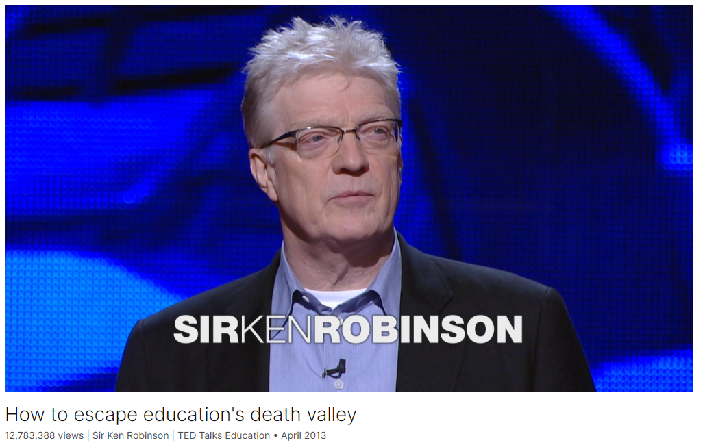

# How to escape education's death valley

Link: [https://www.ted.com/talks/sir_ken_robinson_how_to_escape_education_s_death_valley](https://www.ted.com/talks/sir_ken_robinson_how_to_escape_education_s_death_valley)

Speaker:  Sir Ken Robinson

Date: April 2013

@[toc]

## Introduction

## Vocabulary

Have you come across this idea? 你遇到过这种想法吗？

nobody was ironic in your presence. 没有人在你面前讽刺你。

mop up: 擦干；消除

It actually costs an enormous amount to mop up the damage from the dropout crisis. 实际上，消除辍学危机造成的损失需要巨额资金。

 the tip of an iceberg：冰山一角

make a bet: 打赌

I will make you a bet, and I am confident that I will win the bet.

Education under "No Child Left Behind" is based on not diversity but conformity. 不是基于多样性，而是基于一致性

What schools are encouraged to do is to find out what kids can do **across a very narrow spectrum of achievement**. 这句话的意思是：学校被鼓励去了解孩子们在非常狭窄的成就范围内能做什么。也就是说，学校通常只关注学生在少数几个学科或领域的表现，而不是全面地看待他们的各种才能和潜力。

clerical work：文职工作

doing low-grade clerical work做低级的文书工作

fidget：美 [ˈfɪdʒɪt]  坐立不安

prosper：使成功；蓬勃发展；健康成长

**Kids prosper** best with a broad curriculum that celebrates their various talents 孩子们在广泛的课程中成长得最好，这些课程颂扬他们的各种才能

Light the spark of curiosity in xxx：点燃好奇心的火花

If you can light the spark of curiosity in a child, they will learn without any further assistance, very often. 如果你能点燃孩子好奇心的火花，他们通常会在没有任何进一步帮助的情况下学习。

lifeblood：血液；命根子；生命线

Teachers are the lifeblood of the success of schools. 教师是学校成功的命脉。

You know, you're not there just to pass on received information. Great teachers do that, but what great teachers also do is mentor, stimulate, provoke, engage. 你知道，你不只是在那里传递收到的信息。伟大的教师会这样做，但伟大的教师还会指导、激励、激发和参与。

cholesterol：美 [kəˈlestərɔːl] 胆固醇

I want to know what my cholesterol level is compared to everybody else's on a standard scale 我想知道在标准范围内我的胆固醇水平和其他人相比是多少

obstruct：阻止，阻碍

 all that should support learning. It shouldn't obstruct it, which of course it often does. 不应该阻止学习

We all create our own lives through this restless process of imagining alternatives and possibilities, and one of the roles of education is to awaken and develop these powers of creativity. 我们都通过这种不停地想象各种选择和可能性的过程来创造自己的生活，而教育的作用之一就是唤醒和发展这些创造力。

bemused：美 [bɪ'mjuzd] 困惑的；发呆的；茫然的

The second is that they attribute a very high status to the teaching profession. 第二，他们认为教师职业的地位非常高。

devolve：美 [dɪˈvɑːlv] 移交；转移；

they devolve responsibility to the school level for getting the job done. 他们把完成任务的责任移交给学校。

discretion：美 [dɪˈskreʃn] 谨慎， 责任

[age of discretion] 责任年龄

and if you remove their discretion, it stops working. 如果你取消了他们的判断力，它就不起作用了

in spite of：尽管；虽然

in spite of the dominant culture of education

headwind：美 [ˈhɛdˌwɪnd]  逆风

It's like people are sailing into a headwind all the time. 就像人们一直在逆风航行。

it will all hum along perfectly into the future. 这一切都将完美地延续到未来。

carpet：用厚（或软）层覆盖；用地毯铺设

The whole floor of Death Valley was carpeted in flowers for a while. 有一段时间，死亡谷的整个地面都铺满了鲜花。

bereft：美 [bəˈrɛft] 被剥夺的；失却的；缺少的；孤寂的；

schools that were once bereft spring to life. 曾经枯竭的学校焕发了生机。

You take an area, a school, a district, you change the conditions, give people a different sense of possibility, a different set of expectations, a broader range of opportunities, you cherish and value the relationships between teachers and learners, you offer people the **discretion** to be creative and to innovate in what they do, and schools that were once bereft spring to life. 你选择一个地区、一所学校或一个学区，改变其条件，给予人们不同的可能性，不同的期望，更广泛的机会，珍惜和重视教师和学生之间的关系，给予人们创造和创新的自由，那么那些曾经贫乏的学校就会焕发生机。

这里的 "discretion" 指的是自主权或自由裁量权。具体来说，就是让人们在他们的工作中拥有自由决定和采取行动的权力，以便能够进行创造和创新。

>There's a wonderful quote
>from Benjamin Franklin.
>
>"There are three sorts
>of people in the world:
>
>Those who are immovable,
>
>people who don't get it,
>
>or don't want to do anything about it;
>
>there are people who are movable,
>
>people who see the need for change
>
>and are prepared to listen to it;
>
>and there are people who move,
>
>people who make things happen."

这段引文来自本杰明·富兰克林，描述了三种类型的人：

1. **不动的人（immovable）**：
   这些人不了解情况，或者即使了解也不愿采取任何行动。他们对变革无动于衷，拒绝改变现状。

2. **可动的人（movable）**：
   这些人看到变革的必要性，并愿意倾听。他们虽然还未采取行动，但已经意识到需要做出改变，并愿意接受新的想法和观点。

3. **行动的人（people who move）**：
   这些人不仅看到变革的必要性，而且积极采取行动来推动变革。他们是那些使事情发生的人，主动引领和实现改变。

富兰克林通过这段话强调了人们在面对变革时的不同态度和行为，并指出真正推动社会前进的是那些行动的人。

## Summary

**Summary of Sir Ken Robinson's TED Talk**

In his engaging and humorous TED Talk, Sir Ken Robinson reflects on his move to America and debunks the myth that Americans don't understand irony, using the example of the "No Child Left Behind" legislation. He critiques the current education system, highlighting its emphasis on conformity and standardized testing, which he argues stifles creativity and individual talents. Robinson points out the detrimental effects of these policies, such as high dropout rates and disengaged students, and underscores the need for a more personalized approach to education that values diversity and individual strengths.

Robinson argues that effective education should nurture curiosity and creativity. He emphasizes that teaching is a creative profession that involves mentoring and engaging students, not merely delivering information. He criticizes the focus on testing and compliance, which undermines the true purpose of education: learning. Robinson calls for a shift in perspective, where teachers are empowered to inspire curiosity and imagination in their students, fostering an environment where learning can thrive organically.

In conclusion, Robinson advocates for a transformation in education, drawing inspiration from successful systems like Finland's, which prioritize individualized learning, high-status teaching professions, and school-level responsibility. He uses the metaphor of Death Valley, which bloomed after unexpected rainfall, to illustrate that with the right conditions, any school can flourish. Robinson urges leaders to create a climate of possibility, encouraging innovation and creativity, ultimately leading to a revolution in education that better prepares students for the future.

**Ken Robinson爵士的TED演讲总结**

在他引人入胜且幽默的TED演讲中，Ken Robinson爵士回顾了他搬到美国的经历，并驳斥了美国人不懂讽刺的说法，举例说明了“No Child Left Behind”立法的讽刺意味。他批评了当前的教育体系，指出其强调一致性和标准化测试，抑制了创造力和个人才能。Robinson强调了这些政策的有害影响，如高辍学率和学生的疏离感，并强调需要更个性化的教育方法，重视多样性和个人优势。

Robinson认为，有效的教育应该培养好奇心和创造力。他强调教学是一种创造性的职业，涉及指导和吸引学生，而不仅仅是传递信息。他批评了对测试和遵从的过度关注，这破坏了教育的真正目的：学习。Robinson呼吁改变视角，让教师能够激发学生的好奇心和想象力，营造一种有机成长的学习环境。

最后，Robinson主张对教育进行变革，从成功的系统（如芬兰的教育系统）中汲取灵感，这些系统优先考虑个性化学习、高地位的教学职业和学校层面的责任感。他用死亡谷的隐喻来说明，在适当的条件下，任何学校都可以繁荣。Robinson敦促领导者创造一种可能性的氛围，鼓励创新和创造力，最终引发一场教育革命，更好地为学生的未来做好准备。

## Transcript

Thank you very much.

I moved to America 12 years ago
with my wife Terry and our two kids.

Actually, truthfully, we moved
to Los Angeles --

(Laughter)

thinking we were moving
to America, but anyway --

(Laughter)

It's a short plane ride
from Los Angeles to America.

(Laughter)

I got here 12 years ago,

and when I got here,
I was told various things,

like, "Americans don't get irony."

(Laughter)

Have you come across this idea?

It's not true.

I've traveled the whole length
and breadth of this country.

I have found no evidence
that Americans don't get irony.

It's one of those cultural myths,

like, "The British are reserved."

(Laughter)

I don't know why people think this.

We've invaded every country
we've encountered.

(Laughter)

But it's not true Americans
don't get irony,

but I just want you to know
that that's what people

are saying about you behind your back.

You know, so when you leave
living rooms in Europe,

people say, thankfully,
nobody was ironic in your presence.

(Laughter)

But I knew that Americans get irony

when I came across that legislation,
"No Child Left Behind."

(Laughter)

Because whoever thought
of that title gets irony.

(Laughter)

Don't they?

(Applause)

Because it's leaving
millions of children behind.

Now I can see that's not a very attractive
name for legislation:

"Millions of Children Left Behind."

I can see that.

What's the plan?

We propose to leave
millions of children behind,

and here's how it's going to work.

And it's working beautifully.

(Laughter)

In some parts of the country,

60 percent of kids drop out
of high school.

In the Native American communities,

it's 80 percent of kids.

If we halved that number,

one estimate is it would create
a net gain to the U.S. economy

over 10 years,
of nearly a trillion dollars.

From an economic point of view,

this is good math, isn't it,
that we should do this?

It actually costs an enormous amount

to mop up the damage
from the dropout crisis.

But the dropout crisis
is just the tip of an iceberg.

What it doesn't count
are all the kids who are in school

but being disengaged
from it, who don't enjoy it,

who don't get any real benefit from it.

And the reason is not
that we're not spending enough money.

America spends more money on education
than most other countries.

Class sizes are smaller
than in many countries.

And there are hundreds
of initiatives every year

to try and improve education.

The trouble is, it's all going
in the wrong direction.

There are three principles
on which human life flourishes,

and they are contradicted
by the culture of education

under which most teachers have to labor

and most students have to endure.

The first is this, that human beings
are naturally different and diverse.

Can I ask you, how many of you
have got children of your own?

Okay. Or grandchildren.

How about two children or more? Right.

And the rest of you
have seen such children.

(Laughter)

Small people wandering about.

(Laughter)

I will make you a bet,

and I am confident
that I will win the bet.

If you've got two children or more,

I bet you they are completely
different from each other.

Aren't they?

(Applause)

You would never confuse them, would you?

Like, "Which one are you? Remind me."

(Laughter)

"Your mother and I need
some color-coding system

so we don't get confused."

Education under "No Child Left Behind"

is based on not diversity but conformity.

What schools are encouraged
to do is to find out

what kids can do across
a very narrow spectrum of achievement.

One of the effects
of "No Child Left Behind"

has been to narrow the focus
onto the so-called STEM disciplines.

They're very important.

I'm not here to argue
against science and math.

On the contrary, they're necessary
but they're not sufficient.

A real education has to give equal weight

to the arts, the humanities,
to physical education.

An awful lot of kids, sorry, thank you --

(Applause)

One estimate in America currently
is that something like 10 percent of kids,

getting on that way,

are being diagnosed
with various conditions

under the broad title
of attention deficit disorder.

ADHD.

I'm not saying there's no such thing.

I just don't believe
it's an epidemic like this.

If you sit kids down, hour after hour,

doing low-grade clerical work,

don't be surprised if they start
to fidget, you know?

(Laughter)

(Applause)

Children are not, for the most part,
suffering from a psychological condition.

They're suffering from childhood.

(Laughter)

And I know this because
I spent my early life as a child.

I went through the whole thing.

Kids prosper best with a broad curriculum
that celebrates their various talents,

not just a small range of them.

And by the way, the arts
aren't just important

because they improve math scores.

They're important because they speak
to parts of children's being

which are otherwise untouched.

The second, thank you --

(Applause)

The second principle
that drives human life flourishing

is curiosity.

If you can light the spark
of curiosity in a child,

they will learn without any further
assistance, very often.

Children are natural learners.

It's a real achievement
to put that particular ability out,

or to stifle it.

Curiosity is the engine of achievement.

Now the reason I say this

is because one of the effects
of the current culture here,

if I can say so,

has been to de-professionalize teachers.

There is no system in the world
or any school in the country

that is better than its teachers.

Teachers are the lifeblood
of the success of schools.

But teaching is a creative profession.

Teaching, properly conceived,
is not a delivery system.

You know, you're not there just
to pass on received information.

Great teachers do that,

but what great teachers also do is mentor,

stimulate, provoke, engage.

You see, in the end,
education is about learning.

If there's no learning going on,
there's no education going on.

And people can spend an awful lot of time

discussing education
without ever discussing learning.

The whole point of education
is to get people to learn.

An old friend of mine --
actually very old, he's dead.

(Laughter)

That's as old as it gets, I'm afraid.

(Laughter)

But a wonderful guy he was,
wonderful philosopher.

He used to talk about the difference

between the task
and achievement senses of verbs.

You can be engaged
in the activity of something,

but not really be
achieving it, like dieting.

(Laughter)

It's a very good example.

There he is. He's dieting.

Is he losing any weight? Not really.

(Laughter)

Teaching is a word like that.

You can say, "There's Deborah,
she's in room 34, she's teaching."

But if nobody's learning anything,

she may be engaged in the task of teaching
but not actually fulfilling it.

The role of a teacher
is to facilitate learning.

That's it.

And part of the problem is, I think,

that the dominant culture
of education has come to focus

on not teaching and learning, but testing.

Now, testing is important.

Standardized tests have a place.

But they should not be
the dominant culture of education.

They should be diagnostic.
They should help.

(Applause)

If I go for a medical examination,
I want some standardized tests.

I do.

I want to know
what my cholesterol level is

compared to everybody else's
on a standard scale.

I don't want to be told on some scale
my doctor invented in the car.

(Laughter)

"Your cholesterol
is what I call Level Orange."

"Really?"

(Laughter)

"Is that good?" "We don't know."

(Laughter)

But all that should support learning.

It shouldn't obstruct it,
which of course it often does.

So in place of curiosity,
what we have is a culture of compliance.

Our children and teachers are encouraged
to follow routine algorithms

rather than to excite that power
of imagination and curiosity.

And the third principle is this:
that human life is inherently creative.

It's why we all have different résumés.

We create our lives,

and we can recreate them
as we go through them.

It's the common currency
of being a human being.

It's why human culture
is so interesting and diverse and dynamic.

I mean, other animals may well have
imaginations and creativity,

but it's not so much
in evidence, is it, as ours?

I mean, you may have a dog.

And your dog may get depressed.

You know, but it doesn't listen
to Radiohead, does it?

(Laughter)

And sit staring out the window
with a bottle of Jack Daniels.

(Laughter)

"Would you like to come for a walk?"

"No, I'm fine."

(Laughter)

"You go. I'll wait. But take pictures."

(Laughter)

We all create our own lives
through this restless process

of imagining alternatives
and possibilities,

and one of the roles of education

is to awaken and develop
these powers of creativity.

Instead, what we have
is a culture of standardization.

Now, it doesn't have to be that way.

It really doesn't.

Finland regularly comes out on top
in math, science and reading.

Now, we only know
that's what they do well at,

because that's all that's being tested.

That's one of the problems of the test.

They don't look for other things
that matter just as much.

The thing about work in Finland is this:

they don't obsess about those disciplines.

They have a very broad
approach to education,

which includes humanities,
physical education, the arts.

Second, there is no standardized
testing in Finland.

I mean, there's a bit,

but it's not what gets
people up in the morning,

what keeps them at their desks.

The third thing --
and I was at a meeting recently

with some people from Finland,
actual Finnish people,

and somebody from the American system
was saying to the people in Finland,

"What do you do
about the drop-out rate in Finland?"

And they all looked a bit
bemused, and said,

"Well, we don't have one.

Why would you drop out?

If people are in trouble,
we get to them quite quickly

and we help and support them."

Now people always say,

"Well, you know, you can't compare
Finland to America."

No. I think there's a population
of around five million in Finland.

But you can compare it
to a state in America.

Many states in America
have fewer people in them than that.

I mean, I've been
to some states in America

and I was the only person there.

(Laughter)

Really. Really.

I was asked to lock up when I left.

(Laughter)

But what all the high-performing
systems in the world do

is currently what is not evident, sadly,

across the systems in America --

I mean, as a whole.

One is this:

they individualize teaching and learning.

They recognize that it's students
who are learning

and the system has to engage them,

their curiosity, their individuality,
and their creativity.

That's how you get them to learn.

The second is that they attribute
a very high status

to the teaching profession.

They recognize
that you can't improve education

if you don't pick great people to teach
and keep giving them

constant support
and professional development.

Investing in professional
development is not a cost.

It's an investment,

and every other country
that's succeeding well knows that,

whether it's Australia, Canada,

South Korea, Singapore,
Hong Kong or Shanghai.

They know that to be the case.

And the third is,

they devolve responsibility
to the school level

for getting the job done.

You see, there's a big difference here

between going into a mode of command
and control in education --

That's what happens in some systems.

Central or state governments decide,

they know best and they're going
to tell you what to do.

The trouble is that education
doesn't go on

in the committee rooms
of our legislative buildings.

It happens in classrooms and schools,

and the people who do it
are the teachers and the students,

and if you remove their discretion,
it stops working.

You have to put it back to the people.

(Applause)

There is wonderful work
happening in this country.

But I have to say it's happening

in spite of the dominant
culture of education,

not because of it.

It's like people are sailing
into a headwind all the time.

And the reason I think is this:

that many of the current policies

are based on mechanistic
conceptions of education.

It's like education
is an industrial process

that can be improved
just by having better data,

and somewhere in the back of the mind
of some policy makers

is this idea that if we fine-tune it
well enough, if we just get it right,

it will all hum along perfectly
into the future.

It won't, and it never did.

The point is that education
is not a mechanical system.

It's a human system.

It's about people,

people who either do want
to learn or don't want to learn.

Every student who drops
out of school has a reason for it

which is rooted in their own biography.

They may find it boring.

They may find it irrelevant.

They may find that it's at odds with
the life they're living outside of school.

There are trends,
but the stories are always unique.

I was at a meeting recently
in Los Angeles of --

they're called alternative
education programs.

These are programs designed
to get kids back into education.

They have certain common features.

They're very personalized.

They have strong support for the teachers,

close links with the community
and a broad and diverse curriculum,

and often programs which involve students
outside school as well as inside school.

And they work.

What's interesting to me is,
these are called "alternative education."

(Laughter)

You know?

And all the evidence
from around the world is,

if we all did that, there'd be
no need for the alternative.

(Applause)

(Applause ends)

So I think we have to embrace
a different metaphor.

We have to recognize
that it's a human system,

and there are conditions
under which people thrive,

and conditions under which they don't.

We are after all organic creatures,

and the culture of the school
is absolutely essential.

Culture is an organic term, isn't it?

Not far from where I live
is a place called Death Valley.

Death Valley is the hottest,
driest place in America,

and nothing grows there.

Nothing grows there
because it doesn't rain.

Hence, Death Valley.

In the winter of 2004,
it rained in Death Valley.

Seven inches of rain fell
over a very short period.

And in the spring of 2005,
there was a phenomenon.

The whole floor of Death Valley
was carpeted in flowers for a while.

What it proved is this:

that Death Valley isn't dead.

It's dormant.

Right beneath the surface
are these seeds of possibility

waiting for the right conditions
to come about,

and with organic systems,
if the conditions are right,

life is inevitable.

It happens all the time.

You take an area, a school, a district,

you change the conditions, give people
a different sense of possibility,

a different set of expectations,
a broader range of opportunities,

you cherish and value the relationships
between teachers and learners,

you offer people
the discretion to be creative

and to innovate in what they do,

and schools that were once
bereft spring to life.

Great leaders know that.

The real role of leadership
in education --

and I think it's true
at the national level,

the state level, at the school level --

is not and should not be
command and control.

The real role of leadership
is climate control,

creating a climate of possibility.

And if you do that, people will rise to it

and achieve things
that you completely did not anticipate

and couldn't have expected.

There's a wonderful quote
from Benjamin Franklin.

"There are three sorts
of people in the world:

Those who are immovable,

people who don't get it,

or don't want to do anything about it;

there are people who are movable,

people who see the need for change

and are prepared to listen to it;

and there are people who move,

people who make things happen."

And if we can encourage more people,
that will be a movement.

And if the movement is strong enough,

that's, in the best sense
of the word, a revolution.

And that's what we need.

Thank you very much.

(Applause)

Thank you very much.

(Applause)

## Afterword

2024年5月26日于上海。

