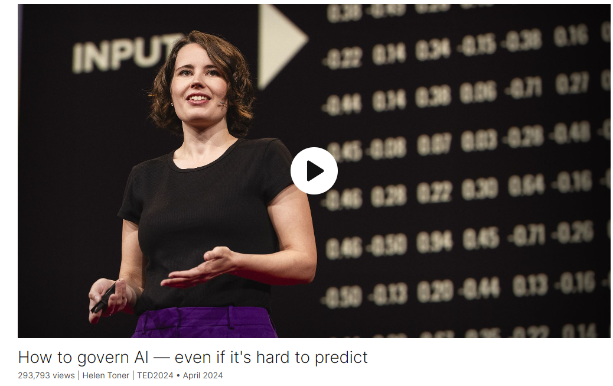

# How to govern AI — even if it's hard to predict

Link: [https://www.ted.com/talks/helen_toner_how_to_govern_ai_even_if_it_s_hard_to_predict?](https://www.ted.com/talks/helen_toner_how_to_govern_ai_even_if_it_s_hard_to_predict?)

Speaker:  Helen Toner

Date: April 2024

@[toc]

## Introduction

No one truly understands AI, not even experts, says Helen Toner, an AI policy researcher and former board member of OpenAI. But that doesn't mean we can't govern it. She shows how we can make smart policies to regulate this technology even as we struggle to predict where it's headed — and why the right actions, right now, can shape the future we want.

## Vocabulary

But when it comes to how they work on the inside, there are **serious limits to how much we know**. 但是，当谈到它们在内部如何工作时，我们知道的程度有很大的限制。

hurdle: 美 [ˈhɜːrdl] 障碍；难关；临时围栏；

And the fact that we have such a hard time understanding what's going on with the technology and predicting where it will go next, is one of the biggest hurdles we face in figuring out how to govern AI. 事实上，我们很难理解这项技术的进展并预测它的下一步走向，这是我们在解决如何治理人工智能方面面临的最大障碍之一。

forge: 美 [fɔːrdʒ] 锻造；铸造；稳步前进；创造；缔造

forge a path: 开辟一条路

We have to forge some kind of path forward anyway.无论如何，我们必须开辟一条前进的道路。

different experts have completely different intuitions about **what lies at the heart of** intelligence.不同的专家对智能的核心有完全不同的直觉。

a far cry： 相去甚远

But it's a far cry from being able to do everything as well as you or I could do it. 但要做到你我都能做的那么好还相差甚远。

tease apart：分离出来，区分

 we don't yet have good ways of teasing apart what they're all doing.我们还没有很好的方法来区分他们都在做什么。

So how do we govern this technology that **we struggle to** understand and predict? 那么我们如何管理这项我们难以理解和预测的技术呢？

intimidated：美 [ɪnˈtɪmɪdeɪtɪd] 害怕的；受到威胁的

First, don't be intimidated. 首先，不要被吓倒。

opaque：美 [oʊˈpeɪk] 不透明的；不透光的；晦涩的；难理解的

opacity: 美 [oʊˈpæsədi]  不透明

 even the parts we don't understand won't be opaque forever. 即使是我们不理解的部分也不会永远不透明。

Machiavellian：美 [ˌmɑkiəˈvɛliən] 狡猾的；诡计多端的；不择手段的；马雅基弗利的

elbow deep in： **deeply engaged** (in work, etc.) 深度参与

entitled to：有权做某事，有资格

technologists sometimes act as though if you're not elbows deep in the technical details, then you're not entitled to an opinion on what we should do with it. 技术专家有时表现得好像如果你不深入研究技术细节，那么你就没有资格对我们应该如何处理它发表意见。

Second, we need to focus on adaptability, not certainty. 第二，我们需要关注适应性，而不是确定性。

get bogged down： 陷入泥潭；停滞不前；陷入困境

A lot of conversations about how to make policy for AI get bogged down in fights 许多关于如何为人工智能制定政策的对话陷入了争斗

slam：猛烈撞击；砰地被关上；猛撞；使劲推

slamming on the brakes：急刹车

hit the gas：踩油门

it’s not just a choice between slamming on the brakes or hitting the gas. 这不仅仅是在急刹车或踩油门之间的选择。

twists and turns：山路迂回曲折；复杂（或曲折）变化

steering system：转向系统

windshield：美 [ˈwɪndʃiːld] 挡风玻璃

If you're driving down a road with unexpected twists and turns, then two things that will help you a lot are having a clear view out the windshield and an excellent steering system. 如果你在一条意想不到的曲折道路上行驶，那么对你有很大帮助的两件事是挡风玻璃外的清晰视野和出色的转向系统。

political beliefs：政治信仰

rudimentary：初级的，初步的，未成熟的

Right now, if we want to figure out whether an AI can do something concerning, like hack critical infrastructure or persuade someone to change their political beliefs, our methods of measuring that are rudimentary. 现在，如果我们想弄清楚一个人工智能是否能做一些令人担忧的事情，比如入侵关键基础设施或说服某人改变他们的政治信仰，我们衡量这些的方法还很初级。

Just like the data we collect on plane crashes and cyber attacks. 就像我们收集的飞机失事和网络攻击的数据一样。

And by default, it looks like the enormous power of more advanced AI systems might **stay concentrated in the hands of** a small number of companies, or even a small number of individuals. 默认情况下，看起来更先进的人工智能系统的巨大力量可能会继续集中在少数公司甚至少数个人手中。

tempting：诱人的

So as tempting as it might be, we can't wait for clarity or expert consensus to figure out what we want to happen with AI. 因此，尽管这可能很诱人，但我们不能等待明确性或专家共识来弄清楚我们希望人工智能发生什么。

arena：美 [əˈriːnə]场地；活动场所；辩论场所

and then we can get in the arena and push for futures we actually want. 然后我们可以进入场地，推动我们真正想要的未来。

## Transcript

When I talk to people
about artificial intelligence,

something I hear a lot from non-experts
is “I don’t understand AI.”

But when I talk to experts,
a funny thing happens.

They say, “I don’t understand AI,
and neither does anyone else.”

This is a pretty strange state of affairs.

Normally, the people
building a new technology

understand how it works inside and out.

But for AI, a technology that's radically
reshaping the world around us,

that's not so.

Experts do know plenty about how to build
and run AI systems, of course.

But when it comes to how
they work on the inside,

there are serious limits
to how much we know.

And this matters because without
deeply understanding AI,

it's really difficult for us to know
what it will be able to do next,

or even what it can do now.

And the fact that we have
such a hard time understanding

what's going on with the technology
and predicting where it will go next,

is one of the biggest hurdles we face
in figuring out how to govern AI.

But AI is already all around us,

so we can't just sit around and wait
for things to become clearer.

We have to forge some kind
of path forward anyway.

I've been working on these AI
policy and governance issues

for about eight years,

First in San Francisco,
now in Washington, DC.

Along the way, I've gotten an inside look

at how governments are working
to manage this technology.

And inside the industry,
I've seen a thing or two as well.

So I'm going to share a couple of ideas

for what our path
to governing AI could look like.

But first, let's talk about what actually
makes AI so hard to understand

and predict.

One huge challenge in building
artificial "intelligence"

is that no one can agree
on what it actually means

to be intelligent.

This is a strange place to be in
when building a new tech.

When the Wright brothers started
experimenting with planes,

they didn't know how to build one,

but everyone knew what it meant to fly.

With AI on the other hand,

different experts have
completely different intuitions

about what lies
at the heart of intelligence.

Is it problem solving?

Is it learning and adaptation,

are emotions,

or having a physical body
somehow involved?

We genuinely don't know.

But different answers lead
to radically different expectations

about where the technology is going
and how fast it'll get there.

An example of how we're confused
is how we used to talk

about narrow versus general AI.

For a long time, we talked
in terms of two buckets.

A lot of people thought we should
just be dividing between narrow AI,

trained for one specific task,

like recommending the next YouTube video,

versus artificial general
intelligence, or AGI,

that could do everything a human could do.

We thought of this distinction,
narrow versus general,

as a core divide between
what we could build in practice

and what would actually be intelligent.

But then a year or two ago,
along came ChatGPT.

If you think about it,

you know, is it narrow AI,
trained for one specific task?

Or is it AGI and can do
everything a human can do?

Clearly the answer is neither.

It's certainly general purpose.

It can code, write poetry,

analyze business problems,
help you fix your car.

But it's a far cry
from being able to do everything

as well as you or I could do it.

So it turns out this idea of generality

doesn't actually seem to be
the right dividing line

between intelligent and not.

And this kind of thing

is a huge challenge
for the whole field of AI right now.

We don't have any agreement
on what we're trying to build

or on what the road map
looks like from here.

We don't even clearly understand
the AI systems that we have today.

Why is that?

Researchers sometimes describe
deep neural networks,

the main kind of AI being built today,

as a black box.

But what they mean by that
is not that it's inherently mysterious

and we have no way
of looking inside the box.

The problem is that when
we do look inside,

what we find are millions,

billions or even trillions of numbers

that get added and multiplied together
in a particular way.

What makes it hard for experts
to know what's going on

is basically just,
there are too many numbers,

and we don't yet have good ways
of teasing apart what they're all doing.

There's a little bit more to it
than that, but not a lot.

So how do we govern this technology

that we struggle
to understand and predict?

I'm going to share two ideas.

One for all of us
and one for policymakers.

First, don't be intimidated.

Either by the technology itself

or by the people
and companies building it.

On the technology,

AI can be confusing, but it's not magical.

There are some parts of AI systems
we do already understand well,

and even the parts we don't understand
won't be opaque forever.

An area of research
known as “AI interpretability”

has made quite a lot of progress
in the last few years

in making sense of what all those
billions of numbers are doing.

One team of researchers, for example,

found a way to identify
different parts of a neural network

that they could dial up or dial down

to make the AI's answers
happier or angrier,

more honest,

more Machiavellian, and so on.

If we can push forward
this kind of research further,

then five or 10 years from now,

we might have a much clearer
understanding of what's going on

inside the so-called black box.

And when it comes to those
building the technology,

technologists sometimes act as though

if you're not elbows deep
in the technical details,

then you're not entitled to an opinion
on what we should do with it.

Expertise has its place, of course,

but history shows us how important it is

that the people affected
by a new technology

get to play a role
in shaping how we use it.

Like the factory workers in the 20th
century who fought for factory safety,

or the disability advocates

who made sure the world
wide web was accessible.

You don't have to be a scientist
or engineer to have a voice.

(Applause)

Second, we need to focus
on adaptability, not certainty.

A lot of conversations
about how to make policy for AI

get bogged down in fights
between, on the one side,

people saying, "We have to regulate AI
really hard right now

because it's so risky."

And on the other side, people saying,

“But regulation will kill innovation,
and those risks are made up anyway.”

But the way I see it,

it’s not just a choice
between slamming on the brakes

or hitting the gas.

If you're driving down a road
with unexpected twists and turns,

then two things that will help you a lot

are having a clear view out the windshield

and an excellent steering system.

In AI, this means having a clear picture
of where the technology is

and where it's going,

and having plans in place
for what to do in different scenarios.

Concretely, this means things like
investing in our ability to measure

what AI systems can do.

This sounds nerdy, but it really matters.

Right now, if we want to figure out

whether an AI can do something concerning,

like hack critical infrastructure

or persuade someone to change
their political beliefs,

our methods of measuring that
are rudimentary.

We need better.

We should also be requiring AI companies,

especially the companies building
the most advanced AI systems,

to share information
about what they're building,

what their systems can do

and how they're managing risks.

And they should have to let in external
AI auditors to scrutinize their work

so that the companies aren't just
grading their own homework.

(Applause)

A final example of what this can look like

is setting up incident
reporting mechanisms,

so that when things do go wrong
in the real world,

we have a way to collect data
on what happened

and how we can fix it next time.

Just like the data we collect
on plane crashes and cyber attacks.

None of these ideas are mine,

and some of them are already starting
to be implemented in places like Brussels,

London, even Washington.

But the reason
I'm highlighting these ideas,

measurement, disclosure,
incident reporting,

is that they help us
navigate progress in AI

by giving us a clearer view
out the windshield.

If AI is progressing
fast in dangerous directions,

these policies will help us see that.

And if everything is going smoothly,
they'll show us that too,

and we can respond accordingly.

What I want to leave you with

is that it's both true
that there's a ton of uncertainty

and disagreement in the field of AI.

And that companies are already
building and deploying AI

all over the place anyway
in ways that affect all of us.

Left to their own devices,

it looks like AI companies might go
in a similar direction

to social media companies,

spending most of their resources
on building web apps

and for users' attention.

And by default, it looks like the enormous
power of more advanced AI systems

might stay concentrated in the hands
of a small number of companies,

or even a small number of individuals.

But AI's potential goes
so far beyond that.

AI already lets us leap
over language barriers

and predict protein structures.

More advanced systems could unlock clean,
limitless fusion energy

or revolutionize how we grow food

or 1,000 other things.

And we each have a voice in what happens.

We're not just data sources,

we are users,

we're workers,

we're citizens.

So as tempting as it might be,

we can't wait for clarity
or expert consensus

to figure out what we want
to happen with AI.

AI is already happening to us.

What we can do is put policies in place

to give us as clear
a picture as we can get

of how the technology is changing,

and then we can get in the arena
and push for futures we actually want.

Thank you.

(Applause)

## Summary

In Helen Toner's speech, she discusses the challenges surrounding understanding and governing artificial intelligence (AI). Non-experts often express confusion about AI, while even experts admit to limited understanding. Toner highlights the importance of grasping AI's inner workings to anticipate its future capabilities. She emphasizes the need for proactive governance despite the complexity of AI technology.

Toner delves into the difficulty in defining intelligence, a crucial aspect in AI development. The absence of consensus among experts complicates predicting AI's trajectory. Traditional distinctions between narrow and general AI are blurred by advancements like ChatGPT. Toner stresses the necessity of agreement on AI's purpose to inform regulatory efforts effectively.

Despite AI's opacity, Toner encourages engagement rather than intimidation. She advocates for transparent research and inclusive policymaking to address AI's risks and potentials. Toner proposes measures such as improved measurement standards, mandatory disclosure from AI companies, and incident reporting mechanisms. These efforts aim to foster adaptability and provide a clearer view of AI's development path.

In conclusion, Toner urges active participation in shaping AI's future. She emphasizes the importance of informed governance to steer AI's progress responsibly. By promoting transparency, accountability, and public involvement, Toner advocates for a collective effort in navigating the complexities of AI technology.

## 后记

2024年5月4日16点16分完成这篇演讲的学习。

2024年5月4日于上海。