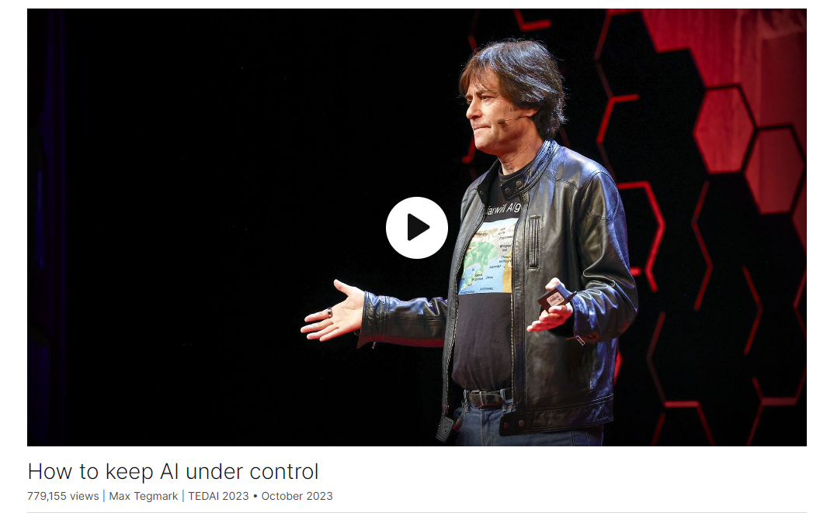
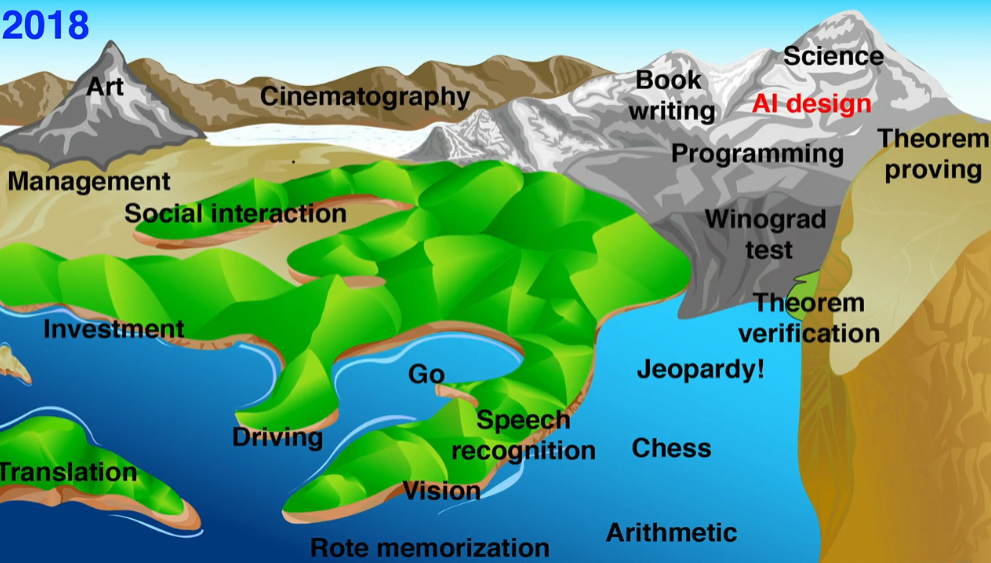

# How to keep AI under control

Link: [How to keep AI under control](https://www.ted.com/talks/max_tegmark_how_to_keep_ai_under_control?referrer=playlist-the_must_watch_ted_talks_on_ai_from_2023&autoplay=true)

Speaker:  Max Tegmark 

>**Max Erik Tegmark** (born 5 May 1967)[[1\]](https://en.wikipedia.org/wiki/Max_Tegmark#cite_note-1) is a Swedish-American physicist, [machine learning](https://en.wikipedia.org/wiki/Machine_learning) researcher and author.[[2\]](https://en.wikipedia.org/wiki/Max_Tegmark#cite_note-2) He is best known for his book [Life 3.0](https://en.wikipedia.org/wiki/Life_3.0) about what the world might look like as [artificial intelligence](https://en.wikipedia.org/wiki/Artificial_intelligence) continues to improve. Tegmark is a professor at the [Massachusetts Institute of Technology](https://en.wikipedia.org/wiki/Massachusetts_Institute_of_Technology) and the president of the [Future of Life Institute](https://en.wikipedia.org/wiki/Future_of_Life_Institute).[[3\]](https://en.wikipedia.org/wiki/Max_Tegmark#cite_note-3)[[4\]](https://en.wikipedia.org/wiki/Max_Tegmark#cite_note-4)
>
>Source: https://en.wikipedia.org/wiki/Max_Tegmark

Date: October 2023

@[toc]

## Introduction

The current explosion of exciting commercial and open-source AI is likely to be followed, within a few years, by creepily superintelligent AI – which top researchers and experts fear could disempower or wipe out humanity. Scientist Max Tegmark describes an optimistic vision for how we can keep AI under control and ensure it's working for us, not the other way around.

目前，令人兴奋的商业和开源人工智能正在蓬勃发展，几年内，令人毛骨悚然的超级智能人工智能很可能会随之而来--顶尖研究人员和专家担心，这种人工智能可能会削弱或毁灭人类。科学家马克斯-泰格马克（Max Tegmark）描述了一个乐观的愿景，即我们如何才能控制人工智能，确保它为我们工作，而不是相反。

## Vocabulary

disempower: 美 [ˌdɪsəmˈpaʊər] 削减…的权力；使丧失信心

submerge: 美 [səbˈmɜːrdʒ]  淹没，浸入水中

plummet：美 [ˈplʌmɪt] 快速落下，骤降

plummeting from 20 years away to three years away

skeptic:美 [ˈskeptɪk]  怀疑论者

creepy：美 [ˈkriːpi]  令人毛骨悚然的，令人不安的

amoral：美 [eɪˈmɔrəl]  无道德感的，不关心是非的

psychopath：美 [ˈsaɪkəˌpæθ] 精神变态者；精神病患者；

amoral psychopath：无道德感的精神病患者

try to raise our spirits and cheer ourselves up 努力打起精神，让自己振作起来

provable：可证明的；可以查清的；provably

Try to see how we can make provably safe AI that we can control. 试着看看我们如何能制造出我们可以控制的可证明安全的人工智能。

venerable：值得尊敬的；尊敬的

There's a venerable field called formal verification, which proves stuff about code. 有一个古老的领域叫做形式验证，它证明了关于代码的东西。

if they're all too complicated for any human to grasp? 如果它们对任何人来说都太复杂而难以理解呢？

nail the task：完成任务

heed：美 [hiːd] 注意，留心

hubris：美 [ˈ(h)jubrəs] 傲慢，自大

Let's heed the warning from ancient Greece and not get hubris, like in the story of Icarus. 让我们听从古希腊的警告，不要像伊卡洛斯的故事那样骄傲自大。

## Transcript

Five years ago,

I stood on the TED stage

and warned about the dangers
of superintelligence.

I was wrong.

It went even worse than I thought.

(Laughter)

I never thought governments
would let AI companies get this far

without any meaningful regulation.

And the progress of AI
went even faster than I predicted.

Look, I showed this abstract
landscape of tasks

where the elevation represented
how hard it was for AI

to do each task at human level.

And the sea level represented
what AI could be back then.

And boy or boy, has the sea
been rising fast ever since.

But a lot of these tasks have already
gone blub blub blub blub blub blub.

And the water is on track
to submerge all land,

matching human intelligence
at all cognitive tasks.

This is a definition of artificial
general intelligence, AGI,

which is the stated goal
of companies like OpenAI,

Google DeepMind and Anthropic.

And these companies are also trying
to build superintelligence,

leaving human intelligence far behind.

And many think it'll only be a few years,
maybe, from AGI to superintelligence.

So when are we going to get AGI?

Well, until recently, most AI researchers
thought it was at least decades away.

And now Microsoft is saying,
"Oh, it's almost here."

We're seeing sparks of AGI in ChatGPT-4,

and the Metaculus betting site
is showing the time left to AGI

plummeting from 20 years away
to three years away

in the last 18 months.

And leading industry people
are now predicting

that we have maybe two or three years left
until we get outsmarted.

So you better stop talking
about AGI as a long-term risk,

or someone might call you a dinosaur
stuck in the past.

It's really remarkable
how AI has progressed recently.

Not long ago, robots moved like this.

(Music)

Now they can dance.

(Music)

Just last year, Midjourney
produced this image.

This year, the exact
same prompt produces this.

Deepfakes are getting really convincing.

(Video) Deepfake Tom Cruise:
I’m going to show you some magic.

It's the real thing.

(Laughs)

I mean ...

It's all ...

the real ...

thing.

Max Tegmark: Or is it?

And Yoshua Bengio now argues

that large language models
have mastered language

and knowledge to the point
that they pass the Turing test.

I know some skeptics are saying,

"Nah, they're just overhyped
stochastic parrots

that lack a model of the world,"

but they clearly have
a representation of the world.

In fact, we recently found that Llama-2
even has a literal map of the world in it.

And AI also builds

geometric representations
of more abstract concepts

like what it thinks is true and false.

So what's going to happen
if we get AGI and superintelligence?

If you only remember one thing
from my talk, let it be this.

AI godfather, Alan Turing predicted

that the default outcome
is the machines take control.

The machines take control.

I know this sounds like science fiction,

but, you know, having AI as smart as GPT-4

also sounded like science
fiction not long ago.

And if you think of AI,

if you think of superintelligence
in particular, as just another technology,

like electricity,

you're probably not very worried.

But you see,

Turing thinks of superintelligence
more like a new species.

Think of it,

we are building creepy, super capable,

amoral psychopaths

that don't sleep and think
much faster than us,

can make copies of themselves

and have nothing human about them at all.

So what could possibly go wrong?

(Laughter)

And it's not just Turing.

OpenAI CEO Sam Altman,
who gave us ChatGPT,

recently warned that it could
be "lights out for all of us."

Anthropic CEO, Dario Amodei,
even put a number on this risk:

10-25 percent.

And it's not just them.

Human extinction from AI
went mainstream in May

when all the AGI CEOs
and who's who of AI researchers

came on and warned about it.

And last month, even the number one
of the European Union

warned about human extinction by AI.

So let me summarize
everything I've said so far

in just one slide of cat memes.

Three years ago,

people were saying it's inevitable,
superintelligence,

it'll be fine,

it's decades away.

Last year it was more like,

It's inevitable, it'll be fine.

Now it's more like,

It's inevitable.

(Laughter)

But let's take a deep breath
and try to raise our spirits

and cheer ourselves up,

because the rest of my talk
is going to be about the good news,

that it's not inevitable,
and we can absolutely do better,

alright?

(Applause)

So ...

The real problem is that we lack
a convincing plan for AI safety.

People are working hard on evals

looking for risky AI behavior,
and that's good,

but clearly not good enough.

They're basically training AI
to not say bad things

rather than not do bad things.

Moreover, evals and debugging
are really just necessary,

not sufficient, conditions for safety.

In other words,

they can prove the presence of risk,

not the absence of risk.

So let's up our game, alright?

Try to see how we can make
provably safe AI that we can control.

Guardrails try to physically limit harm.

But if your adversary is superintelligence

or a human using superintelligence
against you, right,

trying is just not enough.

You need to succeed.

Harm needs to be impossible.

So we need provably safe systems.

Provable, not in the weak sense
of convincing some judge,

but in the strong sense of there being
something that's impossible

according to the laws of physics.

Because no matter how smart an AI is,

it can't violate the laws of physics
and do what's provably impossible.

Steve Omohundro and I
wrote a paper about this,

and we're optimistic
that this vision can really work.

So let me tell you a little bit about how.

There's a venerable field
called formal verification,

which proves stuff about code.

And I'm optimistic that AI will
revolutionize automatic proving business

and also revolutionize program synthesis,

the ability to automatically
write really good code.

So here is how our vision works.

You, the human, write a specification

that your AI tool must obey,

that it's impossible to log in
to your laptop

without the correct password,

or that a DNA printer
cannot synthesize dangerous viruses.

Then a very powerful AI
creates both your AI tool

and a proof that your tool
meets your spec.

Machine learning is uniquely good
at learning algorithms,

but once the algorithm has been learned,

you can re-implement it in a different
computational architecture

that's easier to verify.

Now you might worry,

how on earth am I going
to understand this powerful AI

and the powerful AI tool it built

and the proof,

if they're all too complicated
for any human to grasp?

Here is the really great news.

You don't have to understand
any of that stuff,

because it's much easier to verify
a proof than to discover it.

So you only have to understand
or trust your proof-checking code,

which could be just
a few hundred lines long.

And Steve and I envision

that such proof checkers get built
into all our compute hardware,

so it just becomes impossible
to run very unsafe code.

What if the AI, though,
isn't able to write that AI tool for you?

Then there's another possibility.

You train an AI to first just learn
to do what you want

and then you use a different AI

to extract out the learned algorithm
and knowledge for you,

like an AI neuroscientist.

This is in the spirit of the field
of mechanistic interpretability,

which is making really
impressive rapid progress.

Provably safe systems
are clearly not impossible.

Let's look at a simple example

of where we first machine-learn
an algorithm from data

and then distill it out
in the form of code

that provably meets spec, OK?

Let’s do it with an algorithm
that you probably learned in first grade,

addition,

where you loop over the digits
from right to left,

and sometimes you do a carry.

We'll do it in binary,

as if you were counting
on two fingers instead of ten.

And we first train a recurrent
neural network,

never mind the details,

to nail the task.

So now you have this algorithm
that you don't understand how it works

in a black box

defined by a bunch of tables
of numbers that we, in nerd speak,

call parameters.

Then we use an AI tool we built
to automatically distill out from this

the learned algorithm
in the form of a Python program.

And then we use the formal
verification tool known as Dafny

to prove that this program
correctly adds up any numbers,

not just the numbers
that were in your training data.

So in summary,

provably safe AI,
I'm convinced is possible,

but it's going to take time and work.

And in the meantime,

let's remember that all the AI benefits

that most people are excited about

actually don't require superintelligence.

We can have a long
and amazing future with AI.

So let's not pause AI.

Let's just pause the reckless
race to superintelligence.

Let's stop obsessively training
ever-larger models

that we don't understand.

Let's heed the warning from ancient Greece

and not get hubris,
like in the story of Icarus.

Because artificial intelligence

is giving us incredible intellectual wings

with which we can do things
beyond our wildest dreams

if we stop obsessively
trying to fly to the sun.

Thank you.

(Applause)

## Summary

In his TED talk, Max Tegmark reflects on his past predictions regarding the development of superintelligence, admitting that the progress of AI has exceeded his expectations. He highlights the rapid advancement of AI technologies and the growing concern over the lack of regulation in the industry, emphasizing the urgency of addressing these issues. Tegmark discusses the concept of artificial general intelligence (AGI) and the efforts of companies like OpenAI and Google DeepMind to achieve it, warning of the potential risks associated with superintelligence and the need for proactive measures to ensure AI safety.

Transitioning to the current state of AI technology, Tegmark showcases recent advancements in robotics, deep learning, and natural language processing, illustrating the remarkable pace of progress. He acknowledges the skepticism surrounding AI's ability to truly understand the world but argues that recent developments indicate otherwise. Tegmark discusses the implications of achieving AGI and superintelligence, echoing Alan Turing's prediction that such entities could surpass human control and become a new form of intelligence, posing existential risks to humanity.

In response to the escalating concerns, Tegmark advocates for a robust plan for AI safety, emphasizing the importance of provably safe AI systems. He introduces the concept of formal verification as a means to ensure the safety and reliability of AI algorithms, proposing a method for creating and verifying AI tools that adhere to specified criteria. Tegmark underscores the need for collaborative efforts to develop and implement these safety measures, urging the AI community to prioritize ethical considerations and responsible innovation in the pursuit of AI advancements.

中文：

在他的TED演讲中，Max Tegmark回顾了他对超级智能发展的过去预测，承认了人工智能的进步超出了他的预期。他强调了人工智能技术的迅速发展和行业监管不足的日益严重的问题，强调了解决这些问题的紧迫性。Tegmark讨论了人工通用智能（AGI）的概念，以及OpenAI和Google DeepMind等公司实现该目标的努力，警告了超级智能可能带来的潜在风险，以及确保人工智能安全的积极措施的必要性。

随着人工智能技术的发展，Tegmark展示了机器人技术、深度学习和自然语言处理的最新进展，说明了进展的惊人速度。他承认了围绕人工智能是否真正理解世界的怀疑，但认为最近的发展情况表明了不同的看法。Tegmark讨论了实现AGI和超级智能的影响，回应了Alan Turing的预测，称这样的实体可能会超越人类控制，成为一种新形式的智能，对人类构成存在风险。

针对不断加剧的担忧，Tegmark主张制定强有力的人工智能安全计划，强调了确保人工智能算法安全可靠的重要性。他介绍了形式验证的概念，作为确保人工智能工具符合指定标准的手段，提出了一种创建和验证人工智能工具的方法。Tegmark强调了发展和实施这些安全措施的合作努力的必要性，敦促人工智能界在追求人工智能进步时优先考虑伦理问题和负责任的创新。

## 后记

2024年4月21日19点05分于上海完成这篇演讲的学习。