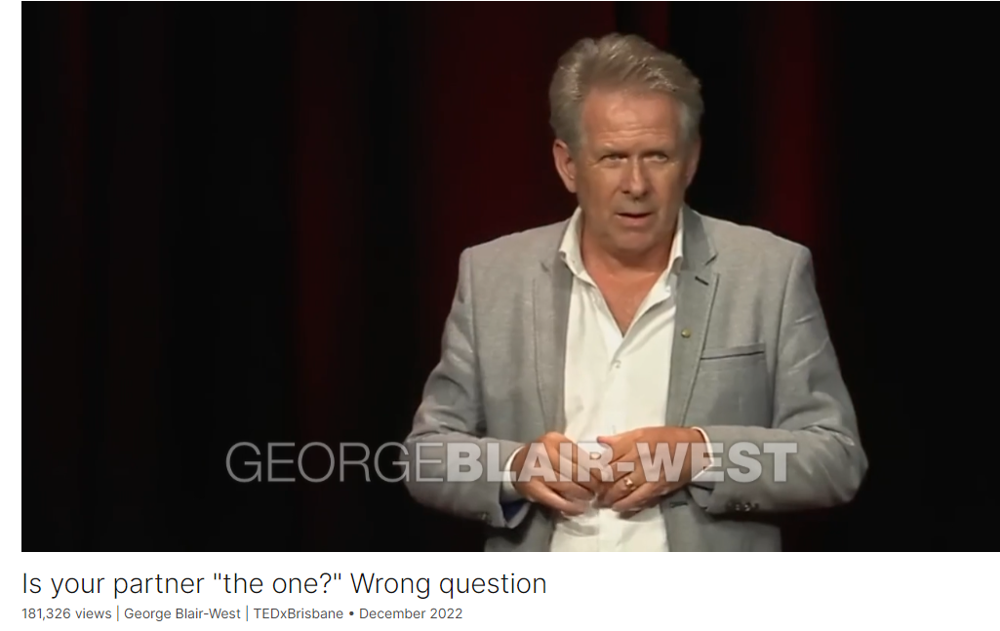

# Is your partner "the one?" Wrong question

Link: [https://www.ted.com/talks/george_blair_west_is_your_partner_the_one_wrong_question](https://www.ted.com/talks/george_blair_west_is_your_partner_the_one_wrong_question)

Speaker:  George Blair-West 

Date: December 2022

@[toc]

## Introduction

Marrying for love is a relatively recent phenomenon for humanity, and we still don't fully understand what it means for building successful relationships, says author and psychiatrist George Blair-West. Drawing from his extensive experience working with couples, he shares four questions every couple should ask themselves before tying the knot — and highlights surprising findings on how the way marriage starts impacts if it ends.

## Vocabulary

the one: 真命天子

Is your partner "the one?" Wrong question

bloodsucking: 吸血动物的；吸血的；寄生的

leech: 美 [litʃ] 水蛭；榨取利润者；吸血鬼；寄生者；

at your disposal: 听你调遣；随你差遣；随你处置

when bloodsucking leeches are the best cure you've got at your disposal, 吸血水蛭是你能找到的最好的治疗方法

relationship breakdown：关系破裂

I've come to see a relationship breakdown as being the result of an inability to overcome an emerging mismatch in the relationship. 我认为关系破裂是因为无法克服关系中出现的不匹配。

hijack therapy：

>"hijack therapy"这个短语指的是在治疗过程中被某种情绪、行为或问题所占据或主导。在这种情况下，治疗的焦点可能会偏离原本的目标，而转移到其他问题上。在上下文中，作者提到了避免“谁该负责”的问题，因为这可能会转移治疗的重点，导致治疗被这种责任归属的讨论所主导，而不是真正解决潜在的问题。

Well, it steps around an issue that can otherwise hijack therapy. The question of who is to blame, which of course is the other person. 嗯，它绕开了一个可能劫持治疗的问题。谁该受责备的问题，当然是另一个人。

take hold: 开始起作用；确立地位；变得十分强大

If prevention is the goal, when does the problem take hold? 如果预防是目标，问题什么时候出现？

predicator: 预言者

marriage proposal： 求婚

one of the more significant predictors of divorce is how long a couple date before the marriage proposal. 离婚的一个更重要的预测因素是情侣在求婚前约会多长时间。

well and truly:  完全；完全彻底地          

infatuation: 美 [ɪnˌfætʃuˈeɪʃn] 迷恋；醉心

But if you waited three and a half years until the infatuation was well and truly over, then the likelihood of divorce was reduced by a massive 48 percent.但是如果你等了三年半直到迷恋真正结束，那么离婚的可能性就会大大降低48%。

exhaustive: 全面彻底的；详尽无遗的          

It was an exhaustive psychological review on how to make an informed decision. 这是一个关于如何做出明智决定的详尽的心理学回顾。

Well, my take on it is that we would rather see the process of romantic love bring the one to us rather than slowing down and evaluating in an informed way whether or not they're a good match for us. 嗯，我的看法是，我们宁愿看到浪漫爱情的过程带给我们真命天子，而不是放慢脚步，以一种明智的方式评估他们是否是我们的好伴侣。

on a daily basis: 每天，每日基础

drink alcohol to excess：过量饮酒

complete a university degree: 完成大学学位

staggering: 美 [ˈstæɡərɪŋ] 令人震惊的；难以置信的；蹒跚的；惊人的

They were more likely to smoke on a daily basis and drink alcohol to excess. They were much less likely to complete a university degree, with daughters a staggering 58 percent less likely to do so. 他们更有可能每天吸烟和过量饮酒。她们完成大学学位的可能性要小得多，其中女儿完成大学学位的可能性低至惊人的58%。

spectator sport: 吸引大量观众的体育运动

It is said that alcoholism is not a spectator sport. 据说酗酒不是一项观赏性运动。

complication: 困难；难题；并发症；混乱；

this is why having children is a big complication and a much bigger commitment than getting married. 这就是为什么生孩子是一个大难题，也是一个比结婚大得多的承诺。

a time-honored : 历史悠久的，源远流长的

matchmaking：配对，说媒

tap into：利用，发掘

What he was talking about was tapping into a time-honored collective wisdom around matchmaking. 他所谈论的是利用历史悠久的牵线搭桥的集体智慧。

circa： 美 [ˈsərkə]  大约

consolidate：巩固

personality and values have consolidated：性格和价值观更加巩固

Divorce rate in love marriages, circa 40 percent. Because we're getting married when we're older, when our personality and our values have consolidated, divorce rates are falling 爱情婚姻的离婚率约为40%。因为我们长大后会结婚，当我们的个性和价值观得到巩固时，离婚率会下降

factor in：将…纳入考虑；将…考虑进去；

Getting each partner to factor in who they were more attracted to did not increase love or marital satisfaction scores. 让每一方考虑他们更喜欢谁并没有增加爱情或婚姻满意度的分数。

bliss：美 [blɪs] 完美的愉悦感；极乐；欣喜

marital bliss：婚姻幸福

So it would seem that not finding the one, or more specifically, having somebody else find them for you is the secret to marital bliss. 因此，似乎找不到那个真命天子，或者更具体地说，让别人为你找到他们是婚姻幸福的秘密。

my take on it：我对此的看法

life stressors：生活压力源

 my take on it is that when people marry for love, they hope the love will carry them through the tough times. The conflict, the life stressors. 我的看法是，当人们为爱结婚时，他们希望爱情能帮助他们度过艰难时期。冲突，生活压力。

Nothing conveys love more than making sacrifices for your partner. 没有什么比为你的伴侣做出牺牲更能传达爱了。

True love is the feeling of being fully accepted by another who is committed to nurturing both your personal growth and their own. 真爱是被另一个人完全接受的感觉，这个人致力于培养你和他们的个人成长。

It does take a village to grow an adult.

>这句话是在强调成年人的成长不是一个孤立的过程，而是需要社会中其他人的支持、指导和参与。它借用了非洲谚语“整个村庄抚养一个孩子”的概念，意味着成年人的发展需要社区、家庭、朋友和其他人的帮助和影响。这句话强调了人们在成长过程中与他人的关系和互动的重要性。

head over heels: 从头到脚；完全地；全部地；深陷其中；头朝下地；爱得神魂颠倒；

head over heels in love: 深深爱着某人；迷恋

I know people fall head over heels in love feeling they have found the one. Judgment free. 我知道人们坠入爱河，感觉自己找到了真爱。自由判断。

## Summary

In his speech, George Blair-West challenges the conventional view of romantic love and finding "the one," arguing that preventing long-term relationship breakdown is as crucial as preventing serious illness. He draws parallels between the approach to preventing illness and preventing relationship breakdown, emphasizing the importance of understanding the dynamics of romantic relationships. Blair-West suggests that an inability to overcome emerging mismatches in relationships often leads to breakdowns and divorces.

Blair-West explores the origins of relationship mismatches, highlighting research findings that indicate the timing of marriage proposals can significantly impact the likelihood of divorce. He discusses the implications of this research and shares insights from his own experience working with couples. Additionally, Blair-West challenges the notion of "finding the one" and proposes a shift towards asking more meaningful questions about acceptance, commitment, and mutual growth in relationships.

In the final part of his speech, Blair-West examines the impact of parental divorce on children and the long-term consequences of relationship breakdowns. He explores the concept of arranged marriages, both traditional and modern, and presents research findings that suggest arranged marriages may lead to higher levels of marital satisfaction. Blair-West concludes by offering a new definition of true love and urging individuals to prioritize acceptance, commitment, and mutual growth in their relationships, rather than solely focusing on romantic notions of finding "the one."

## Transcript

Around 500 years ago,

Erasmus told us that prevention
was better than cure.

Now, that might seem forward-thinking,

but when bloodsucking leeches
are the best cure

you've got at your disposal,

while you're hanging around,
waiting from them to work,

you've got to start to wonder
why this clearly bizarre treatment

was needed in the first place.

And I'm going to propose that preventing
long-term relationship breakdown

is as important
as preventing serious illness.

And I'm going to suggest
that the way we see romantic love,

and in particular finding "the one,"

is a big part of that problem.

So in my 20 years of working with couples,

I've come to see a relationship breakdown
as being the result of an inability

to overcome an emerging
mismatch in the relationship.

Now, why do I use that word mismatch?

Well, it steps around an issue
that can otherwise hijack therapy.

The question of who is to blame,

which of course is the other person.

(Laughter)

And this approach allows me

to then focus on making
or remaking the match.

But that got me wondering.

So when does the mismatch begin?

If prevention is the goal,
when does the problem take hold?

I found that if I looked back,
the majority of the time,

I could trace it to before that couple
actually even committed.

Before they married,
before they had children.

For example,

one of the more significant
predictors of divorce

is how long a couple date
before the marriage proposal.

In a 2015 US study of 3,100 people,

they found that if the couple
waited one to two years,

there was a 21 percent
reduced likelihood of divorce

compared to if they proposed
in less than 12 months.

But if you waited three and a half years

until the infatuation
was well and truly over,

then the likelihood of divorce
was reduced by a massive 48 percent.

So my daughter, a dating coach,

and I wrote a book about how
to choose your partner.

It was an exhaustive psychological review
on how to make an informed decision.

When that book came out recently,

what everybody wanted to talk about,

media and readers alike,

was a preference for not choosing the one,

but finding them through
the admittedly romantic process.

But it was a spectacularly passive process

of falling in love.

Why?

Well, my take on it
is that we would rather see

the process of romantic love
bring the one to us

rather than slowing down
and evaluating in an informed way

whether or not they're
a good match for us.

When I looked at a deeper level,
at a less conscious level,

I saw that we really don't want
to see it as a decision,

because then we have to take
responsibility for it.

And if it fails,

that is a burden of some consequence.

When it's a romantic process
and it fails, well,

that's a shared failure with the universe.

A much better deal than having
to blame just ourselves.

Is your potential partner the one

is the wrong question.

In fact, I believe that's a question
that is more likely to lead to divorce.

But before we look at better questions,

let's look at what's at stake.

Because I would suggest
that choosing your lifelong partner

is the most consequential
decision you will make.

Most of us appreciate the pain,
emotional and financial,

that divorce causes a couple,

but it's the impact on the next generation
that has my attention.

The study of 1,400 people
looked at the long-term impact

of parental divorce
during their childhood,

when they were followed up at age 32.

Now, as you can see,

the children from the families
where their parents had divorced

were more than twice as likely
to be divorced themselves

or to be unemployed.

They were more likely
to smoke on a daily basis

and drink alcohol to excess.

They were much less likely
to complete a university degree,

with daughters a staggering
58 percent less likely to do so.

And girls, apparently more vulnerable
to parental marital breakdown than boys

were more likely to suffer
from a range of psychological problems.

It is said that alcoholism
is not a spectator sport.

Eventually, the whole family has to play.

And the damage from
a parental relationship breakdown

is equally impossible to limit
to just the parents.

And this is why having children
is a big complication

and a much bigger commitment
than getting married.

So how am I defining marriage?

Well, I would see it as any relationship
entered into by two people

on the basis it will be long-term

and is recognized either legally
or in common law.

But for the record,

I believe any two people

of any persuasion, of either gender

or of no gender,

who wish to spend their life together
should be legally able to do so

throughout the world.

But for the purposes of this talk,

we're going to be looking
at legal marriages

because they're the ones
more readily identified by researchers.

Now, that definition, of course,
includes arranged marriages.

For those of us who've grown up
with love marriages and romantic love,

we see that as the normal way of things.

I think I can predict
that most of you here

had parents who chose each other
on the basis of romantic love.

I think I can more confidently predict

that you're probably not going to get
those very same parents

to choose your marital partner,

a partner who you might meet
for the first time

on the day of your marriage.

Unless, of course, they're producers
of reality TV shows.

(Laughter)

But despite our sense
that a love marriage is the norm,

by a slight majority,

from a global perspective,

a marriage today is more likely
to be arranged than not.

Moreover, for 95 percent
of recorded history,

arranged marriages have been the norm
for the entire planet.

Until then,

romantic love only accidentally
overlapped with marriage.

Now arranged marriages take many forms.

And to be clear, I'm not talking here
about forced marriages,

child marriages.

These are a violation of human rights.

The Universal Declaration of Human Rights

states that individuals
should be 18 years old

before they enter marriage,
and do so freely with full consent.

But the reason that brought
that declaration into being

leaves many of us feeling that arranged
marriages are old and irrelevant.

At least I did until I came across
some rather compelling research.

Now I'm going to suggest

that if we dismiss arranged marriages

without considering what I call
the modern arranged marriage,

then we're throwing out the baby
with the bath water.

I asked a Pakistani man
that I interviewed for my research

how he felt about potentially
a matchmaker --

his mother, his aunts,
his prospect’s mother, her aunts --

all choosing his marital partner.

He said, "Well, of course all these
people should choose my partner.

They know much more
than I do of such things.

I'm only 35 years old."

(Laughter)

What he was talking about
was tapping into

a time-honored collective wisdom
around matchmaking.

How do we define the modern
arranged marriage?

Well, this is where each partner
has power of veto

and some input into the choice
of their partner.

And it occurs in a greater culture
that is supportive of divorce.

So the research we're about
to look at comes out of the USA.

So how have the last 200 years,
a mere blip in history,

gone when it comes
to our romantic love marriages?

Divorce rate in love marriages,
circa 40 percent.

Because we're getting married
when we're older,

when our personality
and our values have consolidated,

divorce rates are falling,

but so too are marriage rates.

In the USA today, people
are avoiding marriage entirely,

more than any other time in history.

Single-parent families are more
common after love marriages.

Birthrates are of particular
importance to governments

because they underpin
long-term economic growth.

In the USA today,

birth rates are below
population replacement levels.

In a study done on modern
arranged marriages in the US,

where partners had some input
into partner selection,

they looked at four factors
that determine marital satisfaction:

loving, loyalty, shared values
and issues around finances.

The average duration of the marriage
was more than 11 years,

and each individual filled out
their questionnaires separately.

The arranged marriages
are the ones on your left.

Yes, the ones that are higher
on each of those four parameters.

Two points of note.

Maybe surprisingly,

the reports from the women
were no different

from the reports from the men.

But the finding that fascinates me

is that "greater involvement"
in partner selection

did not improve marital
satisfaction scores.

Now just let that sink in.

Getting each partner to factor in
who they were more attracted to

did not increase love or marital
satisfaction scores.

So it would seem that not finding
the one, or more specifically,

having somebody else find them for you

is the secret to marital bliss.

Professor Robert Epstein
is an American researcher

who has studied
this phenomenon in some depth.

And he's found the crossover,

the point at which love
in the arranged marriages

exceeds that in the love marriages,

occurs around five years.

By ten years,

the levels in the arranged marriages
are significantly higher.

What's going on?

Well, my take on it is
that when people marry for love,

they hope the love will carry them
through the tough times.

The conflict, the life stressors.

But romantic feelings do not coexist well

beside the feelings that go
with stress and conflict.

They get pushed aside.

Such that the couples I work with
who've had repeated problems

tell me they have now fallen out of love.

In an arranged marriage,

all you have from the outset
is a commitment.

A commitment to make it work
no matter what,

and to make it work as a team.

The lack of romantic feel
at these times

is not only of no surprise to them,

it is of little concern to them.

Commitment carries you
through the tough times.

Romantic love not so much.

So what do we find if we study
the modern arranged marriages

to find how they build love over time?

This takes us back to Epstein's work.

He and his coworkers undertook a number
of studies to answer that question.

In one particular study,

they looked at 35 factors
that could build love over time.

Here are the top five.

Nothing conveys love

more than making sacrifices
for your partner.

Now I’m not suggesting
that we return to arranged marriages.

But I do think they have
something to teach us.

Allow me to reduce this research down
along with my clinical experience,

to one sentence.

My definition of true love,

that I believe underpins
successful long-term relationships.

True love

is the feeling of being
fully accepted by another

who is committed to nurturing

both your personal growth and their own.

Now of course, to effectively nurture
somebody’s personal growth,

you have to be emphatically
interested in where they are

on both a day-by-day basis
and in the longer term.

Equally importantly,

we have to take responsibility
for our own personal growth.

You cannot rely on your partner
to meet all of your needs.

It does take a village to grow an adult.

In conclusion,

I know people fall head over heels in love

feeling they have found the one.

Judgment free.

If you're young and you just want
to fall in love, then do that.

You want to get married
when you're older anyway.

And when it happens,

enjoy the hell out of it while it lasts.

But please, please remember,

you do not have to marry them.

Or with much greater finality,
have children with them.

That's why contraception was invented.

(Laughter)

Instead of asking "Are you the one,"

ask two questions of each of you.

Do I accept my partner
despite their shortcomings?

Do I commit to nurture them
to achieve what is important to them?

And likewise, do they accept me

and do they commit to me?

All you need is four yeses.

Thank you.

(Applause)

## Afterword

2024年5月5日14点23分于上海。

