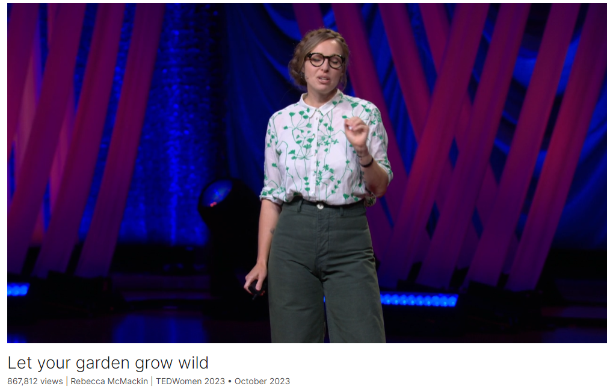

# Let your garden grow wild

Link: [https://www.ted.com/talks/rebecca_mcmackin_let_your_garden_grow_wild](https://www.ted.com/talks/rebecca_mcmackin_let_your_garden_grow_wild)

Speaker:  Rebecca McMackin

Date: October 2023

@[toc]

## Introduction

Many gardeners work hard to maintain clean, tidy environments ... which is the exact opposite of what wildlife wants, says ecological horticulturist Rebecca McMackin. She shows the beauty of letting your garden run wild, surveying the success she's had increasing biodiversity even in the middle of New York City — and offers tips for cultivating a garden that can be home to birds, bees, butterflies and more.

## Vocabulary

horticulture：美 [ˈhɔrdəˌkəltʃər] 园艺学；园艺

horticulturist: 美 [,hɔrtɪ'kʌltʃərɪst] 园艺家

nerdy: 美 [ˈnɜːrdi]  傻瓜似的；书呆子式的

nerdiest: 最高级

So full disclosure, I am the nerdiest gardener you are ever going to meet. 坦白说，我是你见过的最无聊的园丁。

>短语 "full disclosure" 可以算是俚语，通常用于非正式的对话中，意思是完全坦诚或透明地说明某事，通常是为了提供背景信息或揭示任何潜在的偏见或个人关系。

extravagantly: 美 [ɪk'strævəɡəntlɪ] 过度的；昂贵的；过高的；

extravagantly beautiful: 极其美丽

Technically, I'm an ecological horticulturalist, which is a fancy way of saying that I design and manage gardens that are extravagantly beautiful while also providing habitat for plant populations, wildlife communities and even soil organisms. 从技术上讲，我是一个生态园艺家，这是一种fancy的说法，即我设计和管理的花园非常美丽，同时也为植物种群、野生动物群落甚至土壤生物提供栖息地。

dump: 倾倒

insecticides： 美 [ɪn'sektɪsaɪdz]  杀虫剂；（insecticide的复数）

herbicide：美 [ˈɜːrbɪsaɪd] 除草剂

In the US alone, we dump over 100 million pounds of insecticides, herbicides and synthetic fertilizers on our lawns and gardens every year. 仅在美国，我们每年向草坪和花园倾倒超过1亿磅杀虫剂、除草剂和合成肥料。

from the brink of extinction: 从灭绝的边缘

Gardens can and have brought back plants and animals from the brink of extinction. 花园能够并且已经将动植物从灭绝的边缘拯救回来。

derelict：美 [ˈdɛrəˌlɪkt] 废弃的；破旧的

piers：美 [piəz] 码头；（pier的复数）

shipping piers：“Shipping piers” 是指“航运码头”或“装卸码头”，通常用于船只停泊、装卸货物的设施。

we took these massive derelict shipping piers out over the water between Brooklyn and Manhattan and turned them into an 85-acre post-industrial public park. “我们把布鲁克林和曼哈顿之间水面上的这些巨大废弃的航运码头改造成了一个占地85英亩的后工业时代公共公园。”

lush：美 [lʌʃ]  生长繁茂的；豪华的

parch：微烤；烘

parched：美 [pɑrtʃt]  干裂的

but this lush landscape was built on parched concrete. 但是这片茂盛的土地是建立在干裂的混凝土上的。

monarch：美 [ˈmɑːnərk] 帝王蝶；君主蝴蝶

sanctuary：美 [ˈsæŋktʃueri] 避难所；庇护所；自然保护区

They have no idea that they're walking through a monarch habitat or a firefly sanctuary. 他们不知道自己正走过帝王栖息地或萤火虫保护区。

We are facing a biodiversity crisis of catastrophic proportions. 我们正面临灾难性的生物多样性危机。

apocalypse：美 [əˈpɑːkəlɪps] 世界末日；

You may have heard of the insect apocalypse 你可能听说过昆虫启示录

pollination：美 [ˈpɑləneʃən] 授粉

insect pollination：昆虫授粉

One in every three bites of food that you eat is the direct result of insect pollination. 你吃的每三口食物中就有一口是昆虫授粉的直接结果。

Thank goodness that there are solutions and many of them literally involve planting flowers. 

>这里的 "literally" 意思是“字面上”，强调所说的内容并非比喻或夸张，而是确实如此。因此，这句话可以翻译为：
>
>“谢天谢地，有许多解决方案，其中许多确实是涉及种花。”

pot: 罐；壶；

stoop: 美 [stuːp] 门廊；走廊

 it takes is a pot on your stoop to have a positive effect. 只有在你的门廊上放一个罐子才能产生积极的影响。

columbine美 [ˈkɑləmˌbaɪn] 耧斗菜；

the eastern red columbine is arguably the most cheerful of our spring wildflowers. But of course they're not blooming for us. 东方红耧斗菜可以说是我们春天最欢快的野花。但它们当然不是为我们而盛开的。

heralds: 美 [ˈhɛrəldz]: 通报；传达；预告；（herald的第三人称单数）

hummingbird: 美 [ˈhəmɪŋˌbərd] 蜂鸟

Their red flower heralds the return of the ruby-throated hummingbird 它们的红花预示着红宝石喉蜂鸟的归来

sugary：美 [ˈʃʊɡəri] 多糖的；很甜的

nectar：美 [ˈnektər] 花蜜

they rely on the sugary nectar of the columbine to refuel, 它们依靠耧斗菜的含糖花蜜补充能量

reside：居住；位；归；属；存在；

where the real magic resides: 魔法存在的地方，神奇的地方

but it's the dynamics between the two where the real magic resides. 但真正神奇的是这两者之间的互动。

photoreceptor：美 [ˌfoʊdoʊrəˈsɛptər]  感光器，感光细胞

Birds have an extra photoreceptor that allows them to see red incredibly well. 鸟类有一种额外的感光细胞，使它们能够非常好地看到红色。

symbiosis：美/ˌsɪmbaɪˈoʊsɪs/ 共生(关系)；合作关系；互惠互利的关系

This beautiful dance of symbiosis 这种美丽的共生之舞

In return for planting native plants, we get a front-row seat to the wonders of the natural world. 作为种植本土植物的回报，我们可以坐在前排欣赏自然世界的奇观。

caterpillars：美/ˈkætəˌpɪlərz/ 毛虫，蠋(蝴蝶或蛾的幼虫) caterpillar的复数

catalpa trees： 梓树

aphids：美/ˈæfɪdz/ 蚜虫(体小，植物害虫)

Long ago at Brooklyn Bridge Park, our catalpa trees got covered in aphids. 很久以前，在布鲁克林大桥公园，我们的梓树上长满了蚜虫。

sterile：美/ˈsterəl/ 无菌的；不育的；消过毒的；

Most gardeners try to maintain these clean, sterile environments that are the exact opposite of what wildlife wants. 大多数园丁试图维持这些清洁、无菌的环境，这与野生动物想要的完全相反。

mowing：美/ˈmoʊɪŋ/ 修剪；割；刈

forage：美/ˈfɔːrɪdʒ/ 觅(食)；(尤指用手)搜寻(东西)

birds will forage in them鸟会在里面觅食

tuck：塞进，把…藏入；用…盖住

Seed heads can be sculptural while feeding the birds, and old flower stems can be tucked away to allow tiny bees to nest in them. 在喂鸟的时候，种子头可以是雕塑般的，旧的花茎可以收起来，让小蜜蜂在里面筑巢。

Traditional gardens were often about displaying control over nature.But we no longer wear powdered wigs and hoop skirts. We don't need to be authoritarian in our garden design. 传统的花园通常是为了展示对自然的控制。但是我们不再戴粉状假发和环形裙了。在我们的花园设计中，我们不需要专制。

rose mallow：木槿

hibiscus：美 [haɪˈbɪskəs] 木槿

The rose mallow is this tropical-looking hibiscus that grows throughout eastern North America. 玫瑰锦葵是一种热带外观的木槿，生长在北美东部。

song sparrow：北美歌雀

we found a song sparrow nest nestled in between those uncut stems. 我们发现一只歌雀的巢就坐落在那些未修剪的枝干之间。

immobilized：美 [ɪˈməʊbəˌlaɪzd] 使不动；使固定；（immobilize的过去分词）

I am at times immobilized with climate grief, thinking about the world that we're leaving for our children. 我有时因气候悲伤而无法动弹，想着我们要留给孩子们的世界。

## Summary

Rebecca McMackin, an ecological horticulturalist, begins her talk by highlighting the environmental damage caused by traditional gardening practices that rely heavily on insecticides, herbicides, and synthetic fertilizers. She emphasizes that gardens can be designed to be both beautiful and beneficial for wildlife, providing food, water, and shelter. Drawing from her experience at Brooklyn Bridge Park, she illustrates how transforming derelict areas into lush habitats can attract diverse wildlife, even in urban settings like New York City. McMackin argues that if such ecological successes can be achieved in a city, they can be replicated anywhere.

McMackin discusses the current biodiversity crisis, stressing the alarming decline in insect and bird populations and the critical role insects play in pollination and the food chain. She advocates for planting native plants, which have evolved alongside local wildlife and form crucial ecological relationships. She uses the example of the eastern red columbine and the ruby-throated hummingbird to demonstrate how specific plants can support specific animal species. By planting native plants, gardeners can witness and support these intricate ecological interactions, thereby fostering biodiversity.

McMackin encourages gardeners to embrace practices that support wildlife, such as allowing leaves to remain on the ground, reducing lawn areas, and avoiding pesticides. She shares success stories of beneficial insects and birds returning to habitats where natural gardening methods were implemented. By changing traditional notions of garden aesthetics and incorporating wild elements, gardeners can create spaces that support diverse species. McMackin concludes by expressing hope that gardening can address significant environmental challenges and inspire positive change, emphasizing the profound sense of fulfillment and hope that comes from cultivating life and supporting ecosystems with our own hands.

生态园艺师Rebecca McMackin在演讲一开始就强调了传统园艺实践对环境造成的破坏，这些做法严重依赖杀虫剂、除草剂和合成肥料。她强调，花园可以设计得既美观又对野生动物有益，提供食物、水和庇护所。她以布鲁克林大桥公园为例，展示了如何将废弃区域改造成郁郁葱葱的栖息地，即使是在像纽约市这样的城市环境中也能吸引各种野生动物。McMackin认为，如果这样的生态成功能在城市中实现，那么它们可以在任何地方复制。

McMackin讨论了当前的生物多样性危机，强调昆虫和鸟类数量的惊人下降以及昆虫在授粉和食物链中的关键作用。她倡导种植本地植物，这些植物与当地野生动物共同进化，形成了重要的生态关系。她用东方红耧斗菜和红喉蜂鸟的例子来展示特定植物如何支持特定动物物种。通过种植本地植物，园丁们可以见证并支持这些复杂的生态互动，从而促进生物多样性。

McMackin鼓励园丁们采用支持野生动物的做法，比如让落叶留在地上，减少草坪面积，避免使用杀虫剂。她分享了在实施自然园艺方法后，有益昆虫和鸟类返回栖息地的成功故事。通过改变传统的园艺美学观念并融入野生元素，园丁们可以创造支持多样物种的空间。McMackin最后表达了她对园艺能够解决重大环境问题并激发积极变化的希望，强调了通过双手培育生命和支持生态系统所带来的深刻满足感和希望。

## Transcript

So full disclosure,

I am the nerdiest gardener
you are ever going to meet.

(Laughter)

Technically, I'm an ecological
horticulturalist,

which is a fancy way of saying
that I design and manage gardens

that are extravagantly beautiful

while also providing habitat
for plant populations,

wildlife communities
and even soil organisms.

And you might wonder,
isn't that what all gardeners do?

Unfortunately, no.

The vast majority of gardens
are ecological deserts, and in fact,

an incredible amount of environmental
damage has been done

in the name of making pretty gardens.

In the US alone,

we dump over 100 million
pounds of insecticides,

herbicides and synthetic fertilizers
on our lawns and gardens every year.

There just isn't a garden pretty enough
to be worth all of that,

and the reality is
that it's completely unnecessary.

Gardens and landscapes
that are absolutely gorgeous

can also help the world around us.

They can provide food,
water,and shelter to wildlife.

Gardens can and have brought back plants
and animals from the brink of extinction.

There is a movement happening
all over the globe.

Gardeners, garden designers,
landscape architects,

even entire cities are finding ways
to beautify our environment

while making space for the animals
we share this land with.

I've seen biodiversity return to one
of the toughest places to live

on the entire planet:

the middle of New York City,

(Laughter)

where I cared for, designed

and helped build public
parks and gardens.

(Applause)

At Brooklyn Bridge Park,
where I was director of horticulture,

we took these massive derelict
shipping piers out over the water

between Brooklyn and Manhattan

and turned them into an 85-acre
post-industrial public park.

(Applause)

It was designed by MVVA
and built out over a decade.

And it's hard to imagine now,

but this lush landscape
was built on parched concrete.

This is about as appealing
to wildlife as a parking lot.

And yet, just a few years
after construction,

we welcomed migratory birds,

rare insects and clouds of butterflies,

all among millions and millions
of park visitors.

When people go to Brooklyn Bridge Park,

they're usually there to play
basketball or have a picnic.

They have no idea that they're walking
through a monarch habitat

or a firefly sanctuary.

It just reads as a beautiful park
with lots of butterflies

and magical evenings.

And if we can do that
in the middle of New York City,

amidst all that traffic and concrete,

you can do it anywhere.

Indeed, we must incorporate habitat
everywhere immediately,

especially in our cities.

We are facing a biodiversity crisis
of catastrophic proportions.

We're changing the planet so quickly
that plants and animals cannot keep up.

You may have heard
of the insect apocalypse,

and unfortunately it is just
as terrifying as it sounds.

We have lost nearly half
of insects on planet Earth

just since I was a little kid.

Now, you might not like bugs,

but they are still keeping you alive.

One in every three bites
of food that you eat

is the direct result
of insect pollination.

And this isn't just
a problem for humanity.

Where we have the data,

we've lost a quarter of our birds.

In North America, it's 29 percent.

Most of these birds feed their babies
exclusively on insects.

So it's not just climate change
that we need to solve right now.

There is some existential
multitasking required of us.

Thank goodness that there are solutions

and many of them literally
involve planting flowers.

So let's talk about gardening
for biodiversity,

because while you might not be a gardener,

I am still going to ask you
to get your hands dirty.

All it takes is a pot on your stoop
to have a positive effect.

The first thing we should all be doing
are planting plants

that are from the places
where we're gardening.

We call them native plants,

and they're important because they evolved
alongside of the wildlife there.

Plants and animals
often form relationships

and even dependencies on each other.

For example,

the eastern red columbine

is arguably the most cheerful
of our spring wildflowers.

But of course they're not blooming for us.

Their red flower heralds the return
of the ruby-throated hummingbird,

the East Coast's only hummingbird.

After these tiny birds
have flown thousands of miles

on their migration from Central
America to the northeast,

they rely on the sugary nectar
of the columbine to refuel,

and they have reason to believe

that this flower will be waiting
for them when they do.

The Columbine stores their nectar
at the end of long spurs,

where only the long tongues
of the hummingbird can reach it.

As the bird drinks the nectar,
they pollinate the flower.

Both organisms are benefiting here,

and in fact, the ruby-throated hummingbird

is the eastern red columbine's
pollinator partner.

The bird and the flower
could not be more charming,

but it's the dynamics between the two
where the real magic resides.

Let me explain.

Birds have an extra photoreceptor

that allows them to see
red incredibly well.

Flowers have taken advantage of this

and use the color red to communicate.

As the hummingbirds fly
over land on their journey,

a wave of red flowers blooms
to greet them.

This beautiful dance of symbiosis
is happening all around us,

among plants and animals that have
evolved together for thousands,

if not millions of years.

In return for planting native plants,

we get a front-row seat
to the wonders of the natural world.

It's hard work,

but it's the best kind
because at the end of our efforts,

not only do we get biodiversity
but we get butterflies.

When butterflies visit flowers,
they're there for a quick drink of nectar.

But if we want to support
their full life cycle,

we need to provide them with food
when they are very hungry caterpillars.

Caterpillars eat leaves,
but they can't just eat any leaf.

They need the leaves
they have evolved to digest.

Monarchs and milkweed
are the most famous duo,

but every butterfly and moth
has a plant or even a few

that they lay their eggs on.

These are their host plants.

At Brooklyn Bridge Park a while ago,

I saw American lady
butterflies visiting our flowers.

So I looked up their host plants

and found that their favorite
was a tiny white flower

called pearly everlasting.

So I ordered a few,

hoping that the butterflies
would eventually find them.

However, when I opened the box,

it was like butterflies just
materialized out of thin air

and went straight
for the pearly everlasting.

We had to brush
the butterflies off the plants

just to get them in the ground.

Now I know that it might be a shock
for some of you to hear

that people like me want insects
eating our garden plants.

But even bugs we refer to as pests
can be important for biodiversity.

Long ago at Brooklyn Bridge Park,
our catalpa trees got covered in aphids.

They are a common garden pest

that suck the sugary liquid out of leaves.

People encouraged me to spray them
with pesticides, but I didn't.

And the following year we found
the two-spotted lady beetle

on our catalpas.

This was the first sighting
of this ladybug in New York City

in 30 years.

(Applause)

And the thing about them
is that they eat those tiny aphids

that are on our catalpas.

So if we had sprayed the trees,

we would have harmed the ladybugs as well.

Gardening is a long game.

With patience, we can return
balance to these systems.

When we allow pests
to live in our gardens,

predators like ladybugs will soon move in.

By building up biodiversity,

pests are kept at bay.

Most gardeners try to maintain
these clean, sterile environments

that are the exact opposite
of what wildlife wants.

The more we can stop being tidy,

the more wildness we can bring
into our gardens and landscapes,

the better habitat we provide.

Wherever possible, we should stop mowing.

Why not get rid of your lawn?

Or shrink it drastically.

Lawns should be area rugs,
not wall-to-wall carpet.

(Laughter)

(Applause)

Leaves that fall to the ground
should be left there.

They're literally called leaves.

We should leave them.

(Laughter)

Bumblebees nest in those leaves,
birds will forage in them,

and butterflies overwinter
in them as well.

Seed heads can be sculptural
while feeding the birds,

and old flower stems can be tucked away
to allow tiny bees to nest in them.

All of these practices create
new looks for our gardens,

but part of this work is changing
our ideas of beauty.

Traditional gardens were often
about displaying control over nature.

But we no longer wear
powdered wigs and hoop skirts.

We don't need to be authoritarian
in our garden design.

(Laughter)

And it's not all or nothing.

There's almost always space on our land
where we can go a little wild.

The rose mallow is this
tropical-looking hibiscus

that grows throughout
eastern North America.

The stems are often cut down
by gardeners in spring,

but we left them up one year

because we found that there were
a bunch of beneficial insects

that used those stems.

And what we ended up with,
I find absolutely stunning.

It might not be a look for every garden,

but certainly we can find space for it.

Because a few weeks later,

we found a song sparrow nest
nestled in between those uncut stems.

And soon we had baby song sparrows
hopping around outside of the garden.

There's a direct link
between that garden practice

and an actual baby bird.

In these scary times,

it can be so hard to know
what to do and how to help.

But it feels great to cultivate
life with your own two hands.

And there's an abundance of research now
to show how beneficial gardening is

for our health and even our happiness.

Because we all deserve to live
in a healthy and thriving ecosystem.

But it feels even better
when we're part of those systems,

supporting the plants
and pollinators around us

the way that they support us.

Like many of you,

I am at times immobilized
with climate grief,

thinking about the world
that we're leaving for our children.

But gardening, honestly,
brings me so much hope

that we can solve some very big,

very serious problems,
that we have the solutions already.

And many of them simply
involve planting flowers.

Thank you so much.

(Applause and cheers)

## Afterword

2024年6月5日周三于上海。

