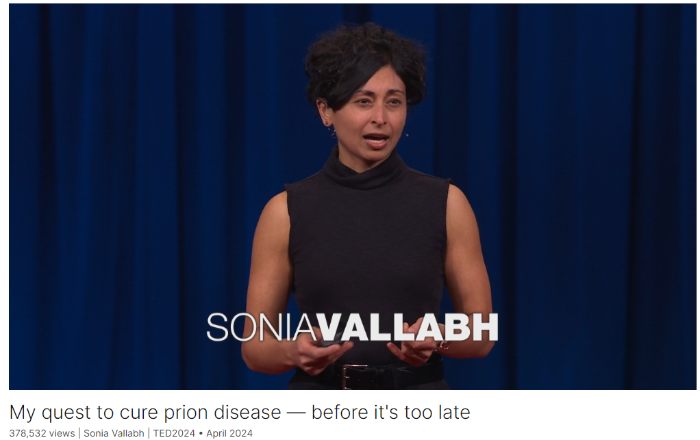

# My quest to cure prion disease — before it's too late

Link: [https://www.ted.com/talks/sonia_vallabh_my_quest_to_cure_prion_disease_before_it_s_too_late?](https://www.ted.com/talks/sonia_vallabh_my_quest_to_cure_prion_disease_before_it_s_too_late?)

Speaker:  Sonia Vallabh

Date: April 2024

@[toc]

## Introduction

Biomedical researcher Sonia Vallabh's life was turned upside down when she learned she had the genetic mutation for a rare and fatal illness, prion disease, that could strike at any time. Thirteen years later, her search for a cure has led to new insights about how to catch and prevent disease — and how to honor our grandest, most mysterious inheritance: our brains.

生物医学研究员索尼娅·瓦拉布的人生在得知自己携带一种罕见且致命的疾病——朊病毒病的基因突变后发生了翻天覆地的变化，这种疾病可能在任何时候发作。十三年后，她寻找治愈方法的过程带来了关于如何捕捉和预防疾病的新见解，也让她更加明白如何尊重我们最伟大、最神秘的遗产：我们的脑。

## Vocabulary

life was turned upside down: 生活发生了翻天覆地的变化

genetic mutation: 基因突变

prion：美 [ˈpraɪˌɑn] 朊病毒；蛋白质致病颗粒；

prion disease：朊病毒疾病

My quest to cure prion disease — before it's too late： 我的治愈朊病毒病的追寻——赶在为时已晚之前

>这里的“quest”意思是“追求”或“探索”，表达了作者在治愈朊病毒病方面所做出的努力和探求。这种表达传达了一个长期且充满挑战的目标，通常涉及毅力和奉献精神。这句话中的“quest”强调了治愈这种疾病的旅程是一个重要且充满使命感的过程。

And it's at the heart of this sort of red pill-blue pill moment when my life forked in two.

>这句话的意思是："这是我生命中的一个关键时刻，就像红药丸和蓝药丸的选择，我的生活因此分成了两条不同的道路。"
>
>具体解释如下：
>
>- "red pill-blue pill moment"（红药丸-蓝药丸时刻）是一个来自电影《黑客帝国》（The Matrix）的比喻。在电影中，主角尼奥（Neo）被告知可以选择吃红药丸或蓝药丸。吃蓝药丸，他会继续过原来的生活，不会知道任何真相；吃红药丸，他会看到真相，但生活将彻底改变。
>- "when my life forked in two"（我的生活因此分成了两条不同的道路）表示在这个关键时刻，她的生活因此走向了完全不同的两个方向。
>
>在这个语境中，Sonia Vallabh 讲述的是她收到预测性基因测试报告的那一刻，这个报告让她的生活面临一个重大抉择，从而使她的生活轨迹发生了巨大变化。

scandalized: 美 [ˈskændlˌaɪzd] 诽谤；使震惊；（scandalize的过去式和过去分词）

You can see how she’s laughing but she’s kind of scandalized. 你可以看到她在笑，但同时她也有点震惊和尴尬。

dementia: 美 [dɪˈmenʃə] 痴呆

Dementia has robbed us of that. 痴呆症剥夺了我们这一切

autopsy: 美 [ˈɔːtɑːpsi]  尸检

And then we get the results of my mom's autopsy. 然后我们拿到我妈妈的尸检结果。

limbo: 美 [ˈlɪmboʊ] 悬而未决的时候；等待结果的时候；进退两难的中间阶段；

this limbo isn't life.

hatch: 美 [hætʃ] 孵出；策划

the main thing to say is that it's not like we hatch some master plan to remake our lives overnight. 主要要说的是，我们并没有制定什么能够在一夜之间彻底改变我们生活的宏伟计划。

liability: 不利因素；负债；

Leading this life has certain liabilities. 过这种生活有一些不利因素

macabre: 美 [məˈkɑːbrə] 恐怖的；令人毛骨悚然的 **注意发音**

obituary：美 [oʊˈbɪtʃueri]  讣告

things can get macabre if you Google search my name. And if you click on "obituary," dang. Bottom line, rumors of my death have been greatly exaggerated. 如果你用谷歌搜索我的名字，事情会变得可怕。如果你点击“讣告”，该死。总之，关于我死亡的谣言被大大夸大了。

causal: 美 [ˈkɔːzl] 原因的

pathogen：美 [ˈpæθədʒən]    病原体

go rogue：离经叛道

>"Go rogue" 是一个英语短语，意思是“背叛”或“离经叛道”。它通常用于描述一个人或一件事偏离了预期的或正常的行为方式，开始独自行动，通常是不按规矩或不被授权的行为。
>
>在上下文中，这可能指的是某些事情原本应该按某种方式进行，但它却偏离了轨道，开始以意想不到或不受控制的方式行动。例如，在Sonia Vallabh的演讲中，提到的“one normal protein called PrP”本来在体内是正常的，但它可能会“go rogue”，即发生形变，进而引起疾病。

The causal pathogen isn’t a virus, and it’s not a bacterium. It's this one normal protein called PrP that you normally have in your body. And it's normally not a problem, but it is capable of going rogue. And when it does, it changes shape. And then it goes around grabbing other copies of PrP, and it corrupts those. And this spreads through your brain and kills your neurons. 致病病原体不是病毒，也不是细菌。人体内通常有一种叫做PrP的正常蛋白质。这通常不是问题，但它可能会失控。当它出现时，它会改变形状。然后它四处抓取PrP的其他副本，并破坏它们。这会扩散到你的大脑并杀死你的神经元。

I am so pleased to present to you the prion misfolding cascade in action. 我很高兴向你们展示朊病毒错误折叠的级联反应。

scour: 美 [ˈskaʊər] 仔细搜索；浏览

So we’re scouring the globe for tools to dial it down. 所以我们在全球范围内寻找控制它的工具。

they also have to be wrangleable into actual, practical medicines 它们也必须能变成实际的、实用的药物

>"Wrangleable" 不是一个常见的单词，但它可以理解为 "capable of being wrangled"。在这个词中，"wrangle" 的意思是“争论、争执”或者“处理、管理”，加上形容词后缀 "-able"，表示“可以被处理的”或“可以被管理的”。
>
>音标可以表示为：/ˈræŋɡələbəl/。
>
>具体来说，如果某件事是 wrangleable，意味着它是可以通过努力或技巧来管理、控制或解决的。在Sonia Vallabh的演讲中，这可能指的是将理论或想法转化为实际、可操作的药物或解决方案。

twitching: 美 ['twɪtʃɪŋ] 抽动；使抽动

summon: 美 [ˈsʌmən]  传唤；召唤

audacious: 美 [ɔːˈdeɪʃəs] 敢于冒险的；大胆的

For sure, we are being summoned to be audacious. 当然，我们正被召唤去大胆创新。

heed: 美 [hiːd] 注意；留心；关注

We have to heed the call to protect what we can't rebuild. The hutzpah and the humility. “我们必须回应保护那些无法重建的事物的召唤。需要的是勇气和谦逊。”

>具体解释如下：
>
>- “We have to heed the call to protect what we can't rebuild.” 意思是我们必须听从召唤，去保护那些一旦破坏就无法重建的事物。这通常指的是珍贵和不可替代的事物，如人类的大脑或者自然生态等。
>
>- “The hutzpah and the humility.” 这里“hutzpah” 是意第绪语，表示极大的勇气或胆量，而“humility”表示谦逊或谦卑。这句话强调了在保护这些不可重建的事物时，我们需要同时具备极大的勇气和深刻的谦逊。

grail: 圣杯，圣盘

"Sonia, what's the holy grail of your quest?"

molecule: 美 [ˈmɑːlɪkjuːl]  分子，**注意发音**

jeopardy: 美 [ˈdʒepərdi] 风险；危难；危险处境

live with jeopardy 生活在危险中

we all are making our own grace out of the darndest raw materials. 我们都在用最不可思议的原材料打造自己的优雅。

efficacy: 美 [ˈefɪkəsi] 功效；效力；效能

vaccine efficacy: 疫苗功效；疫苗有效性；疫苗效力

## Summary

**Summary:**

**Introduction and Personal Story:**
Sonia Vallabh begins her talk by recounting how her life changed dramatically after receiving a predictive genetic test report, revealing she had a 50-50 chance of inheriting a fatal genetic prion disease. This discovery came shortly after her mother's rapid decline and death from the same illness, highlighting the devastating impact of the disease and the urgency for a cure. Vallabh and her husband, initially non-biomedical professionals, decided to dive into biomedical research, leaving their careers to pursue PhDs and establish a lab dedicated to finding a therapy for prion disease.

**Scientific Approach and Research:**
Vallabh explains the unique nature of prion disease, caused by a misfolded protein, PrP, which spreads and kills neurons in the brain. She emphasizes the need for a preventive approach rather than treatment after symptoms appear, proposing the idea of using drugs to reduce the presence of the problematic protein before it can cause harm. Vallabh highlights their ongoing efforts to develop practical medicines, acknowledging the challenges of targeting the brain and ensuring the safety and efficacy of potential treatments.

**Hope and Broader Implications:**
In the concluding part, Vallabh reflects on the broader implications of their research, noting that their findings could potentially apply to other diseases involving rogue proteins. She shares her personal journey of finding meaning and grace in the face of a genetic mutation, emphasizing the importance of prevention and the collaborative effort required to advance scientific knowledge. Vallabh's story underscores the intersection of personal struggle and scientific innovation, advocating for a future where preventive measures can protect irreplaceable human brains.

**介绍和个人故事：**
Sonia Vallabh 在演讲开始时讲述了她的人生在收到一封预测性基因测试报告后发生的巨大变化，这份报告揭示了她有 50% 的几率遗传一种致命的遗传性朊病毒疾病。这一发现发生在她母亲因同样疾病快速衰退和去世之后不久，突显了该疾病的毁灭性影响和找到治愈方法的紧迫性。 Vallabh 和她的丈夫，原本不是生物医学专业人士，决定投入到生物医学研究中，放弃他们的职业，攻读博士学位并建立一个实验室，致力于寻找朊病毒疾病的治疗方法。

**科学方法和研究：**
Vallabh 解释了朊病毒疾病的独特性质，是由错误折叠的蛋白质 PrP 引起的，这种蛋白质会传播并杀死大脑中的神经元。她强调了预防性方法的重要性，而不是在出现症状后进行治疗，提出了使用药物在问题蛋白质造成伤害之前减少其存在的想法。 Vallabh 强调了他们开发实用药物的持续努力，承认瞄准大脑并确保潜在治疗的安全性和有效性所面临的挑战。

**希望和更广泛的影响：**
在最后部分，Vallabh 反思了他们研究的更广泛意义，指出他们的发现可能适用于其他涉及异常蛋白质的疾病。她分享了自己在面对遗传突变时寻找意义和恩典的个人旅程，强调预防的重要性以及推进科学知识所需的协作努力。 Vallabh 的故事强调了个人奋斗与科学创新的交汇点，倡导一个通过预防措施保护不可替代的人类大脑的未来。

## Transcript

I'm here because of a letter
I got 13 years ago.

A letter from the future.

This is it.

It's a predictive genetic test report.

And it's at the heart
of this sort of red pill-blue pill moment

when my life forked in two.

Before I tell you about that,

I want to show you two moments
from my life back then.

This is moment number one.
It's August 2009.

I’m marrying this guy, Eric,
love of my life.

And he gets up there to give his speech

and he's holding my diary
from when I was 13.

And he starts reading from it,
and the guests are looking at me like,

"Did she know he was going to do this?"

Guys, if you're watching, I knew.

OK, this is me and my mom.

You can see how she’s laughing
but she’s kind of scandalized.

(Laughter)

She’s 51 years old
and on this day, she is glowing.

I wish I could stay here with you.

But now I have to take you
to moment number two.

It's only six months later,

and suddenly there's
this tear in the universe,

and my mom is being sucked through it.

No one can tell us what's wrong,
but something is really, really wrong.

And it is snowballing.
And it is everything.

She's confused about who she is,

where she is.

She's scared. She's hallucinating.

She is too weak to walk.

This is happening on a timescale of weeks.

I’m looking into her eyes,
and they are these black holes,

and I am begging her to come back,
but it's like I'm shouting into the void.

That summer, she goes into the hospital,
and she doesn’t come out.

By the time she dies,

it has been months
since she was really there.

We don't get a present tense goodbye.

Dementia has robbed us of that.

And we still have no idea what happened.

And then we get the results
of my mom's autopsy.

And this is where we reach
the red pill and the blue pill.

The report tells us that my mom
died of genetic prion disease.

And that I am at 50-50 risk

of having inherited the single-letter
DNA typo that caused it.

Prion disease kills
about 1 in 6,000 people.

But most cases aren't genetic.

They're random.

So it's maybe 1 in 50,000 people

that has a high-risk mutation
like this one.

I stand at this fork
in the road with Eric.

And sometimes in life you know yourself.

We realize there is no fork.

We want to know.

I'm trained as a lawyer.
He's trained as a transportation engineer.

We are not biomedical people,

but we know that for us,
this limbo isn't life.

I can't control what happens next,

but I can control
whether something happens next.

And my choice is yes.

So I get tested, and we learn
that I have the mutation.

(Sighs)

What does this mean for me? For us?

Genetic prion disease is always fatal.

We can't say when it will strike,

only that it will be
some point in adulthood,

and once it does, you die in months.

We have just watched it happen.

There's so much I want to tell you
about what happens next,

but the main thing to say

is that it's not like
we hatch some master plan

to remake our lives overnight.

It's not that dramatic.

It's more plantlike.

We’re in the dark, and we find ourselves
growing towards the light.

And unexpectedly the light is coming

from the science of prion disease.

Understanding what is known,
that anything is known --

we are drawn to it.

And this is really humble at first,

like we're reading Wikipedia pages
and we're doing Google searches,

and the momentum is powerful and strange.

We invite scientist friends over
to teach us stuff,

and we sign up for night classes,

and we leave our careers
for entry level lab jobs.

And we go back to school to get our PhDs
in biological and biomedical sciences.

And today, we're leading this lab
of twelve people

at the Broad Institute
in Cambridge, Massachusetts,

devoted to developing a therapy
for prion disease in our lifetimes.

(Applause)

Thank you.

That's our life.

And --

Leading this life has certain liabilities.

Like ...

things can get macabre
if you Google search my name.

And if you click on "obituary," dang.

Bottom line, rumors of my death
have been greatly exaggerated.

(Laughter)

OK, but let's talk
about how prion disease works

and what we need to do about it.

Prion disease is unique in all of biology.

The causal pathogen isn’t a virus,
and it’s not a bacterium.

It's this one normal protein called PrP
that you normally have in your body.

And it's normally not a problem,
but it is capable of going rogue.

And when it does, it changes shape.

And then it goes around
grabbing other copies of PrP,

and it corrupts those.

And this spreads through your brain
and kills your neurons.

Until recently, this was a process
we could only infer.

But now, thanks to state-of-the-art
single-molecule imaging,

we can observe it directly.

Shown here at TED for the first time,

I am so pleased to present to you
the prion misfolding cascade in action.

(Laughter)

They like the joke. OK.
I knew we were going to get along. OK.

I swear I have a point, though.

When you look at the biology
of this disease, any disease,

where do your eyes go?

They go to the train wreck. Right?

Look at those scary rogue proteins.

And if we think about
how to treat this disease,

we might think, go get those bad guys.

Pew, pew! Yeah. Like that.

But Eric and I have come to see
our mission differently.

What if we can do the most good

not by going after

the big scary pathogens

and lobbing fireballs at them,

but instead by doing something
much more understated and subtle,

and less sexy and less conventional.

What if what we really need to do is this?

Long before disease begins,

we use a drug to ask
this not-yet-pathogenic protein

to please go away.

We're lucky to have
the series of clues from nature

that indicate you can live
a healthy life without PrP.

So we’re scouring the globe
for tools to dial it down.

And brilliant ideas are an awesome start,

but they also have to be wrangleable
into actual, practical medicines

that stay in the body
long enough to be useful

and are safe and manufacturable and --
very tricky for the brain --

get to the cells we need to reach.

It's a complicated search.

But I do just want to assure you,

because I see you twitching,
wanting to ask me,

I promise we most definitely
have heard of CRISPR.

OK.

(Laughter)

So you take the molecule, right?
We find the molecule.

And then we deploy it
to deplete the fuel before the fire.

Why get hung up on timing?

Because your brain isn't any other organ.

Your brain is what makes you you.

Our greatest good isn't a drug
that will stabilize me or anyone else

mid-train wreck, one foot in the void.

Where we have letters
from the future to guide us,

where what's at stake
is irreplaceable human brains,

we have to aim higher.

We have to prevent.

Come to find out,
prevention isn't business as usual.

Clinical trials are basically always done
in sick patients post-train wreck.

This is what's comfortable.

But we all know
if you're having a heart attack

and you walk into the ER at that moment

and they give you a statin, it won't help.

Prevention and treatment
are different goals.

And some of us don't have the luxury
of doing only what's comfortable.

I see this paradox
at the heart of our mission.

For sure, we are being summoned
to be audacious.

We know so much more about the brain
and how to get drugs there

than we did even a few years ago.

We know so much about prion disease.

Not everything, but we have
enough bricks in the wall

that we can stand on them
and reach for a rational therapy.

We have to be the people to say
the biotechnological moment is ripe.

It's time to dare greatly.

And ...

equally ...

we have to respect
the vastly larger universe

of everything we don't know
about the brain.

We have to heed the call
to protect what we can't rebuild.

The hutzpah and the humility.

Our quest requires
this kind of extreme form of both.

So what is daily life like
in the trenches?

A decade ago, if you had asked me,

"Sonia, what's the holy grail
of your quest?"

I would have said
it's that molecule I told you about.

We need the structure of the molecule.

But what if finding
the molecule isn't enough?

It turns out to meaningfully test
a new medicine in humans,

especially for rare disease
and especially for prevention,

you need more, you need a lot more.

And if you're us, you need to be
building it all in parallel

because you are racing
against the clock you can't see.

So before our eyes,
our scope has expanded from this ...

to this.

It's a lot.

(Laughs)

And maybe you're wondering
how it's all going.

Here's what I can say.

There will be the race to the first drug
and the race to the best drug.

We’re far from the end of this quest,
but we’re far from the beginning.

We don't have any guarantees.

Darn.

But what we do have,

and gosh, are we lucky to have it,

is jeopardy!

There's more to say

about what it's like
to live with jeopardy,

but as far as I can tell, at least,
you all are human,

and so I think on some level, you know.

Recently, I told a friend
that I consider myself lucky,

and he gets all surprised.

He's like, "Even with the mutation?"

And my mind was kind of blown
because this is me.

There's no version of my life
where you subtract the mutation

and hold the rest constant.

On the one hand, I got dealt a bad card.

And don't get me wrong,
I really don't want to die young.

At the same time,

this bad card has launched me
on a quest with a team.

And the wonder of this exact life

is that I am constantly
getting to meet people's best selves,

including versions of Eric and me,

that I wouldn't have
encountered any other way.

(Sighs)

Does everything happen for a reason?

I don't know, guys. Probably not.

And yet here we all are
making our own grace

out of the darndest raw materials.

It is not such a bad thing
to be called to notice.

Speaking of grace,

I want you to meet these guys.

These are our kids.

Daruka is the big one,
Kavari is the also big one.

We had them through IVF
with preimplantation genetic testing

to avoid passing on my mutation.

The slogan says it all.

(Laughter)

My mom never got to meet these kids,

and she would have been
a luminous grandma.

But if she had, we wouldn't have known
about my risk in time

to avoid passing it on.

So somewhere wrapped up
in the grief of having lost her so young

is this other thing,
this transgenerational gift.

I'm walking alongside these kids
on their own journeys as best I can.

And you know how it is with kids.

Sometimes the shape of the future
begs to be assumed.

X number of years until Y.

This parade of milestones.
This storyboard.

But here again is a luxury
not all of us have.

And perhaps, in ways large and small,

it's a luxury none of us have.

What would it mean
to do all of this less narratively?

What if our lives, our lives together,

are best lived not as prose,
but as poetry?

I'm still living into this question,
but I'm glad to have it with me.

Folks, thank you and wish us luck.

We need it.

(Applause)

Chris Anderson: That’s, um --

That's extraordinary. I've got a question.

This is a rare disease,

but it feels as if
some of what you're learning

is going to end up
applicable to other diseases.

Are you already seeing signs of that?

Sonia Vallabh:
I see it in all sorts of ways.

And this is how it goes
with science, right?

And I see it on many levels.

And, you know, the thing
that I would highlight is that --

Here we are with this disease
that is in some ways very black and white.

You develop symptoms, and then you die
three or six months later.

And what's happening?

Irreplaceable neurons are dying
at an unbelievable rate.

So I think we have a case, you know,

here is a monogenic disease,
one gene, one protein.

We know what we have to do.

I think we have a strong case
to go in and say we need to prevent,

and we have the tools to do it.

But this is not the only disease
where that is what we need to do.

I just think we are in a position
to lead the charge.

CA: The idea that there are
other proteins in the body

that may be subject to a disease,

and that it may be that
the better thing to do is to take them out

and figure out how to live
without them, than to risk --

that that could be applied
in other circumstances.

Absolutely.

It's an extraordinary idea.
You're an extraordinary person, if I may.

Thank you so much for coming. Thank you.

(Applause)

## Afterword

2024年6月9日周日于上海。