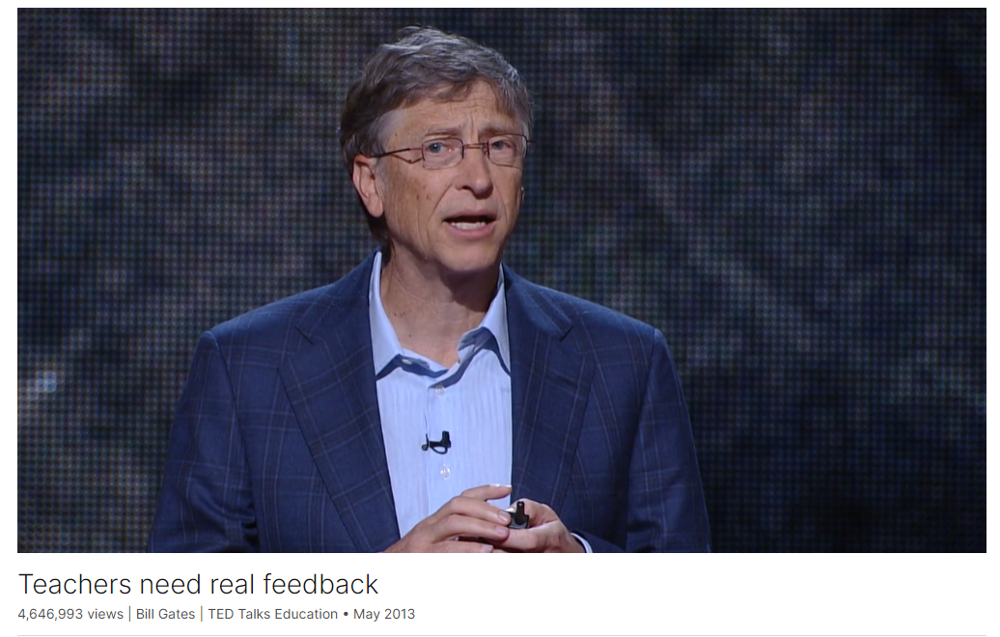

# Teachers need real feedback

Link: [https://www.ted.com/talks/bill_gates_teachers_need_real_feedback](https://www.ted.com/talks/bill_gates_teachers_need_real_feedback)

Speaker:  Bill Gates

Date: May 2013

@[toc]

## Introduction

Until recently, many teachers only got one word of feedback a year: "satisfactory." And with no feedback, no coaching, there's just no way to improve. Bill Gates suggests that even great teachers can get better with smart feedback -- and lays out a program from his foundation to bring it to every classroom.

## Vocabulary

gymnast：美 [ˈdʒɪmnæst]  体操运动员

bridge player：桥牌选手

be blown away：极其惊讶；印象深刻；

When Melinda and I learned how little useful feedback most teachers get, we were blown away. 当我和梅林达了解到大多数老师得到的有用的反馈是如此之少时，我们被震惊了。	

revamp：美 [riˈvæmp] 翻修；翻新

Today, districts are revamping the way they evaluate teachers, but we still give them almost no feedback that actually helps them improve their practice.如今，各学区正在改革评估教师的方式，但我们仍然几乎没有给他们任何实际上有助于他们改进实践的反馈。

proficiency：精通；娴熟；能力

reading proficiency：阅读能力

Consider the rankings for reading proficiency. 考虑阅读能力的排名。

make extraordinary gains: 取得非凡的成就

there are teachers throughout the country who are helping their students make extraordinary gains. 全国各地都有教师在帮助他们的学生取得非凡的成就。

tripod：美 [ˈtraɪpɑd] 三脚架

wide-angle len：广角镜头

I just have a flip camera and a little tripod and invested in this tiny little wide-angle lens. 我只有一个翻转相机和一个小三脚架，并投资在这个小小的广角镜头上。

pedagogy：美 [ˈpedəɡɑːdʒi]   教育法；教学法；教学

## Summary

In his speech, Bill Gates highlights the critical role of teachers and the lack of systematic feedback they receive to improve their practice. He emphasizes the importance of feedback in every profession, including teaching, and draws attention to the disparity in educational outcomes between countries with effective teacher feedback systems and those without. Gates stresses that teachers deserve better feedback mechanisms to enhance their skills and ultimately improve student outcomes.

Gates explores successful models of teacher feedback systems, such as those in Shanghai, China, where teachers have opportunities to observe master teachers, participate in study groups, and provide feedback to colleagues. He argues that a system that helps all teachers reach their full potential is essential for ensuring student success. Gates introduces the Measures of Effective Teaching project, which uses videos and student surveys to provide teachers with actionable feedback, demonstrating how such tools can be valuable for professional development.

Finally, Gates addresses the challenges and investments required to implement comprehensive teacher feedback systems, estimating a cost of up to five billion dollars. Despite the financial investment needed, Gates believes the impact on teacher development and student achievement would be substantial. He concludes by emphasizing the potential benefits of investing in teacher support systems, not only for individual educators but also for the future success and equity of the nation.

## Transcript

Everyone needs a coach.

It doesn't matter whether you're a basketball player,

a tennis player, a gymnast

or a bridge player.

(Laughter)

My bridge coach, Sharon Osberg,

says there are more pictures of the back of her head

than anyone else's in the world. (Laughter)

Sorry, Sharon. Here you go.

We all need people who will give us feedback.

That's how we improve.

Unfortunately, there's one group of people

who get almost no systematic feedback

to help them do their jobs better,

and these people

have one of the most important jobs in the world.

I'm talking about teachers.

When Melinda and I learned

how little useful feedback most teachers get,

we were blown away.

Until recently, over 98 percent of teachers

just got one word of feedback:

Satisfactory.

If all my bridge coach ever told me

was that I was "satisfactory,"

I would have no hope of ever getting better.

How would I know who was the best?

How would I know what I was doing differently?

Today, districts are revamping

the way they evaluate teachers,

but we still give them almost no feedback

that actually helps them improve their practice.

Our teachers deserve better.

The system we have today isn't fair to them.

It's not fair to students,

and it's putting America's global leadership at risk.

So today I want to talk about how we can help all teachers

get the tools for improvement they want and deserve.

Let's start by asking who's doing well.

Well, unfortunately there's no international ranking tables

for teacher feedback systems.

So I looked at the countries

whose students perform well academically,

and looked at what they're doing

to help their teachers improve.

Consider the rankings for reading proficiency.

The U.S. isn't number one.

We're not even in the top 10.

We're tied for 15th with Iceland and Poland.

Now, out of all the places

that do better than the U.S. in reading,

how many of them have a formal system

for helping teachers improve?

Eleven out of 14.

The U.S. is tied for 15th in reading,

but we're 23rd in science and 31st in math.

So there's really only one area where we're near the top,

and that's in failing to give our teachers

the help they need to develop their skills.

Let's look at the best academic performer:

the province of Shanghai, China.

Now, they rank number one across the board,

in reading, math and science,

and one of the keys to Shanghai's incredible success

is the way they help teachers keep improving.

They made sure that younger teachers

get a chance to watch master teachers at work.

They have weekly study groups,

where teachers get together and talk about what's working.

They even require each teacher to observe

and give feedback to their colleagues.

You might ask, why is a system like this so important?

It's because there's so much variation

in the teaching profession.

Some teachers are far more effective than others.

In fact, there are teachers throughout the country

who are helping their students make extraordinary gains.

If today's average teacher

could become as good as those teachers,

our students would be blowing away the rest of the world.

So we need a system that helps all our teachers

be as good as the best.

What would that system look like?

Well, to find out, our foundation

has been working with 3,000 teachers

in districts across the country

on a project called Measures of Effective Teaching.

We had observers watch videos

of teachers in the classroom

and rate how they did on a range of practices.

For example, did they ask their students

challenging questions?

Did they find multiple ways to explain an idea?

We also had students fill out surveys with questions like,

"Does your teacher know

when the class understands a lesson?"

"Do you learn to correct your mistakes?"

And what we found is very exciting.

First, the teachers who did well on these observations

had far better student outcomes.

So it tells us we're asking the right questions.

And second, teachers in the program told us

that these videos and these surveys from the students

were very helpful diagnostic tools,

because they pointed to specific places

where they can improve.

I want to show you what this video component of MET

looks like in action.

(Music)

(Video) Sarah Brown Wessling: Good morning everybody.

Let's talk about what's going on today.

To get started, we're doing a peer review day, okay?

A peer review day, and our goal by the end of class

is for you to be able to determine

whether or not you have moves to prove in your essays.

My name is Sarah Brown Wessling.

I am a high school English teacher

at Johnston High School in Johnston, Iowa.

Turn to somebody next to you.

Tell them what you think I mean when I talk about moves to prove. I've talk about --

I think that there is a difference for teachers

between the abstract of how we see our practice

and then the concrete reality of it.

Okay, so I would like you to please bring up your papers.

I think what video offers for us

is a certain degree of reality.

You can't really dispute what you see on the video,

and there is a lot to be learned from that,

and there are a lot of ways that we can grow

as a profession when we actually get to see this.

I just have a flip camera and a little tripod

and invested in this tiny little wide-angle lens.

At the beginning of class, I just perch it

in the back of the classroom. It's not a perfect shot.

It doesn't catch every little thing that's going on.

But I can hear the sound. I can see a lot.

And I'm able to learn a lot from it.

So it really has been a simple

but powerful tool in my own reflection.

All right, let's take a look at the long one first, okay?

Once I'm finished taping, then I put it in my computer,

and then I'll scan it and take a peek at it.

If I don't write things down, I don't remember them.

So having the notes is a part of my thinking process,

and I discover what I'm seeing as I'm writing.

I really have used it for my own personal growth

and my own personal reflection on teaching strategy

and methodology and classroom management,

and just all of those different facets of the classroom.

I'm glad that we've actually done the process before

so we can kind of compare what works, what doesn't.

I think that video exposes

so much of what's intrinsic to us as teachers

in ways that help us learn and help us understand,

and then help our broader communities understand

what this complex work is really all about.

I think it is a way to exemplify and illustrate

things that we cannot convey in a lesson plan,

things you cannot convey in a standard,

things that you cannot even sometimes convey

in a book of pedagogy.

Alrighty, everybody, have a great weekend.

I'll see you later.

[Every classroom could look like that]

(Applause)

Bill Gates: One day, we'd like every classroom in America

to look something like that.

But we still have more work to do.

Diagnosing areas where a teacher needs to improve

is only half the battle.

We also have to give them the tools they need

to act on the diagnosis.

If you learn that you need to improve

the way you teach fractions,

you should be able to watch a video

of the best person in the world teaching fractions.

So building this complete teacher feedback

and improvement system won't be easy.

For example, I know some teachers

aren't immediately comfortable with the idea

of a camera in the classroom.

That's understandable, but our experience with MET

suggests that if teachers manage the process,

if they collect video in their own classrooms,

and they pick the lessons they want to submit,

a lot of them will be eager to participate.

Building this system will also require

a considerable investment.

Our foundation estimates that it could cost

up to five billion dollars.

Now that's a big number, but to put it in perspective,

it's less than two percent

of what we spend every year on teacher salaries.

The impact for teachers would be phenomenal.

We would finally have a way to give them feedback,

as well as the means to act on it.

But this system would have

an even more important benefit for our country.

It would put us on a path to making sure

all our students get a great education,

find a career that's fulfilling and rewarding,

and have a chance to live out their dreams.

This wouldn't just make us a more successful country.

It would also make us a more fair and just one, too.

I'm excited about the opportunity

to give all our teachers the support they want and deserve.

I hope you are too.

Thank you.

(Applause)

## Afterword

2024年5月9日12点42分于上海。

