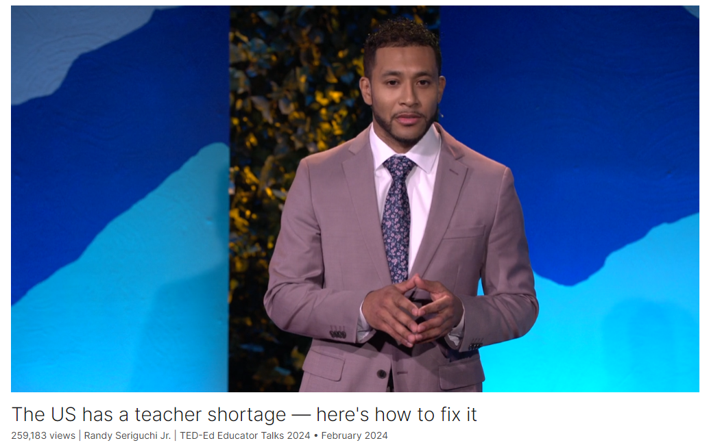

# The US has a teacher shortage — here's how to fix it

Link: [https://www.ted.com/talks/randy_seriguchi_jr_the_us_has_a_teacher_shortage_here_s_how_to_fix_it](https://www.ted.com/talks/randy_seriguchi_jr_the_us_has_a_teacher_shortage_here_s_how_to_fix_it)

Speaker:  Randy Seriguchi Jr.

Date: February 2024

@[toc]

## Introduction

How much should we invest in teachers, and what should new investment actually involve? Education innovator Randy Seriguchi Jr. suggests the US should create a "G.I. Bill" for teachers, with a particular emphasis on uplifting Black male professionals. He shares a model of this idea in action through community partnerships in San Francisco, which provide aspiring teachers with graduate school tuition, subsidized housing, personalized fit assessments and more. "If we truly want to elevate this profession to inspire new, diverse talent to join us, we have to improve both the personal and professional experiences associated with teaching," says Seriguchi.

## Vocabulary

uplifting Black male professionals 提升黑人男性专业人士

substitute：美 [ˈsʌbstɪtuːt] 代替者；代替物；替补队员

substitute teacher:  代课老师

Millions of students nationwide are impacted by having an under-qualified or substitute teacher guiding a full year of school. 全国数百万学生受到不合格或代课教师指导一整年学校的影响。

cashier：收银员

flip：翻转

McDonald's may be missing a couple of cashiers up front, but burgers will still get flipped and sold. 麦当劳可能会少了几个前台收银员，但汉堡仍然会被翻转并卖出。

in the wake of: 紧随其后；在…之后；随着…而来

So in the wake of a national teacher shortage, we have to explore new ways to recruit and retain teachers to join our schools  因此，在全国教师短缺的情况下，我们必须探索新的方法来招聘和留住教师加入我们的学校

pursue teaching：从事教学

engineer interest：创造、激发兴趣

是的，"engineer interest" 是一个短语，意思是创造、激发兴趣。在这个语境中，指的是通过某种手段或方法来激发人们对某一特定事物或领域的兴趣。

we have to engineer historic interest to inspire new people to pursue teaching. And on the other, we have to find ways to economically anchor new and existing teachers to stay for at least three to five years, 我们必须设计历史性的兴趣来激励新人从事教学。另一方面，我们必须找到经济实惠的方法，让新教师和现有教师留下来工作至少三到五年

stipend：美 [ˈstaɪˌpɛnd] 酬金，津贴

living sitpends: 生活津贴

Education supports in the form of annual tuition contributions and monthly living stipends.教育支持的形式是每年缴纳学费和每月生活津贴。	

terrain：美 [təˈreɪn] 地形；地势；地带

elevate：提升

If we truly want to elevate this profession to inspire new, diverse talent to join us, we have to improve both the personal and professional experiences associated with teaching. 如果我们真的想提升这一职业以激励新的、多样化的人才加入我们，我们必须改善与教学相关的个人和职业体验。

labor strikes：劳工罢工

holistic：美 [hoʊˈlɪstɪk] 整体的

provision：提供；条款

wellness：健康

Comfortable housing, higher education costs and holistic wellness provisions, 舒适的住房、更高的教育支出和全面的健康保障

matriculate：美 [məˈtrɪkjəˌleɪt] 被大学录取；考上大学；

have a shot of: 有机会xx

To ensure that our Black male fellows had a real shot of matriculating through teacher credentialing pathways and had guaranteed job placements,为了确保我们的黑人男性有机会通过教师资格认证的途径真正获得大学录取，并保证有工作机会

subsidize：美 [ˈsʌbsɪdaɪz] 补助；资助；补贴

subsidized housing：补贴住房；补助住房

we partnered directly with Black property owners to provide subsidized housing, 我们直接与黑人业主合作，提供补贴住房

through the roof：高得惊人

the cost of living is through the roof, literally. 不夸张地说，生活费用高得惊人。

"curb cuts" 是指人行道上的坡道，通常用于让行动不便的人（比如轮椅使用者）能够更容易地通过人行道上的路缘。这种设计使得行动不便的人能够更方便地进入和离开人行道，也便于推车、婴儿车等其他设备通过。

hinge on：取决于

the nation's prosperity hinges on the success of its educators. 国家的繁荣取决于教育者的成功。

## Transcript

Hi, I’m Randy Seriguchi Jr.,

and I've been working in teacher
recruitment for the past eight years

in the US.

And here, in the richest nation
in the history of the world,

we're in the midst of a historic
teacher shortage.

In a place where money
can solve most problems,

I've been thinking about how we respond
to this economic emergency,

and three questions come to mind.

How much is too much
to invest in teachers?

How much is too little
to invest in teachers?

And what should any new investment
in teachers actually cover?

More additional context to remember,

this teacher shortage
is about more than teachers.

Millions of students nationwide

are impacted by having an under-qualified

or substitute teacher
guiding a full year of school.

So there's a big difference
between a teacher shortage

and let's say,
a fast-food worker shortage.

McDonald's may be missing
a couple of cashiers up front,

but burgers will still
get flipped and sold.

When teachers are missing
from schools, however,

children usually aren't learning
up to standards.

So as a result,

the US is scoring 26 out of 81 nations

on an international math exam,

amongst other disappointing
educational outcomes.

And on the cusp of artificial intelligence
becoming the fourth industrial revolution,

we have a long way to go to ensure

that we are adequately prepared
to participate in the next economic boom.

So what can we do about this?

Well, we know that one major factor
in improving student outcomes

is the effectiveness of the teacher
in front of the classroom.

So in the wake of a national
teacher shortage,

we have to explore new ways
to recruit and retain teachers

to join our schools long enough

to actually become good

at one of the most difficult
professions in the world.

So this is a two-headed
monster of a problem.

On one hand,

we have to engineer historic interest

to inspire new people to pursue teaching.

And on the other,

we have to find ways to economically
anchor new and existing teachers

to stay for at least three to five years,

enough time to sufficiently increase
one's effectiveness as a teacher.

So, to attack this teacher shortage,

we can take a page
out of the military's playbook

and provide basic allowances

to make teaching more
attractive to new talent.

Some version of a teacher G.I. Bill

could help us reset the value we place
on educating our children.

How do I know something
like this could work?

Well, two reasons.

The US has done this before
and San Francisco is doing this now.

After the end of World War II,

the US government was nervous

that millions of veterans
would have trouble

readjusting to normal civilian life.

As a result, the Servicemen's
Readjustment Act,

more commonly known as the G.I. Bill,

was passed into law and created
an unprecedented investment

in American public service.

Here's what that looked like.

Education supports in the form
of annual tuition contributions

and monthly living stipends.

Workforce support in the form
of unemployment benefits

and job search guidance.

Financial support via loan guarantees,

which backed veterans’ borrowing

and increased access to credit
to buy homes and start businesses.

And wellness support.

More medical care,

including the construction
of new hospitals nationwide.

From 1944 to 1956,

the G.I. Bill gave out 
14.5 billion dollars

in education and training supports
to veterans who needed to work.

Today, this equals
about 253 billion dollars.

Could you imagine Democrats
and Republicans

voting together on this in 2024?

Me either.

(Laughter)

So what was once called
the best investment

the US government has ever made,

resulted in over eight million people
continuing their education

and millions of new home loans granted.

We invested in education, financial
and wellness supports for veterans

because of the value we place
on their public service to us

as a nation as a whole.

The battles abroad to defend our children

are just as important
as the battles we face at home.

They may be different types of terrain,

but both involve the same Americans
serving the same America.

They may be different
types of professions,

but both deserve a shot
at the same American dream.

Our teachers are true patriots.

Protecting, enhancing, developing
the lives of American children every day.

And after the pandemic changed
how we view schools and work,

it's time for us to take a chance
to invest in our teachers

as the service men
and women that they are.

If we truly want
to elevate this profession

to inspire new, diverse talent to join us,

we have to improve both the personal

and professional experiences
associated with teaching.

And in the Bay Area,

we had success doing this
with Urban Ed Academy.

After the wave of labor strikes
across this country in 2023,

we found ourselves revisiting
the questions we had in 2018,

when we started a campaign
to place one Black male teacher

in every elementary school
in San Francisco.

Those questions were,

how much is too much to invest
in Black male teachers?

How much is too little
to invest in Black male teachers?

And what should any new investment
in Black male teachers actually cover?

Well, we were not the federal government,

so we had to find creative ways
to resource our approach.

And we found that we could meet teachers'
basic needs with more than money.

Comfortable housing,

higher education costs
and holistic wellness provisions,

for example,

are possible without crazy spending —

especially if we do it
together as a village

and lower the cost burden
for everyone involved.

Our unprecedented investment
in Black male teachers

was made as a collective
community investment.

And inspired by the G.I. Bill,

we sought to inclusively
invest in education,

workforce development, financial
and wellness supports for our fellows.

Here's what that looked like
for us in our work.

To provide cost-free credentialing
and graduate school tuition,

we partnered with school districts,

the state of California
and other local partners

to wipe away tens of thousands of dollars

needed to upskill our fellows
into higher-quality classroom management.

This was an essential building block
in igniting interest in a field

where so many are leaving

and only 1.3 percent
of teachers are Black men.

To ensure that our Black male fellows

had a real shot of matriculating
through teacher credentialing pathways

and had guaranteed job placements,

we partnered with institutions
of higher education,

teacher residency programs,

and school principals

to build in more personalized
fit assessments for Black men.

More overall patience
in the hiring process,

and to give second chances to men
who usually don't receive a first.

To offer the financial and wellness
provisions I mentioned,

we partnered directly with Black property
owners to provide subsidized housing,

Black mental health professionals
to provide free therapy

and financial institutions

to support our investment
in each fellow as a whole person.

Now most of us have heard

that it is difficult for a child
to learn on an empty stomach.

Well, how difficult is it to teach
20 to 25 of those children

if you're struggling
to make ends meet yourself?

Especially living under the low-income
threshold in San Francisco,

where the cost of living is through
the roof, literally.

I know some of you may be thinking,

"Well, Randy, why just Black males?

Why not all teachers?"

Well ...

I know that bringing conversations
about race and identity into education

may be controversial and political,

but it is necessary.

I learned this lesson from the great
Angela Glover Blackwell

and her analysis of the curb cut effect.

Curb cuts were originally designed

to meet the accessibility needs
of wheelchair users

and other members
of the differently-abled community.

If you look across the country today
at street intersections,

you'll see everybody
using those curb cuts.

Seniors wheeling groceries,

parents walking small children,

vendors pushing merchandise, etc.

But I can imagine, back then someone
may have challenged universal curb cuts

with something like,

"Why prioritize one community
and cut all curbs?

This is the way curbs have always been."

(Laughter)

Well, somebody, ...

(Laughter)

We know that when we create
and design solutions

based on the needs of the most vulnerable,

everybody benefits.

And so I believe that in this country,

if we can build a system that treats
Black male teachers well,

then we're building a system
that treats all teachers well.

(Applause)

Most of you have also heard
of the African proverb

"it takes a village to raise a child."

The saying speaks to the need for us
as an entire community

to come together to support
the successful,

positive development of children.

And when I look at how some
of our children are doing today,

I get a little mad at all the villages.

We're doing a terrible job as a unit
with these children,

you know what I'm talking about.

But we can change that together

if we extend that village
mentality of support

to our teachers,

because they are the first line
of defense in our campaign

for student success.

The first line.

And these patriots need more from us.

So how much is too much
to invest in teachers?

Well in the richest nation
in the history of the world,

I know we can afford it together.

Thank you.

(Applause and cheers)

## Summary

Randy Seriguchi Jr.'s speech addresses the pressing issue of the teacher shortage in the United States and its profound impact on the education system. He begins by highlighting the severity of the shortage and its detrimental effects on millions of students nationwide. Seriguchi emphasizes the importance of addressing this shortage, particularly in contrast to other types of workforce shortages, given the critical role teachers play in shaping students' academic success. He underscores the urgency of finding innovative solutions to recruit and retain teachers, especially in light of the impending challenges posed by artificial intelligence and the need to prepare students for the future economy.

Next, Seriguchi proposes a bold solution inspired by the historic success of the G.I. Bill following World War II. He suggests implementing a similar program to invest in teachers, offering financial, educational, workforce, and wellness supports to attract new talent and encourage existing teachers to stay in the profession. Drawing parallels between the importance of veterans' service to the nation and teachers' contributions to children's lives, he advocates for a comprehensive approach to elevate the teaching profession and inspire diverse talent to join it.

In the final part of his speech, Seriguchi shares a successful example from the Bay Area, where Urban Ed Academy implemented initiatives to recruit and support Black male teachers. He explains how their approach involved collaborative partnerships and holistic support to address the unique challenges faced by Black male educators. Seriguchi emphasizes the importance of prioritizing marginalized communities in education initiatives, drawing an analogy to the curb cut effect and highlighting the benefits of designing solutions that meet the needs of the most vulnerable. He concludes by calling for collective action and community support to invest in teachers, asserting that the nation's prosperity hinges on the success of its educators.

## 后记

2024年5月8日15点28分于上海。