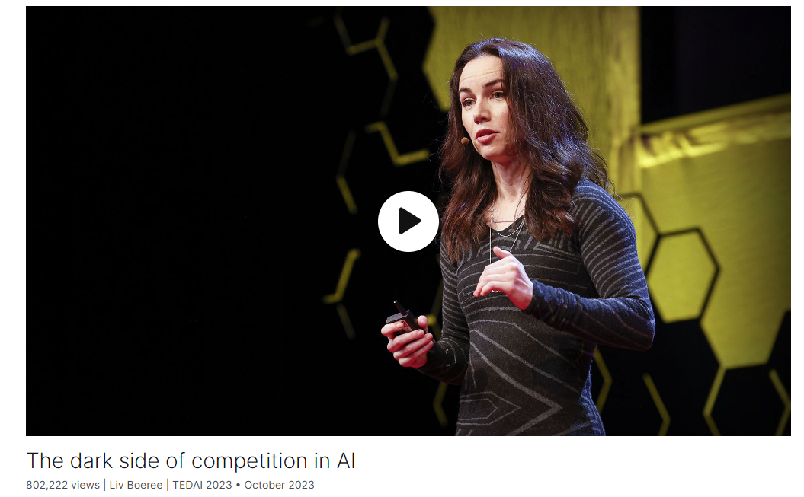

# The dark side of competition in AI

Link: [https://www.ted.com/talks/liv_boeree_the_dark_side_of_competition_in_ai](https://www.ted.com/talks/liv_boeree_the_dark_side_of_competition_in_ai)
    
Speaker:Liv Boeree 

Date: October 2023

@[toc]

## Introduction

Competition is a core part of human nature, and it can drive us to extraordinary feats. But when it goes wrong, the results can be devastating. Poker champion and science communicator Liv Boeree introduces us to "Moloch's trap" — the dark force of game theory driving many of humanity's biggest social problems, which is now threatening to derail the AI industry.

竞争是人性的核心部分，它可以驱使我们取得非凡的成就。但一旦出错，结果可能是毁灭性的。扑克冠军和科学传播者Liv Boeree向我们介绍了“Moloch的陷阱”——博弈论的黑暗力量推动了许多人类最大的社会问题，现在有可能使人工智能行业脱轨。

## Vocabulary

derail：美 [dɪˈreɪl] 使（火车；有轨电车）出轨；阻碍；

Moloch's trap: 莫洛克陷阱

在博弈论中，Moloch's trap（莫洛克陷阱）是指一种博弈情境，其中每个个体追求自己的最佳利益时，最终导致整体的不利结果。这个概念源自博弈论和经济学中的合作困境（Tragedy of the Commons），描述了个体理性选择在局部最优的情况下可能导致整体最优解无法实现的情形。

在Moloch's trap中，个体之间缺乏合作，追求自身利益可能会破坏整体利益。这种情况下，即使每个个体都知道合作会带来更好的结果，但由于担心其他人的行为或者为了追求短期利益，他们选择采取自私的行为，最终导致整体效益受损。

这个概念在许多领域都有应用，包括社会科学、经济学、生态学等，用来说明在某些情况下，个体追求自身最大利益可能会导致整体利益受损的现象。

incredible feat：令人难以置信的壮举

it can drive us to incredible feats in sports and innovation 它可以推动我们在体育和创新方面取得令人难以置信的成就

healthy competition：良性竞争

create win-win outcomes: 双赢

create lose-lose outcomes: 双输

In the long run, the game between them creates win-win outcomes where everyone benefits in the end. But sometimes competition is not so great and can create lose-lose outcomes where everyone's worse off than before. 从长远来看，他们之间的博弈创造了双赢的结果，最终每个人都受益。但有时竞争不是那么良性，可能会造成两败俱伤的结果，每个人的处境都比以前更糟。

salvage：美 [ˈsælvɪdʒ] 拯救，挽救

They can salvage almost any picture. They can even make Angelina and Margot more beautiful.

制造问题：create issues

And there's growing evidence that they're creating issues like body dysmorphia, especially in young people.

body dysmorphia: 躯体变形障碍

dysmorphia：美 [dɪsˈmɔrfiə] 变形

> **Body dysmorphic disorder (BDD), or body dysmorphia, is a mental health condition where a person spends a lot of time worrying about flaws in their appearance. These flaws are often unnoticeable to others.**
>
> People of any age can have BDD, but it's most common in teenagers and young adults. It affects both men and women.
>
> Having BDD does not mean you're vain or self-obsessed. It can be very upsetting and have a big impact on your life.
>
> **躯体变形障碍**是一种心理健康疾病，患者无法停止臆想自己的外表存在一种或多种自认为的缺陷或缺点之处。 即使只是轻微或者他人看不到的缺点，也可能令患者感到尴尬、羞愧和焦虑，甚至因此避免很多社交场合。

endemic：美 [enˈdemɪk] 流行的；某地特有的；地方性的

these things are now endemic to social media 这些事情现在是社交媒体的通病

limbic system：边缘系统

hijack: 美 [ˈhaɪdʒæk]  劫持

incentivize:美 [ɪnˈsentɪˌvaɪz]  刺激；鼓励；使（人）有积极性

crappy incentives：低劣的激励

>**边缘系统**（英文：Limbic system）指包含海马体及杏仁体在内，支援多种功能例如情绪、行为及长期记忆的大脑结构。 这种被描述为边缘系统的脑部结构与嗅觉结构相近。 术语“limbic”源自拉丁文“limbus”，意指“边界”或“边缘”。 边缘系统包括无数在大脑皮质及皮质下区域的结构，其中包括传统上定义的“边缘叶”。

The platforms are incentivized to provide them because hotter pictures means more hijacked limbic systems, which means more scrolling and thus more ad revenue. 平台有动力提供这些服务，因为更性感的图片意味着更多被劫持的边缘系统，这意味着更多的屏幕滑动，从而带来更多的广告收入。

news outlets: 新闻媒体

>Then I watch as mainstream *news outlets* cover the story. 
>
>之后我看到了主流媒体是怎样报道这则新闻的。 
>
>www.kekenet.com
>
>But as Western *news outlets* jumped on the report, excitement spread. 
>
>但正如西方的媒体也开始了类似的报道，兴奋蔓延开了。 
>
>dict.youdao.com
>
>*News outlets* like New York Times, Popular Science and Readers'Digest raved about Lockitron. 
>
>新闻媒体，像是《纽约时报》、《科技新时代》和《读者文摘》都极力赞赏“立即锁”。 
>
>www.kekenet.com

clickbait: 点击诱饵，标题党

>The relevance of this, beyond *clickbait*, coloring books and monster movies is unknown. 
>
>除了与骗取点击量、填色绘本和怪兽电影的关联，似乎再无其他。 
>
>www.kekenet.com
>
>Now, *clickbait*. Very interesting little situation here. Click, you know, on the mouse, you click. 
>
>现在来讲，标题党。这个东西很有意思。点击，你知道用鼠标点击。 
>
>www.kekenet.com
>
>So, *clickbait* is headlines, very powerful headlines or pictures that really, all these people want is for you to click on them. 
>
>所以，标题党就是使用非常有力的标题或图片，所有这些人想要的是你点进去。 
>
>www.kekenet.com

low-brow: 低俗的，低级的

You'd think since the internet came along that the increased competition between news outlets would create a sort of positive spiral, **like a race to the top of nuanced, impartial, accurate journalism.** Instead, we're seeing **a race to the bottom of clickbait and polarization**, where even respectable papers are increasingly leaning into these kind of low-brow partisan tactics. 你可能会认为，自从互联网出现以来，新闻媒体之间日益激烈的竞争会形成一种良性循环，就像一场向细致入微、公正准确的新闻业顶端的竞赛。相反，我们看到的是一场点击诱饵和两极分化的竞赛，甚至令人尊敬的报纸也越来越倾向于这种低级的党派策略。

go viral：火了

And headlines that trigger emotions like fear or anger are far more likely to go viral than neutral or positive ones. 引发恐惧或愤怒等情绪的标题比中性或积极的标题更容易传播（更容易火）。

discern truth from fiction：辨别真伪

But this is terrible for everybody, because now the media get less trust from the public, but also it becomes harder and harder for anyone to discern truth from fiction, which is a really big problem for democracy. 但这对每个人来说都很糟糕，因为现在媒体越来越得不到公众的信任，而且任何人都越来越难辨别真伪，这对民主来说是一个很大的问题。

abstract and clunky：抽象和笨重的（指一些抽象的词语）

roll off the tongue：脱口而出

You can see they're a little bit abstract and clunky, right? They don't exactly roll off the tongue. And given how insidious and connected all of these problems are, it helps to have a more visceral way of recognizing them. 你可以看到他们有点抽象和笨重，对不对？它们并不一定会脱口而出。考虑到所有这些问题是多么的阴险和相互关联，以一种更发自内心的方式认识它们会有所帮助。

biosphere：美 [ˈbaɪoʊsfɪr] 生物圈

We get so lost in winning the game right in front of us, we lose sight of the bigger picture and sacrifice too much in our pursuit of victory. So just like these guys were sacrificing their children for power, those influencers are sacrificing their happiness for likes. Those news editors are sacrificing their integrity for clicks, and polluters are sacrificing the biosphere for profit. In all these examples, the short-term incentives of the games themselves are pushing, they're tempting their players to sacrifice more and more of their future, trapping them in a death spiral where they all lose in the end. That's Moloch's trap. 我们在赢得眼前的比赛时迷失了方向，忽略了大局，在追求胜利的过程中牺牲了太多。因此，就像这些人为了权力而牺牲自己的孩子一样，那些有影响力的人为了喜欢而牺牲自己的幸福。那些新闻编辑为了点击量牺牲了他们的诚信，污染者为了利润牺牲了生物圈。在所有这些例子中，游戏本身的短期激励正在推波助澜，它们诱惑玩家牺牲越来越多的未来，使他们陷入最终都失败的死亡螺旋。这就是莫洛克陷阱。

hallmark：特征，特点

reverence：美 [ˈrevərəns] 尊敬，敬畏

A moment in time so pivotal, it's deserving of reverence and reflection如此关键的时刻，值得敬畏和反思

beholden to ：idiom

>**formal**
>
>**:** owing a favor or gift to (someone) **:** having obligations to (someone)
>
>politicians who are *beholden to* special interest groups
>
>She works for herself, and so is *beholden to* no one.
>
>听命于特殊利益集团的政客
>她为自己工作，因此不受制于任何人。
>
>https://www.merriam-webster.com/dictionary/beholden%20to

So we need AI leaders to show us that they're not only aware of the risks their technologies pose, but also the destructive nature of the incentives that **they're currently beholden to**. 因此，我们需要人工智能领导者向我们表明，他们不仅意识到他们的技术带来的风险，而且意识到他们目前所依赖的激励措施的破坏性。

wield: 美 [wiːld] 行使

>[wield power]
>
>行使权力
>
>[wield influence]
>
>运用影响力

pledge: 保证，许诺

Anthropic recently announced their responsible scaling policy, which pledges to only increase capabilities once certain security criteria have been met. Anthropic最近宣布了他们负责任的扩展政策，承诺只有在满足特定安全标准后才会增加功能。

These are all steps in the right direction, but **they are still nowhere close to being enough**. 这些都是朝着正确方向迈出的步伐，但还远远不够。

stake：赌注

astronomical：美 [ˌæstrəˈnɑːmɪkl] 极大的，巨大的，天文学的

Competition can be an amazing tool, provided we wield it wisely. And we're going to need to do that because the stakes we are playing for are astronomical. 竞争可以是一种神奇的工具，只要我们明智地运用它。我们需要这样做，因为我们的赌注是天文数字。

## Summary

The speaker discusses the concept of competition, highlighting its various manifestations and impacts, both positive and negative, using examples from different industries like technology, media, and environmental conservation. She explains how competition can lead to harmful outcomes when driven by misaligned incentives, creating lose-lose situations. Drawing parallels with the Moloch myth, she warns against the dangers of sacrificing long-term benefits for short-term gains. The speaker emphasizes the need for AI leaders to prioritize ethical considerations over competitive pressures, suggesting that smart regulation and responsible practices are crucial in navigating the challenges posed by advanced AI technologies. She concludes by advocating for a shift in mindset among AI developers and companies, urging them to collaborate and innovate responsibly to avoid the pitfalls of unchecked competition.

演讲者讨论了竞争的概念，强调了其各种表现形式和影响，无论是积极的还是消极的，都使用了来自不同行业（如技术、媒体和环境保护）的例子。她解释了当竞争由不协调的激励驱动时，会导致有害结果，造成双输局面。她将这一现象与摩洛克神话相提并论，警告人们不要为了获得胜利而牺牲长远利益。演讲者强调了AI领导者需要优先考虑道德因素而不是竞争压力的重要性，建议智能监管和负责任的做法在应对先进AI技术带来的挑战时至关重要。她最后呼吁AI开发者和公司改变思维方式，敦促他们合作创新，以避免不受限制的竞争带来的陷阱。

## Transcript

Competition.

It's a fundamental part of human nature.

I was a professional
poker player for 10 years,

so I've very much seen all the good,
bad and ugly ways it can manifest.

When it's done right,

it can drive us to incredible feats
in sports and innovation,

like when car companies compete
over who can build the safest cars

or the most efficient solar panels.

Those are all examples
of healthy competition,

because even though individual
companies might come and go,

in the long run,

the game between them
creates win-win outcomes

where everyone benefits in the end.

But sometimes competition is not so great

and can create lose-lose outcomes
where everyone's worse off than before.

Take these AI beauty filters, for example.

As you can see, they're a very
impressive technology.

They can salvage almost any picture.

They can even make Angelina
and Margot more beautiful.

So they're very handy,

especially for influencers who,
now, at the click of a button,

can transform into the most beautiful
Hollywood versions of themselves.

But handy doesn't always mean healthy.

And I've personally noticed
how quickly these things can train you

to hate your natural face.

And there's growing evidence
that they're creating issues

like body dysmorphia,
especially in young people.

Nonetheless, these things are now
endemic to social media

because the nature of the game demands it.

The platforms are incentivized
to provide them

because hotter pictures means
more hijacked limbic systems,

which means more scrolling
and thus more ad revenue.

And users are incentivized to use them

because hotter pictures
get you more followers.

But this is a trap,

because once you start using these things,

it's really hard to go back.

Plus, you don't even get a competitive
advantage from them anymore

because everyone else
is already using them too.

So influencers are stuck
using these things

with all the downsides

and very little upside.

A lose-lose game.

A similar kind of trap is playing out
in our news media right now,

but with much worse consequences.

You'd think since the internet came along

that the increased competition
between news outlets

would create a sort of positive spiral,

like a race to the top of nuanced,
impartial, accurate journalism.

Instead, we're seeing a race to the bottom
of clickbait and polarization,

where even respectable papers
are increasingly leaning

into these kind of low-brow
partisan tactics.

Again, this is due to crappy incentives.

Today, we no longer just read our news.

We interact with it
by sharing and commenting.

And headlines that trigger
emotions like fear or anger

are far more likely to go viral
than neutral or positive ones.

So in many ways, news editors
are in a similar kind of trap

as the influencers,

where, the more their competitors
lean into clickbaity tactics,

the more they have to as well.

Otherwise, their stories
just get lost in the noise.

But this is terrible for everybody,

because now the media get
less trust from the public,

but also it becomes harder and harder
for anyone to discern truth from fiction,

which is a really big problem
for democracy.

Now, this process
of competition gone wrong

is actually the driving force
behind so many of our biggest issues.

Plastic pollution,

deforestation,

antibiotic overuse in farming,

arms races,

greenhouse gas emissions.

These are all a result
of crappy incentives,

of poorly designed games
that push their players --

be them people, companies
or governments --

into taking strategies and tactics
that defer costs and harms to the future.

And what's so ridiculous
is that most of the time,

these guys don't even want
to be doing this.

You know, it's not like
packaging companies

want to fill the oceans with plastic

or farmers want to worsen
antibiotic resistance.

But they’re all stuck
in the same dilemma of:

"If I don't use this tactic,

I’ll get outcompeted
by all the others who do.

So I have to do it, too.”

This is the mechanism
we need to fix as a civilization.

And I know what you're probably
all thinking, "So it's capitalism."

No, it's not capitalism.

Which, yes, can cause problems,

but it can also solve them
and has been fantastic in general.

It's something much deeper.

It's a force of misaligned incentives
of game theory itself.

So a few years ago, I retired from poker,

in part because I wanted to understand
this mechanism better.

Because it takes many different forms,
and it goes by many different names.

These are just some of those names.

You can see they're a little bit
abstract and clunky, right?

They don't exactly roll off the tongue.

And given how insidious and connected
all of these problems are,

it helps to have a more visceral way
of recognizing them.

So this is probably the only time

you're going to hear
about the Bible at this conference.

But I want to tell you
a quick story from it,

because allegedly,
back in the Canaanite days,

there was a cult who wanted
money and power so badly,

they were willing to sacrifice
their literal children for it.

And they did this by burning
them alive in an effigy

of a God that they believed
would then reward them

for this ultimate sacrifice.

And the name of this god was Moloch.

Bit of a bummer, as stories go.

But you can see why it's an apt metaphor,

because sometimes we get so lost
in winning the game right in front of us,

we lose sight of the bigger picture

and sacrifice too much
in our pursuit of victory.

So just like these guys were sacrificing
their children for power,

those influencers are sacrificing
their happiness for likes.

Those news editors are sacrificing
their integrity for clicks,

and polluters are sacrificing
the biosphere for profit.

In all these examples,

the short-term incentives
of the games themselves are pushing,

they're tempting their players

to sacrifice more and more
of their future,

trapping them in a death spiral
where they all lose in the end.

That's Moloch's trap.

The mechanism of unhealthy competition.

And the same is now happening
in the AI industry.

We're all aware of the race
that's heating up

between companies right now

over who can score the most compute,

who can get the biggest
funding round or get the top talent.

Well, as more and more companies
enter this race,

the greater the pressure for everyone
to go as fast as possible

and sacrifice other important stuff
like safety testing.

This has all the hallmarks
of a Moloch trap.

Because, like, imagine you're a CEO
who, you know, in your heart of hearts,

believes that your team is the best

to be able to safely build
extremely powerful AI.

Well, if you go too slowly,
then you run the risk of other,

much less cautious teams
getting there first

and deploying their systems
before you can.

So that in turn pushes you
to be more reckless yourself.

And given how many different
experts and researchers,

both within these companies

but also completely independent ones,

have been warning us
about the extreme risks of rushed AI,

this approach is absolutely mad.

Plus, almost all AI companies

are beholden to satisfying
their investors,

a short-term incentive which, over time,
will inevitably start to conflict

with any benevolent mission.

And this wouldn't be a big deal

if this was really just toasters
we're talking about here.

But AI, and especially AGI,

is set to be a bigger paradigm shift

than the agricultural
or industrial revolutions.

A moment in time so pivotal,

it's deserving
of reverence and reflection,

not something to be reduced
to a corporate rat race

of who can score the most
daily active users.

I'm not saying I know

what the right trade-off
between acceleration and safety is,

but I do know that we'll never find out
what that right trade-off is

if we let Moloch dictate it for us.

So what can we do?

Well, the good news is
we have managed to coordinate

to escape some of Moloch's traps before.

We managed to save
the ozone layer from CFCs

with the help of the Montreal Protocol.

We managed to reduce the number
of nuclear weapons on Earth

by 80 percent,

with the help of the Strategic Arms
Reduction Treaty in 1991.

So smart regulation
may certainly help with AI too,

but ultimately,

it's the players within the game
who have the most influence on it.

So we need AI leaders to show us

that they're not only aware
of the risks their technologies pose,

but also the destructive nature
of the incentives

that they're currently beholden to.

As their technological capabilities
reach towards the power of gods,

they're going to need the godlike wisdom
to know how to wield them.

So it doesn't fill me with encouragement

when I see a CEO of a very major company
saying something like,

"I want people to know
we made our competitor dance."

That is not the type
of mindset we need here.

We need leaders who are willing
to flip Moloch's playbook,

who are willing to sacrifice
their own individual chance of winning

for the good of the whole.

Now, fortunately, the three leading labs
are showing some signs of doing this.

Anthropic recently announced
their responsible scaling policy,

which pledges to only
increase capabilities

once certain security
criteria have been met.

OpenAI have recently pledged

to dedicate 20 percent of their compute
purely to alignment research.

And DeepMind have shown
a decade-long focus

of science ahead of commerce,

like their development of AlphaFold,

which they gave away
to the science community for free.

These are all steps
in the right direction,

but they are still
nowhere close to being enough.

I mean, most of these
are currently just words,

they're not even proven actions.

So we need a clear way to turn the AI race
into a definitive race to the top.

Perhaps companies can start competing
over who can be within these metrics,

over who can develop
the best security criteria.

A race of who can dedicate
the most compute to alignment.

Now that would truly flip
the middle finger to Moloch.

Competition can be an amazing tool,

provided we wield it wisely.

And we're going to need to do that

because the stakes
we are playing for are astronomical.

If we get AI, and especially AGI, wrong,

it could lead to unimaginable catastrophe.

But if we get it right,

it could be our path out
of many of these Moloch traps

that I've mentioned today.

And as things get crazier
over the coming years,

which they're probably going to,

it's going to be more important than ever

that we remember that it
is the real enemy here, Moloch.

Not any individual CEO or company,
and certainly not one another.

So don't hate the players,

change the game.

(Applause)

## Afterword

2024年4月12日20点40分于上海。