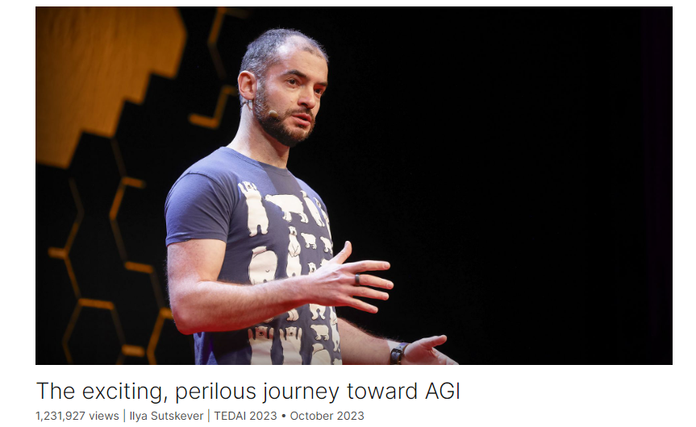

# The exciting, perilous journey toward AGI

Link: [https://www.ted.com/talks/ilya_sutskever_the_exciting_perilous_journey_toward_agi?](https://www.ted.com/talks/ilya_sutskever_the_exciting_perilous_journey_toward_agi?)

Speaker: Ilya Sutskever

Date: October 2023

@[toc]

## Introduction

Just weeks before the management shakeup at OpenAI rocked Silicon Valley and made international news, the company's cofounder and chief scientist Ilya Sutskever explored the transformative potential of artificial general intelligence (AGI), highlighting how it could surpass human intelligence and profoundly transform every aspect of life. Hear his take on the promises and perils of AGI — and his optimistic case for how unprecedented collaboration will ensure its safe and beneficial development.

就在OpenAI管理层变动震惊硅谷并成为国际新闻的几周前，该公司的联合创始人兼首席科学家伊利亚·苏茨基弗探索了通用人工智能（AGI）的变革潜力，强调它如何超越人类智力并深刻改变生活的方方面面。听听他对AGI的承诺和风险的看法——以及他对前所未有的合作将如何确保其安全和有益的发展的乐观看法。

## Vocabulary

the management shakeup: 管理层变动

peril：美 [ˈperəl]  危险

perilous：美 [ˈperələs] 充满危险的

unprecedented collaboration：前所未有的合作；美 [ʌnˈpresɪdentɪd] 

impactful: 美 [ɪmˈpæktfl]  有重大影响力的   the impact is truly vast 影响力非常巨大

And it's also not difficult to imagine that when that happens, the impact of such artificial intelligence is going to be truly, truly vast. And you may wonder: Is it going to be OK when technology is so impactful? 不难想象，当这种情况发生时，这种人工智能的影响将是非常非常巨大的。你可能会想:当科技如此具有影响力时，一切都会好吗？

the seat of intelligence：智能中心

Now, I find it interesting that the seat of intelligence in human beings is our biological brain. It is fitting that the seat of intelligence in artificial intelligence is an artificial brain. 现在，我发现有趣的是，人类的智能中心是我们的生物大脑。人工智能中的智能中心是人工大脑，这是恰当的。

digression：美 [daɪ'ɡreʃn]  离题

take a digression: 说一句题外话

Here, I'd like to take a digression and tell you about how I got into AI. 在这里，我想说一句题外话，告诉你我是如何进入AI领域的。

in a way：在某种程度上，在某种意义上

pedestrian：美 [pəˈdestriən] 缺乏想像力的；平淡无奇的；乏味的

The second motivation was more pedestrian in a way. 第二个动机在某种程度上更加平淡。

So these were the three reasons that pulled me towards AI. That's why I thought that's a great area to **spend all my efforts on**. 这是吸引我走向人工智能的三个原因。这就是为什么我认为这是一个值得我全力以赴的领域。

artificial general intelligence： AGI 通用人工智能

exhaustive：美 [ɪɡˈzɔːstɪv] 全面彻底的；详尽无遗的

 have complete and exhaustive knowledge ：拥有完整和详尽的知识

clinical experience：临床经验

If you have an intelligent computer, an AGI, that is built to be a doctor, it will have complete and exhaustive knowledge of all medical literature, billions of hours of clinical experience, and be always available and extremely cheap. When this happens, we will look back at today's health care similarly to how we look at 16th-century dentistry. 如果你有一台智能计算机，一台AGI，它被设定为一名医生，它将拥有所有医学文献的完整和详尽的知识，数十亿小时的临床经验，并且随时可用，价格极其便宜。当这种情况发生时，我们将像看待16世纪的牙科一样回顾今天的医疗保健。

go rogue：离群（去做危险的事）

rogue：美 [roʊɡ] 

>**to start behaving in a way that is not normal or expected, especially by leaving your group and doing something dangerous:**
>
>. A Special Forces unit had gone rogue and was trying to free the hostage.
>
>· Her latest novel is about an undercover government agent who appears to have gone rogue.
>
>· But this is not your standard 'cop goes rogue' movie.
>
>· The party leader had accused her of going rogue.
>
>· One of the circus elephants went rogue and trampled several large props.
>
>Source: https://dictionary.cambridge.org/us/dictionary/english/go-rogue

where it is headed：发展方向

dramatic：戏剧的，显著的，突出的，令人激动的

fantastical：美 [fæn'tæstɪkəl] 空想的，捕风捉影的，奇异的，不可思议的

example： how dramatic, incredible, and almost fantastical AGI is going to be

trepidation： 美 [ˌtrɛpəˈdeɪʃ(ə)n]  恐惧，不安

And as AI continues to make progress, as technology advances, and as more and more people see what AI can do and where it is headed, then it will become clear just how dramatic, incredible, and almost fantastical AGI is going to be, and how much trepidation is appropriate. 随着人工智能继续取得进展，随着技术的进步，随着越来越多的人看到人工智能的能力和发展方向，AGI将变得多么引人注目、不可思议和几乎不可思议，以及多少恐惧是适当的，这将变得显而易见。

posed：造成

And this is an important reason why I'm hopeful that despite the great challenges posed by this technology, we will overcome them. 这就是为什么尽管这项技术带来了巨大的挑战，但我仍然充满希望的重要原因。

## Transcript

You've all experienced the progress
of artificial intelligence.

Many of you may have spoken
with a computer,

and a computer understood you

and spoke back to you.

With the rate of progress
being that it is,

it's not difficult to imagine
that at some point in the future,

our intelligent computers will become
as smart or smarter than people.

And it's also not difficult to imagine
that when that happens,

the impact of such artificial intelligence

is going to be truly, truly vast.

And you may wonder:

Is it going to be OK
when technology is so impactful?

And here my goal is to point out
the existence of a force

that many of you may have not noticed,

that gives me hope that indeed,

we will be happy with the result.

So artificial intelligence.

What is it, and how does it work?

Well, it turns out
that it's very easy to explain

how artificial intelligence works.

Just one sentence.

Artificial intelligence
is nothing but digital brains

inside large computers.

That's what artificial intelligence is.

Every single interesting AI
that you've seen

is based on this idea.

Over the decades,

scientists and engineers
have been figuring out

how such digital brains should work

and how to build them,
how to engineer them.

Now, I find it interesting

that the seat of intelligence
in human beings is our biological brain.

It is fitting that the seat
of intelligence

in artificial intelligence

is an artificial brain.

Here, I'd like to take a digression
and tell you about how I got into AI.

There were three forces
that pulled me into it.

The first one was
that when I was a little child,

at around the age of five or six,

I was very struck
by my own conscious experience,

by the fact that I am me
and I am experiencing things.

That when I look at things, I see them.

Like, this feeling over time
went away, though,

by simply mentioning it to you
right now it comes back.

But this this feeling of ...

That I am me, that you are you,

I found it very strange
and very disturbing almost.

And so when I learned
about artificial intelligence,

I thought, wow,
if we could build a computer

that is intelligent,

maybe we will learn
something about ourselves,

about our own consciousness.

That was my first motivation
that pulled me towards AI.

The second motivation
was more pedestrian in a way.

I was simply curious
about how intelligence works.

And when I was a teenager,
an early teenager in the late '90s,

the sense that I got is that science
simply did not know

how intelligence worked.

There was also a third reason,

which is that it was clear to me back then

that artificial intelligence,

if it worked, it would be
incredibly impactful.

Now, it wasn't at all obvious

that it will be possible to make
progress in artificial intelligence,

but if it were possible to make
progress in artificial intelligence,

that would be incredibly impactful.

So these were the three reasons
that pulled me towards AI.

That's why I thought that's a great area
to spend all my efforts on.

So now let's come back
to our artificial intelligence,

the digital brains.

Today, these digital brains

are far less smart
than our biological brains.

When you speak to an AI chat bot,

you very quickly see
that it's not all there,

that it's, you know,

it understands mostly, sort of.

But you can clearly see that there
are so many things it cannot do

and that there are some strange gaps.

But this situation, I claim, is temporary.

As researchers and engineers
continue to work on AI,

the day will come when the digital brains
that live inside our computers

will become as good and even better
than our own biological brains.

Computers will become smarter than us.

We call such an AI an “AGI,”
artificial general intelligence.

When we can say that the level at which
we can teach the AI to do anything

that, for example, I can do,
or someone else.

So although AGI does not exist today,

we can still gain
a little bit of an insight

into the impact of AGI once it's built.

It is completely obvious

that such an AGI
will have a dramatic impact

on every area of life,
of human activity and society.

And I want to go over a quick case study.

This is a narrow example
of a very, very broad technology.

The example I want to present
is health care.

Many of you may have had the experience
of trying to go to a doctor.

You need to wait for many
months sometimes,

and then when you do get to see
a doctor, you get a small,

very limited amount of time
with the doctor

and furthermore, the doctor,
being only human,

can have only limited
knowledge of all this,

all the medical knowledge that exists.

And then by the end of it,
you get a very large bill.

(Laughter)

Well, if you have an intelligent computer,
an AGI, that is built to be a doctor,

it will have complete and exhaustive
knowledge of all medical literature.

It will have billions of hours
of clinical experience,

and it will be always available
and extremely cheap.

When this happens,

we will look back at today's health care

similarly to how we look
at 16th century dentistry.

(Laughter)

You know, when they tied people
with belts and then have this drill,

that's how today's
health care will look like.

And again, to emphasize,
this is just one example.

This is just one example.

AGI will have dramatic
and incredible impact

on every single area of human activity.

But when you see impact this large,
you may wonder, "Gosh,

isn't this technology too impactful?"

And indeed, for every positive
application of AGI,

there will be a negative
application as well.

This technology is also
going to be different

from technologies that we are used to,

because it will have the ability
to improve itself.

It is possible to build an AGI

that will work on the next
generation of AGI.

The closest analogue we have to this kind
of rapid technological improvement

is when the Industrial Revolution
has taken place, where humans,

the material condition of human society,
was very, very constant.

And then it was a rapid
increase, rapid growth.

With AGI,

something like this could happen again,
but on a shorter timescale.

And then furthermore,

there are concerns around

if an AGI ever becomes
very, very powerful,

which is possible,

maybe it will want to go rogue
being that it is an agent.

So this is a concern that exists
with this unprecedented,

not yet existing technology.

And indeed,

you look at all the positive
potential of AGI

and all the concerning
possibilities of AGI as well,

and you may say, "Gosh,
where is this all headed?"

One of my motivations
in creating OpenAI was,

in addition to developing this technology,

was also to address the questions

that are posed by AGI,
the difficult questions,

the concerns that we raised.

In addition to working with governments

and helping them understand
what is coming and prepare for it,

we are also doing a lot of research

on addressing the technological
side of things,

so that the AI will never
want to go rogue.

And this is something which
I’m working on as well.

But I think, the thing to note,

because AI and AGI is really
the only area of the economy

where there is a lot of excitement,
a lot of investment,

everyone is working on it,

there's a huge number of labs in the world
trying to build the same thing.

Even if OpenAI takes these desirable
steps that I mentioned,

what about the rest of the companies
and the rest of the world?

And this is where I want
to make my observation

about the force that exists.

The observation is this:
consider the world one year ago,

as recently as one year ago.

People weren't really talking about AI,
not in the same way at all.

What happened?

We all experienced what it's like to talk
to a computer and to be understood.

The idea that computers
will become really intelligent

and eventually more intelligent
than us is becoming widespread.

It used to be a niche idea
that only a few enthusiasts

and hobbyists and people
who were very into AI were thinking about.

But now everyone is thinking about it.

And as the AI continues to make progress,

as technology continues to advance,

as more and more people see what AI can do

and where it is headed towards,

then it will become clear
just how dramatic,

incredible and ...

almost fantastical AGI is going to be

and how much trepidation is appropriate.

And what I claim will happen
is that people will start to act

in unprecedentedly collaborative way
out of their own self-interest.

It's already happening right now.

You see the leading AGI companies
starting to collaborate

for a specific example, through
the Frontier Model Forum.

And we will expect that companies
that are competitors

will share technical information
to make their AIs safe.

We may even see governments do this.

For another example,

at OpenAI, we really believed
in how dramatic AGI is going to be.

So one of the ideas
that we were operating by,

and it's been written
on our website for five years now,

that when technology gets such
that we are very, very close to AGI,

to computers smarter than humans,

and if some other company
is far ahead of us,

then rather than compete with them,

we will help them out,
join them, in a sense.

And why do that?

Because we feel, we appreciate

how incredibly dramatic
AGI is going to be.

And my claim is that with each
generation of capability advancements,

as AI gets better

and as all of you experience
what AI can do,

as people who run AI efforts
and AGI efforts

and people who work on them
will experience it as well,

this will change the way
we see AI and AGI,

and that will change collective behavior.

And this is an important reason

why I'm hopeful

that despite the great challenges
that's posed by this technology,

we will overcome them.

Thank you.

(Applause)

## Summary

The speaker's presentation focused on the advancement of artificial intelligence (AI), particularly the concept of artificial general intelligence (AGI). He highlighted the rapid progress of AI technology and its potential to surpass human intelligence. The speaker emphasized the profound impact AGI could have on various aspects of society, such as healthcare, where intelligent computers could revolutionize medical practices.

Despite acknowledging the challenges and concerns surrounding AGI, such as the potential for AI to become uncontrollable or "go rogue," the speaker remained hopeful. He pointed out that as AI continues to progress and more people become aware of its capabilities, there will be a natural shift towards collaborative efforts to ensure AI's safe and beneficial development.

In conclusion, the speaker expressed optimism about our ability to navigate the challenges posed by AGI, believing that increased collaboration and understanding will lead to a positive outcome.

Wy does the speaker do research in AI？

The speaker was drawn to research in AI for several reasons. Firstly, from a young age, he was fascinated by his own conscious experience and saw AI as a potential tool to better understand human consciousness. Secondly, he was curious about how intelligence works and was motivated by the challenge of unraveling this complex phenomenon. Finally, he recognized the immense potential impact of AI, believing that if successful, it would be incredibly impactful across all areas of human activity and society.

## 后记

2024年4月11日12点48分于上海。

