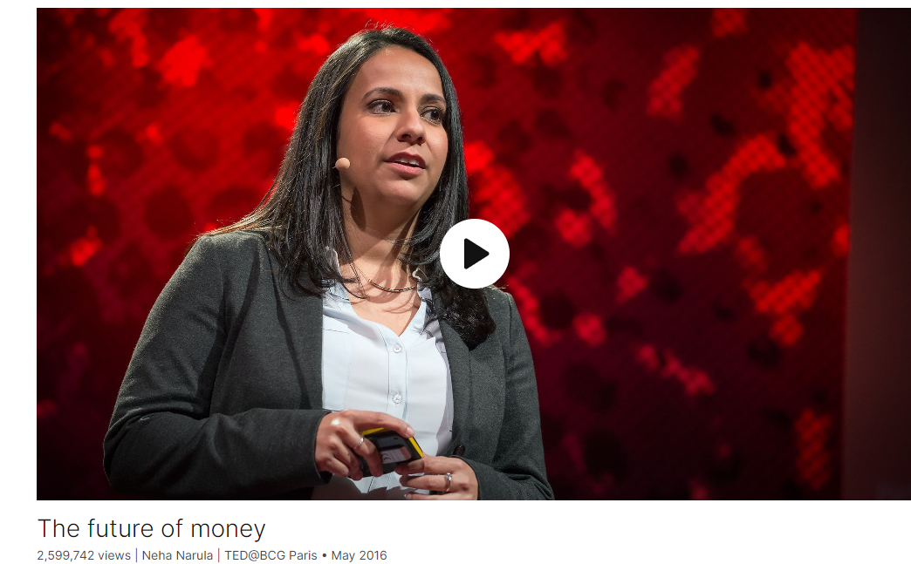

# The future of money

Link: [https://www.ted.com/talks/neha_narula_the_future_of_money](https://www.ted.com/talks/neha_narula_the_future_of_money)

Speaker:  Neha Narula 

Date:  May 2016

@[toc]

## Introduction

What happens when the way we buy, sell and pay for things changes, perhaps even removing the need for banks or currency exchange bureaus? That's the radical promise of a world powered by cryptocurrencies like Bitcoin and Ethereum. We're not there yet, but in this sparky talk, digital currency researcher Neha Narula describes the collective fiction of money -- and paints a picture of a very different looking future.

## Vocabulary

Micronesia: 密克罗尼西亚

limestone: 美 [ˈlaɪmstoʊn] 灰岩；石灰岩

disc: 圆盘；圆板；圆片；

They use these limestone discs called Rai stones. 他们使用的货币是由石灰岩凿刻出来的圆盘，称为“拉伊石币”

holding: 持有

In 1932, the Bank of France asked the United States to convert their holdings from dollars into gold. 1932年，法国银行要求美国将其持有的美元兑换成黄金。

inherent：内在的；固有的；本质的；

there's nothing inherently valuable about a dollar or a stone or a coin. 一美元、一块石头或一枚硬币本身没有什么价值。

direct deposit：直接存款，电子转账

bank transfer：银行转账

deduct：扣除

paycheck：薪水

mutual fund：共同基金

retirement account：退休账户

So I get paid via direct deposit, I pay my rent via bank transfer, I pay my taxes online. And every month, a small amount of money is deducted from my paycheck and invested in mutual funds in my retirement account. 所以我通过直接存款获得报酬，通过银行转账支付租金，在线缴税。每个月，都会从我的工资中扣除一小部分钱，投资到我退休账户的共同基金中。

underwrite： 通过保险承担；同意承担…的费用；同意承担…经济负担；承购；包销；

transact：美 [trænˈzækt] 办理，处理，交易

captive：美 [ˈkæptɪv] 被囚禁的；受控制的；受限制的；

Our access to digital money and our ability to freely transact is being held captive by these gatekeepers. 我们对数字货币的访问和我们自由交易的能力被这些看门人（指大机构）所控制。

impediment：美 [ɪmˈpedɪmənt] 妨碍；阻碍；障碍物；

These institutions are standing in the way of innovation 这些机构阻碍了创新

cryptocurrency：加密货币

intermediary：美 [,ɪntɚ'midɪ,ɛri]  仲裁者；中间人；调解人；

It's money designed to work in a world without intermediaries.

sashimi：美 [sɑˈʃimi]  生鱼片

cryptography：美 [krɪpˈtɑɡrəfi] 密码学 **注意发音**

underpin：加固…地下基础；支持；巩固；构成…的基础

Cryptography underpins so many of the systems around us. 密码学支撑着我们周围的许多系统。

tide：潮；浪潮；潮水；趋势；潮流

turn the tide of the war：扭转战局

During World War II, breaking cryptosystems like Enigma was critical to decoding enemy transmissions and turning the tide of the war. 在第二次世界大战期间，破解像英格玛这样的密码系统对于解码敌人的传输和扭转战局至关重要。

dice：骰子，**单复数同形**

we had 15 dice：骰子

pharmaceutical：美 [ˌfɑːrməˈsuːtɪkl] 制药的；药用的；医药销售的 **注意发音**

Imagine a world where I can rent out my healthcare data to a pharmaceutical company.想象一下这样一个世界:我可以将我的医疗保健数据出租给一家制药公司。

combustion：美 [kəmˈbʌstʃən] 燃烧；氧化

combustion engine：内燃机，内燃机引擎

to get a car with an internal combustion engine, 要得到一辆内燃机汽车

delve into：钻研；深究；深入钻研

empowerment： 授权，许可

## Transcript

I want to tell you
about the future of money.

Let's start with a story
about this culture

that lived in Micronesia
in the early 1900s, called the Yap.

Now, I want to tell you about the Yap

because their form of money
is really interesting.

They use these limestone discs
called Rai stones.

Now, the Yap don't actually
move these Rai stones around

or exchange them the way
we do with our coins,

because Rai stones can get
to be pretty massive.

The largest is about four tons
and 12 feet across.

So the Yap just keep track
of who owns part of what stone.

There's a story about these sailors

that were transporting a stone
across the ocean

when they ran into some trouble
and the stone actually fell in.

The sailors got back to the main island

and they told everyone what had happened.

And everyone decided that, actually, yes,

the sailors had the stone
and -- why not? -- it still counted.

Even though it was
at the bottom of the ocean,

it was still part of the Yap economy.

You might think that this
was just a small culture

a hundred years ago.

But things like this happen
in the Western world as well,

and the Yap actually still use
a form of these stones.

In 1932, the Bank of France
asked the United States

to convert their holdings
from dollars into gold.

But it was too inconvenient
to think about actually shipping

all of that gold over to Europe.

So instead, someone went to where
that gold was being stored

and they just labeled it
as belonging to France now.

And everyone agreed
that France owned the gold.

It's just like those Rai stones.

The point I want to make
with these two examples

is that there's nothing
inherently valuable

about a dollar or a stone or a coin.

The only reason these things
have any value

is because we've all decided they should.

And because we've decided that,

they do.

Money is about the exchanges
and the transactions

that we have with each other.

Money isn't anything objective.

It's about a collective story
that we tell each other about value.

A collective fiction.

And that's a really powerful concept.

In the past two decades,

we've begun to use digital money.

So I get paid via direct deposit,

I pay my rent via bank transfer,

I pay my taxes online.

And every month,

a small amount of money
is deducted from my paycheck

and invested in mutual funds
in my retirement account.

All of these interactions

are literally just changing
1's and 0's on computers.

There's not even anything physical,
like a stone or a coin.

Digital money makes it
so that I can pay someone around the world

in seconds.

Now when this works,

it's because there are large institutions
underwriting every 1 or 0

that changes on a computer.

And when it doesn't,

it's often the fault
of those large institutions.

Or at least, it's up to them
to fix the problem.

And a lot of times, they don't.

There's a lot of friction in the system.

How long did it take
the US credit card companies

to implement chip and pin?

Half my credit cards
still don't work in Europe.

That's friction.

Transferring money across borders
and across currencies

is really expensive:

friction.

An entrepreneur in India
can set up an online business in minutes,

but it's hard for her
to get loans and to get paid:

friction.

Our access to digital money
and our ability to freely transact

is being held captive
by these gatekeepers.

And there's a lot of impediments
in the system slowing things down.

That's because digital money
isn't really mine,

it's entries in databases
that belong to my bank,

my credit card company
or my investment firm.

And these companies
have the right to say "no."

If I'm a PayPal merchant

and PayPal wrongly flags me for fraud,

that's it.

My account gets frozen,
and I can't get paid.

These institutions are standing
in the way of innovation.

How many of you use
Facebook photos, Google Photos,

Instagram?

My photos are everywhere.

They are on my phone,
they're on my laptop,

they're on my old phone,
they're in Dropbox.

They're on all these different
websites and services.

And most of these services
don't work together.

They don't inter-operate.

And as a result,

my photo library is a mess.

The same thing happens

when institutions control
the money supply.

A lot of these services
don't inter-operate,

and as a result, this blocks
what we can do with payment.

And it makes transaction costs go up.

So far, we've been through
two phases of money.

In an analog world, we had
to deal with these physical objects,

and money moved at a certain speed --
the speed of humans.

In a digital world, money can reach
much farther and is much faster,

but we're at the mercy
of these gatekeeper institutions.

Money only moves at the speed of banks.

We're about to enter a new phase of money.

The future of money is programmable.

When we combine software and currency,

money becomes more
than just a static unit of value,

and we don't have to rely
on institutions for security.

In a programmable world,

we remove humans
and institutions from the loop.

And when this happens,

we won't even feel like
we're transacting anymore.

Money will be directed by software,

and it will just safely and securely flow.

Cryptocurrencies are the first step
of this evolution.

Cryptocurrencies are digital money

that isn't run by any government or bank.

It's money designed to work
in a world without intermediaries.

Bitcoin is the most ubiquitous
cryptocurrency,

but there are hundreds of them.

There's Ethereum, Litecoin,
Stellar, Dogecoin,

and those are just a few
of the more popular ones.

And these things are real money.

The sushi restaurant down my street

takes Bitcoin.

I have an app on my phone
that I can use to buy sashimi.

But it's not just for small transactions.

In March, there was a transaction
that moved around 100,000 bitcoins.

That's the equivalent
of 40 million US dollars.

Cryptocurrencies are based on
a special field of mathematics

called cryptography.

Cryptography is the study
of how to secure communication,

and it's about two
really important things:

masking information so it can
be hidden in plain sight,

and verifying a piece
of information's source.

Cryptography underpins
so many of the systems around us.

And it's so powerful that at times

the US government has actually
classified it as a weapon.

During World War II,
breaking cryptosystems like Enigma

was critical to decoding
enemy transmissions

and turning the tide of the war.

Today, anyone with a modern
web browser is running

a pretty sophisticated cryptosystem.

It's what we use to secure
our interactions on the Internet.

It's what makes it safe for us
to type our passwords in

and to send financial
information to websites.

So what the banks used to give us --

trustworthy digital money transfer --

we can now get with a clever
application of cryptography.

And this means that we don't
have to rely on the banks anymore

to secure our transactions.

We can do it ourselves.

Bitcoin is based on the very same
idea that the Yap used,

this collective global
knowledge of transfers.

In Bitcoin, I spend
by transferring Bitcoin,

and I get paid when someone
transfers Bitcoin to me.

Imagine that we had this magic paper.

So the way that this paper works
is I can give you a sheet of it

and if you write something on it,

it will magically appear
on my piece as well.

Let's say we just give everyone this paper

and everyone writes down
the transfers that they're doing

in the Bitcoin system.

All of these transfers get copied
around to everyone else's pieces of paper.

And I can look at mine

and I'll have a list of all
of the transfers that are happening

in the entire Bitcoin economy.

This is actually what's happening
with the Bitcoin blockchain,

which is a list of all
of the transactions in Bitcoin.

Except, it's not done through paper.

It's done through computer code,

running on thousands
of networked computers

around the world.

All of these computers
are collectively confirming

who owns what Bitcoin.

So the Bitcoin blockchain
is core to how Bitcoin works.

But where do bitcoins actually come from?

Well, the code is designed
to create new Bitcoin

according to a schedule.

And the way that it works
is that to get those Bitcoin,

I have to solve a puzzle --
a random cryptographic puzzle.

Imagine that we had 15 dice,

and we were throwing these dice
over and over again.

Whenever the dice come up all sixes,

we say that we win.

This is very close to what these computers
are all actually doing.

They're trying over and over again
to land on the right number.

And when they do,

we say that they've solved the puzzle.

The computer that solves the puzzle

publishes its solution
to the rest of the network

and collects its reward: new bitcoins.

And in the act of solving this puzzle,

these computers are actually
helping to secure the Bitcoin blockchain

and add to the list of transactions.

There are actually people
all over the world running this software,

and we call them Bitcoin miners.

Anyone can become a Bitcoin miner.

You can go download the software right now

and run it in your computer
and try to collect some bitcoins.

I can't say that I would recommend it,

because right now, the puzzle is so hard
and the network is so powerful,

that if I tried to mine
Bitcoin on my laptop,

I probably wouldn't see any
for about two million years.

The miners, professional miners,
use this special hardware

that's designed to solve
the puzzle really fast.

Now, the Bitcoin network
and all of this special hardware,

there are estimates
that the amount of energy it uses

is equivalent to that of a small country.

So, the first set of cryptocurrencies

are a little bit slow
and a little bit cumbersome.

But the next generation is going
to be so much better and so much faster.

Cryptocurrencies are the first step

to a world with a global
programmable money.

And in a world with programmable money,

I can pay anyone else securely

without having to sign up
or ask permission,

or do a conversion or worry
about my money getting stuck.

And I can send money around the world.

This is a really amazing thing.

It's the idea of permission-less innovation.

The Internet caused
an explosion of innovation,

because it was built upon
an open architecture.

And just like the Internet
changed the way we communicate,

programmable money is going
to change the way we pay,

allocate and decide on value.

So what kind of world
does programmable money create?

Imagine a world where I can
rent out my healthcare data

to a pharmaceutical company.

They can run large-scale data analysis

and provide me with a cryptographic proof

that shows they're only using my data
in a way that we agreed.

And they can pay me
for what they find out.

Instead of signing up
for streaming services

and getting a cable bill,

what if my television analyzed
my watching habits

and recommended well-priced content
that fit within my budget

that I would enjoy?

Imagine an Internet without ads,

because instead of paying
with our attention when we view content,

we just pay.

Interestingly, things like micro-payments

are actually going to change
the way security works in our world,

because once we're better able
to allocate value,

people will use their money
and their energies

for more constructive things.

If it cost a fraction of a cent
to send an email,

would we still have spam?

We're not at this world yet,

but it's coming.

Right now, it's like we're in a world
that is seeing the first automobile.

The first cryptocurrency,
like the first car,

is slow and hard to understand
and hard to use.

Digital money,
like the horse and carriage,

works pretty well,

and the whole world economy
is built on it.

If you were the first person on your block

to get a car with an internal
combustion engine,

your neighbors would probably
think you were crazy:

"Why would you want
this large, clunky machine

that breaks down all the time,
that lights on fire,

and is still slower than a horse?"

But we all know how that story turns out.

We're entering a new era
of programmable money.

And it's very exciting,
but it's also a little bit scary.

Cryptocurrencies can be used
for illegal transactions,

just like cash is used for crime
in the world today.

When all of our transactions are online,

what does that mean for surveillance --
who can see what we do?

Who's advantaged
in this new world and who isn't?

Will I have to start to pay for things
that I didn't have to pay for before?

Will we all become slaves
to algorithms and utility functions?

All new technology comes with trade-offs.

The Internet brought us
a lot of ways to waste time.

But it also greatly
increased productivity.

Mobile phones are annoying

because they make me feel
like I have to stay connected to work

all the time.

But they also help me stay connected
to friends and family.

The new sharing economy
is going to eliminate some jobs.

But it's also going to create
new, flexible forms of employment.

With programmable money,

we decouple the need
for large, trusted institutions

from the architecture of the network.

And this pushes innovation in money
out to the edges, where it belongs.

Programmable money democratizes money.

And because of this,
things are going to change and unfold

in ways that we can't even predict.

Thank you.

(Applause)

## Summary

Neha Narula's speech explores the evolution and implications of digital currency, particularly focusing on cryptocurrencies like Bitcoin. She begins by illustrating the concept of money through historical examples, such as the Rai stones of the Yap culture, to underscore the collective agreement that underpins the value of currency. Narula highlights the transition from physical to digital money, emphasizing its potential to transcend geographical boundaries and intermediaries.

In the second part of her speech, Narula delves into the mechanics of cryptocurrencies, explaining how they leverage cryptography and decentralized networks to facilitate secure transactions. She demystifies the process of mining, where computers solve cryptographic puzzles to validate transactions and earn new bitcoins. Narula draws parallels between cryptocurrencies and traditional currencies, illustrating their potential to disrupt existing financial systems and enable permission-less innovation.

In the final segment, Narula explores the transformative potential of programmable money, envisioning a future where transactions are seamless, secure, and accessible to all. She discusses the broader implications of programmable money, including its impact on data privacy, surveillance, and economic empowerment. Narula acknowledges the challenges and trade-offs associated with digital currencies but remains optimistic about their ability to democratize access to financial services and catalyze innovation.

## 后记

2024年5月4日18点39分于上海。

