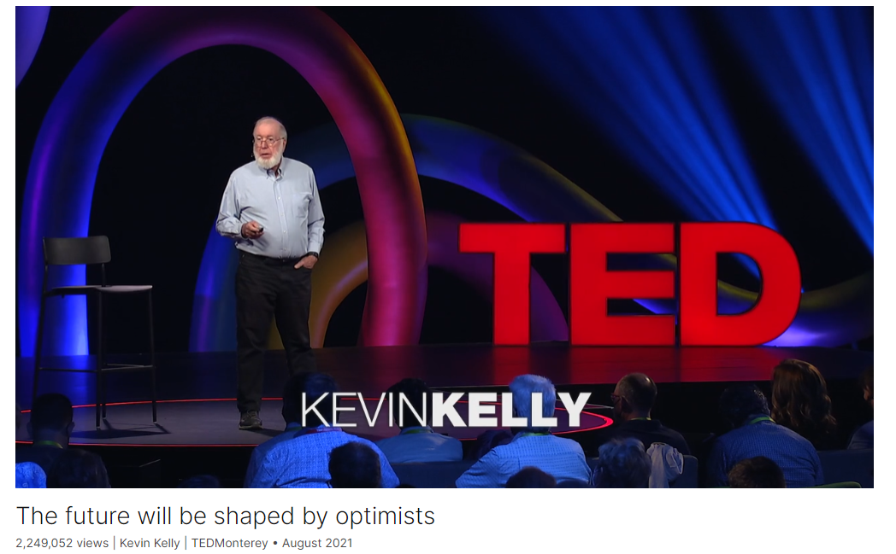

# The future will be shaped by optimists

Link: [https://www.ted.com/talks/kevin_kelly_the_future_will_be_shaped_by_optimists](https://www.ted.com/talks/kevin_kelly_the_future_will_be_shaped_by_optimists)

Speaker:  Kevin Kelly

Date: August 2021

@[toc]

## Introduction

"Every great and difficult thing has required a strong sense of optimism," says editor and author Kevin Kelly, who believes that we have a moral obligation to be optimistic. Tracing humanity's progress throughout history, he's observed that a positive outlook helps us solve problems and empowers us to forge a path forward. In this illuminating talk, he shares three reasons for optimism during challenging times, explaining how it can help us become better ancestors and create the world we want to see for ourselves and future generations.

## Vocabulary

temperament: 美 [ˈtemprəmənt]  性情，性格，气质

optimism definitely is not just a sunny temperament, a kind of a blindness to the realities of the world's problems or some kind of Pollyanna self-delusion. 乐观绝对不仅仅是一种阳光的气质，一种对世界问题现实的视而不见或某种盲目乐观的自欺欺人。

Pollyanna self-delusion

>“Pollyanna自欺欺人”指的是一种过度乐观的态度，即使面对挑战或负面情况也能保持乐观，甚至忽视或淡化现实中的问题或困难。这个术语“Pollyanna”源自埃莉诺·H·波特(Eleanor H. Porter)的小说《波莉安娜》中的主人公，她以其无与伦比的乐观态度而闻名。而“自欺欺人”则指的是欺骗自己，相信不真实的事情或忽视令人不快的真相。因此，“Pollyanna自欺欺人”意味着某人过分乐观，甚至忽视现实或沉迷于美好的想法，以至于不顾现实。

smallpox: 天花

surplus：剩余，过剩，盈余

raider：美 [ˈreɪdər]  抢劫者，袭击者

It’s about the family farmers whose year of surplus food was not stolen by raiders.：这是关于那些家庭农场主，他们那一年的剩余粮食没有被掠夺者偷走。

shun:美 [ʃʌn]  回避，避开，避免

optimists don’t shun problems. 乐观主义者不会回避问题。

impede：美 [ɪmˈpiːd]  阻碍，妨碍

conduit：美 [ˈkɑnˌd(j)uət]  水管，管道

But problems don’t impede progress. Problems are the conduit of progress. No problems, no progress. 但是问题不会阻碍进步。问题是进步的管道。没有问题，就没有进步。

## Summary

Kevin Kelly's speech revolves around the theme of optimism in the face of daunting global challenges. He acknowledges the existence of significant problems such as climate change and social inequality but argues that the scale of these challenges is precisely why optimism is warranted. Kelly asserts that historical progress and breakthroughs have always been fueled by a strong sense of optimism that change is possible. He emphasizes the importance of envisioning a better world and believing in our capacity to make it a reality.

Kelly delves into the concept of "pro-topia," describing it as a world where incremental improvements lead to a slightly better existence. He clarifies that optimism is not merely a sunny disposition but rather a rational perspective based on historical progress. He addresses common reasons for pessimism, including the tendency to focus on negative events and the invisibility of incremental progress amid larger societal challenges. Kelly advocates for embracing problems as opportunities for progress, rejecting the notion of utopia in favor of continuous improvement.

In the final section of his speech, Kelly explores the role of trust and cooperation in driving progress. He emphasizes the importance of trusting future generations and being good ancestors by investing in long-term solutions. Kelly contends that problems are the catalysts for progress and that optimism enables us to shape the future positively. He concludes by asserting that optimism is a choice and a moral obligation, empowering us to create a better world through collaboration, innovation, and a belief in our collective ability to overcome challenges.

## Transcript

I want to try and persuade you

that there are reasons why
we should be optimistic in general.

And that’s a very difficult
thing to do today

because we are confronting
tremendous problems in this world.

Things like global climate change,

which seem almost impossible to solve,

or social inequality,

which seems endemic
and difficult to eliminate.

The scale of these problems though

is even more reason
why we should be optimistic.

Because what we know is that in the past,

every great and difficult thing
that has been accomplished,

every breakthrough,

has in fact required

a very strong sense of optimism

that it was possible.

Think of the first airplanes.

It’s hard enough

to create something good and great
deliberately and with intention.

And it’s no guarantee,

just because we believe something
will happen that it will happen,

but we do know that unless
we believe that something can happen,

it’s not going to happen
inadvertently by itself.

And so it becomes really important

that we imagine a world that we want,

that we imagine solutions we want

and believe that we can make them happen.

And that belief in making
something impossible happen

is what has shaped our future so far.

So our own history has been
basically shaped by optimists,

and if we want to shape the future,

we need to be optimistic.

That world that we’re shaping
is not a world that’s perfect.

It’s not perfection,

there’s no lack of problems,

there’s no absence of bad things.

It is totally not utopia.

It’s what I would call pro-topia:

a world in which things
are a little bit better.

And that sense of optimism
is a perspective

where we expect the world to yield
a little bit more good than bad,

to have a few more reasons
to hope than to fear.

And optimism definitely is not
just a sunny temperament,

a kind of a blindness to the realities
of the world's problems

or some kind of Pollyanna self-delusion.

Instead, optimism is based
on the fact of historical progress,

that if we transcend anecdote

and look at data
in a scientific, rational way,

that we can see that the evidence says

that on average,

on a global scale over time,

over the last 500 years,

there has been incremental
improvement over time.

If it’s real then why don’t
we see more of it?

Why are so many people pessimistic?

And I think there are three reasons why.

One is that most of what progress is about what does not happen.

It’s about all the things that could
have happened that didn’t happen today.

It’s about the two-year-old child
who did not die of smallpox.

It’s about the family farmers

whose year of surplus food
was not stolen by raiders.

They don't make the headlines.

And the second reason is that bad things
happen faster than good things.

Good things take time.

When we are compressing our news cycle
to the last five minutes

and the next five minutes,

all the things that have changed
in the last five minutes

are kind of bad stuff

because good stuff takes longer.

If we were to make newspapers and websites

to be updated every 100 years,

we’d have a very different
set of headlines.

The third reason is that because societies
that are capable of creating

just a few percent more good
than they destroy every year,

if you have a society that’s capable

of making just a few percent
more than it destroys,

then over time,

that few percent is compounded.

And that is what civilization is.

So that one percent,
few percent, is almost invisible

in the noise of the 49-percent crap
and destruction around it.

So we don’t see it

unless we turn around
and look back into the past.

So it’s possible that after
500 years of progress,

it could stop tomorrow.

But it’s unlikely

and very, very probable
that that long-term trend will continue,

at least for the rest of your lives.

So this optimism makes us realists

in aligning ourselves
with this long history

of historical progress.

And that’s the first reason
we should be optimistic.

And the second reason
is that civilization is a mechanism

to make these improvements

that relies on the fact
that we’re optimistically trusting others.

We have total strangers
that we can collaborate,

and that collaboration allows us
to make things beyond ourselves

that are bigger than just what we can do.

That requires trust,

and trust is a type of optimism.

But in addition to kind of cooperating

with the eight billion total strangers
on this planet accomplishing great things,

we can also trust future generations.

The billions of people
yet unborn into the future.

Right now, today, we are benefiting
from the work of previous generations

who undergone to create infrastructure --

roads canals, skyscrapers,
telephone networks --

that we are now enjoying.

In fact, we may be enjoying more benefits
than they have back in the past

when they began.

So they have been acting
as good ancestors for us,

and sometimes even sacrificing

what could have been immediate
yields and benefits

and postponing them until
future generations.

We also want to be good ancestors,

and being good ancestors trying to move
benefits to the future generations

is an act of optimism.

One, because we believe
that there will be future generations,

and two, because we are willing
to sacrifice immediate gains

in order to postpone --

have more gains into the future --

that investment.

Being a good ancestor enables us
to actually accomplish things

not just beyond what we can do
individually in the present,

but what we can do over time.

So when we trust the future,

one of the things
that we are understanding

is that future generations
not only have better living standards

because of progress,

but they also have more
capability to solve problems

because there’s more knowledge

and because they have better tools.

And so we can trust that.

We can trust the fact that in the future,

future generations will be able
to solve problems

that we cannot solve ourselves.

So that means that we
should be optimistic

not because we believe that our problems
are smaller than we thought.

We should be optimistic because we believe

that our capacity to solve problems
is greater than we thought.

So that’s a second reason
to be optimistic.

The third one has to do with problems

which are really disguised
as opportunities.

OK, so optimists don’t shun problems.

Optimism is about embracing problems,

because it’s problems that make solutions

and solutions that make problems.

So I believe that most
of the problems we have today

are generated by
the solutions of the past.

And the great one is this climate change.

The solution in the past
was artificial power --

“Where do we get it?”

“OK, here it is.”

But now it makes the problem now.

That means that today,

most of the solutions that we have

will be generating
the problems of the future.

And there will be more problems

because new solutions
create many more problems.

In the same way, when science
answers a question,

that answer will generate
two or three new questions --

things that we didn’t even know
we didn’t know.

And so, in a peculiar way,

science is expanding our ignorance
faster than our knowledge.

So we have an unlimited pool
of questions and problems.

But problems don’t impede progress.

Problems are the conduit of progress.

No problems, no progress.

That is why I reject utopia,

because there are no problems there.

So even bad things that happen
are basically possibilities

that yield new solutions
and better opportunities.

So in that way, problems are unlimited.

There is no limit for improvement.

So we can improve ourselves
in all directions.

So we have a choice about optimism.

It’s not a temperament.

No matter what your temperament is
you can still choose to be optimistic.

And gigantic problems
require gigantic optimism.

We have a moral obligation
to be optimistic,

because when we’re optimistic,

we can shape the future,

we can become better ancestors,

we can expand our reach --

create things bigger than ourselves.

And we can be a realist in aligning
ourselves with this long arc of history

and embracing problems as opportunities.

With optimism,

we can use it as a power
to kind of create the future that we want.

This is the way.

Thank you.

(Applause)

## Afterword

2024年4月30日16点24分完成这篇演讲的学习。

