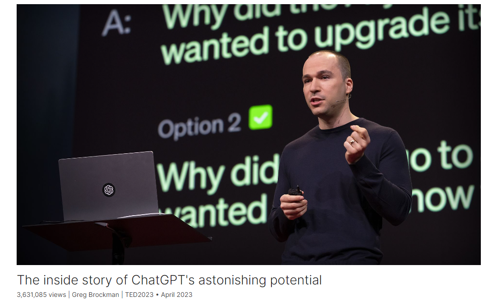
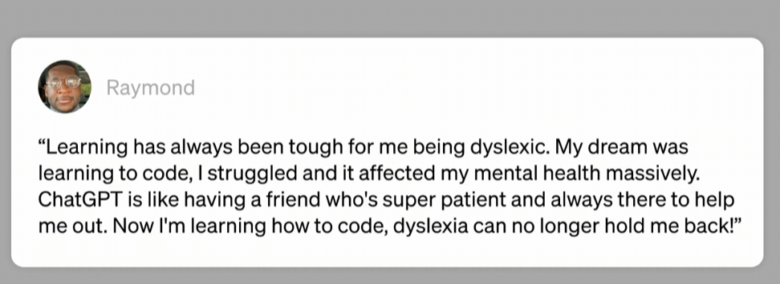
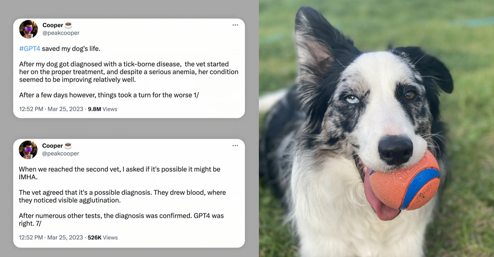

# The inside story of ChatGPT's astonishing potential

Link: [https://www.ted.com/talks/greg_brockman_the_inside_story_of_chatgpt_s_astonishing_potential](https://www.ted.com/talks/greg_brockman_the_inside_story_of_chatgpt_s_astonishing_potential)

Speaker: Greg Brockman

Date:April 2023

@[toc]

## Introduction

In a talk from the cutting edge of technology, OpenAI cofounder Greg Brockman explores the underlying design principles of ChatGPT and demos some mind-blowing, unreleased plug-ins for the chatbot that sent shockwaves across the world. After the talk, head of TED Chris Anderson joins Brockman to dig into the timeline of ChatGPT's development and get Brockman's take on the risks, raised by many in the tech industry and beyond, of releasing such a powerful tool into the world.

OpenAI联合创始人格雷格·布罗克曼在一次关于技术前沿的演讲中探索了ChatGPT的基本设计原则，并演示了一些令人兴奋的、尚未发布的chatbot插件，这些插件在全球范围内引发了冲击波。演讲结束后，TED的负责人克里斯·安德森加入了布罗克曼的行列，深入了解ChatGPT的发展时间表，并了解布罗克曼对向世界发布这样一个强大工具的风险的看法。科技行业内外的许多人都提出了这一问题。

## Vocabulary

steer：美 [stɪr]   驾驶 steer it in a positive direction.

We started OpenAI seven years ago because we felt like something really interesting was happening in AI and we wanted to help steer it in a positive direction. 我们在七年前创立了OpenAI，因为我们觉得人工智能领域正在发生一些真正有趣的事情，我们希望帮助它朝着积极的方向发展。

whole field：整个领域

It's honestly just really amazing to see how far this whole field has come since then.

 it feels like we're entering an historic period 进入一个历史性的时期

hold dear：珍视，高度重视

So today, I want to show you the current state of that technology and some of the **underlying design principles that we hold dear**. 所以今天，我想向大家展示这项技术的现状以及我们珍视的一些基本设计原则。

ideation :美 [ˌaɪdiˈeɪʃən]  思维能力，观念形成

>The creative *ideation* training should be emphasized in pupils'studies. 
>
>要求学生的学习转向创造性的思维训练； 

imbue：美 [ɪmˈbjuː] 浸透，充满

And this process imbues it with all sorts of wonderful skills. 这个过程赋予了它各种奇妙的技能。

riddle：美 [ˈrɪdl]  谜语

baffle：美 [ˈbæfl] 使困惑

So I think this helps explain the riddle that baffles everyone looking at this, because these things are described as prediction machines. 所以我认为这有助于解释让所有人困惑的谜团，因为这些东西被描述为预测机器。

sent shockwaves 引发冲击波

scramble：美 [ˈskræmbl]  攀登，争取

Your release of GPT, especially ChatGPT, sent such shockwaves through the tech world that now Google, Meta, and others **are all scrambling to catch up**.你发布的GPT，尤其是ChatGPT，在科技界引发了巨大的冲击波，现在谷歌、Meta和其他公司都在争相追赶。

thought experiment:思想实验 Here's a thought experiment for you.

literate：掌握某种知识的

And if there's one thing to take away from this talk, it's that this technology just looks different. Just different from anything people had anticipated. And so we all have to become literate. 如果从这次演讲中有什么收获的话，那就是这项技术看起来与众不同。与人们预期的完全不同。所以我们都必须知晓。

## Transcript

### Talk

We started OpenAI seven years ago

because we felt like something
really interesting was happening in AI

and we wanted to help steer it
in a positive direction.

It's honestly just really amazing to see

how far this whole field
has come since then.

And it's really gratifying to hear
from people like Raymond

who are using the technology
we are building, and others,

for so many wonderful things.

We hear from people who are excited,

we hear from people who are concerned,

we hear from people who feel
both those emotions at once.

And honestly, that's how we feel.

Above all, it feels like we're entering
an historic period right now

where we as a world
are going to define a technology

that will be so important
for our society going forward.

And I believe that we can
manage this for good.

So today, I want to show you
the current state of that technology

and some of the underlying
design principles that we hold dear.

So the first thing I'm going to show you

is what it's like to build
a tool for an AI

rather than building it for a human.

So we have a new DALL-E model,
which generates images,

and we are exposing it as an app
for ChatGPT to use on your behalf.

And you can do things like ask, you know,

suggest a nice post-TED meal
and draw a picture of it.

(Laughter)

Now you get all of the, sort of,
ideation and creative back-and-forth

and taking care of the details for you
that you get out of ChatGPT.

And here we go, it's not just
the idea for the meal,

but a very, very detailed spread.

So let's see what we're going to get.

But ChatGPT doesn't just generate
images in this case --

sorry, it doesn't generate text,
it also generates an image.

And that is something
that really expands the power

of what it can do on your behalf
in terms of carrying out your intent.

And I'll point out,
this is all a live demo.

This is all generated
by the AI as we speak.

So I actually don't even know
what we're going to see.

This looks wonderful.

(Applause)

I'm getting hungry just looking at it.

Now we've extended ChatGPT
with other tools too,

for example, memory.

You can say "save this for later."

And the interesting thing
about these tools

is they're very inspectable.

So you get this little pop up here
that says "use the DALL-E app."

And by the way, this is coming to you, all
ChatGPT users, over upcoming months.

And you can look under the hood
and see that what it actually did

was write a prompt
just like a human could.

And so you sort of have
this ability to inspect

how the machine is using these tools,

which allows us to provide
feedback to them.

Now it's saved for later,

and let me show you
what it's like to use that information

and to integrate
with other applications too.

You can say,

“Now make a shopping list
for the tasty thing

I was suggesting earlier.”

And make it a little tricky for the AI.

"And tweet it out for all
the TED viewers out there."

(Laughter)

So if you do make this wonderful,
wonderful meal,

I definitely want to know how it tastes.

But you can see that ChatGPT
is selecting all these different tools

without me having to tell it explicitly
which ones to use in any situation.

And this, I think, shows a new way
of thinking about the user interface.

Like, we are so used to thinking of,
well, we have these apps,

we click between them,
we copy/paste between them,

and usually it's a great
experience within an app

as long as you kind of know
the menus and know all the options.

Yes, I would like you to.

Yes, please.

Always good to be polite.

(Laughter)

And by having this unified
language interface on top of tools,

the AI is able to sort of take away
all those details from you.

So you don't have to be the one

who spells out every single
sort of little piece

of what's supposed to happen.

And as I said, this is a live demo,

so sometimes the unexpected
will happen to us.

But let's take a look at the Instacart
shopping list while we're at it.

And you can see we sent a list
of ingredients to Instacart.

Here's everything you need.

And the thing that's really interesting

is that the traditional UI
is still very valuable, right?

If you look at this,

you still can click through it
and sort of modify the actual quantities.

And that's something that I think shows

that they're not going away,
traditional UIs.

It's just we have a new,
augmented way to build them.

And now we have a tweet
that's been drafted for our review,

which is also a very important thing.

We can click “run,” and there we are,
we’re the manager, we’re able to inspect,

we're able to change the work
of the AI if we want to.

And so after this talk,
you will be able to access this yourself.

And there we go.

Cool.

Thank you, everyone.

(Applause)

So we’ll cut back to the slides.

Now, the important thing
about how we build this,

it's not just about building these tools.

It's about teaching
the AI how to use them.

Like, what do we even want it to do

when we ask these very
high-level questions?

And to do this, we use an old idea.

If you go back to Alan Turing's 1950 paper
on the Turing test, he says,

you'll never program an answer to this.

Instead, you can learn it.

You could build a machine,
like a human child,

and then teach it through feedback.

Have a human teacher who provides
rewards and punishments

as it tries things out and does things
that are either good or bad.

And this is exactly how we train ChatGPT.

It's a two-step process.

First, we produce what Turing
would have called a child machine

through an unsupervised learning process.

We just show it the whole world,
the whole internet

and say, “Predict what comes next
in text you’ve never seen before.”

And this process imbues it
with all sorts of wonderful skills.

For example, if you're shown
a math problem,

the only way to actually
complete that math problem,

to say what comes next,

that green nine up there,

is to actually solve the math problem.

But we actually have to do
a second step, too,

which is to teach the AI
what to do with those skills.

And for this, we provide feedback.

We have the AI try out multiple things,
give us multiple suggestions,

and then a human rates them, says
“This one’s better than that one.”

And this reinforces not just the specific
thing that the AI said,

but very importantly, the whole process
that the AI used to produce that answer.

And this allows it to generalize.

It allows it to teach,
to sort of infer your intent

and apply it in scenarios
that it hasn't seen before,

that it hasn't received feedback.

Now, sometimes the things
we have to teach the AI

are not what you'd expect.

For example, when we first showed
GPT-4 to Khan Academy,

they said, "Wow, this is so great,

We're going to be able to teach
students wonderful things.

Only one problem, it doesn't
double-check students' math.

If there's some bad math in there,

it will happily pretend that one plus one
equals three and run with it."

So we had to collect some feedback data.

Sal Khan himself was very kind

and offered 20 hours of his own time
to provide feedback to the machine

alongside our team.

And over the course of a couple of months
we were able to teach the AI that,

"Hey, you really should
push back on humans

in this specific kind of scenario."

And we've actually made lots and lots
of improvements to the models this way.

And when you push
that thumbs down in ChatGPT,

that actually is kind of like sending up
a bat signal to our team to say,

“Here’s an area of weakness
where you should gather feedback.”

And so when you do that,

that's one way that we really
listen to our users

and make sure we're building something
that's more useful for everyone.

Now, providing high-quality
feedback is a hard thing.

If you think about asking a kid
to clean their room,

if all you're doing
is inspecting the floor,

you don't know if you're just teaching
them to stuff all the toys in the closet.

This is a nice DALL-E-generated
image, by the way.

And the same sort
of reasoning applies to AI.

As we move to harder tasks,

we will have to scale our ability
to provide high-quality feedback.

But for this, the AI itself
is happy to help.

It's happy to help us provide
even better feedback

and to scale our ability to supervise
the machine as time goes on.

And let me show you what I mean.

For example, you can ask GPT-4
a question like this,

of how much time passed
between these two foundational blogs

on unsupervised learning

and learning from human feedback.

And the model says two months passed.

But is it true?

Like, these models
are not 100-percent reliable,

although they’re getting better
every time we provide some feedback.

But we can actually use
the AI to fact-check.

And it can actually check its own work.

You can say, fact-check this for me.

Now, in this case, I've actually
given the AI a new tool.

This one is a browsing tool

where the model can issue search queries
and click into web pages.

And it actually writes out
its whole chain of thought as it does it.

It says, I’m just going to search for this
and it actually does the search.

It then it finds the publication date
and the search results.

It then is issuing another search query.

It's going to click into the blog post.

And all of this you could do,
but it’s a very tedious task.

It's not a thing
that humans really want to do.

It's much more fun
to be in the driver's seat,

to be in this manager's position
where you can, if you want,

triple-check the work.

And out come citations

so you can actually go

and very easily verify any piece
of this whole chain of reasoning.

And it actually turns out
two months was wrong.

Two months and one week,

that was correct.

(Applause)

And we'll cut back to the side.

And so thing that's so interesting to me
about this whole process

is that it’s this many-step collaboration
between a human and an AI.

Because a human, using
this fact-checking tool

is doing it in order to produce data

for another AI to become
more useful to a human.

And I think this really shows
the shape of something

that we should expect to be
much more common in the future,

where we have humans
and machines kind of very carefully

and delicately designed
in how they fit into a problem

and how we want
to solve that problem.

We make sure that the humans are providing
the management, the oversight,

the feedback,

and the machines are operating
in a way that's inspectable

and trustworthy.

And together we're able to actually create
even more trustworthy machines.

And I think that over time,
if we get this process right,

we will be able to solve
impossible problems.

And to give you a sense
of just how impossible I'm talking,

I think we're going to be able
to rethink almost every aspect

of how we interact with computers.

For example, think about spreadsheets.

They've been around in some form since,
we'll say, 40 years ago with VisiCalc.

I don't think they've really
changed that much in that time.

And here is a specific spreadsheet
of all the AI papers on the arXiv

for the past 30 years.

There's about 167,000 of them.

And you can see there the data right here.

But let me show you the ChatGPT take
on how to analyze a data set like this.

So we can give ChatGPT
access to yet another tool,

this one a Python interpreter,

so it’s able to run code,
just like a data scientist would.

And so you can just
literally upload a file

and ask questions about it.

And very helpfully, you know, it knows
the name of the file and it's like,

"Oh, this is CSV,"
comma-separated value file,

"I'll parse it for you."

The only information here
is the name of the file,

the column names like you saw
and then the actual data.

And from that it's able to infer
what these columns actually mean.

Like, that semantic information
wasn't in there.

It has to sort of, put together
its world knowledge of knowing that,

“Oh yeah, arXiv is a site
that people submit papers

and therefore that's what these things are
and that these are integer values

and so therefore it's a number
of authors in the paper,"

like all of that, that’s work
for a human to do,

and the AI is happy to help with it.

Now I don't even know what I want to ask.

So fortunately, you can ask the machine,

"Can you make some exploratory graphs?"

And once again, this is a super high-level
instruction with lots of intent behind it.

But I don't even know what I want.

And the AI kind of has to infer
what I might be interested in.

And so it comes up
with some good ideas, I think.

So a histogram of the number
of authors per paper,

time series of papers per year,
word cloud of the paper titles.

All of that, I think,
will be pretty interesting to see.

And the great thing is,
it can actually do it.

Here we go, a nice bell curve.

You see that three
is kind of the most common.

It's going to then make this nice plot
of the papers per year.

Something crazy
is happening in 2023, though.

Looks like we were on an exponential
and it dropped off the cliff.

What could be going on there?

By the way, all this
is Python code, you can inspect.

And then we'll see word cloud.

So you can see all these wonderful things
that appear in these titles.

But I'm pretty unhappy
about this 2023 thing.

It makes this year look really bad.

Of course, the problem is
that the year is not over.

So I'm going to push back on the machine.

[Waitttt that's not fair!!!

2023 isn't over.

What percentage of papers in 2022
were even posted by April 13?]

So April 13 was the cut-off
date I believe.

Can you use that to make
a fair projection?

So we'll see, this is
the kind of ambitious one.

(Laughter)

So you know,

again, I feel like there was more I wanted
out of the machine here.

I really wanted it to notice this thing,

maybe it's a little bit
of an overreach for it

to have sort of, inferred magically
that this is what I wanted.

But I inject my intent,

I provide this additional piece
of, you know, guidance.

And under the hood,

the AI is just writing code again,
so if you want to inspect what it's doing,

it's very possible.

And now, it does the correct projection.

(Applause)

If you noticed, it even updates the title.

I didn't ask for that,
but it know what I want.

Now we'll cut back to the slide again.

This slide shows a parable
of how I think we ...

A vision of how we may end up
using this technology in the future.

A person brought
his very sick dog to the vet,

and the veterinarian made a bad call
to say, “Let’s just wait and see.”

And the dog would not
be here today had he listened.

In the meanwhile,
he provided the blood test,

like, the full medical records, to GPT-4,

which said, "I am not a vet,
you need to talk to a professional,

here are some hypotheses."

He brought that information
to a second vet

who used it to save the dog's life.

Now, these systems, they're not perfect.

You cannot overly rely on them.

But this story, I think, shows

that a human with a medical professional

and with ChatGPT
as a brainstorming partner

was able to achieve an outcome
that would not have happened otherwise.

I think this is something
we should all reflect on,

think about as we consider
how to integrate these systems

into our world.

And one thing I believe really deeply,

is that getting AI right is going
to require participation from everyone.

And that's for deciding
how we want it to slot in,

that's for setting the rules of the road,

for what an AI will and won't do.

And if there's one thing
to take away from this talk,

it's that this technology
just looks different.

Just different from anything
people had anticipated.

And so we all have to become literate.

And that's, honestly, one
of the reasons we released ChatGPT.

Together, I believe that we can
achieve the OpenAI mission

of ensuring that artificial
general intelligence

benefits all of humanity.

Thank you.

(Applause)

(Applause ends)

###  Conversation

Chris Anderson: Greg.

Wow.

I mean ...

I suspect that within every mind out here

there's a feeling of reeling.

Like, I suspect that a very large
number of people viewing this,

you look at that and you think,
“Oh my goodness,

pretty much every single thing
about the way I work, I need to rethink."

Like, there's just
new possibilities there.

Am I right?

Who thinks that they're having to rethink
the way that we do things?

Yeah, I mean, it's amazing,

but it's also really scary.

So let's talk, Greg, let's talk.

I mean, I guess
my first question actually is just

how the hell have you done this?

(Laughter)

OpenAI has a few hundred employees.

Google has thousands of employees
working on artificial intelligence.

Why is it you who's come up
with this technology

that shocked the world?

Greg Brockman: I mean, the truth is,

we're all building on shoulders
of giants, right, there's no question.

If you look at the compute progress,

the algorithmic progress,
the data progress,

all of those are really industry-wide.

But I think within OpenAI,

we made a lot of very deliberate
choices from the early days.

And the first one was just
to confront reality as it lays.

And that we just thought
really hard about like:

What is it going to take
to make progress here?

We tried a lot of things that didn't work,
so you only see the things that did.

And I think that the most important thing
has been to get teams of people

who are very different from each other
to work together harmoniously.

CA: Can we have the water,
by the way, just brought here?

I think we're going to need it,
it's a dry-mouth topic.

But isn't there something also
just about the fact

that you saw something
in these language models

that meant that if you continue
to invest in them and grow them,

that something
at some point might emerge?

GB: Yes.

And I think that, I mean, honestly,

I think the story there
is pretty illustrative, right?

I think that high level, deep learning,

like we always knew that was
what we wanted to be,

was a deep learning lab,
and exactly how to do it?

I think that in the early days,
we didn't know.

We tried a lot of things,

and one person was working
on training a model

to predict the next character
in Amazon reviews,

and he got a result where --
this is a syntactic process,

you expect, you know, the model
will predict where the commas go,

where the nouns and verbs are.

But he actually got a state-of-the-art
sentiment analysis classifier out of it.

This model could tell you
if a review was positive or negative.

I mean, today we are just like,
come on, anyone can do that.

But this was the first time
that you saw this emergence,

this sort of semantics that emerged
from this underlying syntactic process.

And there we knew,
you've got to scale this thing,

you've got to see where it goes.

CA: So I think this helps explain

the riddle that baffles
everyone looking at this,

because these things are described
as prediction machines.

And yet, what we're seeing
out of them feels ...

it just feels impossible that that
could come from a prediction machine.

Just the stuff you showed us just now.

And the key idea of emergence
is that when you get more of a thing,

suddenly different things emerge.

It happens all the time, ant colonies,
single ants run around,

when you bring enough of them together,

you get these ant colonies that show
completely emergent, different behavior.

Or a city where a few houses together,
it's just houses together.

But as you grow the number of houses,

things emerge, like suburbs
and cultural centers and traffic jams.

Give me one moment for you
when you saw just something pop

that just blew your mind

that you just did not see coming.

GB: Yeah, well,

so you can try this in ChatGPT,
if you add 40-digit numbers --

CA: 40-digit?

GB: 40-digit numbers,
the model will do it,

which means it's really learned
an internal circuit for how to do it.

And the really interesting
thing is actually,

if you have it add like a 40-digit number
plus a 35-digit number,

it'll often get it wrong.

And so you can see that it's really
learning the process,

but it hasn't fully generalized, right?

It's like you can't memorize
the 40-digit addition table,

that's more atoms
than there are in the universe.

So it had to have learned
something general,

but that it hasn't really
fully yet learned that,

Oh, I can sort of generalize this
to adding arbitrary numbers

of arbitrary lengths.

CA: So what's happened here

is that you've allowed it to scale up

and look at an incredible
number of pieces of text.

And it is learning things

that you didn't know that it was
going to be capable of learning.

GB Well, yeah, and it’s more nuanced, too.

So one science that we’re starting
to really get good at

is predicting some of these
emergent capabilities.

And to do that actually,

one of the things I think
is very undersung in this field

is sort of engineering quality.

Like, we had to rebuild our entire stack.

When you think about building a rocket,

every tolerance has to be incredibly tiny.

Same is true in machine learning.

You have to get every single piece
of the stack engineered properly,

and then you can start
doing these predictions.

There are all these incredibly
smooth scaling curves.

They tell you something deeply
fundamental about intelligence.

If you look at our GPT-4 blog post,

you can see all of these curves in there.

And now we're starting
to be able to predict.

So we were able to predict, for example,
the performance on coding problems.

We basically look at some models

that are 10,000 times
or 1,000 times smaller.

And so there's something about this
that is actually smooth scaling,

even though it's still early days.

CA: So here is, one of the big fears then,

that arises from this.

If it’s fundamental
to what’s happening here,

that as you scale up,

things emerge that

you can maybe predict
in some level of confidence,

but it's capable of surprising you.

Why isn't there just a huge risk
of something truly terrible emerging?

GB: Well, I think all of these
are questions of degree

and scale and timing.

And I think one thing people miss, too,

is sort of the integration with the world
is also this incredibly emergent,

sort of, very powerful thing too.

And so that's one of the reasons
that we think it's so important

to deploy incrementally.

And so I think that what we kind of see
right now, if you look at this talk,

a lot of what I focus on is providing
really high-quality feedback.

Today, the tasks that we do,
you can inspect them, right?

It's very easy to look at that math
problem and be like, no, no, no,

machine, seven was the correct answer.

But even summarizing a book,
like, that's a hard thing to supervise.

Like, how do you know
if this book summary is any good?

You have to read the whole book.

No one wants to do that.

(Laughter)

And so I think that the important thing
will be that we take this step by step.

And that we say, OK,
as we move on to book summaries,

we have to supervise this task properly.

We have to build up
a track record with these machines

that they're able to actually
carry out our intent.

And I think we're going to have to produce
even better, more efficient,

more reliable ways of scaling this,

sort of like making the machine
be aligned with you.

CA: So we're going to hear
later in this session,

there are critics who say that,

you know, there's no real
understanding inside,

the system is going to always --

we're never going to know
that it's not generating errors,

that it doesn't have
common sense and so forth.

Is it your belief, Greg,
that it is true at any one moment,

but that the expansion of the scale
and the human feedback

that you talked about is basically
going to take it on that journey

of actually getting to things
like truth and wisdom and so forth,

with a high degree of confidence.

Can you be sure of that?

GB: Yeah, well, I think that the OpenAI,
I mean, the short answer is yes,

I believe that is where we're headed.

And I think that the OpenAI approach
here has always been just like,

let reality hit you in the face, right?

It's like this field is the field
of broken promises,

of all these experts saying
X is going to happen, Y is how it works.

People have been saying neural nets
aren't going to work for 70 years.

They haven't been right yet.

They might be right
maybe 70 years plus one

or something like that is what you need.

But I think that our approach
has always been,

you've got to push to the limits
of this technology

to really see it in action,

because that tells you then, oh, here's
how we can move on to a new paradigm.

And we just haven't exhausted
the fruit here.

CA: I mean, it's quite
a controversial stance you've taken,

that the right way to do this
is to put it out there in public

and then harness all this, you know,

instead of just your team giving feedback,

the world is now giving feedback.

But ...

If, you know, bad things
are going to emerge,

it is out there.

So, you know, the original story
that I heard on OpenAI

when you were founded as a nonprofit,

well you were there as the great
sort of check on the big companies

doing their unknown,
possibly evil thing with AI.

And you were going to build models
that sort of, you know,

somehow held them accountable

and was capable of slowing
the field down, if need be.

Or at least that's kind of what I heard.

And yet, what's happened,
arguably, is the opposite.

That your release of GPT,
especially ChatGPT,

sent such shockwaves
through the tech world

that now Google and Meta and so forth
are all scrambling to catch up.

And some of their criticisms have been,

you are forcing us to put this out here
without proper guardrails or we die.

You know, how do you, like,

make the case that what you have done
is responsible here and not reckless.

GB: Yeah, we think about these
questions all the time.

Like, seriously all the time.

And I don't think we're always
going to get it right.

But one thing I think
has been incredibly important,

from the very beginning,
when we were thinking

about how to build
artificial general intelligence,

actually have it benefit all of humanity,

like, how are you
supposed to do that, right?

And that default plan of being,
well, you build in secret,

you get this super powerful thing,

and then you figure out the safety of it
and then you push “go,”

and you hope you got it right.

I don't know how to execute that plan.

Maybe someone else does.

But for me, that was always terrifying,
it didn't feel right.

And so I think that this
alternative approach

is the only other path that I see,

which is that you do let
reality hit you in the face.

And I think you do give people
time to give input.

You do have, before these
machines are perfect,

before they are super powerful,
that you actually have the ability

to see them in action.

And we've seen it from GPT-3, right?

GPT-3, we really were afraid

that the number one thing
people were going to do with it

was generate misinformation,
try to tip elections.

Instead, the number one thing
was generating Viagra spam.

(Laughter)

CA: So Viagra spam is bad,
but there are things that are much worse.

Here's a thought experiment for you.

Suppose you're sitting in a room,

there's a box on the table.

You believe that in that box
is something that,

there's a very strong chance
it's something absolutely glorious

that's going to give beautiful gifts
to your family and to everyone.

But there's actually also a one percent
thing in the small print there

that says: “Pandora.”

And there's a chance

that this actually could unleash
unimaginable evils on the world.

Do you open that box?

GB: Well, so, absolutely not.

I think you don't do it that way.

And honestly, like, I'll tell you a story
that I haven't actually told before,

which is that shortly
after we started OpenAI,

I remember I was in Puerto Rico
for an AI conference.

I'm sitting in the hotel room just
looking out over this wonderful water,

all these people having a good time.

And you think about it for a moment,

if you could choose for basically
that Pandora’s box

to be five years away

or 500 years away,

which would you pick, right?

On the one hand you're like,
well, maybe for you personally,

it's better to have it be five years away.

But if it gets to be 500 years away
and people get more time to get it right,

which do you pick?

And you know, I just
really felt it in the moment.

I was like, of course
you do the 500 years.

My brother was in the military at the time

and like, he puts his life on the line
in a much more real way

than any of us typing things in computers

and developing this
technology at the time.

And so, yeah, I'm really sold
on the you've got to approach this right.

But I don't think that's quite
playing the field as it truly lies.

Like, if you look at the whole
history of computing,

I really mean it when I say
that this is an industry-wide

or even just almost like

a human-development-
of-technology-wide shift.

And the more that you sort of,
don't put together the pieces

that are there, right,

we're still making faster computers,

we're still improving the algorithms,
all of these things, they are happening.

And if you don't put them together,
you get an overhang,

which means that if someone does,

or the moment that someone does manage
to connect to the circuit,

then you suddenly have
this very powerful thing,

no one's had any time to adjust,

who knows what kind
of safety precautions you get.

And so I think
that one thing I take away

is like, even you think about development
of other sort of technologies,

think about nuclear weapons,

people talk about being
like a zero to one,

sort of, change in what humans could do.

But I actually think
that if you look at capability,

it's been quite smooth over time.

And so the history, I think,
of every technology we've developed

has been, you've got
to do it incrementally

and you've got to figure out
how to manage it

for each moment that you're increasing it.

CA: So what I'm hearing is that you ...

the model you want us to have

is that we have birthed
this extraordinary child

that may have superpowers

that take humanity to a whole new place.

It is our collective responsibility
to provide the guardrails

for this child

to collectively teach it to be wise
and not to tear us all down.

Is that basically the model?

GB: I think it's true.

And I think it's also important
to say this may shift, right?

We've got to take each step
as we encounter it.

And I think it's incredibly
important today

that we all do get literate
in this technology,

figure out how to provide the feedback,

decide what we want from it.

And my hope is that that will
continue to be the best path,

but it's so good we're honestly
having this debate

because we wouldn't otherwise
if it weren't out there.

CA: Greg Brockman, thank you so much
for coming to TED and blowing our minds.

(Applause)

## Summary

关于演讲：

The speaker began by reflecting on OpenAI's founding seven years ago, driven by a desire to positively influence the rapidly evolving field of AI. They expressed amazement at the progress made since then and highlighted the diverse reactions from users, ranging from excitement to concern. Despite these varied responses, the speaker expressed confidence in humanity's ability to responsibly manage AI's impact. They showcased the new DALL-E model and demonstrated how ChatGPT can use it to generate detailed images based on text prompts, illustrating the power of AI as a creative tool.

Next, the speaker delved into the underlying principles of how OpenAI trains its AI models, drawing parallels to Alan Turing's concept of teaching machines through feedback. They explained the two-step process: first, training the AI with unsupervised learning on vast amounts of data, and second, refining its responses through human feedback. This approach allows the AI to generalize and infer intent in novel scenarios. The speaker highlighted the importance of feedback in improving the AI's capabilities, citing examples such as teaching it to double-check math in educational settings.

The speaker then demonstrated how ChatGPT can be used for data analysis, showcasing its ability to interpret and visualize data from a CSV file. They emphasized the AI's role as a collaborative tool, able to generate insightful graphs and analyses based on high-level instructions. This highlighted a vision of AI as a partner in problem-solving, where humans provide guidance and oversight while the AI performs tasks that would be tedious or time-consuming for humans. Overall, the speaker emphasized the need for AI literacy and collaboration between humans and AI to ensure AI's benefits for humanity.

关于两个人对话：

Chris Anderson expresses awe and a sense of urgency, suggesting that many viewers are likely feeling the need to completely rethink their work methods after seeing the technology presented. He praises OpenAI's accomplishments but also voices a common concern: the technology is both amazing and frightening. He questions how OpenAI, with fewer resources than tech giants like Google, has achieved such groundbreaking technology.

Greg Brockman attributes OpenAI's success to building on existing advancements and making deliberate choices. He emphasizes the importance of teamwork and diversity in achieving their goals. He recounts a key moment when a model unexpectedly produced a sentiment analysis classifier, showcasing the technology's emergent capabilities. He also discusses the responsible approach of incrementally releasing the technology and actively seeking feedback.

Both speakers discuss the concept of emergence, where complex capabilities arise from simple rules or processes. They also address concerns about the risks associated with developing such powerful technology and stress the importance of responsible deployment and ongoing oversight. Overall, they advocate for a collaborative approach to AI development, with the goal of ensuring that AI benefits humanity.

克里斯·安德森表达了敬畏和紧迫感，他暗示许多观众在看到所展示的技术后可能感到有必要彻底重新思考他们的工作方法。他赞扬了OpenAI的成就，但也表达了一种普遍的担忧：这项技术既令人惊叹又令人恐惧。他提出疑问，OpenAI是如何在资源比谷歌等科技巨头少的情况下取得如此突破性的技术。

格雷格·布洛克曼将OpenAI的成功归因于在现有进展基础上的建设和做出的深思熟虑的选择。他强调团队合作和多样性在实现目标上的重要性。他回顾了一个关键时刻，当一个模型意外地生成了一个情感分析分类器，展示了技术的新兴能力。他还讨论了分阶段释放技术并积极寻求反馈的负责任方法。

两位演讲者都讨论了新兴性的概念，即复杂的能力是由简单的规则或过程产生的。他们还讨论了与开发如此强大技术相关的风险，并强调了负责任地部署和持续监督的重要性。总体而言，他们主张以合作的方式发展人工智能，目标是确保人工智能造福人类。

Comments and summary from glasp: [https://blog.glasp.co/the-inside-story-of-chatgpts-astonishing-potential-greg-brockman-ted/](https://blog.glasp.co/the-inside-story-of-chatgpts-astonishing-potential-greg-brockman-ted/)

## 后记

2024年4月11日15点35分于上海。

