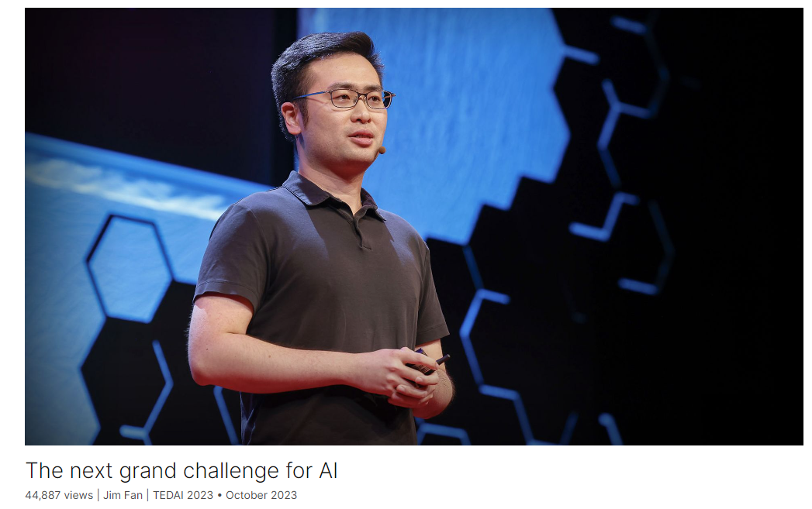
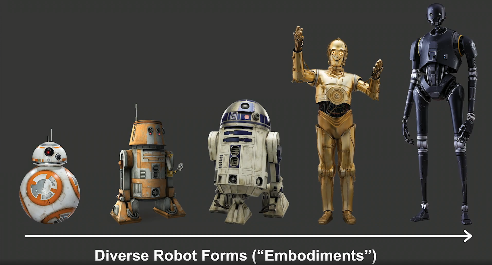
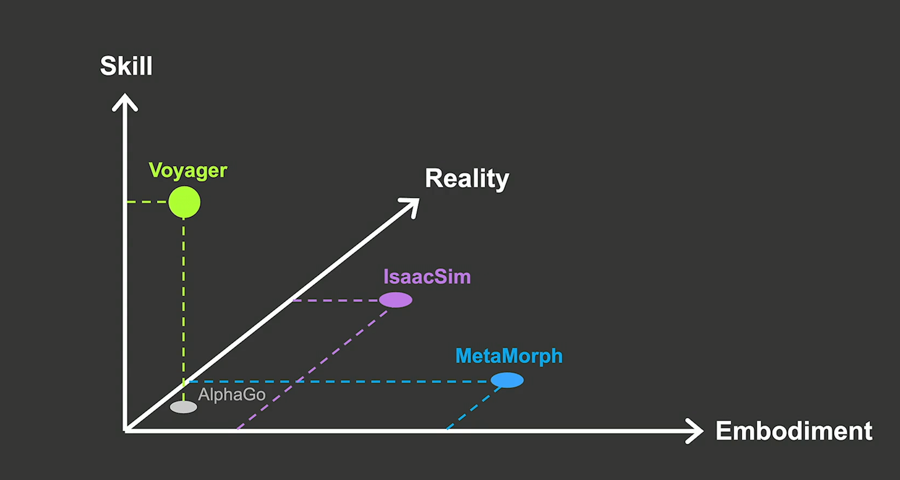
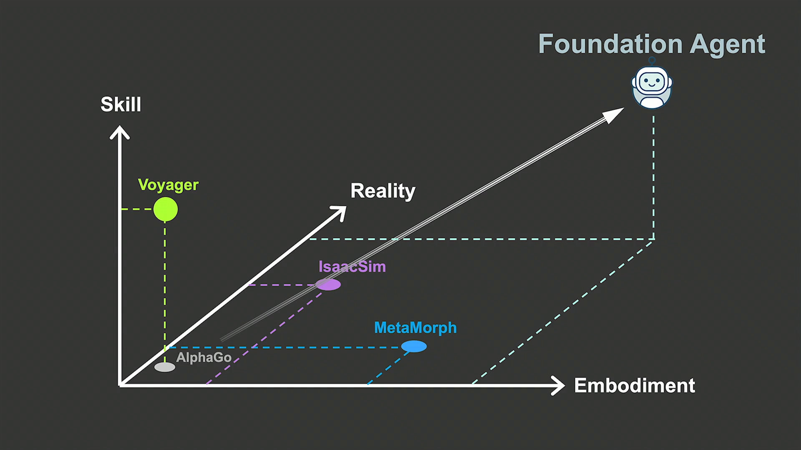

# The next grand challenge for AI

Link: [https://www.ted.com/talks/jim_fan_the_next_grand_challenge_for_ai?](https://www.ted.com/talks/jim_fan_the_next_grand_challenge_for_ai?)

Speaker: Jim Fan

Date: October 2023

@[toc]

## Introduction

Researcher Jim Fan presents the next grand challenge in the quest for AI: the "foundation agent," which would seamlessly operate across both the virtual and physical worlds. He explains how this technology could fundamentally change our lives — permeating everything from video games and metaverses to drones and humanoid robots — and explores how a single model could master skills across these different realities.

研究员Jim Fan介绍了人工智能探索中的下一个重大挑战:“基础agent”，它将在虚拟和现实世界中无缝运行。他解释了这项技术如何从根本上改变我们的生活——渗透到从视频游戏和元宇宙到无人机和人形机器人的所有东西——并探索了一个模型如何掌握这些不同现实的技能。

## Vocabulary

grand challenge：重大挑战

permeate:美 [ˈpɜːrmieɪt] 渗透，弥漫

in the quest for：在寻求

>It is still early days *in the quest for* global power of the Chinese carmaker. 
>
>中国汽车制造商对全球影响力的争夺目前仍处于初期阶段. 
>
>www.24en.com
>
>*In the quest for* self-expression, composers were imbued with a concern for detail. 
>
>为追求自我表现，本时期的作曲家极为注重细节。 
>
>www.tdict.com
>
>Perhaps his greatest joy is *in the* chance encounters during *the quest for* the perfect image. 
>
>也许，在现实中寻找令他耿耿于心的心像并终于与之邂逅的过程，才是他最大的喜悦。 
>
>dict.youdao.com
>
>She does gymnastic exercises four times a week *in the quest for* achieving the perfect figure. 
>
>为练成完美的体型,她每周做四次健身操. 
>
>wk.baidu.com

humanoid：英 [ˈhjuːmənɔɪd]  类人的，人形的

humanoid robot：人形机器人

metaverse：元宇宙

adrenaline：美 [əˈdrenəlɪn] 肾上腺素

I still remember the adrenaline of seeing history unfold that day. 我仍然记得那天看到历史展开时的肾上腺素。

embodiment：美 [ɪmˈbɑːdimənt] 具体形象；化身；具体表现；体现

>It was in Germany alone that his hope seemed capable of *embodiment*. 
>
>似乎只有在德国他的希望才能得到体现。 
>
>牛津词典
>
>Kofi is the *embodiment* of possibility. 
>
>Kofi身上体现了一种可能性。 
>
>www.kekenet.com
>
>But it is perfect *embodiment* of modern styles. 
>
>是现代时尚风格的完美体现。 
>
>bbs.chinadaily.com.cn
>
>A circle was the *embodiment* of his concept of life. 
>
>圈子是他生活理念的具体体现. 
>
>dict.engbus.cn

terrain:美 [təˈreɪn] 地形，地带

tree of skills: 技能树

It can explore the terrains, mine all kinds of materials, fight monsters, craft hundreds of recipes, and unlock an ever-expanding tree of skills. 它可以探索地形，开采各种材料，与怪物战斗，制作数百种食谱，并解锁不断扩展的技能树。

indefinitely: 美 [ɪnˈdefɪnətli]  无限期地

how does Voyager keep exploring indefinitely? 旅行者号是如何无限期地继续探索的？

kinematic：美 [ˌkɪnə'mætɪk] 运动学的；运动学上的

Metamorph is able to handle extremely varied kinematic characteristics from different robot bodies. Metamorph能够处理来自不同机器人主体的极其不同的运动学特征。

envision：美 [ɪnˈvɪʒn]  想象，设想

take a big stride：迈出一大步

The speaker envisions that MetaMorph 2.0 will be able to generalize to robot hands, humanoids, dogs, drones, and even beyond. Compared to Voyager, MetaMorph takes a big stride towards multi-body control. 演讲者设想MetaMorph 2.0将能够推广到机器人手，人形机器人，狗，无人机，甚至更远。与旅行者号相比，MetaMorph向多体控制迈出了一大步。

uncanny：奇怪的；神秘的；怪异的

And this car racing scene is where simulation has crossed the uncanny valley. 这个赛车场景是模拟穿越鬼谷的地方。

hardware accelerated ray tracing：硬件加速光线追踪

render extremely complex scenes: 渲染极其复杂的场景

photorealism: 美 [ˌfoʊdoʊˈri(ə)lɪzəm] 摄影写实主义；照相现实主义；超级现实主义

Thanks to hardware accelerated ray tracing, we're able to render extremely complex scenes with breathtaking levels of details. And this photorealism you see here will help us train computer vision models that will become the eyes of every AI agent. 由于硬件加速光线跟踪，我们能够以惊人的细节水平渲染极其复杂的场景。你在这里看到的照片真实感将帮助我们训练计算机视觉模型，这些模型将成为每个AI智能体的眼睛。

be it xxx, or xxx：无论xxx还是xxx

All language tasks can be expressed as text in and text out. Be it writing poetry, translating English to Spanish, or coding Python, it's all the same. 所有的语言任务都可以表示为文本输入和文本输出。无论是写诗、将英语翻译成西班牙语，还是编写Python代码，都是一样的。

## Transcript

In spring of 2016,

I was sitting in a classroom
at Columbia University

but wasn't paying attention
to the lecture.

Instead, I was watching a board game
tournament on my laptop.

And it wasn't just any tournament,
but a very, very special one.

The match was between AlphaGo
and Lee Sedol.

The AI had just won three
out of five games

and became the first ever to beat
a human champion at a game of Go.

I still remember the adrenaline
of seeing history unfold that day.

The [glorious] moment when AI agents
finally entered the mainstream.

But when the excitement fades,

I realized that as mighty as AlphaGo was,

it could only do one thing
and one thing alone.

It isn't able to play any other games,
like Super Mario or Minecraft,

and it certainly cannot do dirty laundry

or cook a nice dinner for you tonight.

But what we truly want
are AI agents as versatile as Wall-E,

as diverse as all the robot body forms

or embodiments in Star Wars

and works across infinite realities,

virtual or physical,
as in Ready Player One.

So how can we achieve
these science fictions

in possibly the near future?

This is a practitioner's guide
towards generally capable AI agents.

Most of the ongoing research efforts
can be laid out nicely across three axes:

the number of skills an agent can do;

the body forms or embodiments
it can control;

and the realities it can master.

AlphaGo is somewhere here,

but the upper right corner
is where we need to go.

So let's take it one axis at a time.

Earlier this year,
I led the Voyager project,

which is an agent that scales up massively
on a number of skills.

And there's no game better than Minecraft

for the infinite creative
things it supports.

And here's a fun fact for all of you.

Minecraft has 140 million active players.

And just to put that number
in perspective,

it's more than twice
the population of the UK.

And Minecraft is so insanely popular
because it's open-ended:

it does not have a fixed storyline
for you to follow,

and you can do whatever
your heart desires in the game.

And when we set Voyager free in Minecraft,

we see that it's able to play
the game for hours on end

without any human intervention.

The video here shows snippets

from a single episode of Voyager
where it just keeps going.

It can explore the terrains,

mine all kinds of materials,
fight monsters,

craft hundreds of recipes

and unlock an ever-expanding
tree of skills.

So what's the magic?

The core insight is coding as action.

First, we convert the 3D world
into a textual representation

using a Minecraft JavaScript API
made by the enthusiastic community.

Voyager invokes GPT4 to write
code snippets in JavaScript

that become executable skills in the game.

Yet, just like human engineers,
Voyager makes mistakes.

It isn't always able to get a program
correct on the first try.

So we add a self-reflection
mechanism for it to improve.

There are three sources of feedback
for the self-reflection:

the JavaScript code execution error;

the agent state, like health and hunger;

and a world state, like terrains
and enemies nearby.

So Voyager takes an action,

observes the consequences of its action
on the world and on itself,

reflects on how it can possibly do better,

[tries] out some new action plans
and rinse and repeat.

And once the skill becomes mature,

Voyager saves it to a skill library
as a persistent memory.

You can think of the skill library
as a code repository

written entirely by a language model.

And in this way,

Voyager is able to bootstrap
its own capabilities recursively

as it explores
and experiments in Minecraft.

So let's work through an example together.

Voyager finds itself hungry

and needs to get food as soon as possible.

It senses four entities nearby:

a cat, a villager, a pig
and some wheat seeds.

Voyager starts an inner monologue.

"Do I kill the cat or villager for food?

Horrible idea.

How about a wheat seed?

I can grow a farm out of the seeds,

but that's going to take a long time.

So sorry, piggy, you are the chosen one."

(Laughter)

And Voyager finds a piece
of iron in its inventory.

So it recalls an old skill
from the library to craft an iron sword

and starts to learn
a new skill called "hunt pig."

And now we also know that, unfortunately,
Voyager isn't vegetarian.

(Laughter)

One question still remains:

how does Voyager keep
exploring indefinitely?

We only give it a high-level directive,

that is, to obtain as many
unique items as possible.

And Voyager implements a curriculum
to find progressively harder

and more novel challenges
to solve all by itself.

And putting all of these together,

Voyager is able to not only master

but also discover new skills
along the way.

And we did not pre-program any of this.

It's all Voyager's idea.

And this, what you see here,
is what we call lifelong learning.

When an agent is forever curious
and forever pursuing new adventures.

Compared to AlphaGo,

Voyager scales up massively
on a number of things he can do,

but still controls only one
body in Minecraft.

So the question is:
can we have an algorithm

that works across many different bodies?

Enter MetaMorph.

It is an initiative
I co-developed at Stanford.

We created a foundation model
that can control not just one

but thousands of robots

with very different
arm and leg configurations.

Metamorph is able to handle extremely
varied kinematic characteristics

from different robot bodies.

And this is the intuition
on how we create a MetaMorph.

First, we design a special vocabulary

to describe the body parts

so that every robot body
is basically a sentence

written in the language
of this vocabulary.

And then we just apply
a transformer to it,

much like ChatGPT,

but instead of writing out text,
MetaMorph writes out motor controls.

We show that MetaMorph is able to control
thousands of robots to go upstairs,

cross difficult terrains
and avoid obstacles.

Extrapolating into the future,

if we can greatly expand
this robot vocabulary,

I envision MetaMorph 2.0 will be able
to generalize to robot hands, humanoids,

dogs, drones and even beyond.

Compared to Voyager,

MetaMorph takes a big stride
towards multi-body control.

And now, let's take everything
one level further

and transfer the skills
and embodiments across realities.

Enter IsaacSim,
Nvidia's simulation effort.

The biggest strength of IsaacSim
is to accelerate physics simulation

to 1,000x faster than real time.

For example,

this character here learns
some impressive martial arts

by going through ten years
of intense training

in only three days of simulation time.

So it's very much like the virtual
sparring dojo in the movie "Matrix."

And this car racing scene

is where simulation has crossed
the uncanny valley.

Thanks to hardware
accelerated ray tracing,

we're able to render
extremely complex scenes

with breathtaking levels of details.

And this photorealism you see here
will help us train computer vision models

that will become the eyes
of every AI agent.

And what's more, IsaacSim
can procedurally generate worlds

with infinite variations
so that no two look the same.

So here's an interesting idea.

If an agent is able to master
10,000 simulations,

then it may very well just generalize
to our real physical world,

which is simply the 10,001st reality.

And let that sink in.

As we progress through this map,

we will eventually get
to the upper right corner,

which is a single agent that generalizes
across all three axes,

and that is the "Foundation Agent."

I believe training Foundation Agent
will be very similar to ChatGPT.

All language tasks can be expressed
as text in and text out.

Be it writing poetry,

translating English to Spanish
or coding Python,

it's all the same.

And ChatGPT simply scales this up
massively across lots and lots of data.

It's the same principle.

The Foundation Agent takes as input
an embodiment prompt and a task prompt

and output actions,

and we train it by simply
scaling it up massively

across lots and lots of realities.

I believe in a future where everything
that moves will eventually be autonomous.

And one day we will realize
that all the AI agents,

across Wall-E, Star Wars,
Ready Player One,

no matter if they are
in the physical or virtual spaces,

will all just be different prompts
to the same Foundation Agent.

And that, my friends,

will be the next grand challenge
in our quest for AI.

(Applause)

## Summary

In spring of 2016, the speaker was sitting in a classroom at Columbia University but wasn't paying attention to the lecture. Instead, he was watching a board game tournament on his laptop, a very special one between AlphaGo and Lee Sedol. AlphaGo had just made history by beating a human champion at the game of Go, winning three out of five games. The adrenaline of witnessing this historic moment marked the entry of AI agents into the mainstream.

After the excitement faded, the speaker realized that as mighty as AlphaGo was, it could only play Go and nothing else. The vision for AI agents that we truly want is to be as versatile as Wall-E, capable of diverse actions across infinite realities. To achieve this, research efforts are focused on three axes: the number of skills an agent can perform, the body forms or embodiments it can control, and the realities it can master.

Taking one axis at a time, progress is being made. The Voyager project, which he led, demonstrated an agent's ability to scale up massively in the number of skills it can perform, using Minecraft as a platform for its diverse actions. Voyager's core insight is "coding as action," where it converts the 3D world into a textual representation, uses GPT-4 to write executable skills in JavaScript, and employs self-reflection mechanisms for improvement.

MetaMorph, another initiative, aims to control thousands of robots with varied configurations. By designing a special vocabulary to describe robot body parts and applying a transformer model to generate motor controls, MetaMorph demonstrates the potential for multi-body control. IsaacSim, Nvidia's simulation effort, accelerates physics simulations to enable rapid skill acquisition in virtual environments, bridging the gap between virtual and physical realities.

The ultimate goal is to develop a Foundation Agent that can generalize across all three axes, mastering diverse skills, controlling various bodies, and understanding multiple realities. This agent, trained on massive amounts of data and across numerous realities, represents the next grand challenge in the quest for AI.

## 后记

2024年4月11日20点19分于上海。