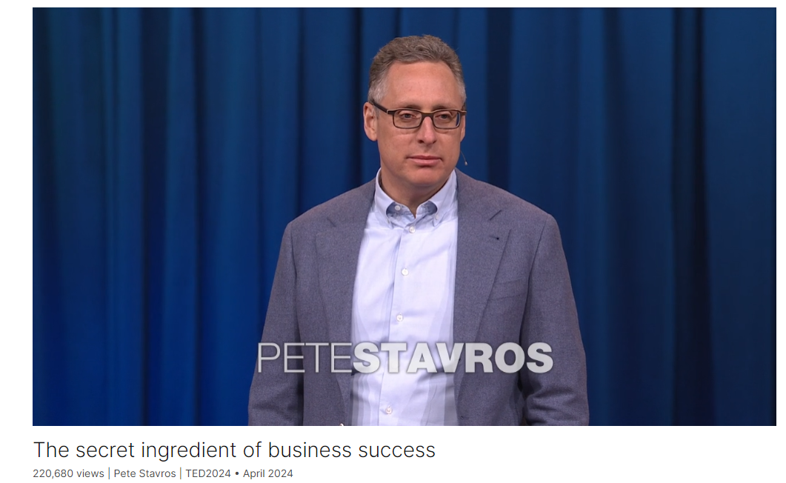

# The secret ingredient of business success

Link: [https://www.ted.com/talks/pete_stavros_the_secret_ingredient_of_business_success?](https://www.ted.com/talks/pete_stavros_the_secret_ingredient_of_business_success?)

Speaker:   Pete Stavros

Date: April 2024

@[toc]

## Introduction

Too often, employees are unmotivated and unhappy, with no real incentive to invest much of anything into their place of work. Investment expert Pete Stavros thinks there's a better way, and he's on a mission to rethink corporate structures to expand who benefits from a thriving company. Sharing personal stories of his own journey along with the profound impact doing this work effectively can have, this moving talk provides a blueprint for changing the narrative — and outlook — for millions of workers worldwide.

## Vocabulary

treasurer: 美 [ˈtreʒərər]  会计；出纳；财政部长；财政大臣

assistant treasurer:助理财务主管

wire transfer: 电汇

he was so overcome with emotion, he could barely find the words. 他太激动了，几乎说不出话来。

>在这里，"was overcome with emotion" 的意思是他被情感所淹没，情绪激动到几乎无法表达出言。"Overcome" 这里表示被某种情感或感觉所克服，使其难以应对或表达。

tearful：流泪的

voicemail：语音邮件

he later explained in a tearful voicemail that his ownership payout literally meant college education for his kids. 他后来在一封含泪的语音邮件中解释说，他的所有权支出实际上意味着他的孩子的大学教育。

construction company：建筑公司

road grader：平路机

My father operated a road grader for a union construction company： 我父亲为一家联合建筑公司操作平地机

build wealth：积累财富

he couldn't build wealth on 20 dollars an hour. 他不可能靠每小时20美元来积累财富。

stock ownership：股权

Only a tiny percentage of workers are granted stock ownership：只有很少一部分员工获得了股票所有权

we had some success, but we made a lot of mistakes. 我们取得了一些成功，但也犯了很多错误。

morale：美 [məˈræl]  士气，精神面貌 **注意发音**

reminiscent：美 [ˌremɪˈnɪsnt]  引起联想的，陷入回忆的，缅怀往事的

reminiscent of： 让人想起

But from a worker morale standpoint, it was very reminiscent of what I saw with my dad. 但从员工士气的角度来看，这让我想起了我和我父亲的经历。

dismal：美 [ˈdɪzməl]沉闷的，惨淡的，可怜的

Employee engagement scores were absolutely dismal. 员工参与度得分绝对令人沮丧。

>"Employee engagement scores" 指的是员工参与度评分。这是用来衡量员工对其工作、公司和组织的投入程度和情感连接程度的一种度量指标。通常通过调查、问卷调查或其他评估方法来获取。

dividend：美 [ˈdɪvɪdend] 红利，分红，股利

scrap：废料

gain market share：获得市场份额

We saw quality improve, scrap went down, productivity boomed. We became more responsive to customer demands, and we gained market share as a result. 我们看到质量提高了，废品率下降了，生产率提高了。我们变得更能响应客户需求，并因此赢得了市场份额。

dignified：美 [ˈdɪɡnɪfaɪd]  有尊严的

And it means dignified retirement for the employees. 这意味着员工有尊严的退休。

ignite：美 [ɪɡˈnaɪt] 点燃，点火，激发，激起

whose mission is to ignite a movement around employee ownership 其使命是点燃一场围绕员工所有权的运动

coalition：美 [ˌkoʊəˈlɪʃn]  联合，联盟

We've also joined forces with a coalition of employee ownership advocates who have come together to put new energy behind something called an ESOP, or employee stock ownership plan. 我们还与员工持股倡导者联盟联手，共同为员工持股计划注入新的活力。

## Summary

Pete Stavros begins by recounting his early experiences as an investor, emphasizing the significance of employee stock ownership in creating wealth and aligning incentives within companies. He reflects on his father's lifelong advocacy for worker ownership, inspired by his own experiences as a laborer in a union construction company. Stavros highlights the transformative potential of employee ownership in addressing wealth inequality, worker engagement, and corporate governance issues.

In the second part of his speech, Stavros shares a success story of implementing employee ownership at CHI Overhead Doors, illustrating how broadening stock ownership among employees can lead to tangible benefits for both workers and companies. Through transparent communication, financial education, and participatory decision-making, CHI Overhead Doors saw improvements in productivity, quality, and employee morale, ultimately resulting in substantial financial gains for all stakeholders.

In the final section, Stavros outlines his mission to promote employee ownership through his nonprofit organization, Ownership Works, and advocates for policy changes to expand the adoption of employee stock ownership plans (ESOPs). He envisions a future where employee ownership becomes the norm, empowering workers, strengthening communities, and reshaping the economy. Stavros concludes with a nod to his father's approval of his endeavors, emphasizing the urgency of implementing widespread employee ownership.

## Transcript

My first job as an investor
was when I was 24 years old,

and I'm almost 50 today,
so that is half a lifetime ago.

But I still clearly remember
the first thing I was asked to do:

to oversee wire transfers
related to the sale of a business,

basically to make sure
all the shareholders got their money.

Any company, large or small,
public or private,

has shareholders who own the business.

And as the value of the company goes up,

wealth is created
for those who own shares.

Now at this company, ownership
among the employees extended

from the very top position, the CEO,

to some mid-level roles
like assistant treasurer.

When I called the CEO
to confirm his wire transfer

it was a very matter-of-fact conversation.

"Got the money, thanks a lot."

Click.

Now, when I called
the assistant treasurer,

who was making a tiny fraction
of what the CEO had made,

he was so overcome with emotion,
he could barely find the words.

And he later explained
in a tearful voicemail

that his ownership payout

literally meant college
education for his kids.

So I wondered,

what if everyone in a company
had stock ownership,

not just to the assistant-treasurer level,

but to the factory floor,
distribution centers?

How might employees’ lives be impacted,

and how might the company and, in fact,
the whole community be impacted?

These questions were not new to me.

My dad had been asking them for decades.

My father operated a road grader
for a union construction company

in Chicago for 45 years.

This is actually a picture
of my dad in his road grader.

And my dad dreamt of worker ownership

to address three things
he didn't like about his job.

First, he couldn't build wealth
on 20 dollars an hour.

Second, he had no incentive to care
about things an owner would focus on,

things like productivity.

So he felt no sense of alignment.

And third, he had no voice.

Without the right incentives in place,

there was really no reason
for management to listen to workers,

and they didn't.

And my dad's experience
is certainly not unique.

Only a tiny percentage of workers
are granted stock ownership

in their companies,
and most workers have no wealth,

and it is in fact stock ownership
or the lack of it

that is by a mile the biggest driver
of wealth inequality.

Most employees feel
their opinions don't count.

If you look at Gallup surveys,

77 percent of employees globally
are disengaged on the job.

18 percent literally hate
the company that they work for.

They're throwing the wrenches
in the machines.

Today, I'm going to try to convince you
that broadening employee stock ownership

is the single most important thing
that we can do to lift up workers

and to make companies stronger, too.

It could give us a form of capitalism
that is actually inclusive

and sustainable.

And I believe it could literally
change the economy.

I've been pursuing this idea
most of my adult life.

25 years ago, as 
a graduate school student,

I dove into the history
of employee ownership,

and I published a paper
on the topic in 2002.

Then, a handful of years later,

I got my first real leadership position
at the company I still work for, KKR.

And I was put in charge of investing in
and improving industrial companies,

mostly manufacturing businesses.

And that was a great opportunity
to start experimenting

with different ways of sharing
stock ownership with all employees.

Something we've now done
with 44 different companies

over the past 15 years.

In our early efforts,

we had some success,
but we made a lot of mistakes.

The most important thing we got right

was making sure
that stock ownership was free

and incremental for workers,

not a trade for wages or other benefits.

This could not be about shifting
risk onto the workforce.

But we got plenty of things wrong.

We didn't communicate well.

So if I said something like,

"We'd hope to sell
a business in five years,"

that often led to employees
literally counting the days

or growing suspicious
if things took longer.

We didn't share our financial information

so people didn't know
how the business was doing,

nor did we ask them how they
would run the business better.

You see, ownership is about a lot more
than just giving out stock.

It's about trying to create
a whole different type of culture,

an ownership culture.

Now let me share a story

of what this can look like
when it's done well.

In 2015, we invested in a company
called CHI Overhead Doors.

CHI is based in central Illinois,
in Amish country,

and the company makes
overhead garage doors,

like the one you see here in this picture.

And CHI was a good business.

But from a worker morale standpoint,

it was very reminiscent
of what I saw with my dad.

Out of 800 employees,
only 18 had stock ownership.

So that means when we bought the business,

most people got nothing
and just went back to work,

and a small handful made
many millions of dollars.

Employee engagement scores
were absolutely dismal.

Most people didn't even bother
to respond to surveys.

And this lack of alignment and engagement,

you could see it in the business.

It showed up in things
like productivity, quality, scrap.

People didn't always try to do their best.

It took us a long time
to change the culture,

eight years.

And it started with stock ownership.

So day one, all 800 employees
were granted stock ownership

so they would participate.

As the value of the company went up,
through dividends along the way,

and then at the end,
when the business was sold.

When we announced this program,

the employees were so excited,
they gave me a gift.

Which was a live chicken.

(Laughter)

Literally two guys on the factory floor
came up and handed me a chicken.

(Laughter)

I awkwardly joked
that I didn't have a crate,

and I wasn't sure I could carry a chicken
on my flight back to New York.

But this was about much more
than just stock ownership.

Employees were educated
about the business,

they were kept informed.

Once a quarter we got everyone together
and we talked openly

about what was working and what was not

and where the business was headed,

and we shared our financial
information transparently.

All 800 employee owners
were given a voice.

As one example,

they were provided
with a million dollars annual budget

to invest in their workplace
any way they saw fit.

They came up with the ideas,

they decided where the money went.

And over the course of several years,

they voted in things like air conditioning
for the manufacturing plant.

One year they voted for new break rooms.

Another year, they wanted
an on-site health clinic built.

And another, an on-site cafeteria
with healthy food options.

We found this was a great way
to engage with employees

because not only were you
giving them a voice

but they could see their voice
physically manifested in the workplace.

Employees were also provided
free financial coaching

so that as they received money,

they could save and invest effectively.

And I want to be very clear,

all of this benefited the company too.

It's not like this was only
good for workers.

We saw quality improve,
scrap went down, productivity boomed.

We became more responsive
to customer demands,

and we gained market share as a result.

In fact, by the end of the journey,

the financial results
had improved so enormously

the company was worth ten times
what it had been worth in 2015.

And to put that in perspective,

this was the single best investment
for us at KKR since the 1980s.

And this is with a company
making garage doors.

This is not like a high-flying
technology business.

When the company was sold,

we gathered everyone in our main
manufacturing plant in central Illinois.

We told them their jobs were safe,

and it was time for each of them to learn
what they had earned from their ownership.

The payouts were scaled
based on length of employment.

With our most tenured factory workers

earning six-and-a-half times
their annual income,

or a half a million dollars.

We had truck drivers make 800,000 dollars.

So this was life-impacting
amounts of money.

And I could talk to you about it all day,

but I won't get it across as well
as the workers can themselves.

(Video) Person 1:
He started out at 20,000,

and then he went to the next amount
and the next amount,

and he kept going.

Person 2: I'm like, whoa!

Person 3: Holy smokes!

Person 4: Where is this going to lead?

PS: 40,000 dollars, 70,000 dollars.

Two-and-a-half times your annual pay.

Three-and-a-half times,
four-and-a-half times,

five-and-a-half times your annual pay.

Six-and-a-half times.

Person 4: I just kept looking around
at all the people around me

thinking how much this was going
to change everyone's lives.

Person 2: You sit there and you struggle,
like, how am I going to pay for this?

Person 6: Just think about what
this means for this area.

Person 7: We’re out here, there’s a bunch
of lower-income families

that live paycheck to paycheck.

Person 2: This will absolutely
give us some comfort that, you know,

the future is going to be OK.

Person 8: It’s wonderful,
I mean, it’s just freedom.

I got freedom.

Person 10: This is what we did
and we’re proud of it.

Person 11: Every cent
that we get back, we earned.

Person 12: Without ownership, it is a job.

You clock in, you clock out, you go home.

When you have ownership in the business,
it changes everything.

(Applause)

PS: They deserve
to be applauded because they earned it.

One of my favorite things in that ...

Audience: Don’t worry, we’re all crying.

(Laughter)

PS: Alright.

I'll try and explain that again.

So when Cara said, “We earned this,”
I love that sentiment,

because to me, that's ownership.

You know, they earned it,
this wasn't a gift,

it didn't happen by chance,
they made it happen.

And it did change the community.

340 million dollars of wealth
was injected into the community,

and it's forever changed.

I mean, that type of wealth creation,

it can fundamentally shift
a whole local economy.

It means more tax revenue, better schools,
new business formations,

more restaurants in town.

And it means dignified
retirement for the employees.

So just imagine how different
would the economy be

if every company operated in this way

and included all employees
in decision-making and in wealth creation?

What a different economy we would have.

When we sold the business,
I got a second gift.

A chicken.

(Laughter)

But this time it was with a crate
and it had a little tag

indicating it had been pre-checked
back to New York City.

(Laughter)

I wanted to stay married to my wife
so I did not bring the chicken home.

But when I got home,
my wife and I started talking

about how we could give this idea
of employee ownership more scope.

And we decided to start a nonprofit
called Ownership Works,

whose mission is to ignite a movement
around employee ownership

and to help CEOs and companies
who want to go on this journey

because it is not easy.

Our goal is to reach a million workers
over the next 10 years

and to create tens of billions
of wealth for working families.

And we're already well on our way.

We've got line of sight to our first
250,000 workers being impacted,

and our first 10 billion of wealth
creation for working families.

We've also joined forces with a coalition
of employee ownership advocates

who have come together to put new energy

behind something called an ESOP,

or employee stock ownership plan.

The ESOP was created
by Congress in the 1970s,

and it gives companies tax incentives

in exchange for sharing
stock ownership with workers.

Our goal, through a new organization
called Expanding ESOPs,

is to pass legislation
in the United States

to make ESOPs easier to form

and faster to form, particularly
with larger businesses.

It is going to take government support
for this idea to really take off.

That's how we're going to get
not one million new employee owners,

but 30 million or 40 million.

When I talk about this idea
and my passion for it,

I always get the same question:
“What does your dad think of all this?”

Well, you'd have to know my dad
to appreciate this, but he says,

"What the hell took so long?"

(Laughter)

Thank you.

(Cheers and applause)

## Afterword

2024年4月28日19点09分于上海。