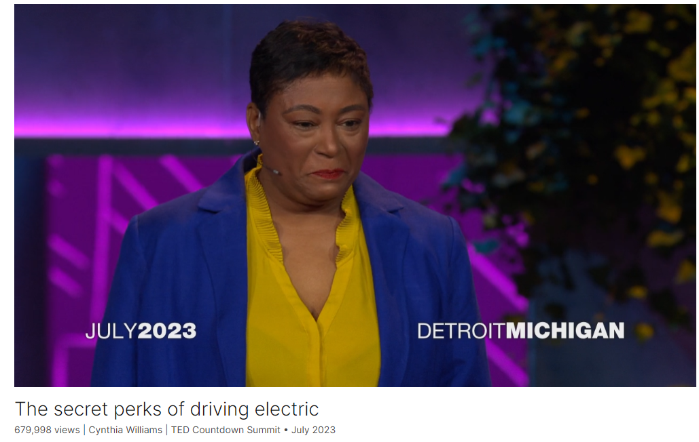

# The secret perks of driving electric

Link: [https://www.ted.com/talks/cynthia_williams_the_secret_perks_of_driving_electric](https://www.ted.com/talks/cynthia_williams_the_secret_perks_of_driving_electric)

Speaker:  Cynthia Williams

Date: July 2023

@[toc]

## Introduction

Electric vehicles need to be more than just eco-friendly — they have to be more chic, convenient and affordable than their gas-powered alternatives, says sustainability leader Cynthia Williams. She explores what it'll take for an electric revolution to succeed in the US, calling on corporations, policy leaders, investors and more to collaborate in unprecedented ways.

## Vocabulary

Have you ever had to have a really tough conversation with your parents? Well, I remember one like yesterday. I can still feel the knot in my stomach, 31 years later.

"Feel the knot in my stomach"是一种隐喻表达，意思是感受到焦虑、紧张或不适的情绪。这表明说话者对与父母进行的那次困难对话仍然感到情绪上的影响，就好像他们仍然能够在身体上感觉到当时的紧张或不安。

in the auto industry:在汽车行业

automotive：美 [ˌɔːtəˈmoʊtɪv]  汽车的

in the automotive industry. 在汽车行业。

station wagon: 美 [ˈsteɪʃn ˈwæɡən] 旅行车

and the Ford Mercury woody station wagon. 还有福特水星伍迪旅行车。

electric vehicle revolution: 电动汽车革命

We will need to **build new capacity** to meet the demand, support infrastructure and build a responsible supply chain. 我们需要建立新的生产能力以满足需求，支持基础设施，并建立负责任的供应链。

suit：效仿

fast charger：快速充电器

working with Tesla to bring more fast chargers to more consumers. And now other manufacturers are following suit. 与特斯拉合作，为更多消费者提供更多快速充电器。现在其他制造商也在效仿这样做。

carbon-neutral：碳中和

carbon footprint：碳足迹（某个时间段内日常活动排放的二氧化碳量）；（个人或组织的）温室气体排放总量

Now our goal is to become carbon-neutral no later than 2050, and our carbon footprint is as big as Australia's. 现在我们的目标是不迟于2050年实现碳中和，我们的碳足迹和澳大利亚一样大。

make the transition: 转型

We know that we need to make the transition to electric vehicles and clean energy fast. 我们知道我们需要快速向电动汽车和清洁能源转型。

premium：美 [ˈpriːmiəm] 优质的；高级的；

They both drove premium foreign cars for decades. 他们都开了几十年高档外国汽车。

So in 2011, I actually pitched to them the Lincoln MKZ Hybrid. 所以在2011年，我实际上向他们推销了林肯MKZ混合动力车。

在这里，"pitch" 的意思是向某人推销或提议某种产品或想法。

gasoline ：美 [ˈɡæsəliːn] 汽油

electrify：美 [ɪˈlektrɪfaɪ] 使（机器或系统；尤指铁路）电气化；

mustang：美 [ˈməˌstæŋ]野马

We are electrifying our most iconic vehicles first, like the Mustang and the F-150 truck. 我们首先对最具标志性的车辆进行电气化改造，比如野马和F-150卡车。

torque：美 [tɔːrk] 力矩，扭矩

instant torque：瞬时扭矩

>在汽车中，"instant torque" 指的是电动车辆提供的扭矩（torque）可以立即产生并传递到车轮，而不需要等待引擎转速提高或传统变速器换挡。这使得电动车辆在加速时能够提供更快的反应和更强劲的动力输出，因为扭矩立即可用。

chic: 美 [ʃiːk]  优雅时髦的；时髦漂亮的 **注意发音**

And look at that chic design. 看看这个别致的设计。

tailgate party: 车尾舞会；车尾聚会

>"tailgate party" 是指在体育比赛或其他大型活动的停车场或尾部门前举行的聚会。参与者通常会在车尾的后备箱或尾门附近聚集，享受食物、饮料和社交活动。这种聚会通常在美国特别流行，常见于橄榄球比赛、篮球比赛、音乐会和其他社交活动前。

People who drive electric vehicles can also light and heat up a campsite. They can charge up a work area, supercharge a tailgate party 驾驶电动车的人也可以点亮和加热一个露营地。他们可以给工作区充电，给车尾派对充能

charging station: 充电站

We will need charging stations as plentiful and convenient as gas stations. 我们将需要像加油站一样丰富和方便的充电站。

amenity: 美 [əˈmenəti]  方便条件；便利设施

we must bring lighting, shelter, security, restrooms, basic amenities. 我们必须带上照明设备、庇护所、安全设施、洗手间和基本设施。

corridor: 美 [ˈkɔːrɪdɔːr] 走廊；过道；

highway corridor: 高速走廊

>"highway corridor" 指的是高速公路沿线的一段区域或延伸部分，通常指连接城市或地区的主要公路路段。这些走廊通常是高速公路系统中的重要部分，连接着各种城市、交通枢纽和重要地点，提供了便捷的交通通道。

one hopeful move is the new federal spending that will allow states to deploy fast-charging every 50 miles along major highway corridors. 一个有希望的举措是新的联邦支出将允许各州在主要高速公路走廊上每50英里部署一次快速充电。

We need policy makers to harmonize environmental regulations. We need one framework to drive a resilient grid faster. We need to strengthen the supply base here and still create more jobs here. 我们需要政策制定者来协调环境法规。我们需要一个框架来更快地驱动弹性网格。我们需要加强这里的供应基础，并在这里创造更多的就业机会。

## Transcript

Have you ever had to have a really tough
conversation with your parents?

Well, I remember one like yesterday.

I can still feel the knot in my stomach,

31 years later.

Just imagine me.

I was a fresh engineer
out of Michigan State University

with my first real job offer,
with guess what?

My dad's number one rival.

You have to understand,
I grew up in Flint, Michigan.

My dad was a GM guy all the way,

like his dad before him, his brother

and all of his friends.

They were GM lifers.

But thankfully, my dad
was satisfied with the fact

that at least I'd be working
for one of the "big three."

Now, when my granddad started
working in the auto industry

in the mid 1940s, it was booming.

Fun fact:

popular cars at that time

were the Chrysler
Town and Country Hardtop,

the Chevy Stylemaster

and the Ford Mercury woody station wagon.

It was the modern age of transportation.

Now, today, we're experiencing
another major transformation.

Many are calling it
the electric vehicle revolution.

Now with that comes unprecedented change

that will require us to build new capacity

and collaborate in ways
that we've never seen before.

Now the change begins
with sustainable products

that provide better experiences

and greater benefits
for the people that use them.

We will need to build new capacity
to meet the demand,

support infrastructure and build
a responsible supply chain.

All while collaborating in ways
that we'd never seen before

with new partners,

like working with Tesla to bring more
fast chargers to more consumers.

And now other manufacturers
are following suit.

Now, I sincerely hope

that people leading companies like ours
will work together,

collaborate and learn,
and help each other succeed.

Now our goal is to become
carbon-neutral no later than 2050,

and our carbon footprint
is as big as Australia's.

We know that we need to make
the transition to electric vehicles

and clean energy fast.

Now with that,

to transition and to make sure
that we can get to our long-term goals,

this is what needs to happen.

First, we must continue
to make awesome products.

That can't go away.

Share a couple of pictures with you.

This is my uncle Daniel,
this is my uncle Willy.

They both drove premium
foreign cars for decades.

You know, I began to work on them
right away to make the switch to Ford.

(Laughter)

So in 2011, I actually pitched to them
the Lincoln MKZ Hybrid.

This vehicle had the latest
safety technology,

it had an interior like a fighter jet,

it had a smooth ride, a distinctive look,

41 miles per gallon.

And it was built by an American company
in their home state of Michigan.

And it was the same price
as the gasoline version,

but way better for the environment.

They each bought one.

The lesson is --

(Applause)

We can't make the change
feel like a trade-off.

We are building on the strength
of our current products.

We are electrifying our most
iconic vehicles first,

like the Mustang and the F-150 truck.

(Applause)

Now tell me this is not a hot car.

(Laughter)

It's all electric,

instant torque,

0 to 60, in just 3.5 seconds.

(Cheers)

And look at that chic design.

(Laughter)

But my point is,

when we improve our vehicles
to be more sustainable,

we also have to make them better.

And there's no better feeling
than driving right past a gas station

on my way home.

(Laughter and applause)

Knowing that I can get
a full charge just overnight.

Now, my daughter and her friends

are always bringing
their cars home on empty.

Wouldn't be a problem
if they drove electric.

(Laughter)

Now let's look at the F-150 Lightning.

The F-150 Lightning can power
your house up to ten days.

Imagine the impact on rural communities

if they didn't need a generator
when the power went out.

People who drive electric vehicles
can also light and heat up a campsite.

They can charge up a work area,

supercharge a tailgate party --

(Laughter)

and even charge another electric vehicle.

Now these are product improvements

that my granddads
could never have imagined.

Now with that, with all these new
products coming to the market,

next comes capacity.

We have to build and invest
in new facilities and talent.

Now that's true for any industry

transitioning to greener goals
and strategies.

Now I'll tell you a few things
that Ford is doing.

But we're not alone in this area.

In Tennessee,

we are investing more
than five billion dollars

in electric vehicle
manufacturing for trucks

and advanced batteries.

In all of our facilities,

our goal, for either new or old,

is to conserve and reuse water,

use 100 percent carbon-free electricity

and send zero waste to landfill.

And we are also investing in talent,

we're investing in education and training,

and we're also listening
to the communities

where we live in an operate.

That's huge for industries like us.

We have to listen to people
other than ourselves.

Now I tell you,

in Tennessee, we've created
more than 6,000 new jobs.

And again, we're not doing this alone.

As an industry,

we have invested more
than 120 billion dollars

in electric vehicle manufacturing.

We’ve created 143,000
new jobs in the last eight years

and 40 percent of that,

40 percent of that happened

since the US government approved
the climate and clean energy legislation.

(Applause)

And again, we're not alone in this.

We continue to make progress,
but we're going to need to do more.

We need to build ...

more infrastructure here.

Infrastructure is critical.

We will need charging stations

as plentiful and convenient
as gas stations.

In the US, we have
about 145,000 gas stations

and only about 23,000
fast-charging stations.

In order to make the move
to electric vehicles fast,

we'll need many, many more.

Now, I'm not saying we're going
to need one on every corner,

but we will need many, many more.

We need every community,

whether rural or urban,
wealthy or low-income,

everyone will need access to charging.

And the charging station,

we must bring lighting, shelter,

security, restrooms, basic amenities.

These are things that we will
need to move forward.

And one hopeful move

is the new federal spending

that will allow states to deploy
fast-charging every 50 miles

along major highway corridors.

And the benefits are real.

Let's take a look
at the 110,000 electric vehicles

that Ford has put on the road since 2021.

These vehicles have the potential

to save five million tons
of carbon emissions

over their lifetime.

That's equivalent to CO2 saved

by not burning 600 million
gallons of gasoline.

Like my family before me,

I am proud to work alongside my teammates
in the automotive industry.

We have come a long way.

It's so gratifying to see
electric vehicles on the road.

To move from aspiration to reality.

To see plants dedicated
to building electric vehicles.

But outside of the US,

in Asia, where I lived
for three years, and Europe,

they're way ahead of us.

Here's what we need to do
to make sure that we're ready

for an all-electric future.

We need policy makers to harmonize
environmental regulations.

We need one framework
to drive a resilient grid faster.

We need to strengthen the supply base here

and still create more jobs here.

We have the technology,

we have the leadership,

we have the ingenuity to respond
to the environmental crisis with courage.

And I'll tell you,

entrepreneurs, venture
capitalists, manufacturers,

everyone is beginning to understand

and accept the social responsibility

to build a future
of electric vehicles here.

And they are also seeing
the business opportunity before them.

And I'll tell you, as a person

who's dedicated my entire
career to sustainability,

the road ahead is paved with promise.

And it might surprise my dad,

it's not going to be about Ford
versus GM or Stellantis

or even the US versus Asia or Europe.

We all have to work together
to build a better future

for the next three generations
of my family and yours.

Thank you.

(Applause)

## Summary

In her speech, sustainability leader Cynthia Williams recounts a challenging conversation with her father, reflecting on her journey as an engineer and the significant transformation happening in the automotive industry. She highlights the transition to electric vehicles as a critical step towards addressing climate change and resource depletion. Williams emphasizes the need for collaboration, innovation, and investment to accelerate the adoption of sustainable practices across industries.

Williams underscores the importance of product innovation and building on existing strengths to drive the transition to electric vehicles. She shares examples of iconic vehicles like the Mustang and F-150 truck being electrified, showcasing their improved performance and environmental benefits. Williams emphasizes the role of new technologies in making sustainable products more attractive and accessible to consumers, while also creating new opportunities for innovation and growth.

In conclusion, Williams calls for collective action and cooperation to overcome the challenges of transitioning to an all-electric future. She emphasizes the need for investment in infrastructure, talent, and policy support to drive widespread adoption of electric vehicles. Williams highlights the potential economic and environmental benefits of embracing sustainability, urging stakeholders to work together towards building a better future for future generations.

## 后记

2024年5月6日13点40分于上海。

