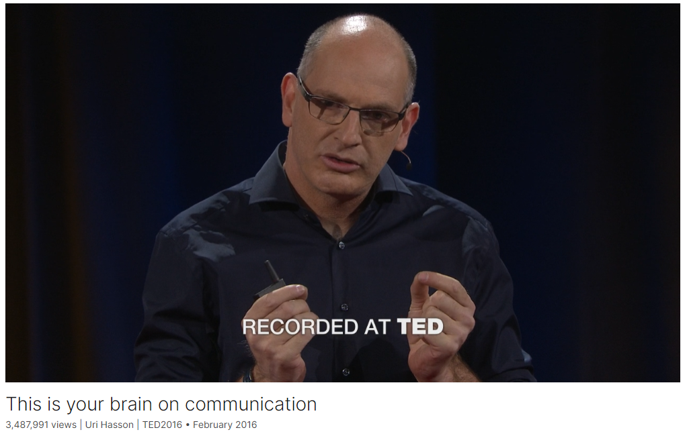

# This is your brain on communication

Link: [https://www.ted.com/talks/uri_hasson_this_is_your_brain_on_communication](https://www.ted.com/talks/uri_hasson_this_is_your_brain_on_communication)

Speaker:  Uri Hasson 

Date: February 2016

@[toc]

## Introduction

Neuroscientist Uri Hasson researches the basis of human communication, and experiments from his lab reveal that even across different languages, our brains show similar activity, or become "aligned," when we hear the same idea or story. This amazing neural mechanism allows us to transmit brain patterns, sharing memories and knowledge. "We can communicate because we have a common code that presents meaning," Hasson says.

## Vocabulary

embellishment: 装饰；修饰；装饰品；

by adding an element of embellishment.

high-powered: 精力充沛的；能力强的

dean: 系主任；院长；

assault: 美 [əˈsɔːlt]  武力攻击；袭击；困扰

pastry: 美 [ˈpeɪstri] 油酥点心

But I had just seen the line crossed between a high-powered dean and assault with a pastry. 但我刚刚看到了一个精力充沛的院长和用糕点袭击他人之间的界限。

auditory:  美 [ˈɔːdətɔːri] 听觉的

the auditory cortex that processes the sounds that come from the ear. 处理来自耳朵的声音的听觉皮层。

entrainment: 美 [ɪn'treɪnmənt]  带走；夹带；

We call this effect "neural entrainment.": 神经震荡同步化

metronome: 美 [ˈmɛtrəˌnoʊm]  节拍器

scramble：美 [ˈskræmbl] 爬行；攀登；弄乱；

scramble the words：打乱单词

frontal cortex：额叶皮层

parietal：美 [pəˈraɪəd(ə)l]，**注意发音**

parietal cortex：顶叶皮层

which include the frontal cortex and the parietal cortex：包括额叶皮层和顶叶皮层

"hackney carriage"：出租车 

"cab"： 出租车

## Summary

**Introduction and Neural Entrainment**:
Uri Hasson begins by comparing human communication to a theoretical device that could transmit memories and ideas directly between brains. He explains that this "device" already exists in the form of storytelling and effective communication. To understand how this works, Hasson's lab at Princeton uses fMRI to scan the brains of people while they listen to and tell stories. He demonstrates that when a story is told, listeners' brain responses align with the storyteller's, a phenomenon called neural entrainment. This alignment occurs because of the common neural protocols developed for communication, similar to how metronomes synchronize when placed on a moving platform.

**Mechanisms of Communication**:
Hasson delves into what drives neural entrainment by experimenting with different forms of storytelling. He shows that while sound and words alone can induce some brain alignment, a coherent and engaging story activates higher-order brain areas associated with meaning. This alignment suggests that effective communication is not just about the words or sounds used but about the shared meaning and understanding between speaker and listener. Hasson's experiments also reveal that stories told in different languages but conveying the same meaning produce similar brain responses in higher-order areas, underscoring the importance of shared meaning over linguistic differences.

**Importance of Common Ground**:
Hasson emphasizes that communication relies on a common ground, which can be influenced by prior knowledge and beliefs. He demonstrates this by showing how a single sentence can alter brain responses to a story based on the listener's beliefs. This highlights the broader societal implications, where different media perspectives can shape people's understanding of the same events. Hasson concludes by advocating for dialogue and mutual understanding to maintain effective communication. He shares a personal anecdote about his son's early vocal interactions, illustrating the fundamental human desire to connect with others and how these connections shape our identities. He urges the audience to continue sharing ideas and fostering connections, as collective understanding is greater than individual parts.

## Transcript

Imagine that you invented a device

that can record my memories,

my dreams, my ideas,

and transmit them to your brain.

That would be a game-changing
technology, right?

But in fact, we already
possess this device,

and it's called human communication system

and effective storytelling.

To understand how this device works,

we have to look into our brains.

And we have to formulate the question
in a slightly different manner.

Now we have to ask

how these neuron patterns in my brain

that are associated
with my memories and ideas

are transmitted into your brains.

And we think there are two factors
that enable us to communicate.

First, your brain is now
physically coupled to the sound wave

that I'm transmitting to your brain.

And second, we developed
a common neural protocol

that enabled us to communicate.

So how do we know that?

In my lab in Princeton,

we bring people to the fMRI scanner
and we scan their brains

while they are either telling
or listening to real-life stories.

And to give you a sense
of the stimulus we are using,

let me play 20 seconds
from a story that we used,

told by a very talented storyteller,

Jim O'Grady.

(Audio) Jim O'Grady: So I'm banging out
my story and I know it's good,

and then I start to make it better --

(Laughter)

by adding an element of embellishment.

Reporters call this "making shit up."

(Laughter)

And they recommend
against crossing that line.

But I had just seen the line crossed
between a high-powered dean

and assault with a pastry.

And I kinda liked it."

Uri Hasson: OK, so now
let's look into your brain

and see what's happening
when you listen to these kinds of stories.

And let's start simple -- let's start
with one listener and one brain area:

the auditory cortex that processes
the sounds that come from the ear.

And as you can see,
in this particular brain area,

the responses are going up and down
as the story is unfolding.

Now we can take these responses

and compare them to the responses
in other listeners

in the same brain area.

And we can ask:

How similar are the responses
across all listeners?

So here you can see five listeners.

And we start to scan their brains
before the story starts,

when they're simply lying in the dark
and waiting for the story to begin.

As you can see,

the brain area is going up and down
in each one of them,

but the responses are very different,

and not in sync.

However, immediately
as the story is starting,

something amazing is happening.

(Audio) JO: So I'm banging out my story
and I know it's good,

and then I start to make it --

UH: Suddenly, you can see
that the responses in all of the subjects

lock to the story,

and now they are going up and down
in a very similar way

across all listeners.

And in fact, this is exactly
what is happening now in your brains

when you listen to my sound speaking.

We call this effect "neural entrainment."

And to explain to you
what is neural entrainment,

let me first explain
what is physical entrainment.

So, we'll look and see five metronomes.

Think of these five metronomes
as five brains.

And similar to the listeners
before the story starts,

these metronomes are going to click,

but they're going to click out of phase.

(Clicking)

Now see what will happen
when I connect them together

by placing them on these two cylinders.

(Clicking)

Now these two cylinders start to rotate.

This rotation vibration
is going through the wood

and is going to couple
all the metronomes together.

And now listen to the click.

(Synchronized clicking)

This is what you call
physical entrainment.

Now let's go back to the brain and ask:

What's driving this neural entrainment?

Is it simply the sounds
that the speaker is producing?

Or maybe it's the words.

Or maybe it's the meaning
that the speaker is trying to convey.

So to test it, we did
the following experiment.

First, we took the story
and played it backwards.

And that preserved many
of the original auditory features,

but removed the meaning.

And it sounds something like that.

(Audio) JO: (Unintelligible)

And we flashed colors in the two brains

to indicate brain areas that respond
very similarly across people.

And as you can see,

this incoming sound induced entrainment
or alignment in all of the brains

in auditory cortices
that process the sounds,

but it didn't spread
deeper into the brain.

Now we can take these sounds
and build words out of it.

So if we take Jim O'Grady
and scramble the words,

we'll get a list of words.

(Audio) JO: ... an animal ...
assorted facts ...

and right on ... pie man ...
potentially ... my stories

UH: And you can see that these words
start to induce alignment

in early language areas,
but not more than that.

Now we can take the words
and start to build sentences out of them.

(Audio) JO: And they recommend
against crossing that line.

He says: "Dear Jim,
Good story. Nice details.

Didn't she only know
about him through me?"

UH: Now you can see that the responses
in all the language areas

that process the incoming language

become aligned or similar
across all listeners.

However, only when we use
the full, engaging, coherent story

do the responses spread
deeper into the brain

into higher-order areas,

which include the frontal cortex
and the parietal cortex,

and make all of them
respond very similarly.

And we believe that these responses
in higher-order areas are induced

or become similar across listeners

because of the meaning
conveyed by the speaker,

and not by words or sound.

And if we are right,
there's a strong prediction over here

if I tell you the exact same ideas

using two very different sets of words,

your brain responses
will still be similar.

And to test it, we did
the following experiment in my lab.

We took the English story

and translated it to Russian.

Now you have two different sounds
and linguistic systems

that convey the exact same meaning.

And you play the English story
to the English listeners

and the Russian story
to the Russian listeners,

and we can compare their responses
across the groups.

And when we did that, we didn't see
responses that are similar

in auditory cortices in language,

because the language
and sound are very different.

However, you can see
that the responses in high-order areas

were still similar
across these two groups.

We believe this is because they understood
the story in a very similar way,

as we confirmed, using a test
after the story ended.

And we think that this alignment
is necessary for communication.

For example, as you can tell,

I am not a native English speaker.

I grew up with another language,

and the same might be for many
of you in the audience.

And still, we can communicate.

How come?

We think we can communicate
because we have this common code

that presents meaning.

So far, I've only talked about
what's happening in the listener's brain,

in your brain, when
you're listening to talks.

But what's happening
in the speaker's brain, in my brain,

when I'm speaking to you?

To look in the speaker's brain,

we asked the speaker
to go into the scanner,

we scan his brain

and then compare his brain responses
to the brain responses of the listeners

listening to the story.

You have to remember that producing speech
and comprehending speech

are very different processes.

Here we're asking: How similar are they?

To our surprise,

we saw that all these complex
patterns within the listeners

actually came from the speaker brain.

So production and comprehension
rely on very similar processes.

And we also found

the stronger the similarity
between the listener's brain

and the speaker's brain,

the better the communication.

So I know that if you
are completely confused now,

and I do hope that this is not the case,

your brain responses
are very different than mine.

But I also know that if you really
understand me now,

then your brain ... and your brain
... and your brain

are really similar to mine.

Now, let's take all
this information together and ask:

How can we use it to transmit
a memory that I have

from my brain to your brains?

So we did the following experiment.

We let people watch,
for the first time in their life,

a TV episode from the BBC series
"Sherlock," while we scanned their brains.

And then we asked them
to go back to the scanner

and tell the story to another person
that never watched the movie.

So let's be specific.

Think about this exact scene,

when Sherlock is entering
the cab in London

driven by the murderer he is looking for.

With me, as a viewer,

there is a specific brain pattern
in my brain when I watch it.

Now, the exact same pattern,
I can reactivate in my brain again

by telling the word:
Sherlock, London, murderer.

And when I'm transmitting
these words to your brains now,

you have to reconstruct it in your mind.

In fact, we see that pattern
emerging now in your brains.

And we were really surprised to see

that the pattern you have
now in your brains

when I'm describing to you these scenes

would be very similar to the pattern
I had when I watched this movie

a few months ago in the scanner.

This starts to tell you
about the mechanism

by which we can tell stories
and transmit information.

Because, for example,

now you're listening really hard
and trying to understand what I'm saying.

And I know that it's not easy.

But I hope that at one point
in the talk we clicked, and you got me.

And I think that in a few hours,
a few days, a few months,

you're going to meet someone at a party,

and you're going to tell him
about this lecture,

and suddenly it will be as if
he is standing now here with us.

Now you can see
how we can take this mechanism

and try to transmit memories
and knowledge across people,

which is wonderful, right?

But our ability to communicate
relies on our ability

to have common ground.

Because, for example,

if I'm going to use the British synonym

"hackney carriage" instead of "cab,"

I know that I'm going to be misaligned
with most of you in the audience.

This alignment depends
not only on our ability

to understand the basic concept;

it also depends on our ability to develop
common ground and understanding

and shared belief systems.

Because we know that in many cases,

people understand the exact
same story in very different ways.

So to test it in the lab,
we did the following experiment.

We took a story by J.D. Salinger,

in which a husband lost track
of his wife in the middle of a party,

and he's calling his best friend, asking,
"Did you see my wife?"

For half of the subjects,

we said that the wife was having
an affair with the best friend.

For the other half,

we said that the wife is loyal
and the husband is very jealous.

This one sentence before the story started

was enough to make the brain responses

of all the people that believed
the wife was having an affair

be very similar in these high-order areas

and different than the other group.

And if one sentence is enough
to make your brain similar

to people that think like you

and very different than people
that think differently than you,

think how this effect is going
to be amplified in real life,

when we are all listening
to the exact same news item

after being exposed
day after day after day

to different media channels,
like Fox News or The New York Times,

that give us very different
perspectives on reality.

So let me summarize.

If everything worked as planned tonight,

I used my ability to vocalize sound
to be coupled to your brains.

And I used this coupling

to transmit my brain patterns associated
with my memories and ideas

into your brains.

In this, I start to reveal
the hidden neural mechanism

by which we communicate.

And we know that in the future
it will enable us to improve

and facilitate communication.

But these studies also reveal

that communication relies
on a common ground.

And we have to be
really worried as a society

if we lose this common ground
and our ability to speak with people

that are slightly different than us

because we let a few very strong
media channels

take control of the mic,

and manipulate and control
the way we all think.

And I'm not sure how to fix it
because I'm only a scientist.

But maybe one way to do it

is to go back to the more
natural way of communication,

which is a dialogue,

in which it's not only me
speaking to you now,

but a more natural way of talking,

in which I am speaking and I am listening,

and together we are trying to come
to a common ground and new ideas.

Because after all,

the people we are coupled to
define who we are.

And our desire to be coupled
to another brain

is something very basic
that starts at a very early age.

So let me finish with an example
from my own private life

that I think is a good example
of how coupling to other people

is really going to define who we are.

This my son Jonathan at a very early age.

See how he developed
a vocal game together with my wife,

only from the desire and pure joy
of being coupled to another human being.

(Both vocalizing)

(Laughter)

Now, think how the ability of my son

to be coupled to us
and other people in his life

is going to shape the man
he is going to become.

And think how you change on a daily basis

from the interaction and coupling
to other people in your life.

So keep being coupled to other people.

Keep spreading your ideas,

because the sum of all of us
together, coupled,

is greater than our parts.

Thank you.

(Applause)

## Afterword

2024年5月21日于上海。