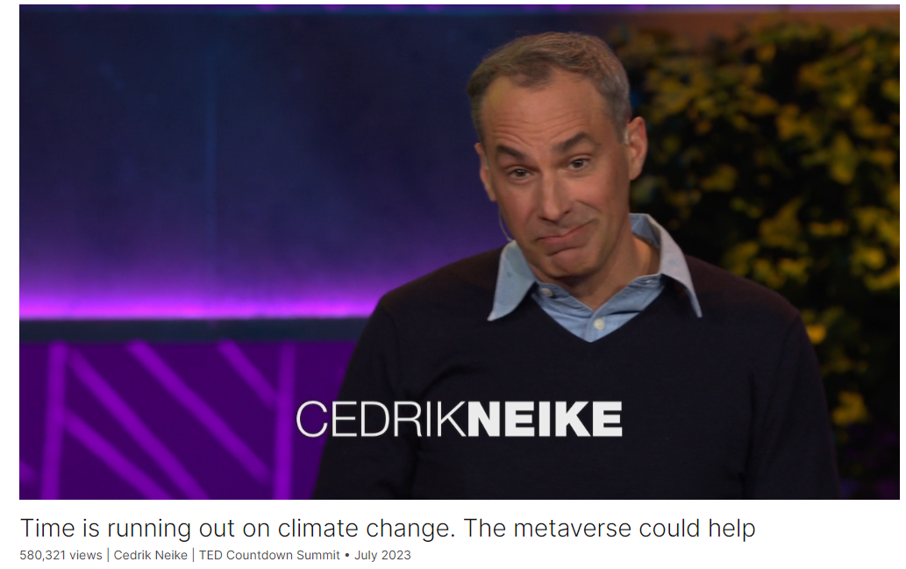

# Time is running out on climate change. The metaverse could help

Link: [https://www.ted.com/talks/cedrik_neike_time_is_running_out_on_climate_change_the_metaverse_could_help?](https://www.ted.com/talks/cedrik_neike_time_is_running_out_on_climate_change_the_metaverse_could_help?)

Speaker:  Cedrik Neike 

Date: July 2023

@[toc]

## Introduction

The metaverse could be our key to making real progress in the fight against climate change, says engineer Cedrik Neike. Examining how AI-powered modeling eliminates the trial and error of wasteful industries, he explores how this emerging technology is already improving everything from the gigafactories that churn out electric car batteries to the fuel efficiency of your home. Learn more about how these "digital twins" are transforming the world — and not a moment too soon.

## Vocabulary

wound up:焦虑的；焦躁不安的；紧张的；激动的

So it's something which gets me sort of all wound up, but the reality is we’re running out of time. 这让我有点紧张，但事实是我们的时间不多了。

replenishable : 可补充的

we will have used up all of the replenishable resources of this planet. 我们将用尽这个星球上所有的可补充资源。

trial and error：反复试验；试错法；不断尝试；摸索法

We basically are having a trial and error sort of approach. 我们基本上是一种试错的方法。

laws of physics：物理定律

we can learn things without being bound by the laws of physics. 我们可以不受物理定律的束缚来学习东西。

compute power：计算能力

fossil fuel：美 [ˈfɑːsl fjuːəl]  化石燃料， **注意发音**

gigafactory：超级工厂

industrial metaverse：工业元宇宙

scrap：美 [skræp] 废料；废品；

aluminum foil：美 [əˈlumənəm fɔɪl] 铝箔纸

lithium-ion：锂离子电池

pesticide：美 [ˈpestɪsaɪd] 杀虫剂，农药， **注意发音**

zero pesticides：零农药

platinum ：美 [ˈplætɪnəm] 铂；白金；银灰色的；

depletion：美 [dɪˈpliʃən] 消耗，耗尽

resource depletion：资源消耗

## Summary

In his speech, engineer Cedrik Neike addresses urgent global challenges, particularly regarding climate change and resource depletion. He highlights the looming deadlines, such as reaching the 1.5 degrees Celsius target of the Paris Agreement and the World Overshoot Day, emphasizing the critical need for innovative solutions. Neike emphasizes his background as an engineer and the profession's problem-solving ethos. However, he acknowledges the limitations of traditional approaches in tackling complex issues like climate change and resource management.

Neike introduces the concept of leveraging the digital world to address real-world challenges effectively. He contrasts the slow, resource-intensive processes of the physical world with the limitless possibilities of the digital realm. Neike proposes using digital simulations and virtual environments to accelerate innovation and experimentation, particularly in industries like renewable energy and battery manufacturing. He outlines examples of how digital twins and simulations can optimize processes, reduce waste, and improve efficiency, such as in battery design, production, and recycling.

In conclusion, Neike urges the audience to embrace digital technologies as powerful tools for addressing pressing global issues. He advocates for a paradigm shift in industries to adopt digital simulations, artificial intelligence, and cloud computing to accelerate progress towards sustainability goals. Neike emphasizes the potential of these technologies to revolutionize various sectors, from transportation and agriculture to urban planning and building design. He calls upon individuals and industries to leverage these tools to create a better, more sustainable world for future generations.

## Transcript

When I listen to all of this,
my question is, are we too late?

I’m half German, and I hate
being late, to be very honest.

So it's something which gets me
sort of all wound up,

but the reality is ...
we’re running out of time.

We have real issues
reaching the 1.5 degrees of Paris,

so that's one issue.

But we're not only running out of time,

we are also running out of resources.

So three weeks from now,
on the second of August,

we will reach the World Overshoot Day,

meaning we will have used up

all of the replenishable
resources of this planet.

So that's not good.
These are real problems.

Now, I'm an engineer,

and we engineers love to solve problems.

That's what we do.

But the reality is,
if we go to the real world,

we will not be able
to solve those problems

doing everything in the real world
as we've done it before.

A lot of us, including my kids and myself,

and a third of the world population,

escape into digital worlds.

There are three billion gamers out there.

We "lose" time.

But what if I would tell you ...

that we could use the digital world
to cheat time in the real world,

and to make things better and faster
with less resources?

You would tell me,
"Well, how does it work, Cedrik?"

And I would tell you the following.

Now, in the physical world,
the laws of physics apply, right?

I'm in industry, so what do we do?

We dig up the Earth, we get stuff out,

we ship it around the world,

we melt it, we assemble it,

we try if it works, and we try again,

and if not, we dig up more stuff.

We basically are having
a trial and error sort of approach.

Lots of time, lots of resources
are being used.

It took us more than a hundred years
to build the combustion engine car.

Now in the digital world,
it's a bit different.

We could have a digital playground,

we can learn things without being bound
by the laws of physics.

We can replicate the complete real world
and start experimenting on it.

And the one thing we can [do],

is we will not learn one time faster,
not ten times faster.

We will learn a million times
faster, even more.

We're only limited by how much
compute power we throw at a problem.

So the thing we have,
how do we make it real?

So how do we cheat time
to do more with less?

We are using all too much fossil fuels.

We're not using enough renewables,

and we all know
that batteries are the answer,

to be able to help us sort of store
and distribute this renewable energy.

Now the problem with batteries
is that there's a lot of investment

going into battery
manufacturing at the moment.

Since 2019, 300 billion dollars
are being put into batteries,

200 gigafactories are being built,

because we need to build
10 billion batteries per year in 2030.

And just to give you
an overview of a gigafactory,

basically, you take two Eiffel Towers,
put them next to each other,

that's the size of the gigafactory
which is out there.

Eiffel Tower -- I’m half French,

so when I want to say
something is really big,

I take a couple of Eiffel Towers,

so two Eiffel Towers next to each other.

Now imagine 200 of those gigafactories
which are being built.

They need to build the right batteries,

they need to do this in the right way,
and they need to recycle them.

How can we apply this technology?

Very simple.

First thing we will do in this,
let's call it an industrial metaverse,

we will build the perfect battery.

We will experiment with its chemistry,
with how it needs to be built,

and we will solve the problems we have.

One problem is, I don't know
if any of you came here in an EV,

you probably didn't like
your charging time.

So I brought a little example for you.

So let me share this example.

So this is basically a module,
which goes into a pack.

It's actually a car battery.

If we're capable of cooling
this car battery 30 percent faster ...

or better,

you can charge your cars twice as fast.

So we could actually save time
with less resources.

And all of this simulation
can be done not in years,

it can be done in weeks,

without building a single battery.

So that's the first thing.

The second thing is, actually
building batteries the traditional way

uses a lot of energy,
lots of water, lots of resources,

and produces lots of scrap.

That’s not good.

If you go to a traditional --

I mean, making batteries
is like making a cake.

I'm sorry for all of the battery
experts in the room,

but it's baking a cake.

What you do is you take
a lot of ingredients, you mix them up.

In the factory, you have somebody
listening to the sound --

"Yep, it's about right."

If it's true, you put it
onto aluminum foil, which gets folded,

which gets put in a casing, dried out.

The problem is that if the person
listened to it the wrong way,

you can throw away five days,
seven days of battery production,

and this, in a gigafactory,
is a really bad thing.

So what do we do?
That's my second example.

We build these gigafactories
completely in the metaverse,

in the digital world, first.

And we simulate how we do
actually the chemistry,

how does it flow,
can we get the information?

We don't need to listen to it.

How do we optimize the different steps?

This is a gigafactory, for example,
which is going to be built.

So we build this gigafactory
in the metaverse first,

to make sure that it produces
in the right way.

And once we have the real factory,

the metaverse factory runs in parallel

and learns faster than the real
world to learn from it.

So we dream up a better battery,
we make a better battery,

and then the last one,
we have to recycle the battery.

We have to reuse it.

So I'm hoping that all of you
are collecting your batteries

to bring them back,
in Germany to the supermarket,

for recycling.

The reality is, if you have
a bag of 20 batteries,

if it’s lithium-ion,
only one will be recycled,

19 will be thrown away.

Only five percent of all batteries
are actually being recycled at the moment.

And what we can do
if we have a digital twin

on ... designing the battery,
building the battery,

is we can have a digital twin
of each battery,

saying, "That's me,
this is how I've been built,

these are my components,

this is how you can repair me,

this is how I can be
sort of disassembled,"

and you can automate it.

So we can actually take
95 percent or plus of the battery

back into the process.

Now this battery example
is just to give you a view

on how we can design,
build and reuse it in a better way.

The problem is, I gave
that speech to my kids,

and my kids basically said,

"Look, Dad, we're computer scientists,
this has been done for the last 40 years.

What's new about it?"

So I'm like, "What's new
is that we are now throwing

a huge amount of cloud
computing and AI to it,

so every industry
can use this capability."

And I'll give you three examples.

First one, air travel.

Three to four percent of worldwide CO2.

We're working with small start-ups

which are building
completely electrical planes,

completely in the metaverse first,
to build them right.

Second one, so we build better travel,

we can use it for better food, right?

Twenty-five percent of all CO2
is being used in agriculture.

So this is an example I brought for you.

We can build gigafactories for food.

This is vertical farms,
completely automated.

These farms use 100 percent renewables,

they use 95 percent
less water, zero pesticides.

And it tastes, actually, quite good.

And it's completely automated.

What does that have to do
with a digital twin?

We have a twin of each plant,

which means we can make every day
a perfect day for these plants.

It's pretty good.

Now the last example,
it's going to be shocking to you,

but you should think about it.

You're spending 90 percent
of your living time in buildings.

In buildings which have been
badly designed,

badly built and badly run.

You heat it when it shouldn't be heated,

you cool it when it shouldn't be cooled,
you leave the lights on,

so it's a huge waste of resources.

Thirty percent of all energy
goes into buildings.

So we can use those tools
to design houses better,

to simulate what needs to be done
to build them in a better way,

so they don't have to be
changed multiple times,

and to run them.

But being here in Detroit,

we can also do it
for complete parts of the city,

which is my last example.

I come from Berlin.

This is an old industrial
part of this town,

which we are going to rebuild completely.

And what we decided
is we're going to rebuild it first

in the metaverse.

Because we want to optimize
where the excess heat goes,

where the excess cooling is going,

what happens if the rain falls,
how can we keep it?

What does the biosphere look like,
what is the biodiversity,

can we make it wheelchair-accessible?

We optimize it.

So once we've built
this part of Berlin ...

It's going to be really sort of optimized,

and we will not have made mistakes.

We're getting platinum LEED certification
before this thing is even being built.

So why am I sharing this?

I told you as a German,
I hate being late, right?

But the reality, a lot of the industries
you're working in are late,

are late to do their contribution,

to make sure that we are reaching
the Paris Accords.

So there's tools
which enable us to cheat time

and to do more with less --

we should use those tools.

So my ask of all of you is,

let's use those tools
to make it a better world

and have an impact.

Thank you.

(Applause)

## Afterword

2024年5月5日18点08分于上海。