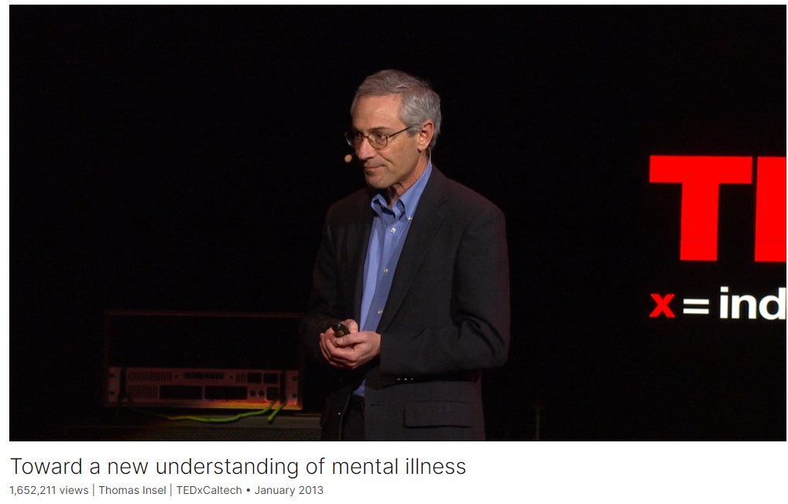
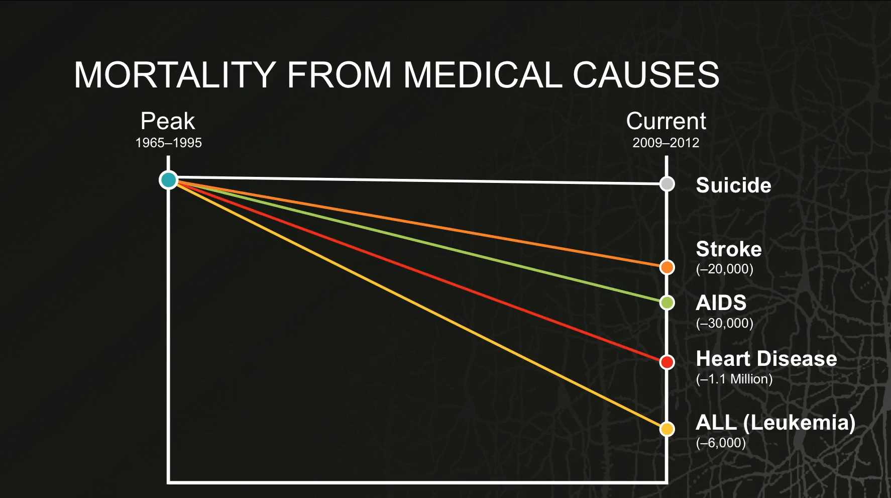
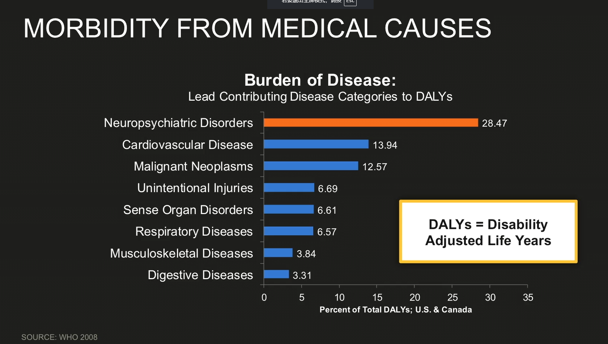
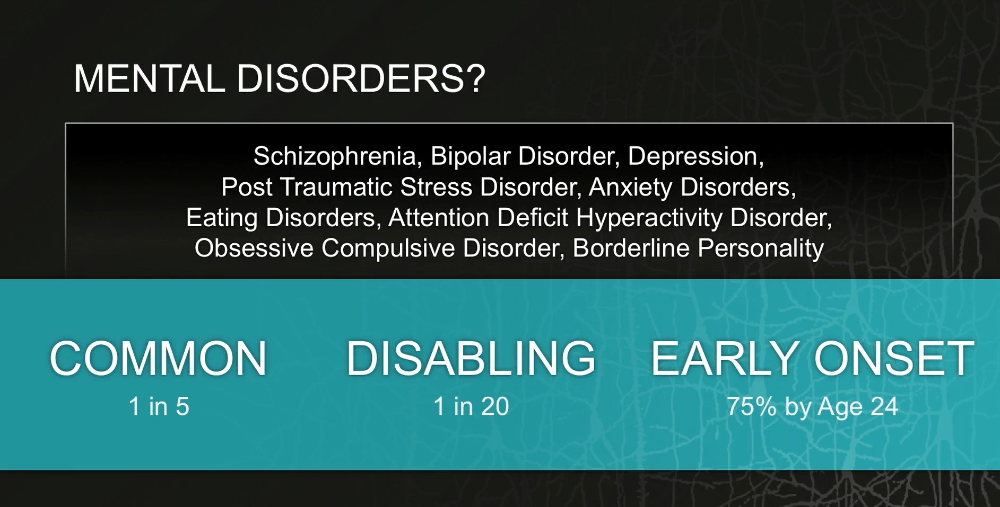
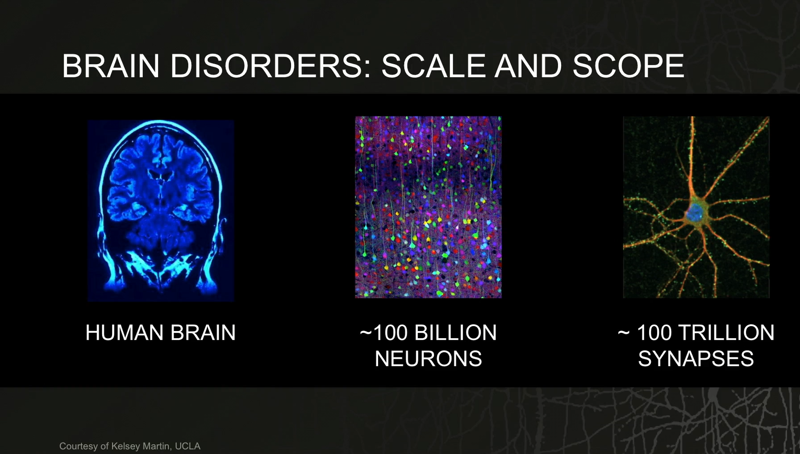
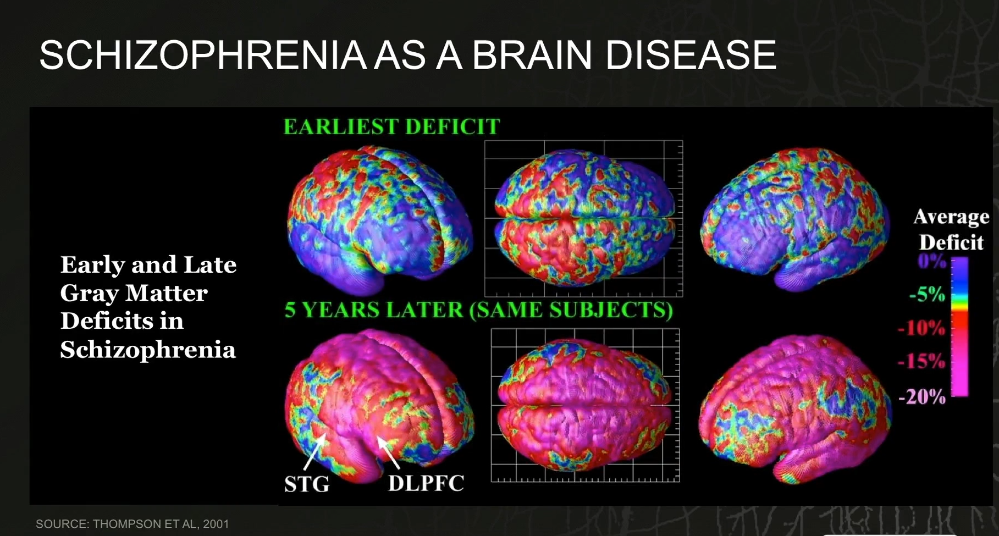
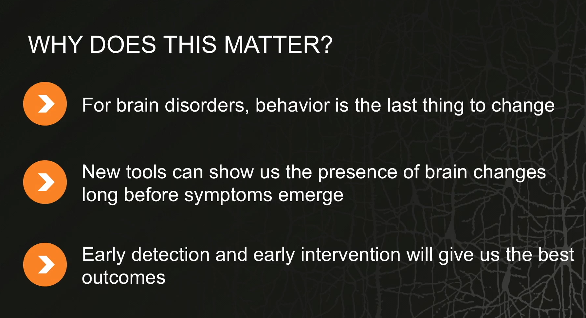

# Toward a new understanding of mental illness

Link: [https://www.ted.com/talks/thomas_insel_toward_a_new_understanding_of_mental_illness](https://www.ted.com/talks/thomas_insel_toward_a_new_understanding_of_mental_illness)

Speaker:  Thomas Insel 

Date: January 2013

@[toc]

## Introduction

Today, thanks to better early detection, there are 63% fewer deaths from heart disease than there were just a few decades ago. Thomas Insel, the director of the National Institute of Mental Health, wonders: Could we do the same for depression and schizophrenia? The first step in this new avenue of research, he says, is a crucial reframing: for us to stop thinking about "mental disorders" and start understanding them as "brain disorders."

如今，得益于更好的早期发现，死于心脏病的人数比几十年前减少了 63%。美国国家心理健康研究所所长托马斯-因塞尔不禁要问：我们能否对抑郁症和精神分裂症也采取同样的措施呢？他说，这一新的研究方向的第一步是一个关键的重新构架：让我们停止思考 "心理障碍"，开始把它们理解为 "大脑障碍"。

## Vocabulary

leukemia: 美 [luˈkimiə]  白血病

acute lymphoblastic leukemia：急性淋巴细胞白血病

mortality：美 [mɔːrˈtæləti] 死亡；死亡率

mortality rate：致死率

boil down to: 归结为；将…归结为

intervene: 美 [ˌɪntərˈviːn] 干预 **注意发音**

Remarkable stories, good-news stories, all of which boil down to understanding something about the diseases that has allowed us to detect early and intervene early. 引人注目的故事，好消息的故事，所有这些都归结于对疾病的了解，这使我们能够早期发现和早期干预。

fatality：死亡；死亡事件

traffic fatalities 交通死亡人数

depression：抑郁症

bipolar disorder：双相障碍

mental illness：心理疾病

schizophrenia：美 [ˌskɪtsəˈfriːniə] 精神分裂症；人格分裂 **注意发音**

anorexia：美 [ˌænəˈrɛksiə] 厌食；神经性厌食症

 90 percent of suicides are related to a mental illness: depression, bipolar disorder, schizophrenia, anorexia, borderline personality. 90%的自杀与精神疾病有关:抑郁症、躁郁症、精神分裂症、厌食症、边缘型人格。

obsessive compulsive disorder 强迫症

post-traumatic stress disorder创伤后应激障碍

morbidity： 美 [mɔ'bɪdətɪ] 发病率

neuropsychiatric：美 [njuərəʊsaɪ'kɪætrɪk] 神经精神病学的

syndrome：美 [ˈsɪndroʊm] 综合病征；

neuropsychiatric syndromes 神经精神综合征

hypertension ：高血压

confession：美 [kənˈfeʃn] 坦白；认错；忏悔

and in a sense this is a kind of confession for me. 从某种意义上说，这是对我的一种忏悔。

impediment：美 [ɪmˈpedɪmənt] 障碍；阻碍

are actually now impediments to progress, 实际上是进步的阻碍

anything but：远非，绝不

simplistic：美 [sɪmˈplɪstɪk] 过分简单的

reductionistic:[rɪˌdʌkʃəˈnɪstɪk] 还原论的

When we talk about the brain, it is anything but unidimensional or simplistic or reductionistic. 

翻译：当我们谈论大脑时，它绝不是单一维度、简单或还原论的。说明：“reductionistic”这个单词的意思是“还原论的”，指的是一种观点或方法，即通过将复杂的系统或现象分解为其更简单的基本成分来理解它。

synapse：美 [ˈsɪnˌæps] 突触

cortex：美 [ˈkɔːrteks] 皮质；皮层

the 100 billion neurons that are in the cortex or the 100 trillion synapses that make up all the connections. 大脑皮层中的1000亿个神经元或构成所有连接的100万亿个突触。

cruel：残酷的

It's actually a kind of cruel trick of evolution that we simply don't have a brain that seems to be wired well enough to understand itself. 这实际上是一种残酷的进化把戏，我们只是没有一个似乎足够好地理解自身的大脑。

myocardial：美 [,maɪə'kɑrdɪəl]  心肌的

infarction：美 [ɪnˈfɑrkʃən] 梗塞；梗死

myocardial infarction 心肌梗死

arrhythmia：美 [eɪˈrɪðmiə]  心律不齐

lesion：美 [ˈliːʒn]  损伤，病变

dorsolateral：美 [ˌdɔrsoʊˈlædərəl] 背外侧的

prefrontal cortex：前额叶皮层

temporal：美 [ˈtempərəl] 颞的；颞部的；

gyrus：美 [ˈdʒaɪrəs] 脑回

superior temporal gyrus：颞上回

gray matter：灰质

you can see that, particularly in areas like the dorsolateral prefrontal cortex or the superior temporal gyrus, there's a profound loss of gray matter. 你可以看到，特别是在背外侧前额叶皮层或颞上回等区域，灰质严重缺失。

delusion：美 [dɪˈluːʒn] 错觉；妄想

they have the behavioral symptoms of hallucinations and delusions. 他们有幻觉和妄想的行为症状。

## Summary

In this TED talk, the speaker highlights significant advancements in biomedical research, emphasizing notable improvements in survival rates for diseases like acute lymphoblastic leukemia, heart disease, and HIV/AIDS. These successes are attributed to early detection and intervention, resulting in dramatically lower mortality rates and increased life expectancy for many patients. For instance, the mortality rate for childhood leukemia has dropped by 85%, and heart disease deaths have decreased by 63%, illustrating the profound impact of medical progress.

However, the speaker contrasts these successes with the ongoing challenge of suicide and mental disorders, which continue to cause significant morbidity and mortality, particularly among young people. Mental illnesses, including depression, bipolar disorder, and schizophrenia, often begin early in life and lead to substantial disability. The speaker highlights the need for a shift in how we understand these disorders, proposing that we view them as brain disorders rather than behavioral or mind disorders. This perspective can potentially lead to earlier detection and more effective interventions.

The speaker concludes by emphasizing the importance of rethinking our approach to mental health, drawing parallels with other medical successes achieved through early detection and intervention. While acknowledging that we are not yet fully equipped to implement this new understanding, the speaker is optimistic about the future. By focusing on brain changes before behavioral symptoms emerge, there is potential to significantly improve outcomes for individuals with mental disorders. The talk ends with a quote from Bill Gates, underscoring the potential for transformative change over the next decade.

在这次TED演讲中，演讲者突出了生物医学研究的重要进展，特别是急性淋巴细胞白血病、心脏病和HIV/AIDS等疾病的显著改善。这些成功归因于早期检测和干预，使得许多患者的死亡率大大降低，寿命显著延长。例如，儿童白血病的死亡率下降了85%，心脏病的死亡率减少了63%，这些例子展示了医学进步的深远影响。

然而，演讲者对比了这些成功与自杀和精神疾病所带来的持续挑战，特别是在年轻人中，这些问题仍然导致了大量的发病率和死亡率。精神疾病，如抑郁症、双相情感障碍和精神分裂症，往往在早期就开始发作，导致了严重的残疾。演讲者强调需要改变我们对这些疾病的理解，提出应将其视为脑部疾病，而非行为或心理疾病。这一视角可能会带来更早的检测和更有效的干预措施。

演讲者总结时强调重新思考我们对精神健康的处理方法的重要性，并将其与其他通过早期检测和干预取得的医学成功进行了比较。尽管承认我们目前还没有完全准备好实施这一新理解，演讲者对未来充满乐观。通过在行为症状出现之前关注脑部变化，有可能显著改善精神疾病患者的预后。演讲以比尔·盖茨的一句名言结束，强调了未来十年内可能发生的变革性变化。

## Transcript

So let's start with some good news,

and the good news has to do with what do we know

based on biomedical research

that actually has changed the outcomes

for many very serious diseases?

Let's start with leukemia,

acute lymphoblastic leukemia, ALL,

the most common cancer of children.

When I was a student,

the mortality rate was about 95 percent.

Today, some 25, 30 years later, we're talking about

a mortality rate that's reduced by 85 percent.

Six thousand children each year

who would have previously died of this disease are cured.

If you want the really big numbers,

look at these numbers for heart disease.

Heart disease used to be the biggest killer,

particularly for men in their 40s.

Today, we've seen a 63-percent reduction in mortality

from heart disease --

remarkably, 1.1 million deaths averted every year.

AIDS, incredibly, has just been named,

in the past month, a chronic disease,

meaning that a 20-year-old who becomes infected with HIV

is expected not to live weeks, months, or a couple of years,

as we said only a decade ago,

but is thought to live decades,

probably to die in his '60s or '70s from other causes altogether.

These are just remarkable, remarkable changes

in the outlook for some of the biggest killers.

And one in particular

that you probably wouldn't know about, stroke,

which has been, along with heart disease,

one of the biggest killers in this country,

is a disease in which now we know

that if you can get people into the emergency room

within three hours of the onset,

some 30 percent of them will be able to leave the hospital

without any disability whatsoever.

Remarkable stories,

good-news stories,

all of which boil down to understanding

something about the diseases that has allowed us

to detect early and intervene early.

Early detection, early intervention,

that's the story for these successes.

Unfortunately, the news is not all good.

Let's talk about one other story

which has to do with suicide.

Now this is, of course, not a disease, per se.

It's a condition, or it's a situation

that leads to mortality.

What you may not realize is just how prevalent it is.

There are 38,000 suicides each year in the United States.

That means one about every 15 minutes.

Third most common cause of death amongst people

between the ages of 15 and 25.

It's kind of an extraordinary story when you realize

that this is twice as common as homicide

and actually more common as a source of death

than traffic fatalities in this country.

Now, when we talk about suicide,

there is also a medical contribution here,

because 90 percent of suicides

are related to a mental illness:

depression, bipolar disorder, schizophrenia,

anorexia, borderline personality. There's a long list

of disorders that contribute,

and as I mentioned before, often early in life.

But it's not just the mortality from these disorders.

It's also morbidity.

If you look at disability,

as measured by the World Health Organization

with something they call the Disability Adjusted Life Years,

it's kind of a metric that nobody would think of

except an economist,

except it's one way of trying to capture what is lost

in terms of disability from medical causes,

and as you can see, virtually 30 percent

of all disability from all medical causes

can be attributed to mental disorders,

neuropsychiatric syndromes.

You're probably thinking that doesn't make any sense.

I mean, cancer seems far more serious.

Heart disease seems far more serious.

But you can see actually they are further down this list,

and that's because we're talking here about disability.

What drives the disability for these disorders

like schizophrenia and bipolar and depression?

Why are they number one here?

Well, there are probably three reasons.

One is that they're highly prevalent.

About one in five people will suffer from one of these disorders

in the course of their lifetime.

A second, of course, is that, for some people,

these become truly disabling,

and it's about four to five percent, perhaps one in 20.

But what really drives these numbers, this high morbidity,

and to some extent the high mortality,

is the fact that these start very early in life.

Fifty percent will have onset by age 14,

75 percent by age 24,

a picture that is very different than what one would see

if you're talking about cancer or heart disease,

diabetes, hypertension -- most of the major illnesses

that we think about as being sources of morbidity and mortality.

These are, indeed, the chronic disorders of young people.

Now, I started by telling you that there were some good-news stories.

This is obviously not one of them.

This is the part of it that is perhaps most difficult,

and in a sense this is a kind of confession for me.

My job is to actually make sure that we make progress

on all of these disorders.

I work for the federal government.

Actually, I work for you. You pay my salary.

And maybe at this point, when you know what I do,

or maybe what I've failed to do,

you'll think that I probably ought to be fired,

and I could certainly understand that.

But what I want to suggest, and the reason I'm here

is to tell you that I think we're about to be

in a very different world as we think about these illnesses.

What I've been talking to you about so far is mental disorders,

diseases of the mind.

That's actually becoming a rather unpopular term these days,

and people feel that, for whatever reason,

it's politically better to use the term behavioral disorders

and to talk about these as disorders of behavior.

Fair enough. They are disorders of behavior,

and they are disorders of the mind.

But what I want to suggest to you

is that both of those terms,

which have been in play for a century or more,

are actually now impediments to progress,

that what we need conceptually to make progress here

is to rethink these disorders as brain disorders.

Now, for some of you, you're going to say,

"Oh my goodness, here we go again.

We're going to hear about a biochemical imbalance

or we're going to hear about drugs

or we're going to hear about some very simplistic notion

that will take our subjective experience

and turn it into molecules, or maybe into some sort of

very flat, unidimensional understanding

of what it is to have depression or schizophrenia.

When we talk about the brain, it is anything but

unidimensional or simplistic or reductionistic.

It depends, of course, on what scale

or what scope you want to think about,

but this is an organ of surreal complexity,

and we are just beginning to understand

how to even study it, whether you're thinking about

the 100 billion neurons that are in the cortex

or the 100 trillion synapses

that make up all the connections.

We have just begun to try to figure out

how do we take this very complex machine

that does extraordinary kinds of information processing

and use our own minds to understand

this very complex brain that supports our own minds.

It's actually a kind of cruel trick of evolution

that we simply don't have a brain

that seems to be wired well enough to understand itself.

In a sense, it actually makes you feel that

when you're in the safe zone of studying behavior or cognition,

something you can observe,

that in a way feels more simplistic and reductionistic

than trying to engage this very complex, mysterious organ

that we're beginning to try to understand.

Now, already in the case of the brain disorders

that I've been talking to you about,

depression, obsessive compulsive disorder,

post-traumatic stress disorder,

while we don't have an in-depth understanding

of how they are abnormally processed

or what the brain is doing in these illnesses,

we have been able to already identify

some of the connectional differences, or some of the ways

in which the circuitry is different

for people who have these disorders.

We call this the human connectome,

and you can think about the connectome

sort of as the wiring diagram of the brain.

You'll hear more about this in a few minutes.

The important piece here is that as you begin to look

at people who have these disorders, the one in five of us

who struggle in some way,

you find that there's a lot of variation

in the way that the brain is wired,

but there are some predictable patterns, and those patterns

are risk factors for developing one of these disorders.

It's a little different than the way we think about brain disorders

like Huntington's or Parkinson's or Alzheimer's disease

where you have a bombed-out part of your cortex.

Here we're talking about traffic jams, or sometimes detours,

or sometimes problems with just the way that things are connected

and the way that the brain functions.

You could, if you want, compare this to,

on the one hand, a myocardial infarction, a heart attack,

where you have dead tissue in the heart,

versus an arrhythmia, where the organ simply isn't functioning

because of the communication problems within it.

Either one would kill you; in only one of them

will you find a major lesion.

As we think about this, probably it's better to actually go

a little deeper into one particular disorder, and that would be schizophrenia,

because I think that's a good case

for helping to understand why thinking of this as a brain disorder matters.

These are scans from Judy Rapoport and her colleagues

at the National Institute of Mental Health

in which they studied children with very early onset schizophrenia,

and you can see already in the top

there's areas that are red or orange, yellow,

are places where there's less gray matter,

and as they followed them over five years,

comparing them to age match controls,

you can see that, particularly in areas like

the dorsolateral prefrontal cortex

or the superior temporal gyrus, there's a profound loss of gray matter.

And it's important, if you try to model this,

you can think about normal development

as a loss of cortical mass, loss of cortical gray matter,

and what's happening in schizophrenia is that you overshoot that mark,

and at some point, when you overshoot,

you cross a threshold, and it's that threshold

where we say, this is a person who has this disease,

because they have the behavioral symptoms

of hallucinations and delusions.

That's something we can observe.

But look at this closely and you can see that actually they've crossed a different threshold.

They've crossed a brain threshold much earlier,

that perhaps not at age 22 or 20,

but even by age 15 or 16 you can begin to see

the trajectory for development is quite different

at the level of the brain, not at the level of behavior.

Why does this matter? Well first because,

for brain disorders, behavior is the last thing to change.

We know that for Alzheimer's, for Parkinson's, for Huntington's.

There are changes in the brain a decade or more

before you see the first signs of a behavioral change.

The tools that we have now allow us to detect

these brain changes much earlier, long before the symptoms emerge.

But most important, go back to where we started.

The good-news stories in medicine

are early detection, early intervention.

If we waited until the heart attack,

we would be sacrificing 1.1 million lives

every year in this country to heart disease.

That is precisely what we do today

when we decide that everybody with one of these brain disorders,

brain circuit disorders, has a behavioral disorder.

We wait until the behavior becomes manifest.

That's not early detection. That's not early intervention.

Now to be clear, we're not quite ready to do this.

We don't have all the facts. We don't actually even know

what the tools will be,

nor what to precisely look for in every case to be able

to get there before the behavior emerges as different.

But this tells us how we need to think about it,

and where we need to go.

Are we going to be there soon?

I think that this is something that will happen

over the course of the next few years, but I'd like to finish

with a quote about trying to predict how this will happen

by somebody who's thought a lot about changes

in concepts and changes in technology.

"We always overestimate the change that will occur

in the next two years and underestimate

the change that will occur in the next 10." -- Bill Gates.

Thanks very much.

(Applause)

## Afterword

2024年6月12日18点44分于上海。