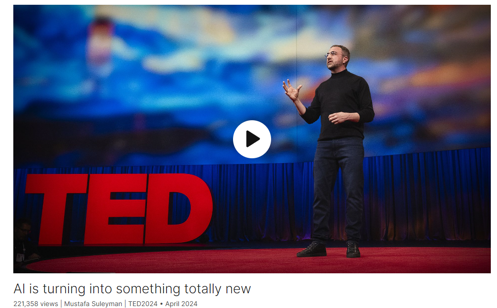

# What is an AI anyway?

Link: [https://www.ted.com/talks/mustafa_suleyman_what_is_an_ai_anyway?](https://www.ted.com/talks/mustafa_suleyman_what_is_an_ai_anyway?)

Speaker:  Mustafa Suleyman

>[Mustafa Suleyman](https://www.bloomberg.com/profile/person/21205126) is a serial tech entrepreneur. 
>
>He is the CEO of Microsoft AI, a new division bringing together Microsoft’s major consumer AI products and teams including Copilot, Bing and Edge. He is also an EVP in the company and sits on the senior leadership team.
>
>He was previously Co-Founder and CEO of Inflection AI, an AI studio redefining the relationship between humans and computers through its leading models like Inflection-2.5 and Pi, its first personal AI. Before that Mustafa worked at Google as VP of AI Products and AI Policy and Co-Founded DeepMind, which was bought by Google in 2014. Over his ten years at the company Mustafa led the applied research and commercialization efforts, helped establish DeepMind as the global leader in AI R&D and ethics, and contributed to numerous high impact [research publications](https://scholar.google.com/citations?hl=en&user=hkDGEVQAAAAJ).
>
>His *New York Times* and *Sunday Times* bestselling book[ ***The Coming Wave\***](https://www.the-coming-wave.com/)***: Technology, Power, and the Twenty-first Century's Greatest Dilemma\*** was published in September 2023, and has since been translated into 33 languages. The book explores the widespread impact of frontier technologies and Bill Gates described it as: “An excellent guide for navigating unprecedented times.”

Date: April 2024

@[toc]

## Introduction

When it comes to artificial intelligence, what are we actually creating? Even those closest to its development are struggling to describe exactly where things are headed, says Microsoft AI CEO Mustafa Suleyman, one of the primary architects of the AI models many of us use today. He offers an honest and compelling new vision for the future of AI, proposing an unignorable metaphor — a new digital species — to focus attention on this extraordinary moment.

说到人工智能，我们实际上在创造什么？微软人工智能首席执行官穆斯塔法·苏莱曼（Mustafa Suleyman）说，即使是那些最接近其发展的人也很难准确描述事物的发展方向。他是我们今天使用的人工智能模型的主要设计师之一。他为人工智能的未来提供了一个诚实而令人信服的新愿景，提出了一个不可忽视的比喻——一个新的数字物种——以将注意力集中在这个非凡的时刻。

## Vocabulary

fringe: 美 [frɪndʒ] 非主流的；边缘的；非传统的；

Back when I started, to describe it as fringe would be an understatement. 当我开始的时候，把它描述为边缘是一种保守的说法。

Because working on AI was seen as way too out there. 因为从事人工智能研究被认为太过遥远。

cold shoulder:闭门羹；冷遇；[口语]冷淡对待

artificial general intelligence, would get you some seriously strange looks and even a cold shoulder. 通用人工智能，会给你一些非常奇怪的眼神，甚至是冷淡。

diagnose：美 [ˌdaɪəɡˈnoʊs]  诊断（疾病）；

diagnosing diseases: 诊断疾病

apocalypse：美 [əˈpɑːkəlɪps] 世界末日；大动乱；大灾变；《启示录》

Are we headed for a mass misinformation apocalypse? 我们正在走向一场大规模误传启示录吗？

scrambled eggs：炒蛋；炒鸡蛋；

stump：美 [stʌmp] 使为难；把…难住；使困惑；

I was stumped. 我被难住了。

stock：陈腐的；老套的；

All my boring stock answers came rushing through my mind. 我所有无聊的老一套答案都在我脑海中闪过。

inflection point：转折点

It is clear that we are at an inflection point in the history of humanity. 很明显，我们正处于人类历史的转折点。

whilst：美 [waɪlst] 与xxx同时，在xxx的时候

if we’re to get the most out of AI whilst limiting its potential downsides. 如果我们要充分利用人工智能，同时限制其潜在的负面影响。

grapple：美 [ˈɡræpl]  格斗，摔跤，抓住

grapple with：应对；努力对付；努力应对

helping us to try to grapple with what this moment really is. 帮助我们努力理解这一刻到底是什么。

species：美 [ˈspiːʃiːz] 物种，**单复数同形**

a new digital species：一个新的数字物种

microscopic：美 [ˌmaɪkrəˈskɑːpɪk]  微小的；微观的；极小的

microscopic organism: 微生物

stretch back：追溯到，延伸到

From the very first microscopic organisms, life on Earth stretches back billions of years. 从最初的微生物开始，地球上的生命可以追溯到几十亿年前。

diversify：美 [daɪˈvɜːrsɪfaɪ] 多样化，不同

Over that time, life evolved and diversified. 随着时间的推移，生命进化并多样化了。

mesmerize：美 [ˈmɛzməˌraɪz]  使着迷；迷住；对…施催眠术

mesmerizing：美 ['mezməraɪzɪŋ] 把人迷住的

We went on to produce a mesmerizing variety of tools 我们继续开发各种令人着迷的工具

homo technologicus：科技智人

>Homo Technologicus refers to **a human being who has become inseparable from technology**, meaning human life and technology are intertwined. In this context, it is often used to refer to the modern era where technology and human society are intertwined and can not be separated.

These waves of history are clearly speeding up, as each one is amplified and accelerated by the last. 这些历史浪潮显然正在加速，因为每一个都被上一个放大和加速。

intertwine: 美 [ˌɪntərˈtwaɪn] 缠结；缠绕；紧密联结；

The journeys of humanity and technology are now deeply intertwined. 人类和技术的旅程现在深深地交织在一起。

拓展了想象力：stretch the imagination

And yet AI now feels like an endless river of creativity, making poetry and images and music and video that stretch the imagination. 然而，人工智能现在感觉像是一条无尽的创造力之河，创造了诗歌、图像、音乐和视频，拓展了想象力。

turbocharged：美 [tɝbotʃɑrdʒɚ]  用涡轮给增压

spiraling： [ˈspaiərəlɪŋ] 盘旋的；螺旋形的

And all of this is turbocharged by spiraling exponentials of data and computation. 所有这些都受到数据和计算的螺旋式指数的推动。

That's nine orders of magnitude more computation. 这要多9个数量级的计算。

tens of millions of ：数千万

arc：弧

The long arc of technological history is now in an extraordinary new phase. 漫长的技术历史现在正处于一个非同寻常的新阶段。

usher：美 [ˈʌʃər] 引领，开创，使开始

usher in：引领，迎来

the cloud-based supercomputer is ushering in a new era of ubiquitous AIs. 基于云的超级计算机将迎来无处不在的人工智能的新时代。

infinitely：美 [ˈɪnfɪnətli] 无限的，**注意发音**

And these AIs will be infinitely knowledgeable, and soon they'll be factually accurate and reliable. 这些人工智能将会拥有无限的知识，很快它们将会是事实上准确可靠的。

persona：美 [pərˈsoʊnə]   **注意发音** 表面形象；伪装人格；人物；角色

mechanistic：美 [ˌmɛkəˈnɪstɪk]  机械的

companions：美 [kəmˈpænjənz] 同伴

confidant：美 [ˈkɑːnfɪdænt]  密友，知己

And these won't just be mechanistic assistants. They'll be companions, confidants, colleagues, friends and partners, as varied and unique as we all are. 这些不仅仅是机械助手。他们将会是同伴、知己、同事、朋友和伙伴，就像我们所有人一样多样而独特。

intimate：美 [ˈɪntɪmət ] 熟悉的；亲密的；亲切的；

At this point, AIs will convincingly imitate humans at most tasks. And we'll feel this at the most intimate of scales. 在这一点上，人工智能将在大多数任务中令人信服地模仿人类。我们会在最接近的尺度上感受到这一点。

get-together:非正式聚会

An AI organizing a community get-together for an elderly neighbor. 一个人工智能为一位年长的邻居组织了一次社区聚会。

A sympathetic expert helping you make sense of a difficult diagnosis. 一个富有同情心的专家帮助你理解一个困难的诊断。

So to contain this wave, to put human agency at its center and to mitigate the inevitable unintended consequences that are likely to arise, we should start to think about them as we might a new kind of digital species. 因此，为了遏制这一浪潮，将人类的能动性置于其中心，并减轻可能出现的不可避免的意外后果，我们应该开始像看待一种新的数字物种一样看待它们。

rudimentary: 美 [ˌruːdɪˈmentri] 基本的，初步的

They can even reason to some extent and formulate rudimentary plans. They can act autonomously if we allow them. And they do all this at levels of sophistication that is far beyond anything that we've ever known from a mere tool. 他们甚至可以在一定程度上进行推理，并制定基本计划。如果我们允许，他们可以自主行动。他们做这些事情的复杂程度远远超过了我们所知道的仅仅是工具的复杂程度。

arresting：显著的；引人注目的

this is a super arresting thought： 这是一个超级吸引人的想法

shied：美 [ʃaɪd] . 惊退；畏缩；投掷；扔；（shy的过去式和过去分词）

shy away from：回避，躲开

Over the years, I've never shied away from highlighting risks and talking about downsides. 多年来，我从未回避强调风险和谈论负面影响。

open up new frontiers：开辟了新领域

In the past, unlocking economic growth often came with huge downsides. The economy expanded as people discovered new continents and opened up new frontiers. But they colonized populations at the same time. We built factories, but they were grim and dangerous places to work. We struck oil, but we polluted the planet. 过去，释放经济增长往往伴随着巨大的负面影响。随着人们发现新大陆和开辟新领域，经济得到了发展。但他们同时也在殖民人口。我们建造了工厂，但它们是严酷而危险的工作场所。我们开采了石油，但是我们污染了地球。

plunder：美 [ˈplʌndər]  抢劫，掠夺

And today, we're not discovering a new continent and plundering its resources. 今天，我们没有发现新大陆并掠夺其资源。

surreal：美 [səˈriːəl]  超现实主义的；离奇的， 不现实的

To be quite honest, it's pretty surreal.

glacial：美 [ˈɡleɪʃəl] 冰河的，冰川的

But step back, see it on the long view of glacial time, and these really are the very most appropriate metaphors that we have today. 但是退一步，从冰川时间的长远角度来看，这些确实是我们今天最合适的比喻。

## Summary

Here's a summary of the CEO's speech in three parts:

1. **Evolution of AI Perception and Impact**:
   The CEO reflects on the evolution of AI perception over the past 15 years, highlighting its transformation from a fringe concept to a powerful force with significant implications for humanity. Initially dismissed as science fiction, AI has rapidly advanced, surpassing human capabilities in various tasks such as image recognition, language translation, and medical diagnosis. As AI's potential impact becomes increasingly apparent, society grapples with tough questions about its role in addressing global challenges, ensuring ethical use, and navigating geopolitical implications.

2. **Conceptualizing AI as a Digital Species**:
   The CEO proposes a new metaphor to conceptualize AI, suggesting that it should be viewed as a new digital species rather than mere tools. Drawing parallels to the evolution of life on Earth and the development of technology, he argues that AIs possess qualities that transcend traditional tools, such as language comprehension, creativity, and autonomy. By framing AI as a digital species, he emphasizes the need for careful consideration of its implications, including ethical concerns and societal impact.

3. **Embracing AI's Potential and Responsibility**:
   The CEO concludes by urging the audience to embrace AI's potential while acknowledging the need for responsible development and deployment. He compares AI to nuclear fusion, describing it as a limitless and world-changing force. Despite the excitement and promise of AI, he emphasizes the importance of ethical reflection and creative thinking to harness its benefits while mitigating risks. Ultimately, he believes that AI represents both a challenge and an opportunity for humanity, requiring us to reflect and uphold the best aspects of our humanity as we shape its future.

About the Q&A:

Chris Anderson expresses appreciation for Mustafa's insightful vision and metaphor of AI as a new digital species. He acknowledges Mustafa's influential role in the AI field, particularly with the resources available at OpenAI. Anderson highlights Mustafa's book, which balances an optimistic vision of AI with awareness of its dangers. He then asks Mustafa what concerns him the most, to which Mustafa responds with the concept of the "pessimism aversion trap," emphasizing the importance of confronting potential dark scenarios to fully understand AI's benefits and risks. Mustafa identifies autonomy and recursive self-improvement as specific capabilities that could pose risks in the future and stresses the need to address these concerns now.

Anderson raises the issue of unintended consequences and the rapid replication potential of a digital species like AI, expressing concern about the possibility of problems arising quickly. Mustafa refutes the notion of an "intelligence explosion," emphasizing that there is no evidence to suggest such a scenario. He urges careful language choice and emphasizes the importance of deliberate design choices to mitigate risks associated with AI's capabilities, particularly regarding self-replication.

Finally, Anderson commends Mustafa's vision of humanity injecting the best parts of itself into AI while avoiding negative tendencies. He finds Mustafa's vision inspiring and expresses gratitude for sharing it at TED.

## Transcript

I want to tell you what I see coming.

I've been lucky enough to be working
on AI for almost 15 years now.

Back when I started, to describe it
as fringe would be an understatement.

Researchers would say, “No, no,
we’re only working on machine learning.”

Because working on AI
was seen as way too out there.

In 2010, just the very mention
of the phrase “AGI,”

artificial general intelligence,

would get you some seriously strange looks

and even a cold shoulder.

"You're actually building AGI?"
people would say.

"Isn't that something
out of science fiction?"

People thought it was 50 years
away or 100 years away,

if it was even possible at all.

Talk of AI was, I guess,
kind of embarrassing.

People generally thought we were weird.

And I guess in some ways we kind of were.

It wasn't long, though,
before AI started beating humans

at a whole range of tasks

that people previously thought
were way out of reach.

Understanding images,

translating languages,

transcribing speech,

playing Go and chess

and even diagnosing diseases.

People started waking up to the fact

that AI was going to have
an enormous impact,

and they were rightly asking
technologists like me

some pretty tough questions.

Is it true that AI is going
to solve the climate crisis?

Will it make personalized education
available to everyone?

Does it mean we'll all get
universal basic income

and we won't have to work anymore?

Should I be afraid?

What does it mean for weapons and war?

And of course, will China win?

Are we in a race?

Are we headed for a mass
misinformation apocalypse?

All good questions.

But it was actually a simpler

and much more kind of fundamental
question that left me puzzled.

One that actually gets to the very
heart of my work every day.

One morning over breakfast,

my six-year-old nephew Caspian
was playing with Pi,

the AI I created
at my last company, Inflection.

With a mouthful of scrambled eggs,

he looked at me
plain in the face and said,

"But Mustafa, what is an AI anyway?"

He's such a sincere and curious
and optimistic little guy.

He'd been talking to Pi about how cool
it would be if one day in the future,

he could visit dinosaurs at the zoo.

And how he could make infinite
amounts of chocolate at home.

And why Pi couldn’t yet play I Spy.

"Well," I said, "it's a clever
piece of software

that's read most of the text
on the open internet,

and it can talk to you
about anything you want."

"Right.

So like a person then?"

I was stumped.

Genuinely left scratching my head.

All my boring stock answers
came rushing through my mind.

"No, but AI is just another
general-purpose technology,

like printing or steam."

It will be a tool that will augment us

and make us smarter and more productive.

And when it gets better over time,

it'll be like an all-knowing oracle

that will help us solve
grand scientific challenges."

You know, all of these responses
started to feel, I guess,

a little bit defensive.

And actually better suited
to a policy seminar

than breakfast with
a no-nonsense six-year-old.

"Why am I hesitating?"
I thought to myself.

You know, let's be honest.

My nephew was asking me a simple question

that those of us in AI
just don't confront often enough.

What is it that we are actually creating?

What does it mean to make
something totally new,

fundamentally different to any invention
that we have known before?

It is clear that we are
at an inflection point

in the history of humanity.

On our current trajectory,

we're headed towards
the emergence of something

that we are all struggling to describe,

and yet we cannot control
what we don't understand.

And so the metaphors,

the mental models,

the names, these all matter

if we’re to get the most out of AI
whilst limiting its potential downsides.

As someone who embraces
the possibilities of this technology,

but who's also always cared
deeply about its ethics,

we should, I think,

be able to easily describe
what it is we are building.

And that includes the six-year-olds.

So it's in that spirit that I offer up
today the following metaphor

for helping us to try to grapple
with what this moment really is.

I think AI should best be understood

as something like a new digital species.

Now, don't take this too literally,

but I predict that we'll come to see them
as digital companions,

new partners in the journeys
of all our lives.

Whether you think we’re on a 10-,
20- or 30-year path here,

this is, in my view, the most accurate
and most fundamentally honest way

of describing what's actually coming.

And above all, it enables
everybody to prepare for

and shape what comes next.

Now I totally get, this is a strong claim,

and I'm going to explain to everyone
as best I can why I'm making it.

But first, let me just try
to set the context.

From the very first microscopic organisms,

life on Earth stretches back
billions of years.

Over that time,
life evolved and diversified.

Then a few million years ago,
something began to shift.

After countless cycles
of growth and adaptation,

one of life’s branches began using tools,
and that branch grew into us.

We went on to produce
a mesmerizing variety of tools,

at first slowly and then
with astonishing speed,

we went from stone axes and fire

to language, writing
and eventually industrial technologies.

One invention unleashed a thousand more.

And in time, we became homo technologicus.

Around 80 years ago,

another new branch of technology began.

With the invention of computers,

we quickly jumped from the first
mainframes and transistors

to today's smartphones
and virtual-reality headsets.

Information, knowledge,
communication, computation.

In this revolution,

creation has exploded like never before.

And now a new wave is upon us.

Artificial intelligence.

These waves of history
are clearly speeding up,

as each one is amplified
and accelerated by the last.

And if you look back,

it's clear that we are in the fastest

and most consequential wave ever.

The journeys of humanity and technology
are now deeply intertwined.

In just 18 months,

over a billion people have used
large language models.

We've witnessed one
landmark event after another.

Just a few years ago, people said
that AI would never be creative.

And yet AI now feels
like an endless river of creativity,

making poetry and images and music
and video that stretch the imagination.

People said it would never be empathetic.

And yet today, millions of people enjoy
meaningful conversations with AIs,

talking about their hopes and dreams

and helping them work through difficult
emotional challenges.

AIs can now drive cars,

manage energy grids

and even invent new molecules.

Just a few years ago,
each of these was impossible.

And all of this is turbocharged
by spiraling exponentials of data

and computation.

Last year, Inflection 2.5, our last model,

used five billion times more computation

than the DeepMind AI
that beat the old-school Atari games

just over 10 years ago.

That's nine orders of magnitude
more computation.

10x per year,

every year for almost a decade.

Over the same time,
the size of these models has grown

from first tens of millions of parameters
to then billions of parameters,

and very soon, tens
of trillions of parameters.

If someone did nothing but read
24 hours a day for their entire life,

they'd consume eight billion words.

And of course, that's a lot of words.

But today, the most advanced AIs
consume more than eight trillion words

in a single month of training.

And all of this is set to continue.

The long arc of technological history
is now in an extraordinary new phase.

So what does this mean in practice?

Well, just as the internet
gave us the browser

and the smartphone gave us apps,

the cloud-based supercomputer
is ushering in a new era

of ubiquitous AIs.

Everything will soon be represented
by a conversational interface.

Or, to put it another way, a personal AI.

And these AIs will be
infinitely knowledgeable,

and soon they'll be factually
accurate and reliable.

They'll have near-perfect IQ.

They’ll also have exceptional EQ.

They’ll be kind, supportive, empathetic.

These elements on their own
would be transformational.

Just imagine if everybody had
a personalized tutor in their pocket

and access to low-cost medical advice.

A lawyer and a doctor,

a business strategist and coach --

all in your pocket 24 hours a day.

But things really start to change
when they develop what I call AQ,

their “actions quotient.”

This is their ability
to actually get stuff done

in the digital and physical world.

And before long, it won't just be
people that have AIs.

Strange as it may sound,
every organization,

from small business to nonprofit
to national government,

each will have their own.

Every town, building and object

will be represented by a unique
interactive persona.

And these won't just be
mechanistic assistants.

They'll be companions, confidants,

colleagues, friends and partners,

as varied and unique as we all are.

At this point, AIs will convincingly
imitate humans at most tasks.

And we'll feel this
at the most intimate of scales.

An AI organizing a community get-together
for an elderly neighbor.

A sympathetic expert helping you
make sense of a difficult diagnosis.

But we'll also feel it
at the largest scales.

Accelerating scientific discovery,

autonomous cars on the roads,

drones in the skies.

They'll both order the takeout
and run the power station.

They’ll interact with us
and, of course, with each other.

They'll speak every language,

take in every pattern of sensor data,

sights, sounds,

streams and streams of information,

far surpassing what any one of us
could consume in a thousand lifetimes.

So what is this?

What are these AIs?

If we are to prioritize
safety above all else,

to ensure that this new wave always
serves and amplifies humanity,

then we need to find the right metaphors
for what this might become.

For years, we in the AI community,
and I specifically,

have had a tendency
to refer to this as just tools.

But that doesn't really capture
what's actually happening here.

AIs are clearly more dynamic,

more ambiguous, more integrated

and more emergent than mere tools,

which are entirely
subject to human control.

So to contain this wave,

to put human agency at its center

and to mitigate the inevitable
unintended consequences

that are likely to arise,

we should start to think about them
as we might a new kind of digital species.

Now it's just an analogy,

it's not a literal description,
and it's not perfect.

For a start, they clearly aren't
biological in any traditional sense,

but just pause for a moment

and really think
about what they already do.

They communicate in our languages.

They see what we see.

They consume unimaginably
large amounts of information.

They have memory.

They have personality.

They have creativity.

They can even reason to some extent
and formulate rudimentary plans.

They can act autonomously
if we allow them.

And they do all this
at levels of sophistication

that is far beyond anything
that we've ever known from a mere tool.

And so saying AI is mainly
about the math or the code

is like saying we humans
are mainly about carbon and water.

It's true, but it completely
misses the point.

And yes, I get it, this is
a super arresting thought

but I honestly think this frame helps
sharpen our focus on the critical issues.

What are the risks?

What are the boundaries
that we need to impose?

What kind of AI do we want
to build or allow to be built?

This is a story that's still unfolding.

Nothing should be accepted as a given.

We all must choose what we create.

What AIs we bring into the world, or not.

These are the questions
for all of us here today,

and all of us alive at this moment.

For me, the benefits of this technology
are stunningly obvious,

and they inspire my life's work
every single day.

But quite frankly,
they'll speak for themselves.

Over the years, I've never shied
away from highlighting risks

and talking about downsides.

Thinking in this way helps us focus
on the huge challenges

that lie ahead for all of us.

But let's be clear.

There is no path to progress

where we leave technology behind.

The prize for all
of civilization is immense.

We need solutions in health care
and education, to our climate crisis.

And if AI delivers just
a fraction of its potential,

the next decade is going to be
the most productive in human history.

Here's another way to think about it.

In the past,

unlocking economic growth
often came with huge downsides.

The economy expanded as people
discovered new continents

and opened up new frontiers.

But they colonized populations
at the same time.

We built factories,

but they were grim
and dangerous places to work.

We struck oil,

but we polluted the planet.

Now because we are still
designing and building AI,

we have the potential
and opportunity to do it better,

radically better.

And today, we're not
discovering a new continent

and plundering its resources.

We're building one from scratch.

Sometimes people say that data or chips
are the 21st century’s new oil,

but that's totally the wrong image.

AI is to the mind

what nuclear fusion is to energy.

Limitless, abundant,

world-changing.

And AI really is different,

and that means we have to think
about it creatively and honestly.

We have to push our analogies
and our metaphors

to the very limits

to be able to grapple with what's coming.

Because this is not just
another invention.

AI is itself an infinite inventor.

And yes, this is exciting
and promising and concerning

and intriguing all at once.

To be quite honest, it's pretty surreal.

But step back,

see it on the long view of glacial time,

and these really are the very most
appropriate metaphors that we have today.

Since the beginning of life on Earth,

we've been evolving, changing

and then creating everything
around us in our human world today.

And AI isn't something
outside of this story.

In fact, it's the very opposite.

It's the whole of everything
that we have created,

distilled down into something
that we can all interact with

and benefit from.

It's a reflection of humanity across time,

and in this sense,

it isn't a new species at all.

This is where the metaphors end.

Here's what I'll tell Caspian
next time he asks.

AI isn't separate.

AI isn't even in some senses, new.

AI is us.

It's all of us.

And this is perhaps the most promising
and vital thing of all

that even a six-year-old
can get a sense for.

As we build out AI,

we can and must reflect all that is good,

all that we love,

all that is special about humanity:

our empathy, our kindness,

our curiosity and our creativity.

This, I would argue, is the greatest
challenge of the 21st century,

but also the most wonderful,

inspiring and hopeful
opportunity for all of us.

Thank you.

(Applause)

## Q&A

Chris Anderson: Thank you Mustafa.

It's an amazing vision
and a super powerful metaphor.

You're in an amazing position right now.

I mean, you were connected at the hip

to the amazing work happening at OpenAI.

You’re going to have resources
made available,

there are reports of these giant
new data centers,

100 billion dollars
invested and so forth.

And a new species can emerge from it.

I mean, in your book,

you did, as well as painting
an incredible optimistic vision,

you were super eloquent
on the dangers of AI.

And I'm just curious,
from the view that you have now,

what is it that most
keeps you up at night?

Mustafa Suleyman: I think the great risk
is that we get stuck

in what I call the
pessimism aversion trap.

You know, we have to have
the courage to confront

the potential of dark scenarios

in order to get the most out of all
the benefits that we see.

So the good news is that if you look
at the last two or three years,

there have been very,
very few downsides, right?

It’s very hard to say explicitly
what harm an LLM has caused.

But that doesn’t mean that that’s what
the trajectory is going to be

over the next 10 years.

So I think if you pay attention
to a few specific capabilities,

take for example, autonomy.

Autonomy is very obviously a threshold

over which we increase
risk in our society.

And it's something that we should
step towards very, very closely.

The other would be something like
recursive self-improvement.

If you allow the model
to independently self-improve,

update its own code,

explore an environment
without oversight, and, you know,

without a human in control
to change how it operates,

that would obviously be more dangerous.

But I think that we're still
some way away from that.

I think it's still a good five to 10 years
before we have to really confront that.

But it's time to start
talking about it now.

CA: A digital species,
unlike any biological species,

can replicate not in nine months,

but in nine nanoseconds,

and produce an indefinite
number of copies of itself,

all of which have more power
than we have in many ways.

I mean, the possibility for unintended
consequences seems pretty immense.

And isn't it true
that if a problem happens,

it could happen in an hour?

MS: No.

That is really not true.

I think there's no evidence
to suggest that.

And I think that, you know,

that’s often referred to
as the “intelligence explosion.”

And I think it is a theoretical,
hypothetical maybe

that we're all kind of curious to explore,

but there's no evidence that we're
anywhere near anything like that.

And I think it's very important
that we choose our words super carefully.

Because you're right, that's one
of the weaknesses of the species framing,

that we will design the capability
for self-replication into it

if people choose to do that.

And I would actually argue
that we should not,

that would be one
of the dangerous capabilities

that we should step back from, right?

So there's no chance
that this will "emerge" accidentally.

I really think that's
a very low probability.

It will happen if engineers deliberately
design those capabilities in.

And if they don't take enough efforts
to deliberately design them out.

And so this is the point of being explicit

and transparent about trying to introduce
safety by design very early on.

CA: Thank you, your vision
of humanity injecting into this new thing

the best parts of ourselves,

avoiding all those weird,
biological, freaky,

horrible tendencies that we can
have in certain circumstances,

I mean, that is a very inspiring vision.

And thank you so much for coming here
and sharing it at TED.

Thank you, good luck.

(Applause)

## Afterword

2024年4月24日18点50分于上海。

