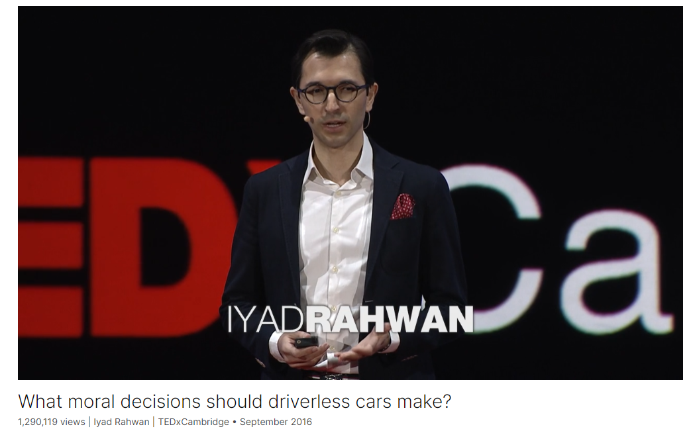

# What moral decisions should driverless cars make?

Link: [https://www.ted.com/talks/iyad_rahwan_what_moral_decisions_should_driverless_cars_make](https://www.ted.com/talks/iyad_rahwan_what_moral_decisions_should_driverless_cars_make)

Speaker:  Iyad Rahwan

Date: September 2016

@[toc]

## Introduction

Should your driverless car kill you if it means saving five pedestrians? In this primer on the social dilemmas of driverless cars, Iyad Rahwan explores how the technology will challenge our morality and explains his work collecting data from real people on the ethical trade-offs we're willing (and not willing) to make.

## Vocabulary

swerve: 美 [swɜːrv] 突然地改变方向

bystander: 旁观者

but the car may swerve, hitting one bystander, 但是汽车可能会突然转向，撞到一个旁观者

crash into：撞上，撞到xxx上

a bunch of：一群

it will crash into a bunch of pedestrians crossing the street它会撞上一群过马路的行人

the trolley problem：电车难题

>The trolley problem is a classic ethical dilemma in philosophy and ethics, often used to explore moral decision-making and the concept of utilitarianism. It presents a scenario where a person is faced with a moral choice that involves sacrificing one life to save others. The traditional setup involves a runaway trolley hurtling down a track towards a group of people who will be killed if it continues on its path. The person facing the dilemma has the option to divert the trolley onto a different track, where it will kill one person instead of the group.
>
>The ethical question at the heart of the trolley problem revolves around whether it is morally justifiable to actively intervene to sacrifice one life to save many others. Philosophers use variations of this scenario to explore different factors that may influence moral decision-making, such as the number of lives at stake, the role of intention, and the consequences of one's actions.
>
>The trolley problem has practical applications beyond philosophical thought experiments, particularly in fields like autonomous vehicle technology. Engineers and ethicists grapple with similar dilemmas when programming self-driving cars, where decisions must be made about how the vehicle should respond in potentially fatal situations.

trolley：美 [ˈtrɑːli] 乘电车；

utilitarian:美 [ˌjuːtɪlɪˈteriən]  有效用的；实用的；功利主义的

Bentham says the car should follow utilitarian ethics 汽车应该遵循功利主义伦理

take its course: 顺其自然， 完成自身的发展阶段

and you should let the car take its course even if that's going to harm more people 你应该让汽车顺其自然，即使这会伤害更多的人

pamphlet：美 [ˈpæmflət]  小册子

English economist William Forster Lloyd published a pamphlet 英国经济学家威廉·福斯特·劳埃德出版了一本小册子

graze：美 [ɡreɪz] 在田野里吃草

English farmers who are sharing a common land for their sheep to graze. 共享一片土地放羊的英国农民。

rejuvenate：美 [rɪˈdʒuːvəneɪt] 使感觉更年轻；使恢复青春活力；

the land will be rejuvenated 这片土地将重新焕发生机

detriment：美 [ˈdetrɪmənt]  伤害，损害

to the detriment of all the farmers, 对所有农民不利

the  tragedy of the commons 共用品悲剧

>The tragedy of the commons is a concept in economics and environmental science that refers to a situation where multiple individuals, acting independently and rationally in their own self-interest, deplete a shared limited resource, leading to its degradation or depletion. The term was popularized by the ecologist Garrett Hardin in a famous 1968 essay.
>
>The tragedy of the commons arises when individuals prioritize their own short-term gains over the long-term sustainability of the shared resource. Since no single individual bears the full cost of their actions, there is little incentive to conserve or manage the resource responsibly. Instead, each person maximizes their own benefit, leading to overexploitation or degradation of the resource, which ultimately harms everyone.
>
>Classic examples of the tragedy of the commons include overfishing in open-access fisheries, deforestation of public lands, and pollution of the air and water. In each case, individuals or groups exploit the resource without considering the negative consequences for others or the sustainability of the resource itself.
>
>Addressing the tragedy of the commons often requires collective action and the establishment of regulations, property rights, or other mechanisms to manage and protect the shared resource. By aligning individual incentives with the common good, it becomes possible to mitigate overuse and ensure the sustainable management of resources for the benefit of all.

insidious：美 [ɪnˈsɪdiəs] 潜伏的；隐患的

the problem may be a little bit more insidious because there is not necessarily an individual human being making those decisions. 这个问题可能更隐蔽一点，因为不一定会是人做出这些决定。

jaywalking： 走路不遵守交通规则， 擅自穿越马路

punish jaywalking：惩罚乱穿马路

zeroth：第零个

Asimov introduced the zeroth law which takes precedence above all, and it's that a robot may not harm humanity as a whole. 阿西莫夫提出了第零定律，该定律高于一切，即机器人不得伤害整个人类。

## Transcript

Today I'm going to talk
about technology and society.

The Department of Transport
estimated that last year

35,000 people died
from traffic crashes in the US alone.

Worldwide, 1.2 million people
die every year in traffic accidents.

If there was a way we could eliminate
90 percent of those accidents,

would you support it?

Of course you would.

This is what driverless car technology
promises to achieve

by eliminating the main
source of accidents --

human error.

Now picture yourself
in a driverless car in the year 2030,

sitting back and watching
this vintage TEDxCambridge video.

(Laughter)

All of a sudden,

the car experiences mechanical failure
and is unable to stop.

If the car continues,

it will crash into a bunch
of pedestrians crossing the street,

but the car may swerve,

hitting one bystander,

killing them to save the pedestrians.

What should the car do,
and who should decide?

What if instead the car
could swerve into a wall,

crashing and killing you, the passenger,

in order to save those pedestrians?

This scenario is inspired
by the trolley problem,

which was invented
by philosophers a few decades ago

to think about ethics.

Now, the way we think
about this problem matters.

We may for example
not think about it at all.

We may say this scenario is unrealistic,

incredibly unlikely, or just silly.

But I think this criticism
misses the point

because it takes
the scenario too literally.

Of course no accident
is going to look like this;

no accident has two or three options

where everybody dies somehow.

Instead, the car is going
to calculate something

like the probability of hitting
a certain group of people,

if you swerve one direction
versus another direction,

you might slightly increase the risk
to passengers or other drivers

versus pedestrians.

It's going to be
a more complex calculation,

but it's still going
to involve trade-offs,

and trade-offs often require ethics.

We might say then,
"Well, let's not worry about this.

Let's wait until technology
is fully ready and 100 percent safe."

Suppose that we can indeed
eliminate 90 percent of those accidents,

or even 99 percent in the next 10 years.

What if eliminating
the last one percent of accidents

requires 50 more years of research?

Should we not adopt the technology?

That's 60 million people
dead in car accidents

if we maintain the current rate.

So the point is,

waiting for full safety is also a choice,

and it also involves trade-offs.

People online on social media
have been coming up with all sorts of ways

to not think about this problem.

One person suggested
the car should just swerve somehow

in between the passengers --

(Laughter)

and the bystander.

Of course if that's what the car can do,
that's what the car should do.

We're interested in scenarios
in which this is not possible.

And my personal favorite
was a suggestion by a blogger

to have an eject button in the car
that you press --

(Laughter)

just before the car self-destructs.

(Laughter)

So if we acknowledge that cars
will have to make trade-offs on the road,

how do we think about those trade-offs,

and how do we decide?

Well, maybe we should run a survey
to find out what society wants,

because ultimately,

regulations and the law
are a reflection of societal values.

So this is what we did.

With my collaborators,

Jean-François Bonnefon and Azim Shariff,

we ran a survey

in which we presented people
with these types of scenarios.

We gave them two options
inspired by two philosophers:

Jeremy Bentham and Immanuel Kant.

Bentham says the car
should follow utilitarian ethics:

it should take the action
that will minimize total harm --

even if that action will kill a bystander

and even if that action
will kill the passenger.

Immanuel Kant says the car
should follow duty-bound principles,

like "Thou shalt not kill."

So you should not take an action
that explicitly harms a human being,

and you should let the car take its course

even if that's going to harm more people.

What do you think?

Bentham or Kant?

Here's what we found.

Most people sided with Bentham.

So it seems that people
want cars to be utilitarian,

minimize total harm,

and that's what we should all do.

Problem solved.

But there is a little catch.

When we asked people
whether they would purchase such cars,

they said, "Absolutely not."

(Laughter)

They would like to buy cars
that protect them at all costs,

but they want everybody else
to buy cars that minimize harm.

(Laughter)

We've seen this problem before.

It's called a social dilemma.

And to understand the social dilemma,

we have to go a little bit
back in history.

In the 1800s,

English economist William Forster Lloyd
published a pamphlet

which describes the following scenario.

You have a group of farmers --

English farmers --

who are sharing a common land
for their sheep to graze.

Now, if each farmer
brings a certain number of sheep --

let's say three sheep --

the land will be rejuvenated,

the farmers are happy,

the sheep are happy,

everything is good.

Now, if one farmer brings one extra sheep,

that farmer will do slightly better,
and no one else will be harmed.

But if every farmer made
that individually rational decision,

the land will be overrun,
and it will be depleted

to the detriment of all the farmers,

and of course,
to the detriment of the sheep.

We see this problem in many places:

in the difficulty of managing overfishing,

or in reducing carbon emissions
to mitigate climate change.

When it comes to the regulation
of driverless cars,

the common land now
is basically public safety --

that's the common good --

and the farmers are the passengers

or the car owners who are choosing
to ride in those cars.

And by making the individually
rational choice

of prioritizing their own safety,

they may collectively be
diminishing the common good,

which is minimizing total harm.

It's called the tragedy of the commons,

traditionally,

but I think in the case
of driverless cars,

the problem may be
a little bit more insidious

because there is not necessarily
an individual human being

making those decisions.

So car manufacturers
may simply program cars

that will maximize safety
for their clients,

and those cars may learn
automatically on their own

that doing so requires slightly
increasing risk for pedestrians.

So to use the sheep metaphor,

it's like we now have electric sheep
that have a mind of their own.

(Laughter)

And they may go and graze
even if the farmer doesn't know it.

So this is what we may call
the tragedy of the algorithmic commons,

and if offers new types of challenges.

Typically, traditionally,

we solve these types
of social dilemmas using regulation,

so either governments
or communities get together,

and they decide collectively
what kind of outcome they want

and what sort of constraints
on individual behavior

they need to implement.

And then using monitoring and enforcement,

they can make sure
that the public good is preserved.

So why don't we just,

as regulators,

require that all cars minimize harm?

After all, this is
what people say they want.

And more importantly,

I can be sure that as an individual,

if I buy a car that may
sacrifice me in a very rare case,

I'm not the only sucker doing that

while everybody else
enjoys unconditional protection.

In our survey, we did ask people
whether they would support regulation

and here's what we found.

First of all, people
said no to regulation;

and second, they said,

"Well if you regulate cars to do this
and to minimize total harm,

I will not buy those cars."

So ironically,

by regulating cars to minimize harm,

we may actually end up with more harm

because people may not
opt into the safer technology

even if it's much safer
than human drivers.

I don't have the final
answer to this riddle,

but I think as a starting point,

we need society to come together

to decide what trade-offs
we are comfortable with

and to come up with ways
in which we can enforce those trade-offs.

As a starting point,
my brilliant students,

Edmond Awad and Sohan Dsouza,

built the Moral Machine website,

which generates random scenarios at you --

basically a bunch
of random dilemmas in a sequence

where you have to choose what
the car should do in a given scenario.

And we vary the ages and even
the species of the different victims.

So far we've collected
over five million decisions

by over one million people worldwide

from the website.

And this is helping us
form an early picture

of what trade-offs
people are comfortable with

and what matters to them --

even across cultures.

But more importantly,

doing this exercise
is helping people recognize

the difficulty of making those choices

and that the regulators
are tasked with impossible choices.

And maybe this will help us as a society
understand the kinds of trade-offs

that will be implemented
ultimately in regulation.

And indeed, I was very happy to hear

that the first set of regulations

that came from
the Department of Transport --

announced last week --

included a 15-point checklist
for all carmakers to provide,

and number 14 was ethical consideration --

how are you going to deal with that.

We also have people
reflect on their own decisions

by giving them summaries
of what they chose.

I'll give you one example --

I'm just going to warn you
that this is not your typical example,

your typical user.

This is the most sacrificed and the most
saved character for this person.

(Laughter)

Some of you may agree with him,

or her, we don't know.

But this person also seems to slightly
prefer passengers over pedestrians

in their choices

and is very happy to punish jaywalking.

(Laughter)

So let's wrap up.

We started with the question --
let's call it the ethical dilemma --

of what the car should do
in a specific scenario:

swerve or stay?

But then we realized
that the problem was a different one.

It was the problem of how to get
society to agree on and enforce

the trade-offs they're comfortable with.

It's a social dilemma.

In the 1940s, Isaac Asimov
wrote his famous laws of robotics --

the three laws of robotics.

A robot may not harm a human being,

a robot may not disobey a human being,

and a robot may not allow
itself to come to harm --

in this order of importance.

But after 40 years or so

and after so many stories
pushing these laws to the limit,

Asimov introduced the zeroth law

which takes precedence above all,

and it's that a robot
may not harm humanity as a whole.

I don't know what this means
in the context of driverless cars

or any specific situation,

and I don't know how we can implement it,

but I think that by recognizing

that the regulation of driverless cars
is not only a technological problem

but also a societal cooperation problem,

I hope that we can at least begin
to ask the right questions.

Thank you.

(Applause)

## Summary

In Iyad Rahwan's TED Talk, he delves into the ethical dilemmas surrounding the advent of driverless car technology. He begins by highlighting the potential of this technology to significantly reduce traffic accidents caused by human error, thereby saving countless lives. However, he poses a thought-provoking scenario: if faced with a situation where a driverless car must choose between different courses of action, such as swerving to avoid pedestrians at the risk of harming the passenger, who should decide and how? Rahwan draws parallels to the classic philosophical trolley problem to illustrate the complex ethical considerations at play in programming autonomous vehicles.

Rahwan emphasizes the societal implications of adopting driverless car technology and the challenges it poses. He discusses the tension between individual preferences for safety and societal values, pointing out the paradox where individuals may support utilitarian ethics for autonomous vehicles while prioritizing their own safety when it comes to purchasing decisions. This dilemma reflects the classic tragedy of the commons, where individual rational choices may lead to suboptimal outcomes for society as a whole. Rahwan argues that addressing these challenges requires collective decision-making and regulation informed by societal values.

To explore societal values and preferences regarding the ethical dilemmas of driverless cars, Rahwan and his collaborators conducted surveys and developed the Moral Machine website. Through this platform, they collected data on people's choices in hypothetical scenarios, revealing diverse perspectives and priorities across cultures. Rahwan underscores the importance of understanding and reconciling these differences in shaping regulations for autonomous vehicles. He concludes by advocating for ongoing dialogue and cooperation to navigate the ethical complexities of driverless car technology, ultimately aiming to ensure that societal values are reflected in its implementation.

## 后记

