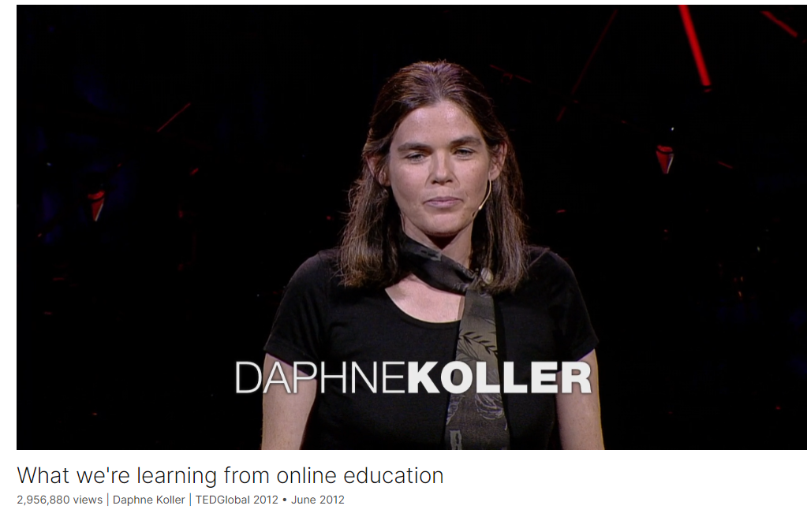

# What we're learning from online education

Link: [https://www.ted.com/talks/daphne_koller_what_we_re_learning_from_online_education](https://www.ted.com/talks/daphne_koller_what_we_re_learning_from_online_education)

Speaker:  Daphne Koller

Date: June 2012

@[toc]

## Introduction

Daphne Koller is enticing top universities to put their most intriguing courses online for free -- not just as a service, but as a way to research how people learn. With Coursera (cofounded by Andrew Ng), each keystroke, quiz, peer-to-peer discussion and self-graded assignment builds an unprecedented pool of data on how knowledge is processed.

## Vocabulary

readily：容易地；迅速地；无困难地

readily accessible: 易接近的

education is just not readily accessible. 教育并不容易获得。

apartheid：美 [əˈpɑːrteɪt] 种族隔离政策；分离；隔离 **注意发音** 

In South Africa, the educational system was constructed in the days of apartheid for the white minority. 在南非，教育体系是在种族隔离时期为少数白人建立的。

stampede：美 [stæmˈpiːd] 乱窜；蜂拥； **注意发音**

When the gates opened, there was a stampede, 当大门打开时，人们蜂拥而至

tuition：美 [tuˈɪʃn] 学费  **注意发音**

higher education tuition：高等教育学费

procrastination: 美 [prəˌkræstɪˈneɪʃn] 拖延；耽搁

These are the spikes showing that procrastination is global phenomenon. 这些峰值表明拖延是一种全球现象。

seasick:晕船的

testimonial：美 [ˌtɛstəˈmoʊniəl] 证明书；介绍信；推荐信；

curriculum：美 [kəˈrɪkjələm] 课程；教学大纲；课程设置；

## Transcript

Like many of you, I'm one of the lucky people.

I was born to a family where education was pervasive.

I'm a third-generation PhD, a daughter of two academics.

In my childhood, I played around in my father's university lab.

So it was taken for granted that I attend some of the best universities,

which in turn opened the door to a world of opportunity.

Unfortunately, most of the people in the world are not so lucky.

In some parts of the world, for example, South Africa,

education is just not readily accessible.

In South Africa, the educational system was constructed

in the days of apartheid for the white minority.

And as a consequence, today there is just not enough spots

for the many more people who want and deserve a high quality education.

That scarcity led to a crisis in January of this year

at the University of Johannesburg.

There were a handful of positions left open

from the standard admissions process, and the night before

they were supposed to open that for registration,

thousands of people lined up outside the gate in a line a mile long,

hoping to be first in line to get one of those positions.

When the gates opened, there was a stampede,

and 20 people were injured and one woman died.

She was a mother who gave her life

trying to get her son a chance at a better life.

But even in parts of the world like the United States

where education is available, it might not be within reach.

There has been much discussed in the last few years

about the rising cost of health care.

What might not be quite as obvious to people

is that during that same period the cost of higher education tuition

has been increasing at almost twice the rate,

for a total of 559 percent since 1985.

This makes education unaffordable for many people.

Finally, even for those who do manage to get the higher education,

the doors of opportunity might not open.

Only a little over half of recent college graduates

in the United States who get a higher education

actually are working in jobs that require that education.

This, of course, is not true for the students

who graduate from the top institutions,

but for many others, they do not get the value

for their time and their effort.

Tom Friedman, in his recent New York Times article,

captured, in the way that no one else could, the spirit behind our effort.

He said the big breakthroughs are what happen

when what is suddenly possible meets what is desperately necessary.

I've talked about what's desperately necessary.

Let's talk about what's suddenly possible.

What's suddenly possible was demonstrated by

three big Stanford classes,

each of which had an enrollment of 100,000 people or more.

So to understand this, let's look at one of those classes,

the Machine Learning class offered by my colleague

and cofounder Andrew Ng.

Andrew teaches one of the bigger Stanford classes.

It's a Machine Learning class,

and it has 400 people enrolled every time it's offered.

When Andrew taught the Machine Learning class to the general public,

it had 100,000 people registered.

So to put that number in perspective,

for Andrew to reach that same size audience

by teaching a Stanford class,

he would have to do that for 250 years.

Of course, he'd get really bored.

So, having seen the impact of this,

Andrew and I decided that we needed to really try and scale this up,

to bring the best quality education to as many people as we could.

So we formed Coursera,

whose goal is to take the best courses

from the best instructors at the best universities

and provide it to everyone around the world for free.

We currently have 43 courses on the platform

from four universities across a range of disciplines,

and let me show you a little bit of an overview

of what that looks like.

(Video) Robert Ghrist: Welcome to Calculus.

Ezekiel Emanuel: Fifty million people are uninsured.

Scott Page: Models help us design more effective institutions and policies.

We get unbelievable segregation.

Scott Klemmer: So Bush imagined that in the future,

you'd wear a camera right in the center of your head.

Mitchell Duneier: Mills wants the student of sociology to develop the quality of mind ...

RG: Hanging cable takes on the form of a hyperbolic cosine.

Nick Parlante: For each pixel in the image, set the red to zero.

Paul Offit: ... Vaccine allowed us to eliminate polio virus.

Dan Jurafsky: Does Lufthansa serve breakfast and San Jose? Well, that sounds funny.

Daphne Koller: So this is which coin you pick, and this is the two tosses.

Andrew Ng: So in large-scale machine learning, we'd like to come up with computational ...

(Applause)

DK: It turns out, maybe not surprisingly,

that students like getting the best content

from the best universities for free.

Since we opened the website in February,

we now have 640,000 students from 190 countries.

We have 1.5 million enrollments,

6 million quizzes in the 15 classes that have launched

so far have been submitted, and 14 million videos have been viewed.

But it's not just about the numbers,

it's also about the people.

Whether it's Akash, who comes from a small town in India

and would never have access in this case

to a Stanford-quality course

and would never be able to afford it.

Or Jenny, who is a single mother of two

and wants to hone her skills

so that she can go back and complete her master's degree.

Or Ryan, who can't go to school,

because his immune deficient daughter

can't be risked to have germs come into the house,

so he couldn't leave the house.

I'm really glad to say --

recently, we've been in correspondence with Ryan --

that this story had a happy ending.

Baby Shannon -- you can see her on the left --

is doing much better now,

and Ryan got a job by taking some of our courses.

So what made these courses so different?

After all, online course content has been available for a while.

What made it different was that this was real course experience.

It started on a given day,

and then the students would watch videos on a weekly basis

and do homework assignments.

And these would be real homework assignments

for a real grade, with a real deadline.

You can see the deadlines and the usage graph.

These are the spikes showing

that procrastination is global phenomenon.

(Laughter)

At the end of the course,

the students got a certificate.

They could present that certificate

to a prospective employer and get a better job,

and we know many students who did.

Some students took their certificate

and presented this to an educational institution at which they were enrolled

for actual college credit.

So these students were really getting something meaningful

for their investment of time and effort.

Let's talk a little bit about some of the components

that go into these courses.

The first component is that when you move away

from the constraints of a physical classroom

and design content explicitly for an online format,

you can break away from, for example,

the monolithic one-hour lecture.

You can break up the material, for example,

into these short, modular units of eight to 12 minutes,

each of which represents a coherent concept.

Students can traverse this material in different ways,

depending on their background, their skills or their interests.

So, for example, some students might benefit

from a little bit of preparatory material

that other students might already have.

Other students might be interested in a particular

enrichment topic that they want to pursue individually.

So this format allows us to break away

from the one-size-fits-all model of education,

and allows students to follow a much more personalized curriculum.

Of course, we all know as educators

that students don't learn by sitting and passively watching videos.

Perhaps one of the biggest components of this effort

is that we need to have students

who practice with the material

in order to really understand it.

There's been a range of studies that demonstrate the importance of this.

This one that appeared in Science last year, for example,

demonstrates that even simple retrieval practice,

where students are just supposed to repeat

what they already learned

gives considerably improved results

on various achievement tests down the line

than many other educational interventions.

We've tried to build in retrieval practice into the platform,

as well as other forms of practice in many ways.

For example, even our videos are not just videos.

Every few minutes, the video pauses

and the students get asked a question.

(Video) SP: ... These four things. Prospect theory, hyperbolic discounting,

status quo bias, base rate bias. They're all well documented.

So they're all well documented deviations from rational behavior.

DK: So here the video pauses,

and the student types in the answer into the box

and submits. Obviously they weren't paying attention.

(Laughter)

So they get to try again,

and this time they got it right.

There's an optional explanation if they want.

And now the video moves on to the next part of the lecture.

This is a kind of simple question

that I as an instructor might ask in class,

but when I ask that kind of a question in class,

80 percent of the students

are still scribbling the last thing I said,

15 percent are zoned out on Facebook,

and then there's the smarty pants in the front row

who blurts out the answer

before anyone else has had a chance to think about it,

and I as the instructor am terribly gratified

that somebody actually knew the answer.

And so the lecture moves on before, really,

most of the students have even noticed that a question had been asked.

Here, every single student

has to engage with the material.

And of course these simple retrieval questions

are not the end of the story.

One needs to build in much more meaningful practice questions,

and one also needs to provide the students with feedback

on those questions.

Now, how do you grade the work of 100,000 students

if you do not have 10,000 TAs?

The answer is, you need to use technology

to do it for you.

Now, fortunately, technology has come a long way,

and we can now grade a range of interesting types of homework.

In addition to multiple choice

and the kinds of short answer questions that you saw in the video,

we can also grade math, mathematical expressions

as well as mathematical derivations.

We can grade models, whether it's

financial models in a business class

or physical models in a science or engineering class

and we can grade some pretty sophisticated programming assignments.

Let me show you one that's actually pretty simple

but fairly visual.

This is from Stanford's Computer Science 101 class,

and the students are supposed to color-correct

that blurry red image.

They're typing their program into the browser,

and you can see they didn't get it quite right, Lady Liberty is still seasick.

And so, the student tries again, and now they got it right, and they're told that,

and they can move on to the next assignment.

This ability to interact actively with the material

and be told when you're right or wrong

is really essential to student learning.

Now, of course we cannot yet grade

the range of work that one needs for all courses.

Specifically, what's lacking is the kind of critical thinking work

that is so essential in such disciplines

as the humanities, the social sciences, business and others.

So we tried to convince, for example,

some of our humanities faculty

that multiple choice was not such a bad strategy.

That didn't go over really well.

So we had to come up with a different solution.

And the solution we ended up using is peer grading.

It turns out that previous studies show,

like this one by Saddler and Good,

that peer grading is a surprisingly effective strategy

for providing reproducible grades.

It was tried only in small classes,

but there it showed, for example,

that these student-assigned grades on the y-axis

are actually very well correlated

with the teacher-assigned grade on the x-axis.

What's even more surprising is that self-grades,

where the students grade their own work critically --

so long as you incentivize them properly

so they can't give themselves a perfect score --

are actually even better correlated with the teacher grades.

And so this is an effective strategy

that can be used for grading at scale,

and is also a useful learning strategy for the students,

because they actually learn from the experience.

So we now have the largest peer-grading pipeline ever devised,

where tens of thousands of students

are grading each other's work,

and quite successfully, I have to say.

But this is not just about students

sitting alone in their living room working through problems.

Around each one of our courses,

a community of students had formed,

a global community of people

around a shared intellectual endeavor.

What you see here is a self-generated map

from students in our Princeton Sociology 101 course,

where they have put themselves on a world map,

and you can really see the global reach of this kind of effort.

Students collaborated in these courses in a variety of different ways.

First of all, there was a question and answer forum,

where students would pose questions,

and other students would answer those questions.

And the really amazing thing is,

because there were so many students,

it means that even if a student posed a question

at 3 o'clock in the morning,

somewhere around the world,

there would be somebody who was awake

and working on the same problem.

And so, in many of our courses,

the median response time for a question

on the question and answer forum was 22 minutes.

Which is not a level of service I have ever offered to my Stanford students.

(Laughter)

And you can see from the student testimonials

that students actually find

that because of this large online community,

they got to interact with each other in many ways

that were deeper than they did in the context of the physical classroom.

Students also self-assembled,

without any kind of intervention from us,

into small study groups.

Some of these were physical study groups

along geographical constraints

and met on a weekly basis to work through problem sets.

This is the San Francisco study group,

but there were ones all over the world.

Others were virtual study groups,

sometimes along language lines or along cultural lines,

and on the bottom left there,

you see our multicultural universal study group

where people explicitly wanted to connect

with people from other cultures.

There are some tremendous opportunities

to be had from this kind of framework.

The first is that it has the potential of giving us

a completely unprecedented look

into understanding human learning.

Because the data that we can collect here is unique.

You can collect every click, every homework submission,

every forum post from tens of thousands of students.

So you can turn the study of human learning

from the hypothesis-driven mode

to the data-driven mode, a transformation that,

for example, has revolutionized biology.

You can use these data to understand fundamental questions

like, what are good learning strategies

that are effective versus ones that are not?

And in the context of particular courses,

you can ask questions

like, what are some of the misconceptions that are more common

and how do we help students fix them?

So here's an example of that,

also from Andrew's Machine Learning class.

This is a distribution of wrong answers

to one of Andrew's assignments.

The answers happen to be pairs of numbers,

so you can draw them on this two-dimensional plot.

Each of the little crosses that you see is a different wrong answer.

The big cross at the top left

is where 2,000 students

gave the exact same wrong answer.

Now, if two students in a class of 100

give the same wrong answer,

you would never notice.

But when 2,000 students give the same wrong answer,

it's kind of hard to miss.

So Andrew and his students went in,

looked at some of those assignments,

understood the root cause of the misconception,

and then they produced a targeted error message

that would be provided to every student

whose answer fell into that bucket,

which means that students who made that same mistake

would now get personalized feedback

telling them how to fix their misconception much more effectively.

So this personalization is something that one can then build

by having the virtue of large numbers.

Personalization is perhaps

one of the biggest opportunities here as well,

because it provides us with the potential

of solving a 30-year-old problem.

Educational researcher Benjamin Bloom, in 1984,

posed what's called the 2 sigma problem,

which he observed by studying three populations.

The first is the population that studied in a lecture-based classroom.

The second is a population of students that studied

using a standard lecture-based classroom,

but with a mastery-based approach,

so the students couldn't move on to the next topic

before demonstrating mastery of the previous one.

And finally, there was a population of students

that were taught in a one-on-one instruction using a tutor.

The mastery-based population was a full standard deviation,

or sigma, in achievement scores better

than the standard lecture-based class,

and the individual tutoring gives you 2 sigma

improvement in performance.

To understand what that means,

let's look at the lecture-based classroom,

and let's pick the median performance as a threshold.

So in a lecture-based class,

half the students are above that level and half are below.

In the individual tutoring instruction,

98 percent of the students are going to be above that threshold.

Imagine if we could teach so that 98 percent of our students

would be above average.

Hence, the 2 sigma problem.

Because we cannot afford, as a society,

to provide every student with an individual human tutor.

But maybe we can afford to provide each student

with a computer or a smartphone.

So the question is, how can we use technology

to push from the left side of the graph, from the blue curve,

to the right side with the green curve?

Mastery is easy to achieve using a computer,

because a computer doesn't get tired

of showing you the same video five times.

And it doesn't even get tired of grading the same work multiple times,

we've seen that in many of the examples that I've shown you.

And even personalization

is something that we're starting to see the beginnings of,

whether it's via the personalized trajectory through the curriculum

or some of the personalized feedback that we've shown you.

So the goal here is to try and push,

and see how far we can get towards the green curve.

So, if this is so great, are universities now obsolete?

Well, Mark Twain certainly thought so.

He said that, "College is a place where a professor's lecture notes

go straight to the students' lecture notes,

without passing through the brains of either."

(Laughter)

I beg to differ with Mark Twain, though.

I think what he was complaining about is not

universities but rather the lecture-based format

that so many universities spend so much time on.

So let's go back even further, to Plutarch,

who said that, "The mind is not a vessel that needs filling,

but wood that needs igniting."

And maybe we should spend less time at universities

filling our students' minds with content

by lecturing at them, and more time igniting their creativity,

their imagination and their problem-solving skills

by actually talking with them.

So how do we do that?

We do that by doing active learning in the classroom.

So there's been many studies, including this one,

that show that if you use active learning,

interacting with your students in the classroom,

performance improves on every single metric --

on attendance, on engagement and on learning

as measured by a standardized test.

You can see, for example, that the achievement score

almost doubles in this particular experiment.

So maybe this is how we should spend our time at universities.

So to summarize, if we could offer a top quality education

to everyone around the world for free,

what would that do? Three things.

First it would establish education as a fundamental human right,

where anyone around the world

with the ability and the motivation

could get the skills that they need

to make a better life for themselves,

their families and their communities.

Second, it would enable lifelong learning.

It's a shame that for so many people,

learning stops when we finish high school or when we finish college.

By having this amazing content be available,

we would be able to learn something new

every time we wanted,

whether it's just to expand our minds

or it's to change our lives.

And finally, this would enable a wave of innovation,

because amazing talent can be found anywhere.

Maybe the next Albert Einstein or the next Steve Jobs

is living somewhere in a remote village in Africa.

And if we could offer that person an education,

they would be able to come up with the next big idea

and make the world a better place for all of us.

Thank you very much.

(Applause)

## Summary

In Daphne Koller's speech, she addresses the pressing challenges facing education globally, highlighting disparities in access and affordability. She vividly illustrates the struggles faced by individuals in South Africa and the escalating costs of higher education in the United States. These obstacles underscore the urgent need for innovative solutions to make quality education accessible to all, regardless of socio-economic status or geographic location.

Koller then introduces Coursera as a transformative initiative aimed at democratizing education. Through Coursera's online platform, she explains how top-quality courses from leading universities are made available to millions of learners worldwide for free. The platform's structured approach, including real deadlines, graded assignments, and interactive content, fosters engagement and ensures meaningful learning experiences. Koller emphasizes the profound impact of Coursera, citing compelling stories of individuals whose lives have been transformed through access to education.

Finally, Koller envisions a future where education is a fundamental human right and lifelong learning is accessible to everyone. She advocates for active learning approaches in universities, emphasizing the importance of igniting students' creativity and problem-solving skills. By leveraging technology and fostering global collaboration, Koller believes that education can empower individuals, drive innovation, and create positive change on a global scale.

## 后记

2024年5月7日15点41分于上海。

