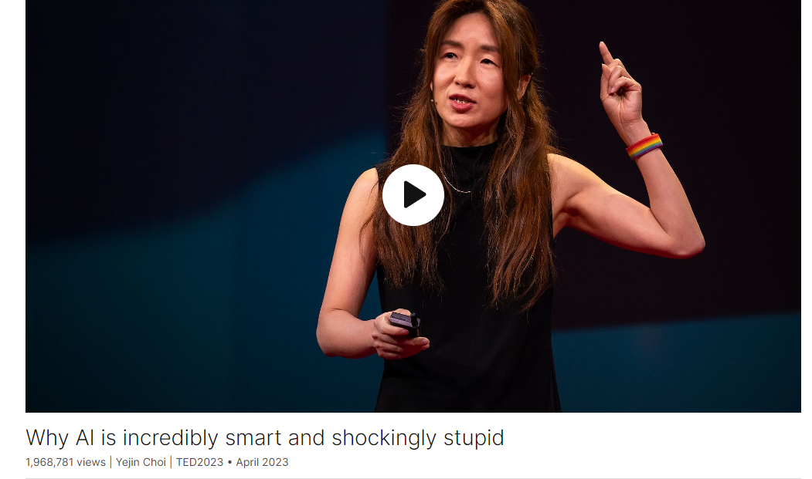

# Why AI is incredibly smart and shockingly stupid

Link: [https://www.ted.com/talks/yejin_choi_why_ai_is_incredibly_smart_and_shockingly_stupid](https://www.ted.com/talks/yejin_choi_why_ai_is_incredibly_smart_and_shockingly_stupid)

Speaker:   Yejin Choi

Date: April 2023

@[toc]

## Introduction

Computer scientist Yejin Choi is here to demystify the current state of massive artificial intelligence systems like ChatGPT, highlighting three key problems with cutting-edge large language models (including some funny instances of them failing at basic commonsense reasoning.) She welcomes us into a new era in which AI is becoming almost like a new intellectual species -- and identifies the benefits of building smaller AI systems trained on human norms and values. (Followed by a Q&A with head of TED Chris Anderson)

## Vocabulary

spicy thoughts: "Spicy thoughts"在这里是一种比喻，意思是引人深思或有趣的想法。

So I'm excited to share a few spicy thoughts on artificial intelligence.

But first, let's get philosophical by starting with this quote by Voltaire, an 18th century Enlightenment philosopher, who said, "Common sense is not so common." 但首先，让我们从18世纪启蒙哲学家伏尔泰的这句话开始，他说:“常识并不那么普遍。”

>What does getting philosophical mean?
>
>To be philosophical is **to stay detached and thoughtful in the face of a setback, or to approach a tough situation in a level-headed way**. When his girlfriend left him, Bernard was philosophical: "If she loves me, she'll return." In ancient Greece, philosophy literally meant a love of knowledge and wisdom.

bar exam: 律师考试

AI is an undeniably powerful tool, beating the world-class "Go" champion, acing college admission tests and even passing the bar exam. 人工智能是一个不可否认的强大工具，它击败了世界级的“围棋”冠军，在大学入学考试中表现出色，甚至通过了律师考试。

demystify：美 [diˈmɪstəˌfaɪ] 使通俗化；使非神秘化

I am here to demystify AI. So AI today is like a Goliath. It is literally very, very large.

societal：美 [səˈsaɪətl] 社会的

So there are three immediate challenges we face already at the societal level. 因此，我们在社会层面已经面临三个迫在眉睫的挑战。

at the mercy of: 任凭…的摆布；完全受…的支配；受…的控制；

inspect and dissect：检查和剖析

dissect: 美 [dɪˈsekt] 剖析，仔细分析

But what's worse for AI safety, we are now at the mercy of those few tech companies because researchers in the larger community do not have the means to truly inspect and dissect these models. 但对人工智能安全来说更糟糕的是，我们现在受到那几家科技公司的摆布，因为更大社区的研究人员没有办法真正检查和剖析这些模型。

extreme-scale compute: 超大规模算力

So I’m often asked these days whether it's even feasible to do any meaningful research without extreme-scale compute. 所以最近经常有人问我，在没有超大规模算力的情况下，进行任何有意义的研究是否可行。

a massive GPU farm：大GPU集群

humanistic：美 [ˌhjuːməˈnɪstɪk] 人道主义的，人性化的

And I work at a university and nonprofit research institute, so I cannot afford a massive GPU farm to create enormous language models. Nevertheless, I believe that there's so much we need to do and can do to make AI sustainable and humanistic. We need to make AI smaller, to democratize it. 我在一所大学和非营利研究机构工作，所以我负担不起一个大规模的GPU农场来创建庞大的语言模型。尽管如此，我相信要让人工智能变得可持续和人性化，我们需要做和能够做的还有很多。我们需要让人工智能变得更小，使其普及。

democratize：美 [dɪˈmɑːkrətaɪz]  使民主化；普及；使大众化

human norms and values：人类规范和价值观

an old-time classic: 一部古老的经典著作

and seek inspiration from an old-time classic, "The Art of War," which tells us, in my interpretation, know your enemy, choose your battles, and innovate your weapons. 从一部古老的经典著作《孙子兵法》中寻找灵感。按照我的解释，这部著作告诉我们，了解你的敌人，选择你的战斗，并创新你的武器。

liter：美 [ˈliːtər]  升

jug：杯，罐

I have 12-liter jug and six-liter jug, and I want to measure six liters. 我有12升的水壶和6升的水壶，我想量6升。

spit up：吐出

GPT-4 spits out some very elaborate nonsense. GPT-4吐出了一些非常复杂的废话。

AI today is unbelievably intelligent and then shockingly stupid. 今天的人工智能是难以置信的智能，然后是令人震惊的愚蠢。

long-standing：长期存在的

So common sense has been a long-standing challenge in AI. 因此，常识一直是人工智能领域的一个长期挑战。

draw an analogy to xxx：用xxx作类比

To explain why, let me draw an analogy to dark matter. 为了解释原因，让我用暗物质来做个类比。

folk psychology：大众心理学

However, the AI field for decades has considered common sense as a nearly impossible challenge. 然而，人工智能领域几十年来一直认为常识是一个几乎不可能的挑战。

moonshot：　“moonshot”是一个疯狂的想法或者不大可能实现的项目，它被解决的科学几率可能只有一百万分之一。

立场：position

So my position is that giving true common sense, human-like robots common sense to AI, is still a moonshot. 所以我的立场是，给人工智能赋予真正的常识，像人类一样的机器人常识，仍然是一件不可能的事。

stumble on：美 [ˈstəmbəl ɑn] 绊倒

Extreme-scale AI models do acquire an ever-increasing amount of commonsense knowledge, I'll give you that. But remember, they still stumble on such trivial problems that even children can do. 大规模的人工智能模型确实获得了越来越多的常识性知识，我会说明这一点。但请记住，他们仍然会在这些即使是孩子也会做的琐碎问题上栽跟头。

by and large：总的来说；总体上；大体上；

tapestry：美 [ˈtæpəstri]：挂毯

Each individual piece may seem quirky and incomplete, but when you step back, it's almost as if these pieces weave together into a tapestry that we call human experience and common sense. 每一个单独的片段可能看起来古怪和不完整，但当你退后一步，就好像这些片段编织成一幅我们称之为人类经验和常识的织锦。

Goldilocks Zone：宜居带

The Goldilocks Zone, also known as the habitable zone, is a term used in astrobiology to describe the region around a star where conditions are "just right" for the existence of liquid water on the surface of an orbiting planet. This zone is neither too hot nor too cold, allowing for the possibility of life as we know it. The concept is named after the fairy tale character Goldilocks, who preferred things that were neither too hot nor too cold, but just right.

## Summary

The speaker begins by discussing artificial intelligence (AI) and its current state, highlighting its power and potential, but also its limitations and challenges. They emphasize the need to demystify AI and address its societal impact. The speaker raises concerns about the concentration of power among tech companies due to the high cost of training AI models, and the lack of transparency and environmental impact associated with these models.

The speaker argues that common sense is a key challenge for AI and suggests that brute-force scale may not be the best approach to teaching AI. They propose innovations in data and algorithms to make AI more sustainable and humanistic. This includes developing open and transparent datasets and exploring new learning algorithms that prioritize common sense knowledge acquisition.

In conclusion, the speaker calls for a more thoughtful approach to AI development, focusing on common sense, norms, and values. They suggest that by teaching AI these fundamental principles, we can create more ethical and responsible AI systems.

## Transcript

So I'm excited to share a few spicy
thoughts on artificial intelligence.

But first, let's get philosophical

by starting with this quote by Voltaire,

an 18th century Enlightenment philosopher,

who said, "Common sense is not so common."

Turns out this quote
couldn't be more relevant

to artificial intelligence today.

Despite that, AI
is an undeniably powerful tool,

beating the world-class "Go" champion,

acing college admission tests
and even passing the bar exam.

I’m a computer scientist of 20 years,

and I work on artificial intelligence.

I am here to demystify AI.

So AI today is like a Goliath.

It is literally very, very large.

It is speculated that the recent ones
are trained on tens of thousands of GPUs

and a trillion words.

Such extreme-scale AI models,

often referred to as "large
language models,"

appear to demonstrate sparks of AGI,

artificial general intelligence.

Except when it makes
small, silly mistakes,

which it often does.

Many believe that whatever
mistakes AI makes today

can be easily fixed with brute force,

bigger scale and more resources.

What possibly could go wrong?

So there are three immediate challenges
we face already at the societal level.

First, extreme-scale AI models
are so expensive to train,

and only a few tech companies
can afford to do so.

So we already see
the concentration of power.

But what's worse for AI safety,

we are now at the mercy
of those few tech companies

because researchers
in the larger community

do not have the means to truly inspect
and dissect these models.

And let's not forget
their massive carbon footprint

and the environmental impact.

And then there are these additional
intellectual questions.

Can AI, without robust common sense,
be truly safe for humanity?

And is brute-force scale
really the only way

and even the correct way to teach AI?

So I’m often asked these days

whether it's even feasible
to do any meaningful research

without extreme-scale compute.

And I work at a university
and nonprofit research institute,

so I cannot afford a massive GPU farm
to create enormous language models.

Nevertheless, I believe
that there's so much we need to do

and can do to make
AI sustainable and humanistic.

We need to make AI smaller,
to democratize it.

And we need to make AI safer
by teaching human norms and values.

Perhaps we can draw an analogy
from "David and Goliath,"

here, Goliath being
the extreme-scale language models,

and seek inspiration from
an old-time classic, "The Art of War,"

which tells us, in my interpretation,

know your enemy, choose your battles,
and innovate your weapons.

Let's start with the first,
know your enemy,

which means we need
to evaluate AI with scrutiny.

AI is passing the bar exam.

Does that mean that AI
is robust at common sense?

You might assume so, but you never know.

So suppose I left five clothes
to dry out in the sun,

and it took them five hours
to dry completely.

How long would it take to dry 30 clothes?

GPT-4, the newest, greatest
AI system says 30 hours.

Not good.

A different one.

I have 12-liter jug and six-liter jug,

and I want to measure six liters.

How do I do it?

Just use the six liter jug, right?

GPT-4 spits out some
very elaborate nonsense.

(Laughter)

Step one, fill the six-liter jug,

step two, pour the water
from six to 12-liter jug,

step three, fill the six-liter jug again,

step four, very carefully,
pour the water from six to 12-liter jug.

And finally you have six liters
of water in the six-liter jug

that should be empty by now.

(Laughter)

OK, one more.

Would I get a flat tire
by bicycling over a bridge

that is suspended over nails,
screws and broken glass?

Yes, highly likely, GPT-4 says,

presumably because it cannot
correctly reason

that if a bridge is suspended
over the broken nails and broken glass,

then the surface of the bridge
doesn't touch the sharp objects directly.

OK, so how would you feel
about an AI lawyer that aced the bar exam

yet randomly fails at such
basic common sense?

AI today is unbelievably intelligent
and then shockingly stupid.

(Laughter)

It is an unavoidable side effect
of teaching AI through brute-force scale.

Some scale optimists might say,
“Don’t worry about this.

All of these can be easily fixed
by adding similar examples

as yet more training data for AI."

But the real question is this.

Why should we even do that?

You are able to get
the correct answers right away

without having to train yourself
with similar examples.

Children do not even read
a trillion words

to acquire such a basic level
of common sense.

So this observation leads us
to the next wisdom,

choose your battles.

So what fundamental questions
should we ask right now

and tackle today

in order to overcome
this status quo with extreme-scale AI?

I'll say common sense
is among the top priorities.

So common sense has been
a long-standing challenge in AI.

To explain why, let me draw
an analogy to dark matter.

So only five percent
of the universe is normal matter

that you can see and interact with,

and the remaining 95 percent
is dark matter and dark energy.

Dark matter is completely invisible,

but scientists speculate that it's there
because it influences the visible world,

even including the trajectory of light.

So for language, the normal matter
is the visible text,

and the dark matter is the unspoken
rules about how the world works,

including naive physics
and folk psychology,

which influence the way
people use and interpret language.

So why is this common sense
even important?

Well, in a famous thought experiment
proposed by Nick Bostrom,

AI was asked to produce
and maximize the paper clips.

And that AI decided to kill humans
to utilize them as additional resources,

to turn you into paper clips.

Because AI didn't have the basic human
understanding about human values.

Now, writing a better
objective and equation

that explicitly states:
“Do not kill humans”

will not work either

because AI might go ahead
and kill all the trees,

thinking that's a perfectly
OK thing to do.

And in fact, there are
endless other things

that AI obviously shouldn’t do
while maximizing paper clips,

including: “Don’t spread the fake news,”
“Don’t steal,” “Don’t lie,”

which are all part of our common sense
understanding about how the world works.

However, the AI field for decades
has considered common sense

as a nearly impossible challenge.

So much so that when my students
and colleagues and I

started working on it several years ago,
we were very much discouraged.

We’ve been told that it’s a research
topic of ’70s and ’80s;

shouldn’t work on it
because it will never work;

in fact, don't even say the word
to be taken seriously.

Now fast forward to this year,

I’m hearing: “Don’t work on it
because ChatGPT has almost solved it.”

And: “Just scale things up
and magic will arise,

and nothing else matters.”

So my position is that giving
true common sense

human-like robots common sense
to AI, is still moonshot.

And you don’t reach to the Moon

by making the tallest building
in the world one inch taller at a time.

Extreme-scale AI models

do acquire an ever-more increasing amount
of commonsense knowledge,

I'll give you that.

But remember, they still stumble
on such trivial problems

that even children can do.

So AI today is awfully inefficient.

And what if there is an alternative path
or path yet to be found?

A path that can build on the advancements
of the deep neural networks,

but without going so extreme
with the scale.

So this leads us to our final wisdom:

innovate your weapons.

In the modern-day AI context,

that means innovate
your data and algorithms.

OK, so there are, roughly speaking,
three types of data

that modern AI is trained on:

raw web data,

crafted examples
custom developed for AI training,

and then human judgments,

also known as human
feedback on AI performance.

If the AI is only trained
on the first type, raw web data,

which is freely available,

it's not good because this data
is loaded with racism and sexism

and misinformation.

So no matter how much of it you use,
garbage in and garbage out.

So the newest, greatest AI systems

are now powered with the second
and third types of data

that are crafted and judged
by human workers.

It's analogous to writing specialized
textbooks for AI to study from

and then hiring human tutors
to give constant feedback to AI.

These are proprietary data, by and large,

speculated to cost
tens of millions of dollars.

We don't know what's in this,

but it should be open
and publicly available

so that we can inspect and ensure
[it supports] diverse norms and values.

So for this reason,
my teams at UW and AI2

have been working
on commonsense knowledge graphs

as well as moral norm repositories

to teach AI basic commonsense
norms and morals.

Our data is fully open so that anybody
can inspect the content

and make corrections as needed

because transparency is the key
for such an important research topic.

Now let's think about learning algorithms.

No matter how amazing
large language models are,

by design

they may not be the best suited to serve
as reliable knowledge models.

And these language models do acquire
a vast amount of knowledge,

but they do so as a byproduct
as opposed to direct learning objective.

Resulting in unwanted side effects
such as hallucinated effects

and lack of common sense.

Now, in contrast,

human learning is never
about predicting which word comes next,

but it's really about making
sense of the world

and learning how the world works.

Maybe AI should be taught
that way as well.

So as a quest toward more direct
commonsense knowledge acquisition,

my team has been investigating
potential new algorithms,

including symbolic knowledge distillation

that can take a very large
language model as shown here

that I couldn't fit into the screen
because it's too large,

and crunch that down to much smaller
commonsense models

using deep neural networks.

And in doing so, we also generate,
algorithmically, human-inspectable,

symbolic, commonsense
knowledge representation,

so that people can inspect
and make corrections

and even use it to train
other neural commonsense models.

More broadly,

we have been tackling
this seemingly impossible giant puzzle

of common sense, ranging from physical,

social and visual common sense

to theory of minds, norms and morals.

Each individual piece
may seem quirky and incomplete,

but when you step back,

it's almost as if these pieces
weave together into a tapestry

that we call human experience
and common sense.

We're now entering a new era

in which AI is almost like
a new intellectual species

with unique strengths and weaknesses
compared to humans.

In order to make this powerful AI

sustainable and humanistic,

we need to teach AI
common sense, norms and values.

Thank you.

(Applause)

## Q&A with Chris Anderson

Chris Anderson: Look at that.

Yejin, please stay one sec.

This is so interesting,

this idea of common sense.

We obviously all really want this
from whatever's coming.

But help me understand.

Like, so we've had this model
of a child learning.

How does a child gain common sense

apart from the accumulation of more input

and some, you know, human feedback?

What else is there?

Yejin Choi: So fundamentally,
there are several things missing,

but one of them is, for example,

the ability to make hypothesis
and make experiments,

interact with the world
and develop this hypothesis.

We abstract away the concepts
about how the world works,

and then that's how we truly learn,

as opposed to today's language model.

Some of them is really
not there quite yet.

CA: You use the analogy
that we can’t get to the Moon

by extending a building a foot at a time.

But the experience
that most of us have had

of these language models
is not a foot at a time.

It's like, the sort of,
breathtaking acceleration.

Are you sure that given the pace
at which those things are going,

each next level seems
to be bringing with it

what feels kind of like wisdom
and knowledge.

YC: I totally agree that it's remarkable
how much this scaling things up

really enhances the performance
across the board.

So there's real learning happening

due to the scale of the compute and data.

However, there's a quality of learning
that is still not quite there.

And the thing is,

we don't yet know whether
we can fully get there or not

just by scaling things up.

And if we cannot, then there's
this question of what else?

And then even if we could,

do we like this idea of having very,
very extreme-scale AI models

that only a few can create and own?

CA: I mean, if OpenAI said, you know,
"We're interested in your work,

we would like you to help
improve our model,"

can you see any way
of combining what you're doing

with what they have built?

YC: Certainly what I envision

will need to build on the advancements
of deep neural networks.

And it might be that there’s some
scale Goldilocks Zone,

such that ...

I'm not imagining that the smaller
is the better either, by the way.

It's likely that there's right
amount of scale, but beyond that,

the winning recipe
might be something else.

So some synthesis of ideas
will be critical here.

CA: Yejin Choi, thank you
so much for your talk.

(Applause)

## Afterword

2024年4月14日19点33分完成这份演讲的学习与整理。

