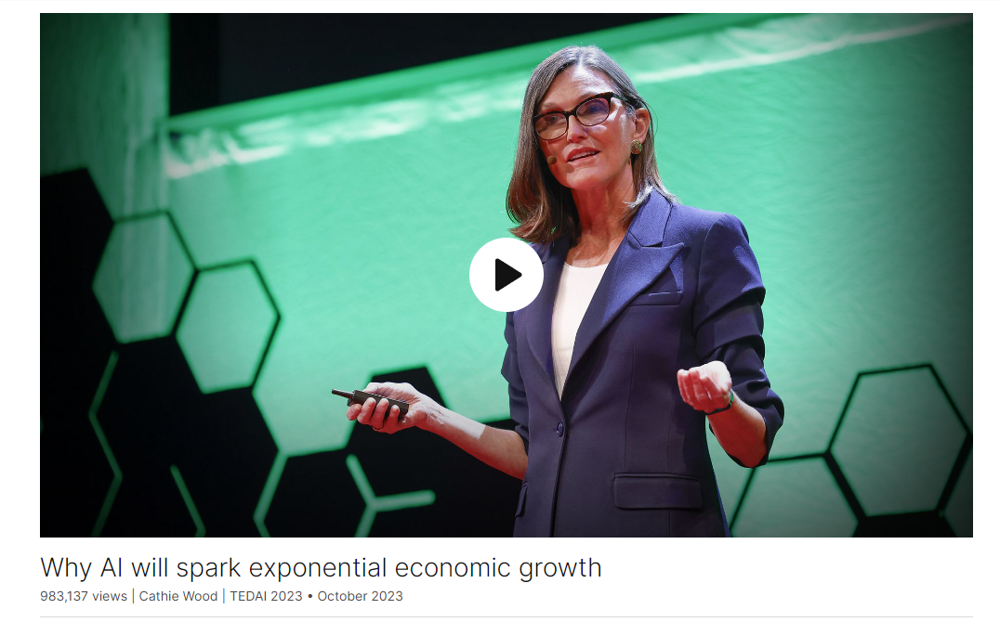
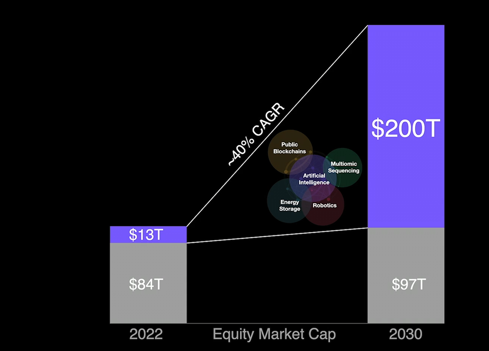

# TED英文文稿

@[toc]

# Why AI will spark exponential economic growth

Link: [https://www.ted.com/talks/cathie_wood_why_ai_will_spark_exponential_economic_growth?](https://www.ted.com/talks/cathie_wood_why_ai_will_spark_exponential_economic_growth?)

Speaker: Cathie Wood

Date: October 2023

## Introduction

Investor Cathie Wood explores this unique moment in technology, which she sees as being marked by the simultaneous evolution of five pivotal innovation platforms — a scenario unparalleled in history. Exploring the role of AI in reshaping economic paradigms, she predicts a surge in global GDP growth and productivity, underscoring the need for businesses and investors to adapt in order to keep up.

## Vocabulary

convergence：美 [kənˈvɜːrdʒəns] 汇集，相交

automobile:美 [ˈɔːtəməbiːl] 汽车，注意发音

multiomic sequencing:

多组学测序（multiomic sequencing）是一种综合利用多种组学技术（如基因组学、转录组学、蛋白质组学等）来研究生物体的方法。通过同时分析多种组学水平的数据，研究人员可以更全面地了解生物体内部的复杂生物学过程，包括基因表达调控、蛋白质功能和代谢途径等。这种方法在生物医学研究、生物信息学和系统生物学等领域得到广泛应用，有助于揭示生物体内部的复杂性和互动性。

nomimal: 美 [ˈnɑːmɪnl]  名义上的

nominal GDP growth：名义GDP增长

bust：美 [bʌst] 经济不景气时期

"bust" 指的是经济泡沫破裂或者经济衰退的状态。在这种情况下，"tech and telecom bust" 指的是科技和电信行业泡沫破裂和经济衰退的时期。

And still again, after the tech and telecom bust, we're back in the same kind of environment where no one believed that growth could be sustained. 同样，在科技和电信泡沫破裂后，我们又回到了同样的环境中，没有人认为增长可以持续。

beneficiary：美 [ˌbenɪˈfɪʃieri]  受益人

explosive growth：爆炸性增长

autonomous: 美 [ɔːˈtɑːnəməs] 自治的

autonomous taxi：自动驾驶出租车

autonomous vehicles：自动驾驶汽车

gross revenue：总收入

**With** productivity **comes** tremendous wealth creation. 生产力带来了巨大的财富创造。

But we really do believe that real GDP growth around the world is going to accelerate from that two to three percent range into the six to nine percent range, and a lot of that will be productivity-driven. With productivity comes tremendous wealth creation.但我们确实相信，全球实际GDP增长将从2%至3%的区间加速至6%至9%的区间，其中很大一部分将由生产力驱动。生产力带来了巨大的财富创造。

deflationary: 英 [diːˈfleɪʃənri] 通货紧缩的

Example: We think we're heading into a highly deflationary period. 我们认为我们正在进入一个高度通货紧缩的时期。

monetary policy: 货币政策

jack xxx up: 提高；jack interest rates up 推高利率

And you've got monetary policy focused on lagging indicators of inflation and jacking interest rates up.货币政策聚焦于滞后的通胀指标和推高利率。

funk：美 [fʌŋk] 惊恐，恐慌：this is why the financial markets are in a funk.

supply chain shock：供应链冲击

unwinding：正在放松，正在消退

We went through a massive supply chain shock in the last few years, and we believe that is unwinding. 过去几年，我们经历了大规模的供应链冲击，我们相信这种冲击正在消退。

margin：利润，利润率

falling price：下降的价格

enhance margins：提高利润率

Fed policy is going to ensure that we end up with falling prices, which means margins are falling. Innovation solves problems. AI and these new technologies will enhance margins.美联储的政策将确保我们最终价格下跌，这意味着利润率下降。创新解决问题。人工智能和这些新技术将提高利润率。

disinflationary：反通胀的

In fact, if you get real growth, productivity-driven, real growth, it is disinflationary if not deflationary.事实上，如果你获得真正的增长，生产率驱动的真正增长，即使不是通缩，也是反通胀的。

equity：美 [ˈekwəti] 股票

equity markets：股票市场

discretionary：美 [dɪˈskreʃəneri] 可任意使用的，自由支配的
discretionary time: 自由支配的时间

A lot of young people today spend more than half of their discretionary time online. 今天很多年轻人把一半以上的自由支配时间花在网上。

conviction：美 [kənˈvɪkʃn] 信念

waver：动摇

doubter：美 [daʊtə(r)]  抱怀疑态度的人

Many people ask me, we have a lot of doubters out there, which I think you probably know about, how we maintain our conviction in this kind of forecast. And our conviction has not wavered. 很多人问我，我们有很多怀疑者，我想你可能知道，我们如何在这种预测中保持信念。我们的信念没有动摇。

## Summary

The speaker highlights a unique moment in technological advancement, with five innovation platforms evolving simultaneously, including AI, robotics, energy storage, blockchain, and multiomic sequencing. These platforms are expected to drive exponential growth and productivity, leading to significant economic transformation. The speaker discusses how AI is reducing training costs and enabling generative AI, leading to unprecedented growth opportunities. One example cited is autonomous taxi platforms, which could generate trillions in revenue. The convergence of these platforms is expected to accelerate GDP growth, potentially reaching six to nine percent globally. Despite current concerns about inflation, the speaker believes we are heading into a deflationary period. The transformative power of these technologies is likened to the early days of the internet, with the potential for disruptive innovation across various industries. The speaker emphasizes the importance of embracing change and focusing on long-term opportunities amidst uncertainty.

## Transcript

 

Well, today, something
is happening in technology

that has never happened before.

Five innovation platforms
are evolving at the same time.

Never happened before.

You have to go back to the early 1900s

to see three platforms
evolving at the same time.

You might call them general-purpose
technology platforms.

Back then, it was telephone,
electricity, automobile.

Game-changing.

Well, today we have five innovation
platforms evolving at the same time.

And they're changing
growth dynamics incredibly.

So they are highly catalyzed
by artificial intelligence

as you see here.

But robotics, energy storage, AI,

blockchain technology
and multiomic sequencing.

The growth dynamics are changing

in a way, it reminds me,
I got early in the business,

the 1980s,

I was in meetings

where the going assumption was growth,

if it accelerated,

it would decay very quickly
back down to nominal GDP growth.

And that was a function of the horrors
we had been through in the '70s.

So it was very hard
to get investors to believe

that there were companies out there

that were going to help
generate productivity growth

and actually have sustained growth rates.

We get into the internet time,

and we begin this experiment with AI:

recommendation engines, predictive AI,

some people would say “pretend AI.”

And still again, after the tech
and telecom bust,

we're back in the same kind of environment

where no one believed
that growth could be sustained.

And of course, the poster child
became Amazon --

20-25 percent compound annual growth rates

over 20-25 years.

So it was possible.

And by the end of all of this,
and actually today,

many people do believe in the FAANGs

and that growth will be sustained forever.

And yet we're in another transformation.

We're into real AI.

So generative AI.

And we're also seeing these platforms,

these general-purpose technology
platforms, converge.

So AI, and I know you're hearing
a lot about it here,

according to our work, our chief futurist
Brett Winton and his team,

artificial intelligence training costs
are dropping 70 percent per year.

What used to happen
with Moore's law in two years

is now happening in six months.

We're moving from linear growth,
which was that first,

to this belief that exponential growth,

so sustained rapid growth
in the case of Amazon,

finally believe that,
in the investment community,

the FAANGs are the poster children

we're in this new world
with generative AI,

five platforms converging here.

And investors now think
that those same companies

are going to be the big
beneficiaries this time.

Now, some might, but the history
of technology is, they probably won't.

If you look at technology indices

from, you know,
20 years ago, 30 years ago,

the top 10, even in technology,
are typically not the top 10 today.

I think Microsoft has been
a very big exception to that.

So here we are.

And what does this mean?

Convergence, generative AI.

Well, it means explosive
growth opportunities.

I’m going to give you one example:

autonomous taxi platforms.

Autonomous taxi platforms
are going to be the convergence

of three of these major, general-purpose
technology platforms:

robotics,

autonomous vehicles are robots;

energy storage, they will be electric;

and artificial intelligence,

they will be powered by AI.

This one opportunity, we think,

in the next five to 10 years

is going to scale to a revenue opportunity

of eight to 10 trillion dollars,
from essentially nothing now.

Now for perspective, global GDP today,

all of global GDP today,

is not much more
than 100 trillion dollars.

And here, we're telling you,
in the next five to 10 years,

we're going to see up to 10 trillion
in gross revenues,

with the platform companies
getting half of that.

If the platform companies get
half of that, four to five trillion,

they're probably going to be worth

somewhere in the 20
to 50 trillion-dollar range.

Now, that's just one example
of convergence

and generative AI combining

to create an explosive growth opportunity.

Now, for the economy as a whole,

we believe that GDP growth
is going to accelerate.

Now we've been in an environment

of two to three percent growth
on average for years.

And if you go back in history,

the history of technology

is you get jump starts in growth

to completely new rates of change.

And very often the jump
is between three and five times

what the previous growth rate was.

We think we're in such a time now

because the artificial intelligence

and the convergence of these platforms

is going to generate
enormous productivity growth

the likes of which we have never seen.

So there are today roughly
a billion knowledge workers,

and their wages and compensation,

roughly 32 trillion dollars

around the world.

We think they're going to become
four times more productive.

And typically,

productivity gains result
in rapid growth gains

much lower than expected inflation.

And if we're right,

the GDP growth --

and I know this sounds crazy,

and most people think we’re crazy
when we say things like this --

but we really do believe that real
GDP growth around the world

is going to accelerate from that two
to three percent range

into the six to nine percent range,

and a lot of that will be
productivity-driven.

With productivity comes
tremendous wealth creation.

Productivity can end up in three places.

It can end up in profits.

It can end up in wages going up
as employees become more productive.

And we think that will happen as well.

And/or,

and it's probably all three,

lower prices, deflation.

That’s the other thing I don’t think
people are expecting out there:

deflation.

We think we're heading
into a highly deflationary period.

And all you hear today
is inflation, inflation.

And you've got monetary policy
focused on lagging indicators of inflation

and jacking interest rates up.

So yes, this is why the financial
markets are in a funk.

The Fed believes we're in
an inflation-prone economy like the '70s.

We are not.

We went through a massive
supply chain shock

in the last few years,

and we believe that is unwinding.

And that Fed policy is going to ensure
that we end up with falling prices,

which means margins are falling.

Innovation solves problems.

AI and these new technologies
will enhance margins.

So we think, during this time,

and I think we're seeing it empirically,

that these innovations
are gaining more traction today:

better, faster, cheaper,

more productive, more creative
products and services.

And so we're pretty excited
about the next few years.

And do believe that the Fed
is making a mistake,

that something out there,

we thought it was the regional
bank crisis in early March,

no,

something out there
will telegraph to the Fed,

that the fight now
is not against inflation,

and that real growth is not inflationary.

In fact, if you get real growth,
productivity-driven, real growth,

it is disinflationary if not deflationary.

So we're pretty excited
about the next five to 10 years.

And so what's the bottom line
of all of this,

if we're so excited

and think we're going to get
beyond the macro environment?

So this is what we think
is going to happen

thanks to the convergence of those five

general-purpose technology platforms.

What you see here is a chart,

and the blue part is disruptive
or transformative innovation.

Today, it is valued
in the global equity markets,

both public and private,

at roughly 13 trillion dollars.

That's a little more than 10 percent

of all global equity market valuation.

We believe that is going to scale,

thanks to the convergence
of these platforms

and the explosive growth opportunities
that they will provide,

to more than 200 trillion dollars.

That is a 40 percent compound
annual growth rate.

It's very hard to believe, I know.

In the markets, they do think
we're a little crazy.

But the building blocks
of our confidence here,

comes from our research
around these platforms.

40 percent compound
annual rate of growth

makes sense in the world
of accelerated real GDP,

very low inflation

and very high productivity.

And the number I threw out

just for autonomous taxi platforms
is in that 200 trillion.

It's somewhere,

alone, that one opportunity
is between 20 and 50 trillion dollars.

Now what's the other message
from this chart?

The other message is

that besides disruptive innovation

being a very good place to invest,

is that the other side
of disruptive innovation

is creative destruction.

And we're going to -- I just described
autonomous taxi platforms,

that is going to transform
all of transportation

and mobility completely.

The convergence
of artificial intelligence,

multiomic sequencing

and one the other technologies
underlying, CRISPR gene editing,

is going to transform health care.

We think blockchain technology
and artificial intelligence --

we did a fascinating podcast

on the convergence between those two --

is going to transform not only

the entire financial services sector,

but is going to lead to a whole new area

of property rights in the digital realm.

A lot of young people today

spend more than half
of their discretionary time online.

That's where they're interested
in staking out property rights.

So we're pretty excited
about that as well.

Many people ask me,

we have a lot of doubters out there,

which I think you probably know about,

how we maintain our conviction
in this kind of forecast.

And our conviction has not wavered.

In fact, it's increased
over the last five years,

and the numbers have grown larger

because of the breakthroughs in AI

that we didn't even expect
to happen this quickly.

The courage of our conviction
comes from our research.

First principles research,

white sheet of paper,

you know, how is this
new world going to work?

So as I say, make sure,

given all the creative destruction

that there is going to be out there,

to get on the right side of change
and hang on for the ride.

Ignore the noise.

Because truth will win out, 
and the opportunities are enormous.

Thank you.

(Applause)

