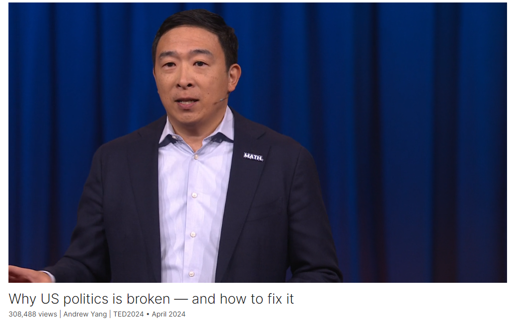

# Why US politics is broken — and how to fix it

Link: [https://www.ted.com/talks/andrew_yang_why_us_politics_is_broken_and_how_to_fix_it?](https://www.ted.com/talks/andrew_yang_why_us_politics_is_broken_and_how_to_fix_it?)

Speaker:  Andrew Yang

Date: April 2024

@[toc]

## Introduction

The electoral system in the United States needs a redesign, says political reformer Andrew Yang. Exposing the flaws of a system built on poor incentives, he proposes a cost-effective overhaul inspired by primary elections already working in places like Alaska and advocates for ranked-choice voting, where voters can choose candidates in order of preference regardless of party, stemming the influence of extreme ideologies.

政治改革家安德鲁-杨（Andrew Yang）说，美国的选举制度需要重新设计。他揭露了建立在不良激励机制基础上的选举制度的弊端，提出了一项具有成本效益的改革方案，其灵感来自于阿拉斯加等地已经开始运作的初选，并倡导排序选择投票，即选民可以按照喜好顺序选择候选人，而无需考虑党派，从而遏制极端意识形态的影响。

## Vocabulary

stem: 遏制

extreme ideologies: 极端意识形态

overhaul: 美 [ˈoʊvərhɔːl ] 拆修；大修；

meth lab: 化学（bingdu）实验室

>"Meth lab" 是 "methamphetamine laboratory" 的缩写，指的是用来制造甲基苯丙胺（methamphetamine）的地方，这是一种强烈的药物，通常被称为冰毒（crystal meth）。这种药物的制造通常需要使用一系列危险的化学物质和程序，因此这些实验室经常存在严重的安全和健康风险，不仅对制造者本身有危害，也对周围环境和社区造成潜在威胁。因此，比喻某地区或某情况为 "meth lab" 是暗示其充满危险、混乱和不稳定性。在演讲中，Andrew Yang使用这个比喻来形容他对美国政治现状的担忧，暗示其充满了危险并对整个国家构成了潜在威胁。

perverse：美 [pərˈvɜːrs] 反常的；有悖常理的；不合人意的；

what's going wrong with American politics is born of poor and perverse incentives that are related to a design flaw. 美国政治的问题源于与设计缺陷相关的拙劣和反常的激励。

But I went around the US making the case that AI was going to come and change everything and that we needed to evolve our economy, adopting measures like universal basic income, to prepare for the future. 在这里，"make the case" 意思是"提出论据"或"阐述论点"。Andrew Yang说他在美国各地游说，就人工智能将改变一切的观点提出论据，并主张我们需要调整经济，采取措施如实施普遍基本收入，以应对未来的挑战。换句话说，他努力向人们解释和说明人工智能的重要性以及为什么需要做出相应的政策和经济改革。

incumbent： 美 [ɪnˈkʌmbənt] 职责所在的；义不容辞的；在职的；现任者；在任者

House of Representatives： 众议院

What is the re-election rate for incumbent members of the House of Representatives? 现任众议院议员的连任率是多少？

>美国众议院是美国国会的下议院，其职责包括立法、审查和通过法案、审查和批准总统的提名人选、监督政府机构和机构的运作等。以下是有关美国众议院的一些基本信息：
>
>1. **成员构成**：美国众议院由总共435名成员组成，他们代表着美国的各个选区。每个州的代表人数根据人口数量而定，每个州至少有一名代表。众议员的任期为两年。
>
>2. **选举方式**：众议院成员由各自代表的选区选民投票选举产生。选举通常在每两年的11月举行，称为中期选举。任期为两年，所以每届国会众议院的成员都需要重新选举。
>
>3. **职权和责任**：众议院有权主持税收立法、制定预算、通过法案、对总统的弹劾程序进行审查等。众议院还负责选举议长，谁将领导该机构的运作。
>
>4. **领导层**：众议院议长是该机构的领导人，通常来自于占据多数席位的党派。此外，众议院还设有多个委员会，每个委员会负责不同领域的立法和监督工作。
>
>5. **立法程序**：任何法案都必须在众议院和参议院均通过后，才能提交总统签署成为法律。通常，法案会在众议院委员会上进行审查和修改，然后提交到全院投票。
>
>总的来说，美国众议院在美国政府体系中扮演着至关重要的角色，其成员代表着美国各个地区的利益，负责制定法律、监督政府机构和执行立法程序。
>
>The United States House of Representatives, often referred to simply as the House, is the lower chamber of the United States Congress. Here are some key points about the House:
>
>1. **Composition**: The House consists of 435 members, each representing a congressional district. The number of representatives per state is determined by its population, with each state guaranteed at least one representative. Members of the House serve two-year terms.
>
>2. **Election**: Members of the House are elected by the voters in their respective districts. Elections are typically held every two years in November, known as midterm elections. Representatives must stand for reelection every two years, so each session of Congress sees a turnover of members.
>
>3. **Powers and Responsibilities**: The House has the power to initiate revenue-related bills, pass legislation, approve the federal budget, and conduct impeachment proceedings against the President. The Speaker of the House, who is usually a member of the majority party, presides over the House proceedings.
>
>4. **Leadership**: In addition to the Speaker, the House leadership includes majority and minority leaders, majority and minority whips, and various committee chairs. These leaders play crucial roles in guiding legislative priorities and coordinating party strategies.
>
>5. **Legislative Process**: Any bill must pass both the House and the Senate before it can be sent to the President for approval. Bills typically go through committee review and markup before being brought to the House floor for a vote by all members.
>
>Overall, the United States House of Representatives plays a vital role in the American system of government, representing the interests of diverse constituencies, enacting laws, overseeing government agencies, and shaping the legislative agenda.

disparate: 美 [ˈdɪspərət] 不同的

So how can these numbers be so disparate? 那么这些数字怎么会如此不同呢？

vote is cast：投票

cast：投，抛

You know which party is going to represent you before a single vote is cast. 在投票之前你就知道哪个政党会代表你。

impeach：弹劾

>"Impeach" 是指对官员进行弹劾，通常指的是对政府高级官员（如总统、副总统、联邦法官等）提出正式指控，指控其在职期间犯有严重错误、违反法律或背离公职责任。弹劾程序通常由立法机构（如国会）发起，并可能导致被弹劾者面临法律处罚，包括罢免、移除公职、起诉或其他制裁。

linger: 美 [ˈlɪŋɡər] 继续存留

fester：美 [ˈfɛstər] 腐烂；恶化；激化

What happens if they let the problem linger and fester? 如果他们让这个问题继续存在并恶化下去会发生什么？

ballot：美 [ˈbælət] 投票表决；选票；

primary: 党内初选

general election：大选

red-leaning state：倾向于红色的州

Sarah Palin probably wins the Republican primary and then probably wins the general election because Alaska is a red-leaning state. 萨拉·佩林可能赢得共和党初选，然后可能赢得大选，因为阿拉斯加是一个倾向于红色的州。

>在美国政治中，primary 是指党内初选，是由政党举办的选举，用于选出该政党在总统选举或其他选举中的候选人。在 primary 中，党员可以投票选择自己支持的候选人，以确定该党的正式候选人。在这种情况下，"Republican primary" 指的是共和党的党内初选，用来选择共和党在选举中的候选人。

>美国的红蓝州是指在总统选举中，通常倾向于支持共和党（红色）或民主党（蓝色）的州。这种颜色编码是由电视网络和媒体普及开来的，用于在选举夜对选举结果进行可视化呈现。通常来说，共和党在南部和内陆地区更有支持，因此这些州被标记为红色，而民主党在东北部、西海岸和城市地区更有支持，因此这些州被标记为蓝色。

base voter

>"base voter" 指的是某政党中最忠诚、最核心的选民群体，他们通常对该政党持有强烈的政治立场和支持态度。这些选民往往是党内最活跃、最投入的成员，他们对于党派的政治议程和价值观持有高度认同，并在选举中坚定地支持自己所属的政党候选人。在美国政治中，共和党的基础选民通常包括保守派、基督教右翼和乡村居民，而民主党的基础选民则通常包括少数族裔、女性、年轻人和城市居民。

## Transcript

It's great to be here.

I'm Andrew Yang,

I'm going to be talking about why
American politics are not working

and then how to fix them,
all within ten minutes.

What do you all think?

Yes.

I'm speaking here in Canada,

and a friend in Canada
described living here,

or he compared it to living
in the apartment above a meth lab.

(Laughter)

Where he's getting very nervous
about what's happening below him,

and it's starting to concern
the entire neighborhood.

I'm going to suggest that what's going
wrong with American politics

is born of poor and perverse incentives
that are related to a design flaw.

Now, this design flaw
can happily be addressed

at only two percent of the cost

of how much the two major parties
are going to pour

into this presidential cycle.

This is, to me, the highest
leverage opportunity in the world

to start solving some
of our biggest problems.

Now some of you may remember me
as the “math guy” from four years ago.

So there will be some math
in this presentation.

But I went around the US making the case

that AI was going to come
and change everything

and that we needed to evolve our economy,

adopting measures like universal basic
income, to prepare for the future.

I founded an organization,
Humanity Forward,

that is still working
on these ideas today,

but I came to realize that nothing
profound and positive

will come out of the American government

unless we realign the incentives
within the system.

So what do I mean by these incentives?

What is the approval rating of US
Congress as we're here together?

And feel free to shout out a number
even if you are not American.

I'm anchoring you low
so you know it's low.

(Audience laughing and talking)

I'm hearing 30,

I'm hearing 20.

It is lower still, it is 15 percent.

It's been declining a bit,
it's been in the 20s.

Now it's around 15 percent.

What is the re-election rate
for incumbent members

of the House of Representatives?

Anchoring you high.

You know it's high.

It's higher still, it's 94 percent.

That’s a higher win rate than
the Michael Jordan-era Chicago Bulls,

The Kevin Durant-era
Golden State Warriors.

So how can these numbers be so disparate?

It turns out that 90 percent
of the congressional districts

in the United States
are drawn to be either blue or red.

And the Americans here know
what I'm talking about.

You know which party
is going to represent you

before a single vote is cast.

So what people imagine

is that our leaders have to make
51 percent of us happy

in order to stay in office.

The truth is that only about 10
to 12 percent of voters

participate in these primaries,

and these voters tend to include
some of the most ideological or extreme

of the bases of these parties.

I have met many base voters,
and let me just say they have ...

let's call them specific points of view.

(Laughter)

So how can you lose
your job in this system

if you essentially cannot lose
the general election?

You can expire.

That's one possibility.

But the other is that you get
on the wrong side of these base voters.

And there were 10
Republican House members

who voted to impeach
Donald Trump after January 6.

How many of them made it back
through their primaries?

Two.

In a system where you have
a 94 percent incumbent reelect rate,

only two out of 10 Republicans
made it back to the primaries

if they ran afoul of their base.

So the fiction that most Americans
have been told is, look,

our leaders have to make
51 percent of us happy.

The reality is that they
have to stay on the good side

of approximately 10 percent
of their party's base voters.

So this tends to bring people
a bit to the sides,

it changes their incentives.

This is one reason why America's
political parties feel

like they're not listening
to a lot of the public.

So you have the party primaries

that are stretching us
toward the extremes.

Then you have our media organizations

that are separating us
into tribes and teams.

You know which team's media
you're watching at any moment.

And then you have social media
pouring gasoline on the whole thing.

And if you had to put numbers on this,
you can imagine the power of these forces.

And they're getting stronger, not weaker.

What do you all think?

This is a reasonable summary?

So it's gotten to the point now
where a US senator said this.

He said, "A problem is now worth more
to us unaddressed than addressed."

What happens if some brave legislators
lean across the aisle

and try to compromise and find a solution
to a big, hairy problem?

They worked with the enemy,
they're ideologically impure,

their base turns on them,
and their job security goes down.

What happens if they let
the problem linger and fester?

Nothing.

They can raise money, they can get votes,
they can get you mad.

And they have a 94 percent
re-election rate.

So you can put any major
problem in this bucket.

And this is why it feels like
we're not making meaningful progress.

You could put immigration in there,

you could put climate change in there,

you could put AI in there,
you could put poverty in there.

So have I managed to depress you all
in about five minutes?

Believe it or not, I'm actually now going
to get us all the way out of this

in the next five.

There is a real solution
to this situation,

and I want to give credit
to Katherine Gehl and Michael Porter,

who co-wrote the book
"The Politics Industry"

who make this case.

So Alaska in 2020
changed its primary process

to make it so that candidates run
in one primary from any party,

and then the winner is chosen
via ranked choice voting.

This is an Alaskan ballot, and you can
choose up to four candidates,

first, second, third, fourth choice.

I’m going to take a couple of minutes
just to review for the non-Americans,

and maybe some Americans here,
how the primary process ordinarily works.

So the way it works is that you have
people running in each party.

You have nominees who are chosen,

and then the nominees run
against each other.

And the party that is dominant
in that district wins.

And as we saw, in 90 percent
of the districts,

you know which party is going to win
that general election.

In this new system in Alaska,

that was changed in 2020,

now you have the top
four candidates of any party

get through to the general election,

and then they are chosen
via ranked choice voting,

which we're going to go into
an illustration of right now.

So this change was made in 2020,

it applied in 2022.

How many of you have heard of Sarah Palin?

Somehow worldwide.

How many of you have heard
of Mary Peltola?

Mary Peltola is the relatively
anonymous state legislator

who defeated Sarah Palin
for a congressional seat in 2022.

Now in a conventional system,

Sarah Palin probably wins
the Republican primary

and then probably wins
the general election

because Alaska is a red-leaning state.

But in this new system,
via ranked choice voting,

Mary Peltola ends up emerging
as the winner in the second round,

in part because a critical mass
of Alaskan voters put her second.

And in this same cycle, believe it or not,

this is a very important race
because if Sarah Palin had won,

she'd be in DC right now.

There would be a TV camera
presented to her just about every day

and asking her, "Say something crazy,
Sarah, say something crazy."

And then she would say, "Glad to.
That's kind of why I'm here."

She would say something crazy,

and then that would be presented
to the other side and say,

"Did you see the crazy thing Sarah said?

What do you think?"

And that's what would pass for news.

And we'd all be three IQ points
dumber and sadder.

(Laughter and applause)

So this outcome was averted
by this new system.

But of even more importance
was that in the same cycle,

Senator Lisa Murkowski
was up for re-election.

And Senator Lisa Murkowski
has the distinction

of being the only Republican senator
who voted to impeach Donald Trump,

who was up for re-election.

After her impeachment vote,

her favorability rating was measured
at six percent among Alaskan Republicans.

They did not like that impeachment vote.

But there is no party primary
in Alaska anymore,

so she went through
essentially to the general,

and she ended up emerging as the winner

because she was again the second choice

of a critical number of voters.

So this change in Alaska had profound
effects within two years,

and it cost six million dollars
to adopt this reform campaign.

Six million dollars.

You know how much the two parties
are going to spend

this presidential cycle?

10 billion dollars.

I'm going to suggest
that this six million dollars

is the highest impact investment
any of us has ever seen.

And it's evergreen.

It turns out that 25 states
have ballot initiative measures

where you could change
the primaries into this new,

nonpartisan primary

and ranked choice voting combination

that ends up realigning the incentives

away from the extremes
and toward the public.

Nevada voted to approve
the Alaska system in 2022.

That campaign cost a little bit more,

it cost 22 million dollars.

But the advertisement that I thought
put it over the top

was a military veteran looking
at the camera and saying,

"I went overseas to defend
our country for years.

I came back and as an independent,
I can't vote in our primaries.

And I don't think that's right."

53 percent of Nevadans
agreed with that veteran,

even though both major parties
came out against it.

And in November, there are five more
states that are considering

a version of these reforms.

I want you all to imagine six,
eight, 10 US senators

who are all of a sudden
freed of their party primary

and a similar number
of members of Congress.

Do you think that would meaningfully
rationalize American politics

and change them for the better?

(Applause)

That is the vision
that is on the table right now.

And the cost of this,
if you were to adopt these reforms

and try them in 10 states,
not all of them would pass.

Maybe half of them would pass,

but the total cost would
be about 200 million dollars,

which is only two percent
of the 10 billion dollars

that are going to be spent
turning Americans against each other,

making us hate and fear each other
over the next number of months.

How much should be spent
realigning our incentives

so that government actually works?

So it's a political year.

I know there's going to be
a lot of energy in the air,

but if you feel like you are forced
to join one team or the other,

I hope you'll consider joining
team "overhaul the incentives."

Because if enough of us join that team,

then maybe America will start to feel
a little bit more like one team again,

and we can get to work solving
the real problems of this era

and build a future
we can all be excited about.

Thank you all.

(Cheers and applause)

## Summary

Andrew Yang's speech highlights the fundamental flaws within American politics and proposes a solution to address these issues. He begins by illustrating the broken incentives that drive political behavior, emphasizing the disconnect between low congressional approval ratings and high re-election rates for incumbents. Yang argues that the primary system, dominated by a small, ideologically extreme voter base, pushes politicians toward partisan extremes, hindering meaningful progress on critical issues like immigration, climate change, and poverty.

Next, Yang introduces a potential solution based on Alaska's recent electoral reforms, which replace traditional partisan primaries with a single primary open to all candidates, followed by ranked-choice voting in the general election. He describes how this new system promotes moderation and compromise by allowing voters to support candidates across party lines. Yang points out the success of Alaska's reforms in producing more representative outcomes, as evidenced by the defeat of polarizing figures like Sarah Palin and the re-election of Senator Lisa Murkowski despite her unpopular impeachment vote.

In the final segment of his speech, Yang emphasizes the cost-effectiveness and scalability of implementing similar reforms in other states, with the potential to reshape American politics for the better. He urges the audience to support political change by advocating for electoral reform initiatives, highlighting the opportunity to realign incentives, reduce polarization, and promote cooperation in government. Yang concludes by encouraging people to join the movement for political reform, envisioning a future where government works more effectively to address the challenges of the modern era and build a brighter future for all citizens.

## 后记

2024年5月11日16点40分于上海。

