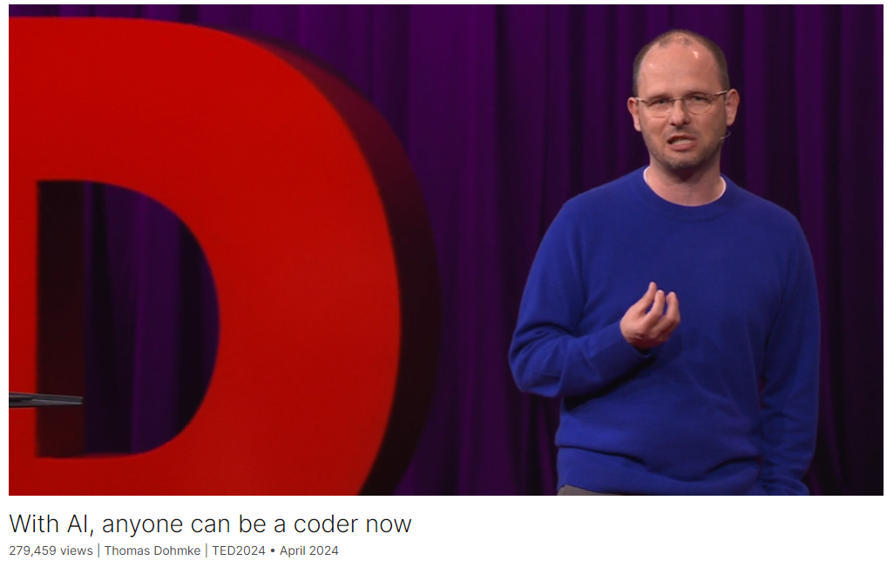

# With AI, anyone can be a coder now

Link: [https://www.ted.com/talks/thomas_dohmke_with_ai_anyone_can_be_a_coder_now](https://www.ted.com/talks/thomas_dohmke_with_ai_anyone_can_be_a_coder_now)

Speaker:  Thomas Dohmke (CEO of GitHub)

Date: April 2024

@[toc]

## Introduction

What if you could code just by talking out loud? GitHub CEO Thomas Dohmke shows how, thanks to AI, the barrier to entry to coding is rapidly disappearing — and creating software is becoming as simple (and joyful) as building LEGO. In a mind-blowing live demo, he introduces Copilot Workspace: an AI assistant that helps you create code when you speak to it, in any language.

## Vocabulary

## Summary

## Transcript

## Afterword

